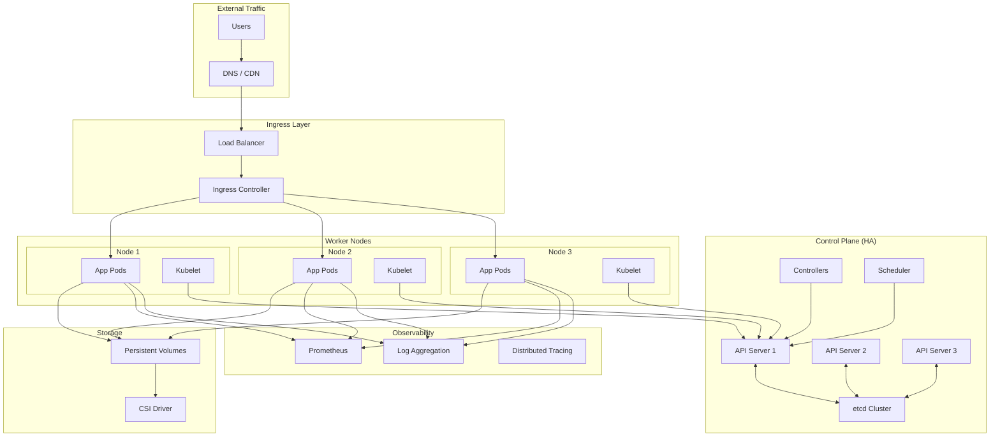
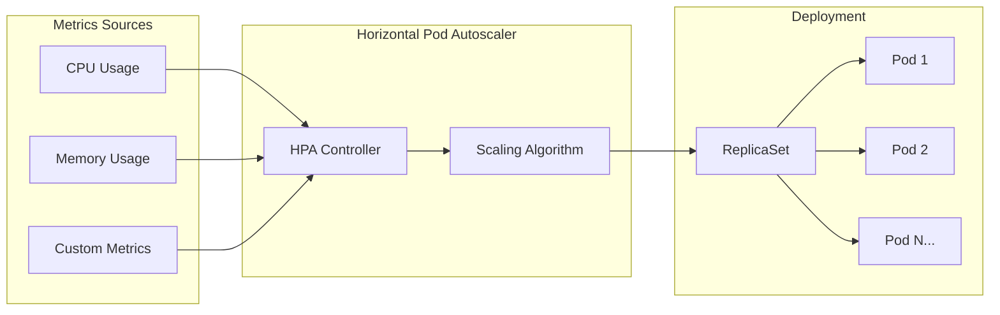
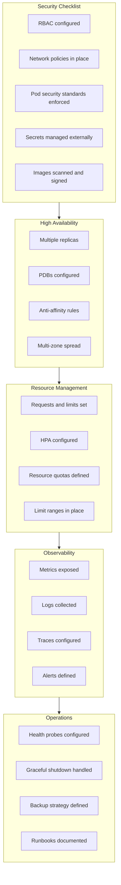

# How to Configure Kubernetes for Production

Author: [nawazdhandala](https://www.github.com/nawazdhandala)

Tags: Kubernetes, Production, DevOps, Infrastructure, Security, High Availability, Scaling, Monitoring

Description: A comprehensive guide to configuring Kubernetes clusters for production workloads, covering security hardening, resource management, high availability, networking, storage, and observability best practices.

---

> Running Kubernetes in production requires careful planning and configuration. A development cluster that works fine on your laptop can fail spectacularly when handling real traffic. Learn how to configure Kubernetes the right way from the start and avoid the common pitfalls that catch teams off guard.

Production Kubernetes clusters need to handle failures gracefully, scale under load, protect sensitive data, and provide visibility into what's happening. Getting these fundamentals right makes the difference between a cluster that runs reliably and one that becomes a constant source of incidents.

---

## Production Architecture Overview

Before diving into configuration details, understanding the overall architecture helps frame the decisions you'll make.



---

## Namespace Strategy and Organization

A well-organized namespace structure keeps your cluster manageable as it grows. Separating concerns by environment, team, or application type makes access control and resource management straightforward.

The following configuration establishes a namespace with proper labels, annotations, and resource quotas that prevent any single namespace from consuming all cluster resources.

```yaml
# namespaces.yaml
# Production namespace structure with proper isolation and resource limits
# Apply with: kubectl apply -f namespaces.yaml

# Application namespace for production workloads
apiVersion: v1
kind: Namespace
metadata:
  name: production
  labels:
    # Used by network policies and pod security
    environment: production
    # Enables monitoring scraping
    monitoring: enabled
    # Pod Security Standards enforcement level
    pod-security.kubernetes.io/enforce: restricted
    pod-security.kubernetes.io/audit: restricted
    pod-security.kubernetes.io/warn: restricted
  annotations:
    # Team ownership for alerting and access control
    team: platform
    # Cost allocation tracking
    cost-center: "12345"
---
# Resource quotas prevent any namespace from starving others
apiVersion: v1
kind: ResourceQuota
metadata:
  name: production-quota
  namespace: production
spec:
  hard:
    # CPU limits across all pods in namespace
    requests.cpu: "20"
    limits.cpu: "40"
    # Memory limits across all pods
    requests.memory: 40Gi
    limits.memory: 80Gi
    # Prevent runaway pod creation
    pods: "100"
    # Limit PVC creation to control storage costs
    persistentvolumeclaims: "20"
    # Control service exposure
    services.loadbalancers: "5"
    services.nodeports: "10"
---
# Limit ranges set defaults and constraints for individual pods
apiVersion: v1
kind: LimitRange
metadata:
  name: production-limits
  namespace: production
spec:
  limits:
    - type: Container
      # Default values if not specified in pod spec
      default:
        cpu: 500m
        memory: 512Mi
      defaultRequest:
        cpu: 100m
        memory: 128Mi
      # Hard limits to prevent resource abuse
      max:
        cpu: "4"
        memory: 8Gi
      min:
        cpu: 50m
        memory: 64Mi
    - type: PersistentVolumeClaim
      # Control storage allocation per PVC
      max:
        storage: 100Gi
      min:
        storage: 1Gi
```

---

## Security Configuration

Security in Kubernetes operates at multiple layers. You need to secure the API, the nodes, the network, and the workloads themselves. The configurations below address each of these layers.

### RBAC Configuration

Role-Based Access Control determines who can do what in your cluster. Following the principle of least privilege, grant only the permissions each user or service actually needs.

```yaml
# rbac.yaml
# Production RBAC configuration following least privilege principle
# Separates read-only access from administrative access

# ClusterRole for read-only cluster-wide access (monitoring, auditing)
apiVersion: rbac.authorization.k8s.io/v1
kind: ClusterRole
metadata:
  name: cluster-reader
rules:
  # Allow reading most resources for observability
  - apiGroups: [""]
    resources: ["pods", "services", "endpoints", "namespaces", "nodes"]
    verbs: ["get", "list", "watch"]
  - apiGroups: ["apps"]
    resources: ["deployments", "replicasets", "statefulsets", "daemonsets"]
    verbs: ["get", "list", "watch"]
  # Explicitly deny access to secrets at cluster level
  # Secrets should be accessed through namespace-scoped roles only
---
# Namespace-scoped role for application developers
# Grants permission to manage application resources without cluster access
apiVersion: rbac.authorization.k8s.io/v1
kind: Role
metadata:
  name: app-developer
  namespace: production
rules:
  # Full control over application workloads
  - apiGroups: ["apps"]
    resources: ["deployments", "statefulsets"]
    verbs: ["get", "list", "watch", "create", "update", "patch", "delete"]
  # Read-only access to pods for debugging
  - apiGroups: [""]
    resources: ["pods", "pods/log"]
    verbs: ["get", "list", "watch"]
  # Allow exec for debugging (consider restricting in high-security environments)
  - apiGroups: [""]
    resources: ["pods/exec"]
    verbs: ["create"]
  # Manage ConfigMaps for application configuration
  - apiGroups: [""]
    resources: ["configmaps"]
    verbs: ["get", "list", "watch", "create", "update", "patch", "delete"]
  # Read secrets but not create/modify (managed by platform team)
  - apiGroups: [""]
    resources: ["secrets"]
    verbs: ["get", "list"]
  # Manage HPA for scaling
  - apiGroups: ["autoscaling"]
    resources: ["horizontalpodautoscalers"]
    verbs: ["get", "list", "watch", "create", "update", "patch", "delete"]
---
# Bind the role to a specific group
apiVersion: rbac.authorization.k8s.io/v1
kind: RoleBinding
metadata:
  name: app-developer-binding
  namespace: production
subjects:
  # Bind to a group managed by your identity provider
  - kind: Group
    name: production-developers
    apiGroup: rbac.authorization.k8s.io
roleRef:
  kind: Role
  name: app-developer
  apiGroup: rbac.authorization.k8s.io
---
# Service account for applications with minimal permissions
apiVersion: v1
kind: ServiceAccount
metadata:
  name: app-service-account
  namespace: production
  annotations:
    # Disable automatic token mounting for security
    # Only mount tokens when explicitly needed
automountServiceAccountToken: false
---
# Role for the application service account
# Only grants permissions the application actually needs
apiVersion: rbac.authorization.k8s.io/v1
kind: Role
metadata:
  name: app-runtime-role
  namespace: production
rules:
  # Application needs to read its own configmaps
  - apiGroups: [""]
    resources: ["configmaps"]
    verbs: ["get", "list", "watch"]
    resourceNames: ["app-config"]  # Limit to specific configmap
  # Read secrets for database credentials
  - apiGroups: [""]
    resources: ["secrets"]
    verbs: ["get"]
    resourceNames: ["app-secrets"]  # Limit to specific secret
```

### Network Policies

Network policies act as firewall rules for pod-to-pod communication. By default, Kubernetes allows all pods to communicate with each other. Production clusters should implement a deny-by-default policy and explicitly allow only necessary traffic.

```yaml
# network-policies.yaml
# Network policies implementing defense in depth
# Requires a CNI that supports NetworkPolicy (Calico, Cilium, etc.)

# Default deny all ingress and egress in the namespace
# Forces explicit allowlisting of all traffic
apiVersion: networking.k8s.io/v1
kind: NetworkPolicy
metadata:
  name: default-deny-all
  namespace: production
spec:
  # Apply to all pods in the namespace
  podSelector: {}
  policyTypes:
    - Ingress
    - Egress
---
# Allow DNS resolution (required for service discovery)
apiVersion: networking.k8s.io/v1
kind: NetworkPolicy
metadata:
  name: allow-dns
  namespace: production
spec:
  podSelector: {}
  policyTypes:
    - Egress
  egress:
    # Allow DNS queries to kube-dns
    - to:
        - namespaceSelector:
            matchLabels:
              kubernetes.io/metadata.name: kube-system
          podSelector:
            matchLabels:
              k8s-app: kube-dns
      ports:
        - protocol: UDP
          port: 53
        - protocol: TCP
          port: 53
---
# Allow frontend to receive external traffic through ingress
apiVersion: networking.k8s.io/v1
kind: NetworkPolicy
metadata:
  name: frontend-ingress
  namespace: production
spec:
  podSelector:
    matchLabels:
      app: frontend
  policyTypes:
    - Ingress
  ingress:
    # Allow traffic from ingress controller namespace
    - from:
        - namespaceSelector:
            matchLabels:
              kubernetes.io/metadata.name: ingress-nginx
      ports:
        - protocol: TCP
          port: 8080
---
# Allow frontend to call backend API
apiVersion: networking.k8s.io/v1
kind: NetworkPolicy
metadata:
  name: frontend-to-backend
  namespace: production
spec:
  podSelector:
    matchLabels:
      app: frontend
  policyTypes:
    - Egress
  egress:
    - to:
        - podSelector:
            matchLabels:
              app: backend
      ports:
        - protocol: TCP
          port: 8080
---
# Allow backend to access database
apiVersion: networking.k8s.io/v1
kind: NetworkPolicy
metadata:
  name: backend-to-database
  namespace: production
spec:
  podSelector:
    matchLabels:
      app: backend
  policyTypes:
    - Ingress
    - Egress
  # Accept connections from frontend
  ingress:
    - from:
        - podSelector:
            matchLabels:
              app: frontend
      ports:
        - protocol: TCP
          port: 8080
  # Allow connections to PostgreSQL in database namespace
  egress:
    - to:
        - namespaceSelector:
            matchLabels:
              kubernetes.io/metadata.name: database
          podSelector:
            matchLabels:
              app: postgresql
      ports:
        - protocol: TCP
          port: 5432
```

### Pod Security Standards

Pod Security Standards replace the deprecated PodSecurityPolicy. They define three levels: privileged, baseline, and restricted. Production workloads should use the restricted profile where possible.

```yaml
# pod-security.yaml
# Secure pod configuration following restricted Pod Security Standards

apiVersion: apps/v1
kind: Deployment
metadata:
  name: secure-app
  namespace: production
spec:
  replicas: 3
  selector:
    matchLabels:
      app: secure-app
  template:
    metadata:
      labels:
        app: secure-app
    spec:
      # Use a dedicated service account with minimal permissions
      serviceAccountName: app-service-account
      # Prevent token auto-mounting unless explicitly needed
      automountServiceAccountToken: false

      # Security context at pod level
      securityContext:
        # Run as non-root user (required by restricted profile)
        runAsNonRoot: true
        runAsUser: 1000
        runAsGroup: 1000
        fsGroup: 1000
        # Prevent privilege escalation via setuid binaries
        seccompProfile:
          type: RuntimeDefault

      containers:
        - name: app
          image: myregistry.io/app:v1.2.3
          # Always use specific image tags, never 'latest'
          imagePullPolicy: IfNotPresent

          # Container-level security context
          securityContext:
            # Run as non-root (redundant but explicit)
            runAsNonRoot: true
            runAsUser: 1000
            # Read-only root filesystem prevents runtime modifications
            readOnlyRootFilesystem: true
            # Prevent privilege escalation
            allowPrivilegeEscalation: false
            # Drop all capabilities and add only what's needed
            capabilities:
              drop:
                - ALL
              # Add specific capabilities only if required
              # add:
              #   - NET_BIND_SERVICE  # Only if binding to ports < 1024

          # Resource limits are mandatory in production
          resources:
            requests:
              cpu: 100m
              memory: 128Mi
            limits:
              cpu: 500m
              memory: 512Mi

          # Health probes for proper lifecycle management
          livenessProbe:
            httpGet:
              path: /health
              port: 8080
            periodSeconds: 10
            failureThreshold: 3
          readinessProbe:
            httpGet:
              path: /ready
              port: 8080
            periodSeconds: 5
            failureThreshold: 3

          # Mount writable directories as emptyDir volumes
          volumeMounts:
            - name: tmp
              mountPath: /tmp
            - name: cache
              mountPath: /app/cache

      # EmptyDir volumes for writable directories
      volumes:
        - name: tmp
          emptyDir: {}
        - name: cache
          emptyDir:
            sizeLimit: 100Mi
```

---

## High Availability Configuration

Production clusters must continue operating when components fail. High availability requires redundancy at every layer and proper configuration to handle failures gracefully.

### Pod Disruption Budgets

Pod Disruption Budgets (PDBs) ensure that voluntary disruptions like node drains don't take down your entire application. They specify the minimum number of pods that must remain available during disruptions.

```yaml
# pdb.yaml
# Pod Disruption Budgets to maintain availability during maintenance

# For stateless applications, specify minimum available
apiVersion: policy/v1
kind: PodDisruptionBudget
metadata:
  name: frontend-pdb
  namespace: production
spec:
  # At least 2 pods must be available at all times
  minAvailable: 2
  selector:
    matchLabels:
      app: frontend
---
# For larger deployments, use percentage-based PDB
apiVersion: policy/v1
kind: PodDisruptionBudget
metadata:
  name: backend-pdb
  namespace: production
spec:
  # At least 75% of pods must be available
  # Useful when replica count varies with HPA
  minAvailable: "75%"
  selector:
    matchLabels:
      app: backend
---
# For stateful applications, limit simultaneous unavailable pods
apiVersion: policy/v1
kind: PodDisruptionBudget
metadata:
  name: database-pdb
  namespace: production
spec:
  # Only one pod can be unavailable at a time
  # Important for quorum-based systems
  maxUnavailable: 1
  selector:
    matchLabels:
      app: postgresql
```

### Pod Anti-Affinity and Topology Spread

Spreading pods across failure domains prevents a single node or zone failure from taking down your entire application.

```yaml
# ha-deployment.yaml
# High availability deployment with proper spread across failure domains

apiVersion: apps/v1
kind: Deployment
metadata:
  name: ha-app
  namespace: production
spec:
  replicas: 6
  selector:
    matchLabels:
      app: ha-app
  template:
    metadata:
      labels:
        app: ha-app
    spec:
      # Spread pods across zones and nodes
      topologySpreadConstraints:
        # Spread across availability zones
        - maxSkew: 1
          topologyKey: topology.kubernetes.io/zone
          whenUnsatisfiable: DoNotSchedule
          labelSelector:
            matchLabels:
              app: ha-app
        # Also spread across nodes within each zone
        - maxSkew: 1
          topologyKey: kubernetes.io/hostname
          whenUnsatisfiable: ScheduleAnyway
          labelSelector:
            matchLabels:
              app: ha-app

      # Anti-affinity to avoid co-locating with same app pods
      affinity:
        podAntiAffinity:
          # Hard requirement: don't schedule on same node as another instance
          requiredDuringSchedulingIgnoredDuringExecution:
            - labelSelector:
                matchExpressions:
                  - key: app
                    operator: In
                    values:
                      - ha-app
              topologyKey: kubernetes.io/hostname
          # Soft preference: try to spread across zones
          preferredDuringSchedulingIgnoredDuringExecution:
            - weight: 100
              podAffinityTerm:
                labelSelector:
                  matchLabels:
                    app: ha-app
                topologyKey: topology.kubernetes.io/zone

      containers:
        - name: app
          image: myregistry.io/ha-app:v1.0.0
          resources:
            requests:
              cpu: 200m
              memory: 256Mi
            limits:
              cpu: "1"
              memory: 1Gi
```

---

## Resource Management and Autoscaling

Proper resource management ensures applications get what they need without starving other workloads. Autoscaling adjusts capacity based on actual demand.



### Horizontal Pod Autoscaler

The following HPA configuration scales based on both CPU and memory, with custom metrics support for more sophisticated scaling decisions.

```yaml
# hpa.yaml
# Horizontal Pod Autoscaler with multiple metrics

apiVersion: autoscaling/v2
kind: HorizontalPodAutoscaler
metadata:
  name: app-hpa
  namespace: production
spec:
  scaleTargetRef:
    apiVersion: apps/v1
    kind: Deployment
    name: backend-app

  # Scaling bounds
  minReplicas: 3
  maxReplicas: 50

  # Multiple metrics for scaling decisions
  metrics:
    # Scale based on CPU utilization
    - type: Resource
      resource:
        name: cpu
        target:
          type: Utilization
          averageUtilization: 70

    # Scale based on memory utilization
    - type: Resource
      resource:
        name: memory
        target:
          type: Utilization
          averageUtilization: 80

    # Scale based on custom metric (requires metrics adapter)
    # Example: requests per second from Prometheus
    - type: Pods
      pods:
        metric:
          name: http_requests_per_second
        target:
          type: AverageValue
          averageValue: "1000"

  # Behavior controls how quickly scaling happens
  behavior:
    # Scale up quickly when needed
    scaleUp:
      stabilizationWindowSeconds: 0  # No delay for scale up
      policies:
        # Scale up by 100% of current replicas per 15 seconds
        - type: Percent
          value: 100
          periodSeconds: 15
        # Or scale up by 4 pods per 15 seconds, whichever is greater
        - type: Pods
          value: 4
          periodSeconds: 15
      selectPolicy: Max

    # Scale down slowly to avoid thrashing
    scaleDown:
      stabilizationWindowSeconds: 300  # Wait 5 minutes before scaling down
      policies:
        # Scale down by 10% per minute
        - type: Percent
          value: 10
          periodSeconds: 60
      selectPolicy: Min
```

### Vertical Pod Autoscaler

VPA automatically adjusts resource requests and limits based on actual usage. Use it in recommendation mode first to understand your workload's needs.

```yaml
# vpa.yaml
# Vertical Pod Autoscaler for automatic resource tuning

apiVersion: autoscaling.k8s.io/v1
kind: VerticalPodAutoscaler
metadata:
  name: app-vpa
  namespace: production
spec:
  targetRef:
    apiVersion: apps/v1
    kind: Deployment
    name: backend-app

  # Update mode options:
  # - "Off": Only provide recommendations
  # - "Initial": Apply only at pod creation
  # - "Auto": Automatically update running pods
  updatePolicy:
    updateMode: "Auto"

  # Resource policy constrains VPA recommendations
  resourcePolicy:
    containerPolicies:
      - containerName: app
        # Minimum resources to request
        minAllowed:
          cpu: 100m
          memory: 128Mi
        # Maximum resources to request
        maxAllowed:
          cpu: "4"
          memory: 8Gi
        # Control which resources VPA manages
        controlledResources:
          - cpu
          - memory
        # Control what VPA updates
        controlledValues: RequestsAndLimits
```

---

## Storage Configuration

Production storage needs to be reliable, performant, and properly backed up. Use storage classes to define different tiers for different workload requirements.

```yaml
# storage-classes.yaml
# Storage classes for different performance tiers

# High-performance SSD storage for databases
apiVersion: storage.k8s.io/v1
kind: StorageClass
metadata:
  name: fast-ssd
provisioner: kubernetes.io/aws-ebs  # Adjust for your cloud provider
parameters:
  type: gp3
  iops: "10000"
  throughput: "500"
  encrypted: "true"
# Retain volumes when PVC is deleted (important for databases)
reclaimPolicy: Retain
# Wait for pod scheduling to provision in correct zone
volumeBindingMode: WaitForFirstConsumer
allowVolumeExpansion: true
---
# Standard storage for general workloads
apiVersion: storage.k8s.io/v1
kind: StorageClass
metadata:
  name: standard
  annotations:
    storageclass.kubernetes.io/is-default-class: "true"
provisioner: kubernetes.io/aws-ebs
parameters:
  type: gp3
  encrypted: "true"
reclaimPolicy: Delete
volumeBindingMode: WaitForFirstConsumer
allowVolumeExpansion: true
---
# StatefulSet with persistent storage
apiVersion: apps/v1
kind: StatefulSet
metadata:
  name: postgresql
  namespace: database
spec:
  serviceName: postgresql
  replicas: 3
  selector:
    matchLabels:
      app: postgresql
  template:
    metadata:
      labels:
        app: postgresql
    spec:
      terminationGracePeriodSeconds: 30
      containers:
        - name: postgresql
          image: postgres:15
          ports:
            - containerPort: 5432
          env:
            - name: POSTGRES_PASSWORD
              valueFrom:
                secretKeyRef:
                  name: postgresql-secrets
                  key: password
            - name: PGDATA
              value: /var/lib/postgresql/data/pgdata
          volumeMounts:
            - name: data
              mountPath: /var/lib/postgresql/data
          resources:
            requests:
              cpu: 500m
              memory: 1Gi
            limits:
              cpu: "2"
              memory: 4Gi
  # VolumeClaimTemplate creates a PVC for each pod
  volumeClaimTemplates:
    - metadata:
        name: data
      spec:
        accessModes:
          - ReadWriteOnce
        storageClassName: fast-ssd
        resources:
          requests:
            storage: 100Gi
```

---

## Ingress and Load Balancing

Ingress controllers route external traffic to your services. Production configuration requires TLS termination, rate limiting, and proper health checks.

```yaml
# ingress.yaml
# Production ingress configuration with TLS and advanced routing

apiVersion: networking.k8s.io/v1
kind: Ingress
metadata:
  name: production-ingress
  namespace: production
  annotations:
    # Ingress class for NGINX ingress controller
    kubernetes.io/ingress.class: nginx

    # TLS configuration
    cert-manager.io/cluster-issuer: letsencrypt-prod

    # Rate limiting to prevent abuse
    nginx.ingress.kubernetes.io/limit-rps: "100"
    nginx.ingress.kubernetes.io/limit-connections: "50"

    # Timeouts for long-running requests
    nginx.ingress.kubernetes.io/proxy-connect-timeout: "10"
    nginx.ingress.kubernetes.io/proxy-read-timeout: "60"
    nginx.ingress.kubernetes.io/proxy-send-timeout: "60"

    # Request body size limit
    nginx.ingress.kubernetes.io/proxy-body-size: "50m"

    # Security headers
    nginx.ingress.kubernetes.io/configuration-snippet: |
      add_header X-Frame-Options "SAMEORIGIN" always;
      add_header X-Content-Type-Options "nosniff" always;
      add_header X-XSS-Protection "1; mode=block" always;
      add_header Referrer-Policy "strict-origin-when-cross-origin" always;

    # Enable CORS if needed
    nginx.ingress.kubernetes.io/enable-cors: "true"
    nginx.ingress.kubernetes.io/cors-allow-origin: "https://myapp.com"
spec:
  # TLS configuration
  tls:
    - hosts:
        - api.myapp.com
        - www.myapp.com
      secretName: myapp-tls

  # Routing rules
  rules:
    - host: api.myapp.com
      http:
        paths:
          - path: /
            pathType: Prefix
            backend:
              service:
                name: backend-api
                port:
                  number: 8080

    - host: www.myapp.com
      http:
        paths:
          - path: /
            pathType: Prefix
            backend:
              service:
                name: frontend
                port:
                  number: 80
---
# Service for backend API
apiVersion: v1
kind: Service
metadata:
  name: backend-api
  namespace: production
  annotations:
    # Health check configuration for cloud load balancers
    service.beta.kubernetes.io/aws-load-balancer-healthcheck-path: /health
    service.beta.kubernetes.io/aws-load-balancer-healthcheck-interval: "10"
spec:
  selector:
    app: backend
  ports:
    - name: http
      port: 8080
      targetPort: 8080
  type: ClusterIP
```

---

## Observability Configuration

Production clusters need comprehensive observability: metrics, logs, and traces. The following configurations set up the foundation for monitoring your cluster and applications.

### Prometheus ServiceMonitor

ServiceMonitors tell Prometheus which services to scrape and how.

```yaml
# monitoring.yaml
# Prometheus ServiceMonitor for application metrics

apiVersion: monitoring.coreos.com/v1
kind: ServiceMonitor
metadata:
  name: backend-metrics
  namespace: production
  labels:
    # Label selector used by Prometheus Operator
    prometheus: main
spec:
  selector:
    matchLabels:
      app: backend
  endpoints:
    - port: metrics
      path: /metrics
      interval: 15s
      # Authentication if metrics endpoint is protected
      # bearerTokenSecret:
      #   name: prometheus-token
      #   key: token
      # TLS configuration
      scheme: http
      # Relabeling to add useful labels
      relabelings:
        - sourceLabels: [__meta_kubernetes_pod_name]
          targetLabel: pod
        - sourceLabels: [__meta_kubernetes_namespace]
          targetLabel: namespace
  namespaceSelector:
    matchNames:
      - production
---
# PrometheusRule for alerting
apiVersion: monitoring.coreos.com/v1
kind: PrometheusRule
metadata:
  name: backend-alerts
  namespace: production
  labels:
    prometheus: main
spec:
  groups:
    - name: backend.rules
      rules:
        # Alert on high error rate
        - alert: HighErrorRate
          expr: |
            sum(rate(http_requests_total{status=~"5..", app="backend"}[5m]))
            / sum(rate(http_requests_total{app="backend"}[5m])) > 0.05
          for: 5m
          labels:
            severity: critical
          annotations:
            summary: "High error rate detected"
            description: "Error rate is {{ $value | humanizePercentage }} for the backend service"

        # Alert on high latency
        - alert: HighLatency
          expr: |
            histogram_quantile(0.95,
              sum(rate(http_request_duration_seconds_bucket{app="backend"}[5m])) by (le)
            ) > 1
          for: 5m
          labels:
            severity: warning
          annotations:
            summary: "High latency detected"
            description: "95th percentile latency is {{ $value | humanizeDuration }}"

        # Alert on pod restarts
        - alert: PodRestarting
          expr: |
            increase(kube_pod_container_status_restarts_total{namespace="production"}[1h]) > 3
          for: 5m
          labels:
            severity: warning
          annotations:
            summary: "Pod restarting frequently"
            description: "Pod {{ $labels.pod }} has restarted {{ $value }} times in the last hour"
```

### Fluent Bit Log Collection

Fluent Bit collects logs from all pods and forwards them to your log aggregation system.

```yaml
# fluent-bit-config.yaml
# Fluent Bit configuration for log collection
# Deploy as ConfigMap used by Fluent Bit DaemonSet

apiVersion: v1
kind: ConfigMap
metadata:
  name: fluent-bit-config
  namespace: logging
data:
  fluent-bit.conf: |
    [SERVICE]
        Flush         5
        Log_Level     info
        Daemon        off
        Parsers_File  parsers.conf

    # Read container logs from all pods
    [INPUT]
        Name              tail
        Tag               kube.*
        Path              /var/log/containers/*.log
        Parser            docker
        DB                /var/log/flb_kube.db
        Mem_Buf_Limit     50MB
        Skip_Long_Lines   On
        Refresh_Interval  10

    # Enrich logs with Kubernetes metadata
    [FILTER]
        Name                kubernetes
        Match               kube.*
        Kube_URL            https://kubernetes.default.svc:443
        Kube_CA_File        /var/run/secrets/kubernetes.io/serviceaccount/ca.crt
        Kube_Token_File     /var/run/secrets/kubernetes.io/serviceaccount/token
        Kube_Tag_Prefix     kube.var.log.containers.
        Merge_Log           On
        Keep_Log            Off
        K8S-Logging.Parser  On
        K8S-Logging.Exclude On
        Labels              On
        Annotations         Off

    # Add fields for easier searching
    [FILTER]
        Name    modify
        Match   kube.*
        Add     cluster production
        Add     environment prod

    # Output to Elasticsearch
    [OUTPUT]
        Name            es
        Match           kube.*
        Host            elasticsearch.logging.svc
        Port            9200
        Logstash_Format On
        Logstash_Prefix kubernetes
        Retry_Limit     5
        Replace_Dots    On
        Trace_Error     On

  parsers.conf: |
    [PARSER]
        Name        docker
        Format      json
        Time_Key    time
        Time_Format %Y-%m-%dT%H:%M:%S.%L
        Time_Keep   On

    [PARSER]
        Name        json
        Format      json
        Time_Key    timestamp
        Time_Format %Y-%m-%dT%H:%M:%S.%L
```

---

## Configuration Management

Managing configuration and secrets properly prevents security incidents and makes deployments reproducible.

### External Secrets Operator

External Secrets Operator syncs secrets from external secret managers (AWS Secrets Manager, HashiCorp Vault, etc.) into Kubernetes secrets.

```yaml
# external-secrets.yaml
# External Secrets configuration for AWS Secrets Manager

# Secret store connection to AWS Secrets Manager
apiVersion: external-secrets.io/v1beta1
kind: ClusterSecretStore
metadata:
  name: aws-secrets-manager
spec:
  provider:
    aws:
      service: SecretsManager
      region: us-west-2
      auth:
        # Use IAM role for service account (IRSA)
        jwt:
          serviceAccountRef:
            name: external-secrets-sa
            namespace: external-secrets
---
# External secret that syncs from AWS Secrets Manager
apiVersion: external-secrets.io/v1beta1
kind: ExternalSecret
metadata:
  name: app-secrets
  namespace: production
spec:
  refreshInterval: 1h  # How often to sync
  secretStoreRef:
    name: aws-secrets-manager
    kind: ClusterSecretStore
  target:
    name: app-secrets  # Name of the Kubernetes Secret to create
    creationPolicy: Owner
  data:
    # Map individual secret keys
    - secretKey: DATABASE_PASSWORD
      remoteRef:
        key: production/database
        property: password
    - secretKey: API_KEY
      remoteRef:
        key: production/api-keys
        property: main-api-key
    - secretKey: JWT_SECRET
      remoteRef:
        key: production/auth
        property: jwt-secret
---
# ConfigMap for non-sensitive configuration
apiVersion: v1
kind: ConfigMap
metadata:
  name: app-config
  namespace: production
data:
  # Application configuration
  LOG_LEVEL: "info"
  MAX_CONNECTIONS: "100"
  CACHE_TTL: "3600"
  FEATURE_FLAGS: |
    {
      "new_dashboard": true,
      "beta_features": false
    }
```

---

## Production Deployment Checklist

Use the following checklist as a reference when deploying to production.



---

## Troubleshooting Common Issues

### Pods Stuck in Pending State

When pods remain in Pending state, the scheduler cannot find a suitable node. Common causes include insufficient resources, node affinity that cannot be satisfied, or PVC provisioning failures.

```bash
# Check why a pod is pending
kubectl describe pod <pod-name> -n production

# Check node resources
kubectl describe nodes | grep -A 5 "Allocated resources"

# Check for taints that might prevent scheduling
kubectl get nodes -o custom-columns=NAME:.metadata.name,TAINTS:.spec.taints
```

### OOMKilled Pods

When pods are killed due to out-of-memory conditions, increase memory limits or investigate memory leaks.

```bash
# Check container exit codes and reasons
kubectl get pods -n production -o jsonpath='{range .items[*]}{.metadata.name}{"\t"}{.status.containerStatuses[*].lastState.terminated.reason}{"\n"}{end}'

# Get memory usage from metrics server
kubectl top pods -n production
```

### Failed Readiness Probes

Failing readiness probes cause traffic to stop flowing to affected pods.

```bash
# Check probe configuration and recent results
kubectl describe pod <pod-name> -n production | grep -A 10 "Readiness"

# Check application logs for errors
kubectl logs <pod-name> -n production --tail=100
```

---

## Conclusion

Configuring Kubernetes for production requires attention to security, high availability, resource management, and observability. Key takeaways from this guide:

- **Security**: Implement RBAC with least privilege, enable network policies, and use Pod Security Standards
- **High Availability**: Use multiple replicas, PDBs, and topology spread constraints
- **Resources**: Always set requests and limits, configure HPA and VPA
- **Observability**: Deploy comprehensive monitoring, logging, and alerting
- **Operations**: Configure proper health probes and graceful shutdown handling

Start with the fundamentals and iterate. A production cluster is never "done" - it evolves with your applications and requirements.

---

*Need to monitor your Kubernetes clusters? [OneUptime](https://oneuptime.com) provides comprehensive infrastructure monitoring with automatic discovery of Kubernetes resources and intelligent alerting.*

**Related Reading:**
- [How to Build Health Checks and Readiness Probes in Python for Kubernetes](https://oneuptime.com/blog/post/2025-01-06-python-health-checks-kubernetes/view)
- [How to Configure MetalLB with Kubernetes and Microk8s](https://oneuptime.com/blog/post/2023-11-06-configure-metallb-with-kubernetes-microk8s/view)
