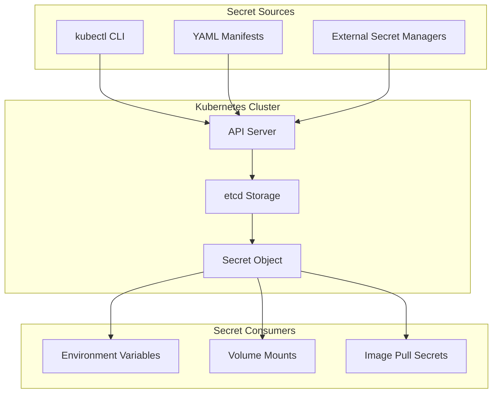
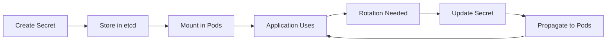
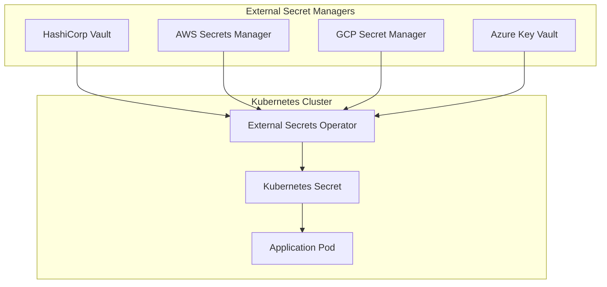
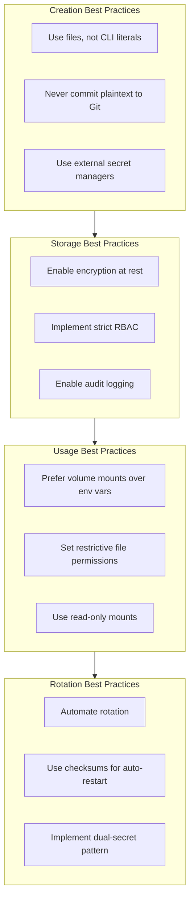

# How to Handle Kubernetes Secrets

Author: [nawazdhandala](https://www.github.com/nawazdhandala)

Tags: Kubernetes, Secrets, Security, DevOps

Description: A comprehensive guide to managing sensitive data in Kubernetes using Secrets. Learn creation methods, mounting strategies, encryption at rest, rotation patterns, external secret managers, and production security best practices.

---

Managing sensitive data in containerized applications is one of the most critical aspects of Kubernetes security. Passwords, API keys, TLS certificates, and OAuth tokens must be handled with care to prevent unauthorized access and data breaches. Kubernetes Secrets provide a native mechanism for storing and distributing sensitive information to your workloads.

This guide covers everything you need to know about Kubernetes Secrets, from basic creation to production-ready security patterns.

## Understanding Kubernetes Secrets

Kubernetes Secrets are objects designed to store sensitive information separately from application code and container images. Unlike ConfigMaps, which are intended for non-sensitive configuration, Secrets are meant for data that requires confidentiality.



### How Secrets Work Internally

When you create a Secret, Kubernetes stores it in etcd. By default, Secrets are stored as base64-encoded strings (not encrypted). When a Pod requests a Secret, the kubelet fetches it from the API server and makes it available to the container either as environment variables or mounted files.

Important distinctions from ConfigMaps:

- Secrets are held in tmpfs on nodes, not written to disk
- Secrets can be encrypted at rest (with proper configuration)
- RBAC can restrict Secret access more granularly
- Secrets have size limits (1MB per Secret)

## Secret Types in Kubernetes

Kubernetes supports several built-in Secret types, each designed for specific use cases. Understanding these types helps you choose the right one for your needs.

The following table shows the available Secret types and their purposes:

| Type | Description |
|------|-------------|
| `Opaque` | Default type for arbitrary user-defined data |
| `kubernetes.io/service-account-token` | Service account tokens |
| `kubernetes.io/dockerconfigjson` | Docker registry credentials |
| `kubernetes.io/basic-auth` | Basic authentication credentials |
| `kubernetes.io/ssh-auth` | SSH authentication credentials |
| `kubernetes.io/tls` | TLS certificate and key pairs |

## Creating Secrets

There are multiple ways to create Secrets in Kubernetes. Choose the method that best fits your workflow and security requirements.

### Method 1: Create from Literal Values

This approach is useful for quick testing but exposes secrets in shell history. Use it only in development environments.

```bash
# Create a Secret with literal key-value pairs
# WARNING: Values appear in shell history - use only for development
kubectl create secret generic db-credentials \
  --from-literal=username=admin \
  --from-literal=password='S3cur3P@ssw0rd!' \
  --namespace=production
```

### Method 2: Create from Files

Reading secrets from files avoids shell history exposure. This is the recommended approach for most scenarios.

First, create files containing your secret values (one value per file, no trailing newlines):

```bash
# Create secret value files (use printf to avoid trailing newline)
printf 'admin' > ./username.txt
printf 'S3cur3P@ssw0rd!' > ./password.txt
```

Then create the Secret from these files:

```bash
# Create Secret from files - each filename becomes a key
kubectl create secret generic db-credentials \
  --from-file=username=./username.txt \
  --from-file=password=./password.txt \
  --namespace=production

# Clean up the plaintext files immediately
rm -f ./username.txt ./password.txt
```

### Method 3: Create from Environment File

For multiple related secrets, an env file keeps things organized. This format uses KEY=VALUE pairs, one per line.

Create an environment file with your secrets:

```bash
# File: secrets.env
# Each line becomes a key-value pair in the Secret
DB_HOST=postgres.production.svc.cluster.local
DB_PORT=5432
DB_USER=app_user
DB_PASSWORD=Pr0duct10nP@ss!
DB_NAME=application_db
```

Create the Secret from the env file:

```bash
# Create Secret from env file
kubectl create secret generic app-secrets \
  --from-env-file=secrets.env \
  --namespace=production
```

### Method 4: Declarative YAML Manifest

For GitOps workflows, you need YAML manifests. Values must be base64-encoded. Never commit unencrypted Secret manifests to version control.

The following manifest creates a Secret with base64-encoded values that you would apply with kubectl:

```yaml
# secrets/db-credentials.yaml
# WARNING: Do not commit this file to Git without encryption (use SOPS, Sealed Secrets, etc.)
apiVersion: v1
kind: Secret
metadata:
  name: db-credentials
  namespace: production
  labels:
    app: myapp
    environment: production
type: Opaque
# Base64-encoded values (use: echo -n 'value' | base64)
data:
  username: YWRtaW4=           # admin
  password: UzNjdXIzUEBzc3cwcmQh  # S3cur3P@ssw0rd!
```

Generate base64 values properly without trailing newlines:

```bash
# Generate base64 values (use -n to avoid newline)
echo -n 'admin' | base64
# Output: YWRtaW4=

echo -n 'S3cur3P@ssw0rd!' | base64
# Output: UzNjdXIzUEBzc3cwcmQh
```

### Method 5: Using stringData (Plaintext in Manifest)

The stringData field accepts plaintext values that Kubernetes automatically encodes. This is convenient but still requires encryption before committing to Git.

```yaml
# secrets/api-keys.yaml
# stringData values are automatically base64-encoded when applied
apiVersion: v1
kind: Secret
metadata:
  name: api-keys
  namespace: production
type: Opaque
stringData:
  stripe-api-key: sk_live_xxxxxxxxxxxxx
  sendgrid-api-key: SG.xxxxxxxxxxxxx
  github-token: ghp_xxxxxxxxxxxxx
```

### Creating TLS Secrets

TLS Secrets store certificate and private key pairs for HTTPS termination. Kubernetes validates the certificate format.

```bash
# Create TLS Secret from certificate and key files
kubectl create secret tls app-tls-cert \
  --cert=./tls.crt \
  --key=./tls.key \
  --namespace=production
```

The equivalent YAML manifest with base64-encoded certificate data:

```yaml
# secrets/tls-secret.yaml
apiVersion: v1
kind: Secret
metadata:
  name: app-tls-cert
  namespace: production
type: kubernetes.io/tls
data:
  tls.crt: LS0tLS1CRUdJTi...  # base64-encoded certificate
  tls.key: LS0tLS1CRUdJTi...  # base64-encoded private key
```

### Creating Docker Registry Secrets

Image pull secrets authenticate with private container registries. These are required when your images are stored in private repositories.

```bash
# Create Docker registry Secret for private image pulls
kubectl create secret docker-registry registry-credentials \
  --docker-server=ghcr.io \
  --docker-username=myuser \
  --docker-password=ghp_token_here \
  --docker-email=user@example.com \
  --namespace=production
```

## Using Secrets in Pods

Once created, Secrets can be consumed by Pods in two primary ways: as environment variables or as mounted volumes.

### Consuming Secrets as Environment Variables

Environment variables are the simplest approach but have security implications since they may appear in logs or process listings.

The following Deployment injects database credentials as environment variables from a Secret:

```yaml
# deployments/app.yaml
apiVersion: apps/v1
kind: Deployment
metadata:
  name: myapp
  namespace: production
spec:
  replicas: 3
  selector:
    matchLabels:
      app: myapp
  template:
    metadata:
      labels:
        app: myapp
    spec:
      containers:
        - name: app
          image: myapp:v1.0.0
          # Individual Secret keys as environment variables
          env:
            # Map specific keys from Secret to env vars
            - name: DATABASE_USER
              valueFrom:
                secretKeyRef:
                  name: db-credentials
                  key: username
            - name: DATABASE_PASSWORD
              valueFrom:
                secretKeyRef:
                  name: db-credentials
                  key: password
```

To inject all keys from a Secret as environment variables at once, use envFrom:

```yaml
# deployments/app-envfrom.yaml
apiVersion: apps/v1
kind: Deployment
metadata:
  name: myapp
  namespace: production
spec:
  replicas: 3
  selector:
    matchLabels:
      app: myapp
  template:
    metadata:
      labels:
        app: myapp
    spec:
      containers:
        - name: app
          image: myapp:v1.0.0
          # Inject ALL keys from Secret as env vars
          envFrom:
            - secretRef:
                name: app-secrets
              # Optional: add prefix to all keys
              prefix: APP_
```

### Consuming Secrets as Volume Mounts

Volume mounts are more secure than environment variables. Secrets appear as files in the container filesystem, and updates propagate automatically (with a delay).

```yaml
# deployments/app-volumes.yaml
apiVersion: apps/v1
kind: Deployment
metadata:
  name: myapp
  namespace: production
spec:
  replicas: 3
  selector:
    matchLabels:
      app: myapp
  template:
    metadata:
      labels:
        app: myapp
    spec:
      containers:
        - name: app
          image: myapp:v1.0.0
          volumeMounts:
            # Mount Secret as a directory
            - name: db-creds
              mountPath: /etc/secrets/db
              readOnly: true
            # Mount TLS certificates
            - name: tls-certs
              mountPath: /etc/ssl/app
              readOnly: true
      volumes:
        # Each key becomes a file in the mount path
        - name: db-creds
          secret:
            secretName: db-credentials
            # Set file permissions (default 0644)
            defaultMode: 0400
        - name: tls-certs
          secret:
            secretName: app-tls-cert
            defaultMode: 0400
```

To mount only specific keys from a Secret, use the items field:

```yaml
# Mount only specific keys from a Secret as files with custom names
volumes:
  - name: db-creds
    secret:
      secretName: db-credentials
      items:
        # Only mount the password key, with a custom filename
        - key: password
          path: db-password.txt
          mode: 0400
```

### Using Image Pull Secrets

Reference image pull Secrets in the Pod spec to authenticate with private registries:

```yaml
# deployments/private-image.yaml
apiVersion: apps/v1
kind: Deployment
metadata:
  name: myapp
  namespace: production
spec:
  replicas: 3
  selector:
    matchLabels:
      app: myapp
  template:
    metadata:
      labels:
        app: myapp
    spec:
      # Reference the registry credential Secret
      imagePullSecrets:
        - name: registry-credentials
      containers:
        - name: app
          image: ghcr.io/myorg/myapp:v1.0.0
```

## Secret Lifecycle Management



### Verifying Secret Creation

After creating a Secret, verify it exists and contains the expected keys:

```bash
# List Secrets in namespace
kubectl get secrets -n production

# Describe Secret (shows metadata, not values)
kubectl describe secret db-credentials -n production

# View Secret data (base64-encoded)
kubectl get secret db-credentials -n production -o yaml

# Decode a specific key value
kubectl get secret db-credentials -n production \
  -o jsonpath='{.data.password}' | base64 -d
```

### Updating Secrets

Update Secrets without downtime. Volume-mounted Secrets update automatically (within kubelet sync period, typically 1 minute). Environment variable Secrets require Pod restart.

```bash
# Method 1: Replace entire Secret from file
kubectl create secret generic db-credentials \
  --from-file=username=./username.txt \
  --from-file=password=./new-password.txt \
  --namespace=production \
  --dry-run=client -o yaml | kubectl apply -f -

# Method 2: Patch specific key
kubectl patch secret db-credentials -n production \
  --type='json' \
  -p='[{"op":"replace","path":"/data/password","value":"'$(echo -n 'NewP@ssw0rd!' | base64)'"}]'

# Method 3: Edit interactively (opens in editor)
kubectl edit secret db-credentials -n production
```

### Deleting Secrets

Remove Secrets that are no longer needed. Ensure no Pods reference the Secret before deletion.

```bash
# Delete a Secret
kubectl delete secret db-credentials -n production

# Delete multiple Secrets
kubectl delete secret db-credentials api-keys -n production
```

## Securing Secrets in Production

Default Kubernetes Secret storage is not secure enough for production. Implement these measures to protect sensitive data.

### Enable Encryption at Rest

By default, Secrets are stored as base64-encoded plaintext in etcd. Enable encryption at rest to protect data if etcd is compromised.

Create an encryption configuration file on the control plane:

```yaml
# /etc/kubernetes/encryption-config.yaml
# This file configures envelope encryption for Secrets in etcd
apiVersion: apiserver.config.k8s.io/v1
kind: EncryptionConfiguration
resources:
  - resources:
      - secrets
    providers:
      # AES-CBC encryption with a 32-byte key
      - aescbc:
          keys:
            - name: key1
              # Generate with: head -c 32 /dev/urandom | base64
              secret: <base64-encoded-32-byte-key>
      # Fallback to read unencrypted Secrets during migration
      - identity: {}
```

Configure the API server to use the encryption config by adding the flag:

```bash
# Add to kube-apiserver manifest or startup flags
--encryption-provider-config=/etc/kubernetes/encryption-config.yaml
```

After enabling encryption, re-encrypt existing Secrets:

```bash
# Re-encrypt all Secrets with the new key
kubectl get secrets --all-namespaces -o json | kubectl replace -f -
```

### Implement RBAC for Secrets

Restrict who can read, create, or modify Secrets using Role-Based Access Control:

```yaml
# rbac/secret-reader.yaml
# Role that only allows reading specific Secrets
apiVersion: rbac.authorization.k8s.io/v1
kind: Role
metadata:
  name: secret-reader
  namespace: production
rules:
  - apiGroups: [""]
    resources: ["secrets"]
    # Limit to specific Secret names
    resourceNames: ["db-credentials", "api-keys"]
    verbs: ["get"]
---
# Bind the role to a service account
apiVersion: rbac.authorization.k8s.io/v1
kind: RoleBinding
metadata:
  name: app-secret-reader
  namespace: production
subjects:
  - kind: ServiceAccount
    name: myapp-sa
    namespace: production
roleRef:
  kind: Role
  name: secret-reader
  apiGroup: rbac.authorization.k8s.io
```

A more restrictive Role that prevents listing all Secrets:

```yaml
# rbac/secret-restricted.yaml
# This Role prevents listing/watching all Secrets
apiVersion: rbac.authorization.k8s.io/v1
kind: Role
metadata:
  name: secret-restricted
  namespace: production
rules:
  - apiGroups: [""]
    resources: ["secrets"]
    resourceNames: ["app-config"]  # Only this specific Secret
    verbs: ["get"]
  # Explicitly deny list/watch by not including them
```

### Enable Audit Logging

Track Secret access with Kubernetes audit logging:

```yaml
# audit-policy.yaml
# Log all Secret access for security monitoring
apiVersion: audit.k8s.io/v1
kind: Policy
rules:
  # Log all Secret operations at RequestResponse level
  - level: RequestResponse
    resources:
      - group: ""
        resources: ["secrets"]
    # Omit the actual Secret data from logs
    omitStages:
      - RequestReceived
```

## External Secret Management

For production environments, consider using external secret managers that provide additional features like automatic rotation, audit trails, and centralized management.



### External Secrets Operator

The External Secrets Operator syncs secrets from external providers into Kubernetes Secrets automatically:

```yaml
# external-secrets/secretstore.yaml
# SecretStore defines connection to external secret provider
apiVersion: external-secrets.io/v1beta1
kind: SecretStore
metadata:
  name: vault-backend
  namespace: production
spec:
  provider:
    vault:
      server: "https://vault.example.com"
      path: "secret"
      version: "v2"
      auth:
        kubernetes:
          mountPath: "kubernetes"
          role: "myapp-role"
          serviceAccountRef:
            name: myapp-sa
```

Define an ExternalSecret to sync specific secrets:

```yaml
# external-secrets/db-credentials.yaml
# ExternalSecret fetches data from external provider and creates a K8s Secret
apiVersion: external-secrets.io/v1beta1
kind: ExternalSecret
metadata:
  name: db-credentials
  namespace: production
spec:
  refreshInterval: 1h  # Sync every hour
  secretStoreRef:
    name: vault-backend
    kind: SecretStore
  target:
    name: db-credentials  # Name of created K8s Secret
    creationPolicy: Owner
  data:
    # Map external secret paths to K8s Secret keys
    - secretKey: username
      remoteRef:
        key: production/database
        property: username
    - secretKey: password
      remoteRef:
        key: production/database
        property: password
```

### Sealed Secrets for GitOps

Sealed Secrets allow you to safely store encrypted Secrets in Git. Only the cluster can decrypt them.

Install the Sealed Secrets controller and CLI:

```bash
# Install controller in cluster
kubectl apply -f https://github.com/bitnami-labs/sealed-secrets/releases/download/v0.24.0/controller.yaml

# Install kubeseal CLI (macOS)
brew install kubeseal
```

Create and seal a Secret:

```bash
# Create a regular Secret manifest (do not apply)
kubectl create secret generic db-credentials \
  --from-literal=username=admin \
  --from-literal=password='S3cur3P@ssw0rd!' \
  --namespace=production \
  --dry-run=client -o yaml > secret.yaml

# Seal it using the cluster's public key
kubeseal --format yaml < secret.yaml > sealed-secret.yaml

# Now safe to commit sealed-secret.yaml to Git
```

The sealed Secret looks like this and can be safely stored in version control:

```yaml
# sealed-secrets/db-credentials.yaml
# This encrypted manifest is safe to commit to Git
apiVersion: bitnami.com/v1alpha1
kind: SealedSecret
metadata:
  name: db-credentials
  namespace: production
spec:
  encryptedData:
    username: AgBy8hCi...encrypted...
    password: AgCtr4Oj...encrypted...
  template:
    metadata:
      name: db-credentials
      namespace: production
    type: Opaque
```

## Secret Rotation Strategies

Regular secret rotation is essential for security. Implement automated rotation to minimize manual intervention and reduce the window of exposure if credentials are compromised.

### Manual Rotation with Rolling Updates

For simple setups, rotate secrets manually and trigger Pod restarts:

```bash
# Step 1: Update the Secret
kubectl create secret generic db-credentials \
  --from-literal=username=admin \
  --from-literal=password='NewR0tat3dP@ss!' \
  --namespace=production \
  --dry-run=client -o yaml | kubectl apply -f -

# Step 2: Trigger rolling restart to pick up new values
kubectl rollout restart deployment/myapp -n production

# Step 3: Verify rollout completed successfully
kubectl rollout status deployment/myapp -n production
```

### Automatic Rotation with Checksums

Use annotations to automatically restart Pods when Secrets change. Helm and Kustomize can compute checksums automatically:

```yaml
# deployments/app-checksum.yaml
apiVersion: apps/v1
kind: Deployment
metadata:
  name: myapp
  namespace: production
spec:
  replicas: 3
  selector:
    matchLabels:
      app: myapp
  template:
    metadata:
      labels:
        app: myapp
      annotations:
        # This checksum changes when Secret changes, triggering rollout
        # Helm: checksum/secret: {{ include (print $.Template.BasePath "/secret.yaml") . | sha256sum }}
        checksum/secret: "abc123..."
    spec:
      containers:
        - name: app
          image: myapp:v1.0.0
          envFrom:
            - secretRef:
                name: db-credentials
```

### Dual-Secret Rotation Pattern

For zero-downtime rotation, use two secrets and gradually migrate:

```yaml
# secrets/db-credentials-v1.yaml
apiVersion: v1
kind: Secret
metadata:
  name: db-credentials-v1
  namespace: production
  labels:
    version: "1"
type: Opaque
stringData:
  password: OldP@ssw0rd
---
# secrets/db-credentials-v2.yaml
apiVersion: v1
kind: Secret
metadata:
  name: db-credentials-v2
  namespace: production
  labels:
    version: "2"
type: Opaque
stringData:
  password: NewP@ssw0rd
```

Application code should support both credentials during rotation:

```python
# Example: Python application supporting dual credentials
import os

# Try new credentials first, fall back to old
passwords = [
    os.environ.get('DB_PASSWORD_V2'),
    os.environ.get('DB_PASSWORD_V1'),
]

for password in passwords:
    if password and try_connect(password):
        break
```

## Troubleshooting Secrets

Common issues and their solutions when working with Kubernetes Secrets.

### Secret Not Found Errors

```bash
# Check if Secret exists in the correct namespace
kubectl get secret db-credentials -n production

# Verify Pod is in the same namespace as Secret
kubectl get pod myapp-xxxxx -n production -o yaml | grep namespace

# Check for typos in Secret name reference
kubectl describe pod myapp-xxxxx -n production | grep -A5 "Environment:"
```

### Base64 Encoding Issues

Incorrect base64 encoding is a common source of errors:

```bash
# Wrong: includes newline character
echo 'password' | base64
# Result: cGFzc3dvcmQK (includes \n)

# Correct: no trailing newline
echo -n 'password' | base64
# Result: cGFzc3dvcmQ=

# Verify by decoding
echo 'cGFzc3dvcmQ=' | base64 -d | xxd
# Should show no trailing 0a (newline)
```

### Permission Denied

When Pods cannot access Secrets:

```bash
# Check RBAC permissions for the ServiceAccount
kubectl auth can-i get secrets --as=system:serviceaccount:production:myapp-sa -n production

# List role bindings in namespace
kubectl get rolebindings -n production -o wide

# Describe specific role binding
kubectl describe rolebinding app-secret-reader -n production
```

### Secret Not Updating in Pod

Volume-mounted Secrets update automatically, but environment variables do not:

```bash
# For volume mounts: check kubelet sync period (default ~1 min)
# Verify the mounted file has updated
kubectl exec -n production myapp-xxxxx -- cat /etc/secrets/db/password

# For env vars: restart the Pod
kubectl rollout restart deployment/myapp -n production
```

## Best Practices Summary

Following these best practices ensures your Kubernetes Secrets remain secure throughout their lifecycle:



### Security Checklist

Use this checklist to verify your Secret management is production-ready:

- [ ] Encryption at rest is enabled for etcd
- [ ] RBAC restricts Secret access to necessary ServiceAccounts only
- [ ] Audit logging captures all Secret operations
- [ ] Secrets are not committed to Git in plaintext
- [ ] External secret manager is used for sensitive production secrets
- [ ] Secret rotation is automated with defined intervals
- [ ] Volume mounts are used instead of environment variables where possible
- [ ] File permissions on mounted Secrets are restrictive (0400)
- [ ] Pods use dedicated ServiceAccounts with minimal permissions
- [ ] Network policies restrict access to Secret-consuming Pods

### What to Avoid

Never do these things with Kubernetes Secrets:

- Do not pass secrets as command-line arguments
- Do not log Secret values in application code
- Do not use default ServiceAccount for production workloads
- Do not store Secrets in ConfigMaps
- Do not embed secrets in container images
- Do not use the same secrets across environments
- Do not share secrets between unrelated applications

---

Kubernetes Secrets provide the foundation for secure credential management in containerized environments. While the native implementation has limitations, combining it with encryption at rest, strict RBAC, and external secret managers creates a robust security posture. Treat secrets as critical infrastructure components: version control their definitions (encrypted), audit their access, and rotate them regularly. Your security posture depends on how well you protect these sensitive values.
