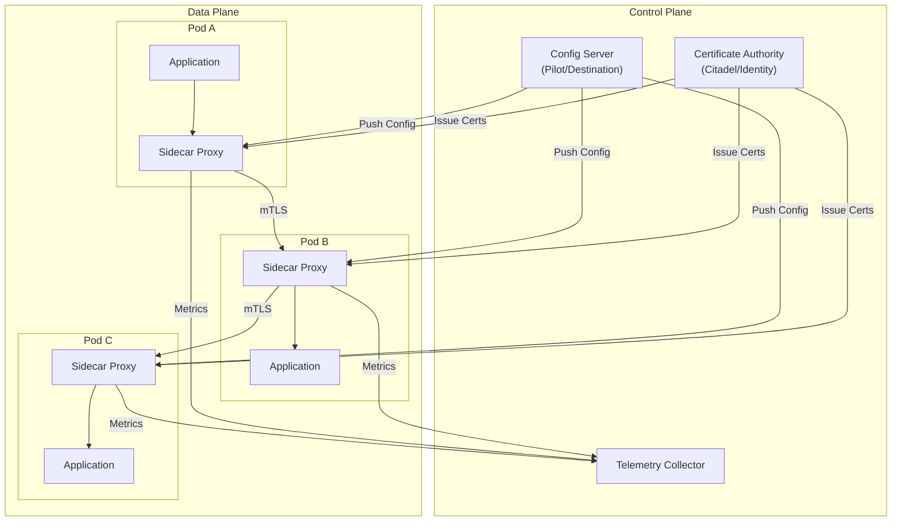
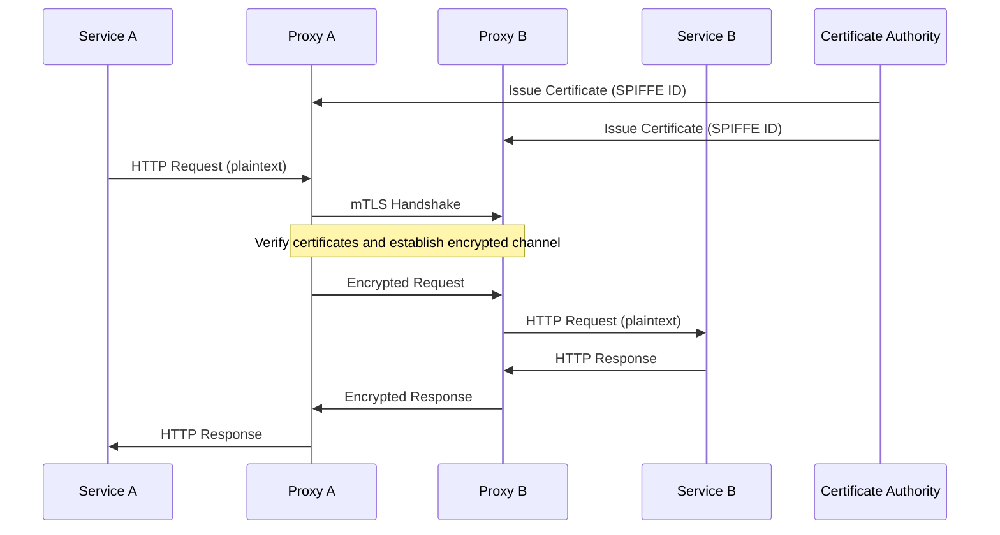
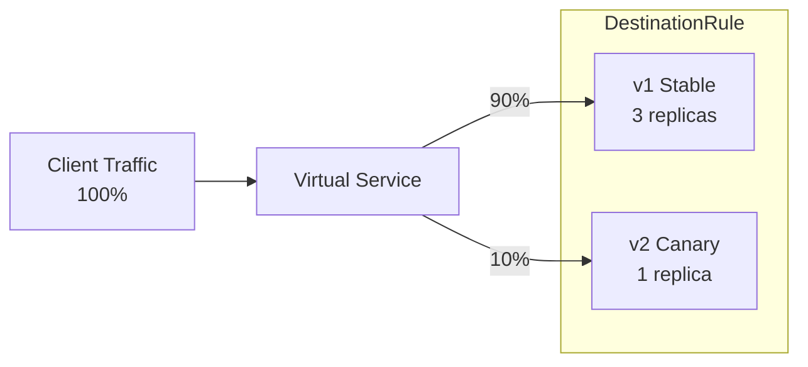
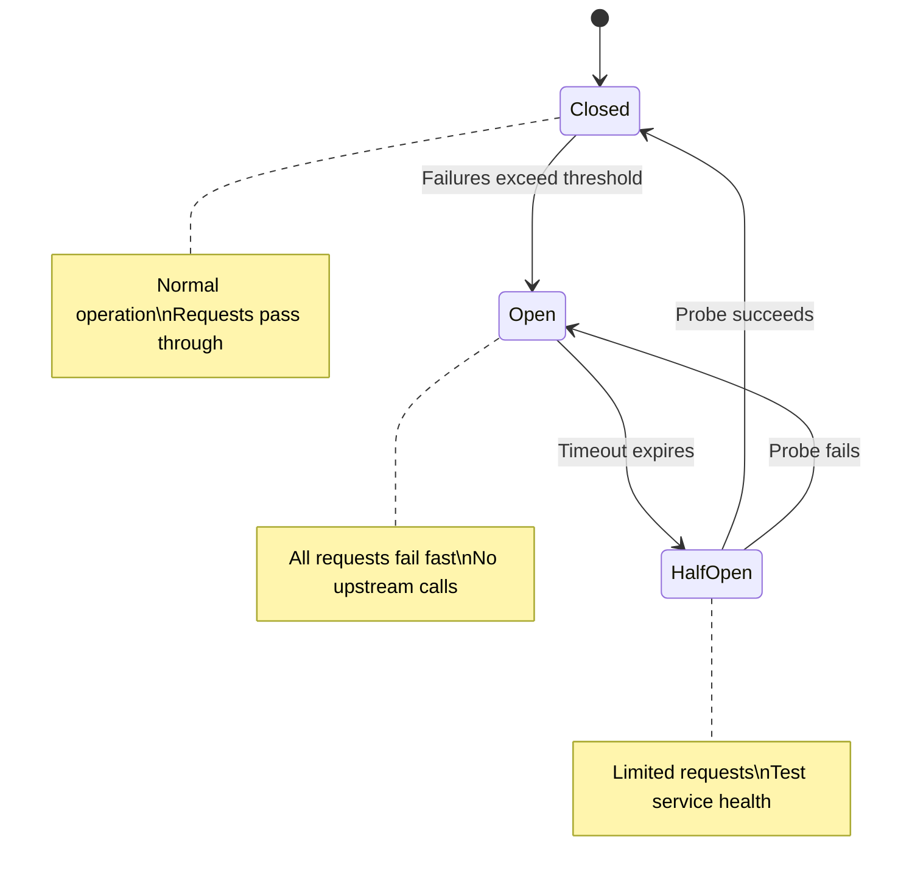
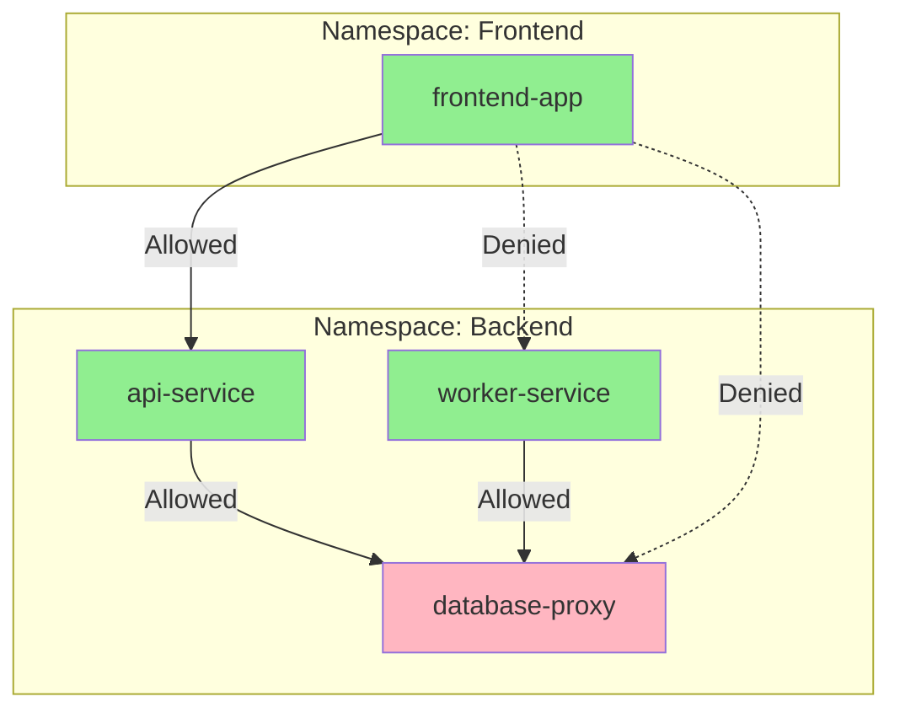

# How to Implement Kubernetes Service Mesh

Author: [nawazdhandala](https://www.github.com/nawazdhandala)

Tags: Kubernetes, Service Mesh, Istio, Linkerd, mTLS, Traffic Management, Observability, Microservices

Description: A hands-on guide to implementing a Kubernetes service mesh from scratch, covering architecture decisions, installation, traffic policies, security configuration, and production monitoring.

---

Running microservices in Kubernetes without a service mesh means every team reinvents the wheel for retries, timeouts, encryption, and observability. A service mesh moves these cross-cutting concerns into the infrastructure layer, letting developers focus on business logic while platform teams manage networking policies centrally.

In my experience deploying service meshes across production clusters, the technology itself is straightforward. The challenge lies in understanding when you actually need one and how to roll it out without disrupting existing workloads.

---

## Service Mesh Architecture

Before diving into implementation, understanding the fundamental architecture helps avoid common pitfalls later.



The control plane manages configuration, certificates, and telemetry collection. The data plane consists of sidecar proxies deployed alongside every application container. All service-to-service traffic flows through these proxies, enabling the mesh to apply policies consistently.

---

## Prerequisites

Your Kubernetes cluster needs to meet certain requirements before installing a service mesh.

The following script validates cluster readiness by checking version, RBAC, and resource availability.

```bash
#!/bin/bash
# validate-cluster.sh - Check if cluster is ready for service mesh

set -e

echo "=== Kubernetes Service Mesh Readiness Check ==="

# Check Kubernetes version (minimum 1.25 recommended)
KUBE_VERSION=$(kubectl version --short 2>/dev/null | grep Server | awk '{print $3}')
echo "Kubernetes version: $KUBE_VERSION"

# Verify RBAC is enabled
if kubectl auth can-i create clusterroles --all-namespaces > /dev/null 2>&1; then
    echo "RBAC: Enabled"
else
    echo "RBAC: Not available or insufficient permissions"
    exit 1
fi

# Check for minimum node resources
echo ""
echo "Node Resources:"
kubectl get nodes -o custom-columns=NAME:.metadata.name,CPU:.status.allocatable.cpu,MEMORY:.status.allocatable.memory

# Check if LoadBalancer services are supported
echo ""
echo "Checking LoadBalancer support..."
kubectl get svc -A | grep -q LoadBalancer && echo "LoadBalancer: Available" || echo "LoadBalancer: May need MetalLB or similar"

# Verify CNI is functioning
echo ""
echo "Pod networking test..."
kubectl run mesh-test --image=busybox --restart=Never --rm -i --wait --timeout=30s -- wget -q -O- kubernetes.default.svc.cluster.local > /dev/null 2>&1 && echo "CNI: Working" || echo "CNI: May have issues"

echo ""
echo "=== Readiness check complete ==="
```

---

## Installing Istio

Istio offers the most comprehensive feature set among service meshes. Here's a production-ready installation approach.

### Step 1: Download and Install istioctl

The istioctl CLI provides installation management and debugging capabilities beyond what Helm offers.

```bash
# Download the latest stable release
curl -L https://istio.io/downloadIstio | sh -

# Move to a versioned directory and add to PATH
cd istio-*
export PATH=$PWD/bin:$PATH

# Verify installation
istioctl version --remote=false
```

### Step 2: Choose an Installation Profile

Istio provides several profiles optimized for different use cases.

```bash
# List available profiles
istioctl profile list

# View profile differences
istioctl profile diff default demo
```

| Profile | Use Case | Components |
|---------|----------|------------|
| minimal | Gradual rollout | Istiod only |
| default | Production | Istiod + Ingress Gateway |
| demo | Learning/testing | All components |
| ambient | Sidecarless mesh | ztunnel + waypoint proxies |

### Step 3: Install with Custom Configuration

Production deployments need resource limits, high availability, and proper logging.

Create a custom installation manifest that configures resource limits, enables access logging, and sets up multiple replicas.

```yaml
# istio-production.yaml
apiVersion: install.istio.io/v1alpha1
kind: IstioOperator
metadata:
  name: istio-production
  namespace: istio-system
spec:
  profile: default

  # Mesh-wide configuration
  meshConfig:
    # Enable access logging to stdout
    accessLogFile: /dev/stdout
    accessLogFormat: |
      [%START_TIME%] "%REQ(:METHOD)% %REQ(X-ENVOY-ORIGINAL-PATH?:PATH)% %PROTOCOL%" %RESPONSE_CODE% %RESPONSE_FLAGS% %BYTES_RECEIVED% %BYTES_SENT% %DURATION% "%REQ(X-FORWARDED-FOR)%" "%REQ(USER-AGENT)%" "%REQ(X-REQUEST-ID)%" "%REQ(:AUTHORITY)%" "%UPSTREAM_HOST%"

    # Default retry policy
    defaultConfig:
      holdApplicationUntilProxyStarts: true
      proxyMetadata:
        ISTIO_META_DNS_CAPTURE: "true"
        ISTIO_META_DNS_AUTO_ALLOCATE: "true"

    # Enable distributed tracing
    enableTracing: true
    defaultProviders:
      tracing:
        - zipkin

  components:
    # Control plane configuration
    pilot:
      k8s:
        resources:
          requests:
            cpu: 500m
            memory: 2Gi
          limits:
            cpu: 1000m
            memory: 4Gi
        # High availability
        replicaCount: 2
        hpaSpec:
          minReplicas: 2
          maxReplicas: 5
          metrics:
            - type: Resource
              resource:
                name: cpu
                target:
                  type: Utilization
                  averageUtilization: 80

    # Ingress gateway configuration
    ingressGateways:
      - name: istio-ingressgateway
        enabled: true
        k8s:
          resources:
            requests:
              cpu: 100m
              memory: 128Mi
            limits:
              cpu: 500m
              memory: 512Mi
          replicaCount: 2
          hpaSpec:
            minReplicas: 2
            maxReplicas: 10

  # Global values
  values:
    global:
      # Enable mTLS by default
      mtls:
        enabled: true
      # Proxy resource settings
      proxy:
        resources:
          requests:
            cpu: 50m
            memory: 64Mi
          limits:
            cpu: 200m
            memory: 256Mi
```

Apply the installation configuration to your cluster.

```bash
# Install Istio with custom configuration
istioctl install -f istio-production.yaml -y

# Verify installation
istioctl verify-install

# Check component status
kubectl get pods -n istio-system
```

### Step 4: Enable Sidecar Injection

Namespaces need labeling for automatic sidecar injection.

```bash
# Enable injection for a namespace
kubectl label namespace default istio-injection=enabled

# Verify label
kubectl get namespace default --show-labels

# For existing deployments, restart to inject sidecars
kubectl rollout restart deployment -n default
```

---

## Installing Linkerd (Alternative)

Linkerd provides a lighter-weight alternative with simpler operations. Choose Linkerd when resource efficiency matters more than advanced features.

### Step 1: Install the CLI

```bash
# Download and install linkerd CLI
curl --proto '=https' --tlsv1.2 -sSfL https://run.linkerd.io/install | sh

# Add to PATH
export PATH=$HOME/.linkerd2/bin:$PATH

# Verify CLI
linkerd version --client
```

### Step 2: Validate Cluster Prerequisites

```bash
# Run pre-installation checks
linkerd check --pre
```

### Step 3: Install Control Plane

Generate certificates and deploy the control plane components.

```bash
# Generate certificates for mTLS
step certificate create root.linkerd.cluster.local ca.crt ca.key \
  --profile root-ca --no-password --insecure

step certificate create identity.linkerd.cluster.local issuer.crt issuer.key \
  --profile intermediate-ca --not-after 8760h --no-password --insecure \
  --ca ca.crt --ca-key ca.key

# Install control plane with certificates
linkerd install \
  --identity-trust-anchors-file ca.crt \
  --identity-issuer-certificate-file issuer.crt \
  --identity-issuer-key-file issuer.key \
  | kubectl apply -f -

# Wait for installation to complete
linkerd check
```

### Step 4: Install Viz Extension

The viz extension provides the dashboard and Prometheus/Grafana integration.

```bash
# Install observability extension
linkerd viz install | kubectl apply -f -

# Verify
linkerd viz check

# Open dashboard
linkerd viz dashboard &
```

---

## Enabling mTLS

Mutual TLS encrypts all service-to-service communication and provides strong identity verification.



### Istio mTLS Configuration

Create a peer authentication policy that enforces strict mTLS mesh-wide.

```yaml
# mtls-strict.yaml
apiVersion: security.istio.io/v1beta1
kind: PeerAuthentication
metadata:
  name: default
  namespace: istio-system
spec:
  mtls:
    mode: STRICT
---
# Allow permissive mode for specific namespace during migration
apiVersion: security.istio.io/v1beta1
kind: PeerAuthentication
metadata:
  name: permissive-legacy
  namespace: legacy-services
spec:
  mtls:
    mode: PERMISSIVE
```

Apply the mTLS configuration.

```bash
kubectl apply -f mtls-strict.yaml

# Verify mTLS status
istioctl x authz check deployment/my-app -n default
```

### Linkerd mTLS Verification

Linkerd enables mTLS by default with no additional configuration required.

```bash
# Check mTLS status for a deployment
linkerd viz stat deploy -n default

# View detailed connection information
linkerd viz edges deploy -n default
```

---

## Traffic Management

Traffic management enables canary deployments, A/B testing, and gradual rollouts.

### Canary Deployment with Traffic Splitting

The following diagram illustrates traffic distribution between stable and canary versions.



Create destination rules that define subsets for different application versions.

```yaml
# destination-rule.yaml
apiVersion: networking.istio.io/v1beta1
kind: DestinationRule
metadata:
  name: my-service
  namespace: default
spec:
  host: my-service
  trafficPolicy:
    connectionPool:
      tcp:
        maxConnections: 100
      http:
        h2UpgradePolicy: UPGRADE
        http1MaxPendingRequests: 100
        http2MaxRequests: 1000
    loadBalancer:
      simple: LEAST_REQUEST
  subsets:
    - name: v1
      labels:
        version: v1
    - name: v2
      labels:
        version: v2
```

Create a virtual service that splits traffic between versions based on weight.

```yaml
# virtual-service-canary.yaml
apiVersion: networking.istio.io/v1beta1
kind: VirtualService
metadata:
  name: my-service
  namespace: default
spec:
  hosts:
    - my-service
  http:
    - match:
        - headers:
            x-canary:
              exact: "true"
      route:
        - destination:
            host: my-service
            subset: v2
    - route:
        - destination:
            host: my-service
            subset: v1
          weight: 90
        - destination:
            host: my-service
            subset: v2
          weight: 10
```

### Progressive Traffic Shift Script

Automate canary progression with metric validation using a script that gradually shifts traffic while monitoring error rates.

```bash
#!/bin/bash
# canary-rollout.sh - Progressive canary deployment

set -e

SERVICE_NAME=${1:-"my-service"}
NAMESPACE=${2:-"default"}
INITIAL_WEIGHT=${3:-10}
INCREMENT=${4:-10}
INTERVAL=${5:-300}  # seconds between increments
ERROR_THRESHOLD=${6:-1.0}  # percentage

current_weight=$INITIAL_WEIGHT

while [ $current_weight -lt 100 ]; do
    echo "Setting canary weight to ${current_weight}%..."

    # Generate updated VirtualService
    cat <<EOF | kubectl apply -f -
apiVersion: networking.istio.io/v1beta1
kind: VirtualService
metadata:
  name: ${SERVICE_NAME}
  namespace: ${NAMESPACE}
spec:
  hosts:
    - ${SERVICE_NAME}
  http:
    - route:
        - destination:
            host: ${SERVICE_NAME}
            subset: v1
          weight: $((100 - current_weight))
        - destination:
            host: ${SERVICE_NAME}
            subset: v2
          weight: ${current_weight}
EOF

    echo "Waiting ${INTERVAL}s and monitoring error rates..."
    sleep $INTERVAL

    # Check error rate using Prometheus
    ERROR_RATE=$(kubectl exec -n istio-system deploy/prometheus -c prometheus -- \
        curl -s 'http://localhost:9090/api/v1/query' \
        --data-urlencode "query=sum(rate(istio_requests_total{destination_service=\"${SERVICE_NAME}.${NAMESPACE}.svc.cluster.local\",response_code=~\"5.*\",destination_version=\"v2\"}[5m])) / sum(rate(istio_requests_total{destination_service=\"${SERVICE_NAME}.${NAMESPACE}.svc.cluster.local\",destination_version=\"v2\"}[5m])) * 100" \
        | jq -r '.data.result[0].value[1] // "0"')

    echo "Current error rate: ${ERROR_RATE}%"

    if (( $(echo "$ERROR_RATE > $ERROR_THRESHOLD" | bc -l) )); then
        echo "ERROR: Error rate ${ERROR_RATE}% exceeds threshold ${ERROR_THRESHOLD}%"
        echo "Rolling back to v1..."
        kubectl patch virtualservice ${SERVICE_NAME} -n ${NAMESPACE} --type='json' \
            -p='[{"op": "replace", "path": "/spec/http/0/route", "value": [{"destination": {"host": "'${SERVICE_NAME}'", "subset": "v1"}, "weight": 100}]}]'
        exit 1
    fi

    current_weight=$((current_weight + INCREMENT))
done

echo "Canary rollout complete. Promoting v2 to stable."
```

---

## Circuit Breaking

Circuit breakers prevent cascade failures by stopping requests to unhealthy services.



Configure circuit breaker settings in the destination rule to limit concurrent connections and pending requests.

```yaml
# circuit-breaker.yaml
apiVersion: networking.istio.io/v1beta1
kind: DestinationRule
metadata:
  name: my-service
  namespace: default
spec:
  host: my-service
  trafficPolicy:
    connectionPool:
      tcp:
        maxConnections: 100
        connectTimeout: 5s
      http:
        http1MaxPendingRequests: 100
        http2MaxRequests: 1000
        maxRequestsPerConnection: 10
        maxRetries: 3
    outlierDetection:
      consecutive5xxErrors: 5
      interval: 10s
      baseEjectionTime: 30s
      maxEjectionPercent: 50
      minHealthPercent: 30
```

---

## Retry and Timeout Configuration

Configure retries and timeouts to handle transient failures gracefully without overwhelming downstream services.

```yaml
# retries-timeouts.yaml
apiVersion: networking.istio.io/v1beta1
kind: VirtualService
metadata:
  name: my-service
  namespace: default
spec:
  hosts:
    - my-service
  http:
    - route:
        - destination:
            host: my-service
      timeout: 10s
      retries:
        attempts: 3
        perTryTimeout: 3s
        retryOn: connect-failure,refused-stream,unavailable,cancelled,retriable-status-codes
        retryRemoteLocalities: true
```

---

## Authorization Policies

Fine-grained access control restricts which services can communicate with each other.



Create authorization policies that implement least-privilege access between services.

```yaml
# authz-policies.yaml
# Deny all traffic by default
apiVersion: security.istio.io/v1beta1
kind: AuthorizationPolicy
metadata:
  name: deny-all
  namespace: backend
spec:
  {}
---
# Allow frontend to access api-service
apiVersion: security.istio.io/v1beta1
kind: AuthorizationPolicy
metadata:
  name: allow-frontend-to-api
  namespace: backend
spec:
  selector:
    matchLabels:
      app: api-service
  action: ALLOW
  rules:
    - from:
        - source:
            principals: ["cluster.local/ns/frontend/sa/frontend-app"]
      to:
        - operation:
            methods: ["GET", "POST"]
            paths: ["/api/*"]
---
# Allow api-service and worker to access database
apiVersion: security.istio.io/v1beta1
kind: AuthorizationPolicy
metadata:
  name: allow-db-access
  namespace: backend
spec:
  selector:
    matchLabels:
      app: database-proxy
  action: ALLOW
  rules:
    - from:
        - source:
            principals:
              - "cluster.local/ns/backend/sa/api-service"
              - "cluster.local/ns/backend/sa/worker-service"
```

---

## Observability Setup

A service mesh generates detailed telemetry data. Proper collection and visualization reveals service dependencies and performance bottlenecks.

### Prometheus Integration

Deploy ServiceMonitor resources to scrape Istio metrics automatically.

```yaml
# prometheus-servicemonitor.yaml
apiVersion: monitoring.coreos.com/v1
kind: ServiceMonitor
metadata:
  name: istio-mesh
  namespace: monitoring
  labels:
    release: prometheus
spec:
  selector:
    matchLabels:
      app: istiod
  namespaceSelector:
    matchNames:
      - istio-system
  endpoints:
    - port: http-monitoring
      interval: 15s
      path: /metrics
---
apiVersion: monitoring.coreos.com/v1
kind: PodMonitor
metadata:
  name: istio-proxies
  namespace: monitoring
  labels:
    release: prometheus
spec:
  selector:
    matchExpressions:
      - key: istio.io/rev
        operator: Exists
  namespaceSelector:
    any: true
  podMetricsEndpoints:
    - port: http-envoy-prom
      path: /stats/prometheus
      interval: 15s
```

### Key Metrics to Monitor

Create a ConfigMap containing Grafana dashboard definitions for service mesh metrics.

```yaml
# grafana-dashboard-configmap.yaml
apiVersion: v1
kind: ConfigMap
metadata:
  name: istio-service-dashboard
  namespace: monitoring
  labels:
    grafana_dashboard: "1"
data:
  istio-service.json: |
    {
      "title": "Service Mesh Overview",
      "panels": [
        {
          "title": "Request Rate",
          "type": "graph",
          "targets": [
            {
              "expr": "sum(rate(istio_requests_total{reporter=\"destination\"}[5m])) by (destination_service_name)",
              "legendFormat": "{{destination_service_name}}"
            }
          ]
        },
        {
          "title": "Error Rate",
          "type": "graph",
          "targets": [
            {
              "expr": "sum(rate(istio_requests_total{reporter=\"destination\",response_code=~\"5.*\"}[5m])) by (destination_service_name) / sum(rate(istio_requests_total{reporter=\"destination\"}[5m])) by (destination_service_name) * 100",
              "legendFormat": "{{destination_service_name}}"
            }
          ]
        },
        {
          "title": "P99 Latency",
          "type": "graph",
          "targets": [
            {
              "expr": "histogram_quantile(0.99, sum(rate(istio_request_duration_milliseconds_bucket{reporter=\"destination\"}[5m])) by (destination_service_name, le))",
              "legendFormat": "{{destination_service_name}}"
            }
          ]
        }
      ]
    }
```

### Useful Prometheus Queries

The following queries help identify service mesh issues quickly.

```promql
# Request rate by service
sum(rate(istio_requests_total{reporter="destination"}[5m])) by (destination_service_name)

# Error rate percentage
sum(rate(istio_requests_total{response_code=~"5.*"}[5m])) by (destination_service_name)
/ sum(rate(istio_requests_total[5m])) by (destination_service_name) * 100

# P99 latency
histogram_quantile(0.99, sum(rate(istio_request_duration_milliseconds_bucket[5m])) by (le, destination_service_name))

# TCP connections by service
sum(istio_tcp_connections_opened_total) by (destination_service_name)
- sum(istio_tcp_connections_closed_total) by (destination_service_name)

# Sidecar memory usage
sum(container_memory_working_set_bytes{container="istio-proxy"}) by (pod)
```

---

## Debugging Service Mesh Issues

When things go wrong, these tools and techniques help identify root causes quickly.

### Istio Debugging Commands

```bash
# Check proxy status for a pod
istioctl proxy-status

# Analyze configuration for issues
istioctl analyze -n default

# View proxy configuration
istioctl proxy-config clusters deploy/my-app -n default

# Check listener configuration
istioctl proxy-config listeners deploy/my-app -n default

# View route configuration
istioctl proxy-config routes deploy/my-app -n default

# Debug authorization
istioctl x authz check deploy/my-app -n default

# View Envoy access logs
kubectl logs deploy/my-app -c istio-proxy -f
```

### Common Issues and Solutions

| Issue | Symptom | Solution |
|-------|---------|----------|
| Sidecar not injected | Pod has no istio-proxy container | Check namespace label and webhook |
| mTLS handshake failure | Connection reset errors | Verify PeerAuthentication and DestinationRule |
| 503 errors | Service unavailable | Check circuit breaker settings and endpoint health |
| High latency | Slow response times | Review retry configuration and connection pools |
| Authorization denied | 403 RBAC errors | Verify AuthorizationPolicy and service account |

### Debug Container for Network Issues

Deploy a debug pod with network troubleshooting tools for investigating connectivity problems.

```yaml
# debug-pod.yaml
apiVersion: v1
kind: Pod
metadata:
  name: mesh-debug
  namespace: default
  labels:
    app: debug
spec:
  containers:
    - name: debug
      image: nicolaka/netshoot:latest
      command: ["sleep", "infinity"]
      securityContext:
        capabilities:
          add: ["NET_ADMIN", "NET_RAW"]
```

Use the debug pod to test service connectivity.

```bash
# Deploy debug pod
kubectl apply -f debug-pod.yaml

# Test connectivity
kubectl exec -it mesh-debug -- curl -v http://my-service.default.svc.cluster.local

# Check DNS resolution
kubectl exec -it mesh-debug -- nslookup my-service.default.svc.cluster.local

# Trace route
kubectl exec -it mesh-debug -- traceroute my-service.default.svc.cluster.local
```

---

## Production Checklist

Before going to production, verify these items are properly configured.

### Security

- [ ] mTLS enabled in STRICT mode
- [ ] Default-deny AuthorizationPolicy in place
- [ ] Service-specific allow policies defined
- [ ] Certificate rotation configured
- [ ] Egress traffic controlled via ServiceEntry

### Reliability

- [ ] Circuit breakers configured for critical services
- [ ] Retry policies defined with exponential backoff
- [ ] Timeouts set for all virtual services
- [ ] Health checks configured for all deployments
- [ ] Horizontal Pod Autoscaler configured for control plane

### Observability

- [ ] Prometheus scraping mesh metrics
- [ ] Grafana dashboards deployed
- [ ] Distributed tracing enabled
- [ ] Access logging configured
- [ ] Alerting rules defined for error rates and latency

### Operations

- [ ] Upgrade path documented
- [ ] Rollback procedure tested
- [ ] Resource limits set for sidecars
- [ ] Control plane high availability enabled
- [ ] Disaster recovery plan in place

---

## Resource Impact

Service meshes add overhead. Understanding the resource impact helps with capacity planning.

| Component | CPU Request | Memory Request | Notes |
|-----------|-------------|----------------|-------|
| Istiod | 500m | 2Gi | Per replica, 2+ for HA |
| Sidecar proxy | 50-100m | 64-128Mi | Per pod |
| Ingress Gateway | 100m | 128Mi | Per replica |
| Linkerd proxy | 10m | 20Mi | Per pod |

For a cluster with 100 pods, expect roughly:
- Istio: 5-10 CPU cores and 6-12 GB memory for sidecars
- Linkerd: 1-2 CPU cores and 2-4 GB memory for sidecars

---

## Next Steps

After implementing the basic service mesh, consider these advanced topics:

- Multi-cluster mesh federation for disaster recovery
- Ambient mesh (sidecarless) for reduced overhead
- WebAssembly plugins for custom extensions
- Integration with external authorization systems

For monitoring your service mesh performance, OneUptime provides comprehensive observability with automatic service mapping and anomaly detection across your entire Kubernetes infrastructure.

---

## Summary

Implementing a Kubernetes service mesh involves several key decisions and configurations:

1. Choose between Istio (feature-rich) and Linkerd (lightweight) based on your needs
2. Start with a minimal installation and gradually enable features
3. Roll out mTLS in permissive mode first, then switch to strict
4. Configure traffic management policies for canary deployments
5. Implement authorization policies following least-privilege principles
6. Set up comprehensive observability with Prometheus and Grafana
7. Test disaster recovery and rollback procedures before production

The investment in a service mesh pays off through improved security, reliability, and observability across your microservices architecture.
