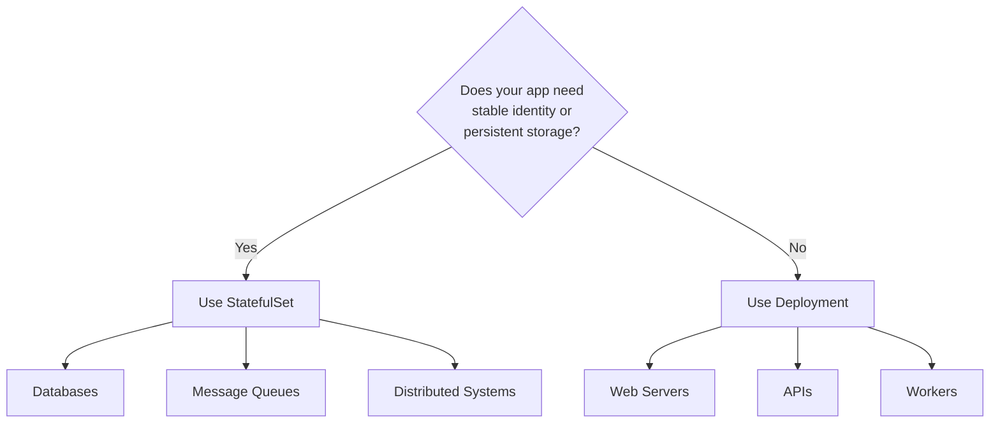
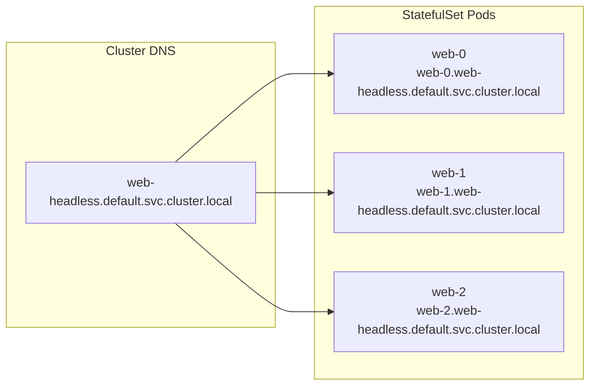
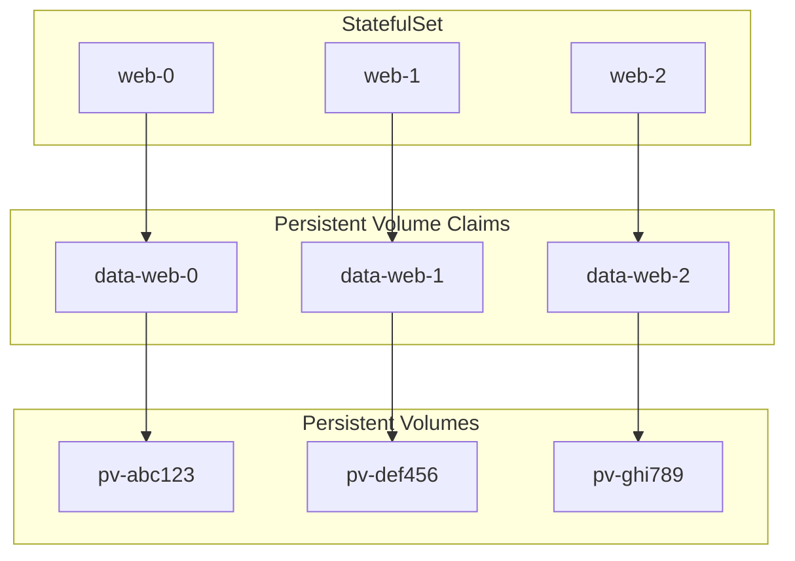
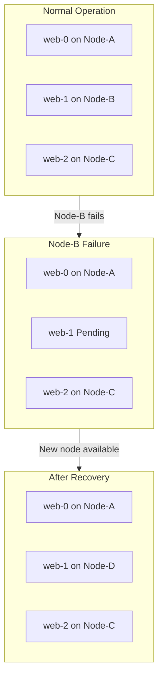

# How to Configure Kubernetes StatefulSets

Author: [nawazdhandala](https://www.github.com/nawazdhandala)

Tags: Kubernetes, StatefulSets, Containers, DevOps, Databases, Persistent Storage, Cloud Native

Description: A comprehensive guide to configuring Kubernetes StatefulSets for stateful applications. Learn about stable network identities, persistent storage, ordered deployment, headless services, and production best practices for databases and distributed systems.

---

Running stateful applications in Kubernetes requires special handling compared to stateless workloads. While Deployments work great for web servers and APIs that can be replaced without consequences, databases, message queues, and distributed systems need stable identities and persistent storage. StatefulSets solve these challenges by providing ordered deployment, stable network identities, and persistent storage claims that survive pod restarts.

## When to Use StatefulSets



StatefulSets are the right choice when your application requires:

1. **Stable Network Identity** - Each pod gets a predictable hostname (pod-0, pod-1, pod-2)
2. **Ordered Deployment** - Pods are created sequentially, not all at once
3. **Ordered Termination** - Pods are terminated in reverse order during scale-down
4. **Persistent Storage** - Each pod gets its own PersistentVolumeClaim that persists across restarts

Common use cases include PostgreSQL, MySQL, MongoDB, Redis clusters, Kafka, Elasticsearch, ZooKeeper, and any application that stores data locally.

## StatefulSet vs Deployment

Understanding the key differences helps you choose the right controller.

| Feature | Deployment | StatefulSet |
|---------|-----------|-------------|
| Pod Names | Random suffix (app-7d9f8b6c4d-x2k5l) | Ordinal index (app-0, app-1, app-2) |
| Storage | Shared or ephemeral | Per-pod persistent storage |
| Scaling | Parallel | Sequential (ordered) |
| Rolling Updates | Parallel | One at a time |
| Network Identity | Ephemeral | Stable DNS names |
| Headless Service | Optional | Required |

## Basic StatefulSet Configuration

The following YAML creates a minimal StatefulSet with a headless service for a simple web application.

```yaml
# statefulset-basic.yaml
# A minimal StatefulSet configuration demonstrating core concepts.
# The headless service is required for StatefulSets to provide stable DNS.
apiVersion: v1
kind: Service
metadata:
  name: web-headless
  labels:
    app: web
spec:
  ports:
    - port: 80
      name: web
  # Setting clusterIP to None creates a headless service
  # Required for StatefulSet DNS to work properly
  clusterIP: None
  selector:
    app: web
---
apiVersion: apps/v1
kind: StatefulSet
metadata:
  name: web
spec:
  # serviceName must match the headless service name
  serviceName: "web-headless"
  # Start with 3 replicas named web-0, web-1, web-2
  replicas: 3
  selector:
    matchLabels:
      app: web
  template:
    metadata:
      labels:
        app: web
    spec:
      containers:
        - name: nginx
          image: nginx:1.25
          ports:
            - containerPort: 80
              name: web
```

Deploy and verify the StatefulSet using kubectl commands.

```bash
# Apply the StatefulSet configuration
kubectl apply -f statefulset-basic.yaml

# Watch pods being created in order (web-0, then web-1, then web-2)
kubectl get pods -l app=web -w

# Verify the headless service
kubectl get svc web-headless

# Check StatefulSet status
kubectl get statefulsets
```

## Understanding Stable Network Identity



Each pod in a StatefulSet receives a stable DNS name that follows a predictable pattern.

The pattern is: `<pod-name>.<service-name>.<namespace>.svc.cluster.local`

For our example, the pods get these DNS names:
- `web-0.web-headless.default.svc.cluster.local`
- `web-1.web-headless.default.svc.cluster.local`
- `web-2.web-headless.default.svc.cluster.local`

Verify DNS resolution from within the cluster using a debug pod.

```bash
# Run a temporary pod to test DNS resolution
kubectl run dns-test --rm -it --image=busybox --restart=Never -- nslookup web-headless

# Test individual pod DNS names
kubectl run dns-test --rm -it --image=busybox --restart=Never -- nslookup web-0.web-headless
```

## Configuring Persistent Storage

StatefulSets use volumeClaimTemplates to automatically provision PersistentVolumeClaims for each pod.



The following configuration adds persistent storage to each pod in the StatefulSet.

```yaml
# statefulset-with-storage.yaml
# StatefulSet with volumeClaimTemplates for automatic PVC provisioning.
# Each pod gets its own dedicated PersistentVolumeClaim.
apiVersion: v1
kind: Service
metadata:
  name: postgres-headless
spec:
  ports:
    - port: 5432
      name: postgres
  clusterIP: None
  selector:
    app: postgres
---
apiVersion: apps/v1
kind: StatefulSet
metadata:
  name: postgres
spec:
  serviceName: "postgres-headless"
  replicas: 3
  selector:
    matchLabels:
      app: postgres
  template:
    metadata:
      labels:
        app: postgres
    spec:
      containers:
        - name: postgres
          image: postgres:15
          ports:
            - containerPort: 5432
              name: postgres
          env:
            # Environment variables for PostgreSQL initialization
            - name: POSTGRES_USER
              value: "admin"
            - name: POSTGRES_PASSWORD
              valueFrom:
                secretKeyRef:
                  name: postgres-secret
                  key: password
            # PGDATA must be a subdirectory of the mount point
            - name: PGDATA
              value: /var/lib/postgresql/data/pgdata
          # Mount the persistent volume at the data directory
          volumeMounts:
            - name: data
              mountPath: /var/lib/postgresql/data
          # Resource limits ensure predictable performance
          resources:
            requests:
              cpu: "500m"
              memory: "1Gi"
            limits:
              cpu: "2"
              memory: "4Gi"
  # volumeClaimTemplates creates a PVC for each pod
  # PVCs are named: <template-name>-<pod-name> (data-postgres-0, data-postgres-1, etc.)
  volumeClaimTemplates:
    - metadata:
        name: data
      spec:
        accessModes: ["ReadWriteOnce"]
        # Specify your cluster's storage class
        storageClassName: "standard"
        resources:
          requests:
            storage: 100Gi
```

Create the required secret before deploying the StatefulSet.

```bash
# Create a secret for the PostgreSQL password
kubectl create secret generic postgres-secret \
  --from-literal=password=your-secure-password

# Deploy the StatefulSet
kubectl apply -f statefulset-with-storage.yaml

# Verify PVCs were created for each pod
kubectl get pvc -l app=postgres

# Check that PVs were provisioned
kubectl get pv
```

## Pod Management Policies

StatefulSets support two pod management policies that control how pods are created and deleted.

### OrderedReady (Default)

Pods are created one at a time, waiting for each to be Running and Ready before starting the next.

```yaml
# OrderedReady policy - the default behavior
# Use when pods depend on each other during initialization
apiVersion: apps/v1
kind: StatefulSet
metadata:
  name: ordered-app
spec:
  # OrderedReady is the default, but shown here for clarity
  podManagementPolicy: OrderedReady
  serviceName: "ordered-headless"
  replicas: 3
  selector:
    matchLabels:
      app: ordered
  template:
    metadata:
      labels:
        app: ordered
    spec:
      containers:
        - name: app
          image: myapp:latest
          # Readiness probe determines when pod is Ready
          readinessProbe:
            httpGet:
              path: /ready
              port: 8080
            initialDelaySeconds: 10
            periodSeconds: 5
```

### Parallel

All pods are created simultaneously, similar to Deployment behavior.

```yaml
# Parallel policy for faster scaling when order does not matter
# Use when pods can initialize independently
apiVersion: apps/v1
kind: StatefulSet
metadata:
  name: parallel-app
spec:
  # Parallel creates all pods at once
  podManagementPolicy: Parallel
  serviceName: "parallel-headless"
  replicas: 5
  selector:
    matchLabels:
      app: parallel
  template:
    metadata:
      labels:
        app: parallel
    spec:
      containers:
        - name: app
          image: myapp:latest
```

## Update Strategies

StatefulSets support RollingUpdate and OnDelete update strategies.

### RollingUpdate Strategy

Updates pods one at a time in reverse ordinal order (highest to lowest).

```yaml
# RollingUpdate with partition for canary deployments
# Pods with ordinal >= partition are updated, others remain unchanged
apiVersion: apps/v1
kind: StatefulSet
metadata:
  name: app
spec:
  serviceName: "app-headless"
  replicas: 5
  updateStrategy:
    type: RollingUpdate
    rollingUpdate:
      # Only update pods with ordinal >= 3 (app-3, app-4)
      # Useful for canary testing before full rollout
      partition: 3
      # Maximum unavailable pods during update (Kubernetes 1.24+)
      maxUnavailable: 1
  selector:
    matchLabels:
      app: myapp
  template:
    metadata:
      labels:
        app: myapp
    spec:
      containers:
        - name: app
          image: myapp:v2  # New version to roll out
```

Perform a staged rollout using the partition field.

```bash
# Stage 1: Update only pods 3 and 4 (partition: 3)
kubectl patch statefulset app -p '{"spec":{"updateStrategy":{"rollingUpdate":{"partition":3}}}}'

# Verify the canary pods are running correctly
kubectl get pods -l app=myapp -o jsonpath='{range .items[*]}{.metadata.name}: {.spec.containers[0].image}{"\n"}{end}'

# Stage 2: Update pods 1-4 (partition: 1)
kubectl patch statefulset app -p '{"spec":{"updateStrategy":{"rollingUpdate":{"partition":1}}}}'

# Stage 3: Complete rollout (partition: 0)
kubectl patch statefulset app -p '{"spec":{"updateStrategy":{"rollingUpdate":{"partition":0}}}}'
```

### OnDelete Strategy

Pods are only updated when manually deleted, giving you complete control.

```yaml
# OnDelete strategy for manual update control
# Pods update only when explicitly deleted
apiVersion: apps/v1
kind: StatefulSet
metadata:
  name: manual-update-app
spec:
  serviceName: "manual-headless"
  replicas: 3
  updateStrategy:
    type: OnDelete
  selector:
    matchLabels:
      app: manual
  template:
    metadata:
      labels:
        app: manual
    spec:
      containers:
        - name: app
          image: myapp:latest
```

## Production PostgreSQL StatefulSet

The following configuration demonstrates a production-ready PostgreSQL StatefulSet with all recommended settings.

```yaml
# postgres-production.yaml
# Production-grade PostgreSQL StatefulSet with:
# - Health checks for automatic recovery
# - Resource management for performance
# - Security context for hardening
# - Init container for proper permissions
apiVersion: v1
kind: Service
metadata:
  name: postgres
  labels:
    app: postgres
spec:
  ports:
    - port: 5432
      name: postgres
  clusterIP: None
  selector:
    app: postgres
---
apiVersion: apps/v1
kind: StatefulSet
metadata:
  name: postgres
spec:
  serviceName: postgres
  replicas: 3
  selector:
    matchLabels:
      app: postgres
  # Use OrderedReady for database clusters
  podManagementPolicy: OrderedReady
  updateStrategy:
    type: RollingUpdate
    rollingUpdate:
      # Use partition for staged rollouts
      partition: 0
  template:
    metadata:
      labels:
        app: postgres
      annotations:
        # Prometheus metrics scraping
        prometheus.io/scrape: "true"
        prometheus.io/port: "9187"
    spec:
      # Ensure pods spread across nodes for high availability
      affinity:
        podAntiAffinity:
          preferredDuringSchedulingIgnoredDuringExecution:
            - weight: 100
              podAffinityTerm:
                labelSelector:
                  matchLabels:
                    app: postgres
                topologyKey: kubernetes.io/hostname
      # Security context at pod level
      securityContext:
        runAsUser: 999
        runAsGroup: 999
        fsGroup: 999
      # Graceful termination allows connections to complete
      terminationGracePeriodSeconds: 60
      # Init container sets proper permissions on the data directory
      initContainers:
        - name: init-permissions
          image: busybox:1.36
          command:
            - sh
            - -c
            - |
              # Ensure data directory has correct ownership
              chown -R 999:999 /var/lib/postgresql/data
          volumeMounts:
            - name: data
              mountPath: /var/lib/postgresql/data
          securityContext:
            runAsUser: 0
      containers:
        - name: postgres
          image: postgres:15.4
          ports:
            - containerPort: 5432
              name: postgres
          env:
            - name: POSTGRES_USER
              valueFrom:
                secretKeyRef:
                  name: postgres-credentials
                  key: username
            - name: POSTGRES_PASSWORD
              valueFrom:
                secretKeyRef:
                  name: postgres-credentials
                  key: password
            - name: POSTGRES_DB
              value: "appdb"
            - name: PGDATA
              value: /var/lib/postgresql/data/pgdata
            # Pod identity available as environment variable
            - name: POD_NAME
              valueFrom:
                fieldRef:
                  fieldPath: metadata.name
          volumeMounts:
            - name: data
              mountPath: /var/lib/postgresql/data
            - name: config
              mountPath: /etc/postgresql/postgresql.conf
              subPath: postgresql.conf
          # Liveness probe restarts unhealthy pods
          livenessProbe:
            exec:
              command:
                - pg_isready
                - -U
                - $(POSTGRES_USER)
                - -d
                - $(POSTGRES_DB)
            initialDelaySeconds: 30
            periodSeconds: 10
            timeoutSeconds: 5
            failureThreshold: 6
          # Readiness probe removes pod from service during issues
          readinessProbe:
            exec:
              command:
                - pg_isready
                - -U
                - $(POSTGRES_USER)
                - -d
                - $(POSTGRES_DB)
            initialDelaySeconds: 10
            periodSeconds: 5
            timeoutSeconds: 3
            failureThreshold: 3
          resources:
            requests:
              cpu: "1"
              memory: "2Gi"
            limits:
              cpu: "4"
              memory: "8Gi"
          securityContext:
            allowPrivilegeEscalation: false
            readOnlyRootFilesystem: false
        # Metrics exporter sidecar for monitoring
        - name: metrics
          image: prometheuscommunity/postgres-exporter:v0.15.0
          ports:
            - containerPort: 9187
              name: metrics
          env:
            - name: DATA_SOURCE_URI
              value: "localhost:5432/appdb?sslmode=disable"
            - name: DATA_SOURCE_USER
              valueFrom:
                secretKeyRef:
                  name: postgres-credentials
                  key: username
            - name: DATA_SOURCE_PASS
              valueFrom:
                secretKeyRef:
                  name: postgres-credentials
                  key: password
          resources:
            requests:
              cpu: "50m"
              memory: "64Mi"
            limits:
              cpu: "200m"
              memory: "256Mi"
      volumes:
        - name: config
          configMap:
            name: postgres-config
  volumeClaimTemplates:
    - metadata:
        name: data
        labels:
          app: postgres
      spec:
        accessModes: ["ReadWriteOnce"]
        storageClassName: "fast-ssd"
        resources:
          requests:
            storage: 500Gi
```

Create the required ConfigMap with PostgreSQL tuning parameters.

```yaml
# postgres-config.yaml
# PostgreSQL configuration optimized for a Kubernetes environment
apiVersion: v1
kind: ConfigMap
metadata:
  name: postgres-config
data:
  postgresql.conf: |
    # Connection settings
    listen_addresses = '*'
    max_connections = 200

    # Memory settings (adjust based on container limits)
    shared_buffers = 2GB
    effective_cache_size = 6GB
    work_mem = 16MB
    maintenance_work_mem = 512MB

    # Write-ahead log settings
    wal_level = replica
    max_wal_senders = 10
    wal_keep_size = 1GB

    # Checkpoint settings
    checkpoint_completion_target = 0.9
    checkpoint_timeout = 10min

    # Logging
    log_destination = 'stderr'
    logging_collector = off
    log_min_duration_statement = 1000
    log_connections = on
    log_disconnections = on
```

## Kafka Cluster Example

Kafka is a common use case for StatefulSets due to its requirement for stable broker IDs and persistent log storage.

```yaml
# kafka-statefulset.yaml
# Apache Kafka cluster using StatefulSet
# Each broker maintains its own identity and data
apiVersion: v1
kind: Service
metadata:
  name: kafka-headless
spec:
  ports:
    - port: 9092
      name: kafka
    - port: 9093
      name: kafka-internal
  clusterIP: None
  selector:
    app: kafka
---
# External service for client connections
apiVersion: v1
kind: Service
metadata:
  name: kafka
spec:
  ports:
    - port: 9092
      name: kafka
  selector:
    app: kafka
---
apiVersion: apps/v1
kind: StatefulSet
metadata:
  name: kafka
spec:
  serviceName: kafka-headless
  replicas: 3
  podManagementPolicy: Parallel
  selector:
    matchLabels:
      app: kafka
  template:
    metadata:
      labels:
        app: kafka
    spec:
      affinity:
        podAntiAffinity:
          requiredDuringSchedulingIgnoredDuringExecution:
            - labelSelector:
                matchLabels:
                  app: kafka
              topologyKey: kubernetes.io/hostname
      containers:
        - name: kafka
          image: confluentinc/cp-kafka:7.5.0
          ports:
            - containerPort: 9092
              name: kafka
            - containerPort: 9093
              name: kafka-internal
          env:
            # Extract broker ID from pod ordinal
            - name: POD_NAME
              valueFrom:
                fieldRef:
                  fieldPath: metadata.name
            # Kafka configuration through environment variables
            - name: KAFKA_BROKER_ID_GENERATION_ENABLE
              value: "false"
            - name: KAFKA_LISTENERS
              value: "INTERNAL://:9093,EXTERNAL://:9092"
            - name: KAFKA_ADVERTISED_LISTENERS
              value: "INTERNAL://$(POD_NAME).kafka-headless:9093,EXTERNAL://$(POD_NAME).kafka-headless:9092"
            - name: KAFKA_LISTENER_SECURITY_PROTOCOL_MAP
              value: "INTERNAL:PLAINTEXT,EXTERNAL:PLAINTEXT"
            - name: KAFKA_INTER_BROKER_LISTENER_NAME
              value: "INTERNAL"
            - name: KAFKA_ZOOKEEPER_CONNECT
              value: "zookeeper-headless:2181"
            - name: KAFKA_LOG_DIRS
              value: "/var/lib/kafka/data"
            - name: KAFKA_AUTO_CREATE_TOPICS_ENABLE
              value: "false"
            - name: KAFKA_DEFAULT_REPLICATION_FACTOR
              value: "3"
            - name: KAFKA_MIN_INSYNC_REPLICAS
              value: "2"
            - name: KAFKA_NUM_PARTITIONS
              value: "12"
          # Extract broker ID from pod name using a command
          command:
            - bash
            - -c
            - |
              # Extract ordinal from pod name (kafka-0 -> 0, kafka-1 -> 1)
              export KAFKA_BROKER_ID=${POD_NAME##*-}
              exec /etc/confluent/docker/run
          volumeMounts:
            - name: data
              mountPath: /var/lib/kafka/data
          resources:
            requests:
              cpu: "1"
              memory: "4Gi"
            limits:
              cpu: "2"
              memory: "8Gi"
          livenessProbe:
            tcpSocket:
              port: 9092
            initialDelaySeconds: 60
            periodSeconds: 10
          readinessProbe:
            tcpSocket:
              port: 9092
            initialDelaySeconds: 30
            periodSeconds: 5
  volumeClaimTemplates:
    - metadata:
        name: data
      spec:
        accessModes: ["ReadWriteOnce"]
        storageClassName: "fast-ssd"
        resources:
          requests:
            storage: 1Ti
```

## Scaling StatefulSets

Scaling StatefulSets works differently from Deployments due to the ordered nature of operations.

### Scale Up

New pods are added sequentially starting from the next ordinal number.

```bash
# Scale from 3 to 5 replicas
# Pods web-3 and web-4 will be created in order
kubectl scale statefulset web --replicas=5

# Watch the scaling operation
kubectl get pods -l app=web -w
```

### Scale Down

Pods are removed in reverse ordinal order, giving higher-numbered pods time to drain.

```bash
# Scale from 5 to 3 replicas
# Pods web-4 and web-3 will be terminated in order
kubectl scale statefulset web --replicas=3

# Monitor the scale-down
kubectl get pods -l app=web -w
```

### Important Considerations

When scaling StatefulSets with persistent storage, PVCs are NOT automatically deleted.

```bash
# After scaling down, orphaned PVCs remain
kubectl get pvc -l app=web

# Manually delete PVCs if they are no longer needed
kubectl delete pvc data-web-3 data-web-4
```

## Handling Pod Failures



When a node fails, the StatefulSet controller ensures the pod is rescheduled with the same identity and storage.

```bash
# Simulate a pod failure by deleting it
kubectl delete pod web-1

# Watch the replacement pod being created with the same name
kubectl get pods -l app=web -w

# The new web-1 pod will have the same:
# - Pod name (web-1)
# - DNS name (web-1.web-headless.default.svc.cluster.local)
# - PVC (data-web-1)
```

## PersistentVolumeClaim Retention

Kubernetes 1.23+ supports configurable PVC retention policies.

```yaml
# StatefulSet with PVC retention policy (Kubernetes 1.23+)
# Controls whether PVCs are deleted when pods or StatefulSet is deleted
apiVersion: apps/v1
kind: StatefulSet
metadata:
  name: app
spec:
  serviceName: app-headless
  replicas: 3
  # PVC retention policies control automatic PVC deletion
  persistentVolumeClaimRetentionPolicy:
    # What happens to PVCs when the StatefulSet is deleted
    # Retain: Keep PVCs (default)
    # Delete: Delete PVCs when StatefulSet is deleted
    whenDeleted: Retain
    # What happens to PVCs when pods are scaled down
    # Retain: Keep PVCs from scaled-down pods (default)
    # Delete: Delete PVCs when pods are scaled down
    whenScaled: Retain
  selector:
    matchLabels:
      app: myapp
  template:
    metadata:
      labels:
        app: myapp
    spec:
      containers:
        - name: app
          image: myapp:latest
          volumeMounts:
            - name: data
              mountPath: /data
  volumeClaimTemplates:
    - metadata:
        name: data
      spec:
        accessModes: ["ReadWriteOnce"]
        resources:
          requests:
            storage: 50Gi
```

## Backup and Restore Strategies

### Volume Snapshots

Use VolumeSnapshots for point-in-time backups of StatefulSet data.

```yaml
# Create a VolumeSnapshot of a StatefulSet pod's data
# Requires VolumeSnapshot CRDs and a compatible CSI driver
apiVersion: snapshot.storage.k8s.io/v1
kind: VolumeSnapshot
metadata:
  name: postgres-snapshot-0
  labels:
    app: postgres
spec:
  # Specify your cluster's snapshot class
  volumeSnapshotClassName: csi-snapclass
  source:
    # Reference the PVC from the StatefulSet pod
    persistentVolumeClaimName: data-postgres-0
```

Automate backups using a CronJob.

```yaml
# Automated snapshot creation using CronJob
apiVersion: batch/v1
kind: CronJob
metadata:
  name: postgres-backup
spec:
  # Run daily at 2 AM
  schedule: "0 2 * * *"
  jobTemplate:
    spec:
      template:
        spec:
          serviceAccountName: snapshot-creator
          containers:
            - name: snapshot
              image: bitnami/kubectl:latest
              command:
                - /bin/bash
                - -c
                - |
                  # Create timestamp for unique snapshot name
                  TIMESTAMP=$(date +%Y%m%d-%H%M%S)

                  # Create snapshot for each PostgreSQL pod
                  for i in 0 1 2; do
                    cat <<EOF | kubectl apply -f -
                  apiVersion: snapshot.storage.k8s.io/v1
                  kind: VolumeSnapshot
                  metadata:
                    name: postgres-snapshot-${i}-${TIMESTAMP}
                  spec:
                    volumeSnapshotClassName: csi-snapclass
                    source:
                      persistentVolumeClaimName: data-postgres-${i}
                  EOF
                  done
          restartPolicy: OnFailure
```

### Restore from Snapshot

Restore a StatefulSet pod from a VolumeSnapshot.

```yaml
# Create a new PVC from a VolumeSnapshot
apiVersion: v1
kind: PersistentVolumeClaim
metadata:
  # Must match the expected PVC name for the StatefulSet pod
  name: data-postgres-0
spec:
  accessModes: ["ReadWriteOnce"]
  storageClassName: fast-ssd
  resources:
    requests:
      storage: 500Gi
  # Restore from the snapshot
  dataSource:
    name: postgres-snapshot-0
    kind: VolumeSnapshot
    apiGroup: snapshot.storage.k8s.io
```

## Troubleshooting Common Issues

### Pod Stuck in Pending

Check for resource constraints or PVC binding issues.

```bash
# Describe the pod to see why scheduling failed
kubectl describe pod postgres-0

# Check if the PVC is bound
kubectl get pvc data-postgres-0

# View storage class availability
kubectl get sc

# Check available node resources
kubectl describe nodes | grep -A 5 "Allocated resources"
```

### Pod Stuck in Terminating

Force deletion may be required if the pod is stuck.

```bash
# Check if the pod has finalizers blocking deletion
kubectl get pod postgres-0 -o jsonpath='{.metadata.finalizers}'

# Force delete a stuck pod (use with caution)
kubectl delete pod postgres-0 --grace-period=0 --force

# If PVC is stuck, remove its finalizers
kubectl patch pvc data-postgres-0 -p '{"metadata":{"finalizers":null}}'
```

### Ordered Startup Issues

If pods are not starting in order, check readiness probes.

```bash
# Check if previous pods are Ready
kubectl get pods -l app=postgres

# View detailed pod status
kubectl describe pod postgres-0 | grep -A 10 "Conditions"

# Check readiness probe configuration
kubectl get statefulset postgres -o jsonpath='{.spec.template.spec.containers[0].readinessProbe}'

# View pod logs for initialization issues
kubectl logs postgres-0 --previous
```

### PVC Binding Failures

Diagnose PersistentVolumeClaim issues.

```bash
# Check PVC status
kubectl describe pvc data-postgres-0

# List available PVs that match the claim
kubectl get pv

# Check storage class provisioner status
kubectl get pods -n kube-system | grep provisioner

# View provisioner logs
kubectl logs -n kube-system <provisioner-pod>
```

## Best Practices Summary

1. **Always use headless services** - Required for stable DNS names
2. **Configure pod anti-affinity** - Spread pods across nodes for high availability
3. **Set appropriate resource requests and limits** - Prevent resource contention
4. **Use readiness probes** - Control when pods are added to service
5. **Implement proper health checks** - Enable automatic recovery
6. **Plan your update strategy** - Use partition for staged rollouts
7. **Monitor PVC usage** - Prevent storage exhaustion
8. **Backup regularly** - Use VolumeSnapshots or application-level backups
9. **Test failure scenarios** - Verify recovery procedures work
10. **Document recovery procedures** - Ensure team can respond to incidents

---

StatefulSets provide the foundation for running stateful applications reliably in Kubernetes. By understanding stable network identities, persistent storage, and ordered operations, you can deploy databases, message queues, and distributed systems with confidence. Start with the basic configurations, add production hardening incrementally, and always test your failure recovery procedures before going to production.
