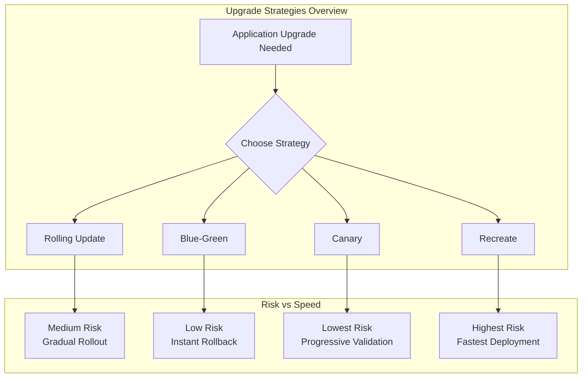
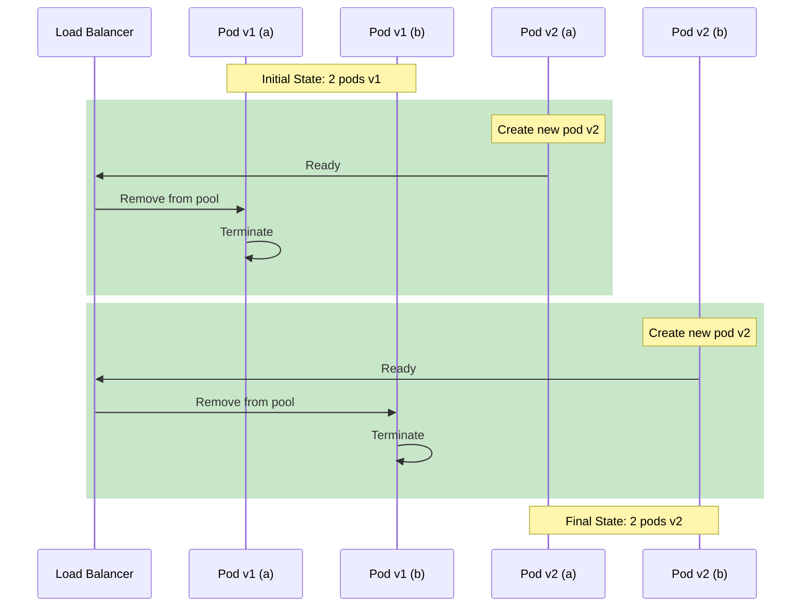
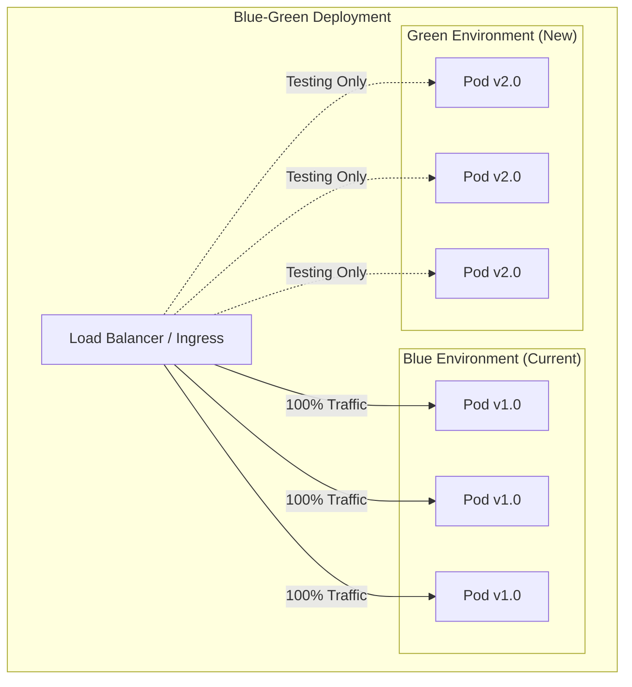
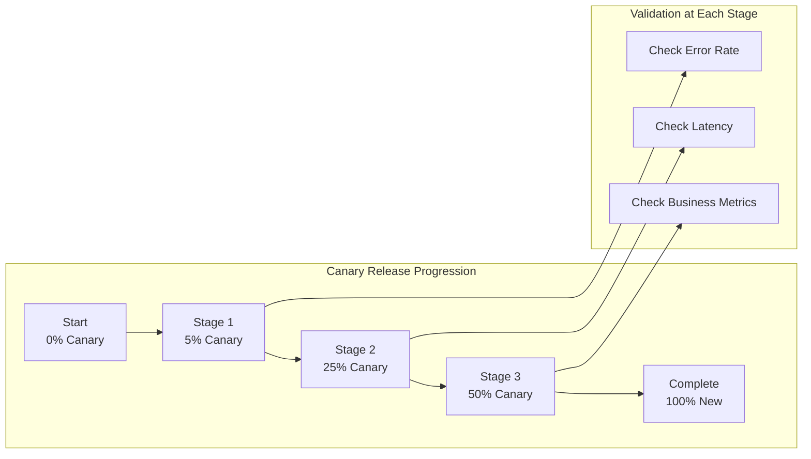
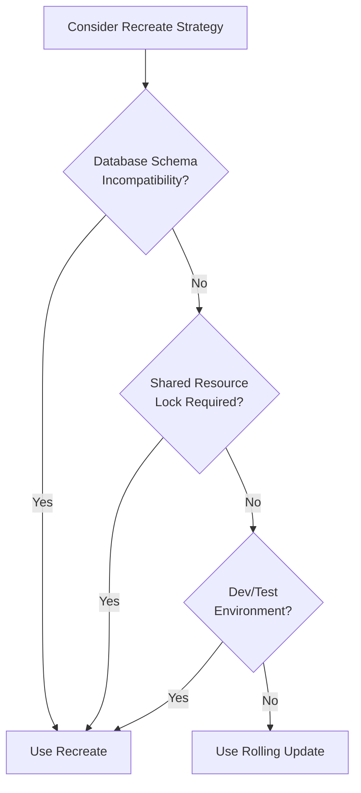
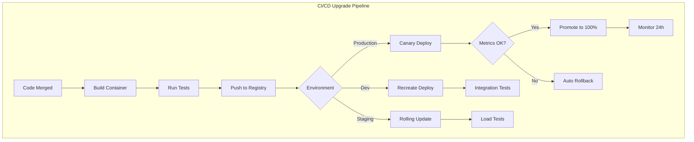

# How to Handle Kubernetes Upgrade Strategies

Author: [nawazdhandala](https://www.github.com/nawazdhandala)

Tags: Kubernetes, Upgrades, Rolling Updates, Blue-Green, Canary, DevOps, High Availability

Description: A practical guide to Kubernetes upgrade strategies including rolling updates, blue-green deployments, canary releases, and in-place upgrades with real-world examples and automation scripts.

---

Running Kubernetes in production means dealing with upgrades constantly. Application updates, security patches, new features, and bug fixes all require careful deployment strategies. Picking the wrong approach can lead to downtime, data corruption, or frustrated users. Let me walk you through the major upgrade strategies and when to use each one.

## Understanding Upgrade Strategies

Before diving into implementation details, it helps to understand what each strategy offers and the tradeoffs involved.



| Strategy | Downtime | Resource Overhead | Rollback Speed | Best For |
| --- | --- | --- | --- | --- |
| Rolling Update | Zero | 25-50% extra | Minutes | Most workloads |
| Blue-Green | Zero | 100% extra | Instant | Critical apps, databases |
| Canary | Zero | 10-20% extra | Fast | High-traffic services |
| Recreate | Brief | None | Manual | Dev/test, stateful apps |

## Rolling Updates

Rolling updates are the default strategy in Kubernetes. Pods get replaced incrementally, maintaining service availability throughout the process.

### How Rolling Updates Work



### Configuring Rolling Update Deployments

The following deployment configuration demonstrates how to set up rolling updates with proper health checks and resource constraints.

```yaml
# rolling-update-deployment.yaml
# Deployment with rolling update strategy for zero-downtime upgrades
apiVersion: apps/v1
kind: Deployment
metadata:
  name: web-app
  namespace: production
spec:
  # Maintain 4 replicas for high availability during updates
  replicas: 4

  # Rolling update configuration
  strategy:
    type: RollingUpdate
    rollingUpdate:
      # Allow 1 extra pod during update for faster rollout
      maxSurge: 1
      # Never go below desired count - ensures capacity
      maxUnavailable: 0

  selector:
    matchLabels:
      app: web-app

  template:
    metadata:
      labels:
        app: web-app
        version: v2.1.0
    spec:
      containers:
        - name: web
          image: myregistry/web-app:v2.1.0
          ports:
            - containerPort: 8080

          # Resource limits ensure predictable scheduling
          resources:
            requests:
              memory: "256Mi"
              cpu: "250m"
            limits:
              memory: "512Mi"
              cpu: "500m"

          # Readiness probe prevents traffic to unhealthy pods
          readinessProbe:
            httpGet:
              path: /health/ready
              port: 8080
            initialDelaySeconds: 10
            periodSeconds: 5
            failureThreshold: 3

          # Liveness probe restarts stuck containers
          livenessProbe:
            httpGet:
              path: /health/live
              port: 8080
            initialDelaySeconds: 30
            periodSeconds: 10
            failureThreshold: 3

      # Spread pods across nodes for resilience
      affinity:
        podAntiAffinity:
          preferredDuringSchedulingIgnoredDuringExecution:
            - weight: 100
              podAffinityTerm:
                labelSelector:
                  matchLabels:
                    app: web-app
                topologyKey: kubernetes.io/hostname
```

### Controlling Rolling Update Speed

You can tune how fast or slow the rollout proceeds based on your risk tolerance and monitoring capabilities.

```bash
# Check current rollout status
kubectl rollout status deployment/web-app -n production

# Pause a rollout if you notice issues
kubectl rollout pause deployment/web-app -n production

# Resume after investigating
kubectl rollout resume deployment/web-app -n production

# View rollout history
kubectl rollout history deployment/web-app -n production

# Rollback to previous version
kubectl rollout undo deployment/web-app -n production

# Rollback to a specific revision
kubectl rollout undo deployment/web-app -n production --to-revision=3
```

### Pod Disruption Budgets for Rolling Updates

Pod Disruption Budgets (PDBs) prevent Kubernetes from removing too many pods simultaneously during voluntary disruptions like upgrades or node drains.

```yaml
# pdb.yaml
# Ensures at least 3 pods remain available during disruptions
apiVersion: policy/v1
kind: PodDisruptionBudget
metadata:
  name: web-app-pdb
  namespace: production
spec:
  # Minimum pods that must remain available
  minAvailable: 3
  selector:
    matchLabels:
      app: web-app
```

Alternatively, specify maximum unavailable pods.

```yaml
# pdb-max-unavailable.yaml
# Allows at most 1 pod to be unavailable at any time
apiVersion: policy/v1
kind: PodDisruptionBudget
metadata:
  name: web-app-pdb
  namespace: production
spec:
  # Maximum pods that can be unavailable
  maxUnavailable: 1
  selector:
    matchLabels:
      app: web-app
```

## Blue-Green Deployments

Blue-green deployments maintain two identical environments. Traffic switches between them instantly, enabling immediate rollback if problems occur.

### Blue-Green Architecture



### Implementing Blue-Green with Services

The blue environment handles production traffic while green gets validated.

```yaml
# blue-deployment.yaml
# Current production deployment (blue)
apiVersion: apps/v1
kind: Deployment
metadata:
  name: web-app-blue
  namespace: production
spec:
  replicas: 3
  selector:
    matchLabels:
      app: web-app
      version: blue
  template:
    metadata:
      labels:
        app: web-app
        version: blue
    spec:
      containers:
        - name: web
          image: myregistry/web-app:v1.0.0
          ports:
            - containerPort: 8080
          readinessProbe:
            httpGet:
              path: /health
              port: 8080
            initialDelaySeconds: 5
            periodSeconds: 3
```

```yaml
# green-deployment.yaml
# New version deployment (green)
apiVersion: apps/v1
kind: Deployment
metadata:
  name: web-app-green
  namespace: production
spec:
  replicas: 3
  selector:
    matchLabels:
      app: web-app
      version: green
  template:
    metadata:
      labels:
        app: web-app
        version: green
    spec:
      containers:
        - name: web
          image: myregistry/web-app:v2.0.0
          ports:
            - containerPort: 8080
          readinessProbe:
            httpGet:
              path: /health
              port: 8080
            initialDelaySeconds: 5
            periodSeconds: 3
```

```yaml
# production-service.yaml
# Service that routes to active environment
# Switch traffic by changing the selector
apiVersion: v1
kind: Service
metadata:
  name: web-app
  namespace: production
spec:
  selector:
    app: web-app
    # Change this to switch traffic: blue -> green or green -> blue
    version: blue
  ports:
    - port: 80
      targetPort: 8080
```

### Blue-Green Switch Script

Automate the switching process with proper validation steps.

```bash
#!/bin/bash
# blue-green-switch.sh
# Automated blue-green deployment switch with validation

set -e

NAMESPACE="production"
SERVICE="web-app"
NEW_VERSION="${1:-green}"  # Default to green, or pass 'blue'

echo "Starting blue-green switch to: $NEW_VERSION"

# Step 1: Verify new deployment is healthy
echo "Checking deployment health..."
READY_PODS=$(kubectl get deployment web-app-$NEW_VERSION -n $NAMESPACE \
  -o jsonpath='{.status.readyReplicas}')
DESIRED_PODS=$(kubectl get deployment web-app-$NEW_VERSION -n $NAMESPACE \
  -o jsonpath='{.spec.replicas}')

if [ "$READY_PODS" != "$DESIRED_PODS" ]; then
  echo "ERROR: $NEW_VERSION deployment not ready ($READY_PODS/$DESIRED_PODS pods)"
  exit 1
fi
echo "Deployment healthy: $READY_PODS/$DESIRED_PODS pods ready"

# Step 2: Run smoke tests against new deployment
echo "Running smoke tests..."
NEW_POD=$(kubectl get pods -n $NAMESPACE -l app=web-app,version=$NEW_VERSION \
  -o jsonpath='{.items[0].metadata.name}')
kubectl exec $NEW_POD -n $NAMESPACE -- curl -sf localhost:8080/health > /dev/null
echo "Smoke tests passed"

# Step 3: Switch service to new version
echo "Switching service to $NEW_VERSION..."
kubectl patch service $SERVICE -n $NAMESPACE \
  -p "{\"spec\":{\"selector\":{\"version\":\"$NEW_VERSION\"}}}"

# Step 4: Verify traffic is flowing
echo "Verifying traffic routing..."
sleep 5
ENDPOINT_COUNT=$(kubectl get endpoints $SERVICE -n $NAMESPACE \
  -o jsonpath='{.subsets[0].addresses}' | jq length)

if [ "$ENDPOINT_COUNT" -gt 0 ]; then
  echo "SUCCESS: Service switched to $NEW_VERSION with $ENDPOINT_COUNT endpoints"
else
  echo "WARNING: No endpoints found, rolling back..."
  OLD_VERSION="blue"
  [ "$NEW_VERSION" == "blue" ] && OLD_VERSION="green"
  kubectl patch service $SERVICE -n $NAMESPACE \
    -p "{\"spec\":{\"selector\":{\"version\":\"$OLD_VERSION\"}}}"
  exit 1
fi

echo "Blue-green switch complete!"
```

### Blue-Green Rollback

Rollback is instantaneous since the old environment remains running.

```bash
# Instant rollback by switching service back
kubectl patch service web-app -n production \
  -p '{"spec":{"selector":{"version":"blue"}}}'

# Verify rollback
kubectl get endpoints web-app -n production
```

## Canary Deployments

Canary deployments release changes to a small subset of users first. If metrics look good, traffic gradually shifts to the new version.

### Canary Deployment Flow



### Basic Canary with Replica Weighting

A simple approach uses replica counts to control traffic distribution.

```yaml
# stable-deployment.yaml
# Stable version receiving most traffic
apiVersion: apps/v1
kind: Deployment
metadata:
  name: web-app-stable
  namespace: production
spec:
  # 9 replicas = approximately 90% of traffic
  replicas: 9
  selector:
    matchLabels:
      app: web-app
      track: stable
  template:
    metadata:
      labels:
        app: web-app
        track: stable
        version: v1.0.0
    spec:
      containers:
        - name: web
          image: myregistry/web-app:v1.0.0
          ports:
            - containerPort: 8080
```

```yaml
# canary-deployment.yaml
# Canary version receiving small traffic percentage
apiVersion: apps/v1
kind: Deployment
metadata:
  name: web-app-canary
  namespace: production
spec:
  # 1 replica = approximately 10% of traffic
  replicas: 1
  selector:
    matchLabels:
      app: web-app
      track: canary
  template:
    metadata:
      labels:
        app: web-app
        track: canary
        version: v2.0.0
    spec:
      containers:
        - name: web
          image: myregistry/web-app:v2.0.0
          ports:
            - containerPort: 8080
```

```yaml
# canary-service.yaml
# Service routes to both stable and canary based on shared label
apiVersion: v1
kind: Service
metadata:
  name: web-app
  namespace: production
spec:
  selector:
    # Both deployments share this label
    app: web-app
  ports:
    - port: 80
      targetPort: 8080
```

### Progressive Canary Rollout Script

Automate the canary progression with metric validation between stages.

```bash
#!/bin/bash
# canary-rollout.sh
# Progressive canary deployment with automatic validation

set -e

NAMESPACE="production"
CANARY_DEPLOY="web-app-canary"
STABLE_DEPLOY="web-app-stable"
PROMETHEUS_URL="http://prometheus.monitoring:9090"

# Canary progression stages: canary_replicas stable_replicas
STAGES=(
  "1 9"   # 10% canary
  "3 7"   # 30% canary
  "5 5"   # 50% canary
  "10 0"  # 100% canary (promote)
)

# Function to check error rate from Prometheus
check_error_rate() {
  local max_error_rate=0.01  # 1% threshold

  # Query error rate for canary pods
  ERROR_RATE=$(curl -s "${PROMETHEUS_URL}/api/v1/query" \
    --data-urlencode "query=sum(rate(http_requests_total{app=\"web-app\",track=\"canary\",status=~\"5..\"}[5m])) / sum(rate(http_requests_total{app=\"web-app\",track=\"canary\"}[5m]))" \
    | jq -r '.data.result[0].value[1] // 0')

  echo "Current canary error rate: $ERROR_RATE"

  if (( $(echo "$ERROR_RATE > $max_error_rate" | bc -l) )); then
    return 1
  fi
  return 0
}

# Function to check latency from Prometheus
check_latency() {
  local max_p99_latency=500  # 500ms threshold

  P99_LATENCY=$(curl -s "${PROMETHEUS_URL}/api/v1/query" \
    --data-urlencode "query=histogram_quantile(0.99, sum(rate(http_request_duration_seconds_bucket{app=\"web-app\",track=\"canary\"}[5m])) by (le)) * 1000" \
    | jq -r '.data.result[0].value[1] // 0')

  echo "Current canary P99 latency: ${P99_LATENCY}ms"

  if (( $(echo "$P99_LATENCY > $max_p99_latency" | bc -l) )); then
    return 1
  fi
  return 0
}

# Function to scale deployments
scale_deployments() {
  local canary_replicas=$1
  local stable_replicas=$2

  echo "Scaling: canary=$canary_replicas, stable=$stable_replicas"

  kubectl scale deployment $CANARY_DEPLOY -n $NAMESPACE --replicas=$canary_replicas
  kubectl scale deployment $STABLE_DEPLOY -n $NAMESPACE --replicas=$stable_replicas

  # Wait for scaling to complete
  kubectl rollout status deployment/$CANARY_DEPLOY -n $NAMESPACE --timeout=120s
  if [ "$stable_replicas" -gt 0 ]; then
    kubectl rollout status deployment/$STABLE_DEPLOY -n $NAMESPACE --timeout=120s
  fi
}

# Function to rollback canary
rollback_canary() {
  echo "ROLLBACK: Reverting to stable version"
  kubectl scale deployment $CANARY_DEPLOY -n $NAMESPACE --replicas=0
  kubectl scale deployment $STABLE_DEPLOY -n $NAMESPACE --replicas=10
  exit 1
}

# Main rollout loop
CURRENT_STAGE=0
for stage in "${STAGES[@]}"; do
  read -r canary_replicas stable_replicas <<< "$stage"

  echo ""
  echo "=== Stage $((CURRENT_STAGE + 1)): ${canary_replicas}0% canary ==="

  scale_deployments $canary_replicas $stable_replicas

  # Bake time: wait for metrics to stabilize
  echo "Waiting 60 seconds for metrics to stabilize..."
  sleep 60

  # Validate metrics
  if ! check_error_rate; then
    echo "ERROR: Error rate exceeded threshold"
    rollback_canary
  fi

  if ! check_latency; then
    echo "ERROR: Latency exceeded threshold"
    rollback_canary
  fi

  echo "Stage $((CURRENT_STAGE + 1)) validation passed"
  CURRENT_STAGE=$((CURRENT_STAGE + 1))
done

echo ""
echo "SUCCESS: Canary rollout complete!"
echo "Cleaning up: renaming canary to stable..."

# Final cleanup: update stable to new version and remove canary
kubectl set image deployment/$STABLE_DEPLOY -n $NAMESPACE \
  web=myregistry/web-app:v2.0.0

kubectl scale deployment $STABLE_DEPLOY -n $NAMESPACE --replicas=10
kubectl scale deployment $CANARY_DEPLOY -n $NAMESPACE --replicas=0

echo "Deployment promotion complete!"
```

### Canary with Istio Service Mesh

Istio provides fine-grained traffic control for canary deployments without relying on replica counts.

```yaml
# istio-virtual-service.yaml
# Precise traffic splitting with Istio
apiVersion: networking.istio.io/v1beta1
kind: VirtualService
metadata:
  name: web-app
  namespace: production
spec:
  hosts:
    - web-app
  http:
    - route:
        # 95% to stable version
        - destination:
            host: web-app
            subset: stable
          weight: 95
        # 5% to canary version
        - destination:
            host: web-app
            subset: canary
          weight: 5
---
# istio-destination-rule.yaml
# Define subsets for routing
apiVersion: networking.istio.io/v1beta1
kind: DestinationRule
metadata:
  name: web-app
  namespace: production
spec:
  host: web-app
  subsets:
    - name: stable
      labels:
        version: v1.0.0
    - name: canary
      labels:
        version: v2.0.0
```

Adjust weights to progress the canary.

```bash
# Increase canary traffic to 25%
kubectl patch virtualservice web-app -n production --type merge -p '
spec:
  http:
  - route:
    - destination:
        host: web-app
        subset: stable
      weight: 75
    - destination:
        host: web-app
        subset: canary
      weight: 25
'
```

## Recreate Strategy

The recreate strategy terminates all existing pods before creating new ones. Use it when you cannot run multiple versions simultaneously.

### When to Use Recreate



### Recreate Deployment Configuration

Configure a deployment that stops all old pods before starting new ones.

```yaml
# recreate-deployment.yaml
# Deployment using recreate strategy
apiVersion: apps/v1
kind: Deployment
metadata:
  name: legacy-app
  namespace: production
spec:
  replicas: 3

  # Recreate: all pods terminated before new ones start
  strategy:
    type: Recreate

  selector:
    matchLabels:
      app: legacy-app

  template:
    metadata:
      labels:
        app: legacy-app
    spec:
      containers:
        - name: app
          image: myregistry/legacy-app:v2.0.0
          ports:
            - containerPort: 8080

          # Graceful shutdown handling
          lifecycle:
            preStop:
              exec:
                command:
                  - /bin/sh
                  - -c
                  - |
                    # Drain connections gracefully
                    /app/drain-connections.sh
                    sleep 10

          # Extended termination period for cleanup
          terminationGracePeriodSeconds: 60
```

### Minimizing Recreate Downtime

Reduce downtime during recreate deployments with proper initialization.

```yaml
# fast-startup-deployment.yaml
# Optimized for quick startup during recreate
apiVersion: apps/v1
kind: Deployment
metadata:
  name: legacy-app
  namespace: production
spec:
  replicas: 3
  strategy:
    type: Recreate
  selector:
    matchLabels:
      app: legacy-app
  template:
    metadata:
      labels:
        app: legacy-app
    spec:
      # Init containers prepare dependencies
      initContainers:
        - name: wait-for-db
          image: busybox:1.35
          command:
            - sh
            - -c
            - |
              until nc -z database-svc 5432; do
                echo "Waiting for database..."
                sleep 2
              done
              echo "Database ready"

      containers:
        - name: app
          image: myregistry/legacy-app:v2.0.0

          # Aggressive readiness for faster service restoration
          readinessProbe:
            httpGet:
              path: /health
              port: 8080
            initialDelaySeconds: 5
            periodSeconds: 2
            failureThreshold: 1
```

## Automated Upgrade Pipeline

Combine strategies in a CI/CD pipeline for production-grade deployments.



### GitOps-Based Upgrade Workflow

Implement upgrades through Git commits for auditability and easy rollback.

```yaml
# kustomization.yaml
# Kustomize configuration for environment-specific upgrades
apiVersion: kustomize.config.k8s.io/v1beta1
kind: Kustomization

namespace: production

resources:
  - deployment.yaml
  - service.yaml
  - pdb.yaml

images:
  - name: myregistry/web-app
    newTag: v2.1.0  # Update this in PR to trigger rollout

replicas:
  - name: web-app
    count: 5

patches:
  - patch: |-
      - op: add
        path: /spec/template/metadata/annotations/upgrade-timestamp
        value: "2026-02-02T10:00:00Z"
    target:
      kind: Deployment
      name: web-app
```

### ArgoCD Application for Progressive Delivery

Define ArgoCD application with automated sync and rollback.

```yaml
# argocd-application.yaml
# ArgoCD application with progressive delivery settings
apiVersion: argoproj.io/v1alpha1
kind: Application
metadata:
  name: web-app
  namespace: argocd
spec:
  project: default

  source:
    repoURL: https://github.com/myorg/k8s-manifests.git
    targetRevision: main
    path: apps/web-app/overlays/production

  destination:
    server: https://kubernetes.default.svc
    namespace: production

  syncPolicy:
    automated:
      prune: true
      selfHeal: true
    syncOptions:
      - CreateNamespace=true
      - ApplyOutOfSyncOnly=true
    retry:
      limit: 3
      backoff:
        duration: 5s
        factor: 2
        maxDuration: 3m
```

## Monitoring Upgrades

Track deployment health during upgrades to catch issues early.

### Key Metrics to Monitor

```yaml
# prometheus-rules.yaml
# Alerting rules for deployment health
apiVersion: monitoring.coreos.com/v1
kind: PrometheusRule
metadata:
  name: deployment-alerts
  namespace: monitoring
spec:
  groups:
    - name: deployment-health
      rules:
        # Alert if deployment rollout is stuck
        - alert: DeploymentRolloutStuck
          expr: |
            kube_deployment_status_observed_generation
            != kube_deployment_metadata_generation
          for: 15m
          labels:
            severity: warning
          annotations:
            summary: "Deployment rollout stuck"
            description: "{{ $labels.deployment }} rollout has not progressed for 15 minutes"

        # Alert on high restart rate during rollout
        - alert: HighPodRestartRate
          expr: |
            increase(kube_pod_container_status_restarts_total[10m]) > 5
          labels:
            severity: critical
          annotations:
            summary: "High pod restart rate"
            description: "Pod {{ $labels.pod }} restarted {{ $value }} times in 10 minutes"

        # Alert if error rate spikes after deployment
        - alert: ErrorRateSpike
          expr: |
            (
              sum(rate(http_requests_total{status=~"5.."}[5m]))
              / sum(rate(http_requests_total[5m]))
            ) > 0.05
          for: 5m
          labels:
            severity: critical
          annotations:
            summary: "Error rate above 5%"
            description: "Application error rate is {{ $value | humanizePercentage }}"
```

### Deployment Dashboard Queries

Use these PromQL queries to build a deployment monitoring dashboard.

```promql
# Current deployment progress
kube_deployment_status_replicas_updated{deployment="web-app"}
/ kube_deployment_spec_replicas{deployment="web-app"}

# Pods not ready
kube_deployment_spec_replicas{deployment="web-app"}
- kube_deployment_status_replicas_available{deployment="web-app"}

# Container restart rate
sum(increase(kube_pod_container_status_restarts_total{
  pod=~"web-app.*"
}[5m])) by (pod)

# Request latency by version
histogram_quantile(0.95,
  sum(rate(http_request_duration_seconds_bucket{
    app="web-app"
  }[5m])) by (version, le)
)
```

## Best Practices Summary

1. **Choose the right strategy** - Rolling updates work for most cases, use blue-green for critical apps, canary for high-traffic services
2. **Always set resource requests and limits** - Prevents scheduling issues during upgrades
3. **Configure proper health checks** - Readiness probes prevent traffic to unhealthy pods
4. **Use Pod Disruption Budgets** - Maintains availability during voluntary disruptions
5. **Implement graceful shutdown** - Drain connections before termination
6. **Automate rollback triggers** - Monitor metrics and roll back automatically on threshold breaches
7. **Test upgrades in staging first** - Catch issues before they reach production
8. **Keep previous version ready** - For blue-green, maintain the old environment until confident

## Conclusion

Kubernetes upgrade strategies give you flexibility to balance risk and speed. Rolling updates handle most situations well with zero downtime and moderate resource overhead. Blue-green deployments provide instant rollback for mission-critical applications. Canary releases let you validate changes with real traffic before full rollout.

The key is matching your strategy to your application requirements. Stateless web services typically work great with rolling updates or canary releases. Applications with database migrations or resource locks might need recreate deployments during maintenance windows.

For monitoring your Kubernetes deployments and getting alerts when upgrades cause issues, check out [OneUptime's Kubernetes monitoring](https://oneuptime.com/product/metrics).

## Related Resources

- [How to Upgrade Kubernetes Clusters with Zero Downtime](https://oneuptime.com/blog/post/2026-01-19-kubernetes-upgrade-zero-downtime/view)
- [How to Drain and Cordon Nodes for Maintenance](https://oneuptime.com/blog/post/2026-01-19-kubernetes-drain-cordon-node-maintenance/view)
- [How to Set Up Pod Disruption Budgets](https://oneuptime.com/blog/post/2026-01-19-kubernetes-resource-quotas-limit-ranges/view)
- [How to Upgrade and Rollback Helm Releases Safely](https://oneuptime.com/blog/post/2026-01-17-helm-upgrade-rollback-releases/view)
