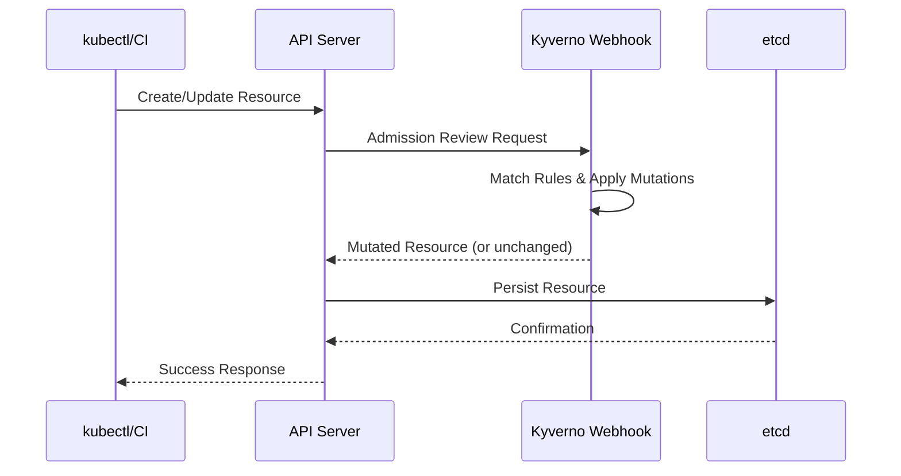
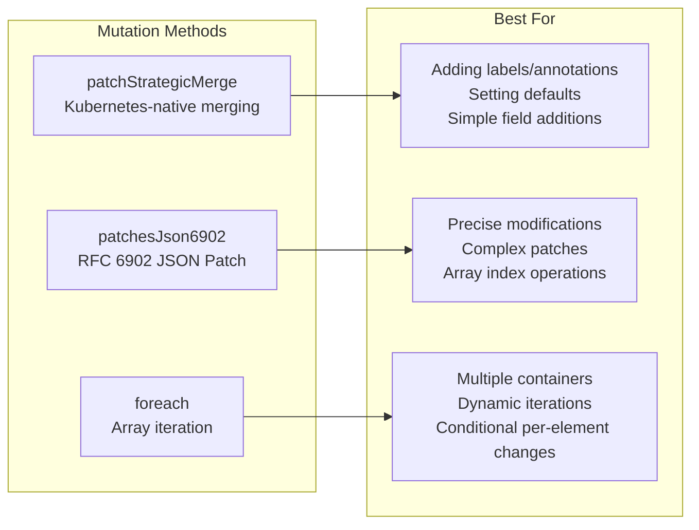
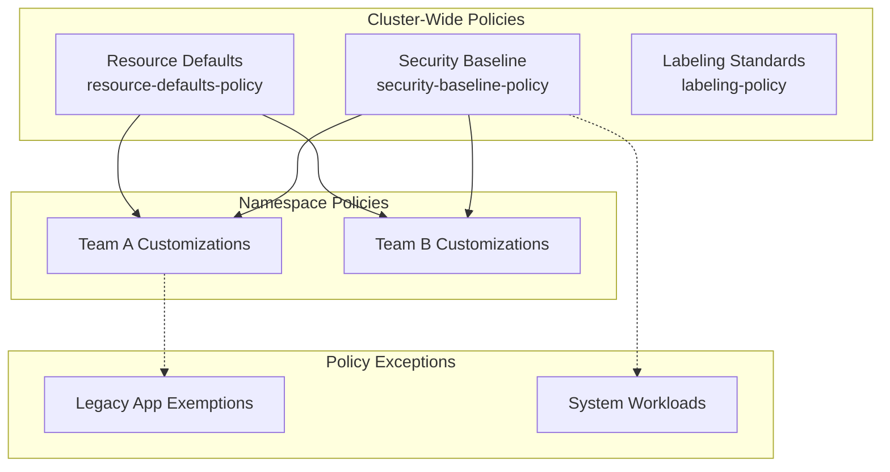

# How to Implement Kyverno Mutation Policies

Author: [nawazdhandala](https://www.github.com/nawazdhandala)

Tags: Kyverno, Kubernetes, Policy, Mutation, DevOps, Security, Admission Controller, GitOps

Description: Learn how to implement Kyverno mutation policies in Kubernetes to automatically modify resources, inject sidecars, enforce standards, and manage configurations at scale with practical examples and troubleshooting strategies.

---

> Mutation policies transform how teams manage Kubernetes resources. Rather than relying on developers to remember every label, annotation, and security setting, Kyverno intercepts API requests and applies modifications automatically. Done right, mutation policies eliminate configuration drift and reduce production incidents caused by missing settings.

Kubernetes admission controllers sit between the API server and etcd, inspecting and potentially modifying resources before they are persisted. Kyverno leverages mutation webhooks to intercept CREATE and UPDATE operations, applying transformations defined in policy YAML files. Unlike traditional approaches that require custom code, Kyverno policies are declarative and version-controlled alongside your application manifests.

---

## How Mutation Policies Work

Understanding the request flow helps when debugging policies. When a user applies a resource, the Kubernetes API server routes the request through admission webhooks before storing it.



Kyverno evaluates policies in a deterministic order. When multiple policies match, mutations are applied sequentially based on policy name. Plan your naming conventions accordingly.

---

## Installing Kyverno

Before implementing policies, deploy Kyverno to your cluster. Helm provides the cleanest installation path.

The following commands add the Kyverno Helm repository, update your local chart cache, and install Kyverno with high availability settings suitable for production clusters.

```bash
# Add the official Kyverno Helm repository
helm repo add kyverno https://kyverno.github.io/kyverno/

# Fetch the latest charts
helm repo update

# Install Kyverno with production-ready settings
helm install kyverno kyverno/kyverno \
  --namespace kyverno \
  --create-namespace \
  --set replicaCount=3 \
  --set admissionController.replicas=3
```

Verify the installation by checking pod status.

```bash
# Confirm all Kyverno components are running
kubectl get pods -n kyverno

# Check webhook configurations are registered
kubectl get validatingwebhookconfigurations | grep kyverno
kubectl get mutatingwebhookconfigurations | grep kyverno
```

---

## Core Mutation Strategies

Kyverno offers three primary mutation methods. Each serves different use cases.



### Strategic Merge Patch

Strategic merge patch follows Kubernetes conventions. Fields are merged intelligently based on patch strategy markers in the API schema.

A policy that adds cost tracking labels demonstrates the basic pattern. The `+()` anchor means "add if not exists" and prevents overwriting user-specified values.

```yaml
# policy-add-cost-labels.yaml
# Adds cost allocation labels to all pods for chargeback reporting
apiVersion: kyverno.io/v1
kind: ClusterPolicy
metadata:
  name: add-cost-labels
  annotations:
    policies.kyverno.io/title: Add Cost Allocation Labels
    policies.kyverno.io/description: >-
      Adds default cost-center and business-unit labels to pods
      that lack them, enabling accurate cost allocation reporting.
spec:
  # Start in audit mode to observe behavior
  validationFailureAction: Audit
  background: true
  rules:
    - name: add-cost-tracking-labels
      match:
        any:
          - resources:
              kinds:
                - Pod
      exclude:
        any:
          - resources:
              namespaces:
                - kube-system
                - kube-public
                - kyverno
      mutate:
        patchStrategicMerge:
          metadata:
            labels:
              # The + anchor adds only if label is missing
              +(cost-center): "shared-infrastructure"
              +(business-unit): "engineering"
              +(managed-by): "kyverno"
```

Apply and test the policy.

```bash
# Deploy the policy
kubectl apply -f policy-add-cost-labels.yaml

# Create a test pod without labels
kubectl run test-pod --image=nginx --restart=Never

# Verify labels were added
kubectl get pod test-pod --show-labels

# Clean up
kubectl delete pod test-pod
```

### JSON Patch Operations

JSON Patch provides surgical precision. Each operation specifies an exact path and action.

Injecting environment variables into all containers requires JSON Patch because strategic merge cannot reliably add to existing arrays without knowing their contents.

```yaml
# policy-inject-env-vars.yaml
# Injects standard environment variables into all containers
apiVersion: kyverno.io/v1
kind: ClusterPolicy
metadata:
  name: inject-standard-env
  annotations:
    policies.kyverno.io/title: Inject Standard Environment Variables
spec:
  validationFailureAction: Audit
  rules:
    - name: add-cluster-info-env
      match:
        any:
          - resources:
              kinds:
                - Pod
      exclude:
        any:
          - resources:
              namespaces:
                - kube-system
      mutate:
        patchesJson6902: |-
          # Add CLUSTER_NAME environment variable to first container
          - op: add
            path: /spec/containers/0/env/-
            value:
              name: CLUSTER_NAME
              value: "production-east-1"
          # Add REGION environment variable
          - op: add
            path: /spec/containers/0/env/-
            value:
              name: REGION
              value: "us-east-1"
          # Add POD_NAME from downward API
          - op: add
            path: /spec/containers/0/env/-
            value:
              name: POD_NAME
              valueFrom:
                fieldRef:
                  fieldPath: metadata.name
```

### Foreach Iteration

Foreach applies mutations to each element in an array. When pods contain multiple containers, foreach ensures every container receives the modification.

The following policy adds security context settings to all containers, not just the first one.

```yaml
# policy-security-context-all-containers.yaml
# Applies security hardening to every container in a pod
apiVersion: kyverno.io/v1
kind: ClusterPolicy
metadata:
  name: harden-all-containers
  annotations:
    policies.kyverno.io/title: Security Hardening for All Containers
spec:
  validationFailureAction: Audit
  rules:
    - name: apply-security-context
      match:
        any:
          - resources:
              kinds:
                - Pod
      exclude:
        any:
          - resources:
              namespaces:
                - kube-system
      mutate:
        # Iterate over each container in the pod
        foreach:
          - list: "request.object.spec.containers"
            patchStrategicMerge:
              spec:
                containers:
                  # element.name references current container
                  - name: "{{ element.name }}"
                    securityContext:
                      +(allowPrivilegeEscalation): false
                      +(readOnlyRootFilesystem): true
                      +(runAsNonRoot): true
                      +(capabilities):
                        drop:
                          - ALL
          # Also handle init containers if present
          - list: "request.object.spec.initContainers || `[]`"
            patchStrategicMerge:
              spec:
                initContainers:
                  - name: "{{ element.name }}"
                    securityContext:
                      +(allowPrivilegeEscalation): false
                      +(capabilities):
                        drop:
                          - ALL
```

---

## Advanced Implementation Patterns

Production environments require sophisticated patterns that handle edge cases and integrate with existing infrastructure.

### Sidecar Injection

Automatically injecting sidecars standardizes observability across all workloads. The following policy injects an OpenTelemetry collector sidecar into deployments labeled for tracing.

```yaml
# policy-inject-otel-sidecar.yaml
# Injects OpenTelemetry collector sidecar for distributed tracing
apiVersion: kyverno.io/v1
kind: ClusterPolicy
metadata:
  name: inject-otel-sidecar
  annotations:
    policies.kyverno.io/title: Inject OpenTelemetry Sidecar
    policies.kyverno.io/description: >-
      Automatically injects an OpenTelemetry collector sidecar into
      deployments that have the tracing.enabled label set to true.
spec:
  validationFailureAction: Audit
  rules:
    - name: inject-otel-collector
      match:
        any:
          - resources:
              kinds:
                - Deployment
              selector:
                matchLabels:
                  tracing.enabled: "true"
      exclude:
        any:
          - resources:
              # Skip if sidecar already exists
              selector:
                matchLabels:
                  tracing.sidecar/injected: "true"
      mutate:
        patchesJson6902: |-
          # Add the OpenTelemetry collector container
          - op: add
            path: /spec/template/spec/containers/-
            value:
              name: otel-collector
              image: otel/opentelemetry-collector:0.92.0
              args:
                - "--config=/etc/otel/config.yaml"
              ports:
                - containerPort: 4317
                  name: otlp-grpc
                - containerPort: 4318
                  name: otlp-http
              resources:
                requests:
                  memory: "64Mi"
                  cpu: "50m"
                limits:
                  memory: "128Mi"
                  cpu: "100m"
              volumeMounts:
                - name: otel-config
                  mountPath: /etc/otel
          # Add config volume
          - op: add
            path: /spec/template/spec/volumes/-
            value:
              name: otel-config
              configMap:
                name: otel-collector-config
          # Mark as injected to prevent duplicate injection
          - op: add
            path: /spec/template/metadata/labels/tracing.sidecar~1injected
            value: "true"
```

The `~1` in the path escapes the forward slash in label keys. JSON Pointer specification requires this encoding.

### Image Registry Rewriting

Organizations using private registries need to redirect all image pulls. Foreach with image parsing handles complex scenarios.

```yaml
# policy-rewrite-registry.yaml
# Redirects all container images to internal registry
apiVersion: kyverno.io/v1
kind: ClusterPolicy
metadata:
  name: rewrite-image-registry
  annotations:
    policies.kyverno.io/title: Rewrite Container Image Registry
spec:
  validationFailureAction: Audit
  rules:
    - name: redirect-to-internal-registry
      match:
        any:
          - resources:
              kinds:
                - Pod
      preconditions:
        all:
          # Only rewrite if not already using internal registry
          - key: "{{ request.object.spec.containers[0].image }}"
            operator: NotEquals
            value: "registry.internal.company.com/*"
      mutate:
        foreach:
          - list: "request.object.spec.containers"
            patchStrategicMerge:
              spec:
                containers:
                  - name: "{{ element.name }}"
                    # Parse and reconstruct image reference
                    image: "registry.internal.company.com/{{ images.containers.\"{{element.name}}\".path }}:{{ images.containers.\"{{element.name}}\".tag || 'latest' }}"
          # Handle init containers separately
          - list: "request.object.spec.initContainers || `[]`"
            patchStrategicMerge:
              spec:
                initContainers:
                  - name: "{{ element.name }}"
                    image: "registry.internal.company.com/{{ images.initContainers.\"{{element.name}}\".path }}:{{ images.initContainers.\"{{element.name}}\".tag || 'latest' }}"
```

### Context-Aware Mutations

Pull data from ConfigMaps, Secrets, or the Kubernetes API to make dynamic decisions.

```yaml
# policy-environment-defaults.yaml
# Applies different defaults based on namespace environment label
apiVersion: kyverno.io/v1
kind: ClusterPolicy
metadata:
  name: environment-aware-defaults
spec:
  validationFailureAction: Audit
  rules:
    - name: apply-environment-resources
      match:
        any:
          - resources:
              kinds:
                - Deployment
      context:
        # Fetch namespace metadata
        - name: nsData
          apiCall:
            urlPath: "/api/v1/namespaces/{{ request.namespace }}"
            jmesPath: "metadata.labels"
        # Load resource presets from ConfigMap
        - name: resourcePresets
          configMap:
            name: resource-presets
            namespace: kyverno
      mutate:
        patchStrategicMerge:
          spec:
            # Set replicas based on environment
            +(replicas): "{{ nsData.environment == 'production' && '3' || '1' }}"
            template:
              spec:
                containers:
                  - (name): "*"
                    resources:
                      requests:
                        # Use preset values from ConfigMap
                        +(memory): "{{ resourcePresets.data.\"{{ nsData.environment }}-memory\" || '128Mi' }}"
                        +(cpu): "{{ resourcePresets.data.\"{{ nsData.environment }}-cpu\" || '100m' }}"
```

Create the supporting ConfigMap.

```yaml
# configmap-resource-presets.yaml
# Stores resource presets for different environments
apiVersion: v1
kind: ConfigMap
metadata:
  name: resource-presets
  namespace: kyverno
data:
  production-memory: "256Mi"
  production-cpu: "250m"
  staging-memory: "128Mi"
  staging-cpu: "100m"
  development-memory: "64Mi"
  development-cpu: "50m"
```

---

## Policy Organization Architecture

Large-scale deployments benefit from structured policy organization.



### Organizing Policies by Concern

Group policies into logical categories for maintainability.

```bash
# Recommended directory structure
policies/
  security/
    pod-security-baseline.yaml
    network-policy-defaults.yaml
    secrets-encryption.yaml
  labeling/
    cost-allocation-labels.yaml
    team-ownership-labels.yaml
  resources/
    resource-defaults.yaml
    priority-class-injection.yaml
  sidecars/
    logging-sidecar.yaml
    otel-sidecar.yaml
  exceptions/
    legacy-apps.yaml
    system-workloads.yaml
```

---

## Testing Mutations

Validate policies before deploying to production. Kyverno CLI enables offline testing.

### Installing Kyverno CLI

Install the CLI tool for local testing.

```bash
# macOS installation via Homebrew
brew install kyverno

# Linux installation
curl -LO https://github.com/kyverno/kyverno/releases/download/v1.11.0/kyverno-cli_v1.11.0_linux_x86_64.tar.gz
tar -xzf kyverno-cli_v1.11.0_linux_x86_64.tar.gz
sudo mv kyverno /usr/local/bin/

# Verify installation
kyverno version
```

### Running Policy Tests

Test policies against sample resources.

```bash
# Apply policy to a resource and see the mutated output
kyverno apply policy-add-cost-labels.yaml \
  --resource test-pod.yaml \
  -o yaml

# Test multiple policies at once
kyverno apply policies/ \
  --resource test-deployment.yaml \
  -o yaml

# Validate policy syntax
kyverno validate policy-add-cost-labels.yaml
```

### Creating Test Suites

Structured test files ensure consistent validation.

```yaml
# kyverno-test.yaml
# Automated test suite for mutation policies
name: mutation-policy-tests
policies:
  - policies/labeling/cost-allocation-labels.yaml
  - policies/resources/resource-defaults.yaml
resources:
  - test-resources/pod-without-labels.yaml
  - test-resources/deployment-minimal.yaml
results:
  - policy: add-cost-labels
    rule: add-cost-tracking-labels
    resource: test-pod
    kind: Pod
    patchedResource: expected-outputs/pod-with-labels.yaml
    result: pass
  - policy: resource-defaults
    rule: set-memory-defaults
    resource: minimal-deployment
    kind: Deployment
    patchedResource: expected-outputs/deployment-with-resources.yaml
    result: pass
```

Execute the test suite.

```bash
# Run all tests with detailed output
kyverno test . --detailed-results

# Run specific test file
kyverno test kyverno-test.yaml
```

---

## Debugging and Troubleshooting

When mutations fail silently or produce unexpected results, systematic debugging identifies the root cause.

### Checking Policy Status

Start by examining policy status and admission controller health.

```bash
# List all cluster policies with their status
kubectl get clusterpolicies

# Get detailed information about a specific policy
kubectl describe clusterpolicy add-cost-labels

# Check for policy violations
kubectl get policyreports -A
kubectl get clusterpolicyreports
```

### Viewing Admission Controller Logs

Kyverno logs reveal matching decisions and mutation applications.

```bash
# Stream admission controller logs
kubectl logs -n kyverno \
  -l app.kubernetes.io/component=admission-controller \
  -f

# Filter for mutation-related entries
kubectl logs -n kyverno \
  -l app.kubernetes.io/component=admission-controller \
  | grep -i mutation

# Check for errors
kubectl logs -n kyverno \
  -l app.kubernetes.io/component=admission-controller \
  | grep -i error
```

### Common Issues and Solutions

| Symptom | Likely Cause | Solution |
|---------|--------------|----------|
| Mutation not applied | Policy not matching resource | Verify match conditions and resource kinds |
| Partial mutation | Anchor syntax incorrect | Check `+()` usage and strategic merge paths |
| Policy shows error status | Invalid YAML or JMESPath | Use `kyverno validate` to check syntax |
| Context variable empty | API call failing | Verify RBAC permissions for Kyverno SA |
| Duplicate sidecars | Missing exclusion for injected label | Add selector to exclude already-mutated resources |
| Mutation order wrong | Policy naming | Rename policies to control execution order |

### Enabling Debug Mode

Increase logging verbosity for detailed troubleshooting.

```bash
# Upgrade Kyverno with debug logging
helm upgrade kyverno kyverno/kyverno \
  --namespace kyverno \
  --set admissionController.container.args="{--v=4}"

# Check verbose logs
kubectl logs -n kyverno \
  -l app.kubernetes.io/component=admission-controller \
  --tail=100
```

### Validating RBAC for Context API Calls

Policies using context variables with API calls require appropriate permissions.

```yaml
# kyverno-api-access-rbac.yaml
# Grants Kyverno permission to read namespace labels
apiVersion: rbac.authorization.k8s.io/v1
kind: ClusterRole
metadata:
  name: kyverno-context-api-access
rules:
  - apiGroups: [""]
    resources: ["namespaces"]
    verbs: ["get", "list"]
  - apiGroups: [""]
    resources: ["configmaps"]
    verbs: ["get", "list"]
    resourceNames: ["resource-presets", "mutation-config"]
---
apiVersion: rbac.authorization.k8s.io/v1
kind: ClusterRoleBinding
metadata:
  name: kyverno-context-api-access
roleRef:
  apiGroup: rbac.authorization.k8s.io
  kind: ClusterRole
  name: kyverno-context-api-access
subjects:
  - kind: ServiceAccount
    name: kyverno-admission-controller
    namespace: kyverno
```

---

## Production Deployment Strategy

Rolling out mutation policies requires careful planning to avoid disrupting running workloads.

### Phase 1: Audit Mode

Deploy policies in audit mode first to understand impact without making changes.

```yaml
# All policies start with audit mode
spec:
  validationFailureAction: Audit
  background: true  # Scan existing resources
```

Monitor policy reports for potential matches.

```bash
# View policy report summary
kubectl get policyreport -A -o wide

# Get detailed report for a namespace
kubectl describe policyreport -n production
```

### Phase 2: Enforce on New Resources

After validating behavior, enforce for new resources while preserving existing ones.

```yaml
spec:
  validationFailureAction: Enforce
  background: false  # Only apply to new resources
```

### Phase 3: Background Scanning

Enable background scanning to mutate existing resources.

```yaml
spec:
  validationFailureAction: Enforce
  background: true
  # Scan existing resources
  schemaValidation: false
```

### Rollback Strategy

Always maintain the ability to quickly disable problematic policies.

```bash
# Disable a policy without deleting
kubectl annotate clusterpolicy add-cost-labels \
  policies.kyverno.io/disable=true

# Re-enable
kubectl annotate clusterpolicy add-cost-labels \
  policies.kyverno.io/disable-

# Emergency: delete the policy
kubectl delete clusterpolicy add-cost-labels
```

---

## Complete Production Example

A comprehensive policy combining multiple patterns demonstrates real-world implementation.

```yaml
# production-pod-standards.yaml
# Complete production-ready mutation policy
apiVersion: kyverno.io/v1
kind: ClusterPolicy
metadata:
  name: production-pod-standards
  annotations:
    policies.kyverno.io/title: Production Pod Standards
    policies.kyverno.io/category: Best Practices
    policies.kyverno.io/severity: medium
    policies.kyverno.io/description: >-
      Applies production standards to all pods including security
      context, resource limits, labels, and observability settings.
spec:
  validationFailureAction: Audit
  background: true
  rules:
    # Rule 1: Add standard labels for cost allocation and ownership
    - name: add-standard-labels
      match:
        any:
          - resources:
              kinds:
                - Pod
      exclude:
        any:
          - resources:
              namespaces:
                - kube-system
                - kube-public
                - kyverno
      context:
        - name: nsLabels
          apiCall:
            urlPath: "/api/v1/namespaces/{{ request.namespace }}"
            jmesPath: "metadata.labels"
      mutate:
        patchStrategicMerge:
          metadata:
            labels:
              +(environment): "{{ nsLabels.environment || 'development' }}"
              +(cost-center): "{{ nsLabels.\"cost-center\" || 'shared' }}"
              +(managed-by): "kyverno"

    # Rule 2: Set resource defaults for all containers
    - name: set-resource-defaults
      match:
        any:
          - resources:
              kinds:
                - Pod
      exclude:
        any:
          - resources:
              namespaces:
                - kube-system
      mutate:
        foreach:
          - list: "request.object.spec.containers"
            patchStrategicMerge:
              spec:
                containers:
                  - name: "{{ element.name }}"
                    resources:
                      requests:
                        +(memory): "64Mi"
                        +(cpu): "50m"
                      limits:
                        +(memory): "256Mi"
                        +(cpu): "500m"

    # Rule 3: Apply security hardening
    - name: apply-security-context
      match:
        any:
          - resources:
              kinds:
                - Pod
      exclude:
        any:
          - resources:
              namespaces:
                - kube-system
      mutate:
        patchStrategicMerge:
          spec:
            securityContext:
              +(runAsNonRoot): true
              +(seccompProfile):
                type: RuntimeDefault
            automountServiceAccountToken: false

    # Rule 4: Add pod disruption budget annotation
    - name: add-pdb-annotation
      match:
        any:
          - resources:
              kinds:
                - Deployment
              namespaceSelector:
                matchLabels:
                  environment: production
      mutate:
        patchStrategicMerge:
          metadata:
            annotations:
              +(pdb.kubernetes.io/min-available): "50%"
```

---

## Key Takeaways

Effective Kyverno mutation policies follow these principles:

- **Start with strategic merge** for simple additions like labels and annotations
- **Use JSON Patch** when you need precise control over array positions
- **Apply foreach** when mutating all containers in a pod
- **Test offline first** using the Kyverno CLI before cluster deployment
- **Deploy in audit mode** and monitor policy reports before enforcing
- **Exclude system namespaces** to prevent breaking cluster components
- **Version policies** alongside application manifests in Git
- **Monitor admission controller logs** when troubleshooting unexpected behavior

Mutation policies reduce cognitive load on developers while ensuring consistent standards across all workloads. Build incrementally, starting with high-value, low-risk mutations like labeling before progressing to complex sidecar injection.

---

*Building a Kubernetes platform? [OneUptime](https://oneuptime.com) provides comprehensive monitoring for your clusters, including policy compliance tracking and alerting when mutations fail.*
