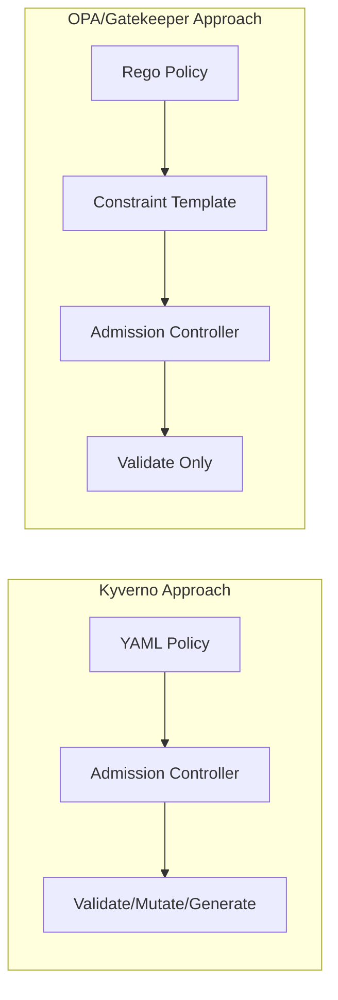
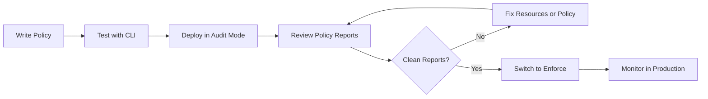

# How to Write Kyverno Policies

Author: [nawazdhandala](https://www.github.com/nawazdhandala)

Tags: Kyverno, Kubernetes, Policies, Security, DevOps

Description: A practical guide to writing Kyverno policies for Kubernetes, covering validation, mutation, and generation rules with real-world examples.

---

Kyverno is a policy engine built specifically for Kubernetes. Unlike OPA/Gatekeeper, which requires learning Rego, Kyverno policies are written in plain YAML. If you can write Kubernetes manifests, you can write Kyverno policies.

## Why Kyverno Over Alternatives



Kyverno advantages:
- **No new language** - Pure Kubernetes-style YAML
- **Three policy types** - Validate, mutate, and generate resources
- **Built-in variables** - Access request context without custom functions
- **CLI testing** - Test policies locally before deploying
- **Policy reports** - Audit existing resources against policies

## Installing Kyverno

Install Kyverno using Helm.

```bash
# Add the Kyverno Helm repository
helm repo add kyverno https://kyverno.github.io/kyverno/
helm repo update

# Install Kyverno in high availability mode for production
helm install kyverno kyverno/kyverno -n kyverno --create-namespace \
  --set replicaCount=3 \
  --set admissionController.replicas=3
```

Verify the installation.

```bash
kubectl get pods -n kyverno
```

## Policy Structure Basics

Every Kyverno policy follows this structure.

```yaml
apiVersion: kyverno.io/v1
kind: ClusterPolicy      # or Policy for namespace-scoped
metadata:
  name: policy-name
  annotations:
    policies.kyverno.io/title: Human-readable title
    policies.kyverno.io/description: What this policy does
spec:
  validationFailureAction: Enforce  # or Audit
  background: true                  # Check existing resources
  rules:
    - name: rule-name
      match:
        any:
          - resources:
              kinds:
                - Pod
      validate:
        message: "Error message shown to users"
        pattern:
          # Pattern to match
```

### Policy Types

| Type | Purpose | Use Case |
|------|---------|----------|
| validate | Block non-compliant resources | Enforce security standards |
| mutate | Modify resources on the fly | Add default values, labels |
| generate | Create new resources | Auto-create NetworkPolicies |
| verifyImages | Check image signatures | Supply chain security |

## Writing Validation Policies

Validation policies check if resources comply with your rules.

### Require Labels on All Resources

This policy ensures all pods have required labels for identification.

```yaml
apiVersion: kyverno.io/v1
kind: ClusterPolicy
metadata:
  name: require-labels
  annotations:
    policies.kyverno.io/title: Require Labels
    policies.kyverno.io/description: >-
      All pods must have 'app' and 'owner' labels for resource tracking
      and cost allocation purposes.
spec:
  validationFailureAction: Enforce
  background: true
  rules:
    - name: check-for-labels
      match:
        any:
          - resources:
              kinds:
                - Pod
      validate:
        message: "Pods must have 'app' and 'owner' labels"
        pattern:
          metadata:
            labels:
              app: "?*"      # Must exist and be non-empty
              owner: "?*"
```

### Disallow Privileged Containers

Privileged containers have full access to the host. Block them.

```yaml
apiVersion: kyverno.io/v1
kind: ClusterPolicy
metadata:
  name: disallow-privileged
  annotations:
    policies.kyverno.io/title: Disallow Privileged Containers
    policies.kyverno.io/description: >-
      Privileged containers can access host resources and should be
      blocked in production environments.
spec:
  validationFailureAction: Enforce
  background: true
  rules:
    - name: deny-privileged
      match:
        any:
          - resources:
              kinds:
                - Pod
      validate:
        message: "Privileged containers are not allowed"
        pattern:
          spec:
            containers:
              - securityContext:
                  privileged: "!true"
            # Also check init containers
            =(initContainers):
              - securityContext:
                  privileged: "!true"
```

### Require Resource Limits

Prevent runaway containers from consuming all cluster resources.

```yaml
apiVersion: kyverno.io/v1
kind: ClusterPolicy
metadata:
  name: require-resource-limits
  annotations:
    policies.kyverno.io/title: Require Resource Limits
    policies.kyverno.io/description: >-
      All containers must specify CPU and memory limits to prevent
      resource exhaustion in the cluster.
spec:
  validationFailureAction: Enforce
  background: true
  rules:
    - name: validate-limits
      match:
        any:
          - resources:
              kinds:
                - Pod
      validate:
        message: "CPU and memory limits are required for all containers"
        pattern:
          spec:
            containers:
              - resources:
                  limits:
                    memory: "?*"
                    cpu: "?*"
```

### Restrict Image Registries

Only allow images from trusted registries.

```yaml
apiVersion: kyverno.io/v1
kind: ClusterPolicy
metadata:
  name: restrict-image-registries
  annotations:
    policies.kyverno.io/title: Restrict Image Registries
    policies.kyverno.io/description: >-
      Only allow container images from approved registries to prevent
      pulling potentially malicious images.
spec:
  validationFailureAction: Enforce
  background: true
  rules:
    - name: validate-registries
      match:
        any:
          - resources:
              kinds:
                - Pod
      validate:
        message: >-
          Images must be from approved registries:
          gcr.io/my-project, docker.io/mycompany, or ghcr.io/myorg
        pattern:
          spec:
            containers:
              - image: "gcr.io/my-project/* | docker.io/mycompany/* | ghcr.io/myorg/*"
            =(initContainers):
              - image: "gcr.io/my-project/* | docker.io/mycompany/* | ghcr.io/myorg/*"
```

### Block Latest Tag

The latest tag is unpredictable and makes rollbacks impossible.

```yaml
apiVersion: kyverno.io/v1
kind: ClusterPolicy
metadata:
  name: disallow-latest-tag
  annotations:
    policies.kyverno.io/title: Disallow Latest Tag
    policies.kyverno.io/description: >-
      Container images must use explicit tags or digests instead of
      the 'latest' tag for reproducible deployments.
spec:
  validationFailureAction: Enforce
  background: true
  rules:
    - name: require-explicit-tag
      match:
        any:
          - resources:
              kinds:
                - Pod
      validate:
        message: "Images must not use the 'latest' tag - use explicit version tags"
        pattern:
          spec:
            containers:
              - image: "!*:latest"
            =(initContainers):
              - image: "!*:latest"
```

## Writing Mutation Policies

Mutation policies automatically modify resources to enforce standards.

### Add Default Labels

Automatically add standard labels to all pods.

```yaml
apiVersion: kyverno.io/v1
kind: ClusterPolicy
metadata:
  name: add-default-labels
  annotations:
    policies.kyverno.io/title: Add Default Labels
    policies.kyverno.io/description: >-
      Automatically adds environment and managed-by labels to pods
      if they are not already present.
spec:
  background: false
  rules:
    - name: add-labels
      match:
        any:
          - resources:
              kinds:
                - Pod
      mutate:
        patchStrategicMerge:
          metadata:
            labels:
              # Only add if not already set
              +(environment): "production"
              +(managed-by): "kyverno"
```

### Add Default Resource Requests

Set sensible defaults when developers forget resource requests.

```yaml
apiVersion: kyverno.io/v1
kind: ClusterPolicy
metadata:
  name: add-default-resources
  annotations:
    policies.kyverno.io/title: Add Default Resource Requests
    policies.kyverno.io/description: >-
      Adds default CPU and memory requests to containers that do not
      specify them, ensuring scheduler has information to work with.
spec:
  background: false
  rules:
    - name: add-resources
      match:
        any:
          - resources:
              kinds:
                - Pod
      mutate:
        patchStrategicMerge:
          spec:
            containers:
              - (name): "*"
                resources:
                  requests:
                    +(memory): "128Mi"
                    +(cpu): "100m"
```

### Inject Sidecar Container

Automatically inject a logging sidecar into specific pods.

```yaml
apiVersion: kyverno.io/v1
kind: ClusterPolicy
metadata:
  name: inject-logging-sidecar
  annotations:
    policies.kyverno.io/title: Inject Logging Sidecar
    policies.kyverno.io/description: >-
      Automatically injects a fluent-bit sidecar into pods with the
      'logging: enabled' label for centralized log collection.
spec:
  background: false
  rules:
    - name: inject-sidecar
      match:
        any:
          - resources:
              kinds:
                - Pod
              selector:
                matchLabels:
                  logging: enabled
      mutate:
        patchesJson6902: |-
          - op: add
            path: /spec/containers/-
            value:
              name: fluent-bit
              image: fluent/fluent-bit:latest
              resources:
                limits:
                  memory: 100Mi
                  cpu: 100m
              volumeMounts:
                - name: varlog
                  mountPath: /var/log
          - op: add
            path: /spec/volumes/-
            value:
              name: varlog
              emptyDir: {}
```

### Add Security Context

Apply security context to harden containers by default.

```yaml
apiVersion: kyverno.io/v1
kind: ClusterPolicy
metadata:
  name: add-security-context
  annotations:
    policies.kyverno.io/title: Add Security Context
    policies.kyverno.io/description: >-
      Adds a secure-by-default security context to containers that
      do not explicitly define one.
spec:
  background: false
  rules:
    - name: add-container-security-context
      match:
        any:
          - resources:
              kinds:
                - Pod
      mutate:
        patchStrategicMerge:
          spec:
            containers:
              - (name): "*"
                securityContext:
                  +(runAsNonRoot): true
                  +(readOnlyRootFilesystem): true
                  +(allowPrivilegeEscalation): false
                  +(capabilities):
                    +(drop):
                      - ALL
```

## Writing Generation Policies

Generation policies create new resources automatically.

### Auto-Create Network Policy

Create a default-deny NetworkPolicy whenever a new namespace is created.

```yaml
apiVersion: kyverno.io/v1
kind: ClusterPolicy
metadata:
  name: generate-default-deny-netpol
  annotations:
    policies.kyverno.io/title: Generate Default Deny NetworkPolicy
    policies.kyverno.io/description: >-
      Automatically creates a default-deny NetworkPolicy in new namespaces
      to enforce zero-trust networking by default.
spec:
  rules:
    - name: generate-netpol
      match:
        any:
          - resources:
              kinds:
                - Namespace
      exclude:
        any:
          - resources:
              namespaces:
                - kube-system
                - kube-public
                - kyverno
      generate:
        apiVersion: networking.k8s.io/v1
        kind: NetworkPolicy
        name: default-deny-all
        namespace: "{{request.object.metadata.name}}"
        synchronize: true
        data:
          spec:
            podSelector: {}
            policyTypes:
              - Ingress
              - Egress
```

### Auto-Create ResourceQuota

Enforce resource limits on new namespaces.

```yaml
apiVersion: kyverno.io/v1
kind: ClusterPolicy
metadata:
  name: generate-resource-quota
  annotations:
    policies.kyverno.io/title: Generate ResourceQuota
    policies.kyverno.io/description: >-
      Creates a ResourceQuota in new namespaces to prevent any single
      namespace from consuming excessive cluster resources.
spec:
  rules:
    - name: generate-quota
      match:
        any:
          - resources:
              kinds:
                - Namespace
              selector:
                matchLabels:
                  type: team
      generate:
        apiVersion: v1
        kind: ResourceQuota
        name: default-quota
        namespace: "{{request.object.metadata.name}}"
        synchronize: true
        data:
          spec:
            hard:
              requests.cpu: "4"
              requests.memory: "8Gi"
              limits.cpu: "8"
              limits.memory: "16Gi"
              pods: "20"
              services: "10"
```

### Clone Secrets to New Namespaces

Copy registry credentials to new namespaces automatically.

```yaml
apiVersion: kyverno.io/v1
kind: ClusterPolicy
metadata:
  name: sync-registry-secret
  annotations:
    policies.kyverno.io/title: Sync Registry Secrets
    policies.kyverno.io/description: >-
      Copies the container registry pull secret from the 'secrets' namespace
      to all new namespaces for image pulling.
spec:
  rules:
    - name: clone-registry-secret
      match:
        any:
          - resources:
              kinds:
                - Namespace
      exclude:
        any:
          - resources:
              namespaces:
                - kube-system
                - kube-public
                - kyverno
                - secrets
      generate:
        apiVersion: v1
        kind: Secret
        name: registry-credentials
        namespace: "{{request.object.metadata.name}}"
        synchronize: true
        clone:
          namespace: secrets
          name: registry-credentials
```

## Using Variables and Context

Kyverno provides access to request context through variables.

### Common Variables

| Variable | Description |
|----------|-------------|
| `{{request.operation}}` | CREATE, UPDATE, DELETE |
| `{{request.object}}` | The resource being created/updated |
| `{{request.oldObject}}` | Previous state (for UPDATE) |
| `{{request.userInfo.username}}` | User making the request |
| `{{request.namespace}}` | Target namespace |
| `{{serviceAccountName}}` | Pod's service account |

### Using JMESPath Expressions

Extract and transform values from resources.

```yaml
apiVersion: kyverno.io/v1
kind: ClusterPolicy
metadata:
  name: validate-owner-annotation
spec:
  validationFailureAction: Enforce
  rules:
    - name: check-owner
      match:
        any:
          - resources:
              kinds:
                - Deployment
      validate:
        message: "Owner annotation must match a valid email format"
        deny:
          conditions:
            any:
              - key: "{{request.object.metadata.annotations.owner || ''}}"
                operator: NotEquals
                value: ""
              - key: "{{request.object.metadata.annotations.owner}}"
                operator: NotMatch
                value: "^[a-zA-Z0-9._%+-]+@[a-zA-Z0-9.-]+\\.[a-zA-Z]{2,}$"
```

### Conditional Logic with Preconditions

Only apply rules when certain conditions are met.

```yaml
apiVersion: kyverno.io/v1
kind: ClusterPolicy
metadata:
  name: production-restrictions
spec:
  validationFailureAction: Enforce
  rules:
    - name: require-replicas
      match:
        any:
          - resources:
              kinds:
                - Deployment
      # Only apply to production namespace
      preconditions:
        all:
          - key: "{{request.namespace}}"
            operator: Equals
            value: production
      validate:
        message: "Production deployments must have at least 2 replicas"
        pattern:
          spec:
            replicas: ">=2"
```

## Testing Policies with Kyverno CLI

Test policies locally before deploying to your cluster.

Install the Kyverno CLI.

```bash
# Using brew on macOS
brew install kyverno

# Or download from releases
curl -LO https://github.com/kyverno/kyverno/releases/download/v1.11.0/kyverno-cli_v1.11.0_linux_x86_64.tar.gz
tar -xzf kyverno-cli_v1.11.0_linux_x86_64.tar.gz
sudo mv kyverno /usr/local/bin/
```

### Test a Policy Against a Resource

Create a test resource file.

```yaml
# test-pod.yaml
apiVersion: v1
kind: Pod
metadata:
  name: test-pod
  labels:
    app: test
spec:
  containers:
    - name: nginx
      image: nginx:latest
      securityContext:
        privileged: true
```

Run the policy against it.

```bash
# Test validation policy
kyverno apply policy.yaml --resource test-pod.yaml

# Expected output shows violations
# Policy: disallow-privileged
# Resource: test-pod
# Result: FAILED
# Message: Privileged containers are not allowed
```

### Run Policy Tests in CI/CD

Create test cases for your policies.

```yaml
# kyverno-test.yaml
name: policy-tests
policies:
  - disallow-privileged.yaml
  - require-labels.yaml
resources:
  - test-resources/
results:
  - policy: disallow-privileged
    rule: deny-privileged
    resource: bad-pod
    kind: Pod
    result: fail
  - policy: require-labels
    rule: check-for-labels
    resource: good-pod
    kind: Pod
    result: pass
```

Run tests in your pipeline.

```bash
kyverno test . --detailed-results

# Or in CI with exit code
kyverno test . || exit 1
```

## Policy Reports and Auditing

Kyverno generates policy reports for visibility.

### View Policy Reports

```bash
# Get cluster-wide policy reports
kubectl get clusterpolicyreport -o wide

# Get namespace-scoped reports
kubectl get policyreport -n production -o wide

# Detailed report for a specific namespace
kubectl get policyreport -n production -o yaml
```

### Example Policy Report Output

```yaml
apiVersion: wgpolicyk8s.io/v1alpha2
kind: PolicyReport
metadata:
  name: polr-ns-production
  namespace: production
results:
  - category: Pod Security
    message: "validation rule 'deny-privileged' passed"
    policy: disallow-privileged
    resources:
      - apiVersion: v1
        kind: Pod
        name: web-app
        namespace: production
    result: pass
    rule: deny-privileged
    severity: high
    timestamp:
      seconds: 1704067200
summary:
  error: 0
  fail: 2
  pass: 45
  skip: 0
  warn: 3
```

## Organizing Policies for Production

### Policy Modes: Audit vs Enforce

Start new policies in audit mode, then switch to enforce after validation.

```yaml
spec:
  # Audit mode - logs violations but allows resources
  validationFailureAction: Audit

  # Enforce mode - blocks non-compliant resources
  validationFailureAction: Enforce
```

### Recommended Policy Rollout



### Policy Exceptions

Exclude specific resources or namespaces from policies.

```yaml
apiVersion: kyverno.io/v1
kind: ClusterPolicy
metadata:
  name: require-labels
spec:
  validationFailureAction: Enforce
  rules:
    - name: check-labels
      match:
        any:
          - resources:
              kinds:
                - Pod
      exclude:
        any:
          # Exclude system namespaces
          - resources:
              namespaces:
                - kube-system
                - kube-public
                - kyverno
          # Exclude specific pods
          - resources:
              names:
                - coredns-*
              kinds:
                - Pod
      validate:
        message: "Labels required"
        pattern:
          metadata:
            labels:
              app: "?*"
```

### Using PolicyException Resources

For Kyverno 1.9+, use PolicyException for fine-grained exclusions.

```yaml
apiVersion: kyverno.io/v2beta1
kind: PolicyException
metadata:
  name: allow-prometheus-privileged
  namespace: monitoring
spec:
  exceptions:
    - policyName: disallow-privileged
      ruleNames:
        - deny-privileged
  match:
    any:
      - resources:
          kinds:
            - Pod
          namespaces:
            - monitoring
          names:
            - prometheus-*
```

## Complete Production Example

Here is a complete policy set for a production cluster.

```yaml
# policies/baseline.yaml
---
apiVersion: kyverno.io/v1
kind: ClusterPolicy
metadata:
  name: baseline-pod-security
  annotations:
    policies.kyverno.io/title: Baseline Pod Security
    policies.kyverno.io/description: Enforces baseline pod security standards
spec:
  validationFailureAction: Enforce
  background: true
  rules:
    # Rule 1: Disallow privileged containers
    - name: deny-privileged
      match:
        any:
          - resources:
              kinds:
                - Pod
      validate:
        message: "Privileged containers are not allowed"
        pattern:
          spec:
            containers:
              - securityContext:
                  privileged: "!true"
            =(initContainers):
              - securityContext:
                  privileged: "!true"

    # Rule 2: Disallow host namespaces
    - name: deny-host-namespaces
      match:
        any:
          - resources:
              kinds:
                - Pod
      validate:
        message: "Host namespaces (hostPID, hostIPC, hostNetwork) are not allowed"
        pattern:
          spec:
            =(hostPID): false
            =(hostIPC): false
            =(hostNetwork): false

    # Rule 3: Require non-root user
    - name: require-non-root
      match:
        any:
          - resources:
              kinds:
                - Pod
      validate:
        message: "Containers must run as non-root"
        pattern:
          spec:
            containers:
              - securityContext:
                  runAsNonRoot: true
---
apiVersion: kyverno.io/v1
kind: ClusterPolicy
metadata:
  name: resource-management
  annotations:
    policies.kyverno.io/title: Resource Management
spec:
  validationFailureAction: Enforce
  background: true
  rules:
    # Require resource limits
    - name: require-limits
      match:
        any:
          - resources:
              kinds:
                - Pod
      validate:
        message: "Resource limits are required"
        pattern:
          spec:
            containers:
              - resources:
                  limits:
                    memory: "?*"
                    cpu: "?*"
---
apiVersion: kyverno.io/v1
kind: ClusterPolicy
metadata:
  name: image-security
  annotations:
    policies.kyverno.io/title: Image Security
spec:
  validationFailureAction: Enforce
  background: true
  rules:
    # Disallow latest tag
    - name: disallow-latest
      match:
        any:
          - resources:
              kinds:
                - Pod
      validate:
        message: "Use explicit image tags instead of 'latest'"
        pattern:
          spec:
            containers:
              - image: "!*:latest"

    # Require approved registries
    - name: approved-registries
      match:
        any:
          - resources:
              kinds:
                - Pod
      validate:
        message: "Images must be from approved registries"
        pattern:
          spec:
            containers:
              - image: "gcr.io/* | docker.io/library/* | ghcr.io/*"
```

## Debugging Common Issues

### Policy Not Triggering

Check that your resource matches the policy selector.

```bash
# View policy details
kubectl describe clusterpolicy <policy-name>

# Check if pod labels match
kubectl get pod <pod-name> -o yaml | grep -A 10 labels

# View Kyverno logs
kubectl logs -n kyverno -l app.kubernetes.io/component=admission-controller
```

### Understanding Error Messages

Kyverno provides detailed error messages when policies fail.

```bash
# When a policy blocks a resource, you'll see:
# Error from server: error when creating "pod.yaml":
# admission webhook "validate.kyverno.svc-fail" denied the request:
# policy Pod/default/test-pod for resource violation:
# disallow-privileged:
#   deny-privileged: 'validation error: Privileged containers are not allowed.'
```

### Performance Considerations

For large clusters, tune Kyverno for performance.

```yaml
# values.yaml for Helm
admissionController:
  replicas: 3
  resources:
    limits:
      memory: 512Mi
    requests:
      cpu: 100m
      memory: 256Mi

backgroundController:
  resources:
    limits:
      memory: 256Mi
```

---

Kyverno makes Kubernetes policy management accessible to everyone on your team. Start with validation policies in audit mode, graduate to enforce mode once you are confident, then add mutation and generation policies to automate your standards. The Kyverno CLI makes it easy to test policies before they hit production.

*Want to monitor your Kubernetes clusters and get alerted when policies fail or resources misbehave? [OneUptime](https://oneuptime.com) provides comprehensive Kubernetes monitoring, alerting, and incident management to keep your clusters running smoothly.*
