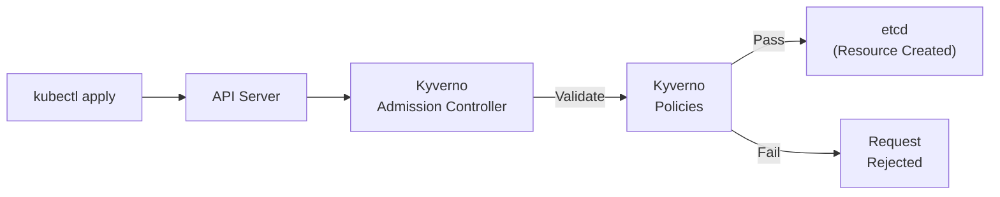
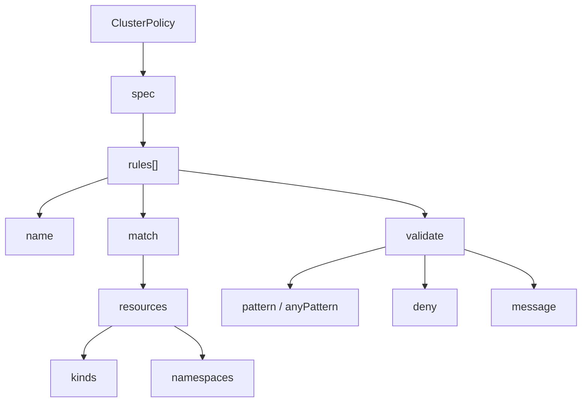
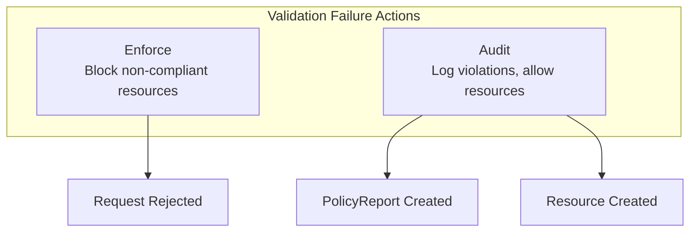
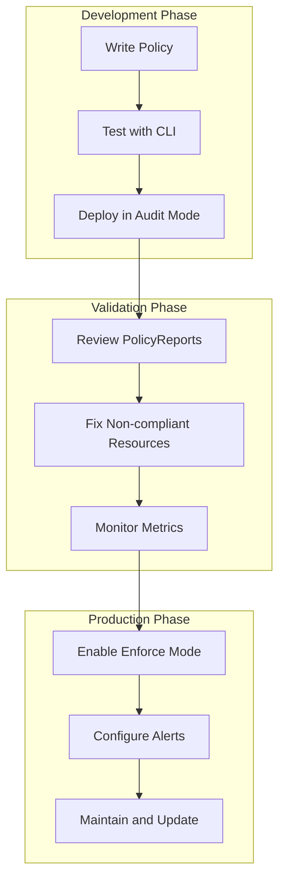

# How to Implement Kyverno Validation Policies

Author: [nawazdhandala](https://www.github.com/nawazdhandala)

Tags: Kubernetes, Kyverno, Policy, Security, Admission Control, DevOps, Cloud Native

Description: Learn how to implement Kyverno validation policies in Kubernetes to enforce security standards, resource constraints, and best practices across your clusters without writing code.

---

> Kubernetes clusters without policy enforcement become a security risk. Kyverno provides a native Kubernetes way to validate, mutate, and generate resources using declarative policies. Stop relying on manual reviews and let policies guard your clusters automatically.

Enforcing standards manually leads to inconsistency. Policy-as-code catches issues before they reach production.

---

## What is Kyverno?

Kyverno is a policy engine designed specifically for Kubernetes. Unlike Open Policy Agent (OPA) which uses Rego, Kyverno policies are written as Kubernetes resources using familiar YAML syntax. Validation policies check resources against rules and reject non-compliant configurations during admission.



---

## Installing Kyverno

### Using Helm

Helm provides the recommended installation method for production environments.

```bash
# Add the Kyverno Helm repository to your local Helm configuration
helm repo add kyverno https://kyverno.github.io/kyverno/

# Update repository index to fetch latest chart versions
helm repo update

# Install Kyverno in its own namespace with high availability configuration
# The replicaCount=3 ensures availability during node failures
helm install kyverno kyverno/kyverno \
  --namespace kyverno \
  --create-namespace \
  --set replicaCount=3
```

### Using kubectl

For development environments or quick testing, apply the manifest directly.

```bash
# Apply the latest stable release manifest from GitHub
# The install.yaml includes CRDs, RBAC, and deployment resources
kubectl create -f https://github.com/kyverno/kyverno/releases/latest/download/install.yaml
```

### Verify Installation

Confirm Kyverno is running before creating policies.

```bash
# Check that Kyverno pods are running and ready
# You should see kyverno and kyverno-cleanup-controller pods
kubectl get pods -n kyverno

# Verify the policy CRDs are installed
kubectl get crd | grep kyverno
```

---

## Understanding Policy Structure

Kyverno policies follow a consistent structure with rules that define what to match and how to validate.



---

## Basic Validation Policies

### Require Labels

Labels enable resource organization and selection. Enforce mandatory labels to maintain consistency across deployments.

```yaml
# require-labels-policy.yaml
# Ensures all Pods have team and environment labels for proper ownership tracking
apiVersion: kyverno.io/v1
kind: ClusterPolicy
metadata:
  name: require-labels
  annotations:
    # Document the policy purpose for cluster operators
    policies.kyverno.io/title: Require Labels
    policies.kyverno.io/description: >-
      All Pods must have 'team' and 'environment' labels for
      resource tracking and cost allocation.
spec:
  # Enforce blocks non-compliant resources; Audit only logs violations
  validationFailureAction: Enforce
  # Process existing resources during background scans
  background: true
  rules:
    - name: check-labels
      match:
        any:
          - resources:
              kinds:
                - Pod
      validate:
        # Message shown when validation fails
        message: "Labels 'team' and 'environment' are required."
        pattern:
          metadata:
            labels:
              # The * wildcard requires any non-empty value
              team: "*"
              environment: "*"
```

### Block Latest Tag

Container images using the `latest` tag make deployments unpredictable. Require explicit version tags for reproducibility.

```yaml
# disallow-latest-tag.yaml
# Prevents using :latest tag which can cause unexpected container updates
apiVersion: kyverno.io/v1
kind: ClusterPolicy
metadata:
  name: disallow-latest-tag
  annotations:
    policies.kyverno.io/title: Disallow Latest Tag
    policies.kyverno.io/severity: medium
spec:
  validationFailureAction: Enforce
  background: true
  rules:
    - name: require-image-tag
      match:
        any:
          - resources:
              kinds:
                - Pod
      validate:
        message: "Using 'latest' tag is not allowed. Specify an explicit version tag."
        # anyPattern allows multiple acceptable patterns
        # The image must match at least one of these patterns
        anyPattern:
          # Pattern 1: Image with registry, repository, and tag (e.g., docker.io/nginx:1.21)
          - spec:
              containers:
                - image: "*:*"
          # Pattern 2: Image with registry/repository and tag
          - spec:
              containers:
                - image: "*/*:*"
          # Pattern 3: Full path with multiple segments and tag
          - spec:
              containers:
                - image: "*/*/*:*"
    - name: validate-image-tag
      match:
        any:
          - resources:
              kinds:
                - Pod
      validate:
        message: "The 'latest' tag is not allowed for container images."
        # deny with conditions provides fine-grained control
        deny:
          conditions:
            any:
              # Check if any container image ends with :latest
              - key: "{{ request.object.spec.containers[*].image }}"
                operator: AnyIn
                value:
                  - "*:latest"
```

---

## Security Policies

### Require Non-Root Containers

Running containers as root poses security risks. Force containers to run as non-root users.

```yaml
# require-non-root.yaml
# Prevents privilege escalation by requiring containers to run as non-root
apiVersion: kyverno.io/v1
kind: ClusterPolicy
metadata:
  name: require-non-root
  annotations:
    policies.kyverno.io/title: Require Non-Root Containers
    policies.kyverno.io/category: Pod Security Standards
    policies.kyverno.io/severity: high
spec:
  validationFailureAction: Enforce
  background: true
  rules:
    - name: check-runasnonroot
      match:
        any:
          - resources:
              kinds:
                - Pod
      validate:
        message: >-
          Running as root is not allowed. Set securityContext.runAsNonRoot to true
          at the pod or container level.
        # anyPattern checks multiple valid configurations
        anyPattern:
          # Option 1: Pod-level security context applies to all containers
          - spec:
              securityContext:
                runAsNonRoot: true
          # Option 2: Each container has its own security context
          - spec:
              containers:
                - securityContext:
                    runAsNonRoot: true
```

### Block Privileged Containers

Privileged containers have full host access. Block them except in trusted namespaces.

```yaml
# disallow-privileged.yaml
# Prevents containers from gaining full host privileges
apiVersion: kyverno.io/v1
kind: ClusterPolicy
metadata:
  name: disallow-privileged-containers
  annotations:
    policies.kyverno.io/title: Disallow Privileged Containers
    policies.kyverno.io/category: Pod Security Standards
    policies.kyverno.io/severity: critical
spec:
  validationFailureAction: Enforce
  background: true
  rules:
    - name: deny-privileged
      match:
        any:
          - resources:
              kinds:
                - Pod
      # Exclude system namespaces that legitimately need privileged access
      exclude:
        any:
          - resources:
              namespaces:
                - kube-system
                - kyverno
      validate:
        message: "Privileged containers are not allowed."
        pattern:
          spec:
            containers:
              - securityContext:
                  # Pattern matching with negation - must NOT be true
                  privileged: "!true"
```

### Restrict Host Namespaces

Containers sharing host namespaces can access sensitive system resources. Restrict access to maintain isolation.

```yaml
# restrict-host-namespaces.yaml
# Blocks pods from accessing host PID, IPC, and network namespaces
apiVersion: kyverno.io/v1
kind: ClusterPolicy
metadata:
  name: restrict-host-namespaces
  annotations:
    policies.kyverno.io/title: Restrict Host Namespaces
    policies.kyverno.io/category: Pod Security Standards
spec:
  validationFailureAction: Enforce
  background: true
  rules:
    - name: host-namespaces
      match:
        any:
          - resources:
              kinds:
                - Pod
      validate:
        message: >-
          Sharing host PID, IPC, or network namespaces is not allowed.
          Remove hostPID, hostIPC, and hostNetwork from the pod spec.
        pattern:
          spec:
            # Each field must be false or not set (null pattern matches missing fields)
            =(hostPID): "false"
            =(hostIPC): "false"
            =(hostNetwork): "false"
```

---

## Resource Validation Policies

### Require Resource Limits

Pods without resource limits can consume unbounded resources. Enforce limits for cluster stability.

```yaml
# require-resource-limits.yaml
# Ensures all containers specify CPU and memory limits
apiVersion: kyverno.io/v1
kind: ClusterPolicy
metadata:
  name: require-resource-limits
  annotations:
    policies.kyverno.io/title: Require Resource Limits
    policies.kyverno.io/category: Best Practices
spec:
  validationFailureAction: Enforce
  background: true
  rules:
    - name: check-container-limits
      match:
        any:
          - resources:
              kinds:
                - Pod
      validate:
        message: "All containers must specify CPU and memory limits."
        pattern:
          spec:
            containers:
              # The dash indicates iteration over array elements
              - resources:
                  limits:
                    # Wildcard requires any value to be present
                    memory: "?*"
                    cpu: "?*"
    - name: check-initcontainer-limits
      match:
        any:
          - resources:
              kinds:
                - Pod
      # Only validate if initContainers exist
      preconditions:
        all:
          - key: "{{ request.object.spec.initContainers[] | length(@) }}"
            operator: GreaterThan
            value: 0
      validate:
        message: "All init containers must specify CPU and memory limits."
        pattern:
          spec:
            initContainers:
              - resources:
                  limits:
                    memory: "?*"
                    cpu: "?*"
```

### Validate Resource Boundaries

Set maximum resource limits to prevent a single pod from monopolizing cluster resources.

```yaml
# validate-resource-boundaries.yaml
# Caps memory at 4Gi and CPU at 2 cores per container
apiVersion: kyverno.io/v1
kind: ClusterPolicy
metadata:
  name: validate-resource-boundaries
  annotations:
    policies.kyverno.io/title: Validate Resource Boundaries
spec:
  validationFailureAction: Enforce
  background: true
  rules:
    - name: memory-limit-max
      match:
        any:
          - resources:
              kinds:
                - Pod
      validate:
        message: "Memory limit cannot exceed 4Gi per container."
        deny:
          conditions:
            any:
              # JMESPath expression extracts memory limits and compares
              - key: "{{ request.object.spec.containers[*].resources.limits.memory | [?@ > '4Gi'] | length(@) }}"
                operator: GreaterThan
                value: 0
    - name: cpu-limit-max
      match:
        any:
          - resources:
              kinds:
                - Pod
      validate:
        message: "CPU limit cannot exceed 2 cores per container."
        deny:
          conditions:
            any:
              # Compare CPU values - '2' represents 2 cores
              - key: "{{ request.object.spec.containers[*].resources.limits.cpu | [?@ > '2'] | length(@) }}"
                operator: GreaterThan
                value: 0
```

---

## Network Policies

### Require Network Policy

Ensure every namespace has at least one NetworkPolicy to prevent unrestricted pod communication.

```yaml
# require-network-policy.yaml
# Validates that Deployments have corresponding NetworkPolicy resources
apiVersion: kyverno.io/v1
kind: ClusterPolicy
metadata:
  name: require-network-policy
  annotations:
    policies.kyverno.io/title: Require Network Policy
spec:
  validationFailureAction: Audit
  background: true
  rules:
    - name: require-netpol-for-deployment
      match:
        any:
          - resources:
              kinds:
                - Deployment
      validate:
        message: >-
          A NetworkPolicy must exist in the namespace before creating Deployments.
          Create a NetworkPolicy that selects pods in this namespace.
        deny:
          conditions:
            all:
              # Check if NetworkPolicy exists in the same namespace
              - key: "{{ request.object.metadata.namespace }}"
                operator: AnyNotIn
                # Lookup all namespaces that have NetworkPolicies
                value: "{{ request.namespaceNetworkPolicies }}"
```

---

## Image Registry Policies

### Restrict Image Registries

Limit container images to approved registries for security and compliance.

```yaml
# restrict-image-registries.yaml
# Only allows images from approved internal and verified registries
apiVersion: kyverno.io/v1
kind: ClusterPolicy
metadata:
  name: restrict-image-registries
  annotations:
    policies.kyverno.io/title: Restrict Image Registries
    policies.kyverno.io/severity: high
spec:
  validationFailureAction: Enforce
  background: true
  rules:
    - name: validate-registries
      match:
        any:
          - resources:
              kinds:
                - Pod
      validate:
        message: >-
          Images must come from approved registries: gcr.io/myproject,
          docker.io/library, or ghcr.io/myorg.
        # anyPattern allows multiple valid registry prefixes
        anyPattern:
          # Google Container Registry - internal project images
          - spec:
              containers:
                - image: "gcr.io/myproject/*"
          # Official Docker Hub library images
          - spec:
              containers:
                - image: "docker.io/library/*"
          # GitHub Container Registry - organization images
          - spec:
              containers:
                - image: "ghcr.io/myorg/*"
```

### Require Image Digest

Tags can be overwritten. Require image digests for immutable deployments.

```yaml
# require-image-digest.yaml
# Forces use of image digests for production namespaces
apiVersion: kyverno.io/v1
kind: ClusterPolicy
metadata:
  name: require-image-digest
  annotations:
    policies.kyverno.io/title: Require Image Digest
spec:
  validationFailureAction: Enforce
  background: true
  rules:
    - name: check-digest
      match:
        any:
          - resources:
              kinds:
                - Pod
              namespaces:
                # Only enforce in production namespaces
                - production
                - prod-*
      validate:
        message: >-
          Images in production must use digests, not tags.
          Use format: image@sha256:...
        pattern:
          spec:
            containers:
              # @ followed by sha256 hash is the digest format
              - image: "*@sha256:*"
```

---

## Validation Failure Actions

Kyverno supports different enforcement modes for flexibility during rollout.



### Audit Mode for Rollout

Start with Audit mode to assess impact before enforcing.

```yaml
# audit-mode-policy.yaml
# Monitors violations without blocking resources
apiVersion: kyverno.io/v1
kind: ClusterPolicy
metadata:
  name: require-probes-audit
spec:
  # Audit logs violations without blocking
  validationFailureAction: Audit
  # Override for specific namespaces - enforce in production
  validationFailureActionOverrides:
    - action: Enforce
      namespaces:
        - production
  background: true
  rules:
    - name: require-readiness-probe
      match:
        any:
          - resources:
              kinds:
                - Pod
      validate:
        message: "Readiness probe is required for all containers."
        pattern:
          spec:
            containers:
              - readinessProbe:
                  # Wildcard matches any probe configuration
                  =(httpGet): "*"
                  =(tcpSocket): "*"
                  =(exec): "*"
```

---

## Working with Policy Reports

Kyverno generates PolicyReports that track compliance status across the cluster.

### Query Policy Reports

Check compliance status using kubectl commands.

```bash
# List all policy reports in a namespace
# PolicyReports contain per-resource compliance results
kubectl get policyreports -n default

# View detailed policy report with pass/fail/warn/error counts
kubectl get policyreports -n default -o yaml

# List cluster-wide policy reports for cluster-scoped resources
kubectl get clusterpolicyreports

# Get summary of all policy violations across namespaces
kubectl get policyreports -A -o custom-columns=\
NAMESPACE:.metadata.namespace,\
NAME:.metadata.name,\
PASS:.summary.pass,\
FAIL:.summary.fail,\
WARN:.summary.warn
```

### Policy Report Structure

Understanding the report format helps in building monitoring dashboards.

```yaml
# Example PolicyReport structure showing results
apiVersion: wgpolicyk8s.io/v1alpha2
kind: PolicyReport
metadata:
  name: polr-ns-default
  namespace: default
summary:
  pass: 15
  fail: 3
  warn: 0
  error: 0
  skip: 0
results:
  - message: "Labels 'team' and 'environment' are required."
    policy: require-labels
    resources:
      - apiVersion: v1
        kind: Pod
        name: nginx-without-labels
        namespace: default
    result: fail
    rule: check-labels
    timestamp:
      nanos: 0
      seconds: 1706832000
```

---

## Advanced Validation Techniques

### Conditional Validation with Preconditions

Apply rules only when certain conditions are met.

```yaml
# conditional-validation.yaml
# Only validates Java applications based on container name patterns
apiVersion: kyverno.io/v1
kind: ClusterPolicy
metadata:
  name: java-app-requirements
spec:
  validationFailureAction: Enforce
  rules:
    - name: require-jvm-settings
      match:
        any:
          - resources:
              kinds:
                - Pod
      # Preconditions filter which resources the rule applies to
      preconditions:
        all:
          # Only apply to pods with java in container name
          - key: "{{ request.object.spec.containers[0].name }}"
            operator: Equals
            value: "*java*"
      validate:
        message: "Java containers must have JAVA_OPTS environment variable."
        pattern:
          spec:
            containers:
              - env:
                  - name: JAVA_OPTS
                    value: "?*"
```

### Cross-Resource Validation

Validate resources against data from other Kubernetes objects.

```yaml
# cross-resource-validation.yaml
# Validates that pod service accounts exist in allowed ConfigMap
apiVersion: kyverno.io/v1
kind: ClusterPolicy
metadata:
  name: validate-service-account
spec:
  validationFailureAction: Enforce
  rules:
    - name: check-allowed-service-accounts
      match:
        any:
          - resources:
              kinds:
                - Pod
      # Context allows fetching data from other resources
      context:
        - name: allowed-accounts
          configMap:
            name: allowed-service-accounts
            namespace: kyverno
      validate:
        message: "Service account {{ request.object.spec.serviceAccountName }} is not in the allowed list."
        deny:
          conditions:
            all:
              # Check if the pod's service account is in the ConfigMap data
              - key: "{{ request.object.spec.serviceAccountName }}"
                operator: AnyNotIn
                value: "{{ allowed-accounts.data.accounts | split(@, ',') }}"
```

### Validate Using External Data

Fetch validation data from external API endpoints.

```yaml
# external-data-validation.yaml
# Validates image tags against an external vulnerability service
apiVersion: kyverno.io/v1
kind: ClusterPolicy
metadata:
  name: check-image-vulnerabilities
spec:
  validationFailureAction: Enforce
  rules:
    - name: verify-image-scan
      match:
        any:
          - resources:
              kinds:
                - Pod
      context:
        # Fetch scan results from external API
        - name: scanResult
          apiCall:
            urlPath: "/api/v1/scan/{{ request.object.spec.containers[0].image }}"
            method: GET
      validate:
        message: "Image has critical vulnerabilities: {{ scanResult.vulnerabilities }}"
        deny:
          conditions:
            any:
              - key: "{{ scanResult.criticalCount }}"
                operator: GreaterThan
                value: 0
```

---

## Policy Organization

### Namespace-Scoped Policies

Create policies that only apply to specific namespaces.

```yaml
# namespace-policy.yaml
# Policy scoped to a single namespace
apiVersion: kyverno.io/v1
kind: Policy
metadata:
  name: team-alpha-requirements
  # Policy resource (not ClusterPolicy) is namespace-scoped
  namespace: team-alpha
spec:
  validationFailureAction: Enforce
  rules:
    - name: require-team-label
      match:
        any:
          - resources:
              kinds:
                - Pod
                - Deployment
      validate:
        message: "Resources must have 'owner: team-alpha' label."
        pattern:
          metadata:
            labels:
              owner: team-alpha
```

### Policy Categories

Group related policies with consistent annotations for organization.

```yaml
# categorized-policy.yaml
apiVersion: kyverno.io/v1
kind: ClusterPolicy
metadata:
  name: pod-security-baseline
  annotations:
    # Standard annotations for policy documentation
    policies.kyverno.io/title: Pod Security Baseline
    policies.kyverno.io/category: Pod Security Standards
    policies.kyverno.io/severity: medium
    # Subject helps identify what resources are affected
    policies.kyverno.io/subject: Pod
    # Detailed description for documentation generation
    policies.kyverno.io/description: >-
      Enforces baseline pod security standards including
      non-root execution, dropped capabilities, and
      read-only root filesystem.
spec:
  validationFailureAction: Enforce
  rules:
    # Multiple security rules grouped in one policy
    - name: drop-all-capabilities
      match:
        any:
          - resources:
              kinds:
                - Pod
      validate:
        message: "Containers must drop all capabilities."
        pattern:
          spec:
            containers:
              - securityContext:
                  capabilities:
                    drop:
                      - ALL
```

---

## Testing Policies

### Kyverno CLI

Test policies locally before applying to clusters.

```bash
# Install Kyverno CLI using Homebrew
brew install kyverno

# Test a policy against a resource manifest
# Returns pass/fail status without cluster access
kyverno apply policy.yaml --resource pod.yaml

# Test multiple policies against multiple resources
kyverno apply policies/ --resource resources/

# Generate policy report in JSON format for CI integration
kyverno apply policy.yaml --resource pod.yaml -o json

# Validate policy syntax before applying
kyverno validate policy.yaml
```

### Example Test Resources

Create test manifests to verify policy behavior.

```yaml
# test-pod-valid.yaml
# Pod that should pass all validation policies
apiVersion: v1
kind: Pod
metadata:
  name: compliant-pod
  labels:
    team: platform
    environment: staging
spec:
  securityContext:
    runAsNonRoot: true
    runAsUser: 1000
  containers:
    - name: app
      image: gcr.io/myproject/app:v1.2.3
      resources:
        limits:
          memory: "256Mi"
          cpu: "500m"
        requests:
          memory: "128Mi"
          cpu: "250m"
      securityContext:
        allowPrivilegeEscalation: false
        capabilities:
          drop:
            - ALL
```

```yaml
# test-pod-invalid.yaml
# Pod that should fail validation - missing labels and using latest tag
apiVersion: v1
kind: Pod
metadata:
  name: non-compliant-pod
spec:
  containers:
    - name: app
      image: nginx:latest
```

---

## Monitoring and Alerting

### Prometheus Metrics

Kyverno exposes metrics for monitoring policy enforcement.

```yaml
# servicemonitor.yaml
# Prometheus ServiceMonitor for Kyverno metrics scraping
apiVersion: monitoring.coreos.com/v1
kind: ServiceMonitor
metadata:
  name: kyverno
  namespace: monitoring
spec:
  selector:
    matchLabels:
      app.kubernetes.io/name: kyverno
  namespaceSelector:
    matchNames:
      - kyverno
  endpoints:
    - port: metrics
      interval: 30s
      path: /metrics
```

Key metrics to monitor include policy execution counts and admission latency.

```bash
# Query policy violation counts per policy
# High counts indicate widespread non-compliance
kyverno_policy_results_total{result="fail"}

# Monitor admission webhook latency
# High latency affects cluster responsiveness
kyverno_admission_review_duration_seconds

# Track policy rule execution
kyverno_policy_rule_results_total
```

### Alerting Rules

Configure alerts for policy violations and Kyverno health.

```yaml
# alerting-rules.yaml
apiVersion: monitoring.coreos.com/v1
kind: PrometheusRule
metadata:
  name: kyverno-alerts
  namespace: monitoring
spec:
  groups:
    - name: kyverno
      rules:
        # Alert when policies are failing frequently
        - alert: KyvernoPolicyViolations
          expr: |
            increase(kyverno_policy_results_total{result="fail"}[1h]) > 10
          for: 5m
          labels:
            severity: warning
          annotations:
            summary: "High policy violation rate"
            description: "Policy {{ $labels.policy_name }} has {{ $value }} violations in the last hour."

        # Alert when Kyverno is unhealthy
        - alert: KyvernoUnavailable
          expr: |
            up{job="kyverno"} == 0
          for: 2m
          labels:
            severity: critical
          annotations:
            summary: "Kyverno is unavailable"
            description: "Kyverno admission controller is down. Policy enforcement is disabled."
```

---

## Best Practices



1. **Start with Audit mode** - Understand impact before enforcing
2. **Use meaningful messages** - Help developers fix violations quickly
3. **Exclude system namespaces** - Avoid breaking cluster components
4. **Version control policies** - Track changes and enable rollback
5. **Test policies locally** - Use Kyverno CLI before applying
6. **Monitor policy metrics** - Track violations and latency
7. **Document with annotations** - Use standard policy annotations
8. **Group related rules** - Organize by category or security level

---

## Common Policy Patterns

### Pod Security Standards Baseline

Implement Kubernetes Pod Security Standards using Kyverno.

```yaml
# pss-baseline.yaml
# Implements Pod Security Standards Baseline profile
apiVersion: kyverno.io/v1
kind: ClusterPolicy
metadata:
  name: pss-baseline
  annotations:
    policies.kyverno.io/title: Pod Security Standards - Baseline
spec:
  validationFailureAction: Enforce
  rules:
    # Rule 1: Block host namespaces
    - name: host-namespaces
      match:
        any:
          - resources:
              kinds:
                - Pod
      validate:
        message: "Host namespaces are not allowed."
        pattern:
          spec:
            =(hostNetwork): "false"
            =(hostPID): "false"
            =(hostIPC): "false"

    # Rule 2: Block privileged containers
    - name: privileged-containers
      match:
        any:
          - resources:
              kinds:
                - Pod
      validate:
        message: "Privileged containers are not allowed."
        pattern:
          spec:
            containers:
              - =(securityContext):
                  =(privileged): "false"

    # Rule 3: Block hostPath volumes
    - name: host-path-volumes
      match:
        any:
          - resources:
              kinds:
                - Pod
      validate:
        message: "hostPath volumes are not allowed."
        pattern:
          spec:
            =(volumes):
              - X(hostPath): "null"
```

---

## Conclusion

Kyverno validation policies bring infrastructure-as-code principles to Kubernetes security and compliance. Key benefits include native Kubernetes integration, declarative YAML syntax, and comprehensive reporting. By implementing validation policies, teams can enforce standards automatically, reduce manual review burden, and maintain consistent security posture across clusters. Start with audit mode, monitor policy reports, and gradually enable enforcement as your team builds confidence in the policies.

---

*Building secure Kubernetes clusters? [OneUptime](https://oneuptime.com) provides comprehensive monitoring and alerting for your cloud-native infrastructure, including policy compliance tracking and security event detection.*
