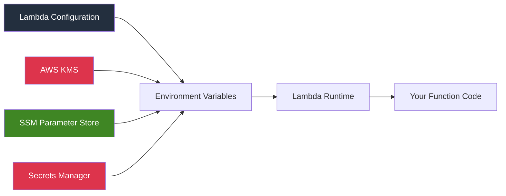
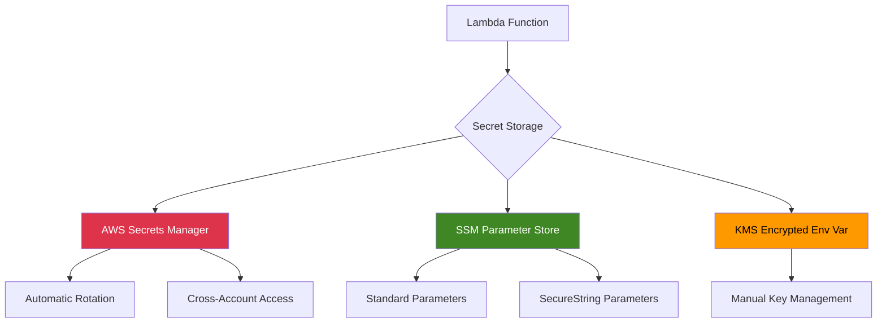
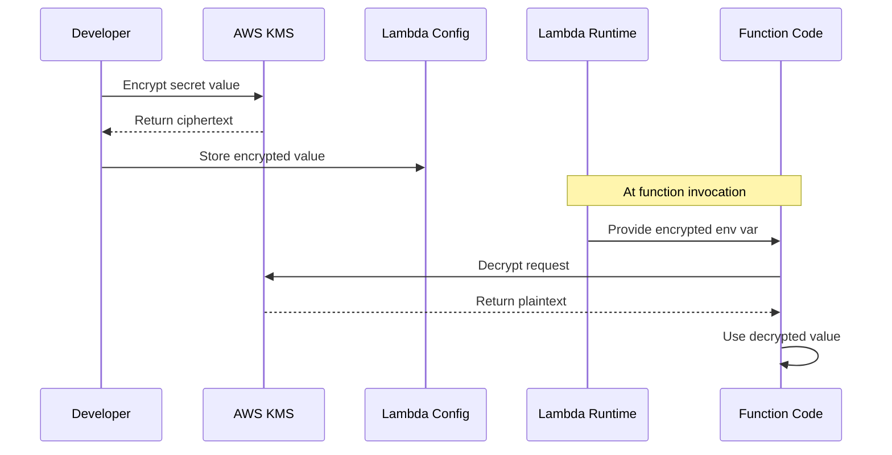
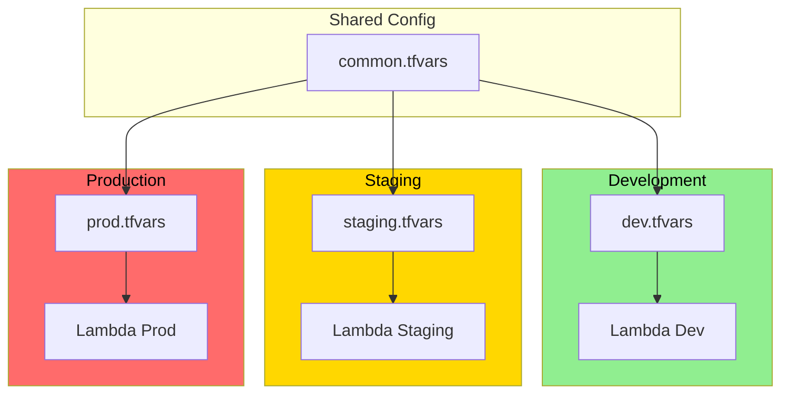

# How to Handle Lambda Environment Variables

Author: [nawazdhandala](https://www.github.com/nawazdhandala)

Tags: AWS Lambda, Environment Variables, Serverless, Configuration Management, Secrets Management, AWS

Description: Learn how to effectively manage environment variables in AWS Lambda functions, including best practices for secrets, encryption, configuration patterns, and deployment strategies across multiple environments.

---

> Environment variables provide a flexible way to configure Lambda functions without modifying code. Proper management of these variables becomes critical as your serverless architecture grows, especially when dealing with sensitive data like API keys and database credentials.

Managing configuration in serverless applications requires a different approach than traditional servers. Lambda environment variables offer a straightforward mechanism, but production workloads demand careful consideration of security, organization, and deployment workflows.

---

## Understanding Lambda Environment Variables

Lambda environment variables are key-value pairs stored with your function configuration. The Lambda runtime makes these available to your code through standard environment variable mechanisms.



### Key Characteristics

| Feature | Details |
|---------|---------|
| **Maximum Size** | 4 KB total for all variables combined |
| **Encryption** | At-rest encryption with AWS KMS |
| **Availability** | Available at cold start and runtime |
| **Update Method** | Function configuration update required |
| **Access** | Standard OS environment variable access |

---

## Basic Environment Variable Usage

### Setting Variables via AWS Console

Navigate to your Lambda function, then Configuration, then Environment variables. Add your key-value pairs directly in the console.

### Setting Variables via AWS CLI

The following command updates environment variables for a Lambda function, replacing any existing variables with the new set:

```bash
# aws_cli_set_env.sh
# Update Lambda function environment variables
# Note: replaces ALL existing variables

aws lambda update-function-configuration \
    --function-name my-function \
    --environment "Variables={
        DATABASE_HOST=mydb.cluster-xyz.us-east-1.rds.amazonaws.com,
        DATABASE_NAME=production,
        LOG_LEVEL=INFO,
        CACHE_TTL=300
    }"
```

### Accessing Variables in Code

Environment variables integrate naturally with all Lambda-supported runtimes. Here are examples for common languages.

Python implementation for reading environment variables with fallback defaults:

```python
# config.py
# Lambda environment variable access with type conversion and defaults

import os
from typing import Optional

def get_env(key: str, default: Optional[str] = None) -> Optional[str]:
    """
    Retrieve environment variable with optional default.
    Returns None if variable is not set and no default provided.
    """
    return os.environ.get(key, default)


def get_env_int(key: str, default: int = 0) -> int:
    """
    Retrieve environment variable as integer.
    Falls back to default if not set or invalid.
    """
    value = os.environ.get(key)
    if value is None:
        return default
    try:
        return int(value)
    except ValueError:
        return default


def get_env_bool(key: str, default: bool = False) -> bool:
    """
    Retrieve environment variable as boolean.
    Recognizes: true, 1, yes, on (case-insensitive)
    """
    value = os.environ.get(key)
    if value is None:
        return default
    return value.lower() in ('true', '1', 'yes', 'on')


def get_env_list(key: str, separator: str = ',') -> list:
    """
    Retrieve environment variable as list.
    Splits value by separator (default: comma).
    """
    value = os.environ.get(key, '')
    if not value:
        return []
    return [item.strip() for item in value.split(separator)]


# Usage in Lambda handler
DATABASE_HOST = get_env('DATABASE_HOST', 'localhost')
DATABASE_PORT = get_env_int('DATABASE_PORT', 5432)
DEBUG_MODE = get_env_bool('DEBUG_MODE', False)
ALLOWED_ORIGINS = get_env_list('ALLOWED_ORIGINS')

def lambda_handler(event, context):
    config = {
        'host': DATABASE_HOST,
        'port': DATABASE_PORT,
        'debug': DEBUG_MODE,
        'origins': ALLOWED_ORIGINS
    }
    return {'statusCode': 200, 'body': str(config)}
```

Node.js implementation with validation and type coercion:

```javascript
// config.js
// Environment variable utilities for Lambda functions

/**
 * Retrieve environment variable with optional default
 * @param {string} key - Environment variable name
 * @param {string} defaultValue - Fallback value if not set
 * @returns {string|undefined}
 */
function getEnv(key, defaultValue = undefined) {
    return process.env[key] ?? defaultValue;
}

/**
 * Retrieve environment variable as integer
 * @param {string} key - Environment variable name
 * @param {number} defaultValue - Fallback value
 * @returns {number}
 */
function getEnvInt(key, defaultValue = 0) {
    const value = process.env[key];
    if (value === undefined) return defaultValue;
    const parsed = parseInt(value, 10);
    return isNaN(parsed) ? defaultValue : parsed;
}

/**
 * Retrieve environment variable as boolean
 * @param {string} key - Environment variable name
 * @param {boolean} defaultValue - Fallback value
 * @returns {boolean}
 */
function getEnvBool(key, defaultValue = false) {
    const value = process.env[key];
    if (value === undefined) return defaultValue;
    return ['true', '1', 'yes', 'on'].includes(value.toLowerCase());
}

/**
 * Retrieve required environment variable
 * Throws error if not set
 * @param {string} key - Environment variable name
 * @returns {string}
 */
function requireEnv(key) {
    const value = process.env[key];
    if (value === undefined || value === '') {
        throw new Error(`Required environment variable ${key} is not set`);
    }
    return value;
}

// Configuration object populated at cold start
const config = {
    databaseHost: getEnv('DATABASE_HOST', 'localhost'),
    databasePort: getEnvInt('DATABASE_PORT', 5432),
    debugMode: getEnvBool('DEBUG_MODE', false),
    apiKey: requireEnv('API_KEY')
};

module.exports = { config, getEnv, getEnvInt, getEnvBool, requireEnv };
```

---

## CloudFormation and SAM Templates

Infrastructure as Code provides the most reliable way to manage Lambda environment variables across environments.

SAM template demonstrating environment variable configuration with references to other AWS resources:

```yaml
# template.yaml
# AWS SAM template with environment variable configuration

AWSTemplateFormatVersion: '2010-09-09'
Transform: AWS::Serverless-2016-10-31
Description: Lambda function with comprehensive environment configuration

Parameters:
  Environment:
    Type: String
    Default: development
    AllowedValues:
      - development
      - staging
      - production
    Description: Deployment environment

  LogLevel:
    Type: String
    Default: INFO
    AllowedValues:
      - DEBUG
      - INFO
      - WARNING
      - ERROR

Globals:
  Function:
    Timeout: 30
    Runtime: python3.11
    MemorySize: 256
    # Environment variables shared across all functions
    Environment:
      Variables:
        ENVIRONMENT: !Ref Environment
        LOG_LEVEL: !Ref LogLevel
        AWS_REGION_NAME: !Ref AWS::Region

Resources:
  MyFunction:
    Type: AWS::Serverless::Function
    Properties:
      FunctionName: !Sub '${AWS::StackName}-processor'
      Handler: app.lambda_handler
      CodeUri: src/
      # Function-specific environment variables
      Environment:
        Variables:
          # Reference DynamoDB table created in same stack
          TABLE_NAME: !Ref DataTable
          # Reference S3 bucket
          BUCKET_NAME: !Ref StorageBucket
          # Reference SSM parameter for secrets
          DATABASE_URL: !Sub '{{resolve:ssm:/myapp/${Environment}/database-url}}'
          # Reference Secrets Manager secret
          API_KEY: !Sub '{{resolve:secretsmanager:myapp/${Environment}/api-key}}'
          # Static configuration
          BATCH_SIZE: '100'
          RETRY_ATTEMPTS: '3'
      Policies:
        - DynamoDBCrudPolicy:
            TableName: !Ref DataTable
        - S3CrudPolicy:
            BucketName: !Ref StorageBucket

  DataTable:
    Type: AWS::DynamoDB::Table
    Properties:
      TableName: !Sub '${AWS::StackName}-data'
      BillingMode: PAY_PER_REQUEST
      AttributeDefinitions:
        - AttributeName: pk
          AttributeType: S
      KeySchema:
        - AttributeName: pk
          KeyType: HASH

  StorageBucket:
    Type: AWS::S3::Bucket
    Properties:
      BucketName: !Sub '${AWS::StackName}-storage-${AWS::AccountId}'

Outputs:
  FunctionArn:
    Description: Lambda function ARN
    Value: !GetAtt MyFunction.Arn
```

---

## Terraform Configuration

Terraform provides another popular approach for managing Lambda environment variables with strong support for multi-environment deployments.

Terraform configuration showcasing environment variable management with locals and variable files:

```hcl
# main.tf
# Terraform configuration for Lambda with environment variables

terraform {
  required_providers {
    aws = {
      source  = "hashicorp/aws"
      version = "~> 5.0"
    }
  }
}

variable "environment" {
  description = "Deployment environment"
  type        = string
  default     = "development"
}

variable "log_level" {
  description = "Application log level"
  type        = string
  default     = "INFO"
}

# Local values for environment-specific configuration
locals {
  env_config = {
    development = {
      memory_size    = 256
      timeout        = 30
      batch_size     = 10
      enable_tracing = false
    }
    staging = {
      memory_size    = 512
      timeout        = 60
      batch_size     = 50
      enable_tracing = true
    }
    production = {
      memory_size    = 1024
      timeout        = 120
      batch_size     = 100
      enable_tracing = true
    }
  }

  config = local.env_config[var.environment]
}

# Fetch secrets from SSM Parameter Store
data "aws_ssm_parameter" "database_url" {
  name = "/myapp/${var.environment}/database-url"
}

data "aws_ssm_parameter" "api_key" {
  name            = "/myapp/${var.environment}/api-key"
  with_decryption = true
}

# Lambda function with environment variables
resource "aws_lambda_function" "processor" {
  function_name = "myapp-${var.environment}-processor"
  role          = aws_iam_role.lambda_role.arn
  handler       = "app.lambda_handler"
  runtime       = "python3.11"

  filename         = "deployment.zip"
  source_code_hash = filebase64sha256("deployment.zip")

  memory_size = local.config.memory_size
  timeout     = local.config.timeout

  environment {
    variables = {
      # Environment identification
      ENVIRONMENT = var.environment
      LOG_LEVEL   = var.log_level

      # Configuration values
      BATCH_SIZE     = tostring(local.config.batch_size)
      ENABLE_TRACING = tostring(local.config.enable_tracing)

      # Secrets from SSM
      DATABASE_URL = data.aws_ssm_parameter.database_url.value
      API_KEY      = data.aws_ssm_parameter.api_key.value

      # Resource references
      TABLE_NAME  = aws_dynamodb_table.data.name
      BUCKET_NAME = aws_s3_bucket.storage.id
    }
  }

  # Enable X-Ray tracing for non-development
  dynamic "tracing_config" {
    for_each = local.config.enable_tracing ? [1] : []
    content {
      mode = "Active"
    }
  }

  tags = {
    Environment = var.environment
    ManagedBy   = "terraform"
  }
}

# IAM role for Lambda
resource "aws_iam_role" "lambda_role" {
  name = "myapp-${var.environment}-lambda-role"

  assume_role_policy = jsonencode({
    Version = "2012-10-17"
    Statement = [{
      Action = "sts:AssumeRole"
      Effect = "Allow"
      Principal = {
        Service = "lambda.amazonaws.com"
      }
    }]
  })
}

# Supporting resources
resource "aws_dynamodb_table" "data" {
  name         = "myapp-${var.environment}-data"
  billing_mode = "PAY_PER_REQUEST"
  hash_key     = "pk"

  attribute {
    name = "pk"
    type = "S"
  }
}

resource "aws_s3_bucket" "storage" {
  bucket = "myapp-${var.environment}-storage-${data.aws_caller_identity.current.account_id}"
}

data "aws_caller_identity" "current" {}
```

---

## Secrets Management Patterns

Environment variables should never contain plaintext secrets in production. Several patterns exist for secure secret handling.



### Using AWS Secrets Manager

Secrets Manager integration with caching for optimal performance. Secrets are fetched at cold start and cached to avoid repeated API calls:

```python
# secrets_manager.py
# AWS Secrets Manager integration for Lambda functions

import json
import boto3
from functools import lru_cache
from typing import Any, Dict, Optional

# Initialize client outside handler for connection reuse
secrets_client = boto3.client('secretsmanager')


@lru_cache(maxsize=32)
def get_secret(secret_name: str) -> Dict[str, Any]:
    """
    Retrieve and cache secret from AWS Secrets Manager.
    Uses lru_cache to avoid repeated API calls during function lifetime.
    Cache persists across warm invocations.
    """
    try:
        response = secrets_client.get_secret_value(SecretId=secret_name)

        # Handle both string and binary secrets
        if 'SecretString' in response:
            secret_value = response['SecretString']
            # Parse JSON secrets
            try:
                return json.loads(secret_value)
            except json.JSONDecodeError:
                return {'value': secret_value}
        else:
            # Binary secret
            return {'binary': response['SecretBinary']}

    except secrets_client.exceptions.ResourceNotFoundException:
        raise ValueError(f"Secret {secret_name} not found")
    except secrets_client.exceptions.DecryptionFailure:
        raise ValueError(f"Cannot decrypt secret {secret_name}")


def get_database_credentials(environment: str) -> Dict[str, str]:
    """
    Retrieve database credentials for specified environment.
    Returns dict with host, port, username, password, database.
    """
    secret_name = f"myapp/{environment}/database"
    return get_secret(secret_name)


def get_api_key(service_name: str, environment: str) -> str:
    """
    Retrieve API key for external service.
    """
    secret_name = f"myapp/{environment}/api-keys/{service_name}"
    secret = get_secret(secret_name)
    return secret.get('api_key', secret.get('value', ''))


# Usage in handler
def lambda_handler(event, context):
    import os

    environment = os.environ.get('ENVIRONMENT', 'development')

    # Fetch secrets - cached after first call
    db_creds = get_database_credentials(environment)
    stripe_key = get_api_key('stripe', environment)

    # Use credentials
    connection_string = (
        f"postgresql://{db_creds['username']}:{db_creds['password']}"
        f"@{db_creds['host']}:{db_creds['port']}/{db_creds['database']}"
    )

    return {'statusCode': 200, 'body': 'Secrets loaded successfully'}
```

### Using SSM Parameter Store

SSM Parameter Store provides a cost-effective alternative for configuration and secrets. SecureString parameters offer encryption at rest:

```python
# ssm_config.py
# SSM Parameter Store integration with hierarchical configuration

import boto3
from functools import lru_cache
from typing import Dict, Optional
import os

ssm_client = boto3.client('ssm')


@lru_cache(maxsize=64)
def get_parameter(name: str, decrypt: bool = True) -> Optional[str]:
    """
    Retrieve single parameter from SSM.
    Automatically handles SecureString decryption.
    """
    try:
        response = ssm_client.get_parameter(
            Name=name,
            WithDecryption=decrypt
        )
        return response['Parameter']['Value']
    except ssm_client.exceptions.ParameterNotFound:
        return None


def get_parameters_by_path(path: str, decrypt: bool = True) -> Dict[str, str]:
    """
    Retrieve all parameters under a path.
    Useful for loading environment-specific configuration.
    Example: /myapp/production/ returns all production params
    """
    parameters = {}
    paginator = ssm_client.get_paginator('get_parameters_by_path')

    for page in paginator.paginate(
        Path=path,
        Recursive=True,
        WithDecryption=decrypt
    ):
        for param in page['Parameters']:
            # Extract parameter name without path prefix
            name = param['Name'].replace(path, '').lstrip('/')
            parameters[name] = param['Value']

    return parameters


class SSMConfig:
    """
    Configuration class that loads values from SSM at initialization.
    Caches all values for function lifetime.
    """

    def __init__(self, prefix: str):
        """
        Initialize config from SSM path.
        prefix: SSM path prefix (e.g., /myapp/production)
        """
        self._prefix = prefix
        self._cache = {}
        self._loaded = False

    def _ensure_loaded(self):
        """Load all parameters if not already cached."""
        if not self._loaded:
            self._cache = get_parameters_by_path(self._prefix)
            self._loaded = True

    def get(self, key: str, default: str = None) -> Optional[str]:
        """Get configuration value by key."""
        self._ensure_loaded()
        return self._cache.get(key, default)

    def get_int(self, key: str, default: int = 0) -> int:
        """Get configuration value as integer."""
        value = self.get(key)
        if value is None:
            return default
        try:
            return int(value)
        except ValueError:
            return default

    def get_bool(self, key: str, default: bool = False) -> bool:
        """Get configuration value as boolean."""
        value = self.get(key)
        if value is None:
            return default
        return value.lower() in ('true', '1', 'yes', 'on')

    def all(self) -> Dict[str, str]:
        """Get all configuration values."""
        self._ensure_loaded()
        return self._cache.copy()


# Initialize config at module level (cold start)
environment = os.environ.get('ENVIRONMENT', 'development')
config = SSMConfig(f'/myapp/{environment}')


def lambda_handler(event, context):
    # Access configuration values
    database_host = config.get('database/host')
    cache_ttl = config.get_int('cache/ttl', 300)
    debug_mode = config.get_bool('debug_mode', False)

    return {
        'statusCode': 200,
        'body': f'Config loaded: {len(config.all())} parameters'
    }
```

---

## KMS Encryption for Environment Variables

Lambda automatically encrypts environment variables at rest. For additional security, you can use a custom KMS key and decrypt values at runtime.



Python implementation for decrypting KMS-encrypted environment variables:

```python
# kms_decrypt.py
# KMS decryption for encrypted environment variables

import base64
import boto3
import os
from functools import lru_cache

kms_client = boto3.client('kms')


@lru_cache(maxsize=32)
def decrypt_value(encrypted_value: str) -> str:
    """
    Decrypt a KMS-encrypted value.
    Value should be base64-encoded ciphertext.
    Results are cached for function lifetime.
    """
    ciphertext = base64.b64decode(encrypted_value)

    response = kms_client.decrypt(
        CiphertextBlob=ciphertext,
        EncryptionContext={
            'LambdaFunctionName': os.environ.get('AWS_LAMBDA_FUNCTION_NAME', '')
        }
    )

    return response['Plaintext'].decode('utf-8')


def get_encrypted_env(key: str) -> str:
    """
    Get and decrypt an encrypted environment variable.
    Expects variable to contain base64-encoded KMS ciphertext.
    """
    encrypted = os.environ.get(key)
    if not encrypted:
        raise ValueError(f"Environment variable {key} not set")

    return decrypt_value(encrypted)


# CLI command to encrypt a value:
# aws kms encrypt \
#     --key-id alias/lambda-secrets \
#     --plaintext "my-secret-value" \
#     --encryption-context LambdaFunctionName=my-function \
#     --output text \
#     --query CiphertextBlob

# Usage
def lambda_handler(event, context):
    # Decrypt at first use - cached for subsequent calls
    api_key = get_encrypted_env('ENCRYPTED_API_KEY')
    database_password = get_encrypted_env('ENCRYPTED_DB_PASSWORD')

    return {'statusCode': 200, 'body': 'Secrets decrypted'}
```

---

## Configuration Validation

Validating configuration at cold start prevents runtime errors and provides clear feedback about missing or invalid values.

Comprehensive configuration validation with Pydantic:

```python
# config_validation.py
# Configuration validation using Pydantic

import os
from typing import List, Optional
from pydantic import BaseModel, Field, validator, root_validator
from enum import Enum


class Environment(str, Enum):
    DEVELOPMENT = "development"
    STAGING = "staging"
    PRODUCTION = "production"


class LogLevel(str, Enum):
    DEBUG = "DEBUG"
    INFO = "INFO"
    WARNING = "WARNING"
    ERROR = "ERROR"


class DatabaseConfig(BaseModel):
    """Database connection configuration."""
    host: str = Field(..., min_length=1)
    port: int = Field(default=5432, ge=1, le=65535)
    name: str = Field(..., min_length=1)
    username: str = Field(..., min_length=1)
    password: str = Field(..., min_length=1)
    pool_size: int = Field(default=5, ge=1, le=20)

    @property
    def connection_string(self) -> str:
        return f"postgresql://{self.username}:{self.password}@{self.host}:{self.port}/{self.name}"


class CacheConfig(BaseModel):
    """Cache configuration."""
    enabled: bool = True
    ttl_seconds: int = Field(default=300, ge=0, le=86400)
    max_items: int = Field(default=1000, ge=0)


class AppConfig(BaseModel):
    """
    Main application configuration.
    Validates all environment variables at initialization.
    """
    environment: Environment
    log_level: LogLevel = LogLevel.INFO
    debug_mode: bool = False

    # Service identification
    service_name: str = Field(default="my-service")
    service_version: str = Field(default="1.0.0")

    # Feature flags
    enable_metrics: bool = True
    enable_tracing: bool = False

    # Database
    database: Optional[DatabaseConfig] = None

    # Cache
    cache: CacheConfig = CacheConfig()

    # API settings
    api_timeout_seconds: int = Field(default=30, ge=1, le=300)
    max_retries: int = Field(default=3, ge=0, le=10)

    # Allowed origins for CORS
    allowed_origins: List[str] = Field(default_factory=list)

    @validator('debug_mode', pre=True)
    def parse_debug_mode(cls, v):
        if isinstance(v, str):
            return v.lower() in ('true', '1', 'yes', 'on')
        return bool(v)

    @validator('allowed_origins', pre=True)
    def parse_allowed_origins(cls, v):
        if isinstance(v, str):
            if not v:
                return []
            return [origin.strip() for origin in v.split(',')]
        return v

    @root_validator
    def validate_production_settings(cls, values):
        """Enforce stricter validation for production."""
        env = values.get('environment')
        if env == Environment.PRODUCTION:
            if values.get('debug_mode'):
                raise ValueError("debug_mode must be False in production")
            if not values.get('database'):
                raise ValueError("database configuration required in production")
        return values

    class Config:
        use_enum_values = True


def load_config_from_env() -> AppConfig:
    """
    Load and validate configuration from environment variables.
    Raises ValidationError if configuration is invalid.
    """
    # Build database config if variables are present
    database_config = None
    if os.environ.get('DATABASE_HOST'):
        database_config = DatabaseConfig(
            host=os.environ['DATABASE_HOST'],
            port=int(os.environ.get('DATABASE_PORT', 5432)),
            name=os.environ.get('DATABASE_NAME', 'app'),
            username=os.environ.get('DATABASE_USERNAME', 'app'),
            password=os.environ.get('DATABASE_PASSWORD', ''),
            pool_size=int(os.environ.get('DATABASE_POOL_SIZE', 5))
        )

    # Build cache config
    cache_config = CacheConfig(
        enabled=os.environ.get('CACHE_ENABLED', 'true').lower() == 'true',
        ttl_seconds=int(os.environ.get('CACHE_TTL', 300)),
        max_items=int(os.environ.get('CACHE_MAX_ITEMS', 1000))
    )

    return AppConfig(
        environment=os.environ.get('ENVIRONMENT', 'development'),
        log_level=os.environ.get('LOG_LEVEL', 'INFO'),
        debug_mode=os.environ.get('DEBUG_MODE', 'false'),
        service_name=os.environ.get('SERVICE_NAME', 'my-service'),
        service_version=os.environ.get('SERVICE_VERSION', '1.0.0'),
        enable_metrics=os.environ.get('ENABLE_METRICS', 'true').lower() == 'true',
        enable_tracing=os.environ.get('ENABLE_TRACING', 'false').lower() == 'true',
        database=database_config,
        cache=cache_config,
        api_timeout_seconds=int(os.environ.get('API_TIMEOUT', 30)),
        max_retries=int(os.environ.get('MAX_RETRIES', 3)),
        allowed_origins=os.environ.get('ALLOWED_ORIGINS', '')
    )


# Load config at module level - validates at cold start
try:
    config = load_config_from_env()
except Exception as e:
    # Log configuration error and fail fast
    print(f"Configuration error: {e}")
    raise


def lambda_handler(event, context):
    # Config already validated and available
    return {
        'statusCode': 200,
        'body': f'Running {config.service_name} v{config.service_version} in {config.environment}'
    }
```

---

## Multi-Environment Deployment

Managing environment variables across development, staging, and production requires a structured approach.



Environment-specific variable files for Terraform:

```hcl
# environments/common.tfvars
# Shared configuration across all environments

service_name    = "order-processor"
log_level       = "INFO"
api_timeout     = 30
max_retries     = 3
batch_size      = 50
enable_metrics  = true
```

```hcl
# environments/development.tfvars
# Development-specific overrides

environment     = "development"
log_level       = "DEBUG"
debug_mode      = true
enable_tracing  = false
memory_size     = 256
timeout         = 30
batch_size      = 10
```

```hcl
# environments/staging.tfvars
# Staging-specific overrides

environment     = "staging"
log_level       = "INFO"
debug_mode      = false
enable_tracing  = true
memory_size     = 512
timeout         = 60
batch_size      = 50
```

```hcl
# environments/production.tfvars
# Production-specific overrides

environment     = "production"
log_level       = "WARNING"
debug_mode      = false
enable_tracing  = true
memory_size     = 1024
timeout         = 120
batch_size      = 100
```

Deployment script for managing multiple environments:

```bash
#!/bin/bash
# deploy.sh
# Deploy Lambda function to specified environment

set -euo pipefail

ENVIRONMENT=${1:-development}
ACTION=${2:-plan}

echo "Deploying to $ENVIRONMENT environment..."

# Validate environment
if [[ ! "$ENVIRONMENT" =~ ^(development|staging|production)$ ]]; then
    echo "Error: Invalid environment. Use: development, staging, or production"
    exit 1
fi

# Set workspace
terraform workspace select "$ENVIRONMENT" || terraform workspace new "$ENVIRONMENT"

# Load environment-specific variables
VAR_FILE="environments/${ENVIRONMENT}.tfvars"
COMMON_FILE="environments/common.tfvars"

if [[ ! -f "$VAR_FILE" ]]; then
    echo "Error: Variable file $VAR_FILE not found"
    exit 1
fi

# Execute Terraform command
case "$ACTION" in
    plan)
        terraform plan \
            -var-file="$COMMON_FILE" \
            -var-file="$VAR_FILE" \
            -out="${ENVIRONMENT}.tfplan"
        ;;
    apply)
        terraform apply \
            -var-file="$COMMON_FILE" \
            -var-file="$VAR_FILE" \
            -auto-approve
        ;;
    destroy)
        echo "WARNING: Destroying $ENVIRONMENT environment"
        read -p "Are you sure? (yes/no): " confirm
        if [[ "$confirm" == "yes" ]]; then
            terraform destroy \
                -var-file="$COMMON_FILE" \
                -var-file="$VAR_FILE" \
                -auto-approve
        fi
        ;;
    *)
        echo "Usage: $0 <environment> <plan|apply|destroy>"
        exit 1
        ;;
esac
```

---

## CI/CD Integration

GitHub Actions workflow for deploying Lambda functions with environment-specific configuration:

```yaml
# .github/workflows/deploy.yml
# GitHub Actions workflow for Lambda deployment

name: Deploy Lambda

on:
  push:
    branches:
      - main
      - 'release/*'
  pull_request:
    branches:
      - main

env:
  AWS_REGION: us-east-1

jobs:
  test:
    runs-on: ubuntu-latest
    steps:
      - uses: actions/checkout@v4

      - name: Set up Python
        uses: actions/setup-python@v5
        with:
          python-version: '3.11'

      - name: Install dependencies
        run: |
          pip install -r requirements.txt
          pip install pytest pytest-cov

      - name: Run tests
        run: pytest tests/ --cov=src --cov-report=xml

      - name: Upload coverage
        uses: codecov/codecov-action@v4

  deploy-staging:
    needs: test
    if: github.ref == 'refs/heads/main'
    runs-on: ubuntu-latest
    environment: staging

    steps:
      - uses: actions/checkout@v4

      - name: Configure AWS credentials
        uses: aws-actions/configure-aws-credentials@v4
        with:
          aws-access-key-id: ${{ secrets.AWS_ACCESS_KEY_ID }}
          aws-secret-access-key: ${{ secrets.AWS_SECRET_ACCESS_KEY }}
          aws-region: ${{ env.AWS_REGION }}

      - name: Setup Terraform
        uses: hashicorp/setup-terraform@v3

      - name: Terraform Init
        run: terraform init

      - name: Terraform Plan
        run: |
          terraform workspace select staging || terraform workspace new staging
          terraform plan \
            -var-file="environments/common.tfvars" \
            -var-file="environments/staging.tfvars" \
            -out=staging.tfplan

      - name: Terraform Apply
        run: terraform apply -auto-approve staging.tfplan

  deploy-production:
    needs: deploy-staging
    if: github.ref == 'refs/heads/main'
    runs-on: ubuntu-latest
    environment: production

    steps:
      - uses: actions/checkout@v4

      - name: Configure AWS credentials
        uses: aws-actions/configure-aws-credentials@v4
        with:
          aws-access-key-id: ${{ secrets.AWS_ACCESS_KEY_ID }}
          aws-secret-access-key: ${{ secrets.AWS_SECRET_ACCESS_KEY }}
          aws-region: ${{ env.AWS_REGION }}

      - name: Setup Terraform
        uses: hashicorp/setup-terraform@v3

      - name: Terraform Init
        run: terraform init

      - name: Terraform Plan
        run: |
          terraform workspace select production || terraform workspace new production
          terraform plan \
            -var-file="environments/common.tfvars" \
            -var-file="environments/production.tfvars" \
            -out=production.tfplan

      - name: Terraform Apply
        run: terraform apply -auto-approve production.tfplan
```

---

## Best Practices Summary

### Do

| Practice | Rationale |
|----------|-----------|
| Use SSM or Secrets Manager for secrets | Encryption, rotation, audit trails |
| Validate config at cold start | Fail fast with clear error messages |
| Cache decrypted values | Avoid repeated API calls and latency |
| Use environment-specific prefixes | Clear separation between environments |
| Version your configuration | Track changes and enable rollbacks |
| Set appropriate IAM permissions | Least privilege for secret access |

### Avoid

| Anti-Pattern | Risk |
|--------------|------|
| Plaintext secrets in env vars | Exposed in logs and console |
| Hardcoded values | Difficult to change, security risk |
| Missing validation | Runtime errors in production |
| Excessive env var count | 4 KB limit, maintenance burden |
| Shared secrets across envs | Blast radius on compromise |

---

## Troubleshooting Common Issues

### Environment Variable Not Found

Verify the variable exists in Lambda configuration:

```bash
# check_env_vars.sh
# Verify Lambda environment variables

aws lambda get-function-configuration \
    --function-name my-function \
    --query 'Environment.Variables' \
    --output table
```

### 4 KB Size Limit Exceeded

When you hit the 4 KB limit, move configuration to SSM Parameter Store or S3:

```python
# large_config.py
# Load large configuration from S3

import boto3
import json
import os

s3_client = boto3.client('s3')

def load_config_from_s3() -> dict:
    """Load configuration from S3 bucket."""
    bucket = os.environ['CONFIG_BUCKET']
    key = os.environ['CONFIG_KEY']

    response = s3_client.get_object(Bucket=bucket, Key=key)
    return json.loads(response['Body'].read().decode('utf-8'))
```

### KMS Decryption Failures

Ensure Lambda execution role has KMS decrypt permissions:

```json
{
    "Version": "2012-10-17",
    "Statement": [
        {
            "Effect": "Allow",
            "Action": [
                "kms:Decrypt"
            ],
            "Resource": "arn:aws:kms:us-east-1:123456789012:key/your-key-id"
        }
    ]
}
```

---

## Conclusion

Lambda environment variables provide a foundation for configuration management, but production workloads require additional consideration for security and maintainability. Key takeaways:

- Store secrets in Secrets Manager or SSM Parameter Store, never as plaintext
- Validate configuration at cold start to catch errors early
- Use Infrastructure as Code for consistent multi-environment deployment
- Cache decrypted values to minimize latency and API calls
- Implement proper IAM permissions following least privilege

Effective environment variable management enables your Lambda functions to run securely across environments while remaining maintainable as your serverless architecture scales.

---

*Need to monitor your Lambda functions and track configuration changes? [OneUptime](https://oneuptime.com) provides comprehensive serverless monitoring with alerts for configuration drift and performance anomalies.*

**Related Reading:**
- [How to Implement AWS Lambda Monitoring](https://oneuptime.com/blog/post/2025-07-02-python-aws-lambda-serverless/view)
- [How to Secure Serverless Applications](https://oneuptime.com/blog/post/2026-02-12-serverless-security-best-practices-aws/view)
