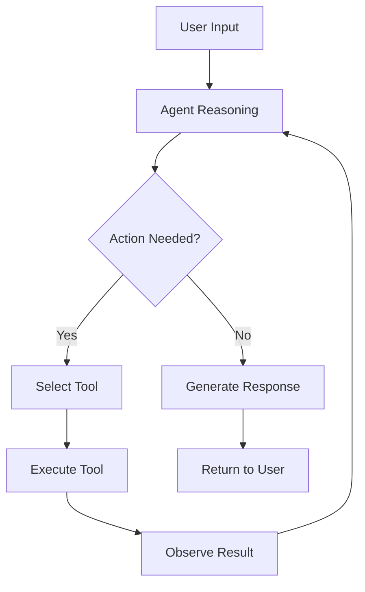
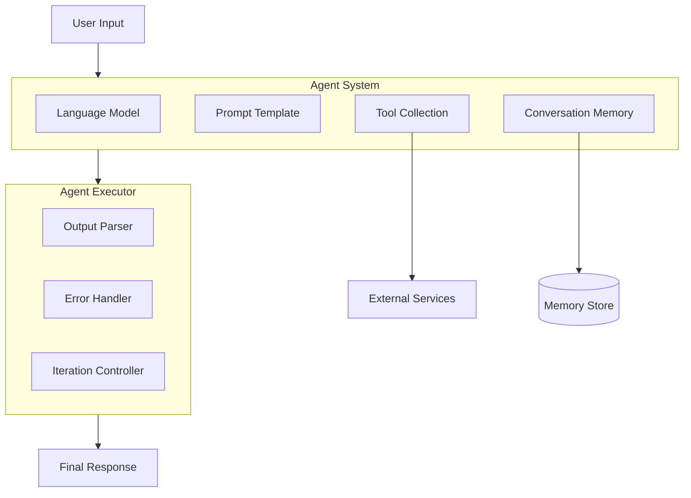
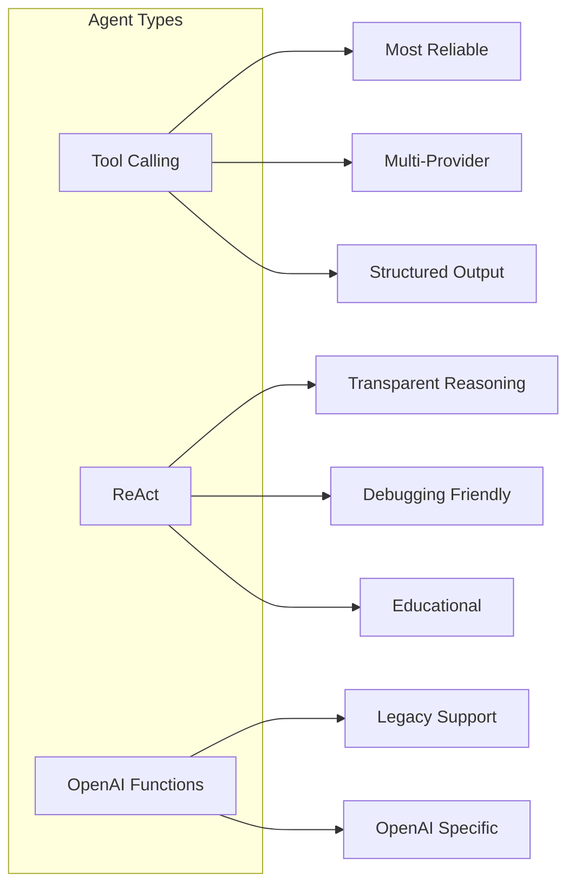
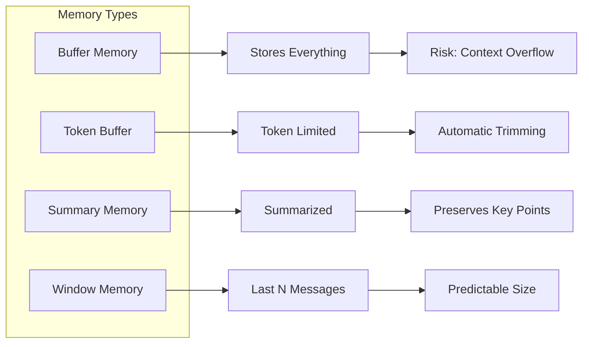
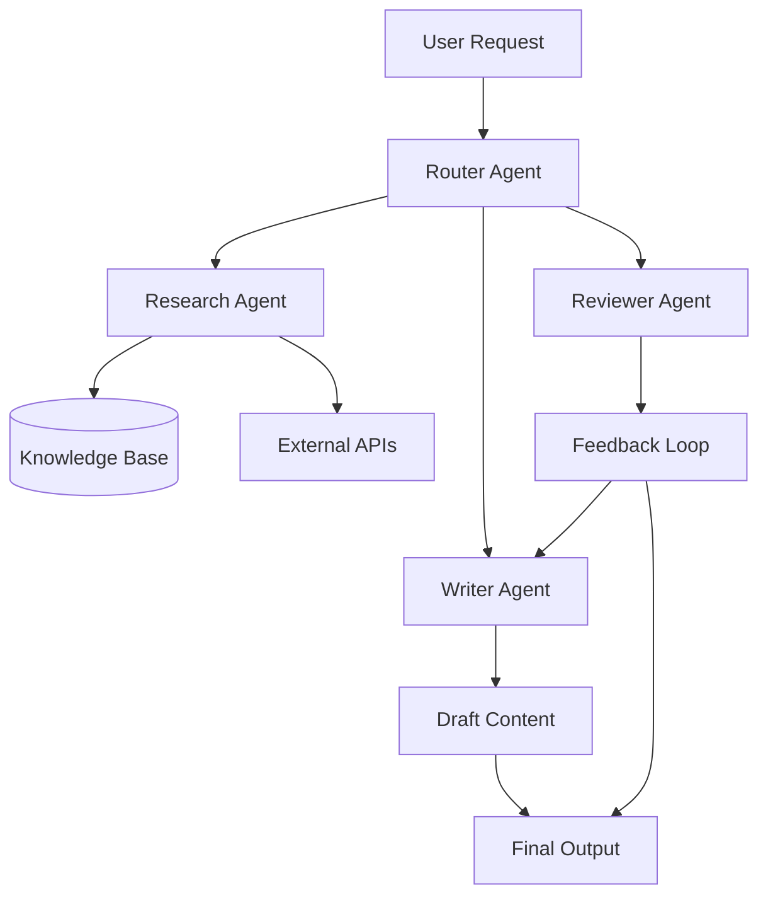

# How to Build Agents with LangChain

Author: [nawazdhandala](https://www.github.com/nawazdhandala)

Tags: LangChain, Agents, AI, LLM, Python, OpenAI, Autonomous Systems, Machine Learning

Description: A comprehensive guide to building intelligent AI agents with LangChain. Learn agent architectures, tool integration, memory management, error handling, and production deployment patterns with practical code examples.

---

> Agents are the evolution of AI from passive responders to active problem solvers. By combining large language models with tools, memory, and reasoning frameworks, LangChain agents can autonomously navigate complex tasks that would otherwise require human intervention at every step.

Building effective AI agents requires understanding how to orchestrate multiple components: the reasoning engine (LLM), available tools, conversation memory, and execution control. This guide walks through each component with practical examples you can adapt for your own applications.

---

## What Are AI Agents

An AI agent is a system that uses a language model to reason about problems, decide on actions, and execute those actions using available tools. Unlike simple chatbots that generate responses, agents can:

- Break down complex tasks into steps
- Select appropriate tools for each step
- Execute actions and observe results
- Iterate until the goal is achieved

The following diagram illustrates the agent execution loop.



This loop continues until the agent determines it has enough information to provide a final answer or reaches a maximum iteration limit.

---

## Setting Up Your Environment

Before building agents, you need to install the required packages and configure API access.

### Installation

The following commands install LangChain and its dependencies for working with OpenAI models.

```bash
# Install core LangChain packages
pip install langchain langchain-openai langchain-core

# Install additional dependencies for tools
pip install aiohttp requests pydantic

# Optional: Install for web search and other integrations
pip install langchain-community duckduckgo-search
```

### Environment Configuration

Set up your API keys as environment variables for secure access.

```bash
# Set your OpenAI API key
export OPENAI_API_KEY="your-api-key-here"

# Optional: Set for other providers
export ANTHROPIC_API_KEY="your-anthropic-key"
```

---

## Understanding Agent Architecture

LangChain agents consist of several key components that work together. Understanding each component helps you build more effective agents.



### Component Overview

| Component | Purpose |
|-----------|---------|
| Language Model | The reasoning engine that decides what actions to take |
| Prompt Template | Instructions that guide agent behavior |
| Tools | Functions the agent can call to interact with external systems |
| Memory | Stores conversation history for context |
| Agent Executor | Manages the execution loop and error handling |

---

## Creating Your First Agent

Let us build a simple agent that can perform calculations and look up information. This example demonstrates the fundamental pattern for all LangChain agents.

The following code creates an agent with basic tools and runs it with a sample query.

```python
# first_agent.py
# A basic LangChain agent with calculator and search tools
from langchain_openai import ChatOpenAI
from langchain.agents import create_tool_calling_agent, AgentExecutor
from langchain_core.prompts import ChatPromptTemplate, MessagesPlaceholder
from langchain_core.tools import tool

# Initialize the language model
# Temperature of 0 makes responses more deterministic
llm = ChatOpenAI(
    model="gpt-4",
    temperature=0
)

# Define a simple calculator tool
# The @tool decorator converts this function into a LangChain tool
@tool
def calculator(expression: str) -> str:
    """
    Evaluate a mathematical expression and return the result.

    Args:
        expression: A mathematical expression like '2 + 2' or '(10 * 5) / 2'

    Returns:
        The calculated result as a string
    """
    try:
        # Use eval with restricted globals for safety
        # In production, use a proper math parser
        result = eval(expression, {"__builtins__": {}}, {})
        return f"The result of {expression} is {result}"
    except Exception as e:
        return f"Error calculating: {str(e)}"

# Define a simple lookup tool
@tool
def lookup_fact(topic: str) -> str:
    """
    Look up a fact about a given topic.

    Args:
        topic: The topic to look up information about

    Returns:
        A fact or information about the topic
    """
    # In production, this would call a real API or database
    facts = {
        "python": "Python was created by Guido van Rossum and released in 1991.",
        "kubernetes": "Kubernetes was originally developed by Google and released in 2014.",
        "langchain": "LangChain is an open-source framework for building LLM applications."
    }
    topic_lower = topic.lower()
    for key, value in facts.items():
        if key in topic_lower:
            return value
    return f"No specific information found about {topic}."

# Collect tools into a list
tools = [calculator, lookup_fact]

# Create the prompt template
# This template instructs the agent on how to behave
prompt = ChatPromptTemplate.from_messages([
    ("system", """You are a helpful assistant that can perform calculations and look up facts.
When asked a question, think about whether you need to use a tool to answer it.
Use the calculator for any mathematical operations.
Use the lookup_fact tool for factual questions."""),
    ("human", "{input}"),
    # agent_scratchpad holds intermediate reasoning steps
    MessagesPlaceholder(variable_name="agent_scratchpad")
])

# Create the agent
# This combines the LLM, tools, and prompt into an agent
agent = create_tool_calling_agent(llm, tools, prompt)

# Create the executor
# The executor manages running the agent and handling tool calls
executor = AgentExecutor(
    agent=agent,
    tools=tools,
    verbose=True,  # Print intermediate steps
    max_iterations=5  # Prevent infinite loops
)

# Run the agent
result = executor.invoke({
    "input": "What is 25 multiplied by 47, and when was Python created?"
})

print("\nFinal Answer:", result["output"])
```

When you run this code, the agent will:
1. Parse the question and identify two sub-tasks
2. Use the calculator tool for the multiplication
3. Use the lookup_fact tool for Python information
4. Combine the results into a final answer

---

## Agent Types and When to Use Them

LangChain provides different agent types optimized for various use cases. Choosing the right type improves reliability and performance.

### Tool Calling Agent (Recommended)

The tool calling agent is the most modern and reliable option. It works with any LLM that supports tool or function calling.

```python
# tool_calling_agent.py
# The recommended agent type for most applications
from langchain_openai import ChatOpenAI
from langchain.agents import create_tool_calling_agent, AgentExecutor
from langchain_core.prompts import ChatPromptTemplate, MessagesPlaceholder
from langchain_core.tools import tool

llm = ChatOpenAI(model="gpt-4", temperature=0)

@tool
def get_weather(city: str) -> str:
    """Get current weather for a city."""
    # Mock implementation
    weather_data = {
        "new york": "72F, Sunny with light breeze",
        "london": "58F, Overcast with chance of rain",
        "tokyo": "68F, Clear skies"
    }
    return weather_data.get(city.lower(), f"Weather data not available for {city}")

@tool
def get_time(timezone: str) -> str:
    """Get current time in a timezone."""
    from datetime import datetime
    import pytz
    try:
        tz = pytz.timezone(timezone)
        current_time = datetime.now(tz)
        return f"Current time in {timezone}: {current_time.strftime('%H:%M:%S')}"
    except Exception:
        return f"Invalid timezone: {timezone}"

tools = [get_weather, get_time]

prompt = ChatPromptTemplate.from_messages([
    ("system", "You help users with weather and time information."),
    ("human", "{input}"),
    MessagesPlaceholder(variable_name="agent_scratchpad")
])

agent = create_tool_calling_agent(llm, tools, prompt)
executor = AgentExecutor(agent=agent, tools=tools, verbose=True)

result = executor.invoke({
    "input": "What is the weather in Tokyo and what time is it there?"
})
```

### ReAct Agent

The ReAct (Reasoning and Acting) agent explicitly shows its reasoning process. This is useful when you need transparency in decision-making.

```python
# react_agent.py
# ReAct agent that shows explicit reasoning steps
from langchain_openai import ChatOpenAI
from langchain.agents import create_react_agent, AgentExecutor
from langchain import hub
from langchain_core.tools import tool

llm = ChatOpenAI(model="gpt-4", temperature=0)

@tool
def search_inventory(product: str) -> str:
    """Search for a product in inventory."""
    inventory = {
        "laptop": {"stock": 45, "price": 999.99},
        "keyboard": {"stock": 120, "price": 79.99},
        "mouse": {"stock": 200, "price": 29.99}
    }
    item = inventory.get(product.lower())
    if item:
        return f"{product}: {item['stock']} in stock at ${item['price']}"
    return f"{product} not found in inventory"

@tool
def calculate_discount(price: float, percent: float) -> str:
    """Calculate discounted price."""
    discounted = price * (1 - percent / 100)
    return f"Price after {percent}% discount: ${discounted:.2f}"

tools = [search_inventory, calculate_discount]

# Pull the standard ReAct prompt from LangChain Hub
prompt = hub.pull("hwchase17/react")

agent = create_react_agent(llm, tools, prompt)
executor = AgentExecutor(
    agent=agent,
    tools=tools,
    verbose=True,
    handle_parsing_errors=True
)

# The agent will show its thinking process:
# Thought: I need to search for the laptop and then calculate the discount
# Action: search_inventory
# Action Input: laptop
# Observation: laptop: 45 in stock at $999.99
# Thought: Now I can calculate the discount
# Action: calculate_discount
# Action Input: 999.99, 15
# Observation: Price after 15% discount: $849.99
result = executor.invoke({
    "input": "Find the laptop price and calculate a 15% discount"
})
```

### Comparison of Agent Types



| Agent Type | Best For | Trade-offs |
|------------|----------|------------|
| Tool Calling | Production applications | Requires tool-calling capable LLM |
| ReAct | Debugging, education | More verbose, slightly slower |
| OpenAI Functions | Legacy OpenAI integrations | Limited to OpenAI models |

---

## Building Custom Tools

Tools are the bridge between your agent and external systems. Well-designed tools make agents more capable and reliable.

### Basic Tool Creation

The simplest way to create a tool is using the `@tool` decorator. LangChain infers the schema from type hints and docstrings.

```python
# basic_tools.py
# Different approaches to creating custom tools
from langchain_core.tools import tool, StructuredTool
from pydantic import BaseModel, Field
from typing import Optional, List

# Simple tool using the @tool decorator
# The docstring becomes the tool description
@tool
def send_notification(message: str, channel: str = "email") -> str:
    """
    Send a notification to users through the specified channel.

    Args:
        message: The notification message to send
        channel: The channel to use (email, sms, or slack)

    Returns:
        Confirmation of the sent notification
    """
    valid_channels = ["email", "sms", "slack"]
    if channel.lower() not in valid_channels:
        return f"Invalid channel. Use one of: {', '.join(valid_channels)}"

    # In production, this would actually send the notification
    return f"Notification sent via {channel}: {message[:50]}..."

# Tool with custom name
@tool("database_query")
def query_db(sql: str) -> str:
    """
    Execute a read-only SQL query against the database.
    Only SELECT statements are allowed.

    Args:
        sql: The SQL query to execute
    """
    if not sql.strip().upper().startswith("SELECT"):
        return "Error: Only SELECT queries are allowed"

    # Mock database response
    return f"Query executed. Returned 10 rows."

# Print tool information
print(f"Tool name: {send_notification.name}")
print(f"Description: {send_notification.description}")
print(f"Arguments: {send_notification.args}")
```

### Tools with Pydantic Schemas

For complex tools, define explicit input schemas using Pydantic. This provides validation, documentation, and type safety.

```python
# pydantic_tools.py
# Tools with explicit Pydantic schemas for input validation
from langchain_core.tools import tool, StructuredTool
from pydantic import BaseModel, Field, field_validator
from typing import Optional, List
from datetime import datetime

class CreateOrderInput(BaseModel):
    """Input schema for creating an order."""

    customer_id: str = Field(
        description="Unique identifier for the customer"
    )
    items: List[str] = Field(
        description="List of product IDs to include in the order",
        min_length=1
    )
    shipping_address: str = Field(
        description="Full shipping address for delivery"
    )
    priority: str = Field(
        default="standard",
        description="Shipping priority: standard, express, or overnight"
    )

    @field_validator("priority")
    @classmethod
    def validate_priority(cls, v: str) -> str:
        allowed = {"standard", "express", "overnight"}
        if v.lower() not in allowed:
            raise ValueError(f"Priority must be one of: {', '.join(allowed)}")
        return v.lower()

class SearchOrdersInput(BaseModel):
    """Input schema for searching orders."""

    customer_id: Optional[str] = Field(
        default=None,
        description="Filter by customer ID"
    )
    status: Optional[str] = Field(
        default=None,
        description="Filter by order status: pending, shipped, delivered"
    )
    start_date: Optional[str] = Field(
        default=None,
        description="Start date for search range (YYYY-MM-DD)"
    )
    end_date: Optional[str] = Field(
        default=None,
        description="End date for search range (YYYY-MM-DD)"
    )
    limit: int = Field(
        default=10,
        ge=1,
        le=100,
        description="Maximum number of results (1-100)"
    )

# Tool using the Pydantic schema
@tool(args_schema=CreateOrderInput)
def create_order(
    customer_id: str,
    items: List[str],
    shipping_address: str,
    priority: str = "standard"
) -> str:
    """Create a new order for a customer."""
    order_id = f"ORD-{datetime.now().strftime('%Y%m%d%H%M%S')}"
    return f"Created order {order_id} with {len(items)} items for customer {customer_id}"

# Alternative: Create tool using StructuredTool
def search_orders_impl(
    customer_id: Optional[str] = None,
    status: Optional[str] = None,
    start_date: Optional[str] = None,
    end_date: Optional[str] = None,
    limit: int = 10
) -> str:
    """Implementation of order search."""
    filters = []
    if customer_id:
        filters.append(f"customer={customer_id}")
    if status:
        filters.append(f"status={status}")
    if start_date:
        filters.append(f"from={start_date}")
    if end_date:
        filters.append(f"to={end_date}")

    filter_str = ", ".join(filters) if filters else "none"
    return f"Found 5 orders matching filters ({filter_str}), limited to {limit}"

search_orders = StructuredTool.from_function(
    func=search_orders_impl,
    name="search_orders",
    description="Search for orders with optional filters",
    args_schema=SearchOrdersInput
)
```

### Async Tools for I/O Operations

For network calls, database queries, or file operations, async tools prevent blocking.

```python
# async_tools.py
# Async tools for non-blocking I/O operations
import asyncio
import aiohttp
from langchain_core.tools import tool

@tool
async def fetch_api_data(endpoint: str) -> str:
    """
    Fetch data from an API endpoint asynchronously.

    Args:
        endpoint: The API endpoint path (e.g., /users/123)

    Returns:
        The API response data or error message
    """
    base_url = "https://api.example.com"
    url = f"{base_url}{endpoint}"

    async with aiohttp.ClientSession() as session:
        try:
            async with session.get(url, timeout=10) as response:
                if response.status == 200:
                    data = await response.json()
                    return f"API Response: {data}"
                else:
                    return f"API Error: HTTP {response.status}"
        except asyncio.TimeoutError:
            return "Error: Request timed out after 10 seconds"
        except aiohttp.ClientError as e:
            return f"Error: {str(e)}"

@tool
async def parallel_search(queries: list) -> str:
    """
    Search multiple sources in parallel.

    Args:
        queries: List of search queries to run simultaneously

    Returns:
        Combined search results
    """
    async def search_one(query: str) -> dict:
        # Simulate search with delay
        await asyncio.sleep(0.5)
        return {"query": query, "results": 10}

    # Run all searches in parallel
    tasks = [search_one(q) for q in queries]
    results = await asyncio.gather(*tasks)

    total = sum(r["results"] for r in results)
    return f"Searched {len(queries)} queries, found {total} total results"

# Using async tools with an agent
async def run_async_agent():
    from langchain_openai import ChatOpenAI
    from langchain.agents import create_tool_calling_agent, AgentExecutor
    from langchain_core.prompts import ChatPromptTemplate, MessagesPlaceholder

    llm = ChatOpenAI(model="gpt-4")
    tools = [fetch_api_data, parallel_search]

    prompt = ChatPromptTemplate.from_messages([
        ("system", "You are a helpful assistant with API access."),
        ("human", "{input}"),
        MessagesPlaceholder(variable_name="agent_scratchpad")
    ])

    agent = create_tool_calling_agent(llm, tools, prompt)
    executor = AgentExecutor(agent=agent, tools=tools)

    # Use ainvoke for async execution
    result = await executor.ainvoke({
        "input": "Fetch user data from /users/123"
    })
    return result["output"]

# Run: asyncio.run(run_async_agent())
```

---

## Adding Memory to Agents

Memory allows agents to maintain context across multiple interactions. This is essential for conversational applications.

### Conversation Buffer Memory

Buffer memory stores the complete conversation history.

```python
# agent_memory.py
# Agent with conversation memory for multi-turn interactions
from langchain_openai import ChatOpenAI
from langchain.agents import create_tool_calling_agent, AgentExecutor
from langchain_core.prompts import ChatPromptTemplate, MessagesPlaceholder
from langchain.memory import ConversationBufferMemory
from langchain_core.tools import tool

llm = ChatOpenAI(model="gpt-4", temperature=0)

@tool
def set_reminder(task: str, time: str) -> str:
    """Set a reminder for a task at a specific time."""
    return f"Reminder set: '{task}' at {time}"

@tool
def list_reminders() -> str:
    """List all active reminders."""
    # In production, this would query a database
    return "Active reminders: 1. Meeting at 3pm, 2. Call client at 5pm"

@tool
def get_user_info(field: str) -> str:
    """Get user information by field name."""
    user_data = {
        "name": "Alice",
        "email": "alice@example.com",
        "timezone": "America/New_York"
    }
    return user_data.get(field.lower(), f"Unknown field: {field}")

tools = [set_reminder, list_reminders, get_user_info]

# Initialize memory
# return_messages=True returns Message objects instead of strings
memory = ConversationBufferMemory(
    memory_key="chat_history",
    return_messages=True
)

# Prompt must include the memory placeholder
prompt = ChatPromptTemplate.from_messages([
    ("system", """You are a helpful personal assistant.
Remember context from the conversation to provide personalized help.
When the user references something from earlier, use that context."""),
    MessagesPlaceholder(variable_name="chat_history"),
    ("human", "{input}"),
    MessagesPlaceholder(variable_name="agent_scratchpad")
])

agent = create_tool_calling_agent(llm, tools, prompt)

executor = AgentExecutor(
    agent=agent,
    tools=tools,
    memory=memory,
    verbose=True
)

# Multi-turn conversation demonstrating memory
print("Turn 1:")
response1 = executor.invoke({"input": "What is my name?"})
print(response1["output"])

print("\nTurn 2:")
response2 = executor.invoke({"input": "Set a reminder to call my manager tomorrow at 2pm"})
print(response2["output"])

print("\nTurn 3:")
# The agent remembers the context from previous turns
response3 = executor.invoke({"input": "What reminders do I have?"})
print(response3["output"])
```

### Token-Aware Memory

For long conversations, use token-aware memory to stay within context limits.

```python
# token_memory.py
# Memory that respects token limits
from langchain.memory import ConversationTokenBufferMemory
from langchain_openai import ChatOpenAI

llm = ChatOpenAI(model="gpt-4")

# This memory automatically drops older messages when the limit is reached
memory = ConversationTokenBufferMemory(
    llm=llm,
    max_token_limit=2000,
    memory_key="chat_history",
    return_messages=True
)

# The most recent messages are preserved
# Older messages are dropped when the limit is exceeded
```

### Memory Architecture



---

## Error Handling and Reliability

Production agents need robust error handling to gracefully recover from failures.

### Tool Error Handling

Design tools to return helpful error messages instead of crashing.

```python
# error_handling.py
# Robust error handling patterns for agent tools
from langchain_core.tools import tool, ToolException
from langchain_openai import ChatOpenAI
from langchain.agents import create_tool_calling_agent, AgentExecutor
from langchain_core.prompts import ChatPromptTemplate, MessagesPlaceholder
import requests

@tool
def fetch_user_data(user_id: str) -> str:
    """
    Fetch user data from the API.
    Returns error message if request fails.
    """
    try:
        # Validate input
        if not user_id or len(user_id) < 3:
            return "Error: Invalid user ID. Must be at least 3 characters."

        # Simulate API call
        response = requests.get(
            f"https://api.example.com/users/{user_id}",
            timeout=10
        )

        if response.status_code == 404:
            return f"Error: User {user_id} not found."
        elif response.status_code == 429:
            return "Error: Rate limit exceeded. Please try again later."
        elif response.status_code != 200:
            return f"Error: API returned status {response.status_code}"

        return f"User data: {response.json()}"

    except requests.Timeout:
        return "Error: Request timed out. The API may be slow."
    except requests.ConnectionError:
        return "Error: Could not connect to the API. Check network."
    except Exception as e:
        return f"Error: Unexpected error occurred: {str(e)}"

@tool(handle_tool_error=True)
def risky_operation(data: str) -> str:
    """
    Perform an operation that might fail.
    Uses handle_tool_error to convert exceptions to messages.
    """
    if not data:
        raise ToolException("Data cannot be empty. Please provide valid input.")

    if len(data) > 1000:
        raise ToolException("Data too large. Maximum 1000 characters allowed.")

    return f"Operation completed successfully on {len(data)} characters"

tools = [fetch_user_data, risky_operation]

llm = ChatOpenAI(model="gpt-4")

prompt = ChatPromptTemplate.from_messages([
    ("system", """You are a helpful assistant.
When a tool returns an error, explain the issue to the user and suggest alternatives."""),
    ("human", "{input}"),
    MessagesPlaceholder(variable_name="agent_scratchpad")
])

agent = create_tool_calling_agent(llm, tools, prompt)

executor = AgentExecutor(
    agent=agent,
    tools=tools,
    verbose=True,
    handle_parsing_errors=True,  # Handle malformed LLM outputs
    max_iterations=5  # Prevent infinite loops
)
```

### Execution with Retries

Wrap agent execution with retry logic for transient failures.

```python
# retry_execution.py
# Agent execution with exponential backoff retry
import time
from typing import Dict, Any

def invoke_with_retry(
    executor,
    input_data: Dict[str, Any],
    max_retries: int = 3,
    initial_delay: float = 1.0
) -> Dict[str, Any]:
    """
    Execute agent with exponential backoff retry.

    Args:
        executor: The AgentExecutor instance
        input_data: Input dictionary for the agent
        max_retries: Maximum number of retry attempts
        initial_delay: Initial delay between retries in seconds

    Returns:
        The agent response or error information
    """
    last_error = None

    for attempt in range(max_retries):
        try:
            result = executor.invoke(input_data)
            return result

        except Exception as e:
            last_error = e

            if attempt < max_retries - 1:
                # Exponential backoff: 1s, 2s, 4s, etc.
                delay = initial_delay * (2 ** attempt)
                print(f"Attempt {attempt + 1} failed: {str(e)}")
                print(f"Retrying in {delay} seconds...")
                time.sleep(delay)
            else:
                print(f"All {max_retries} attempts failed")

    return {
        "output": f"Operation failed after {max_retries} attempts: {str(last_error)}",
        "error": str(last_error)
    }

# Usage
result = invoke_with_retry(
    executor,
    {"input": "Fetch data for user ABC123"},
    max_retries=3,
    initial_delay=1.0
)
```

---

## Streaming Agent Responses

Streaming provides better user experience for longer operations by showing progress.

```python
# streaming_agent.py
# Stream agent responses for real-time feedback
from langchain_openai import ChatOpenAI
from langchain.agents import create_tool_calling_agent, AgentExecutor
from langchain_core.prompts import ChatPromptTemplate, MessagesPlaceholder
from langchain_core.tools import tool
from langchain.callbacks.streaming_stdout import StreamingStdOutCallbackHandler
import asyncio

# Enable streaming on the LLM
llm = ChatOpenAI(
    model="gpt-4",
    streaming=True,
    callbacks=[StreamingStdOutCallbackHandler()]
)

@tool
def analyze_document(doc_id: str) -> str:
    """Analyze a document and return insights."""
    return f"Document {doc_id} analysis: 50 pages, positive sentiment, 3 key themes"

tools = [analyze_document]

prompt = ChatPromptTemplate.from_messages([
    ("system", "You are a document analysis assistant."),
    ("human", "{input}"),
    MessagesPlaceholder(variable_name="agent_scratchpad")
])

agent = create_tool_calling_agent(llm, tools, prompt)
executor = AgentExecutor(agent=agent, tools=tools)

# Async streaming with event handling
async def stream_agent_response(query: str):
    """Stream agent response with event details."""
    print(f"Query: {query}\n")
    print("Response: ", end="", flush=True)

    async for event in executor.astream_events(
        {"input": query},
        version="v1"
    ):
        kind = event["event"]

        if kind == "on_chat_model_stream":
            # Stream tokens from the LLM
            content = event["data"]["chunk"].content
            if content:
                print(content, end="", flush=True)

        elif kind == "on_tool_start":
            # Tool is being invoked
            print(f"\n[Tool: {event['name']}]", end="", flush=True)

        elif kind == "on_tool_end":
            # Tool completed
            output = event["data"]["output"]
            print(f"\n[Result: {output[:100]}...]", end="", flush=True)

    print("\n")

# Run the streaming agent
# asyncio.run(stream_agent_response("Analyze document DOC-123 and summarize the findings"))
```

### FastAPI Streaming Endpoint

Integrate streaming with a web API.

```python
# fastapi_streaming.py
# Stream agent responses through FastAPI
from fastapi import FastAPI
from fastapi.responses import StreamingResponse
import json

app = FastAPI()

# Assume executor is configured elsewhere
# executor = AgentExecutor(...)

@app.post("/agent/stream")
async def stream_agent(request: dict):
    """Stream agent response as Server-Sent Events."""

    async def generate():
        async for event in executor.astream_events(
            {"input": request["message"]},
            version="v1"
        ):
            if event["event"] == "on_chat_model_stream":
                content = event["data"]["chunk"].content
                if content:
                    yield f"data: {json.dumps({'type': 'token', 'content': content})}\n\n"

            elif event["event"] == "on_tool_start":
                yield f"data: {json.dumps({'type': 'tool', 'name': event['name']})}\n\n"

            elif event["event"] == "on_tool_end":
                result = event["data"]["output"]
                yield f"data: {json.dumps({'type': 'result', 'output': result})}\n\n"

        yield f"data: {json.dumps({'type': 'done'})}\n\n"

    return StreamingResponse(
        generate(),
        media_type="text/event-stream"
    )
```

---

## Monitoring and Observability

Track agent performance and behavior in production.

```python
# agent_monitoring.py
# Custom callback handler for monitoring agent execution
from langchain.callbacks.base import BaseCallbackHandler
from langchain_core.tools import tool
from langchain_openai import ChatOpenAI
from langchain.agents import create_tool_calling_agent, AgentExecutor
from langchain_core.prompts import ChatPromptTemplate, MessagesPlaceholder
from typing import Any, Dict, List
import time
import logging

logging.basicConfig(level=logging.INFO)
logger = logging.getLogger(__name__)

class AgentMetricsCallback(BaseCallbackHandler):
    """Callback handler that collects metrics for monitoring."""

    def __init__(self):
        self.start_time = None
        self.tool_calls = []
        self.llm_calls = 0
        self.total_tokens = 0
        self.errors = []

    def on_chain_start(
        self,
        serialized: Dict[str, Any],
        inputs: Dict[str, Any],
        **kwargs
    ):
        """Record when agent execution starts."""
        self.start_time = time.time()
        logger.info(f"Agent started - Input length: {len(str(inputs))}")

    def on_chain_end(
        self,
        outputs: Dict[str, Any],
        **kwargs
    ):
        """Record when agent execution completes."""
        duration = time.time() - self.start_time

        metrics = {
            "duration_seconds": round(duration, 2),
            "tool_calls": len(self.tool_calls),
            "llm_calls": self.llm_calls,
            "total_tokens": self.total_tokens,
            "errors": len(self.errors)
        }

        logger.info(f"Agent completed - Metrics: {metrics}")

        # Send to your monitoring system
        # send_to_oneuptime(metrics)

    def on_tool_start(
        self,
        serialized: Dict[str, Any],
        input_str: str,
        **kwargs
    ):
        """Record tool invocation."""
        tool_name = serialized.get("name", "unknown")
        self.tool_calls.append({
            "tool": tool_name,
            "start_time": time.time()
        })
        logger.info(f"Tool started: {tool_name}")

    def on_tool_end(
        self,
        output: str,
        **kwargs
    ):
        """Record tool completion."""
        if self.tool_calls:
            last_call = self.tool_calls[-1]
            last_call["duration"] = time.time() - last_call["start_time"]
            logger.info(f"Tool completed: {last_call['tool']} in {last_call['duration']:.2f}s")

    def on_tool_error(
        self,
        error: Exception,
        **kwargs
    ):
        """Record tool errors."""
        self.errors.append(str(error))
        logger.error(f"Tool error: {error}")

    def on_llm_start(
        self,
        serialized: Dict[str, Any],
        prompts: List[str],
        **kwargs
    ):
        """Record LLM call."""
        self.llm_calls += 1

    def on_llm_end(
        self,
        response,
        **kwargs
    ):
        """Record LLM completion and token usage."""
        if hasattr(response, "llm_output") and response.llm_output:
            usage = response.llm_output.get("token_usage", {})
            self.total_tokens += usage.get("total_tokens", 0)

# Usage with an agent
llm = ChatOpenAI(model="gpt-4")

@tool
def process_request(request_id: str) -> str:
    """Process a request by ID."""
    return f"Processed request {request_id}"

tools = [process_request]

prompt = ChatPromptTemplate.from_messages([
    ("system", "You are a request processing assistant."),
    ("human", "{input}"),
    MessagesPlaceholder(variable_name="agent_scratchpad")
])

agent = create_tool_calling_agent(llm, tools, prompt)

# Create callback instance
metrics = AgentMetricsCallback()

executor = AgentExecutor(
    agent=agent,
    tools=tools,
    callbacks=[metrics],
    verbose=False
)

result = executor.invoke({"input": "Process request REQ-12345"})

# Access collected metrics
print(f"Tool calls: {metrics.tool_calls}")
print(f"LLM calls: {metrics.llm_calls}")
print(f"Tokens used: {metrics.total_tokens}")
```

---

## Multi-Agent Systems

For complex workflows, coordinate multiple specialized agents.



```python
# multi_agent.py
# Coordinating multiple specialized agents
from langchain_openai import ChatOpenAI
from langchain.agents import create_tool_calling_agent, AgentExecutor
from langchain_core.prompts import ChatPromptTemplate, MessagesPlaceholder
from langchain_core.tools import tool, Tool
from typing import Dict, Any

llm = ChatOpenAI(model="gpt-4", temperature=0)

# Research Agent
@tool
def search_knowledge_base(query: str) -> str:
    """Search the internal knowledge base."""
    return f"Found 3 articles related to: {query}"

@tool
def search_web(query: str) -> str:
    """Search the web for information."""
    return f"Web search results for: {query}"

research_tools = [search_knowledge_base, search_web]

research_prompt = ChatPromptTemplate.from_messages([
    ("system", "You are a research agent. Gather comprehensive information on topics."),
    ("human", "{input}"),
    MessagesPlaceholder(variable_name="agent_scratchpad")
])

research_agent = create_tool_calling_agent(llm, research_tools, research_prompt)
research_executor = AgentExecutor(
    agent=research_agent,
    tools=research_tools,
    verbose=False
)

# Writer Agent
@tool
def create_outline(topic: str) -> str:
    """Create an outline for content."""
    return f"Outline for {topic}: 1. Introduction 2. Main Points 3. Conclusion"

@tool
def expand_section(section: str, context: str) -> str:
    """Expand a section with details."""
    return f"Expanded content for {section} based on context"

writer_tools = [create_outline, expand_section]

writer_prompt = ChatPromptTemplate.from_messages([
    ("system", "You are a writer agent. Create clear, well-structured content."),
    ("human", "{input}"),
    MessagesPlaceholder(variable_name="agent_scratchpad")
])

writer_agent = create_tool_calling_agent(llm, writer_tools, writer_prompt)
writer_executor = AgentExecutor(
    agent=writer_agent,
    tools=writer_tools,
    verbose=False
)

# Coordinator that uses agents as tools
def call_research_agent(query: str) -> str:
    """Delegate to the research agent."""
    result = research_executor.invoke({"input": query})
    return result["output"]

def call_writer_agent(task: str) -> str:
    """Delegate to the writer agent."""
    result = writer_executor.invoke({"input": task})
    return result["output"]

# Create tools from other agents
coordinator_tools = [
    Tool(
        name="research_agent",
        func=call_research_agent,
        description="Use this to research any topic. Input should be a research question."
    ),
    Tool(
        name="writer_agent",
        func=call_writer_agent,
        description="Use this to write content. Input should include the topic and context."
    )
]

coordinator_prompt = ChatPromptTemplate.from_messages([
    ("system", """You are a coordinator that manages a research agent and a writer agent.
For content creation tasks:
1. First use research_agent to gather information
2. Then use writer_agent to create the content
Combine the results into a coherent response."""),
    ("human", "{input}"),
    MessagesPlaceholder(variable_name="agent_scratchpad")
])

coordinator_agent = create_tool_calling_agent(llm, coordinator_tools, coordinator_prompt)
coordinator_executor = AgentExecutor(
    agent=coordinator_agent,
    tools=coordinator_tools,
    verbose=True,
    max_iterations=10
)

# Run the multi-agent workflow
result = coordinator_executor.invoke({
    "input": "Create a blog post about the benefits of microservices architecture"
})
print(result["output"])
```

---

## Best Practices Summary

### Tool Design

1. **Write clear descriptions** - The LLM relies on docstrings to understand when and how to use tools
2. **Validate inputs early** - Use Pydantic schemas to catch errors before execution
3. **Return helpful errors** - Error messages should explain what went wrong and how to fix it
4. **Keep tools focused** - Each tool should do one thing well

### Agent Configuration

5. **Set iteration limits** - Always use `max_iterations` to prevent infinite loops
6. **Enable error handling** - Use `handle_parsing_errors=True` for production
7. **Choose appropriate memory** - Token-aware memory for long conversations
8. **Use verbose mode for debugging** - Disable in production for performance

### Production Deployment

9. **Monitor everything** - Track latency, token usage, and error rates
10. **Implement retries** - Use exponential backoff for transient failures
11. **Stream for UX** - Stream responses for better user experience
12. **Test tools independently** - Unit test tools before agent integration

### Common Pitfalls to Avoid

| Pitfall | Solution |
|---------|----------|
| Agent loops infinitely | Set `max_iterations` and `max_execution_time` |
| Context overflow | Use token-aware memory or summarization |
| Tool errors crash agent | Implement proper error handling in tools |
| Slow responses | Use async tools and streaming |
| Unpredictable behavior | Lower temperature, use tool calling agent |

---

## Conclusion

Building effective LangChain agents requires understanding how to combine LLMs with tools, memory, and proper execution control. Start with simple agents using the tool calling pattern, then add complexity as needed. Focus on robust error handling and monitoring from the beginning to ensure production reliability.

The patterns in this guide provide a foundation for building agents that can handle real-world tasks. As you develop more sophisticated applications, consider multi-agent architectures for complex workflows and always monitor performance to identify bottlenecks and failures.

---

*Building AI applications that need reliable monitoring? [OneUptime](https://oneuptime.com) provides comprehensive observability for your AI systems, including latency tracking, error monitoring, and performance metrics with native OpenTelemetry support.*

**Related Reading:**
- [Three Pillars of Observability: Logs, Metrics, Traces](https://oneuptime.com/blog/post/2025-08-20-three-pillars-of-observability-logs-metrics-traces/view)
- [How to Structure Logs Properly in Python with OpenTelemetry](https://oneuptime.com/blog/post/2025-01-06-python-structured-logging-opentelemetry/view)
