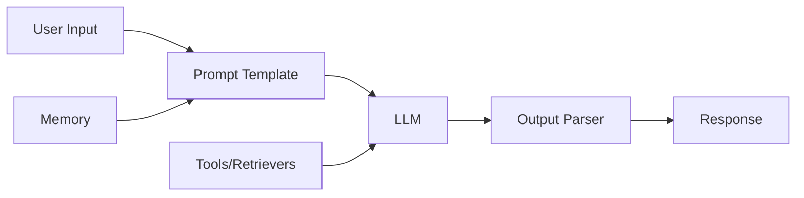
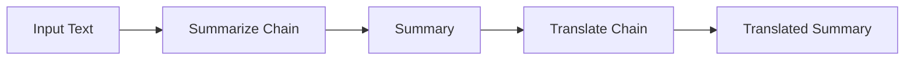
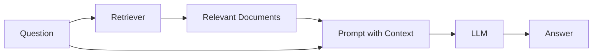

# How to Get Started with LangChain

Author: [nawazdhandala](https://www.github.com/nawazdhandala)

Tags: LangChain, LLM, AI, Python, RAG

Description: Learn how to get started with LangChain for building LLM-powered applications, from installation to creating your first chains and prompts.

---

LangChain is a framework that makes it easier to build applications powered by large language models (LLMs). Instead of writing boilerplate code for every LLM interaction, LangChain provides composable components that handle common patterns like prompt templates, chains, memory, and retrieval.

Whether you're building a chatbot, a question-answering system, or an AI agent, LangChain gives you the building blocks to get there faster.

## Why Use LangChain?

Before diving into code, it helps to understand what problems LangChain solves:

1. **Prompt Management** - Templates for dynamic prompts with variable substitution
2. **Chaining** - Connect multiple LLM calls and other operations together
3. **Memory** - Maintain conversation context across interactions
4. **Retrieval** - Connect LLMs to external data sources (RAG pattern)
5. **Agents** - Let LLMs decide which tools to use

Here's how the core components fit together:



## Installation

LangChain has a modular structure, so you install only what you need. The core package is `langchain-core`, and integrations come in separate packages.

Install LangChain and the OpenAI integration:

```bash
pip install langchain langchain-openai
```

For using other LLM providers, install the relevant package:

```bash
# For Anthropic Claude
pip install langchain-anthropic

# For local models with Ollama
pip install langchain-community

# For Google models
pip install langchain-google-genai
```

Set your API key as an environment variable:

```bash
export OPENAI_API_KEY="your-api-key-here"
```

## Your First LangChain Application

Let's start with a simple example that uses OpenAI's GPT model.

This code creates a basic LLM call with a prompt template that takes a topic and generates a short explanation:

```python
from langchain_openai import ChatOpenAI
from langchain_core.prompts import ChatPromptTemplate
from langchain_core.output_parsers import StrOutputParser

# Initialize the model with specific settings
# temperature=0.7 gives a balance between creativity and consistency
llm = ChatOpenAI(
    model="gpt-4",
    temperature=0.7
)

# Create a prompt template with a variable placeholder
# The {topic} will be replaced with actual input
prompt = ChatPromptTemplate.from_messages([
    ("system", "You are a helpful assistant that explains concepts clearly and concisely."),
    ("user", "Explain {topic} in simple terms.")
])

# Parse the output as a plain string
output_parser = StrOutputParser()

# Chain the components together using the pipe operator
# Data flows: prompt -> llm -> parser
chain = prompt | llm | output_parser

# Run the chain with a specific topic
response = chain.invoke({"topic": "machine learning"})
print(response)
```

## Understanding Prompt Templates

Prompt templates let you create reusable prompts with dynamic content. They support multiple message types for chat models.

This example shows different ways to construct prompts with system instructions, user messages, and AI responses:

```python
from langchain_core.prompts import ChatPromptTemplate, MessagesPlaceholder

# Simple template with one variable
simple_prompt = ChatPromptTemplate.from_template(
    "Translate the following to {language}: {text}"
)

# Multi-message template for chat applications
chat_prompt = ChatPromptTemplate.from_messages([
    ("system", "You are a {role}. Always respond in a {tone} manner."),
    ("user", "{input}")
])

# Template with conversation history placeholder
# MessagesPlaceholder allows inserting a list of messages
conversation_prompt = ChatPromptTemplate.from_messages([
    ("system", "You are a helpful coding assistant."),
    MessagesPlaceholder(variable_name="history"),  # Previous messages go here
    ("user", "{input}")
])

# Use the template by providing all required variables
messages = chat_prompt.format_messages(
    role="Python expert",
    tone="friendly but professional",
    input="How do I read a JSON file?"
)
```

## Building Chains with LCEL

LangChain Expression Language (LCEL) is the recommended way to compose chains. It uses the pipe operator (`|`) to connect components.

This example builds a chain that summarizes text and then translates the summary to another language:

```python
from langchain_openai import ChatOpenAI
from langchain_core.prompts import ChatPromptTemplate
from langchain_core.output_parsers import StrOutputParser
from langchain_core.runnables import RunnablePassthrough

llm = ChatOpenAI(model="gpt-4")
parser = StrOutputParser()

# First chain: summarize the input text
summarize_prompt = ChatPromptTemplate.from_template(
    "Summarize the following text in 2-3 sentences:\n\n{text}"
)
summarize_chain = summarize_prompt | llm | parser

# Second chain: translate the summary
translate_prompt = ChatPromptTemplate.from_template(
    "Translate to {language}:\n\n{summary}"
)
translate_chain = translate_prompt | llm | parser

# Combine chains: summarize first, then translate
# RunnablePassthrough passes the language through unchanged
combined_chain = (
    {
        "summary": summarize_chain,
        "language": lambda x: x["language"]  # Pass language to next step
    }
    | translate_chain
)

# Run the combined chain
result = combined_chain.invoke({
    "text": "LangChain is a framework for developing applications powered by language models...",
    "language": "Spanish"
})
print(result)
```

The flow looks like this:



## Working with Different Models

LangChain provides a unified interface for different LLM providers. Switch between models without changing your application logic.

This example shows how to use different model providers with the same chain structure:

```python
from langchain_openai import ChatOpenAI
from langchain_anthropic import ChatAnthropic
from langchain_community.llms import Ollama
from langchain_core.prompts import ChatPromptTemplate

# OpenAI GPT-4
openai_llm = ChatOpenAI(model="gpt-4")

# Anthropic Claude
anthropic_llm = ChatAnthropic(model="claude-3-sonnet-20240229")

# Local Ollama model - great for development and privacy
ollama_llm = Ollama(model="llama2")

# Same prompt works with any model
prompt = ChatPromptTemplate.from_template(
    "Write a haiku about {subject}"
)

# Create chains with different backends
openai_chain = prompt | openai_llm
anthropic_chain = prompt | anthropic_llm
ollama_chain = prompt | ollama_llm

# All chains have the same interface
result = openai_chain.invoke({"subject": "programming"})
```

## Adding Memory to Conversations

Memory allows your application to remember previous interactions. This is essential for chatbots and conversational applications.

This example creates a chatbot that remembers the conversation history:

```python
from langchain_openai import ChatOpenAI
from langchain_core.prompts import ChatPromptTemplate, MessagesPlaceholder
from langchain_core.messages import HumanMessage, AIMessage
from langchain_community.chat_message_histories import ChatMessageHistory
from langchain_core.runnables.history import RunnableWithMessageHistory

llm = ChatOpenAI(model="gpt-4")

# Prompt with a placeholder for conversation history
prompt = ChatPromptTemplate.from_messages([
    ("system", "You are a helpful assistant. Be concise in your responses."),
    MessagesPlaceholder(variable_name="history"),
    ("user", "{input}")
])

chain = prompt | llm

# Store for conversation histories, keyed by session ID
store = {}

def get_session_history(session_id: str):
    """Get or create a message history for a session."""
    if session_id not in store:
        store[session_id] = ChatMessageHistory()
    return store[session_id]

# Wrap the chain with message history handling
chain_with_history = RunnableWithMessageHistory(
    chain,
    get_session_history,
    input_messages_key="input",
    history_messages_key="history"
)

# Configuration specifies which session to use
config = {"configurable": {"session_id": "user-123"}}

# First message
response1 = chain_with_history.invoke(
    {"input": "My name is Alice"},
    config=config
)
print(response1.content)

# Second message - the bot remembers the name
response2 = chain_with_history.invoke(
    {"input": "What's my name?"},
    config=config
)
print(response2.content)  # Will mention "Alice"
```

## Output Parsing

Output parsers convert LLM responses into structured data. This is useful when you need consistent, machine-readable output.

This example shows how to parse LLM output into a Python dictionary with specific fields:

```python
from langchain_openai import ChatOpenAI
from langchain_core.prompts import ChatPromptTemplate
from langchain_core.output_parsers import JsonOutputParser
from langchain_core.pydantic_v1 import BaseModel, Field

# Define the expected output structure using Pydantic
class MovieReview(BaseModel):
    title: str = Field(description="The movie title")
    rating: int = Field(description="Rating from 1-10")
    summary: str = Field(description="Brief summary of the review")
    pros: list[str] = Field(description="List of positive points")
    cons: list[str] = Field(description="List of negative points")

# Create a parser that expects JSON matching the schema
parser = JsonOutputParser(pydantic_object=MovieReview)

# Include format instructions in the prompt
# This tells the LLM exactly how to structure its response
prompt = ChatPromptTemplate.from_messages([
    ("system", "You are a movie critic. Analyze the given movie and provide a structured review."),
    ("user", "Review the movie: {movie}\n\n{format_instructions}")
])

llm = ChatOpenAI(model="gpt-4", temperature=0)

# Build the chain with parsing
chain = prompt | llm | parser

# Get structured output
review = chain.invoke({
    "movie": "The Matrix",
    "format_instructions": parser.get_format_instructions()
})

# review is now a Python dictionary with guaranteed fields
print(f"Title: {review['title']}")
print(f"Rating: {review['rating']}/10")
print(f"Pros: {', '.join(review['pros'])}")
```

## Simple Retrieval Augmented Generation (RAG)

RAG combines retrieval with generation, allowing LLMs to answer questions using your own documents. This is how you build chatbots that know about your specific data.

This example creates a simple RAG system that answers questions from a list of documents:

```python
from langchain_openai import ChatOpenAI, OpenAIEmbeddings
from langchain_core.prompts import ChatPromptTemplate
from langchain_core.output_parsers import StrOutputParser
from langchain_core.runnables import RunnablePassthrough
from langchain_community.vectorstores import FAISS
from langchain_text_splitters import RecursiveCharacterTextSplitter

# Sample documents - in real applications, load from files or databases
documents = [
    "LangChain is a framework for developing applications powered by language models.",
    "LangChain supports multiple LLM providers including OpenAI, Anthropic, and local models.",
    "LCEL (LangChain Expression Language) is the recommended way to compose chains.",
    "RAG combines retrieval with generation to ground LLM responses in external data."
]

# Split documents into smaller chunks for better retrieval
# chunk_size controls the maximum size of each piece
text_splitter = RecursiveCharacterTextSplitter(
    chunk_size=200,
    chunk_overlap=50  # Overlap helps maintain context at boundaries
)
splits = text_splitter.create_documents(documents)

# Create embeddings and vector store
# Embeddings convert text to numerical vectors for similarity search
embeddings = OpenAIEmbeddings()
vectorstore = FAISS.from_documents(splits, embeddings)

# Create a retriever that finds relevant documents
# k=2 means return the 2 most relevant chunks
retriever = vectorstore.as_retriever(search_kwargs={"k": 2})

# RAG prompt template
prompt = ChatPromptTemplate.from_template("""
Answer the question based only on the following context:

{context}

Question: {question}

If the context doesn't contain relevant information, say "I don't have enough information to answer that."
""")

llm = ChatOpenAI(model="gpt-4")

def format_docs(docs):
    """Combine retrieved documents into a single string."""
    return "\n\n".join(doc.page_content for doc in docs)

# Build the RAG chain
rag_chain = (
    {
        "context": retriever | format_docs,  # Retrieve and format documents
        "question": RunnablePassthrough()     # Pass question through unchanged
    }
    | prompt
    | llm
    | StrOutputParser()
)

# Ask a question
answer = rag_chain.invoke("What is LCEL?")
print(answer)
```

The RAG flow:



## Error Handling and Retries

Production applications need proper error handling. LangChain provides built-in retry logic and fallback options.

This example shows how to handle API failures gracefully with retries and fallbacks:

```python
from langchain_openai import ChatOpenAI
from langchain_anthropic import ChatAnthropic
from langchain_core.prompts import ChatPromptTemplate
from langchain_core.output_parsers import StrOutputParser

# Primary model with retry configuration
# max_retries handles transient API failures
primary_llm = ChatOpenAI(
    model="gpt-4",
    max_retries=3,
    request_timeout=30
)

# Fallback model in case primary fails completely
fallback_llm = ChatAnthropic(
    model="claude-3-haiku-20240307",
    max_retries=2
)

prompt = ChatPromptTemplate.from_template("Explain {concept}")
parser = StrOutputParser()

# Create chain with fallback
# If primary fails after retries, fallback is used
chain = prompt | primary_llm.with_fallbacks([fallback_llm]) | parser

# This will try GPT-4 first, then Claude if GPT-4 fails
try:
    result = chain.invoke({"concept": "quantum computing"})
    print(result)
except Exception as e:
    print(f"All models failed: {e}")
```

## Async and Streaming

For web applications and better user experience, use async operations and streaming responses.

This example demonstrates async invocation and streaming output token by token:

```python
import asyncio
from langchain_openai import ChatOpenAI
from langchain_core.prompts import ChatPromptTemplate
from langchain_core.output_parsers import StrOutputParser

llm = ChatOpenAI(model="gpt-4")
prompt = ChatPromptTemplate.from_template("Write a short story about {topic}")
parser = StrOutputParser()
chain = prompt | llm | parser

async def async_invoke():
    """Run the chain asynchronously - useful for web servers."""
    result = await chain.ainvoke({"topic": "a robot learning to paint"})
    return result

async def stream_response():
    """Stream the response token by token - better UX for long responses."""
    async for chunk in chain.astream({"topic": "a robot learning to paint"}):
        print(chunk, end="", flush=True)  # Print each token as it arrives
    print()  # Newline at the end

# Run async functions
asyncio.run(stream_response())
```

## Debugging and Tracing

LangChain integrates with LangSmith for debugging and monitoring. Even without LangSmith, you can enable verbose logging.

This example shows how to enable debugging output:

```python
from langchain.globals import set_debug, set_verbose
from langchain_openai import ChatOpenAI
from langchain_core.prompts import ChatPromptTemplate

# Enable verbose mode to see what's happening
set_verbose(True)

# Or enable full debug mode for detailed output
set_debug(True)

llm = ChatOpenAI(model="gpt-4")
prompt = ChatPromptTemplate.from_template("Tell me a joke about {topic}")

chain = prompt | llm

# This will print detailed information about each step
response = chain.invoke({"topic": "programming"})
```

For production monitoring with LangSmith:

```bash
export LANGCHAIN_TRACING_V2=true
export LANGCHAIN_API_KEY="your-langsmith-api-key"
export LANGCHAIN_PROJECT="my-project"
```

## Common Patterns Summary

| Pattern | Use Case | Key Components |
|---------|----------|----------------|
| **Simple Chain** | Single LLM call with formatting | Prompt + LLM + Parser |
| **Sequential Chain** | Multi-step processing | Multiple chains piped together |
| **RAG** | Question answering over documents | Retriever + Context formatting + LLM |
| **Chatbot** | Conversational interface | Memory + Chat history |
| **Agent** | Dynamic tool selection | Tools + Agent executor |

## Next Steps

Once you're comfortable with these basics, explore:

- **Agents** - Let LLMs decide which tools to use for complex tasks
- **Document Loaders** - Load data from PDFs, websites, databases
- **Vector Stores** - Use production-ready stores like Pinecone, Weaviate, or Chroma
- **Callbacks** - Add custom logging, monitoring, and error handling
- **LangServe** - Deploy chains as REST APIs

LangChain's documentation at [python.langchain.com](https://python.langchain.com) has comprehensive guides for each of these topics.

---

*Building AI-powered applications requires solid observability to understand how your LLM calls perform in production. OneUptime provides monitoring and observability tools that help you track response times, error rates, and costs across your LangChain applications. Check out [OneUptime](https://oneuptime.com) to keep your AI systems running smoothly.*
