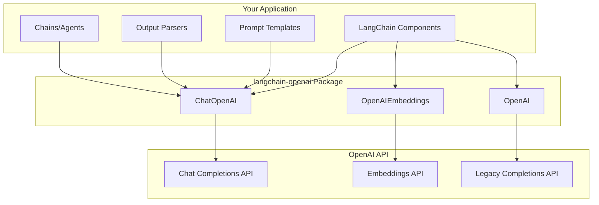
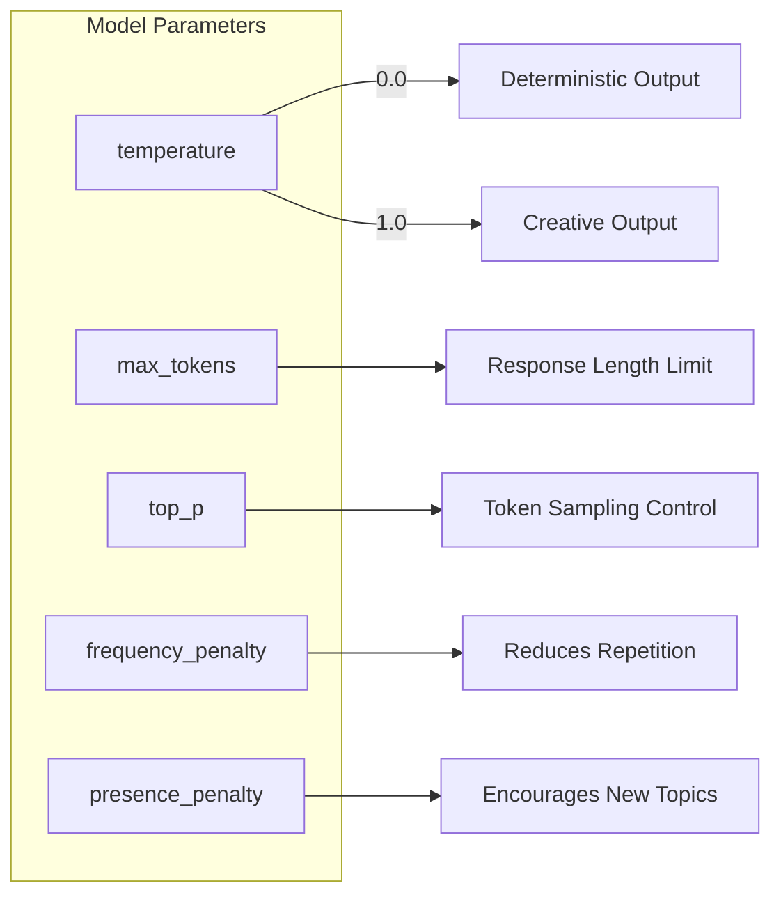
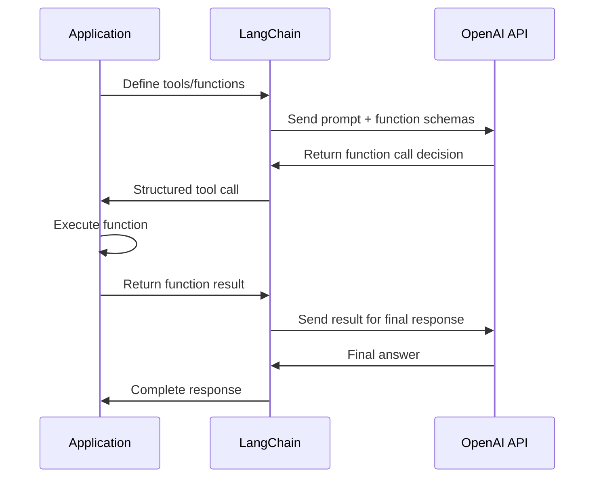
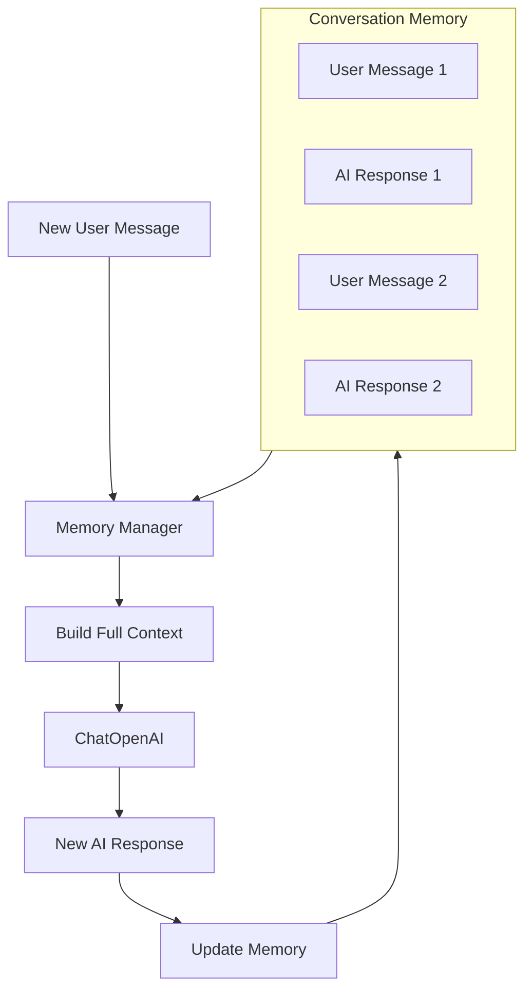
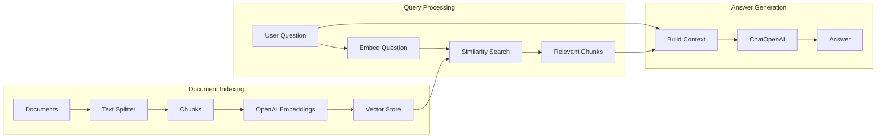

# How to Use LangChain with OpenAI

Author: [nawazdhandala](https://www.github.com/nawazdhandala)

Tags: LangChain, OpenAI, GPT-4, Python, LLM, AI Integration, Prompt Engineering, ChatGPT API

Description: A comprehensive guide to integrating LangChain with OpenAI's GPT models. Learn how to set up the integration, work with chat completions, handle streaming responses, implement function calling, and build production-ready AI applications.

---

LangChain and OpenAI together form a powerful combination for building AI-powered applications. While OpenAI provides state-of-the-art language models like GPT-4 and GPT-4o, LangChain offers the framework to compose, chain, and orchestrate these models effectively. Developers who master both tools can create sophisticated applications ranging from intelligent chatbots to complex document analysis systems.

## Understanding the LangChain-OpenAI Architecture

Before writing any code, it helps to visualize how LangChain connects to OpenAI's services.



The `langchain-openai` package serves as the bridge between your application code and OpenAI's API endpoints. Each LangChain class maps to a specific OpenAI service, handling authentication, request formatting, and response parsing automatically.

## Setting Up Your Environment

Getting started requires installing the necessary packages and configuring API access.

The following commands install LangChain core components along with the OpenAI integration package:

```bash
# Install the core LangChain library and OpenAI integration
pip install langchain langchain-openai

# For additional utilities like text splitting and vector stores
pip install langchain-community langchain-text-splitters
```

You need an OpenAI API key to authenticate requests. Store it securely as an environment variable rather than hardcoding it in your source files:

```bash
# Set your API key as an environment variable
export OPENAI_API_KEY="sk-your-api-key-here"

# Verify the key is set correctly
echo $OPENAI_API_KEY
```

For Python applications, you can also load the key from a `.env` file using python-dotenv:

```bash
pip install python-dotenv
```

Create a `.env` file in your project root with the following content:

```text
OPENAI_API_KEY=sk-your-api-key-here
```

Load the environment variables at the start of your application with the following code:

```python
# Load environment variables from .env file
# Call this at the very beginning of your application
from dotenv import load_dotenv
load_dotenv()

# Now you can use os.getenv("OPENAI_API_KEY") or let LangChain
# automatically detect the key from the environment
```

## Working with ChatOpenAI

The `ChatOpenAI` class is your primary interface for interacting with OpenAI's chat models. Most modern applications should use chat models like GPT-4o, GPT-4, or GPT-3.5-turbo.

Here is how to create a basic ChatOpenAI instance and make your first API call:

```python
from langchain_openai import ChatOpenAI
from langchain_core.messages import HumanMessage, SystemMessage

# Initialize the ChatOpenAI model with specific parameters
# model: specifies which OpenAI model to use
# temperature: controls randomness (0 = deterministic, 1 = creative)
# max_tokens: limits the response length
llm = ChatOpenAI(
    model="gpt-4o",
    temperature=0.7,
    max_tokens=1000
)

# Create a list of messages representing the conversation
# SystemMessage sets the AI's behavior and context
# HumanMessage contains the user's input
messages = [
    SystemMessage(content="You are a helpful coding assistant specializing in Python."),
    HumanMessage(content="How do I read a CSV file in Python?")
]

# Invoke the model and get a response
# The response is an AIMessage object containing the generated text
response = llm.invoke(messages)

# Access the content of the response
print(response.content)
```

## Understanding Model Parameters

OpenAI models accept several parameters that control their behavior. Choosing the right settings can significantly impact your application's performance and cost.



The code below demonstrates how to configure these parameters for different use cases:

```python
from langchain_openai import ChatOpenAI

# Configuration for factual, consistent responses
# Use low temperature for tasks requiring accuracy like code generation
factual_llm = ChatOpenAI(
    model="gpt-4o",
    temperature=0.0,  # Deterministic responses
    max_tokens=500,
    model_kwargs={
        "top_p": 1.0,  # Consider all tokens
        "frequency_penalty": 0.0,  # No penalty for repeating tokens
        "presence_penalty": 0.0   # No penalty for staying on topic
    }
)

# Configuration for creative writing tasks
# Higher temperature produces more varied and creative outputs
creative_llm = ChatOpenAI(
    model="gpt-4o",
    temperature=0.9,  # More randomness in output
    max_tokens=2000,  # Allow longer responses for stories
    model_kwargs={
        "top_p": 0.95,  # Slight nucleus sampling
        "frequency_penalty": 0.5,  # Discourage word repetition
        "presence_penalty": 0.5    # Encourage exploring new topics
    }
)

# Configuration optimized for cost
# GPT-3.5-turbo is faster and cheaper for simpler tasks
budget_llm = ChatOpenAI(
    model="gpt-3.5-turbo",
    temperature=0.3,
    max_tokens=200  # Shorter responses reduce costs
)
```

## Building Prompt Templates

Prompt templates allow you to create reusable, parameterized prompts. Instead of manually constructing strings, templates handle variable substitution and message formatting.

The following example shows how to create and use different types of prompt templates:

```python
from langchain_openai import ChatOpenAI
from langchain_core.prompts import ChatPromptTemplate, HumanMessagePromptTemplate
from langchain_core.messages import SystemMessage

# Simple template with a single variable
# Variables are enclosed in curly braces
simple_template = ChatPromptTemplate.from_template(
    "Explain {concept} to a beginner programmer in simple terms."
)

# Template with system message and multiple variables
# from_messages accepts a list of message tuples
code_review_template = ChatPromptTemplate.from_messages([
    ("system", "You are a senior {language} developer conducting code reviews."),
    ("human", "Please review this code and suggest improvements:\n\n```{language}\n{code}\n```")
])

# Initialize the model
llm = ChatOpenAI(model="gpt-4o", temperature=0.3)

# Use the template by invoking with variable values
# The pipe operator creates a chain: template -> llm
chain = code_review_template | llm

# Execute the chain with actual values
response = chain.invoke({
    "language": "Python",
    "code": """
def calculate_total(items):
    total = 0
    for i in range(len(items)):
        total = total + items[i]['price']
    return total
"""
})

print(response.content)
```

## Implementing Streaming Responses

Streaming allows your application to display responses as they are generated, improving perceived responsiveness for users.

The code demonstrates both synchronous and asynchronous streaming approaches:

```python
import asyncio
from langchain_openai import ChatOpenAI
from langchain_core.prompts import ChatPromptTemplate
from langchain_core.output_parsers import StrOutputParser

llm = ChatOpenAI(model="gpt-4o", temperature=0.7)
prompt = ChatPromptTemplate.from_template("Write a short poem about {subject}")
parser = StrOutputParser()

# Create the chain
chain = prompt | llm | parser

def synchronous_streaming():
    """Stream responses in a synchronous context."""
    print("Generating poem (sync streaming):\n")

    # stream() returns an iterator of string chunks
    # Each chunk is a portion of the generated text
    for chunk in chain.stream({"subject": "the ocean"}):
        # Print each chunk immediately without newline
        # flush=True ensures immediate display
        print(chunk, end="", flush=True)

    print("\n")  # Add newlines at the end

async def async_streaming():
    """Stream responses in an async context - ideal for web applications."""
    print("Generating poem (async streaming):\n")

    # astream() is the async version of stream()
    # Use this in FastAPI, aiohttp, or other async frameworks
    async for chunk in chain.astream({"subject": "mountains"}):
        print(chunk, end="", flush=True)

    print("\n")

# Run synchronous streaming
synchronous_streaming()

# Run async streaming
asyncio.run(async_streaming())
```

## Function Calling with OpenAI

OpenAI's function calling feature allows the model to generate structured outputs that conform to specified schemas. LangChain makes implementing function calling straightforward.



Here is how to define and use tools with LangChain and OpenAI:

```python
from langchain_openai import ChatOpenAI
from langchain_core.tools import tool
from langchain_core.messages import HumanMessage, ToolMessage

# Define tools using the @tool decorator
# The docstring becomes the tool description for the model
@tool
def get_weather(location: str, unit: str = "celsius") -> str:
    """Get the current weather for a location.

    Args:
        location: The city and country, e.g., "London, UK"
        unit: Temperature unit, either "celsius" or "fahrenheit"
    """
    # In production, call a real weather API here
    # For demonstration, return mock data
    return f"The weather in {location} is 22 degrees {unit} and sunny."

@tool
def calculate_tip(bill_amount: float, tip_percentage: float) -> str:
    """Calculate the tip amount for a restaurant bill.

    Args:
        bill_amount: The total bill amount in dollars
        tip_percentage: The tip percentage (e.g., 15, 18, 20)
    """
    tip = bill_amount * (tip_percentage / 100)
    total = bill_amount + tip
    return f"Tip: ${tip:.2f}, Total with tip: ${total:.2f}"

# Initialize the model with tools bound
# bind_tools attaches the tool schemas to every request
llm = ChatOpenAI(model="gpt-4o", temperature=0)
llm_with_tools = llm.bind_tools([get_weather, calculate_tip])

# Send a message that might trigger tool use
response = llm_with_tools.invoke([
    HumanMessage(content="What's the weather like in Tokyo, Japan?")
])

# Check if the model wants to call a tool
if response.tool_calls:
    # Process each tool call
    for tool_call in response.tool_calls:
        print(f"Tool called: {tool_call['name']}")
        print(f"Arguments: {tool_call['args']}")

        # Execute the appropriate tool
        if tool_call['name'] == 'get_weather':
            result = get_weather.invoke(tool_call['args'])
        elif tool_call['name'] == 'calculate_tip':
            result = calculate_tip.invoke(tool_call['args'])

        print(f"Result: {result}")
else:
    # No tool was called, print the regular response
    print(response.content)
```

## Building Structured Output Chains

When your application requires consistent, machine-readable output, structured output chains ensure the LLM returns data in a predictable format.

The following example extracts structured information from unstructured text:

```python
from langchain_openai import ChatOpenAI
from langchain_core.prompts import ChatPromptTemplate
from langchain_core.output_parsers import JsonOutputParser
from pydantic import BaseModel, Field
from typing import List, Optional

# Define the expected output structure using Pydantic
# Each field has a type annotation and description
class ProductReview(BaseModel):
    product_name: str = Field(description="Name of the product being reviewed")
    rating: int = Field(description="Rating from 1 to 5 stars")
    sentiment: str = Field(description="Overall sentiment: positive, negative, or neutral")
    key_points: List[str] = Field(description="Main points from the review")
    recommendation: bool = Field(description="Whether the reviewer recommends the product")

# Create a JSON output parser with the Pydantic model
parser = JsonOutputParser(pydantic_object=ProductReview)

# Build a prompt that includes format instructions
# get_format_instructions() returns a string describing the expected JSON format
prompt = ChatPromptTemplate.from_messages([
    ("system", "You are an expert at analyzing product reviews and extracting structured data."),
    ("human", "Analyze this product review and extract the key information:\n\n{review}\n\n{format_instructions}")
])

llm = ChatOpenAI(model="gpt-4o", temperature=0)

# Create the chain
chain = prompt | llm | parser

# Example review to analyze
sample_review = """
I bought this mechanical keyboard last month and I'm absolutely loving it!
The Cherry MX Blue switches have that satisfying click that makes typing a joy.
Build quality is excellent - solid aluminum frame that doesn't flex at all.
The RGB lighting is customizable and looks great, though the software could be better.
Only minor complaint is it's a bit loud for office use.
Would definitely recommend to anyone looking for a quality typing experience!
"""

# Execute the chain
result = chain.invoke({
    "review": sample_review,
    "format_instructions": parser.get_format_instructions()
})

# result is now a Python dictionary with guaranteed fields
print(f"Product: {result['product_name']}")
print(f"Rating: {result['rating']}/5")
print(f"Sentiment: {result['sentiment']}")
print(f"Key Points: {result['key_points']}")
print(f"Recommended: {'Yes' if result['recommendation'] else 'No'}")
```

## Implementing Conversation Memory

Building conversational applications requires maintaining context across multiple interactions. LangChain provides several memory implementations that work seamlessly with OpenAI models.



Here is how to implement conversation memory with different storage backends:

```python
from langchain_openai import ChatOpenAI
from langchain_core.prompts import ChatPromptTemplate, MessagesPlaceholder
from langchain_community.chat_message_histories import ChatMessageHistory
from langchain_core.runnables.history import RunnableWithMessageHistory

# Initialize the model
llm = ChatOpenAI(model="gpt-4o", temperature=0.7)

# Create a prompt with a placeholder for conversation history
# MessagesPlaceholder inserts the stored messages at that position
prompt = ChatPromptTemplate.from_messages([
    ("system", "You are a helpful assistant. Be conversational and remember context from earlier in our chat."),
    MessagesPlaceholder(variable_name="history"),
    ("human", "{input}")
])

# Create the base chain
chain = prompt | llm

# In-memory storage for conversation histories
# Each session_id maps to its own ChatMessageHistory
session_store = {}

def get_session_history(session_id: str) -> ChatMessageHistory:
    """Retrieve or create a chat history for the given session.

    Args:
        session_id: Unique identifier for the conversation session

    Returns:
        ChatMessageHistory instance for storing messages
    """
    if session_id not in session_store:
        session_store[session_id] = ChatMessageHistory()
    return session_store[session_id]

# Wrap the chain with message history management
# RunnableWithMessageHistory automatically loads and saves messages
chain_with_history = RunnableWithMessageHistory(
    chain,
    get_session_history,
    input_messages_key="input",
    history_messages_key="history"
)

# Simulate a conversation
session_config = {"configurable": {"session_id": "user-abc-123"}}

# First interaction
response1 = chain_with_history.invoke(
    {"input": "Hi! My name is Alex and I'm learning Python."},
    config=session_config
)
print(f"AI: {response1.content}\n")

# Second interaction - the model remembers the name
response2 = chain_with_history.invoke(
    {"input": "What would you recommend I learn next?"},
    config=session_config
)
print(f"AI: {response2.content}\n")

# Third interaction - the model still has context
response3 = chain_with_history.invoke(
    {"input": "Can you remind me what my name is?"},
    config=session_config
)
print(f"AI: {response3.content}")
```

## Building a RAG System with OpenAI

Retrieval-Augmented Generation (RAG) combines document retrieval with LLM generation, allowing you to build applications that answer questions using your own data.



The following code demonstrates a complete RAG implementation:

```python
from langchain_openai import ChatOpenAI, OpenAIEmbeddings
from langchain_core.prompts import ChatPromptTemplate
from langchain_core.output_parsers import StrOutputParser
from langchain_core.runnables import RunnablePassthrough
from langchain_community.vectorstores import FAISS
from langchain_text_splitters import RecursiveCharacterTextSplitter

# Sample documents to index
# In production, load these from files, databases, or APIs
documents = [
    """LangChain is an open-source framework designed to simplify the development
    of applications using large language models. It was created by Harrison Chase
    and released in October 2022. The framework provides tools for prompt management,
    chains, data augmented generation, agents, and memory.""",

    """OpenAI is an artificial intelligence research laboratory consisting of the
    for-profit corporation OpenAI LP and its parent company, the non-profit OpenAI Inc.
    OpenAI was founded in December 2015 and is headquartered in San Francisco.
    The company developed the GPT series of language models.""",

    """GPT-4 is OpenAI's most advanced model, capable of accepting both text and
    image inputs. It exhibits human-level performance on various professional and
    academic benchmarks. GPT-4o is an optimized version offering faster responses
    and improved multimodal capabilities.""",

    """Vector databases store data as high-dimensional vectors, enabling efficient
    similarity searches. Popular options include FAISS, Pinecone, Weaviate, and Chroma.
    They are essential for implementing RAG systems where relevant documents need
    to be retrieved quickly based on semantic similarity."""
]

# Split documents into smaller chunks for better retrieval
# chunk_size: maximum characters per chunk
# chunk_overlap: characters shared between adjacent chunks for context continuity
text_splitter = RecursiveCharacterTextSplitter(
    chunk_size=300,
    chunk_overlap=50,
    separators=["\n\n", "\n", ". ", " ", ""]
)

# Create document objects from the text chunks
chunks = text_splitter.create_documents(documents)

# Create embeddings using OpenAI's embedding model
# text-embedding-3-small is cost-effective for most use cases
embeddings = OpenAIEmbeddings(model="text-embedding-3-small")

# Build the vector store from document chunks
# FAISS provides fast similarity search in memory
vectorstore = FAISS.from_documents(chunks, embeddings)

# Create a retriever that returns the top 3 most relevant chunks
retriever = vectorstore.as_retriever(
    search_type="similarity",
    search_kwargs={"k": 3}
)

# Define the RAG prompt template
# Context contains retrieved documents, question is the user's query
rag_prompt = ChatPromptTemplate.from_template("""
Answer the question based only on the following context. If the context
doesn't contain enough information to answer the question, say so clearly.

Context:
{context}

Question: {question}

Answer:
""")

# Initialize the LLM for generation
llm = ChatOpenAI(model="gpt-4o", temperature=0)

def format_retrieved_docs(docs):
    """Format retrieved documents into a single string for the prompt.

    Args:
        docs: List of Document objects from the retriever

    Returns:
        Formatted string with all document contents
    """
    return "\n\n---\n\n".join(doc.page_content for doc in docs)

# Build the RAG chain
# The chain retrieves documents, formats them, and generates an answer
rag_chain = (
    {
        "context": retriever | format_retrieved_docs,
        "question": RunnablePassthrough()
    }
    | rag_prompt
    | llm
    | StrOutputParser()
)

# Test the RAG system with questions
questions = [
    "What is LangChain and who created it?",
    "What are the differences between GPT-4 and GPT-4o?",
    "What vector databases can I use for RAG?"
]

for question in questions:
    print(f"Q: {question}")
    answer = rag_chain.invoke(question)
    print(f"A: {answer}\n")
```

## Error Handling and Retry Strategies

Production applications need robust error handling to deal with rate limits, timeouts, and API errors.

Here is how to implement comprehensive error handling:

```python
import time
from langchain_openai import ChatOpenAI
from langchain_core.prompts import ChatPromptTemplate
from langchain_core.output_parsers import StrOutputParser
from langchain_core.runnables import RunnableConfig
import openai

# Configure the model with retry settings
# max_retries: number of automatic retries for transient failures
# request_timeout: seconds to wait before timing out
llm = ChatOpenAI(
    model="gpt-4o",
    temperature=0.7,
    max_retries=3,
    request_timeout=60
)

prompt = ChatPromptTemplate.from_template("Summarize: {text}")
chain = prompt | llm | StrOutputParser()

def invoke_with_error_handling(chain, input_data, max_attempts=3):
    """Invoke a chain with comprehensive error handling.

    Args:
        chain: The LangChain chain to invoke
        input_data: Dictionary of input variables
        max_attempts: Maximum number of retry attempts

    Returns:
        The chain output or None if all attempts fail
    """
    for attempt in range(max_attempts):
        try:
            result = chain.invoke(input_data)
            return result

        except openai.RateLimitError as e:
            # Handle rate limiting by waiting before retry
            wait_time = 2 ** attempt  # Exponential backoff: 1, 2, 4 seconds
            print(f"Rate limited. Waiting {wait_time} seconds before retry...")
            time.sleep(wait_time)

        except openai.APITimeoutError as e:
            # Handle timeouts
            print(f"Request timed out. Attempt {attempt + 1}/{max_attempts}")
            if attempt < max_attempts - 1:
                time.sleep(1)

        except openai.APIConnectionError as e:
            # Handle connection issues
            print(f"Connection error: {e}")
            if attempt < max_attempts - 1:
                time.sleep(2)

        except openai.BadRequestError as e:
            # Handle invalid requests - these won't be fixed by retrying
            print(f"Invalid request: {e}")
            return None

        except Exception as e:
            # Handle unexpected errors
            print(f"Unexpected error: {type(e).__name__}: {e}")
            if attempt < max_attempts - 1:
                time.sleep(1)

    print("All retry attempts failed")
    return None

# Use the error-handling wrapper
result = invoke_with_error_handling(
    chain,
    {"text": "LangChain is a framework for building LLM applications..."}
)

if result:
    print(f"Summary: {result}")
```

## Implementing Fallback Models

For high-availability applications, configure fallback models to handle failures gracefully:

```python
from langchain_openai import ChatOpenAI
from langchain_core.prompts import ChatPromptTemplate
from langchain_core.output_parsers import StrOutputParser

# Primary model - most capable
primary_llm = ChatOpenAI(
    model="gpt-4o",
    temperature=0.7,
    max_retries=2,
    request_timeout=30
)

# First fallback - still capable but faster
fallback_1 = ChatOpenAI(
    model="gpt-4o-mini",
    temperature=0.7,
    max_retries=2
)

# Second fallback - fastest and cheapest
fallback_2 = ChatOpenAI(
    model="gpt-3.5-turbo",
    temperature=0.7,
    max_retries=2
)

# Create an LLM with fallbacks configured
# If primary fails, it tries fallback_1, then fallback_2
robust_llm = primary_llm.with_fallbacks([fallback_1, fallback_2])

prompt = ChatPromptTemplate.from_template(
    "Provide a detailed explanation of {topic}"
)

# Build the chain with the robust LLM
chain = prompt | robust_llm | StrOutputParser()

# The chain will automatically try fallback models if needed
result = chain.invoke({"topic": "quantum computing"})
print(result)
```

## Cost Optimization Strategies

OpenAI API usage incurs costs based on token consumption. Here are strategies to optimize spending:

```python
from langchain_openai import ChatOpenAI
from langchain_core.prompts import ChatPromptTemplate
from langchain_core.output_parsers import StrOutputParser
from langchain.callbacks import get_openai_callback

# Strategy 1: Use appropriate model for the task
# GPT-4o for complex reasoning, GPT-3.5-turbo for simple tasks

def select_model_for_task(task_complexity: str) -> ChatOpenAI:
    """Select the appropriate model based on task complexity.

    Args:
        task_complexity: One of 'simple', 'moderate', or 'complex'

    Returns:
        Configured ChatOpenAI instance
    """
    if task_complexity == "simple":
        return ChatOpenAI(model="gpt-3.5-turbo", temperature=0)
    elif task_complexity == "moderate":
        return ChatOpenAI(model="gpt-4o-mini", temperature=0.3)
    else:
        return ChatOpenAI(model="gpt-4o", temperature=0.7)

# Strategy 2: Track token usage with callbacks
def invoke_with_cost_tracking(chain, input_data):
    """Invoke a chain while tracking costs.

    Args:
        chain: The chain to invoke
        input_data: Input dictionary

    Returns:
        Tuple of (result, cost_info)
    """
    with get_openai_callback() as cb:
        result = chain.invoke(input_data)

        cost_info = {
            "total_tokens": cb.total_tokens,
            "prompt_tokens": cb.prompt_tokens,
            "completion_tokens": cb.completion_tokens,
            "total_cost": cb.total_cost
        }

    return result, cost_info

# Example usage
llm = select_model_for_task("moderate")
prompt = ChatPromptTemplate.from_template("Summarize briefly: {text}")
chain = prompt | llm | StrOutputParser()

result, costs = invoke_with_cost_tracking(
    chain,
    {"text": "Your long text here..."}
)

print(f"Result: {result}")
print(f"Tokens used: {costs['total_tokens']}")
print(f"Cost: ${costs['total_cost']:.4f}")
```

## Comparison of OpenAI Models for LangChain

Choosing the right model depends on your use case requirements:

| Model | Best For | Cost | Speed | Context Window |
|-------|----------|------|-------|----------------|
| gpt-4o | Complex reasoning, coding, analysis | Higher | Fast | 128K tokens |
| gpt-4o-mini | Balanced performance and cost | Medium | Very Fast | 128K tokens |
| gpt-4-turbo | Long context tasks | Higher | Moderate | 128K tokens |
| gpt-3.5-turbo | Simple tasks, high volume | Lowest | Fastest | 16K tokens |

## Best Practices Summary

When integrating LangChain with OpenAI, follow these guidelines:

1. **API Key Security**: Never hardcode API keys. Use environment variables or secret managers.

2. **Model Selection**: Match the model to your task complexity. Do not use GPT-4o for simple formatting tasks.

3. **Error Handling**: Always implement retry logic and fallback models for production applications.

4. **Cost Monitoring**: Track token usage, especially during development and testing phases.

5. **Prompt Engineering**: Invest time in crafting clear, specific prompts. Good prompts reduce token usage and improve output quality.

6. **Streaming**: Use streaming for user-facing applications to improve perceived responsiveness.

7. **Caching**: Implement caching for repeated queries to reduce API calls and costs.

8. **Rate Limiting**: Respect OpenAI's rate limits by implementing proper backoff strategies.

---

*Building reliable AI applications requires more than just connecting to an API. OneUptime helps you monitor your LangChain applications in production, tracking response times, error rates, and costs across all your OpenAI integrations. Visit [OneUptime](https://oneuptime.com) to ensure your AI systems stay operational and performant.*
