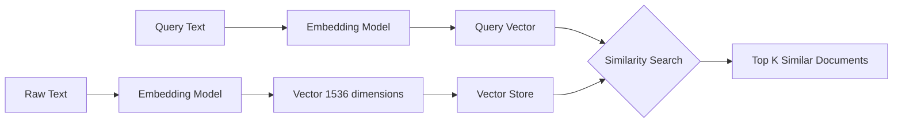
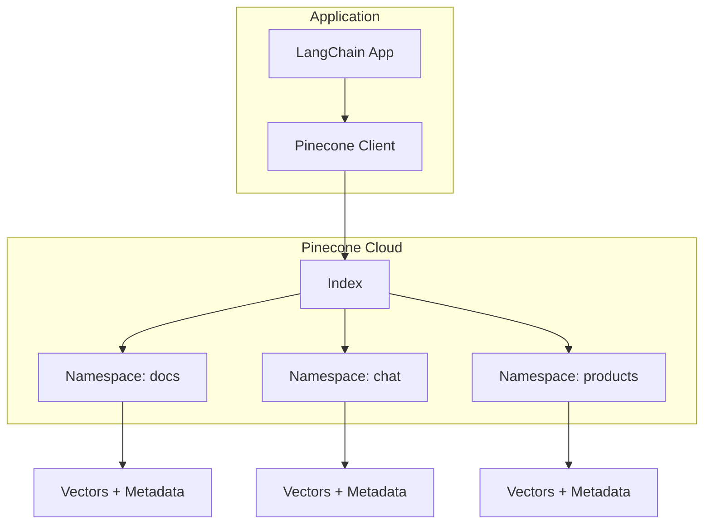
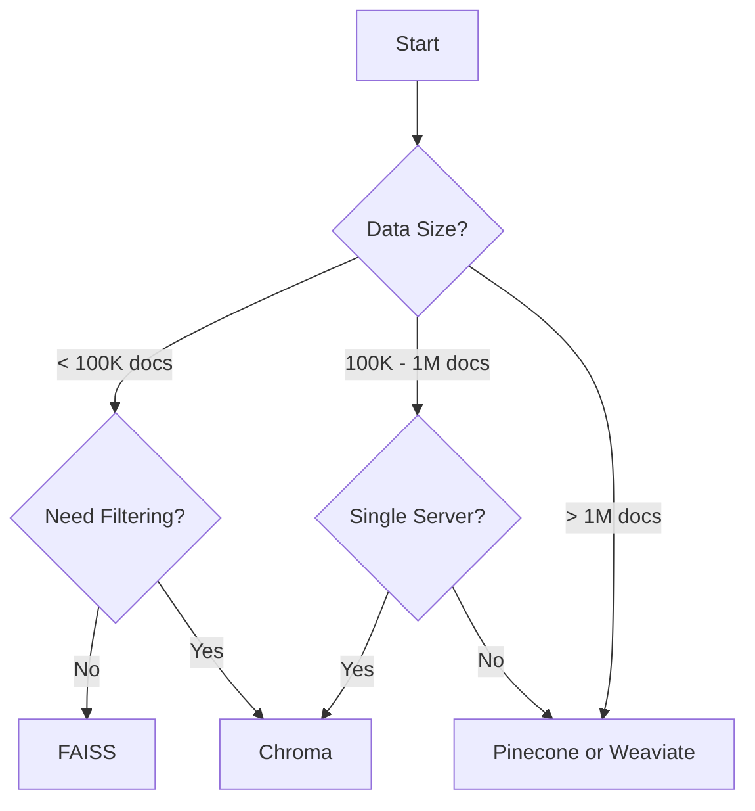

# How to Use LangChain Vector Stores

Author: [nawazdhandala](https://www.github.com/nawazdhandala)

Tags: LangChain, Vector Stores, Embeddings, AI, Machine Learning, RAG, Semantic Search, Python

Description: Learn how to implement vector stores in LangChain for building powerful semantic search and retrieval-augmented generation (RAG) applications. Covers FAISS, Chroma, Pinecone integration, and production optimization strategies.

---

> Vector stores are the backbone of modern AI applications that need to understand meaning, not just keywords. From chatbots that actually understand your questions to document search that finds relevant content even when exact words don't match, vector stores make it all possible. LangChain provides a unified interface to work with dozens of vector databases.

Building intelligent search and retrieval systems requires moving beyond traditional keyword matching. Vector stores enable semantic search by converting text into mathematical representations that capture meaning.

---

## Understanding Vector Stores

Vector stores are specialized databases designed to store and query high-dimensional vectors (embeddings). When you convert text to embeddings using models like OpenAI's text-embedding-ada-002 or open-source alternatives, you get numerical representations that capture semantic meaning.



### Why Vector Stores Matter

Traditional databases excel at exact matches and range queries. Vector stores solve a different problem: finding semantically similar content. When a user asks "How do I fix a broken pipe?", a vector store can return documents about plumbing repairs even if they never mention the word "broken."

### Key Concepts

- **Embeddings**: Dense numerical vectors representing text meaning
- **Similarity Search**: Finding vectors closest to a query vector
- **Distance Metrics**: Cosine similarity, Euclidean distance, dot product
- **Indexing**: Algorithms like HNSW, IVF that speed up searches

---

## Setting Up Your Environment

Before diving into code, install the required packages for working with LangChain vector stores.

```bash
# Core LangChain packages
pip install langchain langchain-community langchain-openai

# Vector store backends (install what you need)
pip install faiss-cpu          # Local development (CPU)
pip install chromadb           # Embedded vector store
pip install pinecone-client    # Cloud vector store

# Additional utilities
pip install tiktoken           # Token counting for OpenAI
pip install python-dotenv      # Environment variable management
```

---

## Creating Embeddings

Embeddings convert text into vectors. LangChain supports multiple embedding providers. OpenAI's model produces 1536-dimensional vectors that work well for most use cases, while open-source alternatives offer cost savings and privacy benefits.

```python
# embeddings_setup.py
# Configure embedding models for converting text to vectors
import os
from dotenv import load_dotenv
from langchain_openai import OpenAIEmbeddings
from langchain_community.embeddings import HuggingFaceEmbeddings

# Load API keys from .env file
load_dotenv()

# OpenAI embeddings - high quality, requires API key
# Cost: ~$0.0001 per 1K tokens
openai_embeddings = OpenAIEmbeddings(
    model="text-embedding-ada-002",
    openai_api_key=os.getenv("OPENAI_API_KEY")
)

# HuggingFace embeddings - free, runs locally
# Good for privacy-sensitive applications or cost optimization
local_embeddings = HuggingFaceEmbeddings(
    model_name="all-MiniLM-L6-v2",  # 384 dimensions, fast
    model_kwargs={"device": "cpu"},  # Use "cuda" for GPU
    encode_kwargs={"normalize_embeddings": True}
)

# Test embedding generation
test_text = "LangChain makes building AI applications easier"
vector = openai_embeddings.embed_query(test_text)
print(f"Vector dimensions: {len(vector)}")  # Output: 1536
```

---

## FAISS Vector Store

FAISS (Facebook AI Similarity Search) is perfect for local development and applications with moderate data sizes. It runs entirely in memory and requires no external services.

### Basic FAISS Implementation

The following example demonstrates creating a FAISS vector store from text documents, performing similarity searches, and persisting the index to disk for reuse.

```python
# faiss_basic.py
# Local vector store using FAISS for development and small datasets
from langchain_community.vectorstores import FAISS
from langchain_openai import OpenAIEmbeddings
from langchain.schema import Document

# Initialize embedding model
embeddings = OpenAIEmbeddings()

# Sample documents - in production, load from files or database
documents = [
    Document(
        page_content="Python is a versatile programming language used for web development, data science, and AI.",
        metadata={"source": "python_guide.md", "category": "programming"}
    ),
    Document(
        page_content="Machine learning models learn patterns from data to make predictions on new inputs.",
        metadata={"source": "ml_intro.md", "category": "ai"}
    ),
    Document(
        page_content="Docker containers package applications with their dependencies for consistent deployment.",
        metadata={"source": "docker_guide.md", "category": "devops"}
    ),
    Document(
        page_content="Vector databases store embeddings for semantic search and similarity matching.",
        metadata={"source": "vector_db.md", "category": "database"}
    ),
    Document(
        page_content="Kubernetes orchestrates containerized applications across multiple servers.",
        metadata={"source": "k8s_guide.md", "category": "devops"}
    ),
]

# Create FAISS index from documents
# Documents are automatically embedded and indexed
vectorstore = FAISS.from_documents(
    documents=documents,
    embedding=embeddings
)

# Perform similarity search - finds semantically similar content
query = "How do I deploy applications?"
results = vectorstore.similarity_search(query, k=3)

print("Top 3 similar documents:")
for i, doc in enumerate(results, 1):
    print(f"\n{i}. Source: {doc.metadata['source']}")
    print(f"   Category: {doc.metadata['category']}")
    print(f"   Content: {doc.page_content[:100]}...")
```

### Saving and Loading FAISS Indexes

Persisting the FAISS index to disk avoids re-embedding documents on every application restart. The index directory contains both the vector data and the document metadata.

```python
# faiss_persistence.py
# Save and load FAISS indexes for efficient reuse
import os

# Save the index to disk
index_path = "./faiss_index"
vectorstore.save_local(index_path)
print(f"Index saved to {index_path}")

# Load existing index - much faster than re-embedding
loaded_vectorstore = FAISS.load_local(
    index_path,
    embeddings,
    allow_dangerous_deserialization=True  # Required for loading pickled data
)

# Verify loaded index works
results = loaded_vectorstore.similarity_search("container orchestration", k=2)
print(f"Found {len(results)} results from loaded index")
```

### Adding Documents to Existing Index

Growing your knowledge base incrementally is straightforward. New documents are embedded and merged into the existing index without rebuilding everything.

```python
# faiss_incremental.py
# Add new documents to an existing FAISS index
new_documents = [
    Document(
        page_content="Redis is an in-memory data store used for caching and message queuing.",
        metadata={"source": "redis_guide.md", "category": "database"}
    ),
    Document(
        page_content="GraphQL provides a flexible query language for APIs with strong typing.",
        metadata={"source": "graphql_intro.md", "category": "api"}
    ),
]

# Add to existing vectorstore
vectorstore.add_documents(new_documents)
print(f"Added {len(new_documents)} documents to index")

# Save updated index
vectorstore.save_local(index_path)
```

---

## Chroma Vector Store

Chroma offers a middle ground between FAISS and cloud solutions. It provides persistence, filtering capabilities, and a cleaner API while still running locally.

### Setting Up Chroma

Chroma can run as an embedded database or as a client-server architecture. The embedded mode is ideal for single-application deployments.

```python
# chroma_setup.py
# Chroma vector store with metadata filtering and persistence
from langchain_community.vectorstores import Chroma
from langchain_openai import OpenAIEmbeddings
from langchain.schema import Document
import chromadb

# Initialize embeddings
embeddings = OpenAIEmbeddings()

# Create persistent Chroma client
# Data persists to disk in the specified directory
persist_directory = "./chroma_db"

# Create or load collection
vectorstore = Chroma(
    collection_name="documentation",
    embedding_function=embeddings,
    persist_directory=persist_directory
)

# Add documents with rich metadata
documents = [
    Document(
        page_content="FastAPI is a modern Python web framework for building APIs with automatic documentation.",
        metadata={
            "source": "fastapi_guide.md",
            "category": "web",
            "language": "python",
            "difficulty": "intermediate"
        }
    ),
    Document(
        page_content="Express.js is a minimal Node.js web framework for building web applications and APIs.",
        metadata={
            "source": "express_guide.md",
            "category": "web",
            "language": "javascript",
            "difficulty": "beginner"
        }
    ),
    Document(
        page_content="Django provides batteries-included web development with ORM, admin, and authentication.",
        metadata={
            "source": "django_guide.md",
            "category": "web",
            "language": "python",
            "difficulty": "intermediate"
        }
    ),
]

# Add documents to collection
vectorstore.add_documents(documents)
print(f"Added {len(documents)} documents to Chroma")
```

### Metadata Filtering

Chroma supports filtering results by metadata, combining semantic search with traditional filtering for precise retrieval.

```python
# chroma_filtering.py
# Combine semantic search with metadata filters
# Find Python web frameworks
results = vectorstore.similarity_search(
    query="web framework for APIs",
    k=5,
    filter={"language": "python"}  # Only return Python documents
)

print("Python web frameworks:")
for doc in results:
    print(f"  - {doc.metadata['source']}: {doc.page_content[:60]}...")

# Complex filtering with multiple conditions
# Chroma uses a dictionary-based filter syntax
results_filtered = vectorstore.similarity_search(
    query="building web applications",
    k=3,
    filter={
        "$and": [
            {"category": "web"},
            {"difficulty": {"$in": ["beginner", "intermediate"]}}
        ]
    }
)

print("\nBeginner/Intermediate web docs:")
for doc in results_filtered:
    print(f"  - {doc.metadata['source']} ({doc.metadata['difficulty']})")
```

---

## Pinecone for Production

Pinecone is a managed vector database service designed for production workloads. It handles scaling, replication, and infrastructure management.



### Pinecone Setup and Indexing

Setting up Pinecone requires creating an account and obtaining API credentials. Namespaces allow logical separation of data within a single index.

```python
# pinecone_setup.py
# Production vector store using Pinecone managed service
import os
from pinecone import Pinecone, ServerlessSpec
from langchain_pinecone import PineconeVectorStore
from langchain_openai import OpenAIEmbeddings
from langchain.schema import Document

# Initialize Pinecone client
pc = Pinecone(api_key=os.getenv("PINECONE_API_KEY"))

# Index configuration
index_name = "langchain-docs"
dimension = 1536  # OpenAI embedding dimension

# Create index if it does not exist
if index_name not in pc.list_indexes().names():
    pc.create_index(
        name=index_name,
        dimension=dimension,
        metric="cosine",  # Similarity metric
        spec=ServerlessSpec(
            cloud="aws",
            region="us-east-1"
        )
    )
    print(f"Created index: {index_name}")

# Get index reference
index = pc.Index(index_name)

# Initialize embeddings
embeddings = OpenAIEmbeddings()

# Create LangChain vector store wrapper
vectorstore = PineconeVectorStore(
    index=index,
    embedding=embeddings,
    namespace="documentation"  # Logical grouping within index
)

# Add documents
documents = [
    Document(
        page_content="Microservices architecture splits applications into small, independent services.",
        metadata={"topic": "architecture", "level": "advanced"}
    ),
    Document(
        page_content="Monolithic applications bundle all functionality into a single deployable unit.",
        metadata={"topic": "architecture", "level": "beginner"}
    ),
]

vectorstore.add_documents(documents)
print(f"Indexed {len(documents)} documents to Pinecone")
```

### Querying Pinecone

Pinecone provides fast similarity search with optional metadata filtering. Results include similarity scores for ranking.

```python
# pinecone_query.py
# Query Pinecone with similarity scores and filters
# Basic similarity search
results = vectorstore.similarity_search(
    query="How should I structure my application?",
    k=3
)

for doc in results:
    print(f"Topic: {doc.metadata['topic']}")
    print(f"Content: {doc.page_content}\n")

# Search with scores - useful for setting relevance thresholds
results_with_scores = vectorstore.similarity_search_with_score(
    query="application architecture patterns",
    k=5
)

print("Results with similarity scores:")
for doc, score in results_with_scores:
    # Cosine similarity: 1.0 = identical, 0.0 = orthogonal
    print(f"  Score: {score:.4f} - {doc.page_content[:50]}...")

# Filter by metadata
filtered_results = vectorstore.similarity_search(
    query="application design",
    k=3,
    filter={"level": "beginner"}
)

print("\nBeginner-level results:")
for doc in filtered_results:
    print(f"  - {doc.page_content[:60]}...")
```

---

## Building a RAG Pipeline

Retrieval-Augmented Generation (RAG) combines vector search with language models. Documents are retrieved based on the query, then passed to an LLM for generating contextual responses.


### Complete RAG Implementation

The following implementation creates a question-answering system that retrieves relevant documents and generates answers with citations.

```python
# rag_pipeline.py
# Complete RAG implementation with LangChain
from langchain_openai import ChatOpenAI, OpenAIEmbeddings
from langchain_community.vectorstores import FAISS
from langchain.chains import RetrievalQA
from langchain.prompts import PromptTemplate
from langchain.schema import Document

# Initialize components
embeddings = OpenAIEmbeddings()
llm = ChatOpenAI(model="gpt-4", temperature=0)

# Create vector store with sample knowledge base
documents = [
    Document(
        page_content="""
        OneUptime is an open-source observability platform that provides monitoring,
        incident management, and status pages. It supports custom metrics, distributed
        tracing, and log management for modern applications.
        """,
        metadata={"source": "oneuptime_overview.md"}
    ),
    Document(
        page_content="""
        Setting up alerts in OneUptime: Navigate to Monitors, create a new monitor,
        configure check intervals, and set alert conditions. Notifications can be
        sent via email, Slack, PagerDuty, or webhooks.
        """,
        metadata={"source": "oneuptime_alerts.md"}
    ),
    Document(
        page_content="""
        OneUptime status pages provide real-time service status to customers.
        Customize branding, add components, and configure automatic incident
        updates. Subscribers receive notifications for status changes.
        """,
        metadata={"source": "oneuptime_status.md"}
    ),
]

vectorstore = FAISS.from_documents(documents, embeddings)

# Custom prompt template for better responses
prompt_template = """Use the following context to answer the question.
If you cannot find the answer in the context, say "I don't have information about that."

Context:
{context}

Question: {question}

Answer: """

PROMPT = PromptTemplate(
    template=prompt_template,
    input_variables=["context", "question"]
)

# Create retrieval chain
qa_chain = RetrievalQA.from_chain_type(
    llm=llm,
    chain_type="stuff",  # Concatenate all retrieved docs
    retriever=vectorstore.as_retriever(
        search_type="similarity",
        search_kwargs={"k": 3}  # Retrieve top 3 documents
    ),
    chain_type_kwargs={"prompt": PROMPT},
    return_source_documents=True  # Include sources in response
)

# Query the system
question = "How do I set up monitoring alerts?"
result = qa_chain.invoke({"query": question})

print(f"Question: {question}")
print(f"\nAnswer: {result['result']}")
print("\nSources:")
for doc in result['source_documents']:
    print(f"  - {doc.metadata['source']}")
```

---

## Advanced Retrieval Strategies

Simple similarity search works well for many cases, but advanced strategies improve retrieval quality for complex queries.

### Maximum Marginal Relevance (MMR)

MMR balances relevance with diversity, preventing redundant results when multiple documents cover similar content.

```python
# mmr_retrieval.py
# Maximum Marginal Relevance for diverse results
from langchain_community.vectorstores import FAISS

# Create retriever with MMR
retriever = vectorstore.as_retriever(
    search_type="mmr",
    search_kwargs={
        "k": 5,                    # Final number of results
        "fetch_k": 20,             # Candidates to consider
        "lambda_mult": 0.7         # 0=max diversity, 1=max relevance
    }
)

# MMR retrieval
docs = retriever.invoke("application monitoring best practices")

print("MMR Results (diverse):")
for i, doc in enumerate(docs, 1):
    print(f"{i}. {doc.page_content[:80]}...")
```

### Hybrid Search with BM25

Combining vector search with keyword matching (BM25) captures both semantic similarity and exact keyword matches.

```python
# hybrid_search.py
# Combine vector search with BM25 keyword matching
from langchain.retrievers import EnsembleRetriever
from langchain_community.retrievers import BM25Retriever
from langchain_community.vectorstores import FAISS

# Prepare documents for both retrievers
texts = [doc.page_content for doc in documents]

# BM25 retriever - keyword based
bm25_retriever = BM25Retriever.from_texts(texts)
bm25_retriever.k = 3

# Vector retriever - semantic based
vector_retriever = vectorstore.as_retriever(search_kwargs={"k": 3})

# Ensemble combines both approaches
# Weights determine influence of each retriever
ensemble_retriever = EnsembleRetriever(
    retrievers=[bm25_retriever, vector_retriever],
    weights=[0.4, 0.6]  # 40% keyword, 60% semantic
)

# Hybrid search
results = ensemble_retriever.invoke("configure monitoring alerts")

print("Hybrid Search Results:")
for doc in results:
    print(f"  - {doc.page_content[:60]}...")
```

### Self-Query Retriever

Self-query retrieval uses an LLM to extract filters from natural language queries, enabling complex queries without manual filter construction.

```python
# self_query.py
# Let the LLM extract filters from natural language queries
from langchain.chains.query_constructor.base import AttributeInfo
from langchain.retrievers.self_query.base import SelfQueryRetriever
from langchain_openai import ChatOpenAI

# Define metadata schema for the LLM
metadata_field_info = [
    AttributeInfo(
        name="category",
        description="The category of the document: web, database, devops, or ai",
        type="string"
    ),
    AttributeInfo(
        name="difficulty",
        description="The difficulty level: beginner, intermediate, or advanced",
        type="string"
    ),
    AttributeInfo(
        name="language",
        description="Programming language: python, javascript, go, or rust",
        type="string"
    ),
]

# Create self-query retriever
llm = ChatOpenAI(temperature=0)

self_query_retriever = SelfQueryRetriever.from_llm(
    llm=llm,
    vectorstore=vectorstore,
    document_contents="Technical documentation about programming and DevOps",
    metadata_field_info=metadata_field_info,
    verbose=True  # Show generated filters
)

# Natural language query with implicit filters
# LLM extracts: semantic query + filter by language=python
query = "Show me beginner Python web frameworks"
results = self_query_retriever.invoke(query)

print(f"Query: {query}")
print("Results:")
for doc in results:
    print(f"  - {doc.metadata.get('source', 'unknown')}")
```

---

## Optimizing Performance

Production deployments require careful attention to performance. Batching, caching, and proper index configuration make a significant difference.

### Batch Processing

Processing documents in batches reduces API calls and improves throughput when indexing large datasets.

```python
# batch_processing.py
# Efficient batch processing for large document sets
from langchain_community.vectorstores import FAISS
from langchain_openai import OpenAIEmbeddings
from langchain.schema import Document
from typing import List
import time

def batch_index_documents(
    documents: List[Document],
    embeddings,
    batch_size: int = 100
) -> FAISS:
    """Index documents in batches for better performance and rate limit handling"""

    vectorstore = None
    total_docs = len(documents)

    for i in range(0, total_docs, batch_size):
        batch = documents[i:i + batch_size]
        batch_num = i // batch_size + 1
        total_batches = (total_docs + batch_size - 1) // batch_size

        print(f"Processing batch {batch_num}/{total_batches} ({len(batch)} documents)")

        if vectorstore is None:
            # Create new vectorstore with first batch
            vectorstore = FAISS.from_documents(batch, embeddings)
        else:
            # Add subsequent batches to existing store
            vectorstore.add_documents(batch)

        # Rate limiting - adjust based on API limits
        if i + batch_size < total_docs:
            time.sleep(1)

    return vectorstore

# Usage
embeddings = OpenAIEmbeddings()
# Assume large_documents is a list of many Document objects
vectorstore = batch_index_documents(large_documents, embeddings, batch_size=50)
```

### Caching Embeddings

Caching prevents redundant embedding calls for repeated queries or documents.

```python
# embedding_cache.py
# Cache embeddings to reduce API costs and latency
from langchain.embeddings import CacheBackedEmbeddings
from langchain.storage import LocalFileStore
from langchain_openai import OpenAIEmbeddings

# Underlying embedding model
underlying_embeddings = OpenAIEmbeddings()

# File-based cache for persistence across restarts
store = LocalFileStore("./embedding_cache/")

# Cached embeddings wrapper
cached_embeddings = CacheBackedEmbeddings.from_bytes_store(
    underlying_embeddings=underlying_embeddings,
    document_embedding_cache=store,
    namespace=underlying_embeddings.model  # Separate cache per model
)

# First call - computes and caches embedding
text = "What is vector search?"
vector1 = cached_embeddings.embed_query(text)
print("First call: computed embedding")

# Second call - returns cached result (fast, no API call)
vector2 = cached_embeddings.embed_query(text)
print("Second call: returned cached embedding")

# Use with vector store
vectorstore = FAISS.from_documents(documents, cached_embeddings)
```

### Index Configuration Best Practices

Choosing the right index parameters affects search speed and accuracy.

```python
# index_optimization.py
# FAISS index configuration for different use cases
import faiss
from langchain_community.vectorstores import FAISS

# Small dataset (< 10K vectors): Use flat index (exact search)
# Accurate but slow for large datasets
small_vectorstore = FAISS.from_documents(documents, embeddings)

# Medium dataset (10K - 1M vectors): Use IVF index
# Approximate search, much faster
def create_ivf_index(documents, embeddings, nlist=100):
    """Create FAISS with IVF index for faster approximate search"""
    # First create flat index
    vectorstore = FAISS.from_documents(documents, embeddings)

    # Get dimension from embeddings
    d = len(embeddings.embed_query("test"))

    # Create IVF index
    quantizer = faiss.IndexFlatL2(d)
    ivf_index = faiss.IndexIVFFlat(quantizer, d, nlist)

    # Train on existing vectors
    vectors = vectorstore.index.reconstruct_n(0, vectorstore.index.ntotal)
    ivf_index.train(vectors)
    ivf_index.add(vectors)

    # Replace index
    vectorstore.index = ivf_index
    return vectorstore

# Large dataset (> 1M vectors): Use HNSW index
# Hierarchical Navigable Small World graph
def create_hnsw_index(documents, embeddings, m=32, ef_construction=200):
    """Create FAISS with HNSW index for large-scale similarity search"""
    d = len(embeddings.embed_query("test"))

    # HNSW provides excellent recall with fast search
    index = faiss.IndexHNSWFlat(d, m)
    index.hnsw.efConstruction = ef_construction

    # Create vectorstore with custom index
    vectorstore = FAISS.from_documents(documents, embeddings)

    # Rebuild with HNSW
    vectors = vectorstore.index.reconstruct_n(0, vectorstore.index.ntotal)
    index.add(vectors)
    vectorstore.index = index

    return vectorstore
```

---

## Error Handling and Monitoring

Production systems need robust error handling and observability.

```python
# production_wrapper.py
# Production-ready vector store wrapper with error handling and monitoring
import logging
import time
from typing import List, Optional, Tuple
from langchain.schema import Document

logger = logging.getLogger(__name__)

class RobustVectorStore:
    """Wrapper providing retry logic, error handling, and monitoring"""

    def __init__(self, vectorstore, max_retries: int = 3):
        self.vectorstore = vectorstore
        self.max_retries = max_retries
        self.query_count = 0
        self.error_count = 0

    def similarity_search(
        self,
        query: str,
        k: int = 4,
        filter: Optional[dict] = None
    ) -> List[Document]:
        """Search with retry logic and error handling"""

        for attempt in range(self.max_retries):
            try:
                start_time = time.time()

                results = self.vectorstore.similarity_search(
                    query=query,
                    k=k,
                    filter=filter
                )

                # Log query metrics
                duration = time.time() - start_time
                self.query_count += 1
                logger.info(
                    f"Vector search completed",
                    extra={
                        "query_length": len(query),
                        "results_count": len(results),
                        "duration_ms": duration * 1000,
                        "attempt": attempt + 1
                    }
                )

                return results

            except Exception as e:
                self.error_count += 1
                logger.warning(
                    f"Vector search failed (attempt {attempt + 1}/{self.max_retries}): {e}"
                )

                if attempt == self.max_retries - 1:
                    logger.error(f"Vector search exhausted retries: {e}")
                    raise

                # Exponential backoff
                time.sleep(2 ** attempt)

        return []

    def add_documents_safe(
        self,
        documents: List[Document],
        batch_size: int = 50
    ) -> Tuple[int, int]:
        """Add documents with error handling, returns (success_count, error_count)"""

        success_count = 0
        error_count = 0

        for i in range(0, len(documents), batch_size):
            batch = documents[i:i + batch_size]

            try:
                self.vectorstore.add_documents(batch)
                success_count += len(batch)
                logger.info(f"Indexed batch of {len(batch)} documents")

            except Exception as e:
                error_count += len(batch)
                logger.error(f"Failed to index batch: {e}")
                # Continue with next batch instead of failing completely

        return success_count, error_count

    def get_stats(self) -> dict:
        """Return operational statistics"""
        return {
            "total_queries": self.query_count,
            "total_errors": self.error_count,
            "error_rate": self.error_count / max(self.query_count, 1)
        }
```

---

## Choosing the Right Vector Store

Different vector stores suit different requirements. Here is a comparison to guide your selection.

| Feature | FAISS | Chroma | Pinecone |
|---------|-------|--------|----------|
| Deployment | Local | Local/Server | Cloud |
| Setup Complexity | Low | Low | Medium |
| Scalability | Limited | Moderate | High |
| Persistence | Manual | Automatic | Automatic |
| Filtering | Basic | Good | Excellent |
| Cost | Free | Free | Pay-per-use |
| Best For | Prototypes, small apps | Single-server apps | Production at scale |

### Decision Guide



---

## Conclusion

Vector stores unlock semantic search capabilities that transform how applications understand and retrieve information. LangChain provides a unified interface making it straightforward to:

- Start with FAISS for local development
- Move to Chroma for single-server production
- Scale with Pinecone for enterprise workloads

Key takeaways for production deployments:

- **Choose embeddings wisely** - OpenAI for quality, local models for cost/privacy
- **Implement caching** - reduces costs and improves latency
- **Use appropriate retrieval strategies** - MMR for diversity, hybrid for precision
- **Monitor and handle errors** - production systems need observability

Vector stores are foundational for RAG applications, semantic search, recommendation systems, and any AI application that needs to understand meaning rather than just match keywords.

---

*Building AI applications that need reliable monitoring? [OneUptime](https://oneuptime.com) provides comprehensive observability for your LangChain pipelines, including latency tracking, error monitoring, and custom metrics for vector store operations.*

**Related Reading:**
- [How to Instrument Python Applications with OpenTelemetry](https://oneuptime.com/blog/post/2025-01-06-instrument-python-opentelemetry/view)
