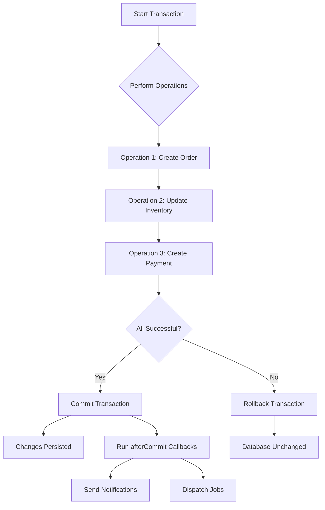

# How to Handle Transactions in Laravel

Author: [nawazdhandala](https://www.github.com/nawazdhandala)

Tags: PHP, Laravel, Database, Transactions, Eloquent

Description: Learn how to use database transactions in Laravel to ensure data integrity, handle failures gracefully, and build reliable applications.

---

Database transactions are one of those features that separate hobby projects from production-ready applications. When you need to perform multiple database operations that must either all succeed or all fail together, transactions are your best friend. Laravel makes working with transactions surprisingly straightforward.

## What Are Database Transactions?

A database transaction groups multiple operations into a single unit of work. If any operation within the transaction fails, all changes are rolled back, leaving your database in its original state. This is crucial when dealing with operations like:

- Transferring money between accounts
- Creating an order with multiple line items
- Registering a user and creating related records
- Updating inventory across multiple tables

The classic example is a bank transfer. You need to debit one account and credit another. If the debit succeeds but the credit fails, you have a serious problem. Transactions prevent this.

## Basic Transaction Usage

Laravel provides several ways to handle transactions. The simplest approach uses the `DB::transaction()` method with a closure.

Here we wrap our database operations in a transaction closure. If any exception is thrown inside the closure, Laravel automatically rolls back all changes.

```php
<?php

use Illuminate\Support\Facades\DB;
use App\Models\Account;

// Transfer money between two accounts
// If anything fails, both accounts remain unchanged
DB::transaction(function () {
    $sourceAccount = Account::where('id', 1)->lockForUpdate()->first();
    $destinationAccount = Account::where('id', 2)->lockForUpdate()->first();

    // Debit source account
    $sourceAccount->balance -= 100;
    $sourceAccount->save();

    // Credit destination account
    $destinationAccount->balance += 100;
    $destinationAccount->save();
});
```

Notice the `lockForUpdate()` call. This creates a pessimistic lock on the rows, preventing other processes from modifying them until our transaction completes.

## Manual Transaction Control

Sometimes you need more control over when to commit or rollback. Laravel supports manual transaction management.

Manual control is useful when you need to commit or rollback based on complex business logic, or when working with code that cannot be wrapped in a closure.

```php
<?php

use Illuminate\Support\Facades\DB;
use App\Models\Order;
use App\Models\OrderItem;
use App\Models\Inventory;

// Start the transaction manually
DB::beginTransaction();

try {
    // Create the order
    $order = Order::create([
        'user_id' => auth()->id(),
        'status' => 'pending',
        'total' => 0,
    ]);

    $total = 0;

    foreach ($cartItems as $item) {
        // Check inventory availability
        $inventory = Inventory::where('product_id', $item['product_id'])
            ->lockForUpdate()
            ->first();

        if ($inventory->quantity < $item['quantity']) {
            // Not enough stock - rollback everything
            DB::rollBack();
            throw new \Exception("Insufficient inventory for product {$item['product_id']}");
        }

        // Reduce inventory
        $inventory->quantity -= $item['quantity'];
        $inventory->save();

        // Create order item
        OrderItem::create([
            'order_id' => $order->id,
            'product_id' => $item['product_id'],
            'quantity' => $item['quantity'],
            'price' => $item['price'],
        ]);

        $total += $item['quantity'] * $item['price'];
    }

    // Update order total
    $order->total = $total;
    $order->save();

    // Everything succeeded - commit the transaction
    DB::commit();

} catch (\Exception $e) {
    // Something went wrong - rollback all changes
    DB::rollBack();
    throw $e;
}
```

## Handling Deadlocks with Retry Logic

In high-concurrency environments, deadlocks can occur when multiple transactions compete for the same resources. Laravel's transaction method accepts a second parameter specifying how many times to retry.

When a deadlock occurs, Laravel will automatically retry the transaction up to the specified number of times before giving up.

```php
<?php

use Illuminate\Support\Facades\DB;
use App\Models\Product;

// Retry up to 5 times if a deadlock occurs
DB::transaction(function () {
    $product = Product::where('id', 1)->lockForUpdate()->first();

    // Perform operations that might conflict with other transactions
    $product->stock_count -= 1;
    $product->times_purchased += 1;
    $product->save();

}, 5); // Retry 5 times on deadlock
```

## Transaction Isolation Levels

Different isolation levels provide different guarantees about what data a transaction can see. Laravel supports setting the isolation level on a per-connection basis.

You can configure isolation levels in your database configuration. Choose based on your consistency vs. performance needs.

```php
<?php

// config/database.php

'mysql' => [
    'driver' => 'mysql',
    'host' => env('DB_HOST', '127.0.0.1'),
    'port' => env('DB_PORT', '3306'),
    'database' => env('DB_DATABASE', 'forge'),
    'username' => env('DB_USERNAME', 'forge'),
    'password' => env('DB_PASSWORD', ''),
    // Set isolation level - options:
    // 'read uncommitted', 'read committed', 'repeatable read', 'serializable'
    'isolation_level' => 'repeatable read',
    // ... other config
],
```

Here is a comparison of the isolation levels:

| Isolation Level | Dirty Reads | Non-Repeatable Reads | Phantom Reads | Performance |
|-----------------|-------------|----------------------|---------------|-------------|
| Read Uncommitted | Possible | Possible | Possible | Fastest |
| Read Committed | Prevented | Possible | Possible | Fast |
| Repeatable Read | Prevented | Prevented | Possible | Moderate |
| Serializable | Prevented | Prevented | Prevented | Slowest |

## Nested Transactions with Savepoints

Laravel supports nested transactions using savepoints. This is useful when you have service methods that each use transactions, but are called from within another transaction.

Savepoints allow partial rollback within a larger transaction. Each nested transaction creates a savepoint that can be rolled back independently.

```php
<?php

use Illuminate\Support\Facades\DB;
use App\Models\User;
use App\Models\Profile;
use App\Models\Subscription;

class UserService
{
    public function createUserWithProfile(array $userData, array $profileData)
    {
        // This starts a transaction (or savepoint if already in one)
        return DB::transaction(function () use ($userData, $profileData) {
            $user = User::create($userData);

            Profile::create([
                'user_id' => $user->id,
                ...$profileData
            ]);

            return $user;
        });
    }
}

class SubscriptionService
{
    public function createSubscription(User $user, string $plan)
    {
        // This also uses a transaction (or savepoint)
        return DB::transaction(function () use ($user, $plan) {
            return Subscription::create([
                'user_id' => $user->id,
                'plan' => $plan,
                'starts_at' => now(),
                'ends_at' => now()->addMonth(),
            ]);
        });
    }
}

class RegistrationService
{
    public function __construct(
        private UserService $userService,
        private SubscriptionService $subscriptionService
    ) {}

    public function register(array $data)
    {
        // Outer transaction wraps both service calls
        return DB::transaction(function () use ($data) {
            // Creates a savepoint
            $user = $this->userService->createUserWithProfile(
                ['name' => $data['name'], 'email' => $data['email']],
                ['bio' => $data['bio'] ?? '']
            );

            // Creates another savepoint
            $this->subscriptionService->createSubscription($user, 'trial');

            return $user;
        });
    }
}
```

## Working with Multiple Database Connections

When your application uses multiple databases, you might need transactions across them. Be aware that Laravel cannot provide true distributed transactions, so you need to handle this carefully.

When working with multiple connections, wrap each in its own transaction and handle failures appropriately.

```php
<?php

use Illuminate\Support\Facades\DB;
use App\Models\User;
use App\Models\AnalyticsEvent;

// Handle transactions on multiple connections
// Note: This is NOT an atomic distributed transaction
DB::connection('mysql')->beginTransaction();
DB::connection('analytics')->beginTransaction();

try {
    // Operation on main database
    $user = User::create([
        'name' => 'John Doe',
        'email' => 'john@example.com',
    ]);

    // Operation on analytics database
    AnalyticsEvent::on('analytics')->create([
        'event_type' => 'user_registered',
        'user_id' => $user->id,
        'metadata' => json_encode(['source' => 'web']),
    ]);

    // Commit both - if analytics fails after mysql commits,
    // you will have inconsistent data
    DB::connection('mysql')->commit();
    DB::connection('analytics')->commit();

} catch (\Exception $e) {
    DB::connection('mysql')->rollBack();
    DB::connection('analytics')->rollBack();
    throw $e;
}
```

For true distributed transactions across databases, consider using message queues with eventual consistency patterns instead.

## Transaction Events and Callbacks

Laravel allows you to hook into transaction lifecycle events. This is useful for operations that should only happen after a successful commit.

Use `afterCommit()` for actions that depend on the transaction being committed, like sending notifications or dispatching jobs.

```php
<?php

use Illuminate\Support\Facades\DB;
use App\Models\Order;
use App\Notifications\OrderConfirmation;
use App\Jobs\ProcessOrder;

DB::transaction(function () {
    $order = Order::create([
        'user_id' => auth()->id(),
        'status' => 'confirmed',
        'total' => 99.99,
    ]);

    // This callback only runs after the transaction commits successfully
    // If the transaction rolls back, this notification is never sent
    DB::afterCommit(function () use ($order) {
        // Send confirmation email
        $order->user->notify(new OrderConfirmation($order));

        // Dispatch processing job
        ProcessOrder::dispatch($order);
    });

    // More operations that might fail...
    $order->items()->createMany($items);
});
```

You can also configure queued jobs to dispatch after commit by default.

```php
<?php

namespace App\Jobs;

use Illuminate\Bus\Queueable;
use Illuminate\Contracts\Queue\ShouldQueue;

class ProcessOrder implements ShouldQueue
{
    use Queueable;

    // Job will only be dispatched after the transaction commits
    public $afterCommit = true;

    public function __construct(public Order $order)
    {
    }

    public function handle()
    {
        // Process the order
    }
}
```

## Transaction Flow Diagram

This diagram shows how a typical transaction flows through your application:



## Testing Transactions

When testing code that uses transactions, Laravel provides helpful utilities to ensure your tests work correctly.

Use `RefreshDatabase` or `DatabaseTransactions` traits in your tests. The framework handles rolling back test data automatically.

```php
<?php

namespace Tests\Feature;

use Tests\TestCase;
use App\Models\User;
use App\Models\Account;
use Illuminate\Foundation\Testing\RefreshDatabase;
use Illuminate\Support\Facades\DB;

class TransferTest extends TestCase
{
    use RefreshDatabase;

    public function test_transfer_updates_both_accounts()
    {
        // Arrange
        $source = Account::factory()->create(['balance' => 500]);
        $destination = Account::factory()->create(['balance' => 100]);

        // Act
        DB::transaction(function () use ($source, $destination) {
            $source->decrement('balance', 200);
            $destination->increment('balance', 200);
        });

        // Assert
        $this->assertEquals(300, $source->fresh()->balance);
        $this->assertEquals(300, $destination->fresh()->balance);
    }

    public function test_transfer_rollback_on_failure()
    {
        $source = Account::factory()->create(['balance' => 500]);
        $destination = Account::factory()->create(['balance' => 100]);

        try {
            DB::transaction(function () use ($source, $destination) {
                $source->decrement('balance', 200);

                // Simulate failure before crediting destination
                throw new \Exception('Payment gateway error');

                $destination->increment('balance', 200);
            });
        } catch (\Exception $e) {
            // Expected exception
        }

        // Both accounts should be unchanged
        $this->assertEquals(500, $source->fresh()->balance);
        $this->assertEquals(100, $destination->fresh()->balance);
    }
}
```

## Best Practices

Here are some guidelines to keep your transactions reliable and performant:

**Keep transactions short.** Long-running transactions hold locks that can cause contention and deadlocks. Do expensive operations like API calls or file processing outside the transaction.

```php
<?php

// Bad - external API call inside transaction
DB::transaction(function () use ($order) {
    $order->save();

    // This HTTP request could take seconds, holding locks
    $paymentResult = Http::post('https://payment.api/charge', [...]);

    $order->payment_id = $paymentResult['id'];
    $order->save();
});

// Good - API call outside transaction
$paymentResult = Http::post('https://payment.api/charge', [...]);

DB::transaction(function () use ($order, $paymentResult) {
    $order->payment_id = $paymentResult['id'];
    $order->status = 'paid';
    $order->save();
});
```

**Use appropriate locking.** Choose between `lockForUpdate()` (pessimistic) for high-contention scenarios and optimistic locking with version columns for read-heavy workloads.

```php
<?php

// Pessimistic locking - prevents other reads until transaction completes
$product = Product::where('id', $id)->lockForUpdate()->first();

// Shared lock - allows other reads but prevents updates
$product = Product::where('id', $id)->sharedLock()->first();
```

**Handle exceptions properly.** Always catch exceptions at an appropriate level and provide meaningful error messages.

```php
<?php

use Illuminate\Database\QueryException;

try {
    DB::transaction(function () {
        // Operations
    });
} catch (QueryException $e) {
    // Database-specific error (constraint violation, deadlock, etc.)
    Log::error('Database transaction failed', [
        'error' => $e->getMessage(),
        'code' => $e->getCode(),
    ]);

    throw new OrderCreationException('Failed to create order. Please try again.');
}
```

## Common Pitfalls

**Forgetting that Eloquent events fire during transactions.** Model observers and events fire immediately, not after commit. If an observer sends an email and the transaction rolls back, you have sent an email for an action that never happened.

```php
<?php

// In your model
class Order extends Model
{
    protected static function booted()
    {
        // This fires immediately during transaction, not after commit
        static::created(function ($order) {
            // Don't send emails here - transaction might rollback
        });
    }
}

// Instead, use afterCommit or dispatch jobs with afterCommit
DB::transaction(function () {
    $order = Order::create([...]);

    DB::afterCommit(function () use ($order) {
        Mail::to($order->user)->send(new OrderCreated($order));
    });
});
```

**Assuming all databases support the same features.** SQLite has limited transaction support compared to MySQL or PostgreSQL. Test with your production database type.

**Not considering read replicas.** If you use read replicas, be aware that after a write, the replica might not immediately have the new data. Force reads from the primary connection when necessary.

```php
<?php

DB::transaction(function () {
    $order = Order::create([...]);

    // Force read from primary connection after write
    $freshOrder = Order::on('mysql')->find($order->id);
});
```

---

*Need to ensure your Laravel applications are running smoothly in production? OneUptime provides comprehensive monitoring for your PHP applications, including database performance tracking, transaction timing, and instant alerts when something goes wrong. Start monitoring your Laravel apps today at [oneuptime.com](https://oneuptime.com).*
