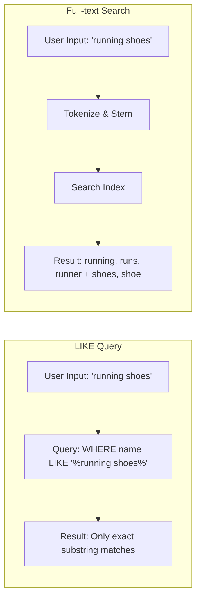
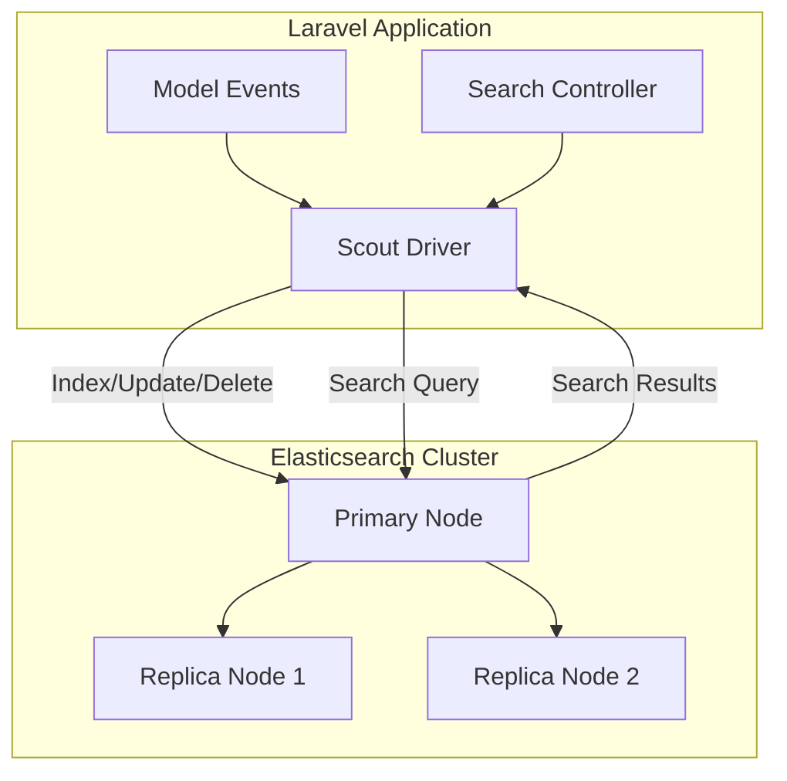

# How to Implement Full-text Search in Laravel

Author: [nawazdhandala](https://www.github.com/nawazdhandala)

Tags: PHP, Laravel, Search, Full-text Search, Scout, Elasticsearch

Description: A practical guide to implementing full-text search in Laravel using Scout, database drivers, and Elasticsearch for scalable search functionality.

---

Full-text search is one of those features that seems simple until you actually build it. Your users expect instant, relevant results when they type in a search box, and a basic `LIKE %query%` just won't cut it for anything beyond toy projects. Laravel gives you several options for implementing proper full-text search, from built-in database features to dedicated search engines.

In this guide, we'll cover three approaches: native MySQL/PostgreSQL full-text search, Laravel Scout with the database driver, and integrating Elasticsearch for production-scale search.

## Understanding Full-text Search vs LIKE Queries

Before diving into implementation, let's understand why `LIKE` queries fall short.



Full-text search provides:
- Word stemming (searching "running" finds "run", "runs", "runner")
- Relevance scoring
- Stop word filtering
- Much better performance on large datasets

## Option 1: Native MySQL Full-text Search

If you're using MySQL 5.6+ or MariaDB, you can use native full-text indexes without any additional packages.

### Setting Up the Migration

First, create a migration to add a full-text index to your table.

```php
<?php

use Illuminate\Database\Migrations\Migration;
use Illuminate\Database\Schema\Blueprint;
use Illuminate\Support\Facades\Schema;
use Illuminate\Support\Facades\DB;

return new class extends Migration
{
    public function up(): void
    {
        Schema::create('articles', function (Blueprint $table) {
            $table->id();
            $table->string('title');
            $table->text('body');
            $table->string('author');
            $table->timestamps();
        });

        // Add full-text index on title and body columns
        // This allows searching across both fields simultaneously
        DB::statement('ALTER TABLE articles ADD FULLTEXT INDEX articles_fulltext (title, body)');
    }

    public function down(): void
    {
        Schema::dropIfExists('articles');
    }
};
```

### Building the Search Query

Now create a method in your model or repository to perform the search.

```php
<?php

namespace App\Models;

use Illuminate\Database\Eloquent\Model;
use Illuminate\Database\Eloquent\Builder;

class Article extends Model
{
    protected $fillable = ['title', 'body', 'author'];

    /**
     * Scope for full-text search using MySQL's MATCH AGAINST syntax.
     *
     * The MATCH() function returns a relevance score, which we use
     * for both filtering (WHERE) and ordering (ORDER BY).
     *
     * IN NATURAL LANGUAGE MODE is the default and works well for
     * most use cases. It ignores stop words and uses word stemming.
     */
    public function scopeSearch(Builder $query, string $term): Builder
    {
        // Escape the search term to prevent SQL injection
        $searchTerm = addslashes($term);

        return $query
            ->whereRaw(
                "MATCH(title, body) AGAINST(? IN NATURAL LANGUAGE MODE)",
                [$searchTerm]
            )
            ->orderByRaw(
                "MATCH(title, body) AGAINST(? IN NATURAL LANGUAGE MODE) DESC",
                [$searchTerm]
            );
    }

    /**
     * Boolean mode search allows operators like + (must include),
     * - (must exclude), * (wildcard), and "quotes" (exact phrase).
     *
     * Example searches:
     * - "+laravel +search" - must contain both words
     * - "laravel -beginner" - contains laravel, excludes beginner
     * - "laravel*" - matches laravel, laraveler, etc.
     */
    public function scopeSearchBoolean(Builder $query, string $term): Builder
    {
        $searchTerm = addslashes($term);

        return $query
            ->whereRaw(
                "MATCH(title, body) AGAINST(? IN BOOLEAN MODE)",
                [$searchTerm]
            )
            ->orderByRaw(
                "MATCH(title, body) AGAINST(? IN BOOLEAN MODE) DESC",
                [$searchTerm]
            );
    }
}
```

### Using the Search in a Controller

Here's how to use the search scope in your controller.

```php
<?php

namespace App\Http\Controllers;

use App\Models\Article;
use Illuminate\Http\Request;

class ArticleController extends Controller
{
    public function index(Request $request)
    {
        $query = Article::query();

        // Apply full-text search if a search term is provided
        if ($request->filled('q')) {
            $query->search($request->input('q'));
        }

        // Paginate results - full-text search handles ordering by relevance
        $articles = $query->paginate(20);

        return view('articles.index', compact('articles'));
    }

    /**
     * API endpoint returning search results with relevance scores.
     * Useful for AJAX search suggestions or API consumers.
     */
    public function search(Request $request)
    {
        $request->validate([
            'q' => 'required|string|min:2|max:100',
        ]);

        $term = $request->input('q');

        // Select the relevance score along with the results
        // This lets the frontend show how relevant each result is
        $articles = Article::selectRaw(
                'articles.*, MATCH(title, body) AGAINST(? IN NATURAL LANGUAGE MODE) as relevance',
                [$term]
            )
            ->whereRaw(
                'MATCH(title, body) AGAINST(? IN NATURAL LANGUAGE MODE)',
                [$term]
            )
            ->orderBy('relevance', 'desc')
            ->limit(10)
            ->get();

        return response()->json($articles);
    }
}
```

## Option 2: Laravel Scout with Database Driver

Laravel Scout provides a clean, driver-based API for full-text search. Since Laravel 9, it includes a database driver that works great for small to medium applications.

### Installation and Configuration

Install Scout and publish the configuration.

```bash
composer require laravel/scout

php artisan vendor:publish --provider="Laravel\Scout\ScoutServiceProvider"
```

Update your `.env` file to use the database driver.

```env
SCOUT_DRIVER=database
```

### Making Your Model Searchable

Add the `Searchable` trait to your model and define which attributes to index.

```php
<?php

namespace App\Models;

use Illuminate\Database\Eloquent\Model;
use Laravel\Scout\Searchable;

class Product extends Model
{
    use Searchable;

    protected $fillable = ['name', 'description', 'category', 'price', 'sku'];

    /**
     * Define the searchable data for this model.
     *
     * This method returns an array of attributes that will be
     * indexed for searching. You can include computed values
     * or related model data here.
     */
    public function toSearchableArray(): array
    {
        return [
            'id' => $this->id,
            'name' => $this->name,
            'description' => $this->description,
            'category' => $this->category,
            // Include related data if needed
            'brand_name' => $this->brand?->name,
        ];
    }

    /**
     * Customize the search index name.
     * Useful when you have multiple environments or want
     * to separate indexes for different purposes.
     */
    public function searchableAs(): string
    {
        return 'products_index';
    }

    /**
     * Determine if the model should be searchable.
     * Useful for excluding draft or inactive records.
     */
    public function shouldBeSearchable(): bool
    {
        return $this->is_active && $this->is_published;
    }
}
```

### Performing Searches with Scout

Scout provides a fluent interface for searching.

```php
<?php

namespace App\Http\Controllers;

use App\Models\Product;
use Illuminate\Http\Request;

class ProductController extends Controller
{
    public function search(Request $request)
    {
        $request->validate([
            'q' => 'required|string|min:2',
            'category' => 'nullable|string',
            'min_price' => 'nullable|numeric|min:0',
            'max_price' => 'nullable|numeric|min:0',
        ]);

        // Basic search - Scout handles tokenization and matching
        $query = Product::search($request->input('q'));

        // Add filters using Scout's query callback
        // This runs on the database after Scout filters results
        $query->query(function ($builder) use ($request) {
            // Filter by category if provided
            if ($request->filled('category')) {
                $builder->where('category', $request->input('category'));
            }

            // Filter by price range
            if ($request->filled('min_price')) {
                $builder->where('price', '>=', $request->input('min_price'));
            }

            if ($request->filled('max_price')) {
                $builder->where('price', '<=', $request->input('max_price'));
            }

            // Eager load relationships to avoid N+1
            $builder->with(['brand', 'images']);
        });

        // Paginate the results
        $products = $query->paginate(24);

        return view('products.search', compact('products'));
    }

    /**
     * Autocomplete endpoint for search suggestions.
     * Returns lightweight results for quick display.
     */
    public function autocomplete(Request $request)
    {
        $term = $request->input('q', '');

        if (strlen($term) < 2) {
            return response()->json([]);
        }

        // Use take() instead of paginate() for autocomplete
        $suggestions = Product::search($term)
            ->take(5)
            ->get()
            ->map(fn ($product) => [
                'id' => $product->id,
                'name' => $product->name,
                'url' => route('products.show', $product),
            ]);

        return response()->json($suggestions);
    }
}
```

### Keeping the Index Updated

Scout automatically syncs your models when they're created, updated, or deleted. For bulk imports, use the artisan command.

```bash
# Import all products into the search index
php artisan scout:import "App\Models\Product"

# Flush the index and re-import
php artisan scout:flush "App\Models\Product"
php artisan scout:import "App\Models\Product"
```

For large datasets, you might want to chunk the import.

```php
<?php

namespace App\Console\Commands;

use App\Models\Product;
use Illuminate\Console\Command;

class ReindexProducts extends Command
{
    protected $signature = 'products:reindex';
    protected $description = 'Reindex all products for search';

    public function handle()
    {
        $this->info('Flushing existing index...');
        Product::removeAllFromSearch();

        $this->info('Reindexing products...');

        // Process in chunks to avoid memory issues
        // The searchable() method queues items for indexing
        $count = Product::query()
            ->where('is_active', true)
            ->count();

        $bar = $this->output->createProgressBar($count);

        Product::query()
            ->where('is_active', true)
            ->chunk(500, function ($products) use ($bar) {
                // makeSearchable() indexes the entire collection
                $products->searchable();
                $bar->advance($products->count());
            });

        $bar->finish();
        $this->newLine();
        $this->info("Indexed {$count} products.");
    }
}
```

## Option 3: Elasticsearch with Laravel Scout

For production applications with serious search requirements, Elasticsearch is the gold standard. It provides advanced features like fuzzy matching, faceted search, and horizontal scaling.

### Architecture Overview

Here's how Elasticsearch integrates with your Laravel application.



### Setting Up Elasticsearch

First, install the Elasticsearch Scout driver.

```bash
composer require matchish/laravel-scout-elasticsearch
```

Configure the connection in `config/scout.php`.

```php
<?php

return [
    'driver' => env('SCOUT_DRIVER', 'elasticsearch'),

    'elasticsearch' => [
        'hosts' => [
            [
                'host' => env('ELASTICSEARCH_HOST', 'localhost'),
                'port' => env('ELASTICSEARCH_PORT', 9200),
                'scheme' => env('ELASTICSEARCH_SCHEME', 'http'),
                'user' => env('ELASTICSEARCH_USER', ''),
                'pass' => env('ELASTICSEARCH_PASSWORD', ''),
            ],
        ],
    ],
];
```

Update your `.env` file.

```env
SCOUT_DRIVER=elasticsearch
ELASTICSEARCH_HOST=localhost
ELASTICSEARCH_PORT=9200
```

### Configuring the Index Mapping

Elasticsearch works best with explicit index mappings. Create a custom configuration class.

```php
<?php

namespace App\Search;

use App\Models\Article;

class ArticleIndexConfigurator
{
    /**
     * Define the index settings and mappings for articles.
     *
     * Settings control how Elasticsearch analyzes and stores text.
     * Mappings define the schema for each field.
     */
    public static function getSettings(): array
    {
        return [
            'settings' => [
                'number_of_shards' => 1,
                'number_of_replicas' => 1,
                'analysis' => [
                    'analyzer' => [
                        // Custom analyzer for better search results
                        'article_analyzer' => [
                            'type' => 'custom',
                            'tokenizer' => 'standard',
                            'filter' => [
                                'lowercase',
                                'asciifolding',  // Convert accents
                                'porter_stem',   // English stemming
                            ],
                        ],
                    ],
                ],
            ],
            'mappings' => [
                'properties' => [
                    'id' => ['type' => 'integer'],
                    'title' => [
                        'type' => 'text',
                        'analyzer' => 'article_analyzer',
                        // Store raw version for sorting and aggregations
                        'fields' => [
                            'raw' => ['type' => 'keyword'],
                        ],
                    ],
                    'body' => [
                        'type' => 'text',
                        'analyzer' => 'article_analyzer',
                    ],
                    'author' => [
                        'type' => 'text',
                        'fields' => [
                            'raw' => ['type' => 'keyword'],
                        ],
                    ],
                    'tags' => ['type' => 'keyword'],  // For filtering/facets
                    'published_at' => ['type' => 'date'],
                    'view_count' => ['type' => 'integer'],
                ],
            ],
        ];
    }
}
```

### Building Advanced Search with Elasticsearch

Here's a complete search service that leverages Elasticsearch's features.

```php
<?php

namespace App\Services;

use App\Models\Article;
use Elastic\Elasticsearch\Client;
use Illuminate\Support\Collection;

class ArticleSearchService
{
    public function __construct(
        private Client $elasticsearch
    ) {}

    /**
     * Perform an advanced search with filters, facets, and highlighting.
     *
     * This method builds a complex Elasticsearch query that includes:
     * - Multi-field text search with boosting
     * - Filters for categories, date ranges, etc.
     * - Aggregations for faceted navigation
     * - Highlighting of matched terms
     */
    public function search(array $params): array
    {
        $query = $params['q'] ?? '';
        $page = $params['page'] ?? 1;
        $perPage = $params['per_page'] ?? 20;
        $filters = $params['filters'] ?? [];

        // Build the search query
        $body = [
            'from' => ($page - 1) * $perPage,
            'size' => $perPage,
            'query' => $this->buildQuery($query, $filters),
            'highlight' => $this->buildHighlight(),
            'aggs' => $this->buildAggregations(),
            'sort' => $this->buildSort($params['sort'] ?? 'relevance'),
        ];

        $response = $this->elasticsearch->search([
            'index' => 'articles',
            'body' => $body,
        ]);

        return $this->formatResponse($response);
    }

    /**
     * Build the main query with multi-match and filters.
     *
     * We use a bool query to combine:
     * - must: The main text search (affects relevance)
     * - filter: Additional filters (don't affect relevance)
     */
    private function buildQuery(string $query, array $filters): array
    {
        $must = [];
        $filter = [];

        // Multi-match search across title and body
        // Title matches are boosted 2x for higher relevance
        if (!empty($query)) {
            $must[] = [
                'multi_match' => [
                    'query' => $query,
                    'fields' => ['title^2', 'body', 'author'],
                    'type' => 'best_fields',
                    'fuzziness' => 'AUTO',  // Handles typos
                    'prefix_length' => 2,   // First 2 chars must match exactly
                ],
            ];
        }

        // Apply tag filter
        if (!empty($filters['tags'])) {
            $filter[] = [
                'terms' => ['tags' => (array) $filters['tags']],
            ];
        }

        // Apply date range filter
        if (!empty($filters['date_from']) || !empty($filters['date_to'])) {
            $range = [];
            if (!empty($filters['date_from'])) {
                $range['gte'] = $filters['date_from'];
            }
            if (!empty($filters['date_to'])) {
                $range['lte'] = $filters['date_to'];
            }
            $filter[] = ['range' => ['published_at' => $range]];
        }

        // If no search term, match all documents
        if (empty($must)) {
            $must[] = ['match_all' => (object) []];
        }

        return [
            'bool' => [
                'must' => $must,
                'filter' => $filter,
            ],
        ];
    }

    /**
     * Configure highlighting to show matched terms in context.
     */
    private function buildHighlight(): array
    {
        return [
            'pre_tags' => ['<mark>'],
            'post_tags' => ['</mark>'],
            'fields' => [
                'title' => ['number_of_fragments' => 0],  // Show full title
                'body' => [
                    'number_of_fragments' => 2,  // Show 2 fragments
                    'fragment_size' => 150,      // 150 chars each
                ],
            ],
        ];
    }

    /**
     * Build aggregations for faceted search.
     * Returns counts for filtering options.
     */
    private function buildAggregations(): array
    {
        return [
            'tags' => [
                'terms' => [
                    'field' => 'tags',
                    'size' => 20,
                ],
            ],
            'authors' => [
                'terms' => [
                    'field' => 'author.raw',
                    'size' => 10,
                ],
            ],
            'published_monthly' => [
                'date_histogram' => [
                    'field' => 'published_at',
                    'calendar_interval' => 'month',
                    'format' => 'yyyy-MM',
                ],
            ],
        ];
    }

    /**
     * Build sort configuration.
     */
    private function buildSort(string $sortBy): array
    {
        return match ($sortBy) {
            'date_desc' => [['published_at' => 'desc']],
            'date_asc' => [['published_at' => 'asc']],
            'popular' => [['view_count' => 'desc']],
            default => ['_score'],  // Relevance
        };
    }

    /**
     * Format the Elasticsearch response for the application.
     */
    private function formatResponse(array $response): array
    {
        $hits = $response['hits'];

        // Extract and hydrate the articles
        $ids = collect($hits['hits'])->pluck('_id')->all();
        $articles = Article::findMany($ids);

        // Preserve Elasticsearch ordering
        $articles = $articles->sortBy(function ($article) use ($ids) {
            return array_search($article->id, $ids);
        })->values();

        // Add highlights to each article
        $highlightsMap = collect($hits['hits'])
            ->keyBy('_id')
            ->map(fn ($hit) => $hit['highlight'] ?? []);

        return [
            'articles' => $articles->map(function ($article) use ($highlightsMap) {
                $article->highlights = $highlightsMap[$article->id] ?? [];
                return $article;
            }),
            'total' => $hits['total']['value'],
            'facets' => [
                'tags' => collect($response['aggregations']['tags']['buckets'])
                    ->map(fn ($b) => ['name' => $b['key'], 'count' => $b['doc_count']]),
                'authors' => collect($response['aggregations']['authors']['buckets'])
                    ->map(fn ($b) => ['name' => $b['key'], 'count' => $b['doc_count']]),
            ],
        ];
    }
}
```

### Creating the Search Controller

Wire up the search service in a controller.

```php
<?php

namespace App\Http\Controllers;

use App\Services\ArticleSearchService;
use Illuminate\Http\Request;

class SearchController extends Controller
{
    public function __construct(
        private ArticleSearchService $searchService
    ) {}

    public function index(Request $request)
    {
        $validated = $request->validate([
            'q' => 'nullable|string|max:200',
            'page' => 'nullable|integer|min:1',
            'per_page' => 'nullable|integer|min:1|max:100',
            'tags' => 'nullable|array',
            'tags.*' => 'string',
            'date_from' => 'nullable|date',
            'date_to' => 'nullable|date|after_or_equal:date_from',
            'sort' => 'nullable|in:relevance,date_desc,date_asc,popular',
        ]);

        $results = $this->searchService->search([
            'q' => $validated['q'] ?? '',
            'page' => $validated['page'] ?? 1,
            'per_page' => $validated['per_page'] ?? 20,
            'filters' => [
                'tags' => $validated['tags'] ?? [],
                'date_from' => $validated['date_from'] ?? null,
                'date_to' => $validated['date_to'] ?? null,
            ],
            'sort' => $validated['sort'] ?? 'relevance',
        ]);

        // Return JSON for API requests, view for web
        if ($request->wantsJson()) {
            return response()->json($results);
        }

        return view('search.results', $results);
    }
}
```

## Performance Comparison

Here's how the three approaches compare.

| Feature | MySQL Full-text | Scout Database | Elasticsearch |
|---------|-----------------|----------------|---------------|
| Setup Complexity | Low | Low | High |
| Query Speed (10K records) | Fast | Fast | Very Fast |
| Query Speed (1M+ records) | Slow | Slow | Very Fast |
| Relevance Quality | Good | Good | Excellent |
| Fuzzy Matching | No | Basic | Excellent |
| Faceted Search | Manual | Manual | Built-in |
| Horizontal Scaling | No | No | Yes |
| Infrastructure Cost | Free | Free | Requires ES cluster |
| Best For | Small apps | Small-medium apps | Large-scale apps |

## Best Practices

### 1. Always Sanitize User Input

Never trust user input directly in search queries.

```php
// Escape special characters for MySQL full-text
$term = preg_replace('/[+\-<>()~*\"@]+/', ' ', $request->input('q'));
$term = trim(preg_replace('/\s+/', ' ', $term));
```

### 2. Implement Search Rate Limiting

Protect your search endpoints from abuse.

```php
// In routes/api.php
Route::middleware(['throttle:search'])->group(function () {
    Route::get('/search', [SearchController::class, 'index']);
});

// In app/Providers/RouteServiceProvider.php
RateLimiter::for('search', function (Request $request) {
    return Limit::perMinute(30)->by($request->user()?->id ?: $request->ip());
});
```

### 3. Cache Popular Searches

Cache results for common queries.

```php
public function search(string $query): Collection
{
    $cacheKey = 'search:' . md5($query);

    return Cache::remember($cacheKey, now()->addMinutes(5), function () use ($query) {
        return Article::search($query)->get();
    });
}
```

### 4. Monitor Search Performance

Track search metrics to identify issues.

```php
public function search(Request $request)
{
    $startTime = microtime(true);

    $results = $this->performSearch($request->input('q'));

    $duration = microtime(true) - $startTime;

    // Log slow searches for optimization
    if ($duration > 1.0) {
        Log::warning('Slow search query', [
            'query' => $request->input('q'),
            'duration' => $duration,
            'result_count' => $results->count(),
        ]);
    }

    return $results;
}
```

## Conclusion

Choosing the right full-text search implementation depends on your scale and requirements:

- **Start with MySQL full-text** for simple projects or when you need quick implementation
- **Use Laravel Scout with the database driver** for clean abstraction and easy driver swapping later
- **Move to Elasticsearch** when you need fuzzy matching, faceted search, or have millions of records

The good news is that Laravel Scout's driver-based architecture makes it easy to start simple and scale up later. You can switch from the database driver to Elasticsearch without changing your application code, just swap the driver configuration.

---

*Need to monitor your Laravel application's search performance and overall health? OneUptime provides comprehensive monitoring for PHP applications, including request tracing, error tracking, and performance metrics. Track your search endpoint response times and catch issues before your users do. [Get started with OneUptime](https://oneuptime.com) today.*
