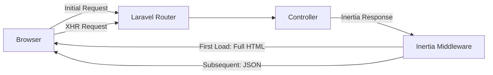

# How to Use Inertia.js with Laravel

Author: [nawazdhandala](https://www.github.com/nawazdhandala)

Tags: PHP, Laravel, Inertia.js, Vue, React, SPA

Description: Learn how to build modern single-page applications with Inertia.js and Laravel without the complexity of a separate API.

---

> Inertia.js lets you build SPAs without building an API. You get the best of both worlds: server-side routing, controllers, and validation from Laravel, combined with the reactivity and component model of Vue or React.

If you've ever built a Laravel API just to power a Vue or React frontend, you know the pain. You end up duplicating validation logic, managing authentication tokens, handling CORS, and dealing with all the complexity that comes with a decoupled architecture. Inertia.js removes all of that by letting your frontend talk directly to your Laravel controllers.

---

## What is Inertia.js?

Inertia.js is not a framework. It's a glue layer that connects server-side frameworks (like Laravel) with client-side frameworks (like Vue or React). Instead of returning JSON from your controllers, you return Inertia responses that render JavaScript components.



The first page load returns a full HTML document with your app bootstrapped. After that, navigation happens via XHR requests that return JSON, which Inertia swaps into the page without a full reload.

---

## Setting Up Inertia.js with Laravel

### Step 1: Install the Server-Side Package

Install the Inertia Laravel adapter via Composer. This provides the middleware and response helpers you'll use in your controllers.

```bash
# Install the Inertia.js server-side adapter for Laravel
composer require inertiajs/inertia-laravel
```

### Step 2: Set Up the Root Template

Create the root Blade template that Inertia will use. This template loads your JavaScript app and provides the initial page data through the `@inertia` directive.

```php
<!-- resources/views/app.blade.php -->
<!-- This is the root template that Inertia uses for all pages -->
<!DOCTYPE html>
<html>
<head>
    <meta charset="utf-8" />
    <meta name="viewport" content="width=device-width, initial-scale=1.0, maximum-scale=1.0" />

    <!-- Include your CSS and JavaScript assets -->
    @vite(['resources/css/app.css', 'resources/js/app.js'])

    <!-- Inertia will inject the page title here -->
    @inertiaHead
</head>
<body>
    <!-- The @inertia directive creates the root element for your SPA -->
    <!-- Inertia automatically passes page data as a data attribute -->
    @inertia
</body>
</html>
```

### Step 3: Configure the Middleware

Publish the Inertia middleware and add it to your web middleware group. The middleware handles the XHR requests and manages asset versioning for cache busting.

```bash
# Publish the HandleInertiaRequests middleware to your app
php artisan inertia:middleware
```

Now register the middleware in your `bootstrap/app.php` file (Laravel 11+) or in your `app/Http/Kernel.php` file (Laravel 10 and below).

```php
// bootstrap/app.php (Laravel 11+)
// Register Inertia middleware to handle SPA requests
use App\Http\Middleware\HandleInertiaRequests;

->withMiddleware(function (Middleware $middleware) {
    $middleware->web(append: [
        HandleInertiaRequests::class,
    ]);
})
```

### Step 4: Install Client-Side Dependencies

Choose between Vue or React for your frontend. This example uses Vue 3, but the concepts are identical for React.

```bash
# Install Vue 3 and the Inertia Vue adapter
npm install vue@3 @inertiajs/vue3

# If you prefer React instead:
# npm install react react-dom @inertiajs/react
```

### Step 5: Configure the JavaScript Entry Point

Set up your main JavaScript file to initialize Inertia. This creates the Vue app and tells Inertia where to find your page components.

```javascript
// resources/js/app.js
// Bootstrap the Inertia.js application with Vue 3
import { createApp, h } from 'vue'
import { createInertiaApp } from '@inertiajs/vue3'

// Initialize Inertia with your Vue components
createInertiaApp({
    // Define how Inertia resolves page component names to actual components
    // This looks for components in the Pages directory based on the name
    resolve: name => {
        // Dynamically import page components from the Pages directory
        const pages = import.meta.glob('./Pages/**/*.vue', { eager: true })
        return pages[`./Pages/${name}.vue`]
    },

    // Set up the Vue application with Inertia's app component
    setup({ el, App, props, plugin }) {
        createApp({ render: () => h(App, props) })
            .use(plugin)
            .mount(el)
    },
})
```

---

## Building Your First Inertia Page

### Creating a Controller

Inertia controllers look almost identical to regular Laravel controllers. The key difference is using `Inertia::render()` instead of `view()`.

```php
<?php
// app/Http/Controllers/UserController.php
// Controller that returns Inertia responses instead of Blade views

namespace App\Http\Controllers;

use App\Models\User;
use Inertia\Inertia;
use Inertia\Response;

class UserController extends Controller
{
    // Display a list of users
    // Inertia::render() returns an Inertia response that will render the Vue component
    public function index(): Response
    {
        // Fetch users with pagination
        $users = User::query()
            ->select(['id', 'name', 'email', 'created_at'])
            ->latest()
            ->paginate(10);

        // Return an Inertia response
        // First argument: component path relative to Pages directory
        // Second argument: props to pass to the component
        return Inertia::render('Users/Index', [
            'users' => $users,
        ]);
    }

    // Display a single user
    public function show(User $user): Response
    {
        // Load relationships you need in the component
        $user->load('posts', 'comments');

        return Inertia::render('Users/Show', [
            'user' => $user,
        ]);
    }
}
```

### Creating the Vue Component

Create the corresponding Vue component that receives the props from your controller. Inertia automatically makes the data available as component props.

```vue
<!-- resources/js/Pages/Users/Index.vue -->
<!-- User listing page component -->
<script setup>
// Import Inertia's Link and Head components for SPA navigation and SEO
import { Link, Head } from '@inertiajs/vue3'

// Define the props this component receives from the controller
// Inertia automatically passes controller data as props
defineProps({
    users: {
        type: Object,  // Paginated data from Laravel
        required: true
    }
})
</script>

<template>
    <!-- Head component manages the document title and meta tags -->
    <Head title="Users" />

    <div class="container mx-auto p-6">
        <h1 class="text-2xl font-bold mb-4">Users</h1>

        <!-- User list -->
        <div class="bg-white rounded-lg shadow">
            <table class="min-w-full">
                <thead>
                    <tr class="border-b">
                        <th class="px-4 py-3 text-left">Name</th>
                        <th class="px-4 py-3 text-left">Email</th>
                        <th class="px-4 py-3 text-left">Actions</th>
                    </tr>
                </thead>
                <tbody>
                    <!-- Loop through paginated users -->
                    <tr v-for="user in users.data" :key="user.id" class="border-b">
                        <td class="px-4 py-3">{{ user.name }}</td>
                        <td class="px-4 py-3">{{ user.email }}</td>
                        <td class="px-4 py-3">
                            <!-- Link component handles SPA navigation -->
                            <!-- No page reload, just XHR request and component swap -->
                            <Link
                                :href="`/users/${user.id}`"
                                class="text-blue-600 hover:underline"
                            >
                                View
                            </Link>
                        </td>
                    </tr>
                </tbody>
            </table>
        </div>

        <!-- Pagination links -->
        <div class="mt-4 flex gap-2">
            <!-- Inertia Link handles pagination without page reloads -->
            <Link
                v-for="link in users.links"
                :key="link.label"
                :href="link.url"
                class="px-3 py-1 border rounded"
                :class="{ 'bg-blue-500 text-white': link.active }"
                v-html="link.label"
            />
        </div>
    </div>
</template>
```

---

## Handling Forms with Inertia

Inertia provides a useForm helper that handles form state, validation errors, and submission status. This is where Inertia really shines compared to traditional SPA setups.

### Form Component

The useForm helper tracks form data, validation errors, and submission state automatically. When Laravel returns validation errors, they're automatically mapped to your form fields.

```vue
<!-- resources/js/Pages/Users/Create.vue -->
<!-- User creation form with Inertia's form helper -->
<script setup>
import { useForm, Head, Link } from '@inertiajs/vue3'

// useForm creates a reactive form object that tracks:
// - Form data
// - Validation errors from Laravel
// - Processing state during submission
// - Recently successful state for showing success messages
const form = useForm({
    name: '',
    email: '',
    password: '',
    password_confirmation: '',
})

// Handle form submission
function submit() {
    // post() sends a POST request to the specified URL
    // Inertia handles the redirect or error response automatically
    form.post('/users', {
        // Reset password fields after successful submission
        onSuccess: () => form.reset('password', 'password_confirmation'),
    })
}
</script>

<template>
    <Head title="Create User" />

    <div class="container mx-auto p-6 max-w-md">
        <h1 class="text-2xl font-bold mb-4">Create User</h1>

        <form @submit.prevent="submit" class="space-y-4">
            <!-- Name field -->
            <div>
                <label class="block text-sm font-medium mb-1">Name</label>
                <input
                    v-model="form.name"
                    type="text"
                    class="w-full border rounded px-3 py-2"
                    :class="{ 'border-red-500': form.errors.name }"
                />
                <!-- Display validation errors from Laravel -->
                <!-- form.errors is automatically populated by Inertia -->
                <p v-if="form.errors.name" class="text-red-500 text-sm mt-1">
                    {{ form.errors.name }}
                </p>
            </div>

            <!-- Email field -->
            <div>
                <label class="block text-sm font-medium mb-1">Email</label>
                <input
                    v-model="form.email"
                    type="email"
                    class="w-full border rounded px-3 py-2"
                    :class="{ 'border-red-500': form.errors.email }"
                />
                <p v-if="form.errors.email" class="text-red-500 text-sm mt-1">
                    {{ form.errors.email }}
                </p>
            </div>

            <!-- Password field -->
            <div>
                <label class="block text-sm font-medium mb-1">Password</label>
                <input
                    v-model="form.password"
                    type="password"
                    class="w-full border rounded px-3 py-2"
                    :class="{ 'border-red-500': form.errors.password }"
                />
                <p v-if="form.errors.password" class="text-red-500 text-sm mt-1">
                    {{ form.errors.password }}
                </p>
            </div>

            <!-- Password confirmation -->
            <div>
                <label class="block text-sm font-medium mb-1">Confirm Password</label>
                <input
                    v-model="form.password_confirmation"
                    type="password"
                    class="w-full border rounded px-3 py-2"
                />
            </div>

            <!-- Submit button with loading state -->
            <button
                type="submit"
                :disabled="form.processing"
                class="w-full bg-blue-500 text-white py-2 rounded hover:bg-blue-600 disabled:opacity-50"
            >
                <!-- form.processing is true during submission -->
                {{ form.processing ? 'Creating...' : 'Create User' }}
            </button>
        </form>
    </div>
</template>
```

### Controller Store Method

The controller handles validation just like any Laravel application. When validation fails, Inertia automatically redirects back with errors. No API error handling needed.

```php
<?php
// app/Http/Controllers/UserController.php
// Store method with standard Laravel validation

namespace App\Http\Controllers;

use App\Models\User;
use Illuminate\Http\Request;
use Illuminate\Support\Facades\Hash;

class UserController extends Controller
{
    // Store a new user
    // Inertia handles validation errors automatically
    public function store(Request $request)
    {
        // Standard Laravel validation
        // If validation fails, Inertia redirects back with errors
        // Your Vue component receives errors via form.errors
        $validated = $request->validate([
            'name' => ['required', 'string', 'max:255'],
            'email' => ['required', 'email', 'unique:users'],
            'password' => ['required', 'confirmed', 'min:8'],
        ]);

        // Create the user
        User::create([
            'name' => $validated['name'],
            'email' => $validated['email'],
            'password' => Hash::make($validated['password']),
        ]);

        // Redirect to the users index
        // Inertia converts this to a client-side navigation
        return redirect()->route('users.index')
            ->with('success', 'User created successfully.');
    }
}
```

---

## Sharing Data Globally

Some data needs to be available on every page, like the authenticated user, flash messages, or app configuration. Use the HandleInertiaRequests middleware to share this data.

```php
<?php
// app/Http/Middleware/HandleInertiaRequests.php
// Middleware that shares global data with all Inertia pages

namespace App\Http\Middleware;

use Illuminate\Http\Request;
use Inertia\Middleware;

class HandleInertiaRequests extends Middleware
{
    // The root view that Inertia uses
    protected $rootView = 'app';

    // Share data that should be available to all pages
    // This data is accessible in your Vue/React components
    public function share(Request $request): array
    {
        return array_merge(parent::share($request), [
            // Share the authenticated user (or null if not logged in)
            // This is available in every component as $page.props.auth.user
            'auth' => [
                'user' => $request->user() ? [
                    'id' => $request->user()->id,
                    'name' => $request->user()->name,
                    'email' => $request->user()->email,
                ] : null,
            ],

            // Share flash messages from the session
            // Useful for showing success/error notifications after actions
            'flash' => [
                'success' => fn () => $request->session()->get('success'),
                'error' => fn () => $request->session()->get('error'),
            ],

            // Share any app configuration needed on the frontend
            'app' => [
                'name' => config('app.name'),
                'env' => config('app.env'),
            ],
        ]);
    }
}
```

### Accessing Shared Data in Components

Access shared data through the `usePage()` composable or the `$page` prop.

```vue
<!-- resources/js/Layouts/AppLayout.vue -->
<!-- Main layout component that uses shared data -->
<script setup>
import { computed } from 'vue'
import { usePage, Link } from '@inertiajs/vue3'

// usePage() gives access to the current page and shared props
const page = usePage()

// Create computed properties for shared data
const user = computed(() => page.props.auth.user)
const flashSuccess = computed(() => page.props.flash.success)
const flashError = computed(() => page.props.flash.error)
</script>

<template>
    <div class="min-h-screen bg-gray-100">
        <!-- Navigation with user info -->
        <nav class="bg-white shadow">
            <div class="container mx-auto px-4 py-3 flex justify-between items-center">
                <Link href="/" class="text-xl font-bold">
                    {{ page.props.app.name }}
                </Link>

                <!-- Show user info or login link based on auth state -->
                <div v-if="user">
                    <span class="mr-4">{{ user.name }}</span>
                    <Link href="/logout" method="post" as="button">
                        Logout
                    </Link>
                </div>
                <div v-else>
                    <Link href="/login" class="mr-4">Login</Link>
                    <Link href="/register">Register</Link>
                </div>
            </div>
        </nav>

        <!-- Flash messages -->
        <div v-if="flashSuccess" class="bg-green-100 border-l-4 border-green-500 p-4 m-4">
            {{ flashSuccess }}
        </div>
        <div v-if="flashError" class="bg-red-100 border-l-4 border-red-500 p-4 m-4">
            {{ flashError }}
        </div>

        <!-- Page content -->
        <main class="container mx-auto py-6">
            <slot />
        </main>
    </div>
</template>
```

---

## Partial Reloads for Performance

When you only need to refresh part of the page data, use partial reloads. This is useful for updating a list without reloading the entire page props.

```vue
<!-- resources/js/Pages/Dashboard.vue -->
<!-- Dashboard with partial reload for notifications -->
<script setup>
import { router } from '@inertiajs/vue3'

defineProps({
    stats: Object,
    notifications: Array,
    recentActivity: Array,
})

// Refresh only the notifications prop
// This sends a request but only fetches the specified prop
function refreshNotifications() {
    router.reload({
        only: ['notifications'],  // Only reload this prop
        preserveScroll: true,     // Keep the current scroll position
    })
}

// Set up auto-refresh for notifications every 30 seconds
import { onMounted, onUnmounted } from 'vue'

let interval
onMounted(() => {
    interval = setInterval(refreshNotifications, 30000)
})
onUnmounted(() => {
    clearInterval(interval)
})
</script>

<template>
    <div class="grid grid-cols-3 gap-6">
        <!-- Stats section -->
        <div class="col-span-2">
            <h2 class="text-xl font-bold mb-4">Dashboard</h2>
            <!-- Stats display -->
        </div>

        <!-- Notifications sidebar with refresh button -->
        <div>
            <div class="flex justify-between items-center mb-4">
                <h3 class="font-bold">Notifications</h3>
                <button
                    @click="refreshNotifications"
                    class="text-sm text-blue-600 hover:underline"
                >
                    Refresh
                </button>
            </div>

            <div v-for="notification in notifications" :key="notification.id">
                {{ notification.message }}
            </div>
        </div>
    </div>
</template>
```

### Lazy Loading Props

For data that's expensive to compute, use lazy evaluation. The data is only loaded when the property is actually accessed on the frontend.

```php
<?php
// Lazy props for expensive computations
// app/Http/Controllers/DashboardController.php

use Inertia\Inertia;

class DashboardController extends Controller
{
    public function index()
    {
        return Inertia::render('Dashboard', [
            // These load immediately with the page
            'user' => auth()->user(),
            'stats' => $this->getQuickStats(),

            // Lazy: Only computed when accessed via partial reload
            // Use Inertia::lazy() for expensive operations
            'detailedAnalytics' => Inertia::lazy(fn () =>
                $this->computeDetailedAnalytics()
            ),

            // Deferred: Loaded after initial page render
            // Good for non-critical data that can load after the page appears
            'recommendations' => Inertia::defer(fn () =>
                $this->generateRecommendations()
            ),
        ]);
    }
}
```

---

## Persistent Layouts

By default, Inertia destroys and recreates page components on each navigation. Persistent layouts let you keep parts of your UI mounted across page visits.

### Define the Layout

Create a layout component that wraps your pages.

```vue
<!-- resources/js/Layouts/AppLayout.vue -->
<script setup>
import { Link } from '@inertiajs/vue3'
</script>

<template>
    <div class="min-h-screen">
        <nav class="bg-gray-800 text-white p-4">
            <Link href="/" class="mr-4">Home</Link>
            <Link href="/users" class="mr-4">Users</Link>
            <Link href="/settings">Settings</Link>
        </nav>

        <main class="p-6">
            <!-- Page content goes here -->
            <slot />
        </main>
    </div>
</template>
```

### Apply Persistent Layout to Pages

Use the layout option to make layouts persistent. The layout component stays mounted while only the page content swaps.

```vue
<!-- resources/js/Pages/Users/Index.vue -->
<script setup>
import AppLayout from '@/Layouts/AppLayout.vue'

// Define the layout as a persistent layout
// This keeps the layout mounted across page navigations
defineOptions({
    layout: AppLayout,
})

defineProps({
    users: Object,
})
</script>

<template>
    <!-- This content replaces the slot in AppLayout -->
    <h1>Users</h1>
    <!-- User list... -->
</template>
```

---

## Server-Side Rendering (SSR)

Inertia supports server-side rendering for better SEO and initial load performance. SSR renders your Vue/React components on the server for the first request.

### Enable SSR

Install the SSR dependencies and create the server entry point.

```bash
# Install the SSR server
npm install @inertiajs/vue3
```

Create the SSR entry point that renders components on the server.

```javascript
// resources/js/ssr.js
// Server-side rendering entry point
import { createInertiaApp } from '@inertiajs/vue3'
import createServer from '@inertiajs/vue3/server'
import { renderToString } from '@vue/server-renderer'
import { createSSRApp, h } from 'vue'

// Create the SSR server
createServer(page =>
    createInertiaApp({
        page,
        render: renderToString,
        resolve: name => {
            const pages = import.meta.glob('./Pages/**/*.vue', { eager: true })
            return pages[`./Pages/${name}.vue`]
        },
        setup({ App, props, plugin }) {
            // Use createSSRApp instead of createApp for SSR
            return createSSRApp({ render: () => h(App, props) })
                .use(plugin)
        },
    })
)
```

Update your Vite configuration to build the SSR bundle.

```javascript
// vite.config.js
import { defineConfig } from 'vite'
import laravel from 'laravel-vite-plugin'
import vue from '@vitejs/plugin-vue'

export default defineConfig({
    plugins: [
        laravel({
            input: ['resources/js/app.js'],
            // Enable SSR with the ssr entry point
            ssr: 'resources/js/ssr.js',
            refresh: true,
        }),
        vue({
            template: {
                transformAssetUrls: {
                    base: null,
                    includeAbsolute: false,
                },
            },
        }),
    ],
})
```

---

## Common Patterns and Tips

### Preserve State During Navigation

Keep scroll position and form state when navigating between pages.

```vue
<script setup>
import { router } from '@inertiajs/vue3'

// Navigate while preserving scroll position
function navigateWithScroll(url) {
    router.visit(url, {
        preserveScroll: true,
    })
}

// Navigate while preserving component state
function navigateWithState(url) {
    router.visit(url, {
        preserveState: true,  // Keep local component state
    })
}
</script>
```

### Handle External Redirects

Sometimes you need to redirect to an external URL or trigger a full page reload.

```php
<?php
// Force a full page reload (useful for login/logout)
return Inertia::location('/external-url');

// Or from JavaScript
import { router } from '@inertiajs/vue3'
router.visit('/login', { replace: true })
```

### Progress Indicator

Inertia shows a progress bar during navigation by default. Customize it in your app setup.

```javascript
// resources/js/app.js
import { createInertiaApp } from '@inertiajs/vue3'
import { createApp, h } from 'vue'

createInertiaApp({
    // Progress bar configuration
    progress: {
        delay: 250,           // Show after 250ms
        color: '#4B5563',     // Progress bar color
        includeCSS: true,     // Include default CSS
        showSpinner: true,    // Show spinner on the side
    },
    // ... rest of setup
})
```

---

## Summary

| Feature | How It Works |
|---------|-------------|
| **Routing** | Use Laravel routes, no client-side router needed |
| **Data Passing** | Controller returns props via `Inertia::render()` |
| **Forms** | `useForm()` handles state, errors, and submission |
| **Navigation** | `<Link>` component for SPA-style navigation |
| **Shared Data** | Middleware shares global data to all pages |
| **Layouts** | Persistent layouts stay mounted across pages |
| **SSR** | Optional server-side rendering for SEO |

Inertia.js gives you the developer experience of a modern SPA while keeping the simplicity of server-side development. No API to build, no authentication tokens to manage, and your validation logic stays in one place.

---

*Building modern applications requires reliable monitoring. OneUptime provides comprehensive observability for your Laravel applications, from tracking response times and error rates to monitoring your database queries and queue workers. Start monitoring your Inertia.js application with [OneUptime](https://oneuptime.com) today.*
