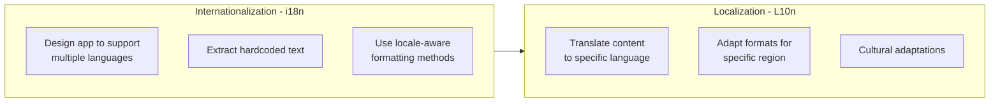
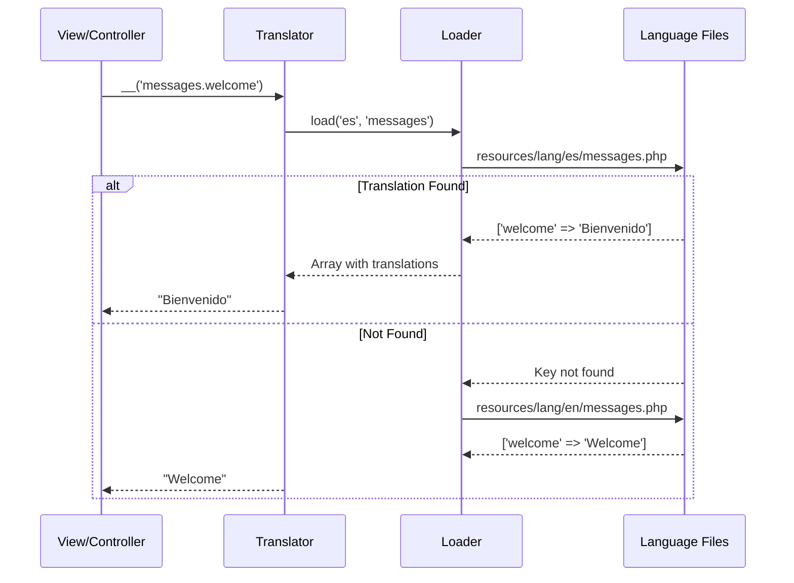
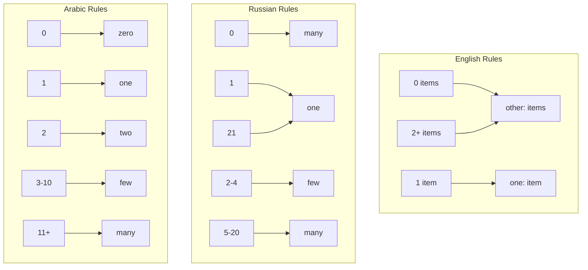
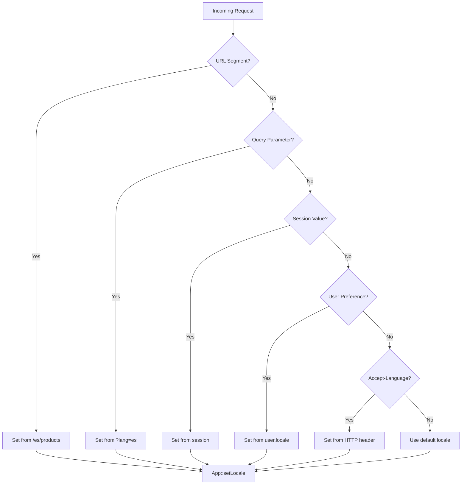
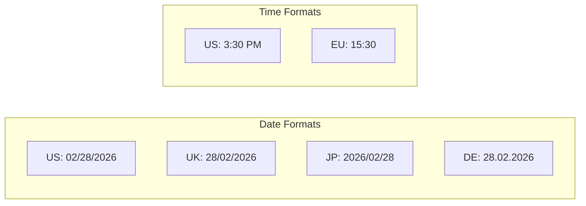
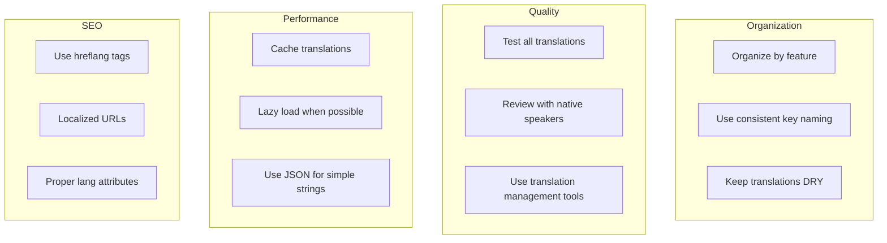

# How to Handle Internationalization in Laravel

Author: [nawazdhandala](https://www.github.com/nawazdhandala)

Tags: Laravel, PHP, i18n, Internationalization, Localization

Description: A comprehensive guide to implementing internationalization (i18n) in Laravel applications. Learn locale configuration, translation files, pluralization, date and currency formatting, and best practices for building multilingual PHP applications.

---

> Building applications for a global audience requires more than translating text strings. True internationalization encompasses language, date formats, currencies, pluralization rules, and cultural conventions. Laravel provides an elegant and powerful localization system that makes building multilingual applications straightforward and maintainable.

Laravel ships with a robust localization system out of the box, supporting both PHP array and JSON translation files. Whether you are building a small website or a large-scale SaaS platform, Laravel's i18n features scale to meet your needs.

---

## Understanding Internationalization Concepts

Before diving into implementation, let us clarify the key terminology:



- **Internationalization (i18n)**: Designing your application architecture to support multiple languages and regions
- **Localization (L10n)**: Adapting your application for a specific language or regional market
- **Locale**: A combination of language and region (e.g., `en_US`, `es_MX`, `fr_CA`)

The numbers 18 and 10 represent the character count between the first and last letters of each word.

---

## How Laravel Localization Works

Laravel's localization follows a straightforward pattern: define translations in language files, reference them with keys in your code, and let Laravel resolve the correct translation based on the current locale.

```mermaid
flowchart TB
    subgraph Request Flow
        R[User Request] --> L{Locale Detection}
        L --> |URL segment| LP[/es/products]
        L --> |Query param| LQ[?lang=es]
        L --> |Session| LS[Session locale]
        L --> |User preference| LU[Database]
        L --> |Accept-Language| LH[HTTP Header]
        L --> |Default| LD[config app.locale]
    end

    subgraph Translation
        LP --> S[App::setLocale]
        LQ --> S
        LS --> S
        LU --> S
        LH --> S
        LD --> S
        S --> T[Lookup Translation Key]
        T --> Y[Language Files]
        Y --> O[Rendered Output]
    end
```

### Translation Lookup Process

When you call `__('messages.welcome')`, Laravel performs these steps:

1. Checks the current locale via `App::getLocale()`
2. Looks for the translation in the corresponding language file
3. Falls back to the fallback locale if not found
4. Returns the key itself if no translation exists



---

## Getting Started with Laravel Localization

### Basic Configuration

Configure your application's localization settings in the config file.

```php
<?php
// config/app.php

return [
    // The default locale for your application
    // This locale will be used when no other locale is explicitly set
    'locale' => 'en',

    // The fallback locale when the current locale is not available
    // Translations will fall back to this locale if a key is missing
    'fallback_locale' => 'en',

    // Available locales for your application
    // Useful for validation and locale switching
    'available_locales' => [
        'en' => 'English',
        'es' => 'Espanol',
        'fr' => 'Francais',
        'de' => 'Deutsch',
        'pt' => 'Portugues',
        'ja' => 'Japanese',
        'zh' => 'Chinese',
    ],

    // Faker locale for database seeding
    // Generates locale-appropriate fake data
    'faker_locale' => 'en_US',
];
```

### Directory Structure

Laravel supports two translation file formats. Organize your files based on your project needs.

```
resources/
  lang/
    en/
      messages.php       # General messages
      validation.php     # Validation error messages
      auth.php          # Authentication messages
      pagination.php    # Pagination text
      passwords.php     # Password reset messages
    es/
      messages.php
      validation.php
      auth.php
      pagination.php
      passwords.php
    fr/
      messages.php
      validation.php
      auth.php
    en.json              # JSON format for simple key-value pairs
    es.json
    fr.json
```

### PHP Array Translation Files

The traditional approach uses PHP arrays for nested, structured translations.

```php
<?php
// resources/lang/en/messages.php

return [
    // Application name and common strings
    'app_name' => 'MyApplication',

    // Grouped navigation translations
    'nav' => [
        'home' => 'Home',
        'dashboard' => 'Dashboard',
        'settings' => 'Settings',
        'profile' => 'Profile',
        'logout' => 'Log Out',
    ],

    // Common action buttons
    'actions' => [
        'save' => 'Save',
        'cancel' => 'Cancel',
        'delete' => 'Delete',
        'edit' => 'Edit',
        'create' => 'Create',
        'update' => 'Update',
        'submit' => 'Submit',
        'search' => 'Search',
        'filter' => 'Filter',
        'reset' => 'Reset',
    ],

    // Flash messages for user feedback
    'flash' => [
        'create_success' => 'Record created successfully.',
        'update_success' => 'Record updated successfully.',
        'delete_success' => 'Record deleted successfully.',
        'error' => 'An error occurred. Please try again.',
        'unauthorized' => 'You are not authorized to perform this action.',
    ],

    // Form labels
    'labels' => [
        'email' => 'Email Address',
        'password' => 'Password',
        'password_confirmation' => 'Confirm Password',
        'name' => 'Full Name',
        'phone' => 'Phone Number',
        'address' => 'Address',
    ],
];
```

```php
<?php
// resources/lang/es/messages.php

return [
    // Nombre de la aplicacion y cadenas comunes
    'app_name' => 'MiAplicacion',

    // Traducciones de navegacion agrupadas
    'nav' => [
        'home' => 'Inicio',
        'dashboard' => 'Panel',
        'settings' => 'Configuracion',
        'profile' => 'Perfil',
        'logout' => 'Cerrar Sesion',
    ],

    // Botones de accion comunes
    'actions' => [
        'save' => 'Guardar',
        'cancel' => 'Cancelar',
        'delete' => 'Eliminar',
        'edit' => 'Editar',
        'create' => 'Crear',
        'update' => 'Actualizar',
        'submit' => 'Enviar',
        'search' => 'Buscar',
        'filter' => 'Filtrar',
        'reset' => 'Restablecer',
    ],

    // Mensajes flash para retroalimentacion del usuario
    'flash' => [
        'create_success' => 'Registro creado exitosamente.',
        'update_success' => 'Registro actualizado exitosamente.',
        'delete_success' => 'Registro eliminado exitosamente.',
        'error' => 'Ocurrio un error. Por favor intente de nuevo.',
        'unauthorized' => 'No esta autorizado para realizar esta accion.',
    ],

    // Etiquetas de formulario
    'labels' => [
        'email' => 'Correo Electronico',
        'password' => 'Contrasena',
        'password_confirmation' => 'Confirmar Contrasena',
        'name' => 'Nombre Completo',
        'phone' => 'Numero de Telefono',
        'address' => 'Direccion',
    ],
];
```

### JSON Translation Files

JSON files are ideal for applications with many simple translations or when using translation strings as keys.

```json
// resources/lang/en.json
{
    "Welcome to our application": "Welcome to our application",
    "Please sign in to continue": "Please sign in to continue",
    "Your account has been created": "Your account has been created",
    "Password reset link sent": "Password reset link sent to your email",
    "Invalid credentials": "The provided credentials are incorrect",
    "Session expired": "Your session has expired. Please sign in again.",
    "No results found": "No results found for your search",
    "Loading...": "Loading...",
    "Are you sure?": "Are you sure you want to proceed?",
    "This action cannot be undone": "This action cannot be undone"
}
```

```json
// resources/lang/es.json
{
    "Welcome to our application": "Bienvenido a nuestra aplicacion",
    "Please sign in to continue": "Por favor inicie sesion para continuar",
    "Your account has been created": "Su cuenta ha sido creada",
    "Password reset link sent": "Enlace de restablecimiento enviado a su correo",
    "Invalid credentials": "Las credenciales proporcionadas son incorrectas",
    "Session expired": "Su sesion ha expirado. Por favor inicie sesion nuevamente.",
    "No results found": "No se encontraron resultados para su busqueda",
    "Loading...": "Cargando...",
    "Are you sure?": "Esta seguro de que desea continuar?",
    "This action cannot be undone": "Esta accion no se puede deshacer"
}
```

---

## Using Translations in Your Application

### Basic Translation Functions

Laravel provides several helper functions for accessing translations.

```php
<?php
// app/Http/Controllers/ProductController.php

namespace App\Http\Controllers;

use Illuminate\Http\Request;

class ProductController extends Controller
{
    public function store(Request $request)
    {
        // Validate and create product...

        // Using the __ helper for translations
        // This retrieves the translation for the given key
        return redirect()
            ->route('products.index')
            ->with('success', __('messages.flash.create_success'));
    }

    public function update(Request $request, Product $product)
    {
        // Validate and update product...

        // Using the trans() function (alias for __)
        return redirect()
            ->route('products.show', $product)
            ->with('success', trans('messages.flash.update_success'));
    }

    public function destroy(Product $product)
    {
        $product->delete();

        // Using @lang directive equivalent in controllers
        return redirect()
            ->route('products.index')
            ->with('success', __('messages.flash.delete_success'));
    }
}
```

### Using Translations in Blade Views

Blade provides convenient directives for working with translations.

```php
{{-- resources/views/layouts/app.blade.php --}}
<!DOCTYPE html>
<html lang="{{ str_replace('_', '-', app()->getLocale()) }}">
<head>
    <meta charset="utf-8">
    <meta name="viewport" content="width=device-width, initial-scale=1">
    <title>{{ __('messages.app_name') }}</title>
</head>
<body>
    {{-- Navigation with translations --}}
    <nav>
        <ul>
            <li><a href="{{ route('home') }}">{{ __('messages.nav.home') }}</a></li>
            <li><a href="{{ route('dashboard') }}">{{ __('messages.nav.dashboard') }}</a></li>
            <li><a href="{{ route('settings') }}">{{ __('messages.nav.settings') }}</a></li>

            @auth
                <li><a href="{{ route('profile') }}">{{ __('messages.nav.profile') }}</a></li>
                <li>
                    <form method="POST" action="{{ route('logout') }}">
                        @csrf
                        <button type="submit">{{ __('messages.nav.logout') }}</button>
                    </form>
                </li>
            @endauth
        </ul>
    </nav>

    {{-- Flash messages --}}
    @if(session('success'))
        <div class="alert alert-success">
            {{ session('success') }}
        </div>
    @endif

    @if(session('error'))
        <div class="alert alert-danger">
            {{ session('error') }}
        </div>
    @endif

    <main>
        @yield('content')
    </main>
</body>
</html>
```

```php
{{-- resources/views/products/create.blade.php --}}
@extends('layouts.app')

@section('content')
<div class="container">
    <h1>{{ __('products.create_title') }}</h1>

    <form method="POST" action="{{ route('products.store') }}">
        @csrf

        <div class="form-group">
            {{-- Using the @lang directive --}}
            <label for="name">@lang('messages.labels.name')</label>
            <input type="text"
                   name="name"
                   id="name"
                   class="form-control @error('name') is-invalid @enderror"
                   value="{{ old('name') }}"
                   placeholder="{{ __('products.name_placeholder') }}">
            @error('name')
                <span class="invalid-feedback">{{ $message }}</span>
            @enderror
        </div>

        <div class="form-group">
            <label for="description">@lang('products.description')</label>
            <textarea name="description"
                      id="description"
                      class="form-control"
                      placeholder="{{ __('products.description_placeholder') }}">{{ old('description') }}</textarea>
        </div>

        <div class="form-group">
            <label for="price">@lang('products.price')</label>
            <input type="number"
                   name="price"
                   id="price"
                   class="form-control"
                   step="0.01"
                   value="{{ old('price') }}">
        </div>

        <div class="form-actions">
            <button type="submit" class="btn btn-primary">
                {{ __('messages.actions.create') }}
            </button>
            <a href="{{ route('products.index') }}" class="btn btn-secondary">
                {{ __('messages.actions.cancel') }}
            </a>
        </div>
    </form>
</div>
@endsection
```

### Variable Interpolation

Pass dynamic values into your translations using placeholders.

```php
<?php
// resources/lang/en/messages.php

return [
    // Simple interpolation with named placeholders
    'greeting' => 'Hello, :name!',
    'welcome_back' => 'Welcome back, :name! You have :count new messages.',

    // Multiple placeholders
    'order_confirmation' => 'Thank you, :customer! Your order #:order_number has been confirmed.',

    // Placeholders with formatting hints
    'account_balance' => 'Your current balance is :amount.',

    // User activity messages
    'user_joined' => ':name joined the team on :date.',
    'last_login' => 'Last login: :time from :location.',
];
```

```php
<?php
// Using interpolation in controllers

class DashboardController extends Controller
{
    public function index()
    {
        $user = auth()->user();
        $messageCount = $user->unreadMessages()->count();

        // Pass variables to translations using an array
        $greeting = __('messages.greeting', ['name' => $user->first_name]);

        // Multiple variables
        $welcomeMessage = __('messages.welcome_back', [
            'name' => $user->name,
            'count' => $messageCount,
        ]);

        return view('dashboard', compact('greeting', 'welcomeMessage'));
    }
}
```

```php
{{-- Using interpolation in Blade --}}
<h1>{{ __('messages.greeting', ['name' => $user->name]) }}</h1>

<p>{{ __('messages.welcome_back', ['name' => $user->name, 'count' => $messageCount]) }}</p>

<p>{{ __('messages.order_confirmation', [
    'customer' => $order->customer_name,
    'order_number' => $order->id
]) }}</p>
```

---

## Pluralization

Different languages have different pluralization rules. Laravel handles this complexity for you.



### Basic Pluralization

```php
<?php
// resources/lang/en/messages.php

return [
    // Simple pluralization using pipe syntax
    // Format: singular|plural
    'apples' => 'There is one apple|There are many apples',

    // Explicit count ranges
    // Format: {0} zero|{1} one|[2,*] many
    'notifications' => '{0} You have no notifications|{1} You have one notification|[2,*] You have :count notifications',

    // Complex ranges for specific counts
    'items_in_cart' => '{0} Your cart is empty|{1} You have 1 item in your cart|[2,10] You have :count items in your cart|[11,*] You have :count items in your cart!',

    // Messages with counts
    'comments' => '{0} No comments yet|{1} 1 comment|[2,*] :count comments',

    // User count display
    'users_online' => '{0} No users online|{1} 1 user online|[2,*] :count users online',

    // File upload messages
    'files_uploaded' => '{0} No files uploaded|{1} 1 file uploaded successfully|[2,*] :count files uploaded successfully',
];
```

```php
<?php
// resources/lang/es/messages.php

return [
    // Spanish pluralization
    'apples' => 'Hay una manzana|Hay muchas manzanas',

    'notifications' => '{0} No tienes notificaciones|{1} Tienes una notificacion|[2,*] Tienes :count notificaciones',

    'items_in_cart' => '{0} Tu carrito esta vacio|{1} Tienes 1 articulo en tu carrito|[2,*] Tienes :count articulos en tu carrito',

    'comments' => '{0} Sin comentarios|{1} 1 comentario|[2,*] :count comentarios',

    'users_online' => '{0} Ningun usuario en linea|{1} 1 usuario en linea|[2,*] :count usuarios en linea',

    'files_uploaded' => '{0} Ningun archivo subido|{1} 1 archivo subido exitosamente|[2,*] :count archivos subidos exitosamente',
];
```

### Using Pluralization

```php
<?php
// Using trans_choice() for pluralization

class NotificationController extends Controller
{
    public function index()
    {
        $count = auth()->user()->unreadNotifications()->count();

        // trans_choice selects the appropriate plural form based on count
        // The count is automatically available as :count in the translation
        $message = trans_choice('messages.notifications', $count);

        return view('notifications.index', [
            'message' => $message,
            'notifications' => auth()->user()->notifications,
        ]);
    }
}
```

```php
{{-- Using pluralization in Blade views --}}

{{-- Basic usage --}}
<p>{{ trans_choice('messages.comments', $post->comments_count) }}</p>

{{-- With additional replacements --}}
<p>{{ trans_choice('messages.users_online', $onlineCount, ['count' => $onlineCount]) }}</p>

{{-- In a loop showing different counts --}}
@foreach($products as $product)
    <div class="product">
        <h3>{{ $product->name }}</h3>
        <span class="reviews">
            {{ trans_choice('messages.comments', $product->reviews_count) }}
        </span>
    </div>
@endforeach

{{-- Shopping cart example --}}
<div class="cart-summary">
    <span class="item-count">
        {{ trans_choice('messages.items_in_cart', $cart->items->count()) }}
    </span>
</div>
```

---

## Setting and Detecting Locale

There are multiple strategies for detecting and setting the application locale.



### Middleware for Locale Detection

Create a middleware to handle locale detection on every request.

```php
<?php
// app/Http/Middleware/SetLocale.php

namespace App\Http\Middleware;

use Closure;
use Illuminate\Http\Request;
use Illuminate\Support\Facades\App;
use Illuminate\Support\Facades\Session;

class SetLocale
{
    /**
     * Handle an incoming request and set the application locale.
     * Priority: URL param > Session > User preference > Accept-Language > Default
     */
    public function handle(Request $request, Closure $next)
    {
        $locale = $this->detectLocale($request);

        // Validate the locale is supported
        if ($this->isValidLocale($locale)) {
            App::setLocale($locale);
            Session::put('locale', $locale);
        }

        return $next($request);
    }

    /**
     * Detect the preferred locale from various sources.
     */
    protected function detectLocale(Request $request): string
    {
        // Priority 1: URL parameter (e.g., ?lang=es)
        if ($request->has('lang')) {
            return $request->get('lang');
        }

        // Priority 2: Route parameter (e.g., /es/products)
        if ($request->route('locale')) {
            return $request->route('locale');
        }

        // Priority 3: Session value (persisted preference)
        if (Session::has('locale')) {
            return Session::get('locale');
        }

        // Priority 4: Authenticated user's saved preference
        if ($request->user() && $request->user()->locale) {
            return $request->user()->locale;
        }

        // Priority 5: Browser's Accept-Language header
        $browserLocale = $this->parseAcceptLanguageHeader($request);
        if ($browserLocale) {
            return $browserLocale;
        }

        // Priority 6: Application default
        return config('app.locale');
    }

    /**
     * Parse the Accept-Language header to find a supported locale.
     */
    protected function parseAcceptLanguageHeader(Request $request): ?string
    {
        $acceptLanguage = $request->header('Accept-Language');

        if (!$acceptLanguage) {
            return null;
        }

        // Parse header like "en-US,en;q=0.9,es;q=0.8"
        $languages = explode(',', $acceptLanguage);

        foreach ($languages as $language) {
            // Extract language code (before semicolon and dash)
            $locale = strtolower(substr(trim($language), 0, 2));

            if ($this->isValidLocale($locale)) {
                return $locale;
            }
        }

        return null;
    }

    /**
     * Check if the locale is in our list of available locales.
     */
    protected function isValidLocale(string $locale): bool
    {
        return array_key_exists($locale, config('app.available_locales', []));
    }
}
```

### Register the Middleware

```php
<?php
// app/Http/Kernel.php

namespace App\Http;

use Illuminate\Foundation\Http\Kernel as HttpKernel;

class Kernel extends HttpKernel
{
    /**
     * The application's route middleware groups.
     */
    protected $middlewareGroups = [
        'web' => [
            // ... other middleware
            \App\Http\Middleware\SetLocale::class,
        ],
    ];
}
```

### URL-Based Locale Routing

For SEO-friendly URLs with locale prefixes.

```php
<?php
// routes/web.php

use Illuminate\Support\Facades\Route;

// Get available locales for route constraint
$availableLocales = implode('|', array_keys(config('app.available_locales', ['en' => 'English'])));

// Routes with optional locale prefix
// Matches: /products, /es/products, /fr/products
Route::group([
    'prefix' => '{locale?}',
    'where' => ['locale' => $availableLocales],
    'middleware' => ['web', 'setLocale'],
], function () {
    Route::get('/', [HomeController::class, 'index'])->name('home');
    Route::resource('products', ProductController::class);
    Route::resource('categories', CategoryController::class);
    Route::get('about', [PageController::class, 'about'])->name('about');
    Route::get('contact', [PageController::class, 'contact'])->name('contact');
});

// Routes that should not have locale prefix
Route::group(['middleware' => 'web'], function () {
    Route::get('health', fn() => response('OK'));
    Route::get('api/status', [StatusController::class, 'index']);
});
```

### User Locale Preference Storage

Store and retrieve the user's language preference from the database.

```php
<?php
// database/migrations/2026_02_02_000000_add_locale_to_users_table.php

use Illuminate\Database\Migrations\Migration;
use Illuminate\Database\Schema\Blueprint;
use Illuminate\Support\Facades\Schema;

return new class extends Migration
{
    public function up(): void
    {
        Schema::table('users', function (Blueprint $table) {
            // Add locale column with reasonable length for locale codes
            $table->string('locale', 10)->nullable()->after('email');

            // Add timezone for complete internationalization
            $table->string('timezone', 50)->nullable()->after('locale');
        });
    }

    public function down(): void
    {
        Schema::table('users', function (Blueprint $table) {
            $table->dropColumn(['locale', 'timezone']);
        });
    }
};
```

```php
<?php
// app/Models/User.php

namespace App\Models;

use Illuminate\Foundation\Auth\User as Authenticatable;

class User extends Authenticatable
{
    protected $fillable = [
        'name',
        'email',
        'password',
        'locale',
        'timezone',
    ];

    /**
     * Get the user's preferred locale.
     * Falls back to the application default if not set.
     */
    public function getPreferredLocale(): string
    {
        return $this->locale ?? config('app.locale');
    }

    /**
     * Check if the locale is valid before saving.
     */
    public function setLocaleAttribute(?string $value): void
    {
        $availableLocales = array_keys(config('app.available_locales', []));

        if ($value && in_array($value, $availableLocales)) {
            $this->attributes['locale'] = $value;
        } else {
            $this->attributes['locale'] = null;
        }
    }
}
```

```php
<?php
// app/Http/Controllers/LocaleController.php

namespace App\Http\Controllers;

use Illuminate\Http\Request;
use Illuminate\Support\Facades\App;
use Illuminate\Support\Facades\Session;

class LocaleController extends Controller
{
    /**
     * Switch the application locale.
     */
    public function switch(Request $request)
    {
        $request->validate([
            'locale' => ['required', 'string', 'in:' . implode(',', array_keys(config('app.available_locales')))],
        ]);

        $locale = $request->input('locale');

        // Store in session for guests
        Session::put('locale', $locale);

        // Store in database for authenticated users
        if ($request->user()) {
            $request->user()->update(['locale' => $locale]);
        }

        // Set for current request
        App::setLocale($locale);

        // Redirect back or to home
        return redirect()->back()->with('success', __('messages.locale_changed'));
    }
}
```

---

## Date and Time Localization

Dates and times must be formatted according to locale conventions.



### Using Carbon for Localized Dates

```php
<?php
// app/Http/Controllers/ArticleController.php

namespace App\Http\Controllers;

use App\Models\Article;
use Carbon\Carbon;

class ArticleController extends Controller
{
    public function show(Article $article)
    {
        // Set Carbon's locale to match application locale
        // This affects diffForHumans() and format methods
        Carbon::setLocale(app()->getLocale());

        return view('articles.show', [
            'article' => $article,
            // Format date according to current locale
            'publishedDate' => $article->published_at->translatedFormat('F j, Y'),
            // Relative time in current locale
            'timeAgo' => $article->published_at->diffForHumans(),
        ]);
    }
}
```

### Date Formatting Helpers

```php
<?php
// app/Helpers/DateHelper.php

namespace App\Helpers;

use Carbon\Carbon;
use Illuminate\Support\Facades\App;

class DateHelper
{
    /**
     * Format date patterns for different locales.
     * Keys are locale codes, values are date format strings.
     */
    protected static array $dateFormats = [
        'en' => [
            'short' => 'm/d/Y',
            'medium' => 'M j, Y',
            'long' => 'F j, Y',
            'full' => 'l, F j, Y',
        ],
        'es' => [
            'short' => 'd/m/Y',
            'medium' => 'j M Y',
            'long' => 'j \d\e F \d\e Y',
            'full' => 'l, j \d\e F \d\e Y',
        ],
        'de' => [
            'short' => 'd.m.Y',
            'medium' => 'j. M Y',
            'long' => 'j. F Y',
            'full' => 'l, j. F Y',
        ],
        'fr' => [
            'short' => 'd/m/Y',
            'medium' => 'j M Y',
            'long' => 'j F Y',
            'full' => 'l j F Y',
        ],
    ];

    /**
     * Format a date according to the current locale.
     */
    public static function format(Carbon $date, string $format = 'medium'): string
    {
        $locale = App::getLocale();
        Carbon::setLocale($locale);

        $formatString = self::$dateFormats[$locale][$format]
            ?? self::$dateFormats['en'][$format];

        return $date->translatedFormat($formatString);
    }

    /**
     * Get relative time string in current locale.
     */
    public static function relative(Carbon $date): string
    {
        Carbon::setLocale(App::getLocale());
        return $date->diffForHumans();
    }

    /**
     * Format datetime for forms (HTML datetime-local input).
     */
    public static function forInput(Carbon $date): string
    {
        return $date->format('Y-m-d\TH:i');
    }
}
```

```php
{{-- Using date helpers in Blade --}}
@php
    use App\Helpers\DateHelper;
@endphp

<article>
    <h1>{{ $article->title }}</h1>

    <div class="meta">
        {{-- Short format --}}
        <span class="date">{{ DateHelper::format($article->published_at, 'short') }}</span>

        {{-- Long format --}}
        <span class="date-full">{{ DateHelper::format($article->published_at, 'long') }}</span>

        {{-- Relative time --}}
        <span class="time-ago">{{ DateHelper::relative($article->published_at) }}</span>
    </div>

    <div class="content">
        {{ $article->content }}
    </div>
</article>
```

---

## Number and Currency Formatting

Numbers and currencies have different formatting conventions across locales.

```php
<?php
// app/Helpers/NumberHelper.php

namespace App\Helpers;

use Illuminate\Support\Facades\App;
use NumberFormatter;

class NumberHelper
{
    /**
     * Format a number according to the current locale.
     */
    public static function format(float $number, int $decimals = 2): string
    {
        $locale = App::getLocale();
        $formatter = new NumberFormatter($locale, NumberFormatter::DECIMAL);
        $formatter->setAttribute(NumberFormatter::FRACTION_DIGITS, $decimals);

        return $formatter->format($number);
    }

    /**
     * Format a number as currency.
     */
    public static function currency(float $amount, ?string $currency = null): string
    {
        $locale = App::getLocale();
        $formatter = new NumberFormatter($locale, NumberFormatter::CURRENCY);

        // Default currencies per locale
        $defaultCurrencies = [
            'en' => 'USD',
            'es' => 'EUR',
            'de' => 'EUR',
            'fr' => 'EUR',
            'ja' => 'JPY',
            'zh' => 'CNY',
        ];

        $currency = $currency ?? ($defaultCurrencies[$locale] ?? 'USD');

        return $formatter->formatCurrency($amount, $currency);
    }

    /**
     * Format a number as percentage.
     */
    public static function percentage(float $number, int $decimals = 0): string
    {
        $locale = App::getLocale();
        $formatter = new NumberFormatter($locale, NumberFormatter::PERCENT);
        $formatter->setAttribute(NumberFormatter::FRACTION_DIGITS, $decimals);

        return $formatter->format($number / 100);
    }

    /**
     * Format bytes to human readable size.
     */
    public static function fileSize(int $bytes): string
    {
        $units = ['B', 'KB', 'MB', 'GB', 'TB'];
        $bytes = max($bytes, 0);
        $pow = floor(($bytes ? log($bytes) : 0) / log(1024));
        $pow = min($pow, count($units) - 1);
        $bytes /= pow(1024, $pow);

        return self::format($bytes, 2) . ' ' . $units[$pow];
    }
}
```

```php
{{-- Using number helpers in Blade --}}
@php
    use App\Helpers\NumberHelper;
@endphp

<div class="product-card">
    <h3>{{ $product->name }}</h3>

    {{-- Price formatted as currency --}}
    <span class="price">{{ NumberHelper::currency($product->price) }}</span>

    {{-- Discount percentage --}}
    @if($product->discount)
        <span class="discount">-{{ NumberHelper::percentage($product->discount) }}</span>
    @endif

    {{-- Stock count formatted with locale-specific separators --}}
    <span class="stock">{{ NumberHelper::format($product->stock, 0) }} {{ __('products.in_stock') }}</span>
</div>

{{-- File download with size --}}
<div class="download">
    <a href="{{ $file->url }}">
        {{ $file->name }} ({{ NumberHelper::fileSize($file->size) }})
    </a>
</div>
```

---

## Translating Validation Messages

Laravel's validation system integrates seamlessly with localization.

```php
<?php
// resources/lang/en/validation.php

return [
    // Standard validation messages
    'accepted' => 'The :attribute must be accepted.',
    'active_url' => 'The :attribute is not a valid URL.',
    'after' => 'The :attribute must be a date after :date.',
    'alpha' => 'The :attribute may only contain letters.',
    'between' => [
        'numeric' => 'The :attribute must be between :min and :max.',
        'file' => 'The :attribute must be between :min and :max kilobytes.',
        'string' => 'The :attribute must be between :min and :max characters.',
        'array' => 'The :attribute must have between :min and :max items.',
    ],
    'confirmed' => 'The :attribute confirmation does not match.',
    'email' => 'The :attribute must be a valid email address.',
    'max' => [
        'numeric' => 'The :attribute may not be greater than :max.',
        'file' => 'The :attribute may not be greater than :max kilobytes.',
        'string' => 'The :attribute may not be greater than :max characters.',
        'array' => 'The :attribute may not have more than :max items.',
    ],
    'min' => [
        'numeric' => 'The :attribute must be at least :min.',
        'file' => 'The :attribute must be at least :min kilobytes.',
        'string' => 'The :attribute must be at least :min characters.',
        'array' => 'The :attribute must have at least :min items.',
    ],
    'required' => 'The :attribute field is required.',
    'unique' => 'The :attribute has already been taken.',

    // Custom validation messages for specific fields
    'custom' => [
        'email' => [
            'required' => 'We need your email address to contact you.',
            'email' => 'Please provide a valid email address.',
        ],
        'password' => [
            'required' => 'Please enter a password.',
            'min' => 'Your password must be at least :min characters.',
            'confirmed' => 'The passwords do not match.',
        ],
    ],

    // Custom attribute names for cleaner messages
    'attributes' => [
        'email' => 'email address',
        'password' => 'password',
        'password_confirmation' => 'password confirmation',
        'first_name' => 'first name',
        'last_name' => 'last name',
        'phone_number' => 'phone number',
        'terms' => 'terms of service',
    ],
];
```

```php
<?php
// resources/lang/es/validation.php

return [
    'accepted' => 'El campo :attribute debe ser aceptado.',
    'active_url' => 'El campo :attribute no es una URL valida.',
    'after' => 'El campo :attribute debe ser una fecha posterior a :date.',
    'alpha' => 'El campo :attribute solo puede contener letras.',
    'between' => [
        'numeric' => 'El campo :attribute debe estar entre :min y :max.',
        'file' => 'El campo :attribute debe pesar entre :min y :max kilobytes.',
        'string' => 'El campo :attribute debe tener entre :min y :max caracteres.',
        'array' => 'El campo :attribute debe tener entre :min y :max elementos.',
    ],
    'confirmed' => 'La confirmacion de :attribute no coincide.',
    'email' => 'El campo :attribute debe ser una direccion de correo valida.',
    'max' => [
        'numeric' => 'El campo :attribute no debe ser mayor que :max.',
        'file' => 'El campo :attribute no debe pesar mas de :max kilobytes.',
        'string' => 'El campo :attribute no debe tener mas de :max caracteres.',
        'array' => 'El campo :attribute no debe tener mas de :max elementos.',
    ],
    'min' => [
        'numeric' => 'El campo :attribute debe ser al menos :min.',
        'file' => 'El campo :attribute debe pesar al menos :min kilobytes.',
        'string' => 'El campo :attribute debe tener al menos :min caracteres.',
        'array' => 'El campo :attribute debe tener al menos :min elementos.',
    ],
    'required' => 'El campo :attribute es obligatorio.',
    'unique' => 'El campo :attribute ya ha sido tomado.',

    'custom' => [
        'email' => [
            'required' => 'Necesitamos su direccion de correo para contactarle.',
            'email' => 'Por favor proporcione una direccion de correo valida.',
        ],
        'password' => [
            'required' => 'Por favor ingrese una contrasena.',
            'min' => 'Su contrasena debe tener al menos :min caracteres.',
            'confirmed' => 'Las contrasenas no coinciden.',
        ],
    ],

    'attributes' => [
        'email' => 'correo electronico',
        'password' => 'contrasena',
        'password_confirmation' => 'confirmacion de contrasena',
        'first_name' => 'nombre',
        'last_name' => 'apellido',
        'phone_number' => 'numero de telefono',
        'terms' => 'terminos de servicio',
    ],
];
```

---

## Locale Switcher Component

Create a user-friendly language switcher for your application.

```php
<?php
// app/View/Components/LocaleSwitcher.php

namespace App\View\Components;

use Illuminate\View\Component;

class LocaleSwitcher extends Component
{
    public array $locales;
    public string $currentLocale;

    public function __construct()
    {
        $this->locales = config('app.available_locales', []);
        $this->currentLocale = app()->getLocale();
    }

    public function render()
    {
        return view('components.locale-switcher');
    }
}
```

```php
{{-- resources/views/components/locale-switcher.blade.php --}}
<div class="locale-switcher">
    <label for="locale-select" class="sr-only">
        {{ __('messages.select_language') }}
    </label>

    {{-- Dropdown style switcher --}}
    <form action="{{ route('locale.switch') }}" method="POST" id="locale-form">
        @csrf
        <select
            name="locale"
            id="locale-select"
            onchange="document.getElementById('locale-form').submit()"
            class="form-select"
            aria-label="{{ __('messages.select_language') }}"
        >
            @foreach($locales as $code => $name)
                <option
                    value="{{ $code }}"
                    {{ $currentLocale === $code ? 'selected' : '' }}
                    lang="{{ $code }}"
                >
                    {{ $name }}
                </option>
            @endforeach
        </select>
    </form>
</div>

{{-- Alternative: Button style switcher --}}
<nav class="locale-buttons" aria-label="{{ __('messages.language_selector') }}">
    @foreach($locales as $code => $name)
        @if($currentLocale === $code)
            <span
                class="locale-btn active"
                aria-current="true"
                lang="{{ $code }}"
            >
                {{ $name }}
            </span>
        @else
            <form action="{{ route('locale.switch') }}" method="POST" class="inline">
                @csrf
                <input type="hidden" name="locale" value="{{ $code }}">
                <button
                    type="submit"
                    class="locale-btn"
                    lang="{{ $code }}"
                    hreflang="{{ $code }}"
                >
                    {{ $name }}
                </button>
            </form>
        @endif
    @endforeach
</nav>
```

```css
/* Locale switcher styles */
.locale-switcher {
    position: relative;
}

.locale-switcher .form-select {
    padding: 0.5rem 2rem 0.5rem 1rem;
    border: 1px solid #ddd;
    border-radius: 4px;
    background-color: white;
    cursor: pointer;
    font-size: 0.875rem;
}

.locale-buttons {
    display: flex;
    gap: 0.5rem;
}

.locale-btn {
    padding: 0.5rem 1rem;
    border: 1px solid #ddd;
    border-radius: 4px;
    background: white;
    cursor: pointer;
    font-size: 0.875rem;
    transition: all 0.2s;
}

.locale-btn:hover {
    background: #f5f5f5;
}

.locale-btn.active {
    background: #007bff;
    color: white;
    border-color: #007bff;
    cursor: default;
}

.sr-only {
    position: absolute;
    width: 1px;
    height: 1px;
    padding: 0;
    margin: -1px;
    overflow: hidden;
    clip: rect(0, 0, 0, 0);
    border: 0;
}
```

---

## Translating Database Content

For user-generated content that needs translation, consider these approaches.

### Using Spatie Translatable Package

```php
<?php
// Install: composer require spatie/laravel-translatable

// app/Models/Product.php

namespace App\Models;

use Illuminate\Database\Eloquent\Model;
use Spatie\Translatable\HasTranslations;

class Product extends Model
{
    use HasTranslations;

    // Specify which attributes are translatable
    // These will be stored as JSON in the database
    public array $translatable = ['name', 'description', 'meta_title', 'meta_description'];

    protected $fillable = [
        'name',
        'description',
        'price',
        'sku',
        'meta_title',
        'meta_description',
    ];
}
```

```php
<?php
// database/migrations/2026_02_02_000001_create_products_table.php

use Illuminate\Database\Migrations\Migration;
use Illuminate\Database\Schema\Blueprint;
use Illuminate\Support\Facades\Schema;

return new class extends Migration
{
    public function up(): void
    {
        Schema::create('products', function (Blueprint $table) {
            $table->id();
            // Use JSON columns for translatable fields
            $table->json('name');
            $table->json('description')->nullable();
            $table->decimal('price', 10, 2);
            $table->string('sku')->unique();
            $table->json('meta_title')->nullable();
            $table->json('meta_description')->nullable();
            $table->timestamps();
        });
    }
};
```

```php
<?php
// Using translatable models

// Creating a product with translations
$product = Product::create([
    'name' => [
        'en' => 'Wireless Headphones',
        'es' => 'Auriculares Inalambricos',
        'fr' => 'Casque Sans Fil',
    ],
    'description' => [
        'en' => 'High-quality wireless headphones with noise cancellation.',
        'es' => 'Auriculares inalambricos de alta calidad con cancelacion de ruido.',
        'fr' => 'Casque sans fil de haute qualite avec reduction du bruit.',
    ],
    'price' => 99.99,
    'sku' => 'WH-001',
]);

// Accessing translations - automatically uses current locale
echo $product->name; // Returns translation for current locale

// Accessing specific translation
echo $product->getTranslation('name', 'es'); // "Auriculares Inalambricos"

// Setting a translation
$product->setTranslation('name', 'de', 'Kabellose Kopfhorer');
$product->save();

// Getting all translations
$allNames = $product->getTranslations('name');
// ['en' => 'Wireless Headphones', 'es' => 'Auriculares Inalambricos', ...]
```

### Manual Translation Table Approach

For more control, use separate translation tables.

```php
<?php
// database/migrations/2026_02_02_000002_create_product_translations_table.php

use Illuminate\Database\Migrations\Migration;
use Illuminate\Database\Schema\Blueprint;
use Illuminate\Support\Facades\Schema;

return new class extends Migration
{
    public function up(): void
    {
        Schema::create('product_translations', function (Blueprint $table) {
            $table->id();
            $table->foreignId('product_id')->constrained()->onDelete('cascade');
            $table->string('locale', 10);
            $table->string('name');
            $table->text('description')->nullable();
            $table->string('meta_title')->nullable();
            $table->text('meta_description')->nullable();
            $table->timestamps();

            // Ensure one translation per locale per product
            $table->unique(['product_id', 'locale']);

            // Index for faster lookups
            $table->index(['product_id', 'locale']);
        });
    }
};
```

```php
<?php
// app/Models/Product.php

namespace App\Models;

use Illuminate\Database\Eloquent\Model;
use Illuminate\Database\Eloquent\Relations\HasMany;
use Illuminate\Database\Eloquent\Relations\HasOne;

class Product extends Model
{
    protected $fillable = ['price', 'sku'];

    /**
     * Get all translations for the product.
     */
    public function translations(): HasMany
    {
        return $this->hasMany(ProductTranslation::class);
    }

    /**
     * Get translation for current locale.
     */
    public function translation(): HasOne
    {
        return $this->hasOne(ProductTranslation::class)
            ->where('locale', app()->getLocale());
    }

    /**
     * Get translated attribute with fallback.
     */
    public function getTranslatedAttribute(string $attribute): ?string
    {
        $translation = $this->translations
            ->firstWhere('locale', app()->getLocale());

        if ($translation && $translation->$attribute) {
            return $translation->$attribute;
        }

        // Fallback to default locale
        $fallback = $this->translations
            ->firstWhere('locale', config('app.fallback_locale'));

        return $fallback?->$attribute;
    }

    /**
     * Accessor for translated name.
     */
    public function getNameAttribute(): ?string
    {
        return $this->getTranslatedAttribute('name');
    }

    /**
     * Accessor for translated description.
     */
    public function getDescriptionAttribute(): ?string
    {
        return $this->getTranslatedAttribute('description');
    }
}
```

---

## SEO Considerations for Multilingual Sites

Proper internationalization is crucial for international SEO.

```mermaid
flowchart TB
    subgraph SEO Best Practices
        A[Use hreflang tags] --> B[Tell search engines<br/>about language versions]
        C[Localized URLs] --> D[/es/productos vs<br/>?lang=es]
        E[Proper lang attribute] --> F[html lang=es]
        G[Localized sitemap] --> H[Include all language<br/>versions]
    end
```

### Adding hreflang Tags

```php
{{-- resources/views/layouts/app.blade.php --}}
<!DOCTYPE html>
<html lang="{{ str_replace('_', '-', app()->getLocale()) }}">
<head>
    <meta charset="utf-8">
    <meta name="viewport" content="width=device-width, initial-scale=1">

    {{-- hreflang tags for all available language versions --}}
    @foreach(config('app.available_locales') as $locale => $name)
        <link
            rel="alternate"
            hreflang="{{ $locale }}"
            href="{{ url()->current() }}?lang={{ $locale }}"
        />
    @endforeach

    {{-- x-default for automatic language selection --}}
    <link
        rel="alternate"
        hreflang="x-default"
        href="{{ url()->current() }}"
    />

    {{-- Canonical URL --}}
    <link rel="canonical" href="{{ url()->current() }}" />

    <title>@yield('title', config('app.name'))</title>
</head>
```

### Localized Sitemap Generation

```php
<?php
// app/Http/Controllers/SitemapController.php

namespace App\Http\Controllers;

use App\Models\Product;
use App\Models\Article;
use Illuminate\Http\Response;

class SitemapController extends Controller
{
    public function index(): Response
    {
        $products = Product::with('translations')
            ->where('active', true)
            ->get();

        $articles = Article::with('translations')
            ->where('published', true)
            ->get();

        $locales = array_keys(config('app.available_locales'));

        $content = view('sitemap.index', compact('products', 'articles', 'locales'));

        return response($content)
            ->header('Content-Type', 'application/xml');
    }
}
```

```xml
{{-- resources/views/sitemap/index.blade.php --}}
<?xml version="1.0" encoding="UTF-8"?>
<urlset xmlns="http://www.sitemaps.org/schemas/sitemap/0.9"
        xmlns:xhtml="http://www.w3.org/1999/xhtml">

    {{-- Static pages --}}
    @foreach($locales as $locale)
    <url>
        <loc>{{ route('home', ['locale' => $locale]) }}</loc>
        <lastmod>{{ now()->toW3cString() }}</lastmod>
        <changefreq>daily</changefreq>
        <priority>1.0</priority>
        @foreach($locales as $altLocale)
        <xhtml:link
            rel="alternate"
            hreflang="{{ $altLocale }}"
            href="{{ route('home', ['locale' => $altLocale]) }}"
        />
        @endforeach
    </url>
    @endforeach

    {{-- Products --}}
    @foreach($products as $product)
        @foreach($locales as $locale)
        <url>
            <loc>{{ route('products.show', ['locale' => $locale, 'product' => $product]) }}</loc>
            <lastmod>{{ $product->updated_at->toW3cString() }}</lastmod>
            <changefreq>weekly</changefreq>
            <priority>0.8</priority>
            @foreach($locales as $altLocale)
            <xhtml:link
                rel="alternate"
                hreflang="{{ $altLocale }}"
                href="{{ route('products.show', ['locale' => $altLocale, 'product' => $product]) }}"
            />
            @endforeach
        </url>
        @endforeach
    @endforeach

    {{-- Articles --}}
    @foreach($articles as $article)
        @foreach($locales as $locale)
        <url>
            <loc>{{ route('articles.show', ['locale' => $locale, 'article' => $article]) }}</loc>
            <lastmod>{{ $article->updated_at->toW3cString() }}</lastmod>
            <changefreq>monthly</changefreq>
            <priority>0.6</priority>
            @foreach($locales as $altLocale)
            <xhtml:link
                rel="alternate"
                hreflang="{{ $altLocale }}"
                href="{{ route('articles.show', ['locale' => $altLocale, 'article' => $article]) }}"
            />
            @endforeach
        </url>
        @endforeach
    @endforeach
</urlset>
```

---

## Testing Translations

Ensure your translations are complete and working correctly.

```php
<?php
// tests/Feature/LocalizationTest.php

namespace Tests\Feature;

use Tests\TestCase;
use Illuminate\Support\Facades\App;

class LocalizationTest extends TestCase
{
    /**
     * Test that locale can be switched via middleware.
     */
    public function test_locale_can_be_switched_via_query_parameter(): void
    {
        $response = $this->get('/?lang=es');

        $response->assertStatus(200);
        $this->assertEquals('es', App::getLocale());
    }

    /**
     * Test that invalid locale falls back to default.
     */
    public function test_invalid_locale_falls_back_to_default(): void
    {
        $response = $this->get('/?lang=invalid');

        $response->assertStatus(200);
        $this->assertEquals(config('app.locale'), App::getLocale());
    }

    /**
     * Test translations exist for all supported locales.
     */
    public function test_required_translations_exist(): void
    {
        $requiredKeys = [
            'messages.nav.home',
            'messages.nav.dashboard',
            'messages.actions.save',
            'messages.actions.cancel',
            'messages.flash.create_success',
        ];

        $locales = array_keys(config('app.available_locales'));

        foreach ($locales as $locale) {
            App::setLocale($locale);

            foreach ($requiredKeys as $key) {
                $translation = __($key);

                // Translation should not return the key itself
                $this->assertNotEquals(
                    $key,
                    $translation,
                    "Missing translation for '{$key}' in locale '{$locale}'"
                );
            }
        }
    }

    /**
     * Test pluralization works correctly.
     */
    public function test_pluralization_works(): void
    {
        App::setLocale('en');

        $zero = trans_choice('messages.notifications', 0);
        $one = trans_choice('messages.notifications', 1);
        $many = trans_choice('messages.notifications', 5);

        $this->assertStringContainsString('no', strtolower($zero));
        $this->assertStringContainsString('1', $one);
        $this->assertStringContainsString('5', $many);
    }

    /**
     * Test date localization.
     */
    public function test_dates_are_localized(): void
    {
        $date = now();

        App::setLocale('en');
        \Carbon\Carbon::setLocale('en');
        $englishDate = $date->translatedFormat('F');

        App::setLocale('es');
        \Carbon\Carbon::setLocale('es');
        $spanishDate = $date->translatedFormat('F');

        // Month names should be different
        $this->assertNotEquals($englishDate, $spanishDate);
    }
}
```

```php
<?php
// tests/Unit/TranslationCompletenessTest.php

namespace Tests\Unit;

use Tests\TestCase;
use Illuminate\Support\Facades\File;

class TranslationCompletenessTest extends TestCase
{
    /**
     * Get all translation keys from a locale.
     */
    protected function getTranslationKeys(string $locale): array
    {
        $keys = [];
        $path = resource_path("lang/{$locale}");

        if (!File::isDirectory($path)) {
            return $keys;
        }

        foreach (File::files($path) as $file) {
            if ($file->getExtension() !== 'php') {
                continue;
            }

            $filename = $file->getFilenameWithoutExtension();
            $translations = include $file->getPathname();

            $keys = array_merge($keys, $this->flattenKeys($translations, $filename));
        }

        return $keys;
    }

    /**
     * Flatten nested array keys.
     */
    protected function flattenKeys(array $array, string $prefix = ''): array
    {
        $keys = [];

        foreach ($array as $key => $value) {
            $fullKey = $prefix ? "{$prefix}.{$key}" : $key;

            if (is_array($value)) {
                $keys = array_merge($keys, $this->flattenKeys($value, $fullKey));
            } else {
                $keys[] = $fullKey;
            }
        }

        return $keys;
    }

    /**
     * Test all locales have the same translation keys.
     */
    public function test_all_locales_have_same_keys(): void
    {
        $locales = array_keys(config('app.available_locales'));
        $baseLocale = config('app.locale');
        $baseKeys = $this->getTranslationKeys($baseLocale);

        foreach ($locales as $locale) {
            if ($locale === $baseLocale) {
                continue;
            }

            $localeKeys = $this->getTranslationKeys($locale);

            $missingKeys = array_diff($baseKeys, $localeKeys);
            $extraKeys = array_diff($localeKeys, $baseKeys);

            $this->assertEmpty(
                $missingKeys,
                "Locale '{$locale}' is missing keys: " . implode(', ', $missingKeys)
            );

            // Extra keys are warnings, not failures
            if (!empty($extraKeys)) {
                $this->addWarning(
                    "Locale '{$locale}' has extra keys: " . implode(', ', $extraKeys)
                );
            }
        }
    }
}
```

---

## Best Practices Summary



### Key Takeaways

1. **Use semantic keys** that describe the content, not location (e.g., `messages.greeting` not `home.header.text`)

2. **Organize translation files** by feature or domain for maintainability

3. **Always use placeholders** for dynamic content instead of concatenating strings

4. **Handle pluralization** correctly for each language using trans_choice()

5. **Localize dates and numbers** using locale-aware formatters

6. **Implement proper locale detection** with a clear priority order

7. **Add hreflang tags** for SEO and search engine optimization

8. **Test translations** for completeness and correctness

9. **Use translation management tools** like Laravel Translation Manager for larger projects

10. **Review with native speakers** before launching in a new language

---

## Conclusion

Laravel provides a comprehensive and elegant localization system that scales from simple websites to complex multilingual applications. Key points to remember:

- **Two file formats**: PHP arrays for structured translations, JSON for simple key-value pairs
- **Helper functions**: Use `__()` for basic translations and `trans_choice()` for pluralization
- **Middleware approach**: Implement locale detection in middleware for consistent behavior
- **Database content**: Use packages like Spatie Translatable or custom translation tables
- **SEO optimization**: Always include hreflang tags and use localized URLs
- **Testing**: Automate translation completeness checks in your test suite

Start with your primary locale, extract all hardcoded strings, and add translations incrementally as your audience expands globally.

---

*Building a multilingual Laravel application that needs comprehensive monitoring? [OneUptime](https://oneuptime.com) provides application performance monitoring, uptime tracking, and incident management with full internationalization support for your global audience.*
