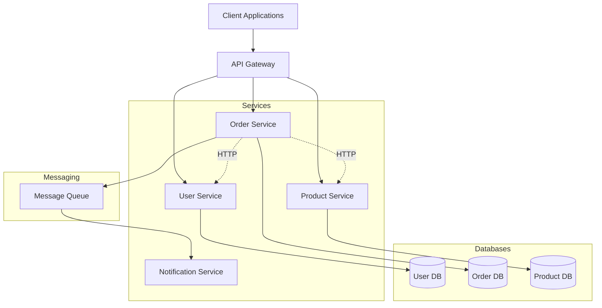
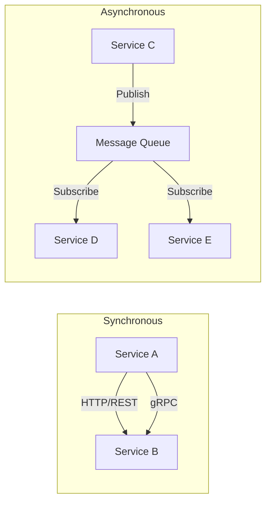
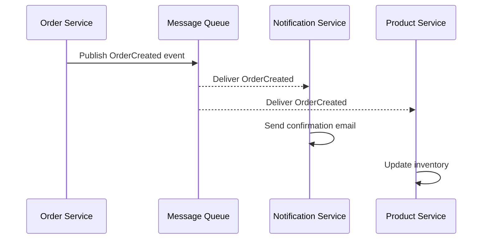
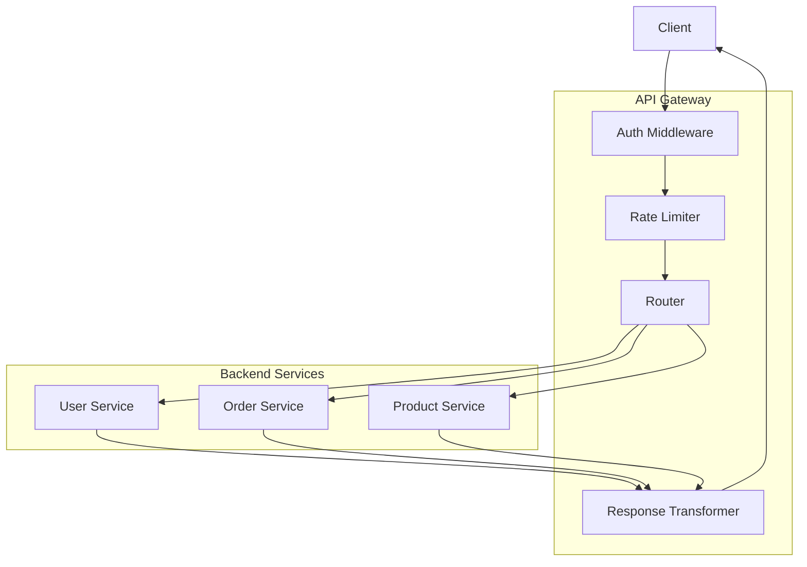

# How to Build Microservices with Laravel

Author: [nawazdhandala](https://www.github.com/nawazdhandala)

Tags: Laravel, PHP, Microservices, Architecture

Description: Learn how to build scalable microservices with Laravel, covering service decomposition, inter-service communication, API gateways, event-driven patterns, and deployment strategies.

---

> Microservices architecture enables teams to build, deploy, and scale applications independently. Laravel, with its elegant syntax and rich ecosystem, provides excellent tools for building robust microservices. This guide walks you through building production-ready microservices using Laravel.

Microservices break down monolithic applications into smaller, focused services that communicate over well-defined APIs. Each service handles a specific business domain and can be developed, deployed, and scaled independently.

---

## Why Choose Laravel for Microservices?

| Feature | Benefit |
|---------|---------|
| **Lumen Framework** | Lightweight version optimized for microservices |
| **Eloquent ORM** | Clean database abstraction per service |
| **Queue System** | Built-in async communication support |
| **API Resources** | Consistent API response formatting |
| **Service Container** | Dependency injection and loose coupling |
| **Testing Tools** | Comprehensive testing capabilities |

---

## Microservices Architecture Overview

Before diving into code, let's understand the architecture we'll build:



---

## Setting Up Your First Microservice

### Project Structure

Each microservice should be a separate Laravel or Lumen project. Here's a recommended structure:

```
microservices/
├── api-gateway/
├── user-service/
├── order-service/
├── product-service/
├── notification-service/
└── shared-library/
```

### Creating a Lumen Microservice

Lumen is Laravel's micro-framework, perfect for building fast microservices. The following command installs Lumen via Composer and creates a new user-service project.

```bash
# Install Lumen via Composer
composer create-project --prefer-dist laravel/lumen user-service

# Navigate to the project
cd user-service
```

### Basic Service Configuration

This bootstrap configuration enables Eloquent ORM and Facades in Lumen, which are disabled by default for performance. Uncomment these lines to use database models and Laravel-style facades.

```php
// bootstrap/app.php
<?php

require_once __DIR__.'/../vendor/autoload.php';

// Load environment variables
(new Laravel\Lumen\Bootstrap\LoadEnvironmentVariables(
    dirname(__DIR__)
))->bootstrap();

$app = new Laravel\Lumen\Application(
    dirname(__DIR__)
);

// Enable Eloquent ORM for database operations
$app->withEloquent();

// Enable Facades for cleaner syntax
$app->withFacades();

// Register service providers
$app->register(App\Providers\AppServiceProvider::class);
$app->register(App\Providers\AuthServiceProvider::class);

// Load routes
$app->router->group([
    'namespace' => 'App\Http\Controllers',
], function ($router) {
    require __DIR__.'/../routes/web.php';
});

return $app;
```

---

## Building the User Service

### User Model

This User model represents our domain entity with mass-assignable fields and hidden password attributes for security. The model connects to the users table in the service's dedicated database.

```php
// app/Models/User.php
<?php

namespace App\Models;

use Illuminate\Auth\Authenticatable;
use Illuminate\Contracts\Auth\Access\Authorizable as AuthorizableContract;
use Illuminate\Contracts\Auth\Authenticatable as AuthenticatableContract;
use Illuminate\Database\Eloquent\Factories\HasFactory;
use Illuminate\Database\Eloquent\Model;
use Laravel\Lumen\Auth\Authorizable;

class User extends Model implements AuthenticatableContract, AuthorizableContract
{
    use Authenticatable, Authorizable, HasFactory;

    /**
     * The table associated with the model.
     */
    protected $table = 'users';

    /**
     * Mass assignable attributes for creating and updating users.
     */
    protected $fillable = [
        'name',
        'email',
        'password',
        'status',
    ];

    /**
     * Hidden attributes excluded from JSON responses for security.
     */
    protected $hidden = [
        'password',
    ];

    /**
     * Attribute casting for proper type handling.
     */
    protected $casts = [
        'email_verified_at' => 'datetime',
        'created_at' => 'datetime',
        'updated_at' => 'datetime',
    ];
}
```

### User Controller

This controller handles all user-related HTTP requests. Each method follows RESTful conventions and returns consistent JSON responses with appropriate HTTP status codes.

```php
// app/Http/Controllers/UserController.php
<?php

namespace App\Http\Controllers;

use App\Models\User;
use Illuminate\Http\Request;
use Illuminate\Http\JsonResponse;
use Illuminate\Support\Facades\Hash;
use Illuminate\Support\Facades\Validator;

class UserController extends Controller
{
    /**
     * Get all users with pagination.
     * Returns a paginated list of users for efficient data loading.
     */
    public function index(Request $request): JsonResponse
    {
        $perPage = $request->input('per_page', 15);
        $users = User::paginate($perPage);

        return response()->json([
            'success' => true,
            'data' => $users,
        ]);
    }

    /**
     * Get a specific user by ID.
     * Returns 404 if the user is not found.
     */
    public function show(int $id): JsonResponse
    {
        $user = User::find($id);

        if (!$user) {
            return response()->json([
                'success' => false,
                'message' => 'User not found',
            ], 404);
        }

        return response()->json([
            'success' => true,
            'data' => $user,
        ]);
    }

    /**
     * Create a new user.
     * Validates input, hashes password, and returns the created user.
     */
    public function store(Request $request): JsonResponse
    {
        // Validate incoming request data
        $validator = Validator::make($request->all(), [
            'name' => 'required|string|max:255',
            'email' => 'required|email|unique:users,email',
            'password' => 'required|string|min:8',
        ]);

        if ($validator->fails()) {
            return response()->json([
                'success' => false,
                'errors' => $validator->errors(),
            ], 422);
        }

        // Create user with hashed password
        $user = User::create([
            'name' => $request->input('name'),
            'email' => $request->input('email'),
            'password' => Hash::make($request->input('password')),
            'status' => 'active',
        ]);

        return response()->json([
            'success' => true,
            'data' => $user,
            'message' => 'User created successfully',
        ], 201);
    }

    /**
     * Update an existing user.
     * Allows partial updates and validates uniqueness constraints.
     */
    public function update(Request $request, int $id): JsonResponse
    {
        $user = User::find($id);

        if (!$user) {
            return response()->json([
                'success' => false,
                'message' => 'User not found',
            ], 404);
        }

        // Validate update data with unique email check excluding current user
        $validator = Validator::make($request->all(), [
            'name' => 'sometimes|string|max:255',
            'email' => 'sometimes|email|unique:users,email,' . $id,
            'password' => 'sometimes|string|min:8',
        ]);

        if ($validator->fails()) {
            return response()->json([
                'success' => false,
                'errors' => $validator->errors(),
            ], 422);
        }

        // Update only provided fields
        $updateData = $request->only(['name', 'email']);

        if ($request->has('password')) {
            $updateData['password'] = Hash::make($request->input('password'));
        }

        $user->update($updateData);

        return response()->json([
            'success' => true,
            'data' => $user,
            'message' => 'User updated successfully',
        ]);
    }

    /**
     * Delete a user.
     * Performs soft delete if configured, hard delete otherwise.
     */
    public function destroy(int $id): JsonResponse
    {
        $user = User::find($id);

        if (!$user) {
            return response()->json([
                'success' => false,
                'message' => 'User not found',
            ], 404);
        }

        $user->delete();

        return response()->json([
            'success' => true,
            'message' => 'User deleted successfully',
        ]);
    }
}
```

### API Routes

These routes define the RESTful endpoints for the user service. All routes are prefixed with /api/v1 for versioning and grouped under authentication middleware for protected endpoints.

```php
// routes/web.php
<?php

$router->get('/', function () {
    return response()->json([
        'service' => 'user-service',
        'version' => '1.0.0',
        'status' => 'healthy',
    ]);
});

// Health check endpoint for load balancers and monitoring
$router->get('/health', function () {
    return response()->json([
        'status' => 'healthy',
        'timestamp' => now()->toIso8601String(),
    ]);
});

// API v1 routes with versioning prefix
$router->group(['prefix' => 'api/v1'], function () use ($router) {
    // User CRUD endpoints
    $router->get('/users', 'UserController@index');
    $router->get('/users/{id}', 'UserController@show');
    $router->post('/users', 'UserController@store');
    $router->put('/users/{id}', 'UserController@update');
    $router->delete('/users/{id}', 'UserController@destroy');
});
```

---

## Inter-Service Communication

Microservices need to communicate with each other. There are two primary patterns: synchronous (HTTP) and asynchronous (messaging).

### Service Communication Patterns



### HTTP Client for Service Communication

This HTTP client wrapper handles inter-service communication with built-in retry logic, circuit breaker patterns, and consistent error handling. It uses Guzzle HTTP client under the hood.

```php
// app/Services/HttpClient.php
<?php

namespace App\Services;

use GuzzleHttp\Client;
use GuzzleHttp\Exception\RequestException;
use GuzzleHttp\Exception\ConnectException;
use Illuminate\Support\Facades\Log;

class HttpClient
{
    protected Client $client;
    protected int $maxRetries = 3;
    protected int $retryDelayMs = 100;

    public function __construct()
    {
        $this->client = new Client([
            'timeout' => 30,
            'connect_timeout' => 5,
            'headers' => [
                'Accept' => 'application/json',
                'Content-Type' => 'application/json',
            ],
        ]);
    }

    /**
     * Make a GET request to another service.
     * Includes automatic retry logic for transient failures.
     */
    public function get(string $url, array $options = []): ?array
    {
        return $this->request('GET', $url, $options);
    }

    /**
     * Make a POST request to another service.
     * Automatically encodes request body as JSON.
     */
    public function post(string $url, array $data = [], array $options = []): ?array
    {
        $options['json'] = $data;
        return $this->request('POST', $url, $options);
    }

    /**
     * Execute HTTP request with retry logic.
     * Retries on connection failures and 5xx errors.
     */
    protected function request(string $method, string $url, array $options = []): ?array
    {
        $attempt = 0;
        $lastException = null;

        while ($attempt < $this->maxRetries) {
            try {
                $response = $this->client->request($method, $url, $options);
                $body = $response->getBody()->getContents();

                return json_decode($body, true);
            } catch (ConnectException $e) {
                // Network error - retry
                $lastException = $e;
                $attempt++;

                Log::warning("Connection failed to {$url}, attempt {$attempt}", [
                    'error' => $e->getMessage(),
                ]);

                usleep($this->retryDelayMs * 1000 * $attempt);
            } catch (RequestException $e) {
                // HTTP error - check if retryable
                if ($e->hasResponse()) {
                    $statusCode = $e->getResponse()->getStatusCode();

                    // Only retry on server errors (5xx)
                    if ($statusCode >= 500) {
                        $lastException = $e;
                        $attempt++;
                        usleep($this->retryDelayMs * 1000 * $attempt);
                        continue;
                    }
                }

                // Client error or no response - don't retry
                Log::error("Request failed to {$url}", [
                    'error' => $e->getMessage(),
                ]);

                return null;
            }
        }

        Log::error("All retry attempts failed for {$url}", [
            'error' => $lastException?->getMessage(),
        ]);

        return null;
    }
}
```

### Service Client Example

This UserServiceClient encapsulates all communication with the User Service. Other services use this client to fetch user data without knowing the implementation details.

```php
// app/Services/UserServiceClient.php
<?php

namespace App\Services;

use Illuminate\Support\Facades\Cache;

class UserServiceClient
{
    protected HttpClient $httpClient;
    protected string $baseUrl;
    protected int $cacheTtl = 300; // 5 minutes

    public function __construct(HttpClient $httpClient)
    {
        $this->httpClient = $httpClient;
        $this->baseUrl = config('services.user_service.url');
    }

    /**
     * Get user by ID with caching.
     * Caches user data to reduce inter-service calls.
     */
    public function getUser(int $userId): ?array
    {
        $cacheKey = "user:{$userId}";

        return Cache::remember($cacheKey, $this->cacheTtl, function () use ($userId) {
            $response = $this->httpClient->get(
                "{$this->baseUrl}/api/v1/users/{$userId}"
            );

            if ($response && $response['success']) {
                return $response['data'];
            }

            return null;
        });
    }

    /**
     * Validate user exists and is active.
     * Used before creating orders or other user-dependent operations.
     */
    public function validateUser(int $userId): bool
    {
        $user = $this->getUser($userId);

        return $user !== null && ($user['status'] ?? '') === 'active';
    }

    /**
     * Get multiple users by IDs.
     * Batch request to reduce network calls.
     */
    public function getUsers(array $userIds): array
    {
        $users = [];

        foreach ($userIds as $userId) {
            $user = $this->getUser($userId);
            if ($user) {
                $users[$userId] = $user;
            }
        }

        return $users;
    }

    /**
     * Invalidate cached user data.
     * Called when user data is updated.
     */
    public function invalidateCache(int $userId): void
    {
        Cache::forget("user:{$userId}");
    }
}
```

---

## Event-Driven Communication

Asynchronous communication using events and queues provides loose coupling between services.

### Event Flow Architecture



### Publishing Events

This event class represents an order being created. It implements ShouldBroadcast to publish to the message queue, allowing other services to react asynchronously.

```php
// app/Events/OrderCreated.php
<?php

namespace App\Events;

use Illuminate\Queue\SerializesModels;
use Illuminate\Foundation\Events\Dispatchable;
use Illuminate\Broadcasting\InteractsWithSockets;
use Illuminate\Contracts\Broadcasting\ShouldBroadcast;

class OrderCreated implements ShouldBroadcast
{
    use Dispatchable, InteractsWithSockets, SerializesModels;

    public array $order;
    public string $eventId;
    public string $timestamp;

    /**
     * Create a new event instance.
     * Includes metadata for event tracking and idempotency.
     */
    public function __construct(array $order)
    {
        $this->order = $order;
        $this->eventId = uniqid('evt_', true);
        $this->timestamp = now()->toIso8601String();
    }

    /**
     * Get the channels the event should broadcast on.
     * Events are published to specific channels for routing.
     */
    public function broadcastOn(): array
    {
        return ['orders'];
    }

    /**
     * The event's broadcast name.
     * Used for event type identification by consumers.
     */
    public function broadcastAs(): string
    {
        return 'order.created';
    }

    /**
     * Get the data to broadcast.
     * Only necessary data is included to reduce payload size.
     */
    public function broadcastWith(): array
    {
        return [
            'event_id' => $this->eventId,
            'event_type' => 'order.created',
            'timestamp' => $this->timestamp,
            'data' => [
                'order_id' => $this->order['id'],
                'user_id' => $this->order['user_id'],
                'total' => $this->order['total'],
                'items' => $this->order['items'],
            ],
        ];
    }
}
```

### Queue Job for Event Publishing

This job handles publishing events to RabbitMQ or other message brokers. Using a job ensures reliable delivery even if the broker is temporarily unavailable.

```php
// app/Jobs/PublishEvent.php
<?php

namespace App\Jobs;

use Illuminate\Bus\Queueable;
use Illuminate\Contracts\Queue\ShouldQueue;
use Illuminate\Foundation\Bus\Dispatchable;
use Illuminate\Queue\InteractsWithQueue;
use Illuminate\Queue\SerializesModels;
use Illuminate\Support\Facades\Log;
use PhpAmqpLib\Connection\AMQPStreamConnection;
use PhpAmqpLib\Message\AMQPMessage;

class PublishEvent implements ShouldQueue
{
    use Dispatchable, InteractsWithQueue, Queueable, SerializesModels;

    public string $exchange;
    public string $routingKey;
    public array $payload;

    /**
     * Number of times the job may be attempted.
     */
    public int $tries = 3;

    /**
     * Number of seconds to wait before retrying.
     */
    public int $backoff = 5;

    public function __construct(string $exchange, string $routingKey, array $payload)
    {
        $this->exchange = $exchange;
        $this->routingKey = $routingKey;
        $this->payload = $payload;
    }

    /**
     * Execute the job.
     * Publishes the event to RabbitMQ exchange.
     */
    public function handle(): void
    {
        try {
            // Connect to RabbitMQ
            $connection = new AMQPStreamConnection(
                config('queue.connections.rabbitmq.host'),
                config('queue.connections.rabbitmq.port'),
                config('queue.connections.rabbitmq.user'),
                config('queue.connections.rabbitmq.password')
            );

            $channel = $connection->channel();

            // Declare exchange if not exists
            $channel->exchange_declare(
                $this->exchange,
                'topic',
                false,  // passive
                true,   // durable
                false   // auto_delete
            );

            // Create message with delivery mode 2 for persistence
            $message = new AMQPMessage(
                json_encode($this->payload),
                [
                    'delivery_mode' => AMQPMessage::DELIVERY_MODE_PERSISTENT,
                    'content_type' => 'application/json',
                ]
            );

            // Publish to exchange
            $channel->basic_publish($message, $this->exchange, $this->routingKey);

            Log::info('Event published', [
                'exchange' => $this->exchange,
                'routing_key' => $this->routingKey,
                'event_id' => $this->payload['event_id'] ?? null,
            ]);

            $channel->close();
            $connection->close();
        } catch (\Exception $e) {
            Log::error('Failed to publish event', [
                'error' => $e->getMessage(),
                'exchange' => $this->exchange,
            ]);

            throw $e;
        }
    }
}
```

### Consuming Events

This event consumer listens for events from other services. It processes incoming messages and dispatches them to appropriate handlers based on event type.

```php
// app/Console/Commands/ConsumeEvents.php
<?php

namespace App\Console\Commands;

use Illuminate\Console\Command;
use Illuminate\Support\Facades\Log;
use PhpAmqpLib\Connection\AMQPStreamConnection;

class ConsumeEvents extends Command
{
    protected $signature = 'events:consume {queue}';
    protected $description = 'Consume events from message queue';

    /**
     * Event handlers mapped by event type.
     */
    protected array $handlers = [
        'order.created' => \App\Handlers\OrderCreatedHandler::class,
        'order.updated' => \App\Handlers\OrderUpdatedHandler::class,
        'user.created' => \App\Handlers\UserCreatedHandler::class,
    ];

    public function handle(): void
    {
        $queueName = $this->argument('queue');

        $connection = new AMQPStreamConnection(
            config('queue.connections.rabbitmq.host'),
            config('queue.connections.rabbitmq.port'),
            config('queue.connections.rabbitmq.user'),
            config('queue.connections.rabbitmq.password')
        );

        $channel = $connection->channel();

        // Declare queue
        $channel->queue_declare(
            $queueName,
            false,  // passive
            true,   // durable
            false,  // exclusive
            false   // auto_delete
        );

        $this->info("Consuming events from queue: {$queueName}");

        // Set up consumer callback
        $callback = function ($message) {
            $this->processMessage($message);
        };

        // Consume with manual acknowledgment
        $channel->basic_qos(null, 1, null);
        $channel->basic_consume(
            $queueName,
            '',     // consumer tag
            false,  // no_local
            false,  // no_ack (manual ack)
            false,  // exclusive
            false,  // no_wait
            $callback
        );

        // Keep consuming
        while ($channel->is_consuming()) {
            $channel->wait();
        }
    }

    /**
     * Process incoming message.
     * Routes to appropriate handler based on event type.
     */
    protected function processMessage($message): void
    {
        try {
            $payload = json_decode($message->body, true);
            $eventType = $payload['event_type'] ?? 'unknown';

            Log::info('Processing event', [
                'event_type' => $eventType,
                'event_id' => $payload['event_id'] ?? null,
            ]);

            // Find and execute handler
            if (isset($this->handlers[$eventType])) {
                $handler = app($this->handlers[$eventType]);
                $handler->handle($payload);
            } else {
                Log::warning('No handler for event type', [
                    'event_type' => $eventType,
                ]);
            }

            // Acknowledge message
            $message->ack();
        } catch (\Exception $e) {
            Log::error('Failed to process event', [
                'error' => $e->getMessage(),
            ]);

            // Reject and requeue on failure
            $message->nack(true);
        }
    }
}
```

---

## API Gateway Pattern

An API Gateway provides a single entry point for all client requests, handling routing, authentication, and rate limiting.

### Gateway Architecture



### Gateway Router

This gateway routes incoming requests to appropriate backend services. It handles service discovery, load balancing, and response aggregation.

```php
// app/Http/Controllers/GatewayController.php
<?php

namespace App\Http\Controllers;

use App\Services\HttpClient;
use Illuminate\Http\Request;
use Illuminate\Http\JsonResponse;
use Illuminate\Support\Facades\Log;

class GatewayController extends Controller
{
    protected HttpClient $httpClient;

    /**
     * Service routing configuration.
     * Maps URL prefixes to backend service URLs.
     */
    protected array $services = [
        'users' => 'http://user-service:8000',
        'orders' => 'http://order-service:8000',
        'products' => 'http://product-service:8000',
    ];

    public function __construct(HttpClient $httpClient)
    {
        $this->httpClient = $httpClient;
    }

    /**
     * Route request to appropriate backend service.
     * Preserves original request method, headers, and body.
     */
    public function proxy(Request $request, string $service, string $path = ''): JsonResponse
    {
        // Validate service exists
        if (!isset($this->services[$service])) {
            return response()->json([
                'success' => false,
                'message' => 'Service not found',
            ], 404);
        }

        $serviceUrl = $this->services[$service];
        $targetUrl = "{$serviceUrl}/api/v1/{$path}";

        Log::info('Proxying request', [
            'service' => $service,
            'path' => $path,
            'method' => $request->method(),
        ]);

        // Forward request to backend service
        $response = $this->forwardRequest($request, $targetUrl);

        if ($response === null) {
            return response()->json([
                'success' => false,
                'message' => 'Service unavailable',
            ], 503);
        }

        return response()->json($response);
    }

    /**
     * Forward the request to backend service.
     * Includes original headers and authentication tokens.
     */
    protected function forwardRequest(Request $request, string $url): ?array
    {
        $method = strtoupper($request->method());
        $options = [
            'headers' => [
                'Authorization' => $request->header('Authorization'),
                'X-Request-ID' => $request->header('X-Request-ID', uniqid()),
                'X-Forwarded-For' => $request->ip(),
            ],
        ];

        if (in_array($method, ['POST', 'PUT', 'PATCH'])) {
            $options['json'] = $request->all();
        }

        return match ($method) {
            'GET' => $this->httpClient->get($url, $options),
            'POST' => $this->httpClient->post($url, $request->all(), $options),
            'PUT', 'PATCH' => $this->httpClient->post($url, $request->all(), $options),
            'DELETE' => $this->httpClient->get($url, $options),
            default => null,
        };
    }

    /**
     * Aggregate data from multiple services.
     * Useful for dashboard or summary endpoints.
     */
    public function aggregate(Request $request): JsonResponse
    {
        $userId = $request->user()->id;

        // Fetch data from multiple services in parallel
        $userData = $this->httpClient->get(
            "{$this->services['users']}/api/v1/users/{$userId}"
        );

        $ordersData = $this->httpClient->get(
            "{$this->services['orders']}/api/v1/orders?user_id={$userId}"
        );

        return response()->json([
            'success' => true,
            'data' => [
                'user' => $userData['data'] ?? null,
                'recent_orders' => $ordersData['data'] ?? [],
            ],
        ]);
    }
}
```

### Gateway Routes

These routes define the gateway's public API. All requests pass through authentication and rate limiting middleware before being proxied to backend services.

```php
// routes/api.php
<?php

use Illuminate\Support\Facades\Route;
use App\Http\Controllers\GatewayController;

// Health check endpoint
Route::get('/health', function () {
    return response()->json(['status' => 'healthy']);
});

// Protected routes requiring authentication
Route::middleware(['auth:api', 'throttle:60,1'])->group(function () {
    // Aggregated endpoints
    Route::get('/dashboard', [GatewayController::class, 'aggregate']);

    // Service proxy routes
    Route::any('/{service}/{path?}', [GatewayController::class, 'proxy'])
        ->where('path', '.*');
});
```

---

## Service Discovery and Configuration

### Environment Configuration

Each service needs proper configuration for connecting to other services and shared resources. Store sensitive values in environment variables.

```php
// config/services.php
<?php

return [
    /**
     * User Service configuration.
     * URL can be a load balancer or service mesh endpoint.
     */
    'user_service' => [
        'url' => env('USER_SERVICE_URL', 'http://user-service:8000'),
        'timeout' => env('USER_SERVICE_TIMEOUT', 30),
    ],

    /**
     * Order Service configuration.
     */
    'order_service' => [
        'url' => env('ORDER_SERVICE_URL', 'http://order-service:8000'),
        'timeout' => env('ORDER_SERVICE_TIMEOUT', 30),
    ],

    /**
     * Product Service configuration.
     */
    'product_service' => [
        'url' => env('PRODUCT_SERVICE_URL', 'http://product-service:8000'),
        'timeout' => env('PRODUCT_SERVICE_TIMEOUT', 30),
    ],

    /**
     * Message broker configuration.
     */
    'rabbitmq' => [
        'host' => env('RABBITMQ_HOST', 'rabbitmq'),
        'port' => env('RABBITMQ_PORT', 5672),
        'user' => env('RABBITMQ_USER', 'guest'),
        'password' => env('RABBITMQ_PASSWORD', 'guest'),
        'vhost' => env('RABBITMQ_VHOST', '/'),
    ],
];
```

### Docker Compose for Local Development

This Docker Compose configuration sets up all microservices with their databases and message broker for local development.

```yaml
# docker-compose.yml
version: '3.8'

services:
  # API Gateway
  api-gateway:
    build:
      context: ./api-gateway
      dockerfile: Dockerfile
    ports:
      - "8080:8000"
    environment:
      - USER_SERVICE_URL=http://user-service:8000
      - ORDER_SERVICE_URL=http://order-service:8000
      - PRODUCT_SERVICE_URL=http://product-service:8000
    depends_on:
      - user-service
      - order-service
      - product-service
    networks:
      - microservices

  # User Service
  user-service:
    build:
      context: ./user-service
      dockerfile: Dockerfile
    environment:
      - DB_CONNECTION=mysql
      - DB_HOST=user-db
      - DB_DATABASE=users
      - DB_USERNAME=root
      - DB_PASSWORD=secret
      - RABBITMQ_HOST=rabbitmq
    depends_on:
      - user-db
      - rabbitmq
    networks:
      - microservices

  # Order Service
  order-service:
    build:
      context: ./order-service
      dockerfile: Dockerfile
    environment:
      - DB_CONNECTION=mysql
      - DB_HOST=order-db
      - DB_DATABASE=orders
      - DB_USERNAME=root
      - DB_PASSWORD=secret
      - USER_SERVICE_URL=http://user-service:8000
      - PRODUCT_SERVICE_URL=http://product-service:8000
      - RABBITMQ_HOST=rabbitmq
    depends_on:
      - order-db
      - rabbitmq
    networks:
      - microservices

  # Product Service
  product-service:
    build:
      context: ./product-service
      dockerfile: Dockerfile
    environment:
      - DB_CONNECTION=mysql
      - DB_HOST=product-db
      - DB_DATABASE=products
      - DB_USERNAME=root
      - DB_PASSWORD=secret
      - RABBITMQ_HOST=rabbitmq
    depends_on:
      - product-db
      - rabbitmq
    networks:
      - microservices

  # Databases
  user-db:
    image: mysql:8.0
    environment:
      - MYSQL_ROOT_PASSWORD=secret
      - MYSQL_DATABASE=users
    volumes:
      - user-data:/var/lib/mysql
    networks:
      - microservices

  order-db:
    image: mysql:8.0
    environment:
      - MYSQL_ROOT_PASSWORD=secret
      - MYSQL_DATABASE=orders
    volumes:
      - order-data:/var/lib/mysql
    networks:
      - microservices

  product-db:
    image: mysql:8.0
    environment:
      - MYSQL_ROOT_PASSWORD=secret
      - MYSQL_DATABASE=products
    volumes:
      - product-data:/var/lib/mysql
    networks:
      - microservices

  # Message Broker
  rabbitmq:
    image: rabbitmq:3-management
    ports:
      - "5672:5672"
      - "15672:15672"
    environment:
      - RABBITMQ_DEFAULT_USER=guest
      - RABBITMQ_DEFAULT_PASS=guest
    volumes:
      - rabbitmq-data:/var/lib/rabbitmq
    networks:
      - microservices

volumes:
  user-data:
  order-data:
  product-data:
  rabbitmq-data:

networks:
  microservices:
    driver: bridge
```

---

## Error Handling and Resilience

### Circuit Breaker Pattern

The circuit breaker prevents cascading failures by stopping requests to failing services. It transitions between closed, open, and half-open states based on failure rates.

```php
// app/Services/CircuitBreaker.php
<?php

namespace App\Services;

use Illuminate\Support\Facades\Cache;

class CircuitBreaker
{
    protected string $service;
    protected int $failureThreshold;
    protected int $recoveryTimeout;
    protected int $halfOpenRequests;

    /**
     * Circuit states.
     */
    const STATE_CLOSED = 'closed';
    const STATE_OPEN = 'open';
    const STATE_HALF_OPEN = 'half_open';

    public function __construct(
        string $service,
        int $failureThreshold = 5,
        int $recoveryTimeout = 30,
        int $halfOpenRequests = 3
    ) {
        $this->service = $service;
        $this->failureThreshold = $failureThreshold;
        $this->recoveryTimeout = $recoveryTimeout;
        $this->halfOpenRequests = $halfOpenRequests;
    }

    /**
     * Check if the circuit allows requests.
     * Returns false if circuit is open.
     */
    public function isAvailable(): bool
    {
        $state = $this->getState();

        if ($state === self::STATE_CLOSED) {
            return true;
        }

        if ($state === self::STATE_OPEN) {
            // Check if recovery timeout has passed
            $openedAt = Cache::get($this->cacheKey('opened_at'), 0);

            if (time() - $openedAt >= $this->recoveryTimeout) {
                $this->setState(self::STATE_HALF_OPEN);
                return true;
            }

            return false;
        }

        // Half-open state - allow limited requests
        $halfOpenCount = Cache::get($this->cacheKey('half_open_count'), 0);
        return $halfOpenCount < $this->halfOpenRequests;
    }

    /**
     * Record a successful request.
     * Resets failure count and closes circuit if half-open.
     */
    public function recordSuccess(): void
    {
        $state = $this->getState();

        if ($state === self::STATE_HALF_OPEN) {
            $count = Cache::increment($this->cacheKey('half_open_success'));

            if ($count >= $this->halfOpenRequests) {
                $this->reset();
            }
        } else {
            // Reset failure count on success
            Cache::forget($this->cacheKey('failures'));
        }
    }

    /**
     * Record a failed request.
     * Opens circuit if failure threshold exceeded.
     */
    public function recordFailure(): void
    {
        $state = $this->getState();

        if ($state === self::STATE_HALF_OPEN) {
            // Any failure in half-open state opens the circuit
            $this->tripCircuit();
            return;
        }

        $failures = Cache::increment($this->cacheKey('failures'));

        if ($failures >= $this->failureThreshold) {
            $this->tripCircuit();
        }
    }

    /**
     * Trip the circuit to open state.
     */
    protected function tripCircuit(): void
    {
        $this->setState(self::STATE_OPEN);
        Cache::put($this->cacheKey('opened_at'), time(), 3600);
        Cache::forget($this->cacheKey('half_open_count'));
        Cache::forget($this->cacheKey('half_open_success'));
    }

    /**
     * Reset the circuit to closed state.
     */
    protected function reset(): void
    {
        $this->setState(self::STATE_CLOSED);
        Cache::forget($this->cacheKey('failures'));
        Cache::forget($this->cacheKey('opened_at'));
        Cache::forget($this->cacheKey('half_open_count'));
        Cache::forget($this->cacheKey('half_open_success'));
    }

    protected function getState(): string
    {
        return Cache::get($this->cacheKey('state'), self::STATE_CLOSED);
    }

    protected function setState(string $state): void
    {
        Cache::put($this->cacheKey('state'), $state, 3600);
    }

    protected function cacheKey(string $suffix): string
    {
        return "circuit_breaker:{$this->service}:{$suffix}";
    }
}
```

### Using the Circuit Breaker

This wrapper integrates the circuit breaker with the HTTP client. Requests are only made when the circuit is closed or half-open.

```php
// app/Services/ResilientHttpClient.php
<?php

namespace App\Services;

class ResilientHttpClient
{
    protected HttpClient $httpClient;
    protected array $circuitBreakers = [];

    public function __construct(HttpClient $httpClient)
    {
        $this->httpClient = $httpClient;
    }

    /**
     * Make a resilient GET request with circuit breaker.
     */
    public function get(string $service, string $url, array $options = []): ?array
    {
        $breaker = $this->getCircuitBreaker($service);

        if (!$breaker->isAvailable()) {
            return [
                'success' => false,
                'message' => 'Service temporarily unavailable',
                'circuit_open' => true,
            ];
        }

        try {
            $response = $this->httpClient->get($url, $options);

            if ($response !== null) {
                $breaker->recordSuccess();
                return $response;
            }

            $breaker->recordFailure();
            return null;
        } catch (\Exception $e) {
            $breaker->recordFailure();
            throw $e;
        }
    }

    /**
     * Get or create circuit breaker for service.
     */
    protected function getCircuitBreaker(string $service): CircuitBreaker
    {
        if (!isset($this->circuitBreakers[$service])) {
            $this->circuitBreakers[$service] = new CircuitBreaker($service);
        }

        return $this->circuitBreakers[$service];
    }
}
```

---

## Testing Microservices

### Unit Testing Controllers

This test class demonstrates testing the User Service controller in isolation using mocks for external dependencies.

```php
// tests/Feature/UserControllerTest.php
<?php

namespace Tests\Feature;

use App\Models\User;
use Illuminate\Foundation\Testing\RefreshDatabase;
use Tests\TestCase;

class UserControllerTest extends TestCase
{
    use RefreshDatabase;

    /**
     * Test listing users returns paginated results.
     */
    public function test_index_returns_paginated_users(): void
    {
        // Arrange - Create test users
        User::factory()->count(20)->create();

        // Act - Request user list
        $response = $this->getJson('/api/v1/users?per_page=10');

        // Assert - Verify response structure
        $response->assertStatus(200)
            ->assertJsonStructure([
                'success',
                'data' => [
                    'data' => [
                        '*' => ['id', 'name', 'email', 'status'],
                    ],
                    'current_page',
                    'total',
                ],
            ]);
    }

    /**
     * Test creating a user with valid data.
     */
    public function test_store_creates_user_with_valid_data(): void
    {
        $userData = [
            'name' => 'John Doe',
            'email' => 'john@example.com',
            'password' => 'securepassword123',
        ];

        $response = $this->postJson('/api/v1/users', $userData);

        $response->assertStatus(201)
            ->assertJson([
                'success' => true,
                'data' => [
                    'name' => 'John Doe',
                    'email' => 'john@example.com',
                ],
            ]);

        $this->assertDatabaseHas('users', [
            'email' => 'john@example.com',
        ]);
    }

    /**
     * Test creating a user with invalid data returns validation errors.
     */
    public function test_store_returns_validation_errors(): void
    {
        $response = $this->postJson('/api/v1/users', [
            'name' => '',
            'email' => 'invalid-email',
        ]);

        $response->assertStatus(422)
            ->assertJsonValidationErrors(['name', 'email', 'password']);
    }

    /**
     * Test retrieving a non-existent user returns 404.
     */
    public function test_show_returns_404_for_missing_user(): void
    {
        $response = $this->getJson('/api/v1/users/99999');

        $response->assertStatus(404)
            ->assertJson([
                'success' => false,
                'message' => 'User not found',
            ]);
    }
}
```

### Integration Testing with Service Mocks

This test demonstrates testing inter-service communication by mocking external service responses.

```php
// tests/Feature/OrderCreationTest.php
<?php

namespace Tests\Feature;

use App\Services\UserServiceClient;
use App\Services\ProductServiceClient;
use Illuminate\Foundation\Testing\RefreshDatabase;
use Mockery;
use Tests\TestCase;

class OrderCreationTest extends TestCase
{
    use RefreshDatabase;

    /**
     * Test creating an order with mocked service dependencies.
     */
    public function test_create_order_with_valid_user_and_products(): void
    {
        // Mock User Service response
        $userServiceMock = Mockery::mock(UserServiceClient::class);
        $userServiceMock->shouldReceive('validateUser')
            ->with(1)
            ->andReturn(true);
        $userServiceMock->shouldReceive('getUser')
            ->with(1)
            ->andReturn([
                'id' => 1,
                'name' => 'John Doe',
                'email' => 'john@example.com',
            ]);

        // Mock Product Service response
        $productServiceMock = Mockery::mock(ProductServiceClient::class);
        $productServiceMock->shouldReceive('validateProducts')
            ->andReturn(true);
        $productServiceMock->shouldReceive('getProducts')
            ->andReturn([
                ['id' => 1, 'name' => 'Product 1', 'price' => 29.99],
                ['id' => 2, 'name' => 'Product 2', 'price' => 49.99],
            ]);

        // Bind mocks to container
        $this->app->instance(UserServiceClient::class, $userServiceMock);
        $this->app->instance(ProductServiceClient::class, $productServiceMock);

        // Create order
        $response = $this->postJson('/api/v1/orders', [
            'user_id' => 1,
            'items' => [
                ['product_id' => 1, 'quantity' => 2],
                ['product_id' => 2, 'quantity' => 1],
            ],
        ]);

        $response->assertStatus(201)
            ->assertJson([
                'success' => true,
            ]);
    }

    /**
     * Test order creation fails when user service is unavailable.
     */
    public function test_create_order_fails_when_user_service_unavailable(): void
    {
        $userServiceMock = Mockery::mock(UserServiceClient::class);
        $userServiceMock->shouldReceive('validateUser')
            ->andReturn(false);

        $this->app->instance(UserServiceClient::class, $userServiceMock);

        $response = $this->postJson('/api/v1/orders', [
            'user_id' => 1,
            'items' => [
                ['product_id' => 1, 'quantity' => 1],
            ],
        ]);

        $response->assertStatus(400)
            ->assertJson([
                'success' => false,
                'message' => 'Invalid user',
            ]);
    }
}
```

---

## Best Practices

### 1. Design for Failure

Always assume network calls will fail. Implement timeouts, retries, and circuit breakers for all inter-service communication.

### 2. Use Asynchronous Communication

Prefer event-driven communication over synchronous HTTP calls when possible. This reduces coupling and improves resilience.

### 3. Implement Proper Logging

Use structured logging with correlation IDs to trace requests across services.

```php
// Include correlation ID in all logs
Log::info('Processing order', [
    'correlation_id' => $request->header('X-Correlation-ID'),
    'order_id' => $order->id,
    'user_id' => $order->user_id,
]);
```

### 4. Database Per Service

Each microservice should own its data. Never share databases between services.

### 5. Version Your APIs

Always version your APIs to allow independent service evolution.

```php
// routes/api.php
Route::prefix('v1')->group(function () {
    // Version 1 endpoints
});

Route::prefix('v2')->group(function () {
    // Version 2 endpoints
});
```

### 6. Implement Health Checks

Every service should expose health check endpoints for monitoring and orchestration.

```php
Route::get('/health', function () {
    return response()->json([
        'status' => 'healthy',
        'service' => 'user-service',
        'timestamp' => now()->toIso8601String(),
        'checks' => [
            'database' => checkDatabase(),
            'cache' => checkCache(),
        ],
    ]);
});
```

---

## Conclusion

Building microservices with Laravel provides a solid foundation for scalable applications. Key takeaways:

- **Use Lumen** for lightweight, high-performance microservices
- **Implement circuit breakers** to prevent cascading failures
- **Prefer asynchronous communication** for loose coupling
- **Design for failure** with retries and timeouts
- **Test thoroughly** with mocks for service dependencies
- **Monitor everything** with health checks and structured logging

With these patterns and practices, you can build robust, scalable microservices that handle real-world production requirements.

---

*Need to monitor your Laravel microservices in production? [OneUptime](https://oneuptime.com) provides comprehensive monitoring, distributed tracing, and alerting for microservices architectures.*

**Related Reading:**
- [How to Implement Rate Limiting in FastAPI](https://oneuptime.com/blog/post/2025-01-06-fastapi-rate-limiting/view)
