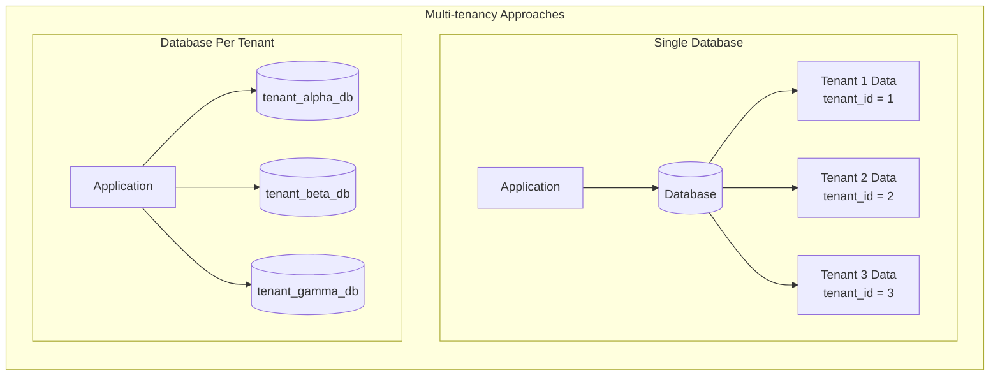
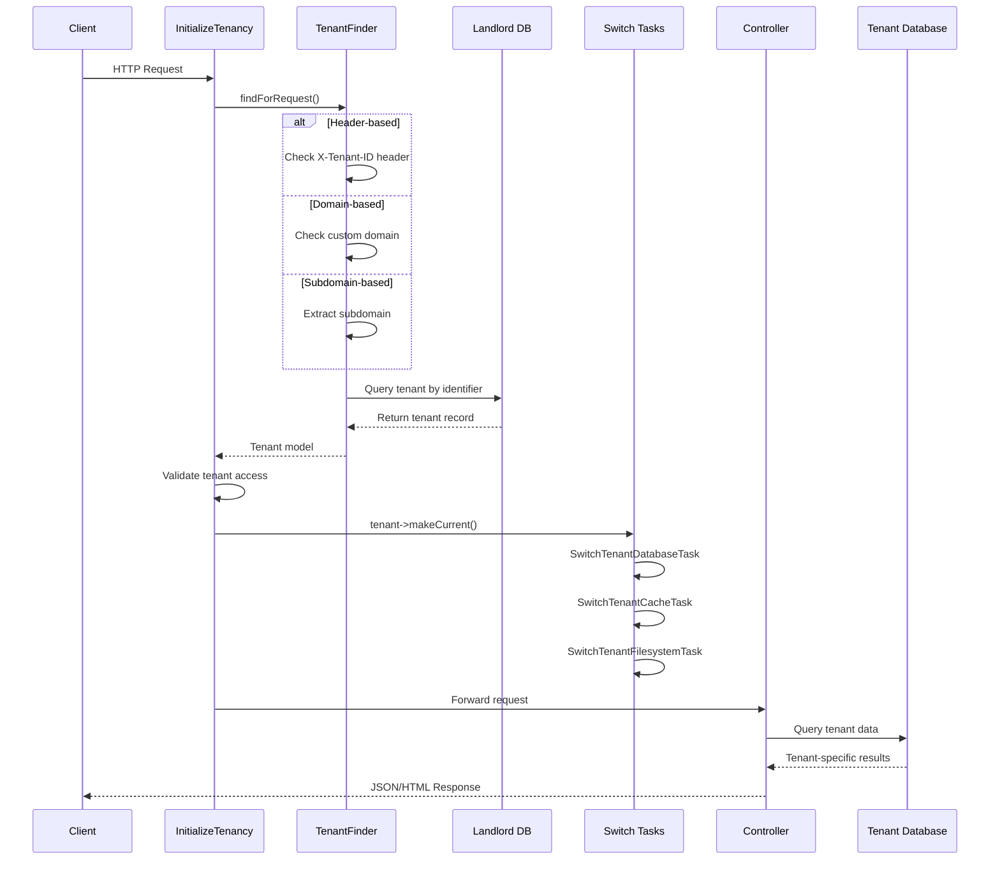
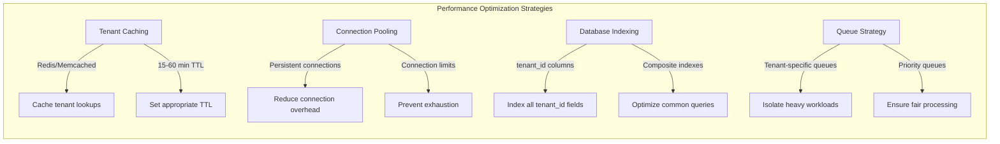

# How to Implement Multi-tenancy in Laravel

Author: [nawazdhandala](https://www.github.com/nawazdhandala)

Tags: Laravel, PHP, Multi-tenancy, SaaS

Description: A comprehensive guide to implementing multi-tenancy in Laravel applications using the Spatie package, covering tenant identification, database isolation strategies, asset separation, and production deployment patterns.

---

> Multi-tenancy enables a single application instance to serve multiple customers (tenants) while keeping their data isolated. This architectural pattern is fundamental to building scalable SaaS applications. This guide walks you through implementing multi-tenancy in Laravel using battle-tested patterns and the Spatie multi-tenancy package.

Building a SaaS platform requires careful consideration of how you will isolate customer data while maintaining a shared codebase. Multi-tenancy solves this challenge by allowing multiple tenants to coexist within the same application while ensuring complete data separation.

---

## Understanding Multi-tenancy Architecture

Before diving into implementation, it is essential to understand the different architectural approaches available for multi-tenancy.



| Approach | Data Isolation | Complexity | Scalability | Cost |
|----------|----------------|------------|-------------|------|
| **Single Database** | Low | Low | High | Low |
| **Schema Per Tenant** | Medium | Medium | Medium | Medium |
| **Database Per Tenant** | High | High | Varies | High |

---

## Project Setup and Installation

Let us start by setting up a new Laravel project and installing the required packages.

```bash
# Create a new Laravel project
composer create-project laravel/laravel saas-platform

# Navigate to the project directory
cd saas-platform

# Install the Spatie multi-tenancy package
composer require spatie/laravel-multitenancy

# Publish the configuration file
php artisan vendor:publish --provider="Spatie\Multitenancy\MultitenancyServiceProvider"
```

The following command creates the necessary migration files for the landlord database.

```bash
# Create migrations for tenant management
php artisan make:migration create_tenants_table --create=tenants
```

---

## Database Configuration

Configure your database connections to support both landlord (central) and tenant databases. The landlord database stores tenant metadata while each tenant has their own database.

```php
<?php

// config/database.php

return [
    'default' => env('DB_CONNECTION', 'landlord'),

    'connections' => [
        // Landlord database stores tenant metadata and shared data
        // This connection is always available and used for tenant management
        'landlord' => [
            'driver' => 'mysql',
            'url' => env('DATABASE_URL'),
            'host' => env('DB_HOST', '127.0.0.1'),
            'port' => env('DB_PORT', '3306'),
            'database' => env('DB_DATABASE', 'landlord'),
            'username' => env('DB_USERNAME', 'root'),
            'password' => env('DB_PASSWORD', ''),
            'unix_socket' => env('DB_SOCKET', ''),
            'charset' => 'utf8mb4',
            'collation' => 'utf8mb4_unicode_ci',
            'prefix' => '',
            'prefix_indexes' => true,
            'strict' => true,
            'engine' => null,
        ],

        // Tenant database connection - configured dynamically at runtime
        // The database name is swapped based on the current tenant
        'tenant' => [
            'driver' => 'mysql',
            'url' => env('DATABASE_URL'),
            'host' => env('DB_HOST', '127.0.0.1'),
            'port' => env('DB_PORT', '3306'),
            'database' => null, // Set dynamically per tenant
            'username' => env('DB_USERNAME', 'root'),
            'password' => env('DB_PASSWORD', ''),
            'unix_socket' => env('DB_SOCKET', ''),
            'charset' => 'utf8mb4',
            'collation' => 'utf8mb4_unicode_ci',
            'prefix' => '',
            'prefix_indexes' => true,
            'strict' => true,
            'engine' => null,
        ],
    ],
];
```

---

## Multi-tenancy Configuration

Configure the Spatie multi-tenancy package to define how tenants are identified and what actions occur when switching between tenants.

```php
<?php

// config/multitenancy.php

return [
    /*
    |--------------------------------------------------------------------------
    | Tenant Model
    |--------------------------------------------------------------------------
    |
    | The fully qualified class name of the tenant model. This model represents
    | each tenant in your SaaS application and stores their configuration.
    |
    */
    'tenant_model' => \App\Models\Tenant::class,

    /*
    |--------------------------------------------------------------------------
    | Current Tenant Container Key
    |--------------------------------------------------------------------------
    |
    | The key used to store the current tenant in Laravel's service container.
    | You can retrieve the current tenant using app('currentTenant').
    |
    */
    'current_tenant_container_key' => 'currentTenant',

    /*
    |--------------------------------------------------------------------------
    | Landlord Database Connection
    |--------------------------------------------------------------------------
    |
    | The database connection that holds tenant metadata and shared tables.
    | This connection is always available regardless of tenant context.
    |
    */
    'landlord_database_connection_name' => 'landlord',

    /*
    |--------------------------------------------------------------------------
    | Tenant Database Connection
    |--------------------------------------------------------------------------
    |
    | The database connection name used for tenant-specific data.
    | This connection is configured dynamically when a tenant is identified.
    |
    */
    'tenant_database_connection_name' => 'tenant',

    /*
    |--------------------------------------------------------------------------
    | Tenant Finder
    |--------------------------------------------------------------------------
    |
    | The class responsible for finding tenants from incoming requests.
    | You can create custom finders for different identification strategies.
    |
    */
    'tenant_finder' => \App\Multitenancy\TenantFinder::class,

    /*
    |--------------------------------------------------------------------------
    | Switch Tenant Tasks
    |--------------------------------------------------------------------------
    |
    | Tasks to execute when switching to a tenant. These run in order and
    | set up the environment for the tenant (database, cache, filesystem, etc).
    |
    */
    'switch_tenant_tasks' => [
        \Spatie\Multitenancy\Tasks\SwitchTenantDatabaseTask::class,
        \App\Multitenancy\Tasks\SwitchTenantCacheTask::class,
        \App\Multitenancy\Tasks\SwitchTenantFilesystemTask::class,
    ],

    /*
    |--------------------------------------------------------------------------
    | Queue Tenant Aware
    |--------------------------------------------------------------------------
    |
    | When enabled, queued jobs will automatically run in the context of the
    | tenant that was active when the job was dispatched.
    |
    */
    'queues_are_tenant_aware_by_default' => true,
];
```

---

## Creating the Tenant Model

The Tenant model represents each customer in your SaaS application. It stores configuration, subscription details, and database connection information.

```php
<?php

// app/Models/Tenant.php

namespace App\Models;

use Illuminate\Support\Str;
use Illuminate\Database\Eloquent\Model;
use Spatie\Multitenancy\Models\Tenant as BaseTenant;
use Illuminate\Database\Eloquent\Factories\HasFactory;

/**
 * Tenant Model
 *
 * Represents a customer organization in the SaaS platform.
 * Each tenant has isolated data, configuration, and optionally
 * their own database.
 */
class Tenant extends BaseTenant
{
    use HasFactory;

    /**
     * The database connection for the tenant model itself.
     * Tenant metadata is always stored in the landlord database.
     *
     * @var string
     */
    protected $connection = 'landlord';

    /**
     * The attributes that are mass assignable.
     *
     * @var array<string>
     */
    protected $fillable = [
        'name',
        'slug',
        'domain',
        'database',
        'plan',
        'settings',
        'trial_ends_at',
        'is_active',
    ];

    /**
     * The attributes that should be cast.
     *
     * @var array<string, string>
     */
    protected $casts = [
        'settings' => 'array',
        'trial_ends_at' => 'datetime',
        'is_active' => 'boolean',
    ];

    /**
     * Subscription plan constants for type safety.
     */
    public const PLAN_FREE = 'free';
    public const PLAN_STARTER = 'starter';
    public const PLAN_PROFESSIONAL = 'professional';
    public const PLAN_ENTERPRISE = 'enterprise';

    /**
     * Boot the model and register event listeners.
     * Automatically generates slug and database name on creation.
     */
    protected static function booted(): void
    {
        static::creating(function (Tenant $tenant) {
            // Generate URL-friendly slug from tenant name
            if (empty($tenant->slug)) {
                $tenant->slug = Str::slug($tenant->name);
            }

            // Generate database name following naming convention
            if (empty($tenant->database)) {
                $prefix = config('multitenancy.database_prefix', 'tenant_');
                $tenant->database = $prefix . Str::snake($tenant->slug);
            }

            // Set default plan if not specified
            if (empty($tenant->plan)) {
                $tenant->plan = self::PLAN_FREE;
            }
        });
    }

    /**
     * Get the database connection configuration for this tenant.
     * Used by SwitchTenantDatabaseTask to configure the connection.
     *
     * @return array<string, mixed>
     */
    public function getDatabaseConfig(): array
    {
        return [
            'driver' => 'mysql',
            'host' => $this->getSetting('database_host', config('database.connections.tenant.host')),
            'port' => $this->getSetting('database_port', config('database.connections.tenant.port')),
            'database' => $this->database,
            'username' => config('database.connections.tenant.username'),
            'password' => config('database.connections.tenant.password'),
            'charset' => 'utf8mb4',
            'collation' => 'utf8mb4_unicode_ci',
            'prefix' => '',
            'strict' => true,
        ];
    }

    /**
     * Get a specific setting value from the settings JSON field.
     * Supports dot notation for nested values.
     *
     * @param string $key The setting key (supports dot notation)
     * @param mixed $default Default value if setting not found
     * @return mixed
     */
    public function getSetting(string $key, mixed $default = null): mixed
    {
        return data_get($this->settings, $key, $default);
    }

    /**
     * Update a specific setting value.
     * Supports dot notation for nested values.
     *
     * @param string $key The setting key
     * @param mixed $value The value to set
     * @return self
     */
    public function setSetting(string $key, mixed $value): self
    {
        $settings = $this->settings ?? [];
        data_set($settings, $key, $value);
        $this->settings = $settings;

        return $this;
    }

    /**
     * Check if the tenant has access to a specific feature.
     * Feature access is determined by the subscription plan.
     *
     * @param string $feature The feature identifier
     * @return bool
     */
    public function hasFeature(string $feature): bool
    {
        $featureMatrix = [
            self::PLAN_FREE => [
                'max_users' => 3,
                'max_projects' => 5,
                'api_access' => false,
                'custom_domain' => false,
                'sso' => false,
                'audit_logs' => false,
            ],
            self::PLAN_STARTER => [
                'max_users' => 10,
                'max_projects' => 25,
                'api_access' => true,
                'custom_domain' => false,
                'sso' => false,
                'audit_logs' => false,
            ],
            self::PLAN_PROFESSIONAL => [
                'max_users' => 50,
                'max_projects' => 100,
                'api_access' => true,
                'custom_domain' => true,
                'sso' => false,
                'audit_logs' => true,
            ],
            self::PLAN_ENTERPRISE => [
                'max_users' => PHP_INT_MAX,
                'max_projects' => PHP_INT_MAX,
                'api_access' => true,
                'custom_domain' => true,
                'sso' => true,
                'audit_logs' => true,
            ],
        ];

        $planFeatures = $featureMatrix[$this->plan] ?? $featureMatrix[self::PLAN_FREE];

        return $planFeatures[$feature] ?? false;
    }

    /**
     * Check if the tenant is on a trial period.
     *
     * @return bool
     */
    public function onTrial(): bool
    {
        return $this->trial_ends_at !== null && $this->trial_ends_at->isFuture();
    }

    /**
     * Check if the tenant's trial has expired.
     *
     * @return bool
     */
    public function trialExpired(): bool
    {
        return $this->trial_ends_at !== null && $this->trial_ends_at->isPast();
    }

    /**
     * Get the tenant's custom domain or subdomain URL.
     *
     * @return string
     */
    public function getUrl(): string
    {
        if ($this->domain) {
            return 'https://' . $this->domain;
        }

        $baseDomain = config('multitenancy.base_domain', 'example.com');
        return 'https://' . $this->slug . '.' . $baseDomain;
    }
}
```

---

## Tenant Database Migration

Create the migration for storing tenant information in the landlord database.

```php
<?php

// database/migrations/2026_02_02_000001_create_tenants_table.php

use Illuminate\Database\Migrations\Migration;
use Illuminate\Database\Schema\Blueprint;
use Illuminate\Support\Facades\Schema;

/**
 * Migration to create the tenants table in the landlord database.
 * This table stores metadata for all tenants in the SaaS platform.
 */
return new class extends Migration
{
    /**
     * The database connection for this migration.
     * Always runs on the landlord database.
     *
     * @var string
     */
    protected $connection = 'landlord';

    /**
     * Run the migrations.
     */
    public function up(): void
    {
        Schema::create('tenants', function (Blueprint $table) {
            // Primary key
            $table->id();

            // Tenant identification
            $table->string('name');
            $table->string('slug')->unique();
            $table->string('domain')->nullable()->unique();

            // Database configuration
            $table->string('database')->unique();

            // Subscription and billing
            $table->string('plan')->default('free');
            $table->timestamp('trial_ends_at')->nullable();

            // Status and configuration
            $table->boolean('is_active')->default(true);
            $table->json('settings')->nullable();

            // Timestamps and soft deletes
            $table->timestamps();
            $table->softDeletes();

            // Indexes for common queries
            $table->index('plan');
            $table->index('is_active');
            $table->index(['is_active', 'plan']);
        });
    }

    /**
     * Reverse the migrations.
     */
    public function down(): void
    {
        Schema::dropIfExists('tenants');
    }
};
```

---

## Tenant Finder Implementation

The TenantFinder class determines which tenant a request belongs to. This implementation supports subdomain, custom domain, and header-based identification.

```php
<?php

// app/Multitenancy/TenantFinder.php

namespace App\Multitenancy;

use App\Models\Tenant;
use Illuminate\Http\Request;
use Spatie\Multitenancy\Models\Concerns\UsesTenantModel;
use Spatie\Multitenancy\TenantFinder\TenantFinder as BaseTenantFinder;

/**
 * TenantFinder
 *
 * Identifies the current tenant from incoming HTTP requests.
 * Supports multiple identification strategies with fallback chain.
 */
class TenantFinder extends BaseTenantFinder
{
    use UsesTenantModel;

    /**
     * Find the tenant for the given request.
     * Tries multiple identification strategies in order of priority.
     *
     * @param Request $request The incoming HTTP request
     * @return Tenant|null The identified tenant or null
     */
    public function findForRequest(Request $request): ?Tenant
    {
        // Strategy 1: Check for tenant header (useful for API requests)
        $tenant = $this->findByHeader($request);
        if ($tenant) {
            return $tenant;
        }

        // Strategy 2: Check for custom domain
        $tenant = $this->findByDomain($request);
        if ($tenant) {
            return $tenant;
        }

        // Strategy 3: Check for subdomain
        $tenant = $this->findBySubdomain($request);
        if ($tenant) {
            return $tenant;
        }

        // Strategy 4: Check for path prefix
        return $this->findByPath($request);
    }

    /**
     * Find tenant by X-Tenant-ID header.
     * Used primarily for API requests from SPAs or mobile apps.
     *
     * @param Request $request
     * @return Tenant|null
     */
    protected function findByHeader(Request $request): ?Tenant
    {
        $tenantIdentifier = $request->header('X-Tenant-ID');

        if (empty($tenantIdentifier)) {
            return null;
        }

        return $this->getTenantModel()::query()
            ->where('is_active', true)
            ->where(function ($query) use ($tenantIdentifier) {
                $query->where('slug', $tenantIdentifier)
                      ->orWhere('id', $tenantIdentifier);
            })
            ->first();
    }

    /**
     * Find tenant by custom domain.
     * Supports white-label deployments where tenants have their own domain.
     *
     * @param Request $request
     * @return Tenant|null
     */
    protected function findByDomain(Request $request): ?Tenant
    {
        $host = $request->getHost();
        $baseDomain = config('multitenancy.base_domain', 'example.com');

        // Skip if this is the base domain or a subdomain of it
        if ($host === $baseDomain || str_ends_with($host, '.' . $baseDomain)) {
            return null;
        }

        return $this->getTenantModel()::query()
            ->where('is_active', true)
            ->where('domain', $host)
            ->first();
    }

    /**
     * Find tenant by subdomain.
     * Common pattern: acme.example.com, beta.example.com
     *
     * @param Request $request
     * @return Tenant|null
     */
    protected function findBySubdomain(Request $request): ?Tenant
    {
        $host = $request->getHost();
        $baseDomain = config('multitenancy.base_domain', 'example.com');

        // Check if host is a subdomain of base domain
        if (!str_ends_with($host, '.' . $baseDomain)) {
            return null;
        }

        // Extract subdomain
        $subdomain = str_replace('.' . $baseDomain, '', $host);

        // Skip reserved subdomains
        $reserved = ['www', 'api', 'admin', 'app', 'mail', 'smtp'];
        if (in_array($subdomain, $reserved)) {
            return null;
        }

        return $this->getTenantModel()::query()
            ->where('is_active', true)
            ->where('slug', $subdomain)
            ->first();
    }

    /**
     * Find tenant by URL path prefix.
     * Pattern: example.com/tenant-slug/resource
     *
     * @param Request $request
     * @return Tenant|null
     */
    protected function findByPath(Request $request): ?Tenant
    {
        $segments = $request->segments();

        if (empty($segments)) {
            return null;
        }

        $potentialSlug = $segments[0];

        // Skip if first segment looks like a route
        $reservedPaths = ['api', 'admin', 'auth', 'login', 'register', 'webhook'];
        if (in_array($potentialSlug, $reservedPaths)) {
            return null;
        }

        return $this->getTenantModel()::query()
            ->where('is_active', true)
            ->where('slug', $potentialSlug)
            ->first();
    }
}
```

---

## Tenant Switch Tasks

Switch tasks execute when transitioning between tenants. They configure the environment for the tenant context.

```php
<?php

// app/Multitenancy/Tasks/SwitchTenantCacheTask.php

namespace App\Multitenancy\Tasks;

use App\Models\Tenant;
use Spatie\Multitenancy\Tasks\SwitchTenantTask;
use Illuminate\Support\Facades\Cache;

/**
 * SwitchTenantCacheTask
 *
 * Configures the cache prefix when switching tenants.
 * Ensures each tenant has isolated cache storage.
 */
class SwitchTenantCacheTask implements SwitchTenantTask
{
    /**
     * The original cache prefix before tenant switch.
     *
     * @var string|null
     */
    protected ?string $originalPrefix = null;

    /**
     * Execute when making a tenant current.
     * Sets a tenant-specific cache prefix.
     *
     * @param Tenant $tenant The tenant being made current
     */
    public function makeCurrent(Tenant $tenant): void
    {
        // Store original prefix for restoration
        $this->originalPrefix = config('cache.prefix');

        // Set tenant-specific cache prefix
        $tenantPrefix = config('cache.prefix') . '_tenant_' . $tenant->id;
        config(['cache.prefix' => $tenantPrefix]);

        // Clear the cache store to use new prefix
        Cache::forgetDriver(config('cache.default'));
    }

    /**
     * Execute when forgetting the current tenant.
     * Restores the original cache prefix.
     */
    public function forgetCurrent(): void
    {
        if ($this->originalPrefix !== null) {
            config(['cache.prefix' => $this->originalPrefix]);
            Cache::forgetDriver(config('cache.default'));
        }
    }
}
```

Configure filesystem isolation for tenant-specific file storage.

```php
<?php

// app/Multitenancy/Tasks/SwitchTenantFilesystemTask.php

namespace App\Multitenancy\Tasks;

use App\Models\Tenant;
use Spatie\Multitenancy\Tasks\SwitchTenantTask;
use Illuminate\Support\Facades\Storage;

/**
 * SwitchTenantFilesystemTask
 *
 * Configures filesystem paths when switching tenants.
 * Each tenant gets their own storage directory.
 */
class SwitchTenantFilesystemTask implements SwitchTenantTask
{
    /**
     * Original filesystem configuration.
     *
     * @var array<string, mixed>
     */
    protected array $originalConfig = [];

    /**
     * Execute when making a tenant current.
     * Configures tenant-specific storage paths.
     *
     * @param Tenant $tenant
     */
    public function makeCurrent(Tenant $tenant): void
    {
        // Store original configuration
        $this->originalConfig = [
            'local_root' => config('filesystems.disks.local.root'),
            'public_root' => config('filesystems.disks.public.root'),
        ];

        // Configure tenant-specific storage paths
        $tenantPath = 'tenants/' . $tenant->slug;

        config([
            'filesystems.disks.local.root' => storage_path('app/' . $tenantPath),
            'filesystems.disks.public.root' => storage_path('app/public/' . $tenantPath),
        ]);

        // Ensure directories exist
        $this->ensureDirectoriesExist($tenant);
    }

    /**
     * Execute when forgetting the current tenant.
     * Restores original filesystem configuration.
     */
    public function forgetCurrent(): void
    {
        if (!empty($this->originalConfig)) {
            config([
                'filesystems.disks.local.root' => $this->originalConfig['local_root'],
                'filesystems.disks.public.root' => $this->originalConfig['public_root'],
            ]);
        }
    }

    /**
     * Ensure tenant storage directories exist.
     *
     * @param Tenant $tenant
     */
    protected function ensureDirectoriesExist(Tenant $tenant): void
    {
        $paths = [
            storage_path('app/tenants/' . $tenant->slug),
            storage_path('app/public/tenants/' . $tenant->slug),
        ];

        foreach ($paths as $path) {
            if (!is_dir($path)) {
                mkdir($path, 0755, true);
            }
        }
    }
}
```

---

## Tenant-Aware Middleware

Create middleware to identify and activate the tenant for each request.

```php
<?php

// app/Http/Middleware/InitializeTenancy.php

namespace App\Http\Middleware;

use Closure;
use App\Models\Tenant;
use Illuminate\Http\Request;
use App\Multitenancy\TenantFinder;
use Spatie\Multitenancy\Exceptions\NoCurrentTenant;
use Symfony\Component\HttpFoundation\Response;

/**
 * InitializeTenancy Middleware
 *
 * Identifies the tenant from the request and makes it current.
 * Must be applied to all tenant-scoped routes.
 */
class InitializeTenancy
{
    /**
     * Create middleware instance with tenant finder.
     *
     * @param TenantFinder $tenantFinder
     */
    public function __construct(
        protected TenantFinder $tenantFinder
    ) {}

    /**
     * Handle an incoming request.
     *
     * @param Request $request
     * @param Closure $next
     * @param bool $required Whether a tenant is required
     * @return Response
     */
    public function handle(Request $request, Closure $next, bool $required = true): Response
    {
        $tenant = $this->tenantFinder->findForRequest($request);

        if ($tenant === null && $required) {
            return $this->handleMissingTenant($request);
        }

        if ($tenant !== null) {
            // Validate tenant is accessible
            if (!$this->validateTenantAccess($tenant)) {
                return $this->handleInactiveTenant($tenant, $request);
            }

            // Make tenant current - this triggers all switch tasks
            $tenant->makeCurrent();

            // Share tenant with all views
            view()->share('currentTenant', $tenant);

            // Add tenant to request for easy access in controllers
            $request->attributes->set('tenant', $tenant);
        }

        return $next($request);
    }

    /**
     * Handle requests where no tenant was found.
     *
     * @param Request $request
     * @return Response
     */
    protected function handleMissingTenant(Request $request): Response
    {
        if ($request->expectsJson()) {
            return response()->json([
                'error' => 'Tenant not found',
                'message' => 'Unable to identify tenant from request',
            ], 404);
        }

        return redirect()->route('tenant.not-found');
    }

    /**
     * Handle requests for inactive or suspended tenants.
     *
     * @param Tenant $tenant
     * @param Request $request
     * @return Response
     */
    protected function handleInactiveTenant(Tenant $tenant, Request $request): Response
    {
        if ($request->expectsJson()) {
            return response()->json([
                'error' => 'Tenant inactive',
                'message' => 'This account has been deactivated',
            ], 403);
        }

        return redirect()->route('tenant.inactive');
    }

    /**
     * Validate that the tenant can be accessed.
     *
     * @param Tenant $tenant
     * @return bool
     */
    protected function validateTenantAccess(Tenant $tenant): bool
    {
        // Check if tenant is active
        if (!$tenant->is_active) {
            return false;
        }

        // Check if trial has expired (and no paid plan)
        if ($tenant->trialExpired() && $tenant->plan === Tenant::PLAN_FREE) {
            return false;
        }

        return true;
    }

    /**
     * Cleanup after request is complete.
     *
     * @param Request $request
     * @param Response $response
     */
    public function terminate(Request $request, Response $response): void
    {
        // Forget the current tenant to prevent state leakage
        Tenant::forgetCurrent();
    }
}
```

---

## Request Flow Diagram

The following diagram illustrates how a request flows through the multi-tenancy system.



---

## Tenant Provisioning Service

The provisioning service handles creating new tenants, including database setup and initial configuration.

```php
<?php

// app/Services/TenantProvisioningService.php

namespace App\Services;

use App\Models\Tenant;
use Illuminate\Support\Str;
use Illuminate\Support\Facades\DB;
use Illuminate\Support\Facades\Hash;
use Illuminate\Support\Facades\Artisan;
use App\Exceptions\TenantProvisioningException;

/**
 * TenantProvisioningService
 *
 * Handles the complete lifecycle of tenant provisioning including
 * database creation, migrations, and initial data seeding.
 */
class TenantProvisioningService
{
    /**
     * Provision a new tenant with all required resources.
     * This is the main entry point for tenant onboarding.
     *
     * @param array $tenantData Tenant configuration data
     * @param array $adminData Initial admin user data
     * @return Tenant The created and configured tenant
     * @throws TenantProvisioningException
     */
    public function provision(array $tenantData, array $adminData): Tenant
    {
        // Use transaction on landlord database for tenant record
        return DB::connection('landlord')->transaction(function () use ($tenantData, $adminData) {
            // Step 1: Create tenant record
            $tenant = $this->createTenantRecord($tenantData);

            // Step 2: Create tenant database
            $this->createTenantDatabase($tenant);

            // Step 3: Run tenant migrations
            $this->runTenantMigrations($tenant);

            // Step 4: Create admin user in tenant database
            $this->createAdminUser($tenant, $adminData);

            // Step 5: Seed default data
            $this->seedDefaultData($tenant);

            // Step 6: Send welcome notification
            $this->sendWelcomeNotification($tenant, $adminData);

            return $tenant->fresh();
        });
    }

    /**
     * Create the tenant record in the landlord database.
     *
     * @param array $data
     * @return Tenant
     */
    protected function createTenantRecord(array $data): Tenant
    {
        return Tenant::create([
            'name' => $data['name'],
            'slug' => $data['slug'] ?? Str::slug($data['name']),
            'domain' => $data['domain'] ?? null,
            'plan' => $data['plan'] ?? Tenant::PLAN_FREE,
            'trial_ends_at' => now()->addDays(14),
            'is_active' => true,
            'settings' => $data['settings'] ?? [
                'timezone' => 'UTC',
                'date_format' => 'Y-m-d',
                'notifications_enabled' => true,
            ],
        ]);
    }

    /**
     * Create the tenant's dedicated database.
     *
     * @param Tenant $tenant
     * @throws TenantProvisioningException
     */
    protected function createTenantDatabase(Tenant $tenant): void
    {
        $databaseName = $tenant->database;

        try {
            // Create database with proper character set
            DB::connection('landlord')->statement(
                "CREATE DATABASE IF NOT EXISTS `{$databaseName}`
                 CHARACTER SET utf8mb4
                 COLLATE utf8mb4_unicode_ci"
            );
        } catch (\Exception $e) {
            throw new TenantProvisioningException(
                "Failed to create database for tenant: {$e->getMessage()}"
            );
        }
    }

    /**
     * Run migrations for the tenant's database.
     *
     * @param Tenant $tenant
     */
    protected function runTenantMigrations(Tenant $tenant): void
    {
        // Make tenant current to configure database connection
        $tenant->makeCurrent();

        try {
            // Run tenant-specific migrations
            Artisan::call('migrate', [
                '--database' => 'tenant',
                '--path' => 'database/migrations/tenant',
                '--force' => true,
            ]);
        } finally {
            // Always forget tenant to reset state
            Tenant::forgetCurrent();
        }
    }

    /**
     * Create the initial admin user for the tenant.
     *
     * @param Tenant $tenant
     * @param array $adminData
     */
    protected function createAdminUser(Tenant $tenant, array $adminData): void
    {
        $tenant->makeCurrent();

        try {
            // Create user in tenant database
            DB::connection('tenant')->table('users')->insert([
                'name' => $adminData['name'],
                'email' => $adminData['email'],
                'password' => Hash::make($adminData['password']),
                'role' => 'admin',
                'email_verified_at' => now(),
                'created_at' => now(),
                'updated_at' => now(),
            ]);
        } finally {
            Tenant::forgetCurrent();
        }
    }

    /**
     * Seed default data for the tenant.
     *
     * @param Tenant $tenant
     */
    protected function seedDefaultData(Tenant $tenant): void
    {
        $tenant->makeCurrent();

        try {
            Artisan::call('db:seed', [
                '--class' => 'TenantSeeder',
                '--database' => 'tenant',
                '--force' => true,
            ]);
        } finally {
            Tenant::forgetCurrent();
        }
    }

    /**
     * Send welcome notification to the new tenant.
     *
     * @param Tenant $tenant
     * @param array $adminData
     */
    protected function sendWelcomeNotification(Tenant $tenant, array $adminData): void
    {
        // Dispatch notification job
        // This runs outside tenant context since it uses landlord queue
        dispatch(new \App\Jobs\SendWelcomeEmail($tenant, $adminData['email']));
    }

    /**
     * Delete a tenant and all associated resources.
     * Use with extreme caution - this is destructive and irreversible.
     *
     * @param Tenant $tenant
     * @param bool $dropDatabase Whether to drop the database
     * @return bool
     */
    public function deprovision(Tenant $tenant, bool $dropDatabase = false): bool
    {
        return DB::connection('landlord')->transaction(function () use ($tenant, $dropDatabase) {
            // Optionally drop the tenant database
            if ($dropDatabase && $tenant->database) {
                DB::connection('landlord')->statement(
                    "DROP DATABASE IF EXISTS `{$tenant->database}`"
                );
            }

            // Soft delete the tenant record
            $tenant->delete();

            return true;
        });
    }
}
```

---

## Tenant-Scoped Models

Create a trait for automatic tenant scoping on models within the tenant database.

```php
<?php

// app/Models/Concerns/TenantScoped.php

namespace App\Models\Concerns;

use Illuminate\Database\Eloquent\Builder;

/**
 * TenantScoped Trait
 *
 * For single-database multi-tenancy where all tenants share tables.
 * Automatically filters queries by tenant_id and sets tenant_id on creation.
 */
trait TenantScoped
{
    /**
     * Boot the trait to add global scope and event listeners.
     */
    protected static function bootTenantScoped(): void
    {
        // Add global scope to filter all queries by current tenant
        static::addGlobalScope('tenant', function (Builder $builder) {
            $tenant = app('currentTenant');

            if ($tenant) {
                $builder->where($builder->getModel()->getTable() . '.tenant_id', $tenant->id);
            }
        });

        // Automatically set tenant_id when creating records
        static::creating(function ($model) {
            $tenant = app('currentTenant');

            if ($tenant && !$model->tenant_id) {
                $model->tenant_id = $tenant->id;
            }
        });
    }

    /**
     * Query without tenant scope.
     * Use sparingly and only for admin/system operations.
     *
     * @param Builder $query
     * @return Builder
     */
    public function scopeWithoutTenantScope(Builder $query): Builder
    {
        return $query->withoutGlobalScope('tenant');
    }

    /**
     * Query for a specific tenant.
     * Useful for cross-tenant operations in admin context.
     *
     * @param Builder $query
     * @param int $tenantId
     * @return Builder
     */
    public function scopeForTenant(Builder $query, int $tenantId): Builder
    {
        return $query->withoutGlobalScope('tenant')
                     ->where('tenant_id', $tenantId);
    }
}
```

Example model using the tenant database connection.

```php
<?php

// app/Models/Project.php

namespace App\Models;

use Illuminate\Database\Eloquent\Model;
use Illuminate\Database\Eloquent\SoftDeletes;
use Illuminate\Database\Eloquent\Relations\HasMany;
use Illuminate\Database\Eloquent\Relations\BelongsTo;
use Illuminate\Database\Eloquent\Factories\HasFactory;

/**
 * Project Model
 *
 * Represents a project within a tenant's workspace.
 * Uses the tenant database connection.
 */
class Project extends Model
{
    use HasFactory, SoftDeletes;

    /**
     * The database connection for this model.
     * Projects are stored in tenant-specific databases.
     *
     * @var string
     */
    protected $connection = 'tenant';

    /**
     * The attributes that are mass assignable.
     *
     * @var array<string>
     */
    protected $fillable = [
        'name',
        'description',
        'status',
        'owner_id',
        'settings',
        'due_date',
    ];

    /**
     * The attributes that should be cast.
     *
     * @var array<string, string>
     */
    protected $casts = [
        'settings' => 'array',
        'due_date' => 'date',
    ];

    /**
     * Project status constants.
     */
    public const STATUS_DRAFT = 'draft';
    public const STATUS_ACTIVE = 'active';
    public const STATUS_COMPLETED = 'completed';
    public const STATUS_ARCHIVED = 'archived';

    /**
     * Get the user who owns this project.
     *
     * @return BelongsTo
     */
    public function owner(): BelongsTo
    {
        return $this->belongsTo(User::class, 'owner_id');
    }

    /**
     * Get all tasks belonging to this project.
     *
     * @return HasMany
     */
    public function tasks(): HasMany
    {
        return $this->hasMany(Task::class);
    }

    /**
     * Scope query to active projects only.
     *
     * @param \Illuminate\Database\Eloquent\Builder $query
     * @return \Illuminate\Database\Eloquent\Builder
     */
    public function scopeActive($query)
    {
        return $query->where('status', self::STATUS_ACTIVE);
    }

    /**
     * Scope query to projects due within specified days.
     *
     * @param \Illuminate\Database\Eloquent\Builder $query
     * @param int $days
     * @return \Illuminate\Database\Eloquent\Builder
     */
    public function scopeDueWithin($query, int $days)
    {
        return $query->whereNotNull('due_date')
                     ->whereDate('due_date', '<=', now()->addDays($days));
    }

    /**
     * Check if project is overdue.
     *
     * @return bool
     */
    public function isOverdue(): bool
    {
        return $this->due_date !== null && $this->due_date->isPast();
    }
}
```

---

## Tenant API Controller

Create an API controller for managing tenant resources.

```php
<?php

// app/Http/Controllers/Api/ProjectController.php

namespace App\Http\Controllers\Api;

use App\Models\Project;
use Illuminate\Http\Request;
use Illuminate\Http\JsonResponse;
use App\Http\Controllers\Controller;
use Illuminate\Http\Resources\Json\JsonResource;

/**
 * ProjectController
 *
 * Handles CRUD operations for projects within a tenant context.
 * All operations are automatically scoped to the current tenant
 * via the tenant database connection.
 */
class ProjectController extends Controller
{
    /**
     * Display a paginated listing of projects.
     *
     * @param Request $request
     * @return JsonResponse
     */
    public function index(Request $request): JsonResponse
    {
        // Build query with optional filters
        $projects = Project::query()
            ->with(['owner:id,name,email'])
            ->when($request->filled('status'), function ($query) use ($request) {
                $query->where('status', $request->status);
            })
            ->when($request->filled('search'), function ($query) use ($request) {
                $query->where('name', 'like', '%' . $request->search . '%');
            })
            ->when($request->filled('owner_id'), function ($query) use ($request) {
                $query->where('owner_id', $request->owner_id);
            })
            ->orderBy($request->get('sort_by', 'created_at'), $request->get('sort_dir', 'desc'))
            ->paginate($request->get('per_page', 15));

        return response()->json([
            'success' => true,
            'data' => $projects,
        ]);
    }

    /**
     * Store a newly created project.
     *
     * @param Request $request
     * @return JsonResponse
     */
    public function store(Request $request): JsonResponse
    {
        $validated = $request->validate([
            'name' => 'required|string|max:255',
            'description' => 'nullable|string|max:5000',
            'status' => 'nullable|in:draft,active',
            'due_date' => 'nullable|date|after:today',
            'settings' => 'nullable|array',
        ]);

        // Check feature limits for the tenant
        $tenant = app('currentTenant');
        $projectCount = Project::count();
        $maxProjects = $tenant->hasFeature('max_projects');

        if ($projectCount >= $maxProjects) {
            return response()->json([
                'success' => false,
                'error' => 'Project limit reached',
                'message' => "Your plan allows up to {$maxProjects} projects. Please upgrade to create more.",
            ], 403);
        }

        $project = Project::create([
            'name' => $validated['name'],
            'description' => $validated['description'] ?? null,
            'status' => $validated['status'] ?? Project::STATUS_DRAFT,
            'due_date' => $validated['due_date'] ?? null,
            'owner_id' => $request->user()->id,
            'settings' => $validated['settings'] ?? [],
        ]);

        return response()->json([
            'success' => true,
            'message' => 'Project created successfully',
            'data' => $project->load('owner:id,name,email'),
        ], 201);
    }

    /**
     * Display the specified project.
     *
     * @param Project $project
     * @return JsonResponse
     */
    public function show(Project $project): JsonResponse
    {
        return response()->json([
            'success' => true,
            'data' => $project->load(['owner:id,name,email', 'tasks']),
        ]);
    }

    /**
     * Update the specified project.
     *
     * @param Request $request
     * @param Project $project
     * @return JsonResponse
     */
    public function update(Request $request, Project $project): JsonResponse
    {
        $validated = $request->validate([
            'name' => 'sometimes|required|string|max:255',
            'description' => 'nullable|string|max:5000',
            'status' => 'nullable|in:draft,active,completed,archived',
            'due_date' => 'nullable|date',
            'settings' => 'nullable|array',
        ]);

        $project->update($validated);

        return response()->json([
            'success' => true,
            'message' => 'Project updated successfully',
            'data' => $project->fresh()->load('owner:id,name,email'),
        ]);
    }

    /**
     * Remove the specified project (soft delete).
     *
     * @param Project $project
     * @return JsonResponse
     */
    public function destroy(Project $project): JsonResponse
    {
        $project->delete();

        return response()->json([
            'success' => true,
            'message' => 'Project deleted successfully',
        ]);
    }
}
```

---

## Queue Jobs with Tenant Context

Ensure queued jobs maintain tenant context when processing.

```php
<?php

// app/Jobs/GenerateTenantReport.php

namespace App\Jobs;

use App\Models\Tenant;
use App\Models\Project;
use Illuminate\Bus\Queueable;
use Illuminate\Queue\SerializesModels;
use Illuminate\Queue\InteractsWithQueue;
use Illuminate\Contracts\Queue\ShouldQueue;
use Illuminate\Foundation\Bus\Dispatchable;
use Spatie\Multitenancy\Jobs\TenantAware;

/**
 * GenerateTenantReport Job
 *
 * Generates a report for a specific tenant.
 * Implements TenantAware to automatically restore tenant context.
 */
class GenerateTenantReport implements ShouldQueue, TenantAware
{
    use Dispatchable, InteractsWithQueue, Queueable, SerializesModels;

    /**
     * The number of times the job may be attempted.
     *
     * @var int
     */
    public $tries = 3;

    /**
     * The number of seconds to wait before retrying.
     *
     * @var array<int>
     */
    public $backoff = [60, 300, 900];

    /**
     * Create a new job instance.
     *
     * @param string $reportType The type of report to generate
     * @param array $options Additional report options
     */
    public function __construct(
        public string $reportType,
        public array $options = []
    ) {}

    /**
     * Execute the job.
     * Tenant context is automatically restored by TenantAware interface.
     *
     * @return void
     */
    public function handle(): void
    {
        $tenant = app('currentTenant');

        if (!$tenant) {
            $this->fail(new \RuntimeException('No tenant context available'));
            return;
        }

        // Generate report based on type
        $reportData = match ($this->reportType) {
            'projects_summary' => $this->generateProjectsSummary(),
            'user_activity' => $this->generateUserActivity(),
            'storage_usage' => $this->generateStorageUsage(),
            default => throw new \InvalidArgumentException("Unknown report type: {$this->reportType}"),
        };

        // Store or send the report
        $this->storeReport($tenant, $reportData);
    }

    /**
     * Generate projects summary report.
     *
     * @return array
     */
    protected function generateProjectsSummary(): array
    {
        return [
            'total_projects' => Project::count(),
            'active_projects' => Project::active()->count(),
            'completed_projects' => Project::where('status', Project::STATUS_COMPLETED)->count(),
            'overdue_projects' => Project::whereNotNull('due_date')
                                         ->whereDate('due_date', '<', now())
                                         ->where('status', '!=', Project::STATUS_COMPLETED)
                                         ->count(),
            'generated_at' => now()->toIso8601String(),
        ];
    }

    /**
     * Generate user activity report.
     *
     * @return array
     */
    protected function generateUserActivity(): array
    {
        // Implementation depends on your activity tracking
        return [
            'generated_at' => now()->toIso8601String(),
        ];
    }

    /**
     * Generate storage usage report.
     *
     * @return array
     */
    protected function generateStorageUsage(): array
    {
        $tenant = app('currentTenant');
        $storagePath = storage_path('app/tenants/' . $tenant->slug);

        $totalSize = 0;
        if (is_dir($storagePath)) {
            $iterator = new \RecursiveIteratorIterator(
                new \RecursiveDirectoryIterator($storagePath)
            );
            foreach ($iterator as $file) {
                if ($file->isFile()) {
                    $totalSize += $file->getSize();
                }
            }
        }

        return [
            'total_bytes' => $totalSize,
            'total_formatted' => $this->formatBytes($totalSize),
            'generated_at' => now()->toIso8601String(),
        ];
    }

    /**
     * Store the generated report.
     *
     * @param Tenant $tenant
     * @param array $data
     */
    protected function storeReport(Tenant $tenant, array $data): void
    {
        // Store in database or filesystem
        $filename = sprintf(
            'reports/%s/%s_%s.json',
            $this->reportType,
            now()->format('Y-m-d'),
            now()->format('His')
        );

        \Storage::disk('local')->put($filename, json_encode($data, JSON_PRETTY_PRINT));
    }

    /**
     * Format bytes to human-readable string.
     *
     * @param int $bytes
     * @return string
     */
    protected function formatBytes(int $bytes): string
    {
        $units = ['B', 'KB', 'MB', 'GB', 'TB'];
        $factor = floor((strlen((string) $bytes) - 1) / 3);

        return sprintf('%.2f %s', $bytes / pow(1024, $factor), $units[$factor]);
    }

    /**
     * Handle a job failure.
     *
     * @param \Throwable $exception
     */
    public function failed(\Throwable $exception): void
    {
        \Log::error('Tenant report generation failed', [
            'report_type' => $this->reportType,
            'error' => $exception->getMessage(),
        ]);
    }
}
```

---

## Testing Multi-tenant Applications

Write comprehensive tests to verify tenant isolation and functionality.

```php
<?php

// tests/Feature/MultiTenancyTest.php

namespace Tests\Feature;

use Tests\TestCase;
use App\Models\User;
use App\Models\Tenant;
use App\Models\Project;
use Illuminate\Foundation\Testing\RefreshDatabase;
use Illuminate\Foundation\Testing\DatabaseMigrations;

/**
 * MultiTenancyTest
 *
 * Tests for multi-tenant functionality including
 * tenant isolation, identification, and data scoping.
 */
class MultiTenancyTest extends TestCase
{
    use RefreshDatabase;

    /**
     * Set up the test environment.
     */
    protected function setUp(): void
    {
        parent::setUp();

        // Run landlord migrations
        $this->artisan('migrate', ['--database' => 'landlord']);
    }

    /**
     * Test that tenants are properly identified by subdomain.
     */
    public function test_tenant_identified_by_subdomain(): void
    {
        $tenant = Tenant::factory()->create([
            'slug' => 'acme',
            'is_active' => true,
        ]);

        // Provision tenant database
        $this->provisionTenantDatabase($tenant);

        $response = $this->withHeaders([
            'Host' => 'acme.example.com',
        ])->get('/api/projects');

        $response->assertOk();
    }

    /**
     * Test that tenant is identified by custom domain.
     */
    public function test_tenant_identified_by_custom_domain(): void
    {
        $tenant = Tenant::factory()->create([
            'slug' => 'widgets',
            'domain' => 'widgets.io',
            'is_active' => true,
        ]);

        $this->provisionTenantDatabase($tenant);

        $response = $this->withHeaders([
            'Host' => 'widgets.io',
        ])->get('/api/projects');

        $response->assertOk();
    }

    /**
     * Test that tenant is identified by header.
     */
    public function test_tenant_identified_by_header(): void
    {
        $tenant = Tenant::factory()->create([
            'slug' => 'testing',
            'is_active' => true,
        ]);

        $this->provisionTenantDatabase($tenant);

        $response = $this->withHeaders([
            'X-Tenant-ID' => 'testing',
        ])->get('/api/projects');

        $response->assertOk();
    }

    /**
     * Test that inactive tenants cannot be accessed.
     */
    public function test_inactive_tenant_returns_forbidden(): void
    {
        $tenant = Tenant::factory()->create([
            'slug' => 'inactive',
            'is_active' => false,
        ]);

        $response = $this->withHeaders([
            'X-Tenant-ID' => 'inactive',
        ])->get('/api/projects');

        $response->assertForbidden();
    }

    /**
     * Test that unknown tenant returns not found.
     */
    public function test_unknown_tenant_returns_not_found(): void
    {
        $response = $this->withHeaders([
            'X-Tenant-ID' => 'nonexistent',
        ])->get('/api/projects');

        $response->assertNotFound();
    }

    /**
     * Test data isolation between tenants.
     */
    public function test_data_is_isolated_between_tenants(): void
    {
        // Create two tenants
        $tenant1 = Tenant::factory()->create(['slug' => 'tenant-one']);
        $tenant2 = Tenant::factory()->create(['slug' => 'tenant-two']);

        $this->provisionTenantDatabase($tenant1);
        $this->provisionTenantDatabase($tenant2);

        // Create user and project for tenant 1
        $tenant1->makeCurrent();
        $user1 = User::factory()->create();
        $project1 = Project::factory()->create([
            'name' => 'Tenant 1 Project',
            'owner_id' => $user1->id,
        ]);
        Tenant::forgetCurrent();

        // Create user and project for tenant 2
        $tenant2->makeCurrent();
        $user2 = User::factory()->create();
        $project2 = Project::factory()->create([
            'name' => 'Tenant 2 Project',
            'owner_id' => $user2->id,
        ]);
        Tenant::forgetCurrent();

        // Verify tenant 1 only sees their project
        $tenant1->makeCurrent();
        $this->assertEquals(1, Project::count());
        $this->assertEquals('Tenant 1 Project', Project::first()->name);
        Tenant::forgetCurrent();

        // Verify tenant 2 only sees their project
        $tenant2->makeCurrent();
        $this->assertEquals(1, Project::count());
        $this->assertEquals('Tenant 2 Project', Project::first()->name);
        Tenant::forgetCurrent();
    }

    /**
     * Test feature access based on tenant plan.
     */
    public function test_tenant_feature_access_by_plan(): void
    {
        $freeTenant = Tenant::factory()->create(['plan' => Tenant::PLAN_FREE]);
        $proTenant = Tenant::factory()->create(['plan' => Tenant::PLAN_PROFESSIONAL]);

        // Free tenant should not have custom domain feature
        $this->assertFalse($freeTenant->hasFeature('custom_domain'));

        // Pro tenant should have custom domain feature
        $this->assertTrue($proTenant->hasFeature('custom_domain'));
    }

    /**
     * Test tenant trial expiration.
     */
    public function test_tenant_trial_status(): void
    {
        $activeTrial = Tenant::factory()->create([
            'trial_ends_at' => now()->addDays(7),
        ]);

        $expiredTrial = Tenant::factory()->create([
            'trial_ends_at' => now()->subDays(1),
        ]);

        $this->assertTrue($activeTrial->onTrial());
        $this->assertFalse($activeTrial->trialExpired());

        $this->assertFalse($expiredTrial->onTrial());
        $this->assertTrue($expiredTrial->trialExpired());
    }

    /**
     * Helper to provision a tenant database for testing.
     *
     * @param Tenant $tenant
     */
    protected function provisionTenantDatabase(Tenant $tenant): void
    {
        $tenant->makeCurrent();
        $this->artisan('migrate', [
            '--database' => 'tenant',
            '--path' => 'database/migrations/tenant',
        ]);
        Tenant::forgetCurrent();
    }
}
```

---

## Route Configuration

Configure routes with proper middleware for tenant-scoped requests.

```php
<?php

// routes/api.php

use Illuminate\Support\Facades\Route;
use App\Http\Controllers\Api\AuthController;
use App\Http\Controllers\Api\ProjectController;
use App\Http\Controllers\Api\TenantSettingsController;

/*
|--------------------------------------------------------------------------
| Tenant-Scoped API Routes
|--------------------------------------------------------------------------
|
| Routes that require tenant identification. The InitializeTenancy
| middleware will identify and activate the tenant context.
|
*/

Route::middleware(['api', 'tenant'])->group(function () {
    // Authentication routes within tenant context
    Route::post('/auth/login', [AuthController::class, 'login']);
    Route::post('/auth/logout', [AuthController::class, 'logout'])
         ->middleware('auth:sanctum');

    // Protected routes requiring authentication
    Route::middleware('auth:sanctum')->group(function () {
        // User profile
        Route::get('/me', [AuthController::class, 'me']);
        Route::put('/me', [AuthController::class, 'updateProfile']);

        // Project management
        Route::apiResource('projects', ProjectController::class);

        // Tenant settings (admin only)
        Route::middleware('can:manage-settings')->prefix('settings')->group(function () {
            Route::get('/', [TenantSettingsController::class, 'index']);
            Route::put('/', [TenantSettingsController::class, 'update']);
            Route::get('/usage', [TenantSettingsController::class, 'usage']);
        });
    });
});

/*
|--------------------------------------------------------------------------
| Landlord Routes (No Tenant Context)
|--------------------------------------------------------------------------
|
| Routes for tenant registration and management that operate
| outside of any tenant context.
|
*/

Route::prefix('landlord')->group(function () {
    // Tenant registration
    Route::post('/tenants', [\App\Http\Controllers\TenantRegistrationController::class, 'store']);

    // Health check
    Route::get('/health', fn() => response()->json(['status' => 'healthy']));
});
```

Register the middleware in your HTTP kernel.

```php
<?php

// app/Http/Kernel.php (partial)

protected $middlewareAliases = [
    // ... other middleware
    'tenant' => \App\Http\Middleware\InitializeTenancy::class,
];
```

---

## Artisan Commands for Tenant Management

Create Artisan commands for common tenant management tasks.

```php
<?php

// app/Console/Commands/TenantListCommand.php

namespace App\Console\Commands;

use App\Models\Tenant;
use Illuminate\Console\Command;

/**
 * TenantListCommand
 *
 * Lists all tenants in the system with their status and plan.
 */
class TenantListCommand extends Command
{
    /**
     * The name and signature of the console command.
     *
     * @var string
     */
    protected $signature = 'tenant:list
                            {--plan= : Filter by plan}
                            {--inactive : Show only inactive tenants}';

    /**
     * The console command description.
     *
     * @var string
     */
    protected $description = 'List all tenants in the system';

    /**
     * Execute the console command.
     */
    public function handle(): int
    {
        $query = Tenant::query();

        if ($plan = $this->option('plan')) {
            $query->where('plan', $plan);
        }

        if ($this->option('inactive')) {
            $query->where('is_active', false);
        }

        $tenants = $query->get(['id', 'name', 'slug', 'plan', 'is_active', 'created_at']);

        if ($tenants->isEmpty()) {
            $this->info('No tenants found.');
            return self::SUCCESS;
        }

        $this->table(
            ['ID', 'Name', 'Slug', 'Plan', 'Active', 'Created'],
            $tenants->map(fn ($t) => [
                $t->id,
                $t->name,
                $t->slug,
                $t->plan,
                $t->is_active ? 'Yes' : 'No',
                $t->created_at->format('Y-m-d'),
            ])
        );

        $this->newLine();
        $this->info("Total: {$tenants->count()} tenant(s)");

        return self::SUCCESS;
    }
}
```

Create a command for running migrations across all tenants.

```php
<?php

// app/Console/Commands/TenantMigrateCommand.php

namespace App\Console\Commands;

use App\Models\Tenant;
use Illuminate\Console\Command;
use Illuminate\Support\Facades\Artisan;

/**
 * TenantMigrateCommand
 *
 * Runs migrations for all tenant databases.
 */
class TenantMigrateCommand extends Command
{
    /**
     * The name and signature of the console command.
     *
     * @var string
     */
    protected $signature = 'tenant:migrate
                            {--tenant= : Migrate specific tenant by slug}
                            {--seed : Seed the database after migrating}
                            {--fresh : Drop all tables and re-run migrations}';

    /**
     * The console command description.
     *
     * @var string
     */
    protected $description = 'Run migrations for tenant databases';

    /**
     * Execute the console command.
     */
    public function handle(): int
    {
        $query = Tenant::where('is_active', true);

        if ($slug = $this->option('tenant')) {
            $query->where('slug', $slug);
        }

        $tenants = $query->get();

        if ($tenants->isEmpty()) {
            $this->error('No tenants found.');
            return self::FAILURE;
        }

        $this->info("Migrating {$tenants->count()} tenant(s)...");
        $bar = $this->output->createProgressBar($tenants->count());

        foreach ($tenants as $tenant) {
            $tenant->makeCurrent();

            try {
                $command = $this->option('fresh') ? 'migrate:fresh' : 'migrate';

                Artisan::call($command, [
                    '--database' => 'tenant',
                    '--path' => 'database/migrations/tenant',
                    '--force' => true,
                ]);

                if ($this->option('seed')) {
                    Artisan::call('db:seed', [
                        '--class' => 'TenantSeeder',
                        '--database' => 'tenant',
                        '--force' => true,
                    ]);
                }
            } catch (\Exception $e) {
                $this->newLine();
                $this->error("Failed for {$tenant->slug}: {$e->getMessage()}");
            } finally {
                Tenant::forgetCurrent();
            }

            $bar->advance();
        }

        $bar->finish();
        $this->newLine(2);
        $this->info('Migration complete!');

        return self::SUCCESS;
    }
}
```

---

## Performance Considerations

When building multi-tenant applications, consider these performance optimizations.



Key optimizations:

1. **Cache tenant lookups**: Store tenant records in Redis with a reasonable TTL (15-60 minutes)
2. **Use connection pooling**: Configure database connection pooling to reduce overhead
3. **Index tenant columns**: Always index `tenant_id` columns in single-database setups
4. **Implement query optimization**: Use eager loading and avoid N+1 queries
5. **Monitor per-tenant metrics**: Track performance metrics by tenant to identify issues

---

## Security Best Practices

Implement these security measures for multi-tenant applications:

1. **Validate tenant access**: Always verify the authenticated user belongs to the current tenant
2. **Sanitize tenant identifiers**: Never trust user input for tenant identification
3. **Implement rate limiting**: Apply per-tenant rate limits to prevent abuse
4. **Audit cross-tenant operations**: Log any admin operations that access multiple tenants
5. **Encrypt sensitive data**: Use Laravel's encryption for sensitive tenant settings
6. **Regular security audits**: Test for data leakage between tenants

```php
<?php

// Example: Validating user belongs to current tenant
public function ensureUserBelongsToTenant(User $user): void
{
    $tenant = app('currentTenant');

    if (!$tenant) {
        throw new \RuntimeException('No tenant context');
    }

    // For database-per-tenant, user exists in tenant DB
    // For single-database, verify tenant_id matches
    if (property_exists($user, 'tenant_id') && $user->tenant_id !== $tenant->id) {
        throw new \Illuminate\Auth\Access\AuthorizationException(
            'User does not belong to this tenant'
        );
    }
}
```

---

## Conclusion

Implementing multi-tenancy in Laravel requires careful planning and consideration of your specific requirements. The key takeaways from this guide include:

1. **Choose the right isolation strategy**: Database-per-tenant provides the strongest isolation but adds complexity. Single database with tenant scoping is simpler but requires careful query handling.

2. **Implement robust tenant identification**: Support multiple identification methods (subdomain, domain, header) for flexibility.

3. **Use switch tasks**: Leverage the task pattern to configure all tenant-specific settings (database, cache, filesystem) consistently.

4. **Maintain tenant context in queues**: Ensure background jobs preserve and restore tenant context properly.

5. **Test thoroughly**: Write comprehensive tests that verify data isolation between tenants.

6. **Plan for scale**: Consider caching, connection pooling, and monitoring from the start.

Multi-tenancy adds complexity to your application, but with proper architecture and Laravel's powerful features, you can build robust SaaS applications that efficiently serve multiple customers while maintaining complete data isolation.

---

*Need to monitor your multi-tenant Laravel application in production? [OneUptime](https://oneuptime.com) provides comprehensive monitoring with tenant-aware metrics, alerting, and performance tracking.*

**Related Reading:**
- [How to Build Multi-Tenant Applications in Laravel](https://oneuptime.com/blog/post/2025-07-02-laravel-multi-tenant)
- [How to Implement Caching Strategies in Laravel](https://oneuptime.com/blog/post/laravel-caching)
