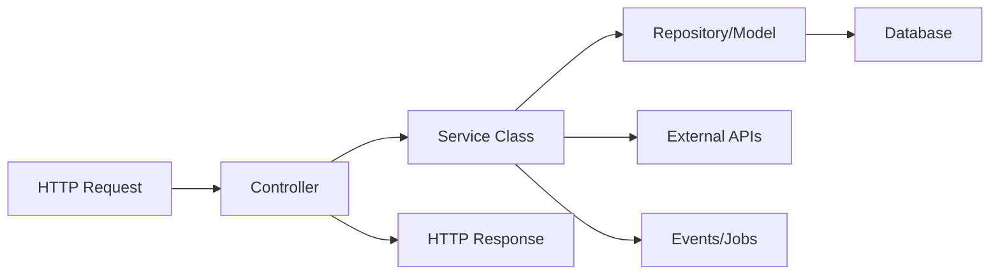

# How to Use Service Classes in Laravel

Author: [nawazdhandala](https://www.github.com/nawazdhandala)

Tags: PHP, Laravel, Service Classes, Design Patterns, Clean Code

Description: Learn how to implement service classes in Laravel to separate business logic from controllers, making your code more testable, reusable, and maintainable.

---

> Controllers should be thin. Service classes let you extract business logic into dedicated classes that are easier to test, reuse, and maintain.

If you've been building Laravel applications for a while, you've probably noticed controllers getting fat. They start handling validation, business logic, database operations, and API responses all in one place. Service classes solve this by giving your business logic a proper home.

---

## Why Use Service Classes?

| Benefit | Description |
|---------|-------------|
| **Single Responsibility** | Controllers handle HTTP, services handle business logic |
| **Testability** | Business logic can be unit tested without HTTP layer |
| **Reusability** | Same logic can be used in controllers, commands, jobs |
| **Readability** | Smaller classes are easier to understand |
| **Maintainability** | Changes to business logic happen in one place |

---

## Service Class Architecture

Here's how service classes fit into a Laravel application:



---

## Creating Your First Service Class

Laravel doesn't have a built-in artisan command for services, but the convention is simple. Create a `Services` directory in your `app` folder.

Here's a basic user registration service that extracts logic from a controller:

```php
<?php

// app/Services/UserService.php
// This service handles all user-related business logic

namespace App\Services;

use App\Models\User;
use Illuminate\Support\Facades\Hash;
use Illuminate\Support\Facades\DB;

class UserService
{
    /**
     * Register a new user with the provided data.
     * Handles password hashing, default settings, and welcome email.
     */
    public function register(array $data): User
    {
        return DB::transaction(function () use ($data) {
            // Create the user with hashed password
            $user = User::create([
                'name' => $data['name'],
                'email' => $data['email'],
                'password' => Hash::make($data['password']),
            ]);

            // Set up default user preferences
            $user->preferences()->create([
                'timezone' => $data['timezone'] ?? 'UTC',
                'notifications_enabled' => true,
            ]);

            // Send welcome email through a queued job
            dispatch(new \App\Jobs\SendWelcomeEmail($user));

            return $user;
        });
    }

    /**
     * Update user profile with validation for sensitive fields.
     */
    public function updateProfile(User $user, array $data): User
    {
        // Only allow updating specific fields
        $allowedFields = ['name', 'bio', 'avatar_url', 'timezone'];

        $filteredData = array_intersect_key($data, array_flip($allowedFields));

        $user->update($filteredData);

        return $user->fresh();
    }

    /**
     * Deactivate a user account and clean up related data.
     */
    public function deactivate(User $user): bool
    {
        return DB::transaction(function () use ($user) {
            // Cancel any active subscriptions
            $user->subscriptions()->active()->each(function ($subscription) {
                $subscription->cancel();
            });

            // Revoke API tokens
            $user->tokens()->delete();

            // Mark user as deactivated
            $user->update([
                'deactivated_at' => now(),
                'email' => "deactivated_{$user->id}_{$user->email}",
            ]);

            return true;
        });
    }
}
```

---

## Using Services in Controllers

Now your controller becomes thin and focused on HTTP concerns:

```php
<?php

// app/Http/Controllers/UserController.php
// Controller handles HTTP requests and delegates to service

namespace App\Http\Controllers;

use App\Http\Requests\RegisterUserRequest;
use App\Http\Requests\UpdateProfileRequest;
use App\Services\UserService;
use Illuminate\Http\JsonResponse;

class UserController extends Controller
{
    // Inject the service through constructor
    public function __construct(
        private UserService $userService
    ) {}

    /**
     * Handle user registration request.
     * Controller validates input, service handles business logic.
     */
    public function register(RegisterUserRequest $request): JsonResponse
    {
        // Validation happens in the form request
        // Business logic happens in the service
        $user = $this->userService->register($request->validated());

        return response()->json([
            'message' => 'Registration successful',
            'user' => $user,
        ], 201);
    }

    /**
     * Update the authenticated user's profile.
     */
    public function updateProfile(UpdateProfileRequest $request): JsonResponse
    {
        $user = $this->userService->updateProfile(
            $request->user(),
            $request->validated()
        );

        return response()->json([
            'message' => 'Profile updated',
            'user' => $user,
        ]);
    }

    /**
     * Deactivate the authenticated user's account.
     */
    public function deactivate(): JsonResponse
    {
        $this->userService->deactivate(auth()->user());

        return response()->json([
            'message' => 'Account deactivated',
        ]);
    }
}
```

---

## Service with Dependencies

Services often need to interact with multiple dependencies. Use constructor injection for clean dependency management:

```php
<?php

// app/Services/OrderService.php
// Order service demonstrating multiple dependencies

namespace App\Services;

use App\Models\Order;
use App\Models\User;
use App\Repositories\OrderRepository;
use App\Services\PaymentService;
use App\Services\InventoryService;
use App\Events\OrderPlaced;
use Illuminate\Support\Facades\DB;

class OrderService
{
    public function __construct(
        private OrderRepository $orderRepository,
        private PaymentService $paymentService,
        private InventoryService $inventoryService
    ) {}

    /**
     * Create a new order with payment processing and inventory updates.
     * Coordinates multiple services in a transaction.
     */
    public function placeOrder(User $user, array $items, array $paymentDetails): Order
    {
        return DB::transaction(function () use ($user, $items, $paymentDetails) {
            // Calculate total from items
            $total = $this->calculateTotal($items);

            // Verify inventory is available before processing
            foreach ($items as $item) {
                if (!$this->inventoryService->isAvailable($item['product_id'], $item['quantity'])) {
                    throw new \App\Exceptions\InsufficientInventoryException(
                        "Product {$item['product_id']} has insufficient stock"
                    );
                }
            }

            // Process payment first, fail fast if payment fails
            $paymentResult = $this->paymentService->charge(
                $user,
                $total,
                $paymentDetails
            );

            if (!$paymentResult->successful) {
                throw new \App\Exceptions\PaymentFailedException($paymentResult->error);
            }

            // Create the order record
            $order = $this->orderRepository->create([
                'user_id' => $user->id,
                'total' => $total,
                'payment_id' => $paymentResult->transactionId,
                'status' => 'confirmed',
            ]);

            // Add order items and reduce inventory
            foreach ($items as $item) {
                $order->items()->create($item);
                $this->inventoryService->reduce($item['product_id'], $item['quantity']);
            }

            // Dispatch event for notifications, analytics, etc.
            event(new OrderPlaced($order));

            return $order;
        });
    }

    /**
     * Calculate order total including tax and discounts.
     */
    private function calculateTotal(array $items): float
    {
        $subtotal = collect($items)->sum(function ($item) {
            return $item['price'] * $item['quantity'];
        });

        // Apply tax (simplified example)
        $tax = $subtotal * 0.10;

        return round($subtotal + $tax, 2);
    }

    /**
     * Cancel an order and process refund.
     */
    public function cancelOrder(Order $order): Order
    {
        if ($order->status === 'shipped') {
            throw new \App\Exceptions\OrderCannotBeCancelledException(
                'Shipped orders cannot be cancelled'
            );
        }

        return DB::transaction(function () use ($order) {
            // Process refund
            $this->paymentService->refund($order->payment_id, $order->total);

            // Restore inventory
            foreach ($order->items as $item) {
                $this->inventoryService->restore($item->product_id, $item->quantity);
            }

            // Update order status
            $order->update(['status' => 'cancelled']);

            return $order->fresh();
        });
    }
}
```

---

## Service Providers for Complex Bindings

When services have complex dependencies or you need interface bindings, use a service provider:

```php
<?php

// app/Providers/ServiceServiceProvider.php
// Register service bindings and singletons

namespace App\Providers;

use Illuminate\Support\ServiceProvider;
use App\Services\PaymentService;
use App\Services\StripePaymentService;
use App\Services\Contracts\PaymentServiceInterface;

class ServiceServiceProvider extends ServiceProvider
{
    /**
     * Register service bindings.
     * This allows swapping implementations easily.
     */
    public function register(): void
    {
        // Bind interface to implementation
        // Swap StripePaymentService for PayPalPaymentService without changing code
        $this->app->bind(
            PaymentServiceInterface::class,
            StripePaymentService::class
        );

        // Register singleton for services that should only be instantiated once
        $this->app->singleton(CacheService::class, function ($app) {
            return new CacheService(
                config('cache.default'),
                config('cache.prefix')
            );
        });
    }
}
```

---

## Using Interfaces for Flexibility

Define interfaces when you need to swap implementations (like payment gateways):

```php
<?php

// app/Services/Contracts/PaymentServiceInterface.php
// Contract that all payment services must implement

namespace App\Services\Contracts;

use App\Models\User;

interface PaymentServiceInterface
{
    /**
     * Charge a user for a given amount.
     */
    public function charge(User $user, float $amount, array $details): PaymentResult;

    /**
     * Refund a previous charge.
     */
    public function refund(string $transactionId, float $amount): bool;

    /**
     * Create a subscription for recurring billing.
     */
    public function subscribe(User $user, string $planId): Subscription;
}
```

Here's the Stripe implementation:

```php
<?php

// app/Services/StripePaymentService.php
// Stripe implementation of the payment interface

namespace App\Services;

use App\Models\User;
use App\Services\Contracts\PaymentServiceInterface;
use App\Services\Contracts\PaymentResult;
use Stripe\StripeClient;

class StripePaymentService implements PaymentServiceInterface
{
    private StripeClient $stripe;

    public function __construct()
    {
        $this->stripe = new StripeClient(config('services.stripe.secret'));
    }

    /**
     * Charge using Stripe's payment intent API.
     */
    public function charge(User $user, float $amount, array $details): PaymentResult
    {
        try {
            $paymentIntent = $this->stripe->paymentIntents->create([
                'amount' => (int) ($amount * 100), // Stripe uses cents
                'currency' => 'usd',
                'customer' => $user->stripe_customer_id,
                'payment_method' => $details['payment_method_id'],
                'confirm' => true,
                'metadata' => [
                    'user_id' => $user->id,
                ],
            ]);

            return new PaymentResult(
                successful: true,
                transactionId: $paymentIntent->id,
                error: null
            );
        } catch (\Stripe\Exception\CardException $e) {
            return new PaymentResult(
                successful: false,
                transactionId: null,
                error: $e->getMessage()
            );
        }
    }

    /**
     * Process refund through Stripe.
     */
    public function refund(string $transactionId, float $amount): bool
    {
        $refund = $this->stripe->refunds->create([
            'payment_intent' => $transactionId,
            'amount' => (int) ($amount * 100),
        ]);

        return $refund->status === 'succeeded';
    }

    /**
     * Create Stripe subscription.
     */
    public function subscribe(User $user, string $planId): Subscription
    {
        $subscription = $this->stripe->subscriptions->create([
            'customer' => $user->stripe_customer_id,
            'items' => [['price' => $planId]],
        ]);

        return Subscription::createFromStripe($subscription);
    }
}
```

---

## Testing Service Classes

Service classes are much easier to test than fat controllers:

```php
<?php

// tests/Unit/Services/UserServiceTest.php
// Unit tests for the user service

namespace Tests\Unit\Services;

use Tests\TestCase;
use App\Models\User;
use App\Services\UserService;
use Illuminate\Foundation\Testing\RefreshDatabase;
use Illuminate\Support\Facades\Queue;

class UserServiceTest extends TestCase
{
    use RefreshDatabase;

    private UserService $userService;

    protected function setUp(): void
    {
        parent::setUp();
        $this->userService = app(UserService::class);
    }

    /** @test */
    public function it_creates_user_with_hashed_password(): void
    {
        // Prevent jobs from actually running
        Queue::fake();

        $data = [
            'name' => 'John Doe',
            'email' => 'john@example.com',
            'password' => 'secret123',
        ];

        $user = $this->userService->register($data);

        // Assert user was created
        $this->assertDatabaseHas('users', [
            'email' => 'john@example.com',
        ]);

        // Assert password was hashed, not stored as plain text
        $this->assertNotEquals('secret123', $user->password);
        $this->assertTrue(\Hash::check('secret123', $user->password));
    }

    /** @test */
    public function it_creates_default_preferences_on_registration(): void
    {
        Queue::fake();

        $user = $this->userService->register([
            'name' => 'Jane Doe',
            'email' => 'jane@example.com',
            'password' => 'password',
            'timezone' => 'America/New_York',
        ]);

        $this->assertDatabaseHas('user_preferences', [
            'user_id' => $user->id,
            'timezone' => 'America/New_York',
            'notifications_enabled' => true,
        ]);
    }

    /** @test */
    public function it_dispatches_welcome_email_job(): void
    {
        Queue::fake();

        $user = $this->userService->register([
            'name' => 'Test User',
            'email' => 'test@example.com',
            'password' => 'password',
        ]);

        Queue::assertPushed(\App\Jobs\SendWelcomeEmail::class, function ($job) use ($user) {
            return $job->user->id === $user->id;
        });
    }

    /** @test */
    public function it_deactivates_user_and_cancels_subscriptions(): void
    {
        $user = User::factory()
            ->hasSubscriptions(2, ['status' => 'active'])
            ->create();

        $this->userService->deactivate($user);

        // Assert user is deactivated
        $this->assertNotNull($user->fresh()->deactivated_at);

        // Assert all subscriptions are cancelled
        $this->assertEquals(0, $user->subscriptions()->active()->count());
    }
}
```

---

## Service Classes with DTOs

For complex data structures, use Data Transfer Objects:

```php
<?php

// app/DTOs/CreateOrderDTO.php
// Data Transfer Object for order creation

namespace App\DTOs;

use Illuminate\Http\Request;

readonly class CreateOrderDTO
{
    public function __construct(
        public array $items,
        public string $shippingAddress,
        public string $billingAddress,
        public string $paymentMethodId,
        public ?string $couponCode = null
    ) {}

    /**
     * Create DTO from HTTP request.
     */
    public static function fromRequest(Request $request): self
    {
        return new self(
            items: $request->input('items'),
            shippingAddress: $request->input('shipping_address'),
            billingAddress: $request->input('billing_address'),
            paymentMethodId: $request->input('payment_method_id'),
            couponCode: $request->input('coupon_code')
        );
    }

    /**
     * Create DTO from array data.
     */
    public static function fromArray(array $data): self
    {
        return new self(
            items: $data['items'],
            shippingAddress: $data['shipping_address'],
            billingAddress: $data['billing_address'],
            paymentMethodId: $data['payment_method_id'],
            couponCode: $data['coupon_code'] ?? null
        );
    }
}
```

Then use it in your service:

```php
<?php

// app/Services/OrderService.php (updated)
// Using DTOs for cleaner method signatures

namespace App\Services;

use App\DTOs\CreateOrderDTO;
use App\Models\Order;
use App\Models\User;

class OrderService
{
    /**
     * Place order using DTO instead of array.
     * This makes the method signature self-documenting.
     */
    public function placeOrder(User $user, CreateOrderDTO $orderData): Order
    {
        // Access DTO properties directly
        $total = $this->calculateTotal($orderData->items);

        if ($orderData->couponCode) {
            $total = $this->applyCoupon($total, $orderData->couponCode);
        }

        // ... rest of the order logic
    }
}
```

---

## Organizing Services by Domain

For larger applications, organize services by domain or feature:

```
app/
├── Services/
│   ├── User/
│   │   ├── UserService.php
│   │   ├── AuthenticationService.php
│   │   └── ProfileService.php
│   ├── Order/
│   │   ├── OrderService.php
│   │   ├── OrderCalculationService.php
│   │   └── OrderFulfillmentService.php
│   ├── Payment/
│   │   ├── Contracts/
│   │   │   └── PaymentServiceInterface.php
│   │   ├── StripePaymentService.php
│   │   └── PayPalPaymentService.php
│   └── Notification/
│       ├── EmailService.php
│       ├── SmsService.php
│       └── PushNotificationService.php
```

---

## Common Patterns

### Action Classes (Single Method Services)

For single-purpose operations, some teams prefer action classes:

```php
<?php

// app/Actions/User/CreateUser.php
// Single responsibility action class

namespace App\Actions\User;

use App\Models\User;

class CreateUser
{
    /**
     * Execute the user creation.
     * Action classes have a single public method.
     */
    public function execute(array $data): User
    {
        return User::create([
            'name' => $data['name'],
            'email' => $data['email'],
            'password' => bcrypt($data['password']),
        ]);
    }
}

// Usage in controller
public function store(Request $request, CreateUser $createUser)
{
    $user = $createUser->execute($request->validated());
    return response()->json($user, 201);
}
```

### Service Results

Return structured results for better error handling:

```php
<?php

// app/Services/Results/ServiceResult.php
// Generic result wrapper for service operations

namespace App\Services\Results;

readonly class ServiceResult
{
    public function __construct(
        public bool $success,
        public mixed $data = null,
        public ?string $message = null,
        public array $errors = []
    ) {}

    public static function success(mixed $data = null, ?string $message = null): self
    {
        return new self(
            success: true,
            data: $data,
            message: $message
        );
    }

    public static function failure(string $message, array $errors = []): self
    {
        return new self(
            success: false,
            message: $message,
            errors: $errors
        );
    }
}

// Usage in service
public function updateEmail(User $user, string $newEmail): ServiceResult
{
    if (User::where('email', $newEmail)->exists()) {
        return ServiceResult::failure('Email already in use', [
            'email' => ['This email is already registered']
        ]);
    }

    $user->update(['email' => $newEmail]);

    return ServiceResult::success($user, 'Email updated successfully');
}
```

---

## Best Practices Summary

| Practice | Why |
|----------|-----|
| Keep services focused | One service per domain area (users, orders, payments) |
| Use dependency injection | Makes testing easier, follows SOLID principles |
| Return models or DTOs | Avoid returning arrays for complex data |
| Use database transactions | Ensure data consistency for multi-step operations |
| Throw exceptions for errors | Let the controller handle error responses |
| Write unit tests | Services are easy to test in isolation |
| Use interfaces for swappable implementations | Payment gateways, notification channels, etc. |

---

## Conclusion

Service classes are a simple but powerful pattern for organizing Laravel applications. They keep controllers thin, make business logic testable, and improve code reuse across your application.

Start by extracting your fattest controller methods into services. You'll immediately see the benefits in code clarity and testability.

---

*Looking to monitor your Laravel application in production? [OneUptime](https://oneuptime.com) provides application performance monitoring, uptime tracking, and incident management to keep your services running smoothly.*

**Related Reading:**
- [How to Build Multi-Module Maven Projects](https://oneuptime.com/blog/post/2026-02-02-multi-module-maven-projects/view)
