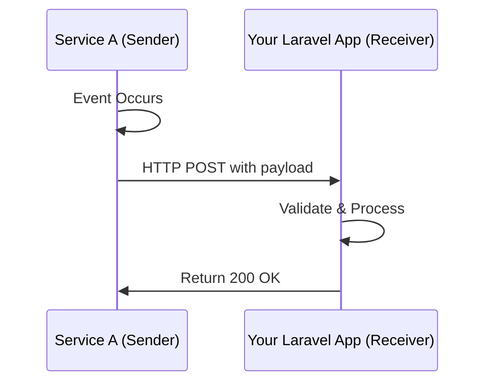
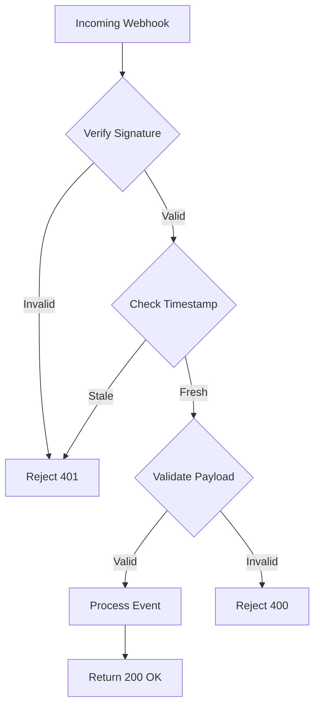

# How to Implement Webhooks in Laravel

[Author: nawazdhandala](https://github.com/nawazdhandala)

**Tags:** PHP, Laravel, Webhooks, API, Events, HTTP

**Description:** Learn how to implement webhooks in Laravel for both sending and receiving real-time event notifications. This guide covers webhook endpoints, payload signing, retry logic, and security best practices.

---

Webhooks are a powerful way to communicate between applications in real-time. Instead of constantly polling an API to check for updates, webhooks push data to your application the moment something happens. In this guide, I'll walk you through implementing webhooks in Laravel from both perspectives - receiving webhooks from external services and sending webhooks to notify other applications.

## What Are Webhooks?

Webhooks are HTTP callbacks triggered by events. When something happens in one system, it sends an HTTP POST request to a configured URL in another system. Think of it like a notification system between applications.



Common use cases include:
- Payment processors notifying you when a payment succeeds or fails
- GitHub notifying your CI/CD pipeline when code is pushed
- Stripe alerting you about subscription changes
- Your app notifying third parties about user actions

## Receiving Webhooks in Laravel

Let's start with the more common scenario - receiving webhooks from external services like Stripe, GitHub, or any other API.

### Creating a Webhook Controller

First, create a controller to handle incoming webhook requests.

The controller needs to validate the incoming request, parse the payload, and dispatch the appropriate action based on the event type.

```php
<?php

namespace App\Http\Controllers;

use Illuminate\Http\Request;
use Illuminate\Http\Response;
use Illuminate\Support\Facades\Log;
use App\Services\WebhookProcessor;

class WebhookController extends Controller
{
    // Inject the processor service for handling different event types
    public function __construct(
        protected WebhookProcessor $processor
    ) {}

    /**
     * Handle incoming webhook requests.
     * Returns 200 quickly to prevent timeout, then processes async.
     */
    public function handle(Request $request): Response
    {
        // Log the incoming webhook for debugging
        Log::info('Webhook received', [
            'headers' => $request->headers->all(),
            'payload' => $request->all(),
        ]);

        // Get the event type from the payload
        // Different services use different keys - adjust as needed
        $eventType = $request->input('event')
            ?? $request->input('type')
            ?? 'unknown';

        // Dispatch to a queue for async processing
        // This ensures we respond quickly to the sender
        dispatch(function () use ($request, $eventType) {
            $this->processor->process($eventType, $request->all());
        })->afterResponse();

        // Always return 200 quickly to acknowledge receipt
        // The actual processing happens in the background
        return response('Webhook received', 200);
    }
}
```

### Setting Up the Route

Add a route for your webhook endpoint. Webhooks should bypass CSRF protection since they come from external services.

Create the route in your routes file, making sure to exclude it from CSRF verification.

```php
<?php

// routes/api.php

use App\Http\Controllers\WebhookController;

// Webhook endpoints typically go in api.php to skip CSRF
// Use a unique URL that's hard to guess
Route::post('/webhooks/incoming/{source}', [WebhookController::class, 'handle'])
    ->name('webhooks.incoming');
```

### Excluding from CSRF Protection

If you're using web routes instead, exclude the webhook path from CSRF verification.

Add the webhook path to the except array in your VerifyCsrfToken middleware.

```php
<?php

namespace App\Http\Middleware;

use Illuminate\Foundation\Http\Middleware\VerifyCsrfToken as Middleware;

class VerifyCsrfToken extends Middleware
{
    /**
     * The URIs that should be excluded from CSRF verification.
     * Webhooks come from external services, so they can't include CSRF tokens.
     */
    protected $except = [
        'webhooks/*',
    ];
}
```

## Validating Webhook Signatures

Security is critical when receiving webhooks. You need to verify that the request actually came from the service you expect, not from a malicious actor.

Most webhook providers include a signature in the request headers. Here's how to validate it.

### Creating a Signature Validator

This middleware verifies the webhook signature before the request reaches your controller.

```php
<?php

namespace App\Http\Middleware;

use Closure;
use Illuminate\Http\Request;
use Symfony\Component\HttpFoundation\Response;

class ValidateWebhookSignature
{
    /**
     * Validate the webhook signature from the request headers.
     * Different providers use different signing methods.
     */
    public function handle(Request $request, Closure $next, string $provider): Response
    {
        $isValid = match ($provider) {
            'stripe' => $this->validateStripeSignature($request),
            'github' => $this->validateGitHubSignature($request),
            'custom' => $this->validateCustomSignature($request),
            default => false,
        };

        if (!$isValid) {
            // Log the failed validation for security monitoring
            \Log::warning('Webhook signature validation failed', [
                'provider' => $provider,
                'ip' => $request->ip(),
            ]);

            return response('Invalid signature', 401);
        }

        return $next($request);
    }

    /**
     * Validate Stripe webhook signatures.
     * Stripe uses a timestamp and HMAC-SHA256 signature.
     */
    protected function validateStripeSignature(Request $request): bool
    {
        $payload = $request->getContent();
        $sigHeader = $request->header('Stripe-Signature');
        $secret = config('services.stripe.webhook_secret');

        try {
            // Stripe's library handles the validation
            \Stripe\Webhook::constructEvent($payload, $sigHeader, $secret);
            return true;
        } catch (\Exception $e) {
            return false;
        }
    }

    /**
     * Validate GitHub webhook signatures.
     * GitHub uses HMAC-SHA256 with a shared secret.
     */
    protected function validateGitHubSignature(Request $request): bool
    {
        $payload = $request->getContent();
        $signature = $request->header('X-Hub-Signature-256');
        $secret = config('services.github.webhook_secret');

        if (!$signature) {
            return false;
        }

        // Calculate expected signature
        $expected = 'sha256=' . hash_hmac('sha256', $payload, $secret);

        // Use timing-safe comparison to prevent timing attacks
        return hash_equals($expected, $signature);
    }

    /**
     * Validate custom webhook signatures.
     * Use this pattern for your own webhook implementations.
     */
    protected function validateCustomSignature(Request $request): bool
    {
        $payload = $request->getContent();
        $timestamp = $request->header('X-Webhook-Timestamp');
        $signature = $request->header('X-Webhook-Signature');
        $secret = config('services.custom.webhook_secret');

        if (!$timestamp || !$signature) {
            return false;
        }

        // Reject old timestamps to prevent replay attacks
        // Allow 5 minutes of clock drift
        if (abs(time() - (int) $timestamp) > 300) {
            return false;
        }

        // Create signed payload with timestamp
        $signedPayload = $timestamp . '.' . $payload;
        $expected = hash_hmac('sha256', $signedPayload, $secret);

        return hash_equals($expected, $signature);
    }
}
```

### Registering the Middleware

Register the middleware so you can use it on webhook routes.

```php
<?php

// bootstrap/app.php (Laravel 11+) or app/Http/Kernel.php (older versions)

// Laravel 11+
->withMiddleware(function (Middleware $middleware) {
    $middleware->alias([
        'webhook.validate' => \App\Http\Middleware\ValidateWebhookSignature::class,
    ]);
})

// Then use it on your route:
Route::post('/webhooks/{provider}', [WebhookController::class, 'handle'])
    ->middleware('webhook.validate:stripe');
```

## Processing Webhook Events

Create a service class to handle different event types. This keeps your controller thin and makes testing easier.

The processor dispatches events to appropriate handlers based on the event type.

```php
<?php

namespace App\Services;

use Illuminate\Support\Facades\Log;
use App\Events\PaymentReceived;
use App\Events\SubscriptionCancelled;
use App\Events\UserCreated;

class WebhookProcessor
{
    /**
     * Process a webhook event based on its type.
     * Each event type maps to a specific handler method.
     */
    public function process(string $eventType, array $payload): void
    {
        Log::info("Processing webhook event: {$eventType}");

        // Map event types to handler methods
        // Add new events here as you need them
        match ($eventType) {
            'payment.succeeded' => $this->handlePaymentSucceeded($payload),
            'payment.failed' => $this->handlePaymentFailed($payload),
            'customer.subscription.deleted' => $this->handleSubscriptionCancelled($payload),
            'customer.created' => $this->handleCustomerCreated($payload),
            default => $this->handleUnknownEvent($eventType, $payload),
        };
    }

    protected function handlePaymentSucceeded(array $payload): void
    {
        // Extract relevant data from the payload
        $paymentId = $payload['data']['object']['id'] ?? null;
        $amount = $payload['data']['object']['amount'] ?? 0;
        $customerId = $payload['data']['object']['customer'] ?? null;

        // Fire a Laravel event for other parts of your app to react to
        event(new PaymentReceived($paymentId, $amount, $customerId));

        Log::info('Payment succeeded', [
            'payment_id' => $paymentId,
            'amount' => $amount,
        ]);
    }

    protected function handlePaymentFailed(array $payload): void
    {
        $paymentId = $payload['data']['object']['id'] ?? null;
        $customerId = $payload['data']['object']['customer'] ?? null;
        $failureMessage = $payload['data']['object']['failure_message'] ?? 'Unknown error';

        // You might want to notify the customer or your team
        Log::warning('Payment failed', [
            'payment_id' => $paymentId,
            'customer_id' => $customerId,
            'failure_message' => $failureMessage,
        ]);
    }

    protected function handleSubscriptionCancelled(array $payload): void
    {
        $subscriptionId = $payload['data']['object']['id'] ?? null;
        $customerId = $payload['data']['object']['customer'] ?? null;

        event(new SubscriptionCancelled($subscriptionId, $customerId));

        Log::info('Subscription cancelled', [
            'subscription_id' => $subscriptionId,
            'customer_id' => $customerId,
        ]);
    }

    protected function handleCustomerCreated(array $payload): void
    {
        $customerId = $payload['data']['object']['id'] ?? null;
        $email = $payload['data']['object']['email'] ?? null;

        event(new UserCreated($customerId, $email));
    }

    protected function handleUnknownEvent(string $eventType, array $payload): void
    {
        // Log unknown events so you can add handlers later if needed
        Log::info("Unhandled webhook event type: {$eventType}", [
            'payload' => $payload,
        ]);
    }
}
```

## Sending Webhooks from Your Laravel App

Now let's look at the other side - sending webhooks to notify external services or your users' applications about events in your system.

### Creating a Webhook Model

First, set up a model to store webhook configurations. Users can register their webhook URLs and choose which events to subscribe to.

```php
<?php

namespace App\Models;

use Illuminate\Database\Eloquent\Model;
use Illuminate\Database\Eloquent\Relations\BelongsTo;
use Illuminate\Support\Str;

class Webhook extends Model
{
    protected $fillable = [
        'user_id',
        'url',
        'secret',
        'events',
        'is_active',
        'last_triggered_at',
        'failure_count',
    ];

    protected $casts = [
        'events' => 'array',       // Store subscribed events as JSON
        'is_active' => 'boolean',
        'last_triggered_at' => 'datetime',
    ];

    protected $hidden = [
        'secret',  // Never expose the secret in API responses
    ];

    public function user(): BelongsTo
    {
        return $this->belongsTo(User::class);
    }

    /**
     * Generate a secure random secret for signing payloads.
     * Called automatically when creating a new webhook.
     */
    public static function generateSecret(): string
    {
        return 'whsec_' . Str::random(32);
    }

    /**
     * Check if this webhook is subscribed to a specific event.
     */
    public function subscribedTo(string $event): bool
    {
        // Wildcard subscription means all events
        if (in_array('*', $this->events ?? [])) {
            return true;
        }

        return in_array($event, $this->events ?? []);
    }

    /**
     * Mark the webhook as failed and potentially disable it.
     */
    public function recordFailure(): void
    {
        $this->increment('failure_count');

        // Disable webhook after 10 consecutive failures
        if ($this->failure_count >= 10) {
            $this->update(['is_active' => false]);
        }
    }

    /**
     * Reset failure count on successful delivery.
     */
    public function recordSuccess(): void
    {
        $this->update([
            'failure_count' => 0,
            'last_triggered_at' => now(),
        ]);
    }
}
```

### Database Migration

Create the migration for the webhooks table.

```php
<?php

use Illuminate\Database\Migrations\Migration;
use Illuminate\Database\Schema\Blueprint;
use Illuminate\Support\Facades\Schema;

return new class extends Migration
{
    public function up(): void
    {
        Schema::create('webhooks', function (Blueprint $table) {
            $table->id();
            $table->foreignId('user_id')->constrained()->onDelete('cascade');
            $table->string('url');
            $table->string('secret');
            $table->json('events');              // Which events to receive
            $table->boolean('is_active')->default(true);
            $table->timestamp('last_triggered_at')->nullable();
            $table->unsignedInteger('failure_count')->default(0);
            $table->timestamps();

            // Index for quick lookups when dispatching
            $table->index(['is_active', 'user_id']);
        });

        // Store delivery attempts for debugging and retry logic
        Schema::create('webhook_deliveries', function (Blueprint $table) {
            $table->id();
            $table->foreignId('webhook_id')->constrained()->onDelete('cascade');
            $table->string('event');
            $table->json('payload');
            $table->unsignedSmallInteger('response_code')->nullable();
            $table->text('response_body')->nullable();
            $table->unsignedInteger('attempt')->default(1);
            $table->enum('status', ['pending', 'success', 'failed'])->default('pending');
            $table->timestamps();

            $table->index(['webhook_id', 'status']);
        });
    }

    public function down(): void
    {
        Schema::dropIfExists('webhook_deliveries');
        Schema::dropIfExists('webhooks');
    }
};
```

### Webhook Dispatcher Service

Create a service to handle sending webhooks with proper signing and retry logic.

```php
<?php

namespace App\Services;

use App\Models\Webhook;
use App\Models\WebhookDelivery;
use Illuminate\Support\Facades\Http;
use Illuminate\Support\Facades\Log;

class WebhookDispatcher
{
    /**
     * Dispatch an event to all subscribed webhooks.
     * This is the main entry point for sending webhooks.
     */
    public function dispatch(string $event, array $data, ?int $userId = null): void
    {
        // Build query for active webhooks
        $query = Webhook::where('is_active', true);

        // Optionally filter by user
        if ($userId) {
            $query->where('user_id', $userId);
        }

        // Get all matching webhooks
        $webhooks = $query->get();

        foreach ($webhooks as $webhook) {
            // Check if this webhook wants this event
            if (!$webhook->subscribedTo($event)) {
                continue;
            }

            // Queue the delivery for async processing
            dispatch(new \App\Jobs\DeliverWebhook($webhook, $event, $data));
        }
    }

    /**
     * Actually send the webhook request.
     * Called by the job queue for async delivery.
     */
    public function deliver(Webhook $webhook, string $event, array $data, int $attempt = 1): bool
    {
        // Build the payload with metadata
        $payload = [
            'event' => $event,
            'timestamp' => now()->unix(),
            'data' => $data,
        ];

        // Create the signature
        $signature = $this->sign($payload, $webhook->secret);

        // Create delivery record for tracking
        $delivery = WebhookDelivery::create([
            'webhook_id' => $webhook->id,
            'event' => $event,
            'payload' => $payload,
            'attempt' => $attempt,
        ]);

        try {
            // Send the request with a reasonable timeout
            $response = Http::timeout(30)
                ->withHeaders([
                    'Content-Type' => 'application/json',
                    'X-Webhook-Event' => $event,
                    'X-Webhook-Timestamp' => $payload['timestamp'],
                    'X-Webhook-Signature' => $signature,
                    'User-Agent' => 'MyApp-Webhook/1.0',
                ])
                ->post($webhook->url, $payload);

            // Record the response
            $delivery->update([
                'response_code' => $response->status(),
                'response_body' => substr($response->body(), 0, 1000),
                'status' => $response->successful() ? 'success' : 'failed',
            ]);

            if ($response->successful()) {
                $webhook->recordSuccess();
                return true;
            }

            // Non-2xx response, treat as failure
            $webhook->recordFailure();

            Log::warning('Webhook delivery failed', [
                'webhook_id' => $webhook->id,
                'url' => $webhook->url,
                'status' => $response->status(),
                'attempt' => $attempt,
            ]);

            return false;

        } catch (\Exception $e) {
            // Network error or timeout
            $delivery->update([
                'response_body' => $e->getMessage(),
                'status' => 'failed',
            ]);

            $webhook->recordFailure();

            Log::error('Webhook delivery exception', [
                'webhook_id' => $webhook->id,
                'url' => $webhook->url,
                'error' => $e->getMessage(),
                'attempt' => $attempt,
            ]);

            return false;
        }
    }

    /**
     * Create HMAC signature for the payload.
     * Recipients can verify this to ensure the webhook is authentic.
     */
    protected function sign(array $payload, string $secret): string
    {
        $timestamp = $payload['timestamp'];
        $body = json_encode($payload);

        // Include timestamp in signed content to prevent replay attacks
        $signedContent = "{$timestamp}.{$body}";

        return hash_hmac('sha256', $signedContent, $secret);
    }
}
```

### Webhook Delivery Job with Retries

Create a job to handle async delivery with exponential backoff retries.

```php
<?php

namespace App\Jobs;

use App\Models\Webhook;
use App\Services\WebhookDispatcher;
use Illuminate\Bus\Queueable;
use Illuminate\Contracts\Queue\ShouldQueue;
use Illuminate\Foundation\Bus\Dispatchable;
use Illuminate\Queue\InteractsWithQueue;
use Illuminate\Queue\SerializesModels;

class DeliverWebhook implements ShouldQueue
{
    use Dispatchable, InteractsWithQueue, Queueable, SerializesModels;

    /**
     * Maximum number of retry attempts.
     * After this, the webhook is considered permanently failed.
     */
    public int $tries = 5;

    /**
     * Exponential backoff intervals in seconds.
     * First retry after 10s, then 30s, 60s, 120s, 300s.
     */
    public array $backoff = [10, 30, 60, 120, 300];

    /**
     * Delete job if webhook no longer exists.
     */
    public bool $deleteWhenMissingModels = true;

    public function __construct(
        public Webhook $webhook,
        public string $event,
        public array $data
    ) {
        // Use a dedicated queue for webhooks
        $this->onQueue('webhooks');
    }

    public function handle(WebhookDispatcher $dispatcher): void
    {
        // Skip if webhook was disabled since job was queued
        if (!$this->webhook->is_active) {
            return;
        }

        $attempt = $this->attempts();

        $success = $dispatcher->deliver(
            $this->webhook,
            $this->event,
            $this->data,
            $attempt
        );

        if (!$success && $attempt < $this->tries) {
            // Let the queue system handle the retry with backoff
            $this->release($this->backoff[$attempt - 1] ?? 300);
        }
    }

    /**
     * Handle job failure after all retries exhausted.
     */
    public function failed(\Throwable $exception): void
    {
        \Log::error('Webhook delivery permanently failed', [
            'webhook_id' => $this->webhook->id,
            'event' => $this->event,
            'error' => $exception->getMessage(),
        ]);

        // Optionally notify the webhook owner
        // You could send an email or in-app notification
    }
}
```

## Integrating with Laravel Events

Use Laravel's event system to automatically dispatch webhooks when things happen in your application.

### Creating a Webhook Event Listener

This listener automatically sends webhooks when Laravel events are fired.

```php
<?php

namespace App\Listeners;

use App\Services\WebhookDispatcher;
use Illuminate\Contracts\Queue\ShouldQueue;

class DispatchWebhook implements ShouldQueue
{
    public function __construct(
        protected WebhookDispatcher $dispatcher
    ) {}

    /**
     * Map Laravel events to webhook event names.
     * This decouples your internal events from webhook API.
     */
    protected array $eventMap = [
        \App\Events\OrderCreated::class => 'order.created',
        \App\Events\OrderShipped::class => 'order.shipped',
        \App\Events\PaymentReceived::class => 'payment.received',
        \App\Events\UserRegistered::class => 'user.registered',
    ];

    public function handle(object $event): void
    {
        $eventClass = get_class($event);

        // Check if this event should trigger webhooks
        if (!isset($this->eventMap[$eventClass])) {
            return;
        }

        $webhookEvent = $this->eventMap[$eventClass];

        // Events should implement a method to get webhook payload
        $data = method_exists($event, 'toWebhookPayload')
            ? $event->toWebhookPayload()
            : $this->extractPayload($event);

        // Get user ID if the event is scoped to a user
        $userId = method_exists($event, 'getUserId')
            ? $event->getUserId()
            : null;

        $this->dispatcher->dispatch($webhookEvent, $data, $userId);
    }

    /**
     * Extract payload from event using reflection.
     * Fallback for events without toWebhookPayload method.
     */
    protected function extractPayload(object $event): array
    {
        $payload = [];

        // Get public properties
        foreach (get_object_vars($event) as $key => $value) {
            // Skip internal properties
            if (str_starts_with($key, '_')) {
                continue;
            }

            // Convert models to arrays
            if ($value instanceof \Illuminate\Database\Eloquent\Model) {
                $payload[$key] = $value->toArray();
            } else {
                $payload[$key] = $value;
            }
        }

        return $payload;
    }
}
```

### Registering the Listener

Register the listener in your EventServiceProvider.

```php
<?php

namespace App\Providers;

use App\Events\OrderCreated;
use App\Events\OrderShipped;
use App\Events\PaymentReceived;
use App\Listeners\DispatchWebhook;
use Illuminate\Foundation\Support\Providers\EventServiceProvider as ServiceProvider;

class EventServiceProvider extends ServiceProvider
{
    protected $listen = [
        OrderCreated::class => [
            DispatchWebhook::class,
        ],
        OrderShipped::class => [
            DispatchWebhook::class,
        ],
        PaymentReceived::class => [
            DispatchWebhook::class,
        ],
    ];
}
```

## Building a Webhook Management API

Let users manage their webhook subscriptions through an API.

```php
<?php

namespace App\Http\Controllers\Api;

use App\Http\Controllers\Controller;
use App\Models\Webhook;
use Illuminate\Http\JsonResponse;
use Illuminate\Http\Request;

class WebhookController extends Controller
{
    /**
     * List all webhooks for the authenticated user.
     */
    public function index(Request $request): JsonResponse
    {
        $webhooks = $request->user()
            ->webhooks()
            ->select(['id', 'url', 'events', 'is_active', 'last_triggered_at', 'failure_count', 'created_at'])
            ->get();

        return response()->json(['data' => $webhooks]);
    }

    /**
     * Create a new webhook subscription.
     */
    public function store(Request $request): JsonResponse
    {
        $validated = $request->validate([
            'url' => ['required', 'url', 'max:500'],
            'events' => ['required', 'array', 'min:1'],
            'events.*' => ['string', 'in:order.created,order.shipped,payment.received,user.registered,*'],
        ]);

        // Generate a secure secret for signing
        $secret = Webhook::generateSecret();

        $webhook = $request->user()->webhooks()->create([
            'url' => $validated['url'],
            'events' => $validated['events'],
            'secret' => $secret,
        ]);

        // Return secret only on creation - user must save it
        return response()->json([
            'data' => $webhook->only(['id', 'url', 'events', 'is_active']),
            'secret' => $secret,
            'message' => 'Save this secret securely - it will not be shown again.',
        ], 201);
    }

    /**
     * Update a webhook's configuration.
     */
    public function update(Request $request, Webhook $webhook): JsonResponse
    {
        // Ensure user owns this webhook
        $this->authorize('update', $webhook);

        $validated = $request->validate([
            'url' => ['sometimes', 'url', 'max:500'],
            'events' => ['sometimes', 'array', 'min:1'],
            'events.*' => ['string', 'in:order.created,order.shipped,payment.received,user.registered,*'],
            'is_active' => ['sometimes', 'boolean'],
        ]);

        $webhook->update($validated);

        // Reset failure count when re-enabling
        if (($validated['is_active'] ?? false) && $webhook->failure_count > 0) {
            $webhook->update(['failure_count' => 0]);
        }

        return response()->json(['data' => $webhook->fresh()]);
    }

    /**
     * Delete a webhook subscription.
     */
    public function destroy(Webhook $webhook): JsonResponse
    {
        $this->authorize('delete', $webhook);

        $webhook->delete();

        return response()->json(null, 204);
    }

    /**
     * Regenerate the webhook secret.
     */
    public function regenerateSecret(Webhook $webhook): JsonResponse
    {
        $this->authorize('update', $webhook);

        $secret = Webhook::generateSecret();
        $webhook->update(['secret' => $secret]);

        return response()->json([
            'secret' => $secret,
            'message' => 'Save this secret securely - it will not be shown again.',
        ]);
    }

    /**
     * Test a webhook by sending a ping event.
     */
    public function test(Webhook $webhook): JsonResponse
    {
        $this->authorize('update', $webhook);

        // Dispatch a test event
        app(\App\Services\WebhookDispatcher::class)->deliver(
            $webhook,
            'webhook.test',
            ['message' => 'This is a test webhook'],
            1
        );

        return response()->json(['message' => 'Test webhook dispatched']);
    }
}
```

## Security Best Practices

When implementing webhooks, security should be a top priority. Here's a summary of the key practices.



Key security measures:

1. **Always validate signatures** - Never trust incoming webhooks without cryptographic verification
2. **Use timing-safe comparison** - Prevent timing attacks with `hash_equals()`
3. **Check timestamps** - Reject old requests to prevent replay attacks
4. **Use HTTPS only** - Never send or receive webhooks over plain HTTP
5. **Generate strong secrets** - Use cryptographically secure random generators
6. **Log attempts** - Track all webhook activity for security auditing
7. **Rate limit endpoints** - Prevent abuse of your webhook receivers
8. **Validate payloads** - Don't trust the structure of incoming data

## Testing Webhooks

Testing webhooks can be tricky since they involve external HTTP calls. Here's how to test both receiving and sending.

```php
<?php

namespace Tests\Feature;

use App\Models\Webhook;
use App\Services\WebhookDispatcher;
use Illuminate\Foundation\Testing\RefreshDatabase;
use Illuminate\Support\Facades\Http;
use Tests\TestCase;

class WebhookTest extends TestCase
{
    use RefreshDatabase;

    public function test_incoming_webhook_validates_signature(): void
    {
        $payload = ['event' => 'payment.succeeded', 'data' => ['id' => 123]];
        $secret = 'test_secret';
        $timestamp = time();

        // Create valid signature
        $signedPayload = $timestamp . '.' . json_encode($payload);
        $signature = hash_hmac('sha256', $signedPayload, $secret);

        // Mock the config
        config(['services.custom.webhook_secret' => $secret]);

        $response = $this->postJson('/api/webhooks/custom', $payload, [
            'X-Webhook-Timestamp' => $timestamp,
            'X-Webhook-Signature' => $signature,
        ]);

        $response->assertStatus(200);
    }

    public function test_incoming_webhook_rejects_invalid_signature(): void
    {
        $response = $this->postJson('/api/webhooks/custom', ['event' => 'test'], [
            'X-Webhook-Timestamp' => time(),
            'X-Webhook-Signature' => 'invalid',
        ]);

        $response->assertStatus(401);
    }

    public function test_outgoing_webhook_is_dispatched(): void
    {
        // Fake HTTP requests
        Http::fake([
            'example.com/*' => Http::response('OK', 200),
        ]);

        $user = \App\Models\User::factory()->create();
        $webhook = Webhook::factory()->create([
            'user_id' => $user->id,
            'url' => 'https://example.com/webhook',
            'events' => ['order.created'],
            'secret' => Webhook::generateSecret(),
        ]);

        $dispatcher = app(WebhookDispatcher::class);
        $result = $dispatcher->deliver($webhook, 'order.created', ['id' => 1], 1);

        $this->assertTrue($result);
        $this->assertDatabaseHas('webhook_deliveries', [
            'webhook_id' => $webhook->id,
            'event' => 'order.created',
            'status' => 'success',
        ]);
    }
}
```

## Conclusion

Webhooks are essential for building modern, event-driven applications. With Laravel, you can implement robust webhook handling for both receiving external notifications and sending your own.

Key takeaways:
- Always validate webhook signatures to ensure authenticity
- Process webhooks asynchronously to respond quickly
- Implement retry logic with exponential backoff for sending
- Log everything for debugging and security monitoring
- Give users control over their webhook subscriptions

The patterns shown here will help you build reliable, secure webhook integrations that scale with your application.

---

**Monitor your webhooks with OneUptime.** Track webhook delivery success rates, response times, and failures. Get alerted when integrations break before your users notice. [Start monitoring today](https://oneuptime.com) and ensure your webhook infrastructure stays reliable.
