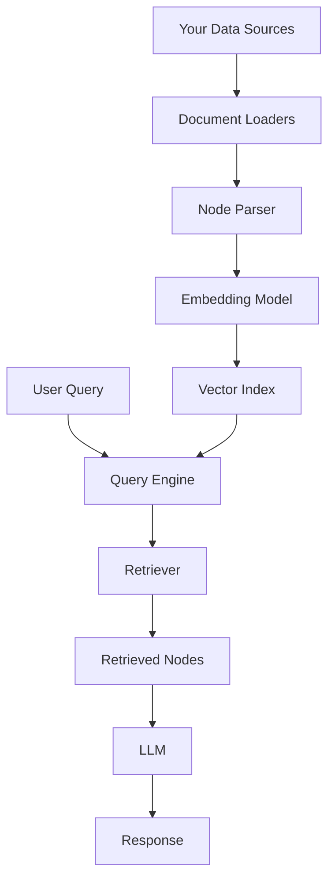
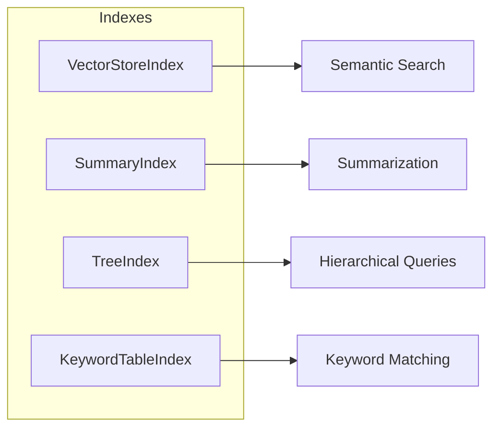
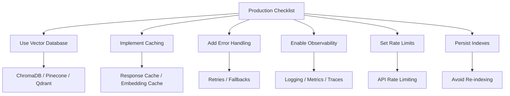

# How to Get Started with LlamaIndex

Author: [nawazdhandala](https://www.github.com/nawazdhandala)

Tags: LlamaIndex, AI, RAG, LLM, Python, Vector Database, Machine Learning, Data Framework

Description: A comprehensive guide to getting started with LlamaIndex for building AI-powered applications. Learn installation, core concepts, document loading, indexing, querying, and best practices for retrieval-augmented generation (RAG).

---

LlamaIndex is a data framework designed to connect large language models (LLMs) with your private data. Whether you want to build a chatbot that answers questions about your documentation, create a semantic search engine over your knowledge base, or develop AI agents that can reason over complex datasets, LlamaIndex provides the building blocks to make it happen.

This guide walks you through everything you need to know to get started with LlamaIndex, from installation to building your first RAG application.

## What is LlamaIndex?

LlamaIndex (formerly GPT Index) bridges the gap between your data and LLMs. While language models like GPT-4 or Claude are trained on vast amounts of public data, they know nothing about your internal documents, databases, or APIs. LlamaIndex solves this by providing tools to:

1. **Ingest data** from various sources (files, databases, APIs)
2. **Index data** using different strategies for efficient retrieval
3. **Query data** using natural language and get LLM-powered responses
4. **Build agents** that can reason and take actions based on your data

Here is how LlamaIndex fits into an AI application architecture:



## Why Use LlamaIndex?

Before diving into code, here are the key benefits of using LlamaIndex:

| Benefit | Description |
|---------|-------------|
| **Unified Interface** | Connect to 100+ data sources with consistent APIs |
| **Multiple Index Types** | Choose the right index structure for your use case |
| **Composable Components** | Mix and match loaders, parsers, indexes, and retrievers |
| **Production Ready** | Built-in support for vector databases, caching, and observability |
| **Active Community** | Extensive documentation and regular updates |

## Installation

LlamaIndex uses a modular package structure. Install the core package and any integrations you need.

Install the core LlamaIndex package along with OpenAI integration for embeddings and LLM access:

```bash
pip install llama-index llama-index-embeddings-openai llama-index-llms-openai
```

For additional integrations, install the relevant packages:

```bash
# For local models with Ollama
pip install llama-index-llms-ollama llama-index-embeddings-ollama

# For Anthropic Claude
pip install llama-index-llms-anthropic

# For vector databases
pip install llama-index-vector-stores-chroma  # ChromaDB
pip install llama-index-vector-stores-pinecone  # Pinecone
pip install llama-index-vector-stores-qdrant  # Qdrant
```

## Setting Up Your Environment

Configure your environment with API keys before running any code.

Set the OpenAI API key as an environment variable for secure access:

```bash
export OPENAI_API_KEY="your-api-key-here"
```

Alternatively, configure settings directly in Python:

```python
# Import the Settings class to configure global defaults
from llama_index.core import Settings
from llama_index.llms.openai import OpenAI
from llama_index.embeddings.openai import OpenAIEmbedding

# Configure the LLM to use GPT-4 with deterministic outputs
# temperature=0 ensures consistent responses for the same input
Settings.llm = OpenAI(model="gpt-4", temperature=0)

# Configure the embedding model for converting text to vectors
# text-embedding-3-small is cost-effective and performs well
Settings.embed_model = OpenAIEmbedding(model="text-embedding-3-small")

# Set default chunk size for document splitting
# 1024 tokens provides good balance between context and precision
Settings.chunk_size = 1024
Settings.chunk_overlap = 200
```

## Your First LlamaIndex Application

Let us build a simple question-answering application that can answer questions about a set of documents.

This example creates documents manually and indexes them for querying:

```python
# Import core components for document creation and indexing
from llama_index.core import Document, VectorStoreIndex

# Create sample documents with text content and metadata
# In real applications, you would load these from files or databases
documents = [
    Document(
        text="LlamaIndex is a data framework for LLM applications. "
             "It helps you ingest, structure, and access private data.",
        metadata={"source": "docs", "topic": "introduction"}
    ),
    Document(
        text="RAG (Retrieval-Augmented Generation) combines retrieval "
             "with generation to ground LLM responses in external data.",
        metadata={"source": "docs", "topic": "concepts"}
    ),
    Document(
        text="Vector indexes store embeddings and enable semantic search. "
             "They find documents based on meaning, not just keywords.",
        metadata={"source": "docs", "topic": "indexing"}
    ),
]

# Create a vector index from the documents
# This automatically generates embeddings for each document
index = VectorStoreIndex.from_documents(documents)

# Create a query engine for asking questions
# The engine retrieves relevant documents and uses LLM to generate answers
query_engine = index.as_query_engine()

# Ask a question about the indexed content
response = query_engine.query("What is LlamaIndex used for?")
print(response)
```

## Loading Documents from Files

Real applications typically load documents from files. LlamaIndex provides loaders for many file formats.

This example loads documents from a directory containing various file types:

```python
# SimpleDirectoryReader handles multiple file formats automatically
from llama_index.core import SimpleDirectoryReader, VectorStoreIndex

# Load all supported files from a directory
# Supports: PDF, DOCX, TXT, MD, HTML, CSV, JSON, and more
reader = SimpleDirectoryReader(
    input_dir="./data",           # Directory containing your files
    recursive=True,                # Include subdirectories
    exclude_hidden=True,           # Skip hidden files and directories
    required_exts=[".pdf", ".txt", ".md"],  # Only load specific types
)

# Load documents into memory
# Each file becomes one or more Document objects
documents = reader.load_data()

print(f"Loaded {len(documents)} documents")

# Inspect document metadata to understand what was loaded
for doc in documents[:3]:
    print(f"File: {doc.metadata.get('file_name', 'unknown')}")
    print(f"Characters: {len(doc.text)}")
    print("---")
```

## Understanding Index Types

LlamaIndex offers several index types, each optimized for different use cases.



### VectorStoreIndex

The most commonly used index. It converts documents into embeddings and enables semantic similarity search.

```python
# VectorStoreIndex is ideal for question-answering and semantic search
from llama_index.core import VectorStoreIndex, SimpleDirectoryReader

# Load your documents
documents = SimpleDirectoryReader("./data").load_data()

# Create the vector index
# Each document chunk is converted to a vector embedding
index = VectorStoreIndex.from_documents(
    documents,
    show_progress=True  # Display progress bar during indexing
)

# Query with natural language
query_engine = index.as_query_engine(
    similarity_top_k=5  # Return top 5 most similar chunks
)

response = query_engine.query("How do I configure authentication?")
print(response)
```

### SummaryIndex

Stores documents in a list and processes all of them when querying. Best for summarization tasks.

```python
# SummaryIndex is useful when you need to consider all documents
from llama_index.core import SummaryIndex, SimpleDirectoryReader

documents = SimpleDirectoryReader("./data").load_data()

# Create a summary index
# Unlike vector index, this considers all documents during querying
summary_index = SummaryIndex.from_documents(documents)

# Create a query engine for summarization
query_engine = summary_index.as_query_engine(
    response_mode="tree_summarize"  # Hierarchically summarize content
)

response = query_engine.query("Summarize all the key points in these documents")
print(response)
```

### KeywordTableIndex

Uses keyword extraction for retrieval. Faster but less nuanced than semantic search.

```python
# KeywordTableIndex is efficient for exact term matching
from llama_index.core import KeywordTableIndex, SimpleDirectoryReader

documents = SimpleDirectoryReader("./data").load_data()

# Create keyword-based index
# Extracts keywords from each document for quick lookup
keyword_index = KeywordTableIndex.from_documents(documents)

query_engine = keyword_index.as_query_engine()
response = query_engine.query("Tell me about API endpoints")
print(response)
```

## Node Parsing and Chunking

Large documents need to be split into smaller chunks (nodes) for effective retrieval. LlamaIndex provides several parsing strategies.

This example demonstrates different chunking approaches:

```python
# Import various node parsers for different splitting strategies
from llama_index.core.node_parser import (
    SentenceSplitter,
    SemanticSplitterNodeParser,
    MarkdownNodeParser,
)
from llama_index.core import SimpleDirectoryReader, VectorStoreIndex
from llama_index.embeddings.openai import OpenAIEmbedding

documents = SimpleDirectoryReader("./data").load_data()

# Option 1: Sentence-based splitting with overlap
# Good for general text, respects sentence boundaries
sentence_parser = SentenceSplitter(
    chunk_size=512,       # Maximum tokens per chunk
    chunk_overlap=50,     # Overlap to maintain context between chunks
)

# Option 2: Semantic splitting based on embedding similarity
# Creates more coherent chunks by detecting topic changes
embed_model = OpenAIEmbedding()
semantic_parser = SemanticSplitterNodeParser(
    buffer_size=1,                         # Sentences to group before checking
    breakpoint_percentile_threshold=95,    # Threshold for topic change
    embed_model=embed_model,
)

# Option 3: Markdown-aware splitting
# Preserves document structure by splitting on headers
markdown_parser = MarkdownNodeParser()

# Parse documents into nodes using your chosen parser
nodes = sentence_parser.get_nodes_from_documents(documents)

print(f"Created {len(nodes)} nodes from {len(documents)} documents")

# Build index from nodes instead of documents
index = VectorStoreIndex(nodes)
```

## Customizing Retrieval

The retriever determines how relevant documents are found. You can customize its behavior for better results.

```python
# Configure retrieval settings for more control over results
from llama_index.core import VectorStoreIndex, SimpleDirectoryReader
from llama_index.core.retrievers import VectorIndexRetriever
from llama_index.core.query_engine import RetrieverQueryEngine
from llama_index.core.postprocessor import SimilarityPostprocessor

documents = SimpleDirectoryReader("./data").load_data()
index = VectorStoreIndex.from_documents(documents)

# Create a custom retriever with specific settings
retriever = VectorIndexRetriever(
    index=index,
    similarity_top_k=10,  # Retrieve more candidates initially
)

# Add a post-processor to filter by similarity score
# This removes low-quality matches before sending to LLM
similarity_filter = SimilarityPostprocessor(
    similarity_cutoff=0.7  # Only keep nodes with similarity >= 0.7
)

# Build query engine with custom retriever and post-processor
query_engine = RetrieverQueryEngine(
    retriever=retriever,
    node_postprocessors=[similarity_filter],
)

response = query_engine.query("What are the main features?")
print(response)
```

## Working with Metadata

Metadata helps filter and organize your documents. You can use it to narrow down search results.

```python
# Use metadata for filtering and organizing documents
from llama_index.core import Document, VectorStoreIndex
from llama_index.core.vector_stores import MetadataFilters, ExactMatchFilter

# Create documents with rich metadata
documents = [
    Document(
        text="Python is a versatile programming language...",
        metadata={
            "category": "programming",
            "language": "python",
            "difficulty": "beginner"
        }
    ),
    Document(
        text="JavaScript runs in browsers and Node.js...",
        metadata={
            "category": "programming",
            "language": "javascript",
            "difficulty": "beginner"
        }
    ),
    Document(
        text="Advanced Python decorators allow metaprogramming...",
        metadata={
            "category": "programming",
            "language": "python",
            "difficulty": "advanced"
        }
    ),
]

index = VectorStoreIndex.from_documents(documents)

# Create filters to only search within specific documents
filters = MetadataFilters(
    filters=[
        ExactMatchFilter(key="language", value="python"),
        ExactMatchFilter(key="difficulty", value="beginner"),
    ]
)

# Apply filters when querying
query_engine = index.as_query_engine(
    filters=filters
)

# This will only search within beginner Python documents
response = query_engine.query("What is Python?")
print(response)
```

## Persisting and Loading Indexes

Save your indexes to disk to avoid re-indexing every time your application starts.

```python
# Save and load indexes to avoid re-processing documents
from llama_index.core import (
    VectorStoreIndex,
    SimpleDirectoryReader,
    StorageContext,
    load_index_from_storage,
)
import os

PERSIST_DIR = "./storage"

def get_index():
    """Load existing index or create new one."""

    # Check if we have a saved index
    if os.path.exists(PERSIST_DIR):
        print("Loading existing index...")
        # Rebuild storage context from saved files
        storage_context = StorageContext.from_defaults(
            persist_dir=PERSIST_DIR
        )
        # Load the index from storage
        index = load_index_from_storage(storage_context)
    else:
        print("Creating new index...")
        # Load documents and create index
        documents = SimpleDirectoryReader("./data").load_data()
        index = VectorStoreIndex.from_documents(documents)

        # Save to disk for future use
        # Creates docstore.json, index_store.json, vector_store.json
        index.storage_context.persist(persist_dir=PERSIST_DIR)

    return index

# Use the index
index = get_index()
query_engine = index.as_query_engine()
response = query_engine.query("Your question here")
```

## Using Vector Databases

For production applications, use a dedicated vector database instead of in-memory storage.

This example uses ChromaDB for persistent vector storage:

```python
# Use ChromaDB for production-ready vector storage
import chromadb
from llama_index.core import VectorStoreIndex, SimpleDirectoryReader, StorageContext
from llama_index.vector_stores.chroma import ChromaVectorStore

# Initialize ChromaDB with persistent storage
# Data survives application restarts
chroma_client = chromadb.PersistentClient(path="./chroma_db")

# Get or create a collection for your documents
chroma_collection = chroma_client.get_or_create_collection(
    name="my_documents",
    metadata={"description": "Document embeddings for RAG"}
)

# Create LlamaIndex vector store wrapper
vector_store = ChromaVectorStore(chroma_collection=chroma_collection)

# Create storage context with the vector store
storage_context = StorageContext.from_defaults(
    vector_store=vector_store
)

# Load and index documents
documents = SimpleDirectoryReader("./data").load_data()

# Create index using ChromaDB for storage
index = VectorStoreIndex.from_documents(
    documents,
    storage_context=storage_context,
    show_progress=True
)

# Query as usual - vectors are stored in ChromaDB
query_engine = index.as_query_engine()
response = query_engine.query("What are the main concepts?")
print(response)
```

## Chat Engine for Conversations

Build conversational interfaces that maintain context across multiple turns.

```python
# Create a chat engine for multi-turn conversations
from llama_index.core import VectorStoreIndex, SimpleDirectoryReader
from llama_index.core.memory import ChatMemoryBuffer

documents = SimpleDirectoryReader("./data").load_data()
index = VectorStoreIndex.from_documents(documents)

# Create memory buffer to store conversation history
# token_limit prevents the context from growing too large
memory = ChatMemoryBuffer.from_defaults(token_limit=3000)

# Create chat engine with memory
chat_engine = index.as_chat_engine(
    chat_mode="context",  # Use retrieved context in responses
    memory=memory,
    system_prompt=(
        "You are a helpful assistant that answers questions "
        "based on the provided documentation. Be concise and accurate."
    ),
)

# First message in conversation
response1 = chat_engine.chat("What is LlamaIndex?")
print(f"Assistant: {response1}")

# Follow-up question - chat engine remembers context
response2 = chat_engine.chat("How do I install it?")
print(f"Assistant: {response2}")

# Another follow-up
response3 = chat_engine.chat("What are the main features?")
print(f"Assistant: {response3}")

# Reset conversation if needed
chat_engine.reset()
```

## Streaming Responses

Stream responses for better user experience in interactive applications.

```python
# Stream responses for real-time output in chat applications
from llama_index.core import VectorStoreIndex, SimpleDirectoryReader

documents = SimpleDirectoryReader("./data").load_data()
index = VectorStoreIndex.from_documents(documents)

# Create streaming query engine
query_engine = index.as_query_engine(streaming=True)

# Get streaming response
streaming_response = query_engine.query("Explain how indexing works")

# Print response as it streams
print("Response: ", end="")
for text in streaming_response.response_gen:
    print(text, end="", flush=True)
print()  # Newline at the end
```

## Using Local Models with Ollama

Run LlamaIndex with local models for privacy and cost savings.

```python
# Use Ollama for local LLM and embedding models
from llama_index.core import VectorStoreIndex, SimpleDirectoryReader, Settings
from llama_index.llms.ollama import Ollama
from llama_index.embeddings.ollama import OllamaEmbedding

# Configure Ollama LLM
# Make sure Ollama is running: ollama serve
# And you have pulled the model: ollama pull llama3
Settings.llm = Ollama(
    model="llama3",
    request_timeout=120.0,  # Longer timeout for local inference
)

# Configure Ollama embeddings
Settings.embed_model = OllamaEmbedding(
    model_name="nomic-embed-text",
    base_url="http://localhost:11434",
)

# Use LlamaIndex as normal - now running completely locally
documents = SimpleDirectoryReader("./data").load_data()
index = VectorStoreIndex.from_documents(documents)

query_engine = index.as_query_engine()
response = query_engine.query("What is the main topic?")
print(response)
```

## Error Handling and Retries

Production applications need proper error handling for reliability.

```python
# Implement error handling and retries for production reliability
from llama_index.core import VectorStoreIndex, SimpleDirectoryReader
from tenacity import retry, stop_after_attempt, wait_exponential
import logging

# Configure logging
logging.basicConfig(level=logging.INFO)
logger = logging.getLogger(__name__)

def build_index_safely(data_path: str) -> VectorStoreIndex:
    """Build index with error handling."""
    try:
        documents = SimpleDirectoryReader(data_path).load_data()

        if not documents:
            raise ValueError(f"No documents found in {data_path}")

        logger.info(f"Loaded {len(documents)} documents")

        index = VectorStoreIndex.from_documents(
            documents,
            show_progress=True
        )

        return index

    except FileNotFoundError:
        logger.error(f"Directory not found: {data_path}")
        raise
    except Exception as e:
        logger.error(f"Failed to build index: {e}")
        raise

# Retry decorator for API calls
# Handles transient failures from LLM providers
@retry(
    stop=stop_after_attempt(3),
    wait=wait_exponential(multiplier=1, min=4, max=10),
)
def query_with_retry(query_engine, question: str):
    """Query with automatic retry on failure."""
    try:
        response = query_engine.query(question)
        return response
    except Exception as e:
        logger.warning(f"Query failed, retrying: {e}")
        raise

# Usage
index = build_index_safely("./data")
query_engine = index.as_query_engine()

try:
    response = query_with_retry(query_engine, "What is the main topic?")
    print(response)
except Exception as e:
    print(f"Query failed after retries: {e}")
```

## Observability and Debugging

Add observability to understand how your RAG application performs.

```python
# Add observability for debugging and monitoring
from llama_index.core import VectorStoreIndex, SimpleDirectoryReader, Settings
from llama_index.core.callbacks import CallbackManager, LlamaDebugHandler
import logging

# Enable LlamaIndex logging
logging.basicConfig(level=logging.DEBUG)
logging.getLogger("llama_index").setLevel(logging.DEBUG)

# Create debug handler for detailed tracing
llama_debug = LlamaDebugHandler(print_trace_on_end=True)

# Set up callback manager
callback_manager = CallbackManager([llama_debug])
Settings.callback_manager = callback_manager

# Build index with observability enabled
documents = SimpleDirectoryReader("./data").load_data()
index = VectorStoreIndex.from_documents(documents)

query_engine = index.as_query_engine()

# Query - detailed trace will be printed
response = query_engine.query("How does retrieval work?")
print(response)

# Access event pairs for analysis
event_pairs = llama_debug.get_event_pairs()
for pair in event_pairs:
    print(f"Event: {pair[0].event_type}")
    print(f"Duration: {pair[1].time - pair[0].time:.2f}s")
```

## Best Practices

Follow these guidelines for building robust LlamaIndex applications:

### Document Preparation

| Practice | Recommendation |
|----------|----------------|
| Clean your data | Remove noise, fix encoding, normalize formatting |
| Add metadata | Include source, date, author for filtering and citations |
| Use meaningful IDs | Assign document IDs for update and deletion tracking |
| Validate content | Check document quality before indexing |

### Chunking Strategy

| Use Case | Recommended Settings |
|----------|---------------------|
| Q&A | chunk_size=512, overlap=50 |
| Summarization | chunk_size=1024, overlap=100 |
| Code | Use language-aware splitters |
| Technical docs | chunk_size=256, overlap=50 |

### Index Selection

| Use Case | Recommended Index |
|----------|-------------------|
| Semantic search | VectorStoreIndex |
| Summarization | SummaryIndex |
| Technical terms | KeywordTableIndex |
| Hybrid search | Combine Vector + Keyword |

### Production Checklist



## Common Patterns

### Pattern 1: Simple Q&A

```python
# Pattern: Basic question-answering over documents
from llama_index.core import VectorStoreIndex, SimpleDirectoryReader

documents = SimpleDirectoryReader("./data").load_data()
index = VectorStoreIndex.from_documents(documents)
query_engine = index.as_query_engine()

response = query_engine.query("Your question")
```

### Pattern 2: Chatbot with Memory

```python
# Pattern: Conversational interface with context
from llama_index.core import VectorStoreIndex, SimpleDirectoryReader
from llama_index.core.memory import ChatMemoryBuffer

documents = SimpleDirectoryReader("./data").load_data()
index = VectorStoreIndex.from_documents(documents)
memory = ChatMemoryBuffer.from_defaults(token_limit=3000)

chat_engine = index.as_chat_engine(
    chat_mode="context",
    memory=memory
)

response = chat_engine.chat("Your message")
```

### Pattern 3: Hybrid Search

```python
# Pattern: Combine semantic and keyword search
from llama_index.core import VectorStoreIndex, KeywordTableIndex
from llama_index.core.query_engine import RouterQueryEngine
from llama_index.core.selectors import LLMSingleSelector
from llama_index.core.tools import QueryEngineTool

documents = SimpleDirectoryReader("./data").load_data()

# Create both index types
vector_index = VectorStoreIndex.from_documents(documents)
keyword_index = KeywordTableIndex.from_documents(documents)

# Create tools for the router
vector_tool = QueryEngineTool.from_defaults(
    query_engine=vector_index.as_query_engine(),
    description="Useful for semantic similarity search"
)

keyword_tool = QueryEngineTool.from_defaults(
    query_engine=keyword_index.as_query_engine(),
    description="Useful for exact keyword matching"
)

# Router selects the best tool for each query
router_engine = RouterQueryEngine(
    selector=LLMSingleSelector.from_defaults(),
    query_engine_tools=[vector_tool, keyword_tool]
)

response = router_engine.query("Your question")
```

## Next Steps

Now that you understand the basics, explore these advanced topics:

1. **Agents** - Build AI agents that can use tools and reason over data
2. **Sub-Question Query Engine** - Break complex questions into sub-questions
3. **Knowledge Graphs** - Build and query knowledge graphs from documents
4. **Multi-Modal** - Index and query images, audio, and video
5. **Custom Retrievers** - Build domain-specific retrieval logic
6. **Evaluation** - Measure and improve RAG performance

Check the official documentation at [docs.llamaindex.ai](https://docs.llamaindex.ai) for detailed guides on each topic.

## Summary

LlamaIndex provides a comprehensive toolkit for building LLM-powered applications:

| Component | Purpose |
|-----------|---------|
| Document Loaders | Ingest data from files, databases, APIs |
| Node Parsers | Split documents into optimal chunks |
| Indexes | Store and organize data for retrieval |
| Query Engines | Answer questions using LLM |
| Chat Engines | Build conversational interfaces |
| Storage | Persist indexes to disk or databases |

Key takeaways:

1. Start with VectorStoreIndex for most use cases
2. Choose chunk sizes based on your retrieval needs
3. Use metadata for filtering and organization
4. Persist indexes to avoid re-processing
5. Add observability to understand performance
6. Use vector databases for production workloads

---

*Building AI applications with LlamaIndex? Pair it with [OneUptime](https://oneuptime.com) to monitor your RAG pipelines, track query latency, and ensure your AI-powered applications stay reliable in production.*
