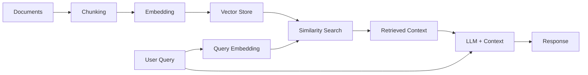

# How to Build RAG Applications with LlamaIndex

Author: [nawazdhandala](https://www.github.com/nawazdhandala)

Tags: LlamaIndex, RAG, LLM, AI, Python

Description: Learn how to build Retrieval-Augmented Generation (RAG) applications with LlamaIndex, covering data ingestion, indexing, query engines, and production deployment patterns.

---

> RAG (Retrieval-Augmented Generation) is the most practical way to give LLMs access to your private data without fine-tuning. LlamaIndex makes building RAG pipelines surprisingly straightforward, handling the complexity of chunking, embedding, and retrieval so you can focus on your application logic.

The core idea behind RAG is simple: instead of relying solely on an LLM's training data, you retrieve relevant context from your own documents and include it in the prompt. This gives you accurate, up-to-date responses grounded in your actual data.

---

## How RAG Works

Before diving into code, let's understand the RAG pipeline architecture.



The pipeline has two phases:

**Indexing Phase:**
1. Load documents from various sources
2. Split documents into smaller chunks
3. Generate embeddings for each chunk
4. Store embeddings in a vector database

**Query Phase:**
1. Convert user query to an embedding
2. Find similar chunks in the vector store
3. Pass retrieved chunks as context to the LLM
4. Generate a response based on the context

---

## Setting Up LlamaIndex

### Installation

Install the core LlamaIndex package along with the OpenAI integration for embeddings and LLM calls.

```bash
# Install core LlamaIndex and OpenAI integration
pip install llama-index llama-index-llms-openai llama-index-embeddings-openai

# Optional: Install additional integrations as needed
pip install llama-index-vector-stores-chroma  # For ChromaDB
pip install llama-index-readers-file          # For various file formats
```

### Basic Configuration

This configuration sets up the global LLM and embedding models that LlamaIndex will use throughout your application. The Settings object provides a centralized way to configure defaults.

```python
# config.py
# Import core LlamaIndex settings and model classes
import os
from llama_index.core import Settings
from llama_index.llms.openai import OpenAI
from llama_index.embeddings.openai import OpenAIEmbedding

def configure_llama_index():
    """Configure global LlamaIndex settings for LLM and embeddings"""

    # Set up the LLM - GPT-4 provides better reasoning for complex queries
    Settings.llm = OpenAI(
        model="gpt-4-turbo-preview",  # Use GPT-4 for better quality responses
        temperature=0.1,  # Low temperature for more consistent, factual answers
        api_key=os.getenv("OPENAI_API_KEY")  # Load API key from environment
    )

    # Set up the embedding model - must match what you use for indexing
    Settings.embed_model = OpenAIEmbedding(
        model="text-embedding-3-small",  # Cost-effective embedding model
        api_key=os.getenv("OPENAI_API_KEY")
    )

    # Configure chunking defaults for document processing
    Settings.chunk_size = 1024  # Size of text chunks in tokens
    Settings.chunk_overlap = 200  # Overlap between chunks to preserve context

    return Settings

# Initialize settings when module is imported
configure_llama_index()
```

---

## Loading and Indexing Documents

### Simple Document Loading

The SimpleDirectoryReader is the quickest way to load documents from a folder. It automatically detects file types and uses appropriate parsers for PDFs, Word docs, text files, and more.

```python
# document_loader.py
# Load documents from a directory and create a searchable index
from llama_index.core import VectorStoreIndex, SimpleDirectoryReader
from pathlib import Path

def load_and_index_documents(data_dir: str) -> VectorStoreIndex:
    """Load documents from a directory and create a vector index"""

    # Verify the data directory exists before attempting to load
    data_path = Path(data_dir)
    if not data_path.exists():
        raise ValueError(f"Data directory not found: {data_dir}")

    print(f"Loading documents from {data_dir}...")

    # SimpleDirectoryReader handles multiple file types automatically:
    # - .txt, .md, .pdf, .docx, .csv, .json, and more
    documents = SimpleDirectoryReader(
        input_dir=data_dir,
        recursive=True,  # Include subdirectories
        required_exts=[".txt", ".md", ".pdf"]  # Filter specific file types
    ).load_data()

    print(f"Loaded {len(documents)} documents")

    # Create the vector index - this embeds all document chunks
    # and stores them for similarity search
    index = VectorStoreIndex.from_documents(
        documents,
        show_progress=True  # Display progress bar during embedding
    )

    return index


def query_index(index: VectorStoreIndex, question: str) -> str:
    """Query the index and return a response"""

    # Create a query engine from the index
    # The engine handles: embedding the query, retrieving relevant chunks,
    # and generating a response using the LLM
    query_engine = index.as_query_engine()

    # Execute the query and get a response
    response = query_engine.query(question)

    return str(response)


# Example usage
if __name__ == "__main__":
    # Load documents and create index
    index = load_and_index_documents("./data/docs")

    # Query the index
    answer = query_index(index, "What is the main topic of these documents?")
    print(f"Answer: {answer}")
```

### Loading Specific File Types

When you need fine-grained control over how different file types are processed, you can use specialized readers. This example shows how to load PDFs with custom parsing options.

```python
# file_loaders.py
# Specialized document loaders for different file types
from llama_index.core import Document
from llama_index.readers.file import PDFReader, DocxReader
from pathlib import Path
from typing import List

def load_pdf_documents(pdf_dir: str) -> List[Document]:
    """Load PDF documents with custom configuration"""

    pdf_reader = PDFReader()
    documents = []

    # Iterate through all PDF files in the directory
    pdf_path = Path(pdf_dir)
    for pdf_file in pdf_path.glob("*.pdf"):
        print(f"Loading: {pdf_file.name}")

        # Load the PDF - returns a list of Document objects (one per page)
        docs = pdf_reader.load_data(file=pdf_file)

        # Add metadata to each document for filtering and context
        for doc in docs:
            doc.metadata["source"] = str(pdf_file)
            doc.metadata["file_type"] = "pdf"
            doc.metadata["file_name"] = pdf_file.name

        documents.extend(docs)

    return documents


def load_from_urls(urls: List[str]) -> List[Document]:
    """Load documents from web URLs"""
    from llama_index.readers.web import SimpleWebPageReader

    # Create a web reader that extracts text from HTML pages
    reader = SimpleWebPageReader(html_to_text=True)

    documents = reader.load_data(urls=urls)

    # Add URL as metadata for source tracking
    for doc, url in zip(documents, urls):
        doc.metadata["source_url"] = url

    return documents


def create_document_from_text(
    text: str,
    metadata: dict = None
) -> Document:
    """Create a Document object from raw text"""

    # Useful for adding content from databases, APIs, or other sources
    return Document(
        text=text,
        metadata=metadata or {}
    )
```

---

## Customizing the Chunking Strategy

The way you split documents into chunks significantly impacts retrieval quality. LlamaIndex provides several node parsers for different chunking strategies.

```python
# chunking.py
# Configure document chunking strategies for optimal retrieval
from llama_index.core.node_parser import (
    SentenceSplitter,
    SemanticSplitterNodeParser,
)
from llama_index.core import VectorStoreIndex, Document
from llama_index.embeddings.openai import OpenAIEmbedding
from typing import List

def chunk_with_sentence_splitter(
    documents: List[Document],
    chunk_size: int = 1024,
    chunk_overlap: int = 200
) -> VectorStoreIndex:
    """Chunk documents using sentence boundaries for clean splits"""

    # SentenceSplitter tries to break at sentence boundaries
    # This preserves semantic meaning better than arbitrary splits
    splitter = SentenceSplitter(
        chunk_size=chunk_size,  # Target chunk size in tokens
        chunk_overlap=chunk_overlap,  # Overlap to maintain context across chunks
        paragraph_separator="\n\n"  # How to identify paragraph breaks
    )

    # Parse documents into nodes (chunks)
    nodes = splitter.get_nodes_from_documents(documents)

    print(f"Created {len(nodes)} chunks from {len(documents)} documents")

    # Build index from the chunked nodes
    index = VectorStoreIndex(nodes, show_progress=True)

    return index


def chunk_with_semantic_splitter(
    documents: List[Document],
    buffer_size: int = 1,
    breakpoint_percentile: int = 95
) -> VectorStoreIndex:
    """Chunk documents based on semantic similarity between sentences"""

    # SemanticSplitter groups semantically similar sentences together
    # This creates more coherent chunks than fixed-size splitting
    embed_model = OpenAIEmbedding()

    splitter = SemanticSplitterNodeParser(
        buffer_size=buffer_size,  # Sentences to group together
        breakpoint_percentile_threshold=breakpoint_percentile,  # Similarity threshold
        embed_model=embed_model
    )

    nodes = splitter.get_nodes_from_documents(documents)

    print(f"Created {len(nodes)} semantic chunks")

    index = VectorStoreIndex(nodes, show_progress=True)

    return index


# Choosing the right chunking strategy:
# - SentenceSplitter: Good default, fast, works well for most documents
# - SemanticSplitter: Better quality chunks, but slower and uses more API calls
# - Larger chunks: Better for documents where context spans multiple paragraphs
# - Smaller chunks: Better for precise retrieval of specific facts
```

---

## Using Vector Stores for Persistence

For production applications, you need a persistent vector store instead of the default in-memory storage. ChromaDB is a popular choice that works well locally.

```python
# vector_store.py
# Persist embeddings to ChromaDB for production use
import chromadb
from llama_index.core import VectorStoreIndex, StorageContext
from llama_index.vector_stores.chroma import ChromaVectorStore
from llama_index.core import Document
from typing import List, Optional

class RAGVectorStore:
    """Wrapper class for ChromaDB-backed vector storage"""

    def __init__(
        self,
        collection_name: str = "documents",
        persist_dir: str = "./chroma_db"
    ):
        self.collection_name = collection_name
        self.persist_dir = persist_dir

        # Initialize ChromaDB with persistent storage
        # Data survives application restarts
        self.chroma_client = chromadb.PersistentClient(path=persist_dir)

        # Get or create the collection for storing embeddings
        self.collection = self.chroma_client.get_or_create_collection(
            name=collection_name
        )

        # Create LlamaIndex vector store wrapper
        self.vector_store = ChromaVectorStore(chroma_collection=self.collection)

        # Storage context tells LlamaIndex where to store data
        self.storage_context = StorageContext.from_defaults(
            vector_store=self.vector_store
        )

    def add_documents(self, documents: List[Document]) -> VectorStoreIndex:
        """Add documents to the vector store and return the index"""

        # Create index from documents using our storage context
        index = VectorStoreIndex.from_documents(
            documents,
            storage_context=self.storage_context,
            show_progress=True
        )

        print(f"Added {len(documents)} documents to collection '{self.collection_name}'")

        return index

    def load_index(self) -> VectorStoreIndex:
        """Load existing index from the vector store"""

        # Create index from the existing vector store
        # No need to re-embed documents - just load the stored embeddings
        index = VectorStoreIndex.from_vector_store(
            vector_store=self.vector_store
        )

        return index

    def delete_collection(self):
        """Delete the entire collection - use with caution"""
        self.chroma_client.delete_collection(self.collection_name)
        print(f"Deleted collection '{self.collection_name}'")


# Example usage
def setup_persistent_rag():
    """Set up a persistent RAG system with ChromaDB"""
    from llama_index.core import SimpleDirectoryReader

    # Initialize vector store
    store = RAGVectorStore(
        collection_name="my_documents",
        persist_dir="./data/chroma"
    )

    # Check if we already have indexed documents
    if store.collection.count() > 0:
        print("Loading existing index...")
        index = store.load_index()
    else:
        print("Creating new index...")
        documents = SimpleDirectoryReader("./data/docs").load_data()
        index = store.add_documents(documents)

    return index
```

---

## Building Query Engines

Query engines are the interface between users and your indexed data. LlamaIndex offers several query engine types optimized for different use cases.

```python
# query_engines.py
# Different query engine configurations for various use cases
from llama_index.core import VectorStoreIndex
from llama_index.core.query_engine import RetrieverQueryEngine
from llama_index.core.retrievers import VectorIndexRetriever
from llama_index.core.response_synthesizers import get_response_synthesizer
from llama_index.core.postprocessor import SimilarityPostprocessor

def create_simple_query_engine(index: VectorStoreIndex):
    """Basic query engine with default settings"""

    # The simplest approach - good for getting started
    query_engine = index.as_query_engine(
        similarity_top_k=5  # Retrieve top 5 most similar chunks
    )

    return query_engine


def create_advanced_query_engine(
    index: VectorStoreIndex,
    top_k: int = 10,
    similarity_cutoff: float = 0.7
):
    """Advanced query engine with custom retriever and post-processing"""

    # Custom retriever with more retrieved results
    retriever = VectorIndexRetriever(
        index=index,
        similarity_top_k=top_k  # Retrieve more initially for filtering
    )

    # Post-processor to filter out low-relevance results
    similarity_filter = SimilarityPostprocessor(
        similarity_cutoff=similarity_cutoff  # Minimum similarity score
    )

    # Response synthesizer that refines answers iteratively
    response_synthesizer = get_response_synthesizer(
        response_mode="refine"  # Iteratively refine the answer with each chunk
    )

    # Assemble the custom query engine
    query_engine = RetrieverQueryEngine(
        retriever=retriever,
        response_synthesizer=response_synthesizer,
        node_postprocessors=[similarity_filter]
    )

    return query_engine


def create_streaming_query_engine(index: VectorStoreIndex):
    """Query engine that streams responses token by token"""

    query_engine = index.as_query_engine(
        streaming=True,  # Enable streaming responses
        similarity_top_k=5
    )

    return query_engine


def stream_response(query_engine, question: str):
    """Execute a streaming query and print tokens as they arrive"""

    response = query_engine.query(question)

    # Stream tokens as they're generated
    print("Response: ", end="", flush=True)
    for token in response.response_gen:
        print(token, end="", flush=True)
    print()  # New line at end

    return response
```

---

## Response Modes Explained

LlamaIndex supports several response synthesis modes that determine how retrieved chunks are combined into a final answer.

| Mode | Description | Best For |
|------|-------------|----------|
| `refine` | Iteratively refine the answer with each chunk | Complex questions needing comprehensive answers |
| `compact` | Combine chunks into minimal prompts before querying | Cost optimization while maintaining quality |
| `tree_summarize` | Build a summary tree from chunks | Summarization of large document sets |
| `simple_summarize` | Concatenate all chunks and summarize once | Quick summaries of small result sets |
| `accumulate` | Generate responses for each chunk separately | When you need per-source answers |
| `compact_accumulate` | Compact version of accumulate | Balance of detail and efficiency |

```python
# response_modes.py
# Demonstrate different response synthesis modes
from llama_index.core import VectorStoreIndex
from llama_index.core.response_synthesizers import get_response_synthesizer, ResponseMode

def query_with_response_mode(
    index: VectorStoreIndex,
    question: str,
    response_mode: str = "compact"
):
    """Query using a specific response synthesis mode"""

    # Get the appropriate response synthesizer
    synthesizer = get_response_synthesizer(
        response_mode=ResponseMode(response_mode)
    )

    # Create query engine with custom synthesizer
    query_engine = index.as_query_engine(
        response_synthesizer=synthesizer,
        similarity_top_k=5
    )

    response = query_engine.query(question)

    return response


# Example comparing different modes
def compare_response_modes(index: VectorStoreIndex, question: str):
    """Compare outputs from different response modes"""

    modes = ["compact", "refine", "tree_summarize"]

    for mode in modes:
        print(f"\n{'='*50}")
        print(f"Response Mode: {mode}")
        print('='*50)

        response = query_with_response_mode(index, question, mode)
        print(response)
```

---

## Adding Metadata Filtering

Metadata filtering allows you to narrow down search results based on document properties. This is essential when you have documents from multiple sources or time periods.

```python
# metadata_filtering.py
# Filter retrieval results based on document metadata
from llama_index.core import VectorStoreIndex, Document
from llama_index.core.vector_stores import (
    MetadataFilter,
    MetadataFilters,
    FilterOperator,
    FilterCondition
)
from datetime import datetime
from typing import List

def create_documents_with_metadata() -> List[Document]:
    """Create documents with rich metadata for filtering"""

    documents = [
        Document(
            text="Q3 2024 revenue increased by 15% compared to Q2.",
            metadata={
                "source": "quarterly_report",
                "department": "finance",
                "year": 2024,
                "quarter": "Q3"
            }
        ),
        Document(
            text="The new product launch exceeded expectations with 10k units sold.",
            metadata={
                "source": "product_update",
                "department": "sales",
                "year": 2024,
                "quarter": "Q3"
            }
        ),
        Document(
            text="Engineering team completed the infrastructure migration.",
            metadata={
                "source": "tech_update",
                "department": "engineering",
                "year": 2024,
                "quarter": "Q2"
            }
        ),
    ]

    return documents


def query_with_single_filter(
    index: VectorStoreIndex,
    question: str,
    department: str
):
    """Query with a single metadata filter"""

    # Create a filter for a specific department
    filters = MetadataFilters(
        filters=[
            MetadataFilter(
                key="department",
                value=department,
                operator=FilterOperator.EQ  # Equals
            )
        ]
    )

    # Apply filters to the query engine
    query_engine = index.as_query_engine(
        filters=filters,
        similarity_top_k=5
    )

    return query_engine.query(question)


def query_with_multiple_filters(
    index: VectorStoreIndex,
    question: str,
    year: int,
    departments: List[str]
):
    """Query with multiple metadata filters combined"""

    # Create filters: year equals value AND department in list
    filters = MetadataFilters(
        filters=[
            MetadataFilter(
                key="year",
                value=year,
                operator=FilterOperator.EQ
            ),
            MetadataFilter(
                key="department",
                value=departments,
                operator=FilterOperator.IN  # Value in list
            )
        ],
        condition=FilterCondition.AND  # Both conditions must match
    )

    query_engine = index.as_query_engine(
        filters=filters,
        similarity_top_k=5
    )

    return query_engine.query(question)


# Example usage
def demo_metadata_filtering():
    """Demonstrate metadata filtering in action"""

    # Create index with metadata-rich documents
    documents = create_documents_with_metadata()
    index = VectorStoreIndex.from_documents(documents)

    # Query only finance documents
    response = query_with_single_filter(
        index,
        "What are the latest financial results?",
        department="finance"
    )
    print(f"Finance only: {response}")

    # Query 2024 documents from finance or sales
    response = query_with_multiple_filters(
        index,
        "What happened in Q3?",
        year=2024,
        departments=["finance", "sales"]
    )
    print(f"2024 Finance/Sales: {response}")
```

---

## Building a Chat Engine

Chat engines maintain conversation history, allowing for follow-up questions and contextual dialogue. This creates a more natural interaction pattern.

```python
# chat_engine.py
# Build conversational interfaces with memory
from llama_index.core import VectorStoreIndex
from llama_index.core.memory import ChatMemoryBuffer
from llama_index.core.chat_engine import CondensePlusContextChatEngine

def create_chat_engine(index: VectorStoreIndex):
    """Create a chat engine with conversation memory"""

    # Memory buffer stores recent conversation history
    memory = ChatMemoryBuffer.from_defaults(
        token_limit=3000  # Limit context window usage
    )

    # CondensePlusContext mode:
    # 1. Condenses chat history + new question into a standalone query
    # 2. Retrieves relevant context for the condensed query
    # 3. Generates response using context + conversation history
    chat_engine = index.as_chat_engine(
        chat_mode="condense_plus_context",
        memory=memory,
        verbose=True,  # Print intermediate steps for debugging
        system_prompt=(
            "You are a helpful assistant with access to a document collection. "
            "Answer questions based on the provided context. "
            "If you cannot find the answer in the context, say so clearly."
        )
    )

    return chat_engine


def chat_session(chat_engine):
    """Run an interactive chat session"""

    print("Chat session started. Type 'quit' to exit.")
    print("-" * 50)

    while True:
        # Get user input
        user_input = input("\nYou: ").strip()

        if user_input.lower() in ['quit', 'exit', 'q']:
            print("Ending chat session.")
            break

        if not user_input:
            continue

        # Get response from chat engine
        response = chat_engine.chat(user_input)

        print(f"\nAssistant: {response}")

    return chat_engine


def get_chat_history(chat_engine) -> list:
    """Retrieve the conversation history"""

    # Access the memory to get chat history
    history = chat_engine.memory.get_all()

    return history


# Example with streaming chat
def create_streaming_chat_engine(index: VectorStoreIndex):
    """Create a chat engine that streams responses"""

    memory = ChatMemoryBuffer.from_defaults(token_limit=3000)

    chat_engine = index.as_chat_engine(
        chat_mode="condense_plus_context",
        memory=memory,
        streaming=True  # Enable streaming
    )

    return chat_engine


def stream_chat_response(chat_engine, message: str):
    """Stream a chat response token by token"""

    response = chat_engine.stream_chat(message)

    print("Assistant: ", end="", flush=True)
    for token in response.response_gen:
        print(token, end="", flush=True)
    print()

    return response
```

---

## Complete RAG Application

Here's a complete example that ties everything together into a production-ready RAG service.

```python
# rag_service.py
# Complete RAG service with FastAPI integration
import os
from pathlib import Path
from typing import Optional, List
from contextlib import asynccontextmanager

from fastapi import FastAPI, HTTPException
from pydantic import BaseModel

from llama_index.core import VectorStoreIndex, Settings, SimpleDirectoryReader
from llama_index.llms.openai import OpenAI
from llama_index.embeddings.openai import OpenAIEmbedding
from llama_index.core.memory import ChatMemoryBuffer

# Global index and chat engine storage
rag_index: Optional[VectorStoreIndex] = None
chat_sessions: dict = {}


class QueryRequest(BaseModel):
    """Request model for single queries"""
    question: str
    top_k: int = 5


class ChatRequest(BaseModel):
    """Request model for chat interactions"""
    session_id: str
    message: str


class QueryResponse(BaseModel):
    """Response model for queries"""
    answer: str
    sources: List[str]


@asynccontextmanager
async def lifespan(app: FastAPI):
    """Initialize RAG components on startup"""
    global rag_index

    # Configure LlamaIndex settings
    Settings.llm = OpenAI(
        model="gpt-4-turbo-preview",
        temperature=0.1,
        api_key=os.getenv("OPENAI_API_KEY")
    )

    Settings.embed_model = OpenAIEmbedding(
        model="text-embedding-3-small",
        api_key=os.getenv("OPENAI_API_KEY")
    )

    # Load documents and create index
    data_dir = os.getenv("DATA_DIR", "./data/docs")

    if Path(data_dir).exists():
        print(f"Loading documents from {data_dir}...")
        documents = SimpleDirectoryReader(data_dir, recursive=True).load_data()
        rag_index = VectorStoreIndex.from_documents(documents, show_progress=True)
        print(f"Indexed {len(documents)} documents")
    else:
        print(f"Warning: Data directory {data_dir} not found")
        rag_index = VectorStoreIndex([])

    yield  # Application runs here

    # Cleanup on shutdown
    print("Shutting down RAG service...")


app = FastAPI(
    title="RAG Service",
    description="Retrieval-Augmented Generation API powered by LlamaIndex",
    lifespan=lifespan
)


@app.post("/query", response_model=QueryResponse)
async def query_documents(request: QueryRequest):
    """Query the document index"""

    if rag_index is None:
        raise HTTPException(status_code=503, detail="Index not initialized")

    # Create query engine with specified parameters
    query_engine = rag_index.as_query_engine(
        similarity_top_k=request.top_k
    )

    # Execute query
    response = query_engine.query(request.question)

    # Extract source information from the response
    sources = []
    if response.source_nodes:
        for node in response.source_nodes:
            source = node.metadata.get("file_name", "Unknown source")
            if source not in sources:
                sources.append(source)

    return QueryResponse(
        answer=str(response),
        sources=sources
    )


@app.post("/chat", response_model=QueryResponse)
async def chat(request: ChatRequest):
    """Chat with the document index, maintaining conversation history"""

    if rag_index is None:
        raise HTTPException(status_code=503, detail="Index not initialized")

    # Get or create chat engine for this session
    if request.session_id not in chat_sessions:
        memory = ChatMemoryBuffer.from_defaults(token_limit=3000)
        chat_sessions[request.session_id] = rag_index.as_chat_engine(
            chat_mode="condense_plus_context",
            memory=memory
        )

    chat_engine = chat_sessions[request.session_id]

    # Get response
    response = chat_engine.chat(request.message)

    # Extract sources
    sources = []
    if hasattr(response, 'source_nodes') and response.source_nodes:
        for node in response.source_nodes:
            source = node.metadata.get("file_name", "Unknown source")
            if source not in sources:
                sources.append(source)

    return QueryResponse(
        answer=str(response),
        sources=sources
    )


@app.delete("/chat/{session_id}")
async def end_chat_session(session_id: str):
    """End a chat session and clear its memory"""

    if session_id in chat_sessions:
        del chat_sessions[session_id]
        return {"message": f"Session {session_id} ended"}

    raise HTTPException(status_code=404, detail="Session not found")


@app.get("/health")
async def health_check():
    """Health check endpoint"""

    return {
        "status": "healthy",
        "index_loaded": rag_index is not None,
        "active_sessions": len(chat_sessions)
    }


if __name__ == "__main__":
    import uvicorn
    uvicorn.run(app, host="0.0.0.0", port=8000)
```

---

## Running the Service

Deploy the RAG service with Docker for production use.

```bash
# Dockerfile
FROM python:3.11-slim

WORKDIR /app

# Install dependencies
COPY requirements.txt .
RUN pip install --no-cache-dir -r requirements.txt

# Copy application code
COPY . .

# Create data directory
RUN mkdir -p /app/data/docs

# Run the service
CMD ["uvicorn", "rag_service:app", "--host", "0.0.0.0", "--port", "8000"]
```

```bash
# docker-compose.yml
version: '3.8'

services:
  rag-service:
    build: .
    ports:
      - "8000:8000"
    environment:
      - OPENAI_API_KEY=${OPENAI_API_KEY}
      - DATA_DIR=/app/data/docs
    volumes:
      - ./data/docs:/app/data/docs:ro
    healthcheck:
      test: ["CMD", "curl", "-f", "http://localhost:8000/health"]
      interval: 30s
      timeout: 10s
      retries: 3
```

---

## Testing Your RAG Application

Test the endpoints with curl:

```bash
# Query the documents
curl -X POST http://localhost:8000/query \
  -H "Content-Type: application/json" \
  -d '{"question": "What are the key features of our product?", "top_k": 5}'

# Start a chat session
curl -X POST http://localhost:8000/chat \
  -H "Content-Type: application/json" \
  -d '{"session_id": "user123", "message": "Tell me about the documentation"}'

# Follow-up question in same session
curl -X POST http://localhost:8000/chat \
  -H "Content-Type: application/json" \
  -d '{"session_id": "user123", "message": "Can you elaborate on that last point?"}'

# End the chat session
curl -X DELETE http://localhost:8000/chat/user123
```

---

## Performance Optimization Tips

| Optimization | Impact | Implementation |
|--------------|--------|----------------|
| Batch embedding | Reduces API calls | Use `batch_size` parameter in embedding model |
| Caching | Faster repeated queries | Enable LlamaIndex caching or add Redis layer |
| Smaller embeddings | Lower storage, faster search | Use `text-embedding-3-small` instead of `large` |
| Async operations | Better concurrency | Use `aquery()` and `achat()` methods |
| Connection pooling | Reduced latency | Configure httpx client settings |

---

## Common Pitfalls to Avoid

1. **Chunk size too large** - Leads to irrelevant context being included. Start with 512-1024 tokens.

2. **No chunk overlap** - Causes information loss at boundaries. Use 10-20% overlap.

3. **Ignoring metadata** - Makes filtering impossible later. Always attach source info.

4. **Single retrieval count** - Too few results miss relevant content, too many add noise. Experiment with top_k values.

5. **No similarity threshold** - Low-relevance chunks confuse the LLM. Filter with SimilarityPostprocessor.

---

## Best Practices Summary

1. **Start simple** - Use default settings first, then optimize based on actual performance
2. **Persist your index** - Use a vector store like ChromaDB for production
3. **Add rich metadata** - Enable filtering and source tracking from day one
4. **Monitor costs** - Track embedding and LLM API usage, especially during indexing
5. **Test with real queries** - Evaluate retrieval quality with actual user questions
6. **Use streaming** - Improves perceived latency for end users
7. **Handle failures gracefully** - Implement retries and fallbacks for API calls

---

*Want to monitor your RAG application in production? [OneUptime](https://oneuptime.com) provides comprehensive observability for AI-powered applications, including latency tracking, error monitoring, and cost analytics for LLM API calls.*

**Related Reading:**
- [How to Get Started with LlamaIndex](https://oneuptime.com/blog/post/2026-02-02-llamaindex-getting-started/view)
- [How to Get Started with LangChain](https://oneuptime.com/blog/post/2026-02-02-langchain-getting-started/view)
- [OpenTelemetry for AI Applications](https://oneuptime.com/blog/post/2025-09-18-what-is-opentelemetry-collector-and-why-use-one/view)
