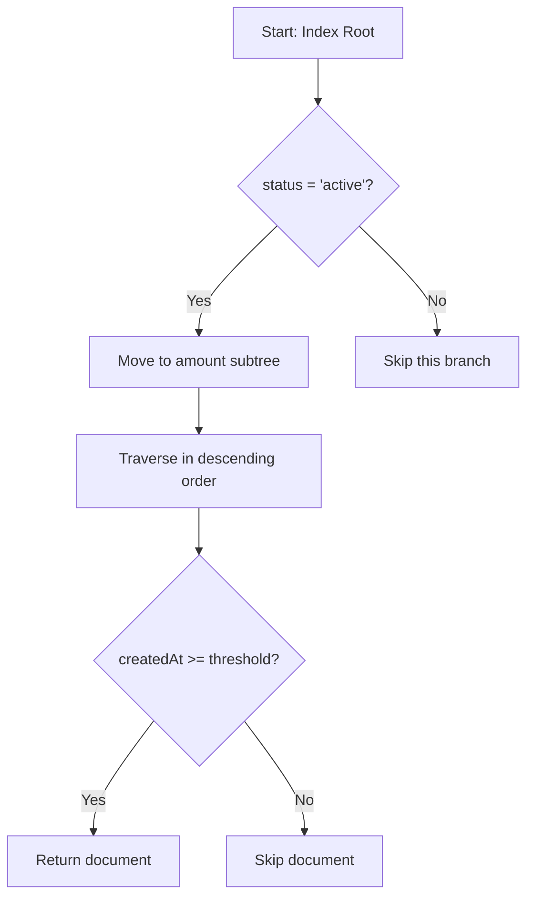

# How to Create Effective Indexes in MongoDB

Author: [nawazdhandala](https://www.github.com/nawazdhandala)

Tags: MongoDB, Indexes, Database, Performance, NoSQL

Description: Learn how to design and create effective indexes in MongoDB that improve query performance, avoid common pitfalls, and keep your database running fast at scale.

---

Indexes are the difference between a query that finishes in milliseconds and one that scans millions of documents. MongoDB gives you a lot of flexibility in how you index your data, but that flexibility also makes it easy to get things wrong. This guide covers the practical side of creating indexes that actually help your queries, and avoiding the ones that just waste memory and slow down writes.

## Understanding How MongoDB Uses Indexes

Before diving into index creation, you need to understand what happens when MongoDB executes a query. Without an index, MongoDB performs a collection scan, reading every document to find matches. With an index, MongoDB can jump directly to the matching documents.

Here's a simple example that shows the difference:

```javascript
// Without an index, this query scans all documents in the collection
db.orders.find({ customerId: "cust_12345" })

// Let's check the query execution plan
db.orders.find({ customerId: "cust_12345" }).explain("executionStats")
```

The explain output will show a COLLSCAN stage, which means full collection scan. On a collection with millions of documents, this can take seconds or even minutes.

Now let's add an index and see the difference:

```javascript
// Create an index on the customerId field
db.orders.createIndex({ customerId: 1 })

// Run the same query again
db.orders.find({ customerId: "cust_12345" }).explain("executionStats")
```

Now you'll see an IXSCAN stage (index scan), and the query will return in milliseconds regardless of collection size.

## Choosing Which Fields to Index

The first step in creating effective indexes is identifying which fields actually need them. Here's a practical approach:

### Index Fields That Appear in Query Filters

Start by looking at your most common queries. Any field that appears in a `find()` filter, `aggregate()` `$match` stage, or query condition is a candidate for indexing.

```javascript
// These are the types of query patterns to look for in your code
db.users.find({ email: "user@example.com" })
db.orders.find({ status: "pending", createdAt: { $gt: new Date("2024-01-01") } })
db.products.find({ category: "electronics", price: { $lte: 500 } })
```

### Index Fields Used for Sorting

If your queries include `.sort()`, the sorted fields should also be indexed. Without an index, MongoDB has to load all matching documents into memory and sort them there, which can be slow and memory-intensive.

```javascript
// This query needs an index that supports both filtering and sorting
db.orders.find({ status: "completed" }).sort({ createdAt: -1 })
```

### Skip Fields With Low Cardinality

Cardinality refers to how many unique values a field has. A boolean field like `isActive` has only two values (true/false), which makes it a poor candidate for a standalone index. MongoDB would still need to scan half the collection on average.

```javascript
// Bad: Low cardinality field as standalone index
db.users.createIndex({ isActive: 1 })  // Don't do this

// Better: Combine with a high cardinality field
db.users.createIndex({ isActive: 1, lastLoginAt: -1 })
```

## Compound Indexes: Getting Them Right

Compound indexes contain multiple fields and are where most developers make mistakes. The order of fields matters significantly.

### The ESR Rule

A helpful guideline for ordering fields in compound indexes is the ESR rule:

1. **Equality** fields first (exact matches like `status: "active"`)
2. **Sort** fields second
3. **Range** fields last (operators like `$gt`, `$lt`, `$in`)

Here's why this order matters:

```javascript
// Query: Find active orders from the last 30 days, sorted by amount
db.orders.find({
  status: "active",
  createdAt: { $gte: new Date("2024-01-01") }
}).sort({ amount: -1 })

// Good index order: equality, sort, range
db.orders.createIndex({ status: 1, amount: -1, createdAt: 1 })

// Bad index order: range before sort
db.orders.createIndex({ status: 1, createdAt: 1, amount: -1 })  // Won't sort efficiently
```

With the correct order, MongoDB can use the index to both filter and sort. With the wrong order, it may need to do an in-memory sort, which is slower and has memory limits.

### Visualizing Index Usage

Here's how MongoDB traverses a compound index:



## Partial Indexes: Reducing Index Size

Partial indexes only include documents that match a filter expression. This saves disk space and memory, and makes index updates faster.

Use partial indexes when your queries consistently filter for a subset of documents:

```javascript
// Only index orders that are not yet fulfilled
// This is useful when you rarely query for completed orders
db.orders.createIndex(
  { customerId: 1, createdAt: -1 },
  { partialFilterExpression: { status: { $ne: "fulfilled" } } }
)
```

The index above will only contain documents where `status` is not "fulfilled". Queries that include this same filter condition can use the index efficiently.

Important: Your query filter must match or be more restrictive than the partial filter for MongoDB to use the index:

```javascript
// This query CAN use the partial index
db.orders.find({ customerId: "cust_123", status: "pending" })

// This query CANNOT use the partial index (no status filter)
db.orders.find({ customerId: "cust_123" })
```

## TTL Indexes: Automatic Document Expiration

TTL (Time-To-Live) indexes automatically delete documents after a specified period. This is useful for session data, logs, or temporary records.

```javascript
// Automatically delete sessions 24 hours after creation
db.sessions.createIndex(
  { createdAt: 1 },
  { expireAfterSeconds: 86400 }  // 24 hours in seconds
)
```

The field must contain a Date value. MongoDB runs a background task every 60 seconds to remove expired documents, so deletion is not instant but close enough for most use cases.

## Text Indexes: Full-Text Search

For searching within string content, MongoDB provides text indexes:

```javascript
// Create a text index on product names and descriptions
db.products.createIndex({
  name: "text",
  description: "text"
})

// Search for products containing "wireless" or "bluetooth"
db.products.find({ $text: { $search: "wireless bluetooth" } })

// Sort by text match score
db.products.find(
  { $text: { $search: "wireless headphones" } },
  { score: { $meta: "textScore" } }
).sort({ score: { $meta: "textScore" } })
```

A collection can only have one text index, but that index can cover multiple fields. For more advanced search requirements, consider dedicated search solutions like Elasticsearch or MongoDB Atlas Search.

## Analyzing Index Performance

Creating indexes is only half the battle. You need to verify they're actually being used and helping.

### Using explain() Effectively

The `explain()` method shows you exactly how MongoDB executes a query:

```javascript
// Get detailed execution statistics
const stats = db.orders.find({
  customerId: "cust_123",
  status: "pending"
}).explain("executionStats")

// Key metrics to look at in the output:
// - executionStats.totalDocsExamined: Documents scanned
// - executionStats.totalKeysExamined: Index entries scanned
// - executionStats.executionTimeMillis: Query time
// - winningPlan.stage: Should be IXSCAN for indexed queries
```

A well-indexed query should have `totalDocsExamined` close to the number of documents returned. If you're examining 10,000 documents to return 10, your index isn't selective enough.

### Checking Index Usage Statistics

MongoDB tracks how often each index is used:

```javascript
// View index usage statistics for a collection
db.orders.aggregate([
  { $indexStats: {} }
])

// Output shows:
// - accesses.ops: Number of operations that used this index
// - accesses.since: When stats collection started
```

Indexes with zero or very low usage counts are candidates for removal. Unused indexes still consume memory and slow down writes.

## Common Index Mistakes to Avoid

### Creating Too Many Indexes

Every index adds overhead to write operations. When you insert, update, or delete a document, MongoDB must also update all relevant indexes. A collection with 20 indexes will have noticeably slower writes than one with 5.

```javascript
// Check how many indexes exist on a collection
db.orders.getIndexes().length

// Review what each index covers
db.orders.getIndexes().forEach(idx => {
  print(`${idx.name}: ${JSON.stringify(idx.key)}`)
})
```

### Duplicate and Redundant Indexes

A compound index can support queries on its prefix. For example, an index on `{ a: 1, b: 1, c: 1 }` can support queries on `{ a: 1 }` and `{ a: 1, b: 1 }`, so separate indexes on those combinations are redundant.

```javascript
// These indexes are redundant if you have { a: 1, b: 1, c: 1 }
db.collection.createIndex({ a: 1 })        // Redundant
db.collection.createIndex({ a: 1, b: 1 })  // Redundant

// Only keep the compound index
db.collection.createIndex({ a: 1, b: 1, c: 1 })
```

### Indexing Arrays Without Understanding the Impact

When you index an array field, MongoDB creates an index entry for each element in the array. A document with an array of 100 elements creates 100 index entries.

```javascript
// If tags contains ["mongodb", "database", "nosql", ...]
// this creates one index entry per tag per document
db.posts.createIndex({ tags: 1 })

// Compound indexes with arrays are called multikey indexes
// and have additional restrictions
db.posts.createIndex({ tags: 1, authorId: 1 })  // OK
db.posts.createIndex({ tags: 1, categories: 1 })  // Error if both are arrays
```

MongoDB doesn't allow compound indexes where more than one field is an array.

## Index Build Strategies for Production

Creating indexes on large production collections can lock the database and affect performance. MongoDB 4.2+ uses a background build process by default, but you should still plan around it.

```javascript
// For very large collections, consider building during low-traffic periods
// You can monitor index build progress
db.currentOp({ "command.createIndexes": { $exists: true } })

// On replica sets, use rolling index builds:
// 1. Step down secondary and build index
// 2. Let it rejoin and sync
// 3. Repeat for each secondary
// 4. Step down primary and build on it
```

## Index Size and Memory Considerations

Indexes must fit in RAM for best performance. If your indexes exceed available memory, MongoDB will read from disk, significantly slowing queries.

```javascript
// Check total index size for a collection
db.orders.stats().totalIndexSize

// Check size of each index
db.orders.stats().indexSizes

// Compare to available RAM in your deployment
// If total index size approaches RAM limit, consider:
// 1. Removing unused indexes
// 2. Using partial indexes
// 3. Increasing available memory
```

## Quick Reference: Index Types and Use Cases

| Index Type | Use Case | Example |
|------------|----------|---------|
| Single Field | Simple equality or range queries | `{ email: 1 }` |
| Compound | Queries with multiple conditions | `{ status: 1, createdAt: -1 }` |
| Multikey | Querying array contents | `{ tags: 1 }` |
| Text | Full-text search | `{ description: "text" }` |
| Hashed | Shard key for even distribution | `{ userId: "hashed" }` |
| TTL | Automatic document expiration | `{ expireAt: 1 }` with expireAfterSeconds |
| Partial | Filtering subset of documents | Filter with partialFilterExpression |
| Unique | Enforcing uniqueness constraint | `{ email: 1 }` with unique option |

---

*Effective indexing is foundational to database performance. If you're looking to monitor how your MongoDB queries perform in production, check out [OneUptime](https://oneuptime.com) - it provides observability features that help you track database performance alongside your application metrics, so you can catch slow queries before they become user-facing problems.*
