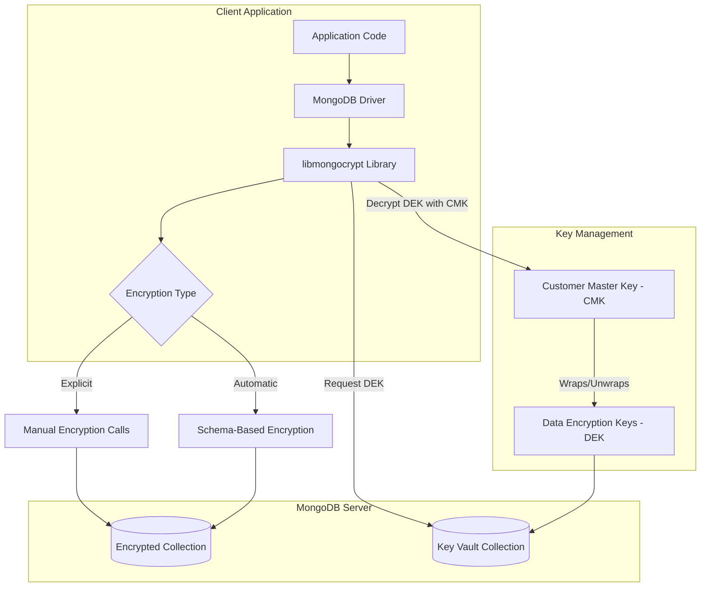
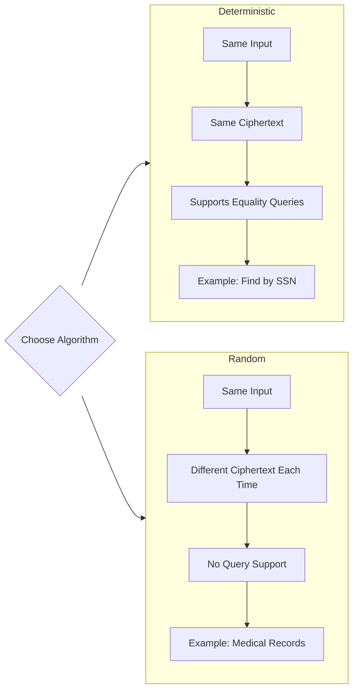
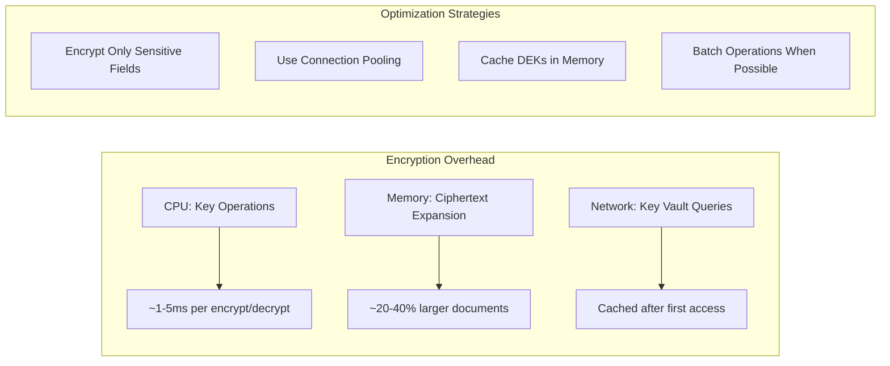

# How to Configure MongoDB Field-Level Encryption

Author: [nawazdhandala](https://github.com/nawazdhandala)

Tags: MongoDB, Encryption, Security, Database, Node.js, Compliance

Description: Learn how to configure MongoDB Client-Side Field Level Encryption (CSFLE) to protect sensitive data at the field level. This guide covers automatic and explicit encryption, key management with AWS KMS, schema validation, and production best practices.

---

> Your database stores the most valuable information in your application. Field-level encryption ensures that sensitive data remains protected even if the database itself is compromised, because decryption keys never reach the server.

MongoDB Client-Side Field Level Encryption (CSFLE) encrypts specific fields in documents before they leave your application. Unlike transparent data encryption (TDE) that protects data at rest, CSFLE ensures that sensitive fields are encrypted in memory, in transit, and at rest. The MongoDB server never sees the plaintext values or the encryption keys.

---

## Why Field-Level Encryption?

Traditional database encryption has limitations. TDE encrypts the entire database file, but data is decrypted in server memory during queries. Anyone with database access can read all fields.

Field-level encryption solves this by encrypting individual fields client-side:

- **Defense in depth**: Even database administrators cannot read encrypted fields without explicit key access
- **Compliance**: Meets GDPR, HIPAA, and PCI-DSS requirements for protecting sensitive data
- **Granular control**: Different fields can use different keys, enabling role-based access to specific data
- **Breach containment**: Stolen database backups contain only ciphertext for protected fields

---

## Encryption Architecture

Before implementing CSFLE, understand how the components interact. MongoDB uses envelope encryption with two types of keys.



**Customer Master Key (CMK)**: A master key stored in a Key Management Service (AWS KMS, Azure Key Vault, GCP KMS, or local for development). This key encrypts and decrypts the Data Encryption Keys.

**Data Encryption Keys (DEK)**: Keys that actually encrypt your field data. These are stored in a MongoDB collection (key vault) in encrypted form, wrapped by the CMK.

---

## Prerequisites and Setup

You need several components before implementing CSFLE.

Install the required packages for Node.js. The mongodb-client-encryption package provides the cryptographic library.

```bash
# Install MongoDB driver and encryption library
npm install mongodb mongodb-client-encryption

# For automatic encryption, you also need the crypt_shared library
# Download from MongoDB Download Center based on your OS
```

For development and testing, you can use a local master key. For production, always use a cloud KMS provider.

```javascript
// setup/local-key.js - Generate a local master key for development only
const crypto = require('crypto');
const fs = require('fs');

// Generate a 96-byte local master key
// WARNING: Only use local keys for development/testing
const localMasterKey = crypto.randomBytes(96);

// Save to file for reuse during development
fs.writeFileSync('master-key.txt', localMasterKey.toString('base64'));

console.log('Local master key generated');
console.log('Key (base64):', localMasterKey.toString('base64'));
```

---

## Configuring Automatic Encryption

Automatic encryption is the recommended approach. You define a JSON schema specifying which fields to encrypt, and the driver handles encryption and decryption transparently.

First, create a Data Encryption Key and store it in the key vault collection.

```javascript
// setup/create-dek.js - Create Data Encryption Key in MongoDB key vault
const { MongoClient, Binary } = require('mongodb');
const { ClientEncryption } = require('mongodb-client-encryption');
const fs = require('fs');

async function createDataEncryptionKey() {
  // Load local master key from file (development only)
  // In production, use AWS KMS, Azure Key Vault, or GCP KMS
  const localMasterKey = Buffer.from(
    fs.readFileSync('master-key.txt', 'utf8'),
    'base64'
  );

  // KMS provider configuration
  // Using 'local' provider for development
  const kmsProviders = {
    local: {
      key: localMasterKey
    }
  };

  // Connect to MongoDB
  const client = new MongoClient('mongodb://localhost:27017');
  await client.connect();

  // Create ClientEncryption instance for key management
  const encryption = new ClientEncryption(client, {
    keyVaultNamespace: 'encryption.__keyVault',
    kmsProviders
  });

  // Create the Data Encryption Key
  // The key is automatically encrypted with the CMK and stored in key vault
  const dataKeyId = await encryption.createDataKey('local', {
    keyAltNames: ['myDataKey']  // Human-readable name for the key
  });

  console.log('Data Encryption Key created');
  console.log('Key ID:', dataKeyId.toString('base64'));
  console.log('Key ID (UUID):', dataKeyId.toString('hex'));

  // Store the key ID for use in schema configuration
  fs.writeFileSync('data-key-id.txt', dataKeyId.toString('base64'));

  await client.close();
  return dataKeyId;
}

createDataEncryptionKey().catch(console.error);
```

Next, define the encryption schema. This JSON schema tells the driver which fields to encrypt and how.

```javascript
// config/encryption-schema.js - Define which fields to encrypt automatically
const fs = require('fs');
const { Binary } = require('mongodb');

function getEncryptionSchema() {
  // Load the Data Encryption Key ID created earlier
  const dataKeyIdBase64 = fs.readFileSync('data-key-id.txt', 'utf8').trim();
  const dataKeyId = new Binary(Buffer.from(dataKeyIdBase64, 'base64'), 4);

  // Define the encryption schema for the 'users' collection
  // Fields listed here will be automatically encrypted/decrypted
  return {
    'myDatabase.users': {
      bsonType: 'object',
      encryptMetadata: {
        keyId: [dataKeyId]  // Default key for this collection
      },
      properties: {
        // Social Security Number - deterministic encryption
        // Allows equality queries on encrypted field
        ssn: {
          encrypt: {
            bsonType: 'string',
            algorithm: 'AEAD_AES_256_CBC_HMAC_SHA_512-Deterministic'
          }
        },
        // Medical records - random encryption
        // More secure but cannot be queried
        medicalRecords: {
          encrypt: {
            bsonType: 'object',
            algorithm: 'AEAD_AES_256_CBC_HMAC_SHA_512-Random'
          }
        },
        // Credit card information - random encryption
        creditCard: {
          encrypt: {
            bsonType: 'object',
            algorithm: 'AEAD_AES_256_CBC_HMAC_SHA_512-Random'
          }
        },
        // Email address - deterministic for lookups
        email: {
          encrypt: {
            bsonType: 'string',
            algorithm: 'AEAD_AES_256_CBC_HMAC_SHA_512-Deterministic'
          }
        }
      }
    }
  };
}

module.exports = { getEncryptionSchema };
```

---

## Understanding Encryption Algorithms

MongoDB CSFLE offers two encryption algorithms. Choose based on your query requirements.



**Deterministic Encryption** (`AEAD_AES_256_CBC_HMAC_SHA_512-Deterministic`):
- Same plaintext always produces the same ciphertext
- Enables equality queries (`find({ ssn: '123-45-6789' })`)
- Use for fields you need to search by exact match
- Trade-off: Reveals when two documents have the same value

**Random Encryption** (`AEAD_AES_256_CBC_HMAC_SHA_512-Random`):
- Same plaintext produces different ciphertext each time
- Cannot be queried directly
- Use for highly sensitive data that does not need searching
- Provides stronger security guarantees

---

## Creating the Encrypted Client

With the schema defined, create a MongoDB client configured for automatic encryption.

```javascript
// client/encrypted-client.js - Create MongoDB client with automatic encryption
const { MongoClient } = require('mongodb');
const fs = require('fs');
const { getEncryptionSchema } = require('../config/encryption-schema');

async function createEncryptedClient() {
  // Load local master key (use KMS in production)
  const localMasterKey = Buffer.from(
    fs.readFileSync('master-key.txt', 'utf8'),
    'base64'
  );

  // Configure KMS providers
  const kmsProviders = {
    local: {
      key: localMasterKey
    }
  };

  // Get the encryption schema
  const schemaMap = getEncryptionSchema();

  // Auto encryption options tell the driver how to handle CSFLE
  const autoEncryptionOptions = {
    keyVaultNamespace: 'encryption.__keyVault',
    kmsProviders,
    schemaMap,
    // Path to MongoDB crypt_shared library (download from MongoDB)
    extraOptions: {
      cryptSharedLibPath: '/usr/local/lib/mongo_crypt_v1.so'
      // On macOS: '/usr/local/lib/mongo_crypt_v1.dylib'
      // On Windows: 'C:\\Program Files\\MongoDB\\mongo_crypt_v1.dll'
    }
  };

  // Create client with automatic encryption enabled
  const client = new MongoClient('mongodb://localhost:27017', {
    autoEncryption: autoEncryptionOptions
  });

  await client.connect();
  console.log('Connected with automatic field-level encryption');

  return client;
}

module.exports = { createEncryptedClient };
```

---

## Using the Encrypted Client

With automatic encryption configured, your application code works normally. The driver handles all encryption and decryption transparently.

```javascript
// app/user-service.js - Application code using encrypted client
const { createEncryptedClient } = require('../client/encrypted-client');

async function demonstrateEncryption() {
  const client = await createEncryptedClient();
  const db = client.db('myDatabase');
  const users = db.collection('users');

  // Insert a document with sensitive fields
  // The driver automatically encrypts ssn, email, medicalRecords, creditCard
  const insertResult = await users.insertOne({
    firstName: 'John',
    lastName: 'Doe',
    ssn: '123-45-6789',           // Encrypted with deterministic algorithm
    email: 'john.doe@example.com', // Encrypted with deterministic algorithm
    medicalRecords: {              // Encrypted with random algorithm
      bloodType: 'O+',
      allergies: ['penicillin'],
      conditions: ['hypertension']
    },
    creditCard: {                  // Encrypted with random algorithm
      number: '4111111111111111',
      expiry: '12/28',
      cvv: '123'
    },
    address: {                     // Not encrypted (not in schema)
      street: '123 Main St',
      city: 'Springfield',
      state: 'IL'
    }
  });

  console.log('Document inserted:', insertResult.insertedId);

  // Query by encrypted field (works with deterministic encryption)
  // The driver automatically encrypts the query value before sending
  const foundUser = await users.findOne({ ssn: '123-45-6789' });
  console.log('Found user:', foundUser.firstName, foundUser.lastName);
  console.log('Decrypted SSN:', foundUser.ssn);  // Driver decrypts automatically
  console.log('Decrypted email:', foundUser.email);

  // Query by email also works
  const userByEmail = await users.findOne({ email: 'john.doe@example.com' });
  console.log('Found by email:', userByEmail.firstName);

  await client.close();
}

demonstrateEncryption().catch(console.error);
```

---

## What the Server Actually Sees

To understand the security benefit, connect without encryption and examine the stored data.

```javascript
// debug/view-raw-data.js - See what MongoDB server actually stores
const { MongoClient } = require('mongodb');

async function viewRawEncryptedData() {
  // Connect WITHOUT encryption to see raw stored values
  const client = new MongoClient('mongodb://localhost:27017');
  await client.connect();

  const db = client.db('myDatabase');
  const users = db.collection('users');

  // Retrieve document without decryption
  const rawDoc = await users.findOne({});

  console.log('Raw document as stored in MongoDB:');
  console.log(JSON.stringify(rawDoc, null, 2));

  // Output shows encrypted fields as Binary data:
  // {
  //   "_id": "...",
  //   "firstName": "John",           // Plaintext - not in schema
  //   "lastName": "Doe",             // Plaintext - not in schema
  //   "ssn": Binary(...),            // Encrypted ciphertext
  //   "email": Binary(...),          // Encrypted ciphertext
  //   "medicalRecords": Binary(...), // Encrypted ciphertext
  //   "creditCard": Binary(...),     // Encrypted ciphertext
  //   "address": { ... }             // Plaintext - not in schema
  // }

  await client.close();
}

viewRawEncryptedData().catch(console.error);
```

The server stores encrypted fields as Binary BSON types. Without the encryption keys, this data is unreadable ciphertext.

---

## Explicit Encryption

For more control, use explicit encryption to manually encrypt and decrypt specific values.

```javascript
// client/explicit-encryption.js - Manual encryption for specific use cases
const { MongoClient, Binary } = require('mongodb');
const { ClientEncryption } = require('mongodb-client-encryption');
const fs = require('fs');

async function explicitEncryptionExample() {
  // Load master key and connect
  const localMasterKey = Buffer.from(
    fs.readFileSync('master-key.txt', 'utf8'),
    'base64'
  );

  const kmsProviders = {
    local: { key: localMasterKey }
  };

  const client = new MongoClient('mongodb://localhost:27017');
  await client.connect();

  // Create ClientEncryption for manual operations
  const encryption = new ClientEncryption(client, {
    keyVaultNamespace: 'encryption.__keyVault',
    kmsProviders
  });

  // Retrieve the data encryption key by its alternate name
  const keyVault = client.db('encryption').collection('__keyVault');
  const keyDoc = await keyVault.findOne({ keyAltNames: 'myDataKey' });
  const dataKeyId = keyDoc._id;

  // Explicitly encrypt a value
  const sensitiveData = 'Top Secret Information';

  const encryptedValue = await encryption.encrypt(sensitiveData, {
    keyId: dataKeyId,
    algorithm: 'AEAD_AES_256_CBC_HMAC_SHA_512-Random'
  });

  console.log('Original:', sensitiveData);
  console.log('Encrypted:', encryptedValue);

  // Store the encrypted value manually
  const db = client.db('myDatabase');
  const secrets = db.collection('secrets');

  await secrets.insertOne({
    name: 'API Key',
    value: encryptedValue,  // Already encrypted
    createdAt: new Date()
  });

  // Retrieve and decrypt
  const storedDoc = await secrets.findOne({ name: 'API Key' });

  const decryptedValue = await encryption.decrypt(storedDoc.value);
  console.log('Decrypted:', decryptedValue);

  await client.close();
}

explicitEncryptionExample().catch(console.error);
```

Explicit encryption is useful when:
- You need to encrypt values that are not part of a fixed schema
- You want to encrypt data before passing it to other systems
- You need to handle encryption in application logic rather than driver configuration

---

## Production Configuration with AWS KMS

For production, use a cloud KMS provider instead of local keys. Here is the configuration for AWS KMS.

```javascript
// config/aws-kms-config.js - Production KMS configuration
const { MongoClient, Binary } = require('mongodb');
const { ClientEncryption } = require('mongodb-client-encryption');

async function createProductionClient() {
  // AWS KMS provider configuration
  // Credentials can come from environment, IAM role, or explicit config
  const kmsProviders = {
    aws: {
      accessKeyId: process.env.AWS_ACCESS_KEY_ID,
      secretAccessKey: process.env.AWS_SECRET_ACCESS_KEY
      // If using session tokens (STS):
      // sessionToken: process.env.AWS_SESSION_TOKEN
    }
  };

  // Master key configuration for AWS KMS
  const masterKey = {
    key: process.env.AWS_KMS_KEY_ARN,  // ARN of your CMK in AWS KMS
    region: process.env.AWS_REGION || 'us-east-1'
    // Optional: endpoint for VPC endpoints or custom regions
    // endpoint: 'https://kms.us-east-1.amazonaws.com'
  };

  // First, create a Data Encryption Key using AWS KMS
  const setupClient = new MongoClient(process.env.MONGODB_URI);
  await setupClient.connect();

  const encryption = new ClientEncryption(setupClient, {
    keyVaultNamespace: 'encryption.__keyVault',
    kmsProviders
  });

  // Check if key already exists
  const keyVault = setupClient.db('encryption').collection('__keyVault');
  let keyDoc = await keyVault.findOne({ keyAltNames: 'productionKey' });

  if (!keyDoc) {
    // Create new DEK using AWS KMS as the CMK provider
    const dataKeyId = await encryption.createDataKey('aws', {
      masterKey,
      keyAltNames: ['productionKey']
    });
    console.log('Created new data encryption key:', dataKeyId.toString('hex'));
  }

  await setupClient.close();

  // Now create the application client with auto-encryption
  const schemaMap = getProductionSchema();

  const autoEncryptionOptions = {
    keyVaultNamespace: 'encryption.__keyVault',
    kmsProviders,
    schemaMap,
    extraOptions: {
      cryptSharedLibPath: '/usr/local/lib/mongo_crypt_v1.so'
    }
  };

  const client = new MongoClient(process.env.MONGODB_URI, {
    autoEncryption: autoEncryptionOptions
  });

  await client.connect();
  return client;
}

function getProductionSchema() {
  // In production, load key ID from secure configuration
  // or query the key vault by keyAltNames
  return {
    'production.customers': {
      bsonType: 'object',
      encryptMetadata: {
        keyId: '/keyAltName'  // Reference key by alternate name
      },
      properties: {
        taxId: {
          encrypt: {
            bsonType: 'string',
            algorithm: 'AEAD_AES_256_CBC_HMAC_SHA_512-Deterministic',
            keyAltName: 'productionKey'
          }
        },
        financialData: {
          encrypt: {
            bsonType: 'object',
            algorithm: 'AEAD_AES_256_CBC_HMAC_SHA_512-Random',
            keyAltName: 'productionKey'
          }
        }
      }
    }
  };
}

module.exports = { createProductionClient };
```

---

## Key Rotation Strategy

Regular key rotation is a security best practice. MongoDB CSFLE supports key rotation by creating new DEKs and re-encrypting data.

```javascript
// operations/key-rotation.js - Rotate data encryption keys
const { MongoClient } = require('mongodb');
const { ClientEncryption } = require('mongodb-client-encryption');

async function rotateDataEncryptionKey(oldKeyAltName, newKeyAltName) {
  const client = new MongoClient(process.env.MONGODB_URI);
  await client.connect();

  const kmsProviders = {
    aws: {
      accessKeyId: process.env.AWS_ACCESS_KEY_ID,
      secretAccessKey: process.env.AWS_SECRET_ACCESS_KEY
    }
  };

  const encryption = new ClientEncryption(client, {
    keyVaultNamespace: 'encryption.__keyVault',
    kmsProviders
  });

  // Create new Data Encryption Key
  const newDataKeyId = await encryption.createDataKey('aws', {
    masterKey: {
      key: process.env.AWS_KMS_KEY_ARN,
      region: process.env.AWS_REGION
    },
    keyAltNames: [newKeyAltName]
  });

  console.log('New DEK created:', newDataKeyId.toString('hex'));

  // Re-encrypt existing documents with new key
  // This requires reading, decrypting, and re-encrypting each document
  const db = client.db('myDatabase');
  const collection = db.collection('users');

  // Get key IDs for rewrapping
  const keyVault = client.db('encryption').collection('__keyVault');
  const oldKey = await keyVault.findOne({ keyAltNames: oldKeyAltName });
  const newKey = await keyVault.findOne({ keyAltNames: newKeyAltName });

  // Process documents in batches
  const cursor = collection.find({});
  let processed = 0;

  while (await cursor.hasNext()) {
    const doc = await cursor.next();

    // For each encrypted field, decrypt with old key and re-encrypt with new key
    // This is simplified - production code should handle errors and transactions
    if (doc.ssn) {
      const decrypted = await encryption.decrypt(doc.ssn);
      const reencrypted = await encryption.encrypt(decrypted, {
        keyId: newDataKeyId,
        algorithm: 'AEAD_AES_256_CBC_HMAC_SHA_512-Deterministic'
      });

      await collection.updateOne(
        { _id: doc._id },
        { $set: { ssn: reencrypted } }
      );
    }

    processed++;
    if (processed % 1000 === 0) {
      console.log(`Processed ${processed} documents`);
    }
  }

  console.log(`Key rotation complete. ${processed} documents updated.`);

  // Optionally, mark old key as deprecated
  await keyVault.updateOne(
    { _id: oldKey._id },
    { $set: { status: 'deprecated', deprecatedAt: new Date() } }
  );

  await client.close();
}

// Run rotation
rotateDataEncryptionKey('productionKey', 'productionKey-v2').catch(console.error);
```

---

## Queryable Encryption (MongoDB 7.0+)

MongoDB 7.0 introduced Queryable Encryption, an evolution of CSFLE that supports encrypted range queries, not just equality.

```javascript
// config/queryable-encryption.js - MongoDB 7.0+ Queryable Encryption
const { MongoClient } = require('mongodb');

async function setupQueryableEncryption() {
  const kmsProviders = {
    aws: {
      accessKeyId: process.env.AWS_ACCESS_KEY_ID,
      secretAccessKey: process.env.AWS_SECRET_ACCESS_KEY
    }
  };

  // Queryable Encryption uses encrypted fields configuration
  // instead of JSON schema
  const encryptedFieldsMap = {
    'myDatabase.patients': {
      fields: [
        {
          path: 'patientId',
          bsonType: 'string',
          // Queryable encryption supports additional query types
          queries: { queryType: 'equality' }
        },
        {
          path: 'dateOfBirth',
          bsonType: 'date',
          // Range queries on encrypted dates
          queries: {
            queryType: 'range',
            min: new Date('1900-01-01'),
            max: new Date('2100-12-31')
          }
        },
        {
          path: 'insuranceNumber',
          bsonType: 'string',
          queries: { queryType: 'equality' }
        },
        {
          path: 'diagnosis',
          bsonType: 'string'
          // No queries - random encryption only
        }
      ]
    }
  };

  const autoEncryptionOptions = {
    keyVaultNamespace: 'encryption.__keyVault',
    kmsProviders,
    encryptedFieldsMap,
    extraOptions: {
      cryptSharedLibPath: '/usr/local/lib/mongo_crypt_v1.so'
    }
  };

  const client = new MongoClient(process.env.MONGODB_URI, {
    autoEncryption: autoEncryptionOptions
  });

  await client.connect();

  // With Queryable Encryption, you can perform range queries
  const db = client.db('myDatabase');
  const patients = db.collection('patients');

  // Range query on encrypted date field
  const results = await patients.find({
    dateOfBirth: {
      $gte: new Date('1980-01-01'),
      $lt: new Date('1990-01-01')
    }
  }).toArray();

  console.log(`Found ${results.length} patients born in the 1980s`);

  return client;
}

module.exports = { setupQueryableEncryption };
```

---

## Performance Considerations

Field-level encryption adds overhead. Understand the trade-offs to make informed decisions.



Key performance tips:

- **Minimize encrypted fields**: Only encrypt truly sensitive data
- **Use deterministic encryption sparingly**: Random encryption is more secure
- **Key caching**: The driver caches DEKs automatically, but key vault queries still occur
- **Connection pooling**: Reuse encrypted clients to avoid repeated setup

```javascript
// performance/benchmark.js - Measure encryption overhead
const { createEncryptedClient } = require('../client/encrypted-client');
const { MongoClient } = require('mongodb');

async function benchmarkEncryption() {
  // Create encrypted and non-encrypted clients
  const encryptedClient = await createEncryptedClient();
  const plainClient = new MongoClient('mongodb://localhost:27017');
  await plainClient.connect();

  const iterations = 1000;

  // Benchmark encrypted inserts
  const encryptedDb = encryptedClient.db('benchmark');
  const encryptedStart = Date.now();

  for (let i = 0; i < iterations; i++) {
    await encryptedDb.collection('encrypted').insertOne({
      ssn: `${100000000 + i}`,
      email: `user${i}@example.com`,
      name: `User ${i}`
    });
  }

  const encryptedTime = Date.now() - encryptedStart;

  // Benchmark plain inserts
  const plainDb = plainClient.db('benchmark');
  const plainStart = Date.now();

  for (let i = 0; i < iterations; i++) {
    await plainDb.collection('plain').insertOne({
      ssn: `${100000000 + i}`,
      email: `user${i}@example.com`,
      name: `User ${i}`
    });
  }

  const plainTime = Date.now() - plainStart;

  console.log(`Encrypted: ${iterations} inserts in ${encryptedTime}ms`);
  console.log(`Plain: ${iterations} inserts in ${plainTime}ms`);
  console.log(`Overhead: ${((encryptedTime / plainTime - 1) * 100).toFixed(1)}%`);

  // Cleanup
  await encryptedDb.dropDatabase();
  await plainDb.dropDatabase();
  await encryptedClient.close();
  await plainClient.close();
}

benchmarkEncryption().catch(console.error);
```

---

## Troubleshooting Common Issues

Field-level encryption can be tricky to debug. Here are common issues and solutions.

**Issue: "No key found" errors**

```javascript
// Check that key vault collection has proper indexes
const keyVault = client.db('encryption').collection('__keyVault');

// Required unique index on keyAltNames
await keyVault.createIndex(
  { keyAltNames: 1 },
  {
    unique: true,
    partialFilterExpression: { keyAltNames: { $exists: true } }
  }
);
```

**Issue: Cannot query encrypted fields**

```javascript
// Only deterministic encryption supports queries
// If you used random encryption, you cannot query that field

// Check your schema - this will NOT work with random encryption:
// const result = await collection.find({ medicalRecords: {...} })

// Solution: Use deterministic encryption for fields you need to query
properties: {
  searchableField: {
    encrypt: {
      bsonType: 'string',
      algorithm: 'AEAD_AES_256_CBC_HMAC_SHA_512-Deterministic'  // Can query
    }
  }
}
```

**Issue: crypt_shared library not found**

```bash
# Download the correct version from MongoDB Download Center
# Ensure the path in extraOptions matches your installation

# Linux
extraOptions: {
  cryptSharedLibPath: '/usr/local/lib/mongo_crypt_v1.so'
}

# macOS
extraOptions: {
  cryptSharedLibPath: '/usr/local/lib/mongo_crypt_v1.dylib'
}

# Windows
extraOptions: {
  cryptSharedLibPath: 'C:\\Program Files\\MongoDB\\crypt_shared\\mongo_crypt_v1.dll'
}
```

---

## Best Practices Checklist

Before deploying field-level encryption to production:

- [ ] Use cloud KMS (AWS KMS, Azure Key Vault, GCP KMS) for master keys
- [ ] Create separate DEKs for different data classifications
- [ ] Index the key vault collection on keyAltNames (unique, partial)
- [ ] Test key rotation procedures before you need them
- [ ] Document which fields are encrypted and their algorithms
- [ ] Implement monitoring for encryption operations and failures
- [ ] Plan for disaster recovery - backup key vault separately
- [ ] Use deterministic encryption only when equality queries are required
- [ ] Audit access to KMS keys and key vault collection
- [ ] Test application behavior when encryption fails

---

## Conclusion

MongoDB Field-Level Encryption provides defense in depth for your most sensitive data. The server never sees plaintext values or encryption keys, protecting against database breaches, insider threats, and unauthorized access.

Start with automatic encryption using a JSON schema for predictable document structures. Use explicit encryption when you need flexibility. Always use a cloud KMS provider in production, and plan your key rotation strategy before deploying.

The initial setup complexity pays off in security guarantees that traditional database encryption cannot provide. Your compliance auditors will appreciate the mathematical certainty that protected fields remain encrypted throughout their lifecycle.

---

*Protecting sensitive data is just one aspect of maintaining secure, reliable applications. [OneUptime](https://oneuptime.com) helps you monitor your MongoDB deployments, track encryption operation performance, and alert you to security anomalies before they become breaches. Get complete observability for your encrypted database infrastructure.*

**Related Reading:**

- [How to Implement Log Encryption](https://oneuptime.com/blog/post/2026-01-30-log-encryption/view)
- [Keep PII Out of Your Telemetry: Sanitizing Logs, Traces, and Metrics](https://oneuptime.com/blog/post/2025-11-13-keep-pii-out-of-observability-telemetry/view)
