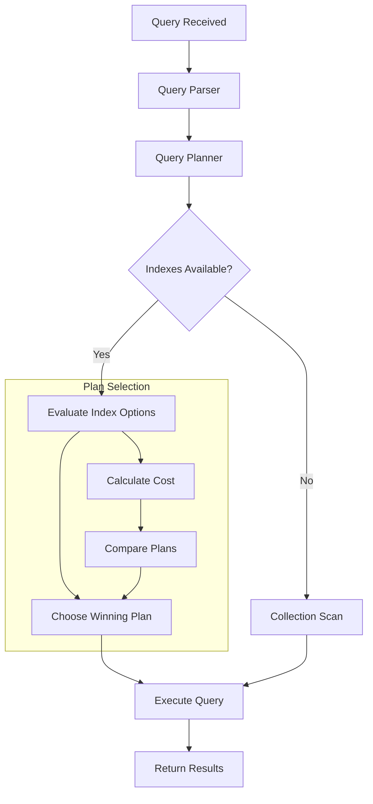
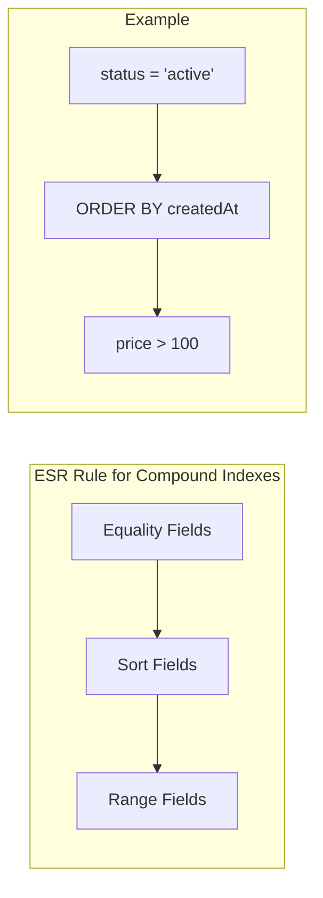
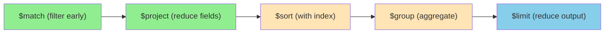

# How to Optimize MongoDB Queries

Author: [nawazdhandala](https://www.github.com/nawazdhandala)

Tags: MongoDB, Query Optimization, Performance, Database, Indexing, Aggregation

Description: Learn how to optimize MongoDB queries for better performance. This guide covers query analysis with explain(), indexing strategies, projection optimization, aggregation pipeline tuning, and monitoring slow queries in production.

---

Query optimization is essential for building fast and scalable MongoDB applications. Poorly optimized queries can lead to slow response times, excessive resource consumption, and degraded user experience. This guide provides practical techniques to identify and fix query performance issues.

## Understanding Query Execution

Before optimizing queries, you need to understand how MongoDB executes them. The query planner evaluates available indexes and chooses the most efficient execution plan.

The following diagram illustrates the query execution flow.



## Analyzing Queries with explain()

The explain() method is your primary tool for understanding query performance. It reveals which index is used, how many documents are scanned, and the execution time.

The following code demonstrates the three verbosity modes of explain().

```javascript
// Basic query analysis showing the winning execution plan
db.orders.find({ status: "pending" }).explain()

// Detailed execution statistics including timing and document counts
db.orders.find({ status: "pending" }).explain("executionStats")

// Complete analysis including rejected alternative plans
db.orders.find({ status: "pending" }).explain("allPlansExecution")
```

The following code shows how to interpret key metrics from explain() output.

```javascript
// Execute explain with execution stats to get performance metrics
const explanation = db.orders.find({
    customerId: "cust_12345",
    status: "completed"
}).sort({ createdAt: -1 }).explain("executionStats")

// Key metrics to examine in the output:
//
// executionStats.nReturned: Number of documents returned (e.g., 50)
// executionStats.executionTimeMillis: Query execution time (e.g., 3ms)
// executionStats.totalKeysExamined: Index entries scanned (e.g., 50)
// executionStats.totalDocsExamined: Documents scanned (e.g., 50)
//
// queryPlanner.winningPlan.stage: Execution stage type
//   - IXSCAN: Index scan (optimal)
//   - COLLSCAN: Collection scan (needs optimization)
//   - FETCH: Document retrieval after index lookup
//
// Efficiency indicators:
// - totalKeysExamined should be close to nReturned
// - totalDocsExamined should be close to nReturned
// - Stage should show IXSCAN, not COLLSCAN
```

## Query Optimization Patterns

### 1. Use Selective Indexes

Indexes should filter out as many documents as possible. Fields with high cardinality (many unique values) make better index candidates than low cardinality fields.

The following example demonstrates the difference between low and high cardinality indexes.

```javascript
// Low cardinality field (only 3 possible values) - poor selectivity
// This index will still scan many documents
db.users.createIndex({ status: 1 })  // status: "active", "inactive", "pending"

// High cardinality field (unique per user) - excellent selectivity
// This index quickly narrows down to specific documents
db.users.createIndex({ email: 1 })

// Compound index combining both for common query patterns
// Place high cardinality field first for better selectivity
db.users.createIndex({ email: 1, status: 1 })

// Query that benefits from the compound index
db.users.find({ email: "user@example.com", status: "active" })
```

### 2. Optimize Compound Index Field Order

The order of fields in a compound index significantly impacts query performance. Follow the ESR (Equality, Sort, Range) rule for optimal ordering.

The following diagram shows the ESR rule for compound index design.



The following code shows how to apply the ESR rule.

```javascript
// Query pattern to optimize:
// Find active products in a category, sorted by price, within a date range
db.products.find({
    status: "active",           // Equality
    category: "electronics",    // Equality
    createdAt: { $gte: ISODate("2024-01-01") }  // Range
}).sort({ price: 1 })           // Sort

// Optimal index following ESR rule:
// 1. Equality fields first (status, category)
// 2. Sort field next (price)
// 3. Range field last (createdAt)
db.products.createIndex({
    status: 1,
    category: 1,
    price: 1,
    createdAt: 1
})

// This index supports the query efficiently because:
// - Equality filters narrow down candidates immediately
// - Sort can use index order without in-memory sorting
// - Range filter is applied last on the reduced set
```

### 3. Use Covered Queries

A covered query returns results directly from the index without accessing documents. This eliminates the FETCH stage and significantly improves performance.

The following code demonstrates creating and using covered queries.

```javascript
// Create an index that includes all fields needed by the query
db.orders.createIndex({
    customerId: 1,
    status: 1,
    totalAmount: 1,
    createdAt: 1
})

// Covered query - all requested fields are in the index
// Note: _id must be excluded since it is not in the index
db.orders.find(
    { customerId: "cust_12345", status: "completed" },
    { _id: 0, customerId: 1, status: 1, totalAmount: 1, createdAt: 1 }
)

// Verify the query is covered by checking explain output
// Look for: totalDocsExamined: 0 (no documents accessed)
const result = db.orders.find(
    { customerId: "cust_12345", status: "completed" },
    { _id: 0, customerId: 1, status: 1, totalAmount: 1, createdAt: 1 }
).explain("executionStats")

// If totalDocsExamined is 0, the query is fully covered
console.log("Documents examined:", result.executionStats.totalDocsExamined)
```

### 4. Limit Returned Fields with Projection

Returning only necessary fields reduces network transfer and memory usage. Always use projection when you do not need the entire document.

The following code shows effective projection usage.

```javascript
// Inefficient: Returns entire document including large nested objects
db.articles.find({ authorId: "author_123" })

// Efficient: Returns only the fields needed for the listing page
db.articles.find(
    { authorId: "author_123" },
    { title: 1, summary: 1, publishedAt: 1, viewCount: 1 }
)

// Exclude large fields you do not need
db.articles.find(
    { authorId: "author_123" },
    { content: 0, comments: 0, revisionHistory: 0 }
)

// Projection with nested field selection
db.users.find(
    { status: "active" },
    {
        "profile.name": 1,
        "profile.avatar": 1,
        email: 1,
        lastLogin: 1
    }
)
```

### 5. Use Proper Query Operators

Some query operators perform better than others. Understanding their behavior helps write more efficient queries.

The following code compares efficient and inefficient query patterns.

```javascript
// Inefficient: $where executes JavaScript for each document
db.orders.find({
    $where: "this.items.length > 5"
})

// Efficient: Use native operators instead
db.orders.find({
    "items.5": { $exists: true }
})

// Inefficient: $regex without anchor scans all values
db.products.find({
    name: { $regex: "phone" }  // Cannot use index efficiently
})

// Efficient: Anchored regex can use index
db.products.find({
    name: { $regex: "^phone" }  // Uses index for prefix match
})

// Inefficient: $ne and $nin scan all non-matching documents
db.users.find({
    status: { $ne: "deleted" }  // Scans most documents
})

// Efficient: Query for what you want, not what you don't want
db.users.find({
    status: { $in: ["active", "pending"] }  // More selective
})

// Inefficient: Multiple $or conditions on different fields
db.products.find({
    $or: [
        { category: "electronics" },
        { brand: "Samsung" }
    ]
})

// Efficient: Use $in when checking same field
db.products.find({
    category: { $in: ["electronics", "appliances", "gadgets"] }
})
```

## Aggregation Pipeline Optimization

Aggregation pipelines require careful optimization to process data efficiently. The order and structure of stages significantly impact performance.

### Pipeline Stage Ordering

Place filtering stages early to reduce the data processed by subsequent stages.

The following diagram shows optimal pipeline stage ordering.



The following code demonstrates pipeline optimization techniques.

```javascript
// Inefficient pipeline: Groups all documents before filtering
db.orders.aggregate([
    {
        $group: {
            _id: "$customerId",
            totalSpent: { $sum: "$totalAmount" },
            orderCount: { $sum: 1 }
        }
    },
    {
        $match: { orderCount: { $gte: 10 } }  // Filtering happens too late
    }
])

// Optimized pipeline: Filter first, then group
db.orders.aggregate([
    {
        $match: {
            status: "completed",
            createdAt: { $gte: ISODate("2024-01-01") }
        }
    },
    {
        $group: {
            _id: "$customerId",
            totalSpent: { $sum: "$totalAmount" },
            orderCount: { $sum: 1 }
        }
    },
    {
        $match: { orderCount: { $gte: 10 } }
    }
])
```

### Use $project to Reduce Document Size

The following code shows how projection reduces memory usage in pipelines.

```javascript
// Reduce document size early in the pipeline
db.orders.aggregate([
    {
        $match: { status: "completed" }
    },
    {
        // Keep only fields needed for subsequent stages
        $project: {
            customerId: 1,
            totalAmount: 1,
            createdAt: 1,
            itemCount: { $size: "$items" }
        }
    },
    {
        $group: {
            _id: "$customerId",
            totalSpent: { $sum: "$totalAmount" },
            avgOrderSize: { $avg: "$itemCount" }
        }
    }
])
```

### Optimize $lookup Operations

$lookup joins can be expensive. Use indexes and limit the joined data.

The following code shows $lookup optimization patterns.

```javascript
// Ensure the foreign collection has an index on the join field
db.orderItems.createIndex({ orderId: 1 })

// Basic $lookup
db.orders.aggregate([
    { $match: { customerId: "cust_12345" } },
    {
        $lookup: {
            from: "orderItems",
            localField: "_id",
            foreignField: "orderId",
            as: "items"
        }
    }
])

// Optimized $lookup with pipeline for filtering joined documents
db.orders.aggregate([
    { $match: { customerId: "cust_12345" } },
    {
        $lookup: {
            from: "orderItems",
            let: { orderId: "$_id" },
            pipeline: [
                {
                    $match: {
                        $expr: { $eq: ["$orderId", "$$orderId"] },
                        status: "shipped"  // Filter within lookup
                    }
                },
                {
                    $project: {  // Return only needed fields
                        productId: 1,
                        quantity: 1,
                        price: 1
                    }
                }
            ],
            as: "shippedItems"
        }
    }
])
```

### Use allowDiskUse for Large Aggregations

The following code enables disk usage for memory-intensive operations.

```javascript
// Enable disk use for aggregations that exceed memory limits
// Default memory limit is 100MB per pipeline stage
db.largeCollection.aggregate([
    { $match: { year: 2024 } },
    { $sort: { createdAt: -1 } },  // Sorting may require disk
    {
        $group: {
            _id: "$category",
            documents: { $push: "$$ROOT" }  // May exceed memory
        }
    }
], { allowDiskUse: true })
```

## Pagination Optimization

Efficient pagination is crucial for applications displaying large result sets.

### Offset-Based Pagination (Simple but Slow for Large Offsets)

The following code shows the limitations of skip-based pagination.

```javascript
// Traditional pagination using skip and limit
// Performance degrades as page number increases
const page = 100
const pageSize = 20

// This becomes slow because MongoDB must scan and discard
// (page * pageSize) documents before returning results
db.products.find({})
    .sort({ createdAt: -1 })
    .skip(page * pageSize)
    .limit(pageSize)

// For page 100 with pageSize 20, MongoDB scans 2000 documents
// before returning 20 documents
```

### Keyset Pagination (Fast for All Pages)

The following code demonstrates cursor-based pagination for better performance.

```javascript
// Keyset pagination uses the last document's values as the cursor
// Performance is consistent regardless of how deep into results you are

// First page - no cursor
const firstPage = db.products.find({})
    .sort({ createdAt: -1, _id: -1 })
    .limit(20)
    .toArray()

// Get cursor from last document
const lastDoc = firstPage[firstPage.length - 1]
const cursor = {
    createdAt: lastDoc.createdAt,
    _id: lastDoc._id
}

// Subsequent pages - use cursor for efficient seeking
const nextPage = db.products.find({
    $or: [
        { createdAt: { $lt: cursor.createdAt } },
        {
            createdAt: cursor.createdAt,
            _id: { $lt: cursor._id }
        }
    ]
})
    .sort({ createdAt: -1, _id: -1 })
    .limit(20)

// Create index to support this pagination pattern
db.products.createIndex({ createdAt: -1, _id: -1 })
```

## Query Monitoring and Profiling

Set up monitoring to identify slow queries in production.

### Enable the Database Profiler

The following code shows how to configure and use the profiler.

```javascript
// Profile levels:
// 0: Off
// 1: Log slow operations (above slowms threshold)
// 2: Log all operations

// Enable profiling for queries slower than 100ms
db.setProfilingLevel(1, { slowms: 100 })

// Check current profiling settings
db.getProfilingStatus()

// Find slow queries from the profile collection
db.system.profile.find({
    millis: { $gt: 100 }
}).sort({ ts: -1 }).limit(10)

// Find collection scans (queries without index usage)
db.system.profile.find({
    "planSummary": "COLLSCAN",
    op: { $in: ["query", "command"] }
}).sort({ millis: -1 })

// Find queries by namespace
db.system.profile.find({
    ns: "mydb.orders",
    millis: { $gt: 50 }
}).sort({ ts: -1 })
```

### Monitor Index Usage

The following code shows how to track index effectiveness.

```javascript
// Get usage statistics for all indexes in a collection
db.orders.aggregate([{ $indexStats: {} }])

// Sample output interpretation:
// {
//     "name": "status_1_createdAt_-1",
//     "accesses": {
//         "ops": 15420,  // Number of times this index was used
//         "since": ISODate("2024-01-01T00:00:00Z")
//     }
// }

// Find indexes that have never been used
db.orders.aggregate([
    { $indexStats: {} },
    { $match: { "accesses.ops": 0 } },
    { $project: { name: 1, "accesses.since": 1 } }
])

// Consider dropping unused indexes to reduce write overhead
// db.orders.dropIndex("unused_index_name")
```

## Node.js Query Optimization Example

The following code provides a reusable query analyzer for Node.js applications.

```javascript
const { MongoClient } = require('mongodb');

class QueryOptimizer {
    constructor(client, dbName) {
        this.db = client.db(dbName);
    }

    // Analyze a query and provide optimization recommendations
    async analyzeQuery(collectionName, filter, options = {}) {
        const collection = this.db.collection(collectionName);

        let cursor = collection.find(filter);

        if (options.sort) {
            cursor = cursor.sort(options.sort);
        }
        if (options.projection) {
            cursor = cursor.project(options.projection);
        }
        if (options.limit) {
            cursor = cursor.limit(options.limit);
        }

        const explanation = await cursor.explain("executionStats");
        const stats = explanation.executionStats;
        const plan = explanation.queryPlanner.winningPlan;

        // Calculate efficiency metrics
        const scanRatio = stats.totalDocsExamined / Math.max(stats.nReturned, 1);
        const keyRatio = stats.totalKeysExamined / Math.max(stats.nReturned, 1);

        const analysis = {
            executionTimeMs: stats.executionTimeMillis,
            documentsReturned: stats.nReturned,
            documentsExamined: stats.totalDocsExamined,
            keysExamined: stats.totalKeysExamined,
            indexUsed: this.extractIndexName(plan),
            isCollectionScan: this.isCollectionScan(plan),
            scanEfficiency: scanRatio,
            recommendations: []
        };

        // Generate recommendations based on analysis
        if (analysis.isCollectionScan) {
            analysis.recommendations.push({
                priority: "high",
                issue: "No index used - performing collection scan",
                suggestion: `Create an index on the query fields: ${Object.keys(filter).join(", ")}`
            });
        }

        if (scanRatio > 10) {
            analysis.recommendations.push({
                priority: "high",
                issue: `Poor selectivity - examined ${stats.totalDocsExamined} docs to return ${stats.nReturned}`,
                suggestion: "Consider a more selective index or add additional filter criteria"
            });
        }

        if (keyRatio > 5 && !analysis.isCollectionScan) {
            analysis.recommendations.push({
                priority: "medium",
                issue: "Index not fully selective",
                suggestion: "Review compound index field order - apply ESR rule"
            });
        }

        if (stats.executionTimeMillis > 100) {
            analysis.recommendations.push({
                priority: "medium",
                issue: `Slow query: ${stats.executionTimeMillis}ms`,
                suggestion: "Consider caching results or optimizing the query pattern"
            });
        }

        return analysis;
    }

    // Extract the index name from the execution plan
    extractIndexName(plan) {
        if (plan.inputStage && plan.inputStage.indexName) {
            return plan.inputStage.indexName;
        }
        if (plan.indexName) {
            return plan.indexName;
        }
        return "none";
    }

    // Check if the query uses a collection scan
    isCollectionScan(plan) {
        const stage = plan.stage || "";
        const inputStage = plan.inputStage?.stage || "";
        return stage === "COLLSCAN" || inputStage === "COLLSCAN";
    }

    // Suggest an optimal index for a query pattern
    suggestIndex(filter, sort = {}, projection = {}) {
        const indexFields = {};

        // Add equality fields first
        for (const [field, value] of Object.entries(filter)) {
            if (typeof value !== 'object' || value === null) {
                indexFields[field] = 1;
            }
        }

        // Add sort fields
        for (const [field, direction] of Object.entries(sort)) {
            if (!indexFields[field]) {
                indexFields[field] = direction;
            }
        }

        // Add range fields last
        for (const [field, value] of Object.entries(filter)) {
            if (typeof value === 'object' && value !== null && !indexFields[field]) {
                indexFields[field] = 1;
            }
        }

        return indexFields;
    }

    // Run a query with automatic optimization hints
    async optimizedFind(collectionName, filter, options = {}) {
        const collection = this.db.collection(collectionName);

        // Build the query
        let cursor = collection.find(filter);

        // Apply hint if provided
        if (options.hint) {
            cursor = cursor.hint(options.hint);
        }

        // Always use projection to limit returned fields
        if (options.projection) {
            cursor = cursor.project(options.projection);
        }

        // Apply sort with index direction consideration
        if (options.sort) {
            cursor = cursor.sort(options.sort);
        }

        // Use limit to prevent unbounded result sets
        const limit = options.limit || 1000;
        cursor = cursor.limit(limit);

        // Set batch size for efficient network usage
        cursor = cursor.batchSize(options.batchSize || 100);

        return cursor.toArray();
    }
}

// Usage example
async function main() {
    const client = new MongoClient('mongodb://localhost:27017');
    await client.connect();

    const optimizer = new QueryOptimizer(client, 'ecommerce');

    // Analyze a slow query
    const analysis = await optimizer.analyzeQuery(
        'orders',
        {
            customerId: 'cust_12345',
            status: 'completed',
            createdAt: { $gte: new Date('2024-01-01') }
        },
        {
            sort: { createdAt: -1 },
            limit: 50
        }
    );

    console.log('Query Analysis:');
    console.log(`  Execution time: ${analysis.executionTimeMs}ms`);
    console.log(`  Documents returned: ${analysis.documentsReturned}`);
    console.log(`  Documents examined: ${analysis.documentsExamined}`);
    console.log(`  Index used: ${analysis.indexUsed}`);

    if (analysis.recommendations.length > 0) {
        console.log('\nRecommendations:');
        for (const rec of analysis.recommendations) {
            console.log(`  [${rec.priority}] ${rec.issue}`);
            console.log(`    Suggestion: ${rec.suggestion}`);
        }
    }

    // Get index suggestion for the query
    const suggestedIndex = optimizer.suggestIndex(
        { customerId: 'cust_12345', status: 'completed', createdAt: { $gte: new Date() } },
        { createdAt: -1 }
    );
    console.log('\nSuggested index:', suggestedIndex);

    await client.close();
}

main().catch(console.error);
```

## Common Query Anti-Patterns to Avoid

The following list summarizes patterns that hurt query performance.

1. **Querying without indexes**: Always ensure queries use appropriate indexes
2. **Using $where for simple comparisons**: Native operators are faster
3. **Unbounded queries**: Always use limit() to prevent memory issues
4. **Deep skip-based pagination**: Use keyset pagination for large offsets
5. **Selecting all fields**: Use projection to return only needed fields
6. **Negation operators on indexed fields**: $ne and $nin reduce index effectiveness
7. **Case-insensitive regex without collation**: Creates full collection scans
8. **Large $in arrays**: Keep arrays reasonably sized (under 100 elements)

## Conclusion

MongoDB query optimization requires understanding execution plans, designing proper indexes, and monitoring performance in production. Start by using explain() to identify bottlenecks, then apply the appropriate optimization techniques. Remember that optimization is an ongoing process - as your data grows and query patterns change, you need to continuously monitor and adjust your indexes and queries.

For comprehensive MongoDB monitoring, consider using [OneUptime](https://oneuptime.com) to track query performance, set up alerts for slow queries, and gain visibility into your database health. With proper monitoring, you can identify performance issues before they impact your users.
