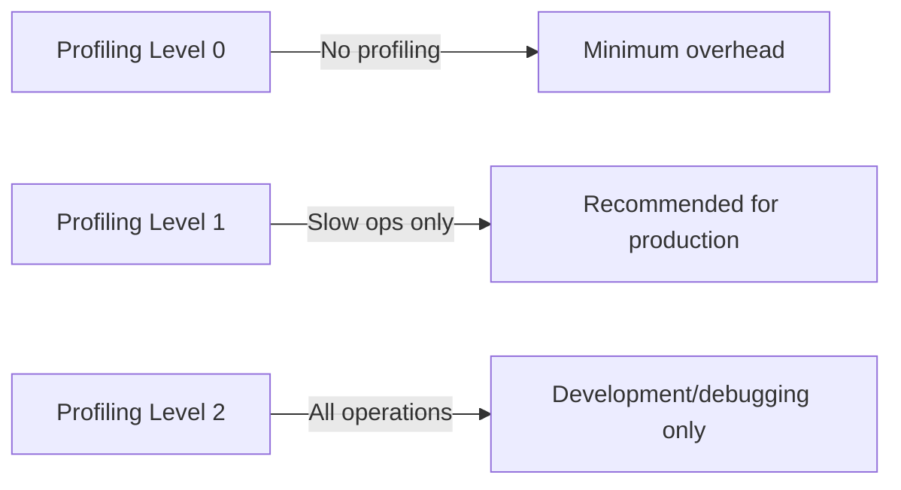
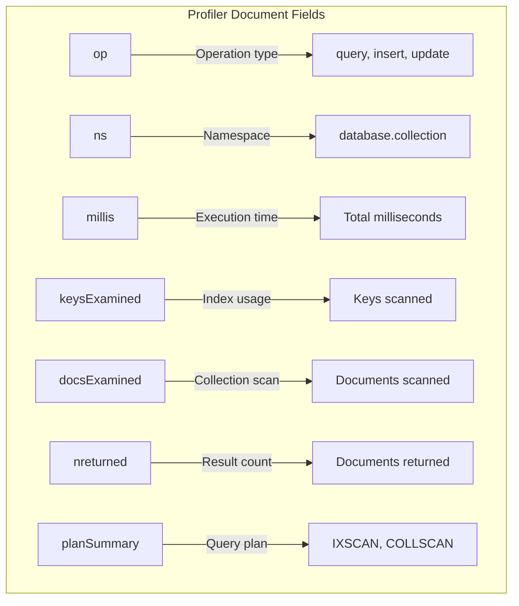
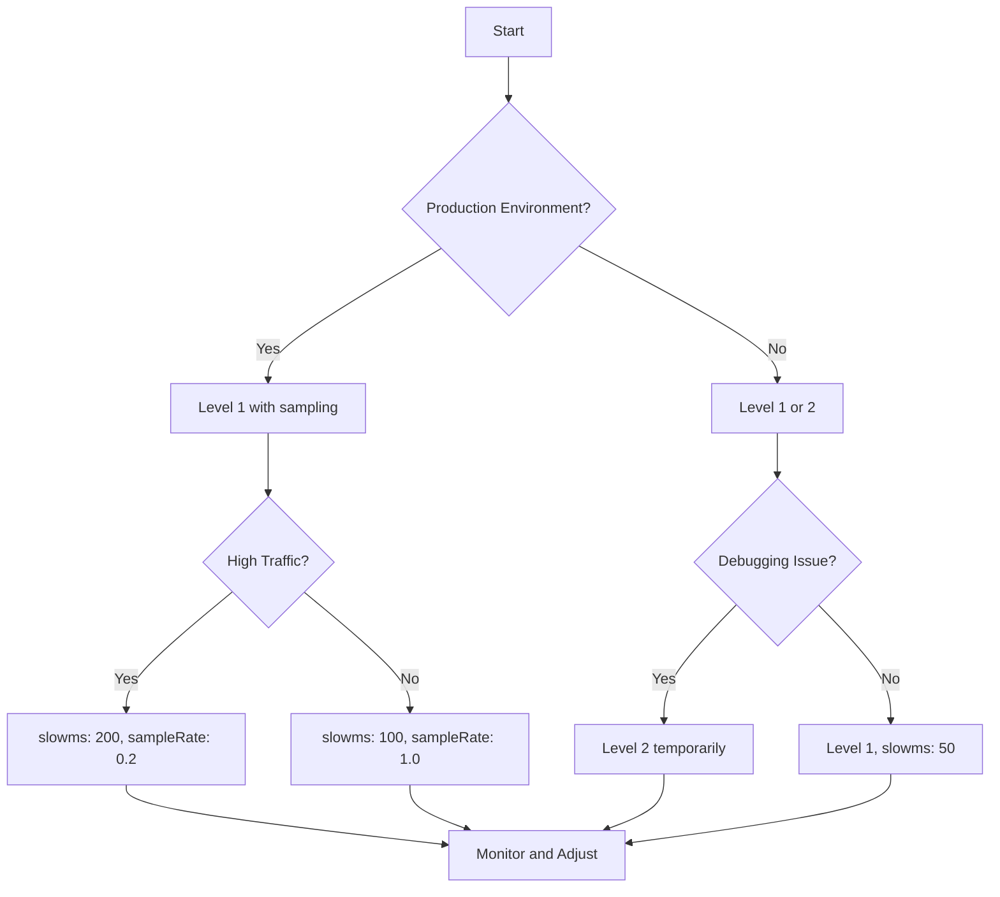

# How to Configure MongoDB Query Profiling

Author: [nawazdhandala](https://github.com/nawazdhandala)

Tags: MongoDB, Query Profiling, Database Performance, Slow Queries, Database Optimization

Description: A comprehensive guide to configuring MongoDB query profiling, covering profiling levels, threshold settings, filtering options, production strategies, and analyzing profiler output to identify and fix slow queries.

---

When your MongoDB queries start slowing down, you need visibility into what is actually happening under the hood. Query profiling captures detailed information about database operations, helping you identify bottlenecks, missing indexes, and inefficient queries before they become production fires.

## Understanding Profiling Levels

MongoDB provides three profiling levels that control what gets captured.



Here is what each level does:

| Level | Behavior | Use Case |
|-------|----------|----------|
| 0 | Profiler is off | Default state, no overhead |
| 1 | Logs operations slower than `slowms` threshold | Production monitoring |
| 2 | Logs all operations | Development, debugging |

## Basic Profiler Configuration

Enable profiling on a specific database using the `setProfilingLevel` command.

This command enables profiling for operations that take longer than 100 milliseconds. The profiler stores captured operations in a capped collection called `system.profile`.

```javascript
// Connect to your database first
use myDatabase

// Enable profiling for slow operations (level 1)
// Operations taking longer than 100ms will be logged
db.setProfilingLevel(1, { slowms: 100 })

// Verify the current profiling configuration
db.getProfilingStatus()
// Output: { was: 1, slowms: 100, sampleRate: 1.0 }
```

## Configuring the Slow Operation Threshold

The `slowms` parameter defines what counts as a "slow" operation. Choose this value based on your application requirements.

This configuration sets the threshold to 50 milliseconds, capturing more queries for analysis. Lower thresholds provide more visibility but increase storage usage.

```javascript
// Set a more aggressive threshold for detailed analysis
// This captures operations taking longer than 50ms
db.setProfilingLevel(1, { slowms: 50 })

// For high-performance applications, use a tighter threshold
// This captures operations taking longer than 20ms
db.setProfilingLevel(1, { slowms: 20 })

// Check current settings
const status = db.getProfilingStatus()
print(`Profiling level: ${status.was}`)
print(`Slow threshold: ${status.slowms}ms`)
```

## Sample Rate Configuration

When dealing with high-throughput systems, profiling every slow operation can generate excessive data. Use sample rate to reduce the volume while still capturing representative samples.

This configuration profiles only 50% of slow operations, reducing storage overhead while maintaining statistical relevance.

```javascript
// Profile 50% of slow operations
// Useful for high-traffic databases where full profiling is too expensive
db.setProfilingLevel(1, {
    slowms: 100,
    sampleRate: 0.5  // 0.0 to 1.0, where 1.0 = 100%
})

// For extremely high-volume systems, sample even less
// Profile only 10% of slow operations
db.setProfilingLevel(1, {
    slowms: 100,
    sampleRate: 0.1
})

// Verify sample rate is applied
const status = db.getProfilingStatus()
print(`Sample rate: ${(status.sampleRate * 100).toFixed(0)}%`)
```

## Configuration File Settings

For persistent configuration across server restarts, add profiling settings to your `mongod.conf` file.

This YAML configuration enables slow operation profiling at server startup. These settings apply as defaults for all databases on the server.

```yaml
# mongod.conf - MongoDB configuration file
# Location: /etc/mongod.conf (Linux) or MongoDB installation directory (Windows)

operationProfiling:
    # Profiling mode: off, slowOp, or all
    mode: slowOp

    # Threshold in milliseconds for slow operations
    slowOpThresholdMs: 100

    # Sample rate for profiling (1.0 = 100%)
    slowOpSampleRate: 1.0

# Storage settings that affect profiler behavior
storage:
    dbPath: /var/lib/mongodb
    journal:
        enabled: true
```

After modifying the configuration file, restart MongoDB for changes to take effect.

```bash
# Restart MongoDB service on Linux
sudo systemctl restart mongod

# Verify MongoDB is running
sudo systemctl status mongod
```

## Profiling Specific Collections

MongoDB profiles at the database level, but you can filter profiler output to focus on specific collections. Use filtering in your analysis queries.

This approach retrieves profiler data only for the `orders` collection, making it easier to diagnose performance issues in critical parts of your application.

```javascript
// Find slow queries only for a specific collection
// The 'ns' field contains the namespace (database.collection)
db.system.profile.find({
    ns: "myDatabase.orders",
    millis: { $gt: 100 }
}).sort({ ts: -1 }).limit(20)

// Find slow queries for multiple collections
db.system.profile.find({
    ns: { $in: [
        "myDatabase.orders",
        "myDatabase.customers",
        "myDatabase.products"
    ]},
    millis: { $gt: 50 }
}).sort({ millis: -1 }).limit(50)
```

## Filtering by Operation Type

Focus your profiling analysis on specific operation types to identify patterns.

This query filters profiler output to show only query operations, excluding inserts, updates, and deletes. Useful when investigating read performance issues.

```javascript
// Find only slow query operations
db.system.profile.find({
    op: "query",
    millis: { $gt: 100 }
}).sort({ ts: -1 }).limit(20)

// Find only slow write operations (inserts, updates, deletes)
db.system.profile.find({
    op: { $in: ["insert", "update", "remove"] },
    millis: { $gt: 100 }
}).sort({ ts: -1 }).limit(20)

// Find slow aggregation pipelines
db.system.profile.find({
    op: "command",
    "command.aggregate": { $exists: true },
    millis: { $gt: 200 }
}).sort({ millis: -1 }).limit(10)

// Operation types reference
// - query: find operations
// - insert: insert operations
// - update: update operations
// - remove: delete operations
// - command: aggregation, createIndex, etc.
// - getmore: cursor iteration
```

## Understanding Profiler Output

The `system.profile` collection contains rich information about each operation. Understanding these fields helps you diagnose issues effectively.



This query retrieves detailed information about slow operations and formats it for easier reading.

```javascript
// Analyze slow query details
db.system.profile.find({
    millis: { $gt: 100 }
}).sort({ ts: -1 }).limit(10).forEach(function(doc) {
    print("\n=== Slow Operation ===")
    print("Timestamp: " + doc.ts)
    print("Operation: " + doc.op)
    print("Namespace: " + doc.ns)
    print("Duration: " + doc.millis + "ms")
    print("Plan: " + doc.planSummary)

    // Index efficiency metrics
    if (doc.keysExamined !== undefined) {
        print("Keys examined: " + doc.keysExamined)
        print("Docs examined: " + doc.docsExamined)
        print("Docs returned: " + doc.nreturned)

        // Calculate efficiency ratio
        if (doc.nreturned > 0) {
            var ratio = doc.docsExamined / doc.nreturned
            print("Efficiency ratio: " + ratio.toFixed(2) + ":1")
        }
    }

    // Show the actual query
    if (doc.command && doc.command.filter) {
        print("Filter: " + JSON.stringify(doc.command.filter))
    }
})
```

## Identifying Collection Scans

Collection scans (COLLSCAN) are often the root cause of slow queries. They occur when MongoDB cannot use an index and must examine every document.

This query finds all operations that performed collection scans, which are prime candidates for index optimization.

```javascript
// Find all collection scan operations
db.system.profile.find({
    planSummary: "COLLSCAN"
}).sort({ ts: -1 }).limit(20).forEach(function(doc) {
    print("\n=== COLLSCAN Detected ===")
    print("Collection: " + doc.ns)
    print("Duration: " + doc.millis + "ms")
    print("Documents examined: " + doc.docsExamined)

    // Show the query that triggered the scan
    if (doc.command) {
        if (doc.command.filter) {
            print("Filter: " + JSON.stringify(doc.command.filter))
        }
        if (doc.command.sort) {
            print("Sort: " + JSON.stringify(doc.command.sort))
        }
    }

    // Suggest index based on filter and sort
    print("Suggested action: Create index on filtered/sorted fields")
})

// Aggregate collection scan frequency by collection
db.system.profile.aggregate([
    { $match: { planSummary: "COLLSCAN" } },
    { $group: {
        _id: "$ns",
        count: { $sum: 1 },
        avgDuration: { $avg: "$millis" },
        maxDuration: { $max: "$millis" }
    }},
    { $sort: { count: -1 } }
])
```

## Managing the Profiler Collection Size

The `system.profile` collection is a capped collection with a default size of 1MB. For busy systems, you may need to resize it to retain more history.

This process recreates the profiler collection with a larger size. Note that this clears existing profiler data.

```javascript
// Check current profiler collection size
db.system.profile.stats()

// To resize, you must drop and recreate the collection
// First, disable profiling
db.setProfilingLevel(0)

// Drop the existing profiler collection
db.system.profile.drop()

// Create a new capped collection with larger size
// Size is in bytes (10MB in this example)
db.createCollection("system.profile", {
    capped: true,
    size: 10 * 1024 * 1024  // 10MB
})

// Re-enable profiling
db.setProfilingLevel(1, { slowms: 100 })

// Verify the new size
db.system.profile.stats().maxSize
```

## Production Profiling Strategy

In production environments, balance visibility with performance overhead.



This configuration provides a balanced production setup with reduced overhead while still capturing meaningful slow query data.

```javascript
// Production-recommended configuration
// Captures slow queries with minimal overhead
db.setProfilingLevel(1, {
    slowms: 200,      // Higher threshold reduces volume
    sampleRate: 0.5   // Sample half of slow operations
})

// For investigation periods, temporarily increase sensitivity
// Remember to revert after troubleshooting
db.setProfilingLevel(1, {
    slowms: 50,
    sampleRate: 1.0
})

// Monitor profiler overhead by checking collection growth
var stats = db.system.profile.stats()
print("Profiler collection size: " + (stats.size / 1024).toFixed(2) + " KB")
print("Document count: " + stats.count)
```

## Analyzing Query Efficiency

High document examination ratios indicate inefficient queries that could benefit from better indexes.

This aggregation identifies queries where MongoDB examined significantly more documents than it returned, suggesting index optimization opportunities.

```javascript
// Find queries with poor efficiency (examining many docs, returning few)
db.system.profile.aggregate([
    {
        $match: {
            ts: { $gt: new Date(Date.now() - 3600000) }, // Last hour
            nreturned: { $gt: 0 },
            docsExamined: { $gt: 0 }
        }
    },
    {
        $project: {
            ns: 1,
            op: 1,
            millis: 1,
            docsExamined: 1,
            nreturned: 1,
            ratio: { $divide: ["$docsExamined", "$nreturned"] },
            filter: "$command.filter",
            planSummary: 1
        }
    },
    {
        $match: {
            ratio: { $gt: 10 }  // Examined 10x more docs than returned
        }
    },
    { $sort: { ratio: -1 } },
    { $limit: 20 }
]).forEach(function(doc) {
    print("\n=== Inefficient Query ===")
    print("Collection: " + doc.ns)
    print("Efficiency: " + doc.ratio.toFixed(0) + ":1 (docs examined : returned)")
    print("Duration: " + doc.millis + "ms")
    print("Plan: " + doc.planSummary)
    if (doc.filter) {
        print("Filter: " + JSON.stringify(doc.filter))
    }
})
```

## Time-Based Analysis

Analyze profiler data over time to identify patterns and trends.

This query groups slow queries by hour to help identify peak problem periods and correlate with application events.

```javascript
// Aggregate slow queries by hour
db.system.profile.aggregate([
    {
        $match: {
            ts: { $gt: new Date(Date.now() - 86400000) }  // Last 24 hours
        }
    },
    {
        $group: {
            _id: {
                hour: { $hour: "$ts" },
                date: { $dateToString: { format: "%Y-%m-%d", date: "$ts" } }
            },
            count: { $sum: 1 },
            avgDuration: { $avg: "$millis" },
            maxDuration: { $max: "$millis" }
        }
    },
    { $sort: { "_id.date": 1, "_id.hour": 1 } }
]).forEach(function(doc) {
    print(doc._id.date + " " + doc._id.hour + ":00 - " +
          doc.count + " slow ops, avg: " + doc.avgDuration.toFixed(0) + "ms")
})

// Find slowest queries in the last 24 hours
db.system.profile.find({
    ts: { $gt: new Date(Date.now() - 86400000) }
}).sort({ millis: -1 }).limit(10).forEach(function(doc) {
    print("\n" + doc.ts + " - " + doc.millis + "ms")
    print("  " + doc.ns + " (" + doc.op + ")")
    print("  Plan: " + doc.planSummary)
})
```

## Disabling Profiling

When troubleshooting is complete or if profiler overhead becomes a concern, disable profiling cleanly.

This command stops all profiling activity. The existing profiler data remains in `system.profile` for later analysis.

```javascript
// Disable profiling
db.setProfilingLevel(0)

// Verify profiling is disabled
var status = db.getProfilingStatus()
if (status.was === 0) {
    print("Profiling is now disabled")
} else {
    print("Warning: Profiling is still active at level " + status.was)
}

// Optionally clear profiler data
// Uncomment if you want to remove historical data
// db.system.profile.drop()
```

## Replica Set Considerations

In replica set deployments, configure profiling on each member individually.

```javascript
// Connect to each replica set member and configure profiling
// Primary node
// mongo --host primary.example.com:27017

db.setProfilingLevel(1, { slowms: 100, sampleRate: 0.5 })

// Secondary nodes (connect with directConnection)
// mongo --host secondary1.example.com:27017 --directConnection

db.setProfilingLevel(1, { slowms: 100, sampleRate: 0.5 })

// Note: In production, use consistent settings across all members
// This ensures comparable data when analyzing performance across the cluster
```

## Summary

Effective query profiling configuration involves:

- **Start with level 1** for production environments to capture only slow operations
- **Set appropriate thresholds** based on your application's latency requirements
- **Use sampling** for high-throughput systems to reduce overhead
- **Configure via mongod.conf** for persistent settings across restarts
- **Size the profiler collection** appropriately for your retention needs
- **Analyze regularly** to identify patterns before they become critical issues
- **Disable or reduce** profiling after investigation periods to minimize overhead

The profiler is a diagnostic tool, not a permanent monitoring solution. Use it strategically during development, testing, and troubleshooting phases, then rely on metrics-based monitoring for ongoing production visibility.

---

**Need comprehensive database monitoring?** [OneUptime](https://oneuptime.com) provides real-time MongoDB monitoring with automatic slow query detection, performance dashboards, and intelligent alerting. Track query performance, replica set health, and resource utilization from a single platform, so you can identify issues before they impact your users.
