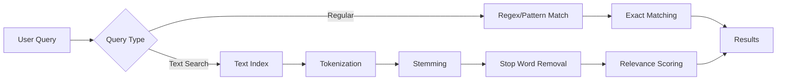
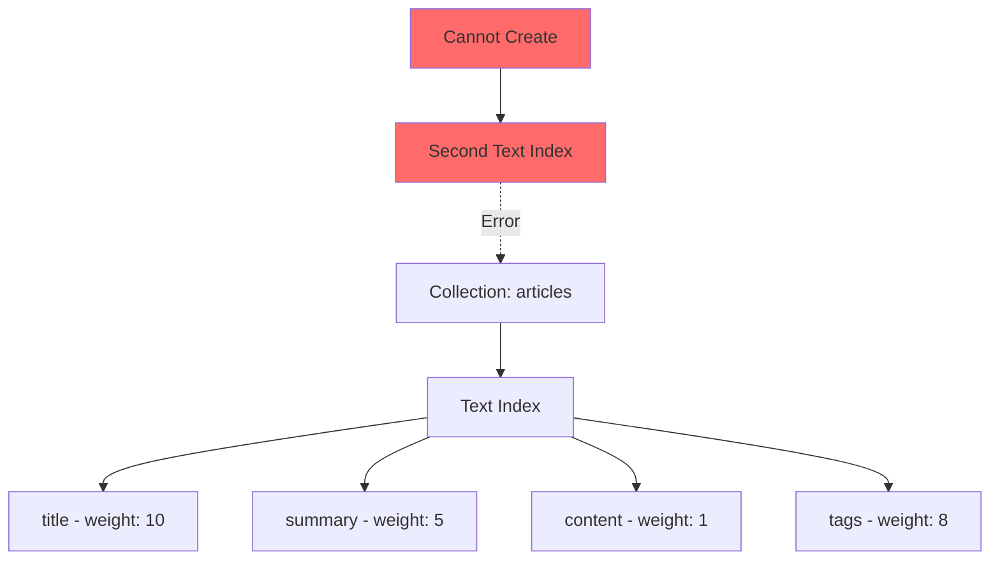
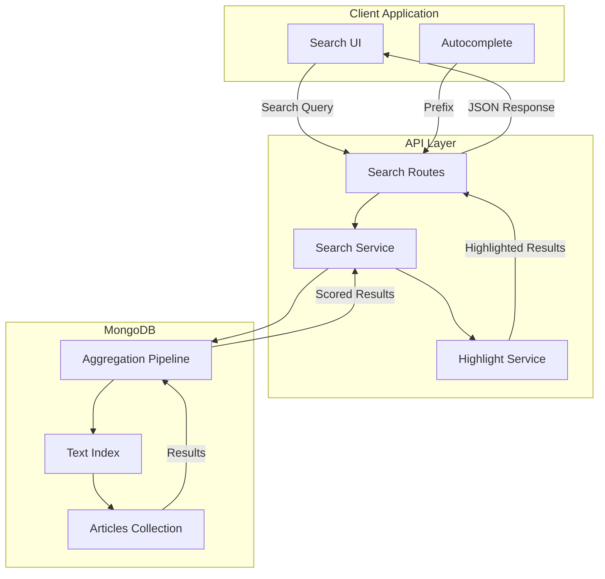

# How to Implement Text Search in MongoDB

Author: [nawazdhandala](https://github.com/nawazdhandala)

Tags: MongoDB, Text Search, Indexing, Database

Description: Learn how to implement full-text search in MongoDB from scratch, including text index creation, search queries, relevance scoring, and building production-ready search features with Node.js.

---

Full-text search is a fundamental requirement for modern applications. Whether you are building an e-commerce platform, a content management system, or a knowledge base, users expect to find content quickly using natural language queries. MongoDB provides native text search capabilities that, when implemented correctly, deliver fast and relevant search results without requiring external search engines.

This guide walks you through implementing text search in MongoDB from the ground up, covering everything from basic setup to production-ready search features.

## Understanding MongoDB Text Search

Before diving into implementation, it is important to understand how MongoDB text search differs from regular queries.

### Regular Queries vs Text Search

Regular MongoDB queries using regex or `$eq` operators perform exact or pattern matching on strings. Text search, on the other hand, uses linguistic analysis to provide more intelligent matching.



Text search provides several advantages:

- **Tokenization**: Breaks text into individual words for matching
- **Stemming**: Matches word variations (running, runs, ran all match "run")
- **Stop word removal**: Ignores common words like "the", "is", "at"
- **Case insensitivity**: Matches regardless of capitalization
- **Relevance scoring**: Ranks results by how well they match the query

## Setting Up Your Environment

Let us start by setting up a Node.js project with MongoDB.

### Project Initialization

This command initializes a new Node.js project and installs the MongoDB driver. Express is included for building the API layer.

```bash
mkdir mongodb-text-search-demo
cd mongodb-text-search-demo
npm init -y
npm install mongodb express
```

### Connecting to MongoDB

This connection module creates a reusable MongoDB client with proper connection pooling and error handling.

```javascript
// db.js
const { MongoClient } = require('mongodb');

// Connection URI - use environment variable in production
const uri = process.env.MONGODB_URI || 'mongodb://localhost:27017';

// Create a MongoClient with connection pool settings
const client = new MongoClient(uri, {
  maxPoolSize: 10,           // Maximum connections in the pool
  minPoolSize: 2,            // Minimum connections to maintain
  serverSelectionTimeoutMS: 5000,  // Timeout for server selection
  socketTimeoutMS: 45000,    // Socket timeout
});

let db = null;

// Connect and return the database instance
async function connectToDatabase() {
  if (db) {
    return db;
  }

  try {
    await client.connect();
    console.log('Connected to MongoDB');
    db = client.db('searchDemo');
    return db;
  } catch (error) {
    console.error('Failed to connect to MongoDB:', error);
    throw error;
  }
}

// Graceful shutdown handler
async function closeDatabaseConnection() {
  if (client) {
    await client.close();
    console.log('MongoDB connection closed');
  }
}

module.exports = {
  connectToDatabase,
  closeDatabaseConnection,
  getClient: () => client,
};
```

## Creating Text Indexes

Text indexes are the foundation of MongoDB text search. You must create a text index before using the `$text` operator.

### Single Field Text Index

This example creates a simple text index on a single field. Use this when you only need to search one field.

```javascript
// createIndexes.js
const { connectToDatabase } = require('./db');

async function createSingleFieldIndex() {
  const db = await connectToDatabase();
  const collection = db.collection('articles');

  // Create a text index on the content field
  // MongoDB uses "text" as the index type specifier
  const result = await collection.createIndex(
    { content: 'text' },
    { name: 'content_text_index' }
  );

  console.log('Index created:', result);
  return result;
}
```

### Multi-Field Text Index with Weights

For most applications, you need to search across multiple fields with different priorities. This example creates a weighted text index where title matches are more important than content matches.

```javascript
async function createWeightedTextIndex() {
  const db = await connectToDatabase();
  const collection = db.collection('articles');

  // Create a compound text index with field weights
  // Higher weights mean matches in that field rank higher
  const result = await collection.createIndex(
    {
      title: 'text',       // Article title
      summary: 'text',     // Short description
      content: 'text',     // Full article content
      tags: 'text',        // Keywords/tags array
      author: 'text',      // Author name
    },
    {
      weights: {
        title: 10,         // Title matches are 10x more important
        summary: 5,        // Summary matches are 5x more important
        tags: 8,           // Tag matches are 8x more important
        author: 3,         // Author matches are 3x more important
        content: 1,        // Default weight for content
      },
      name: 'article_text_search',
      default_language: 'english',  // Use English stemming rules
    }
  );

  console.log('Weighted index created:', result);
  return result;
}
```

### Important Index Constraints

MongoDB enforces a critical constraint: each collection can have only ONE text index. If you need to search different field combinations, you must include all searchable fields in a single index.



### Verifying Index Creation

Always verify your indexes were created correctly. This helper function lists all indexes on a collection.

```javascript
async function listIndexes() {
  const db = await connectToDatabase();
  const collection = db.collection('articles');

  // Retrieve all indexes on the collection
  const indexes = await collection.indexes();

  console.log('Current indexes:');
  indexes.forEach(index => {
    console.log(`  - ${index.name}: ${JSON.stringify(index.key)}`);
    if (index.weights) {
      console.log(`    Weights: ${JSON.stringify(index.weights)}`);
    }
  });

  return indexes;
}
```

## Implementing Basic Text Search

With the index in place, you can now perform text searches using the `$text` operator.

### Simple Search Query

This function performs a basic text search and returns matching documents sorted by relevance score.

```javascript
async function searchArticles(searchQuery) {
  const db = await connectToDatabase();
  const collection = db.collection('articles');

  // Use $text operator with $search to perform full-text search
  // MongoDB automatically uses the text index
  const results = await collection.find(
    {
      $text: { $search: searchQuery }
    },
    {
      // Project the textScore to use for sorting
      projection: {
        title: 1,
        summary: 1,
        author: 1,
        publishedAt: 1,
        // Include the relevance score in results
        score: { $meta: 'textScore' }
      }
    }
  )
  // Sort by text score (highest relevance first)
  .sort({ score: { $meta: 'textScore' } })
  .toArray();

  return results;
}

// Usage example
// searchArticles('mongodb performance optimization')
```

### Understanding Search Syntax

MongoDB text search supports several query modifiers:

```javascript
async function demonstrateSearchSyntax() {
  const db = await connectToDatabase();
  const collection = db.collection('articles');

  // Search for documents containing "mongodb" OR "database"
  // By default, terms are ORed together
  const orSearch = await collection.find({
    $text: { $search: 'mongodb database' }
  }).toArray();

  // Search for exact phrase "mongodb tutorial"
  // Use escaped quotes for phrase matching
  const phraseSearch = await collection.find({
    $text: { $search: '"mongodb tutorial"' }
  }).toArray();

  // Exclude documents containing "deprecated"
  // Use minus sign to negate a term
  const excludeSearch = await collection.find({
    $text: { $search: 'mongodb -deprecated' }
  }).toArray();

  // Combine phrase search with exclusion
  // Find documents with "getting started" phrase but not "outdated"
  const combinedSearch = await collection.find({
    $text: { $search: '"getting started" mongodb -outdated' }
  }).toArray();

  return {
    orResults: orSearch.length,
    phraseResults: phraseSearch.length,
    excludeResults: excludeSearch.length,
    combinedResults: combinedSearch.length,
  };
}
```

## Building a Search API

Let us build a complete search API with pagination, filtering, and relevance scoring.

### Search Service Implementation

This service class encapsulates all search logic and provides a clean interface for the API layer.

```javascript
// searchService.js
const { connectToDatabase } = require('./db');

class SearchService {
  constructor() {
    this.db = null;
    this.collection = null;
  }

  // Initialize the service with database connection
  async initialize() {
    this.db = await connectToDatabase();
    this.collection = this.db.collection('articles');
  }

  // Main search method with full feature support
  async search(query, options = {}) {
    const {
      page = 1,              // Current page number
      limit = 20,            // Results per page
      minScore = 0.5,        // Minimum relevance score
      category = null,       // Optional category filter
      dateFrom = null,       // Optional date range start
      dateTo = null,         // Optional date range end
      sortBy = 'relevance',  // Sort method: relevance, date, or title
    } = options;

    // Build the query object
    const matchStage = {
      $text: { $search: query }
    };

    // Add optional filters
    if (category) {
      matchStage.category = category;
    }

    if (dateFrom || dateTo) {
      matchStage.publishedAt = {};
      if (dateFrom) {
        matchStage.publishedAt.$gte = new Date(dateFrom);
      }
      if (dateTo) {
        matchStage.publishedAt.$lte = new Date(dateTo);
      }
    }

    // Build aggregation pipeline for complex search
    const pipeline = [
      // Stage 1: Match documents using text search and filters
      { $match: matchStage },

      // Stage 2: Add text score field
      {
        $addFields: {
          score: { $meta: 'textScore' }
        }
      },

      // Stage 3: Filter by minimum score threshold
      {
        $match: {
          score: { $gte: minScore }
        }
      },

      // Stage 4: Sort results
      {
        $sort: this.buildSortStage(sortBy)
      },

      // Stage 5: Facet for pagination and total count
      {
        $facet: {
          // Get paginated results
          results: [
            { $skip: (page - 1) * limit },
            { $limit: limit },
            {
              $project: {
                title: 1,
                summary: 1,
                author: 1,
                category: 1,
                publishedAt: 1,
                slug: 1,
                score: 1,
              }
            }
          ],
          // Get total count for pagination metadata
          totalCount: [
            { $count: 'count' }
          ]
        }
      }
    ];

    const [result] = await this.collection.aggregate(pipeline).toArray();

    // Extract results and count
    const articles = result.results;
    const total = result.totalCount[0]?.count || 0;

    return {
      articles,
      pagination: {
        page,
        limit,
        total,
        totalPages: Math.ceil(total / limit),
        hasNextPage: page * limit < total,
        hasPrevPage: page > 1,
      },
      meta: {
        query,
        minScore,
        filters: { category, dateFrom, dateTo },
      }
    };
  }

  // Build sort stage based on sort option
  buildSortStage(sortBy) {
    switch (sortBy) {
      case 'date':
        return { publishedAt: -1, score: { $meta: 'textScore' } };
      case 'title':
        return { title: 1, score: { $meta: 'textScore' } };
      case 'relevance':
      default:
        return { score: { $meta: 'textScore' }, publishedAt: -1 };
    }
  }

  // Get search suggestions for autocomplete
  async getSuggestions(prefix, limit = 5) {
    // Combine text search with regex for better autocomplete
    const results = await this.collection.find(
      {
        $or: [
          // Text search for relevance
          { $text: { $search: prefix } },
          // Regex for prefix matching on title
          { title: { $regex: `^${this.escapeRegex(prefix)}`, $options: 'i' } }
        ]
      },
      {
        projection: {
          title: 1,
          score: { $meta: 'textScore' }
        }
      }
    )
    .sort({ score: { $meta: 'textScore' } })
    .limit(limit * 2)  // Get extra to deduplicate
    .toArray();

    // Deduplicate and limit results
    const seen = new Set();
    const suggestions = [];

    for (const doc of results) {
      if (!seen.has(doc.title) && suggestions.length < limit) {
        seen.add(doc.title);
        suggestions.push(doc.title);
      }
    }

    return suggestions;
  }

  // Escape special regex characters in user input
  escapeRegex(string) {
    return string.replace(/[.*+?^${}()|[\]\\]/g, '\\$&');
  }
}

module.exports = SearchService;
```

### Express API Routes

This Express router exposes the search functionality as REST endpoints.

```javascript
// routes/search.js
const express = require('express');
const SearchService = require('../searchService');

const router = express.Router();
const searchService = new SearchService();

// Initialize search service on startup
searchService.initialize().catch(console.error);

// Main search endpoint
// GET /api/search?q=mongodb&page=1&limit=20&category=tutorial
router.get('/search', async (req, res) => {
  try {
    const {
      q: query,
      page = 1,
      limit = 20,
      minScore = 0.5,
      category,
      dateFrom,
      dateTo,
      sortBy = 'relevance',
    } = req.query;

    // Validate required query parameter
    if (!query || query.trim().length === 0) {
      return res.status(400).json({
        error: 'Search query is required',
        code: 'MISSING_QUERY'
      });
    }

    // Validate pagination parameters
    const pageNum = Math.max(1, parseInt(page, 10) || 1);
    const limitNum = Math.min(100, Math.max(1, parseInt(limit, 10) || 20));

    // Perform search
    const results = await searchService.search(query.trim(), {
      page: pageNum,
      limit: limitNum,
      minScore: parseFloat(minScore) || 0.5,
      category: category || null,
      dateFrom: dateFrom || null,
      dateTo: dateTo || null,
      sortBy,
    });

    res.json(results);
  } catch (error) {
    console.error('Search error:', error);
    res.status(500).json({
      error: 'Search failed',
      code: 'SEARCH_ERROR'
    });
  }
});

// Autocomplete suggestions endpoint
// GET /api/search/suggestions?q=mong
router.get('/search/suggestions', async (req, res) => {
  try {
    const { q: prefix, limit = 5 } = req.query;

    if (!prefix || prefix.trim().length < 2) {
      return res.json({ suggestions: [] });
    }

    const suggestions = await searchService.getSuggestions(
      prefix.trim(),
      Math.min(10, parseInt(limit, 10) || 5)
    );

    res.json({ suggestions });
  } catch (error) {
    console.error('Suggestions error:', error);
    res.status(500).json({ suggestions: [] });
  }
});

module.exports = router;
```

## Advanced Search Features

### Faceted Search Results

Faceted search allows users to filter results by categories, tags, or other dimensions. This implementation returns search results along with aggregated facet counts.

```javascript
async function searchWithFacets(query, options = {}) {
  const db = await connectToDatabase();
  const collection = db.collection('articles');

  const { page = 1, limit = 20 } = options;

  // Aggregation pipeline for faceted search
  const pipeline = [
    // Match documents using text search
    {
      $match: {
        $text: { $search: query }
      }
    },

    // Add text score
    {
      $addFields: {
        score: { $meta: 'textScore' }
      }
    },

    // Use $facet to compute multiple aggregations in parallel
    {
      $facet: {
        // Paginated search results
        results: [
          { $sort: { score: { $meta: 'textScore' } } },
          { $skip: (page - 1) * limit },
          { $limit: limit },
          {
            $project: {
              title: 1,
              summary: 1,
              category: 1,
              author: 1,
              score: 1,
            }
          }
        ],

        // Count by category
        categoryFacet: [
          {
            $group: {
              _id: '$category',
              count: { $sum: 1 }
            }
          },
          { $sort: { count: -1 } },
          { $limit: 10 }
        ],

        // Count by author
        authorFacet: [
          {
            $group: {
              _id: '$author',
              count: { $sum: 1 }
            }
          },
          { $sort: { count: -1 } },
          { $limit: 10 }
        ],

        // Count by year
        yearFacet: [
          {
            $group: {
              _id: { $year: '$publishedAt' },
              count: { $sum: 1 }
            }
          },
          { $sort: { _id: -1 } }
        ],

        // Total count
        totalCount: [
          { $count: 'total' }
        ]
      }
    }
  ];

  const [result] = await collection.aggregate(pipeline).toArray();

  return {
    results: result.results,
    facets: {
      categories: result.categoryFacet.map(f => ({
        name: f._id,
        count: f.count
      })),
      authors: result.authorFacet.map(f => ({
        name: f._id,
        count: f.count
      })),
      years: result.yearFacet.map(f => ({
        year: f._id,
        count: f.count
      })),
    },
    total: result.totalCount[0]?.total || 0,
  };
}
```

### Search Result Highlighting

MongoDB native text search does not provide built-in highlighting, but you can implement it in your application layer.

```javascript
// highlightService.js

class HighlightService {
  constructor(options = {}) {
    this.highlightTag = options.highlightTag || 'mark';
    this.maxSnippetLength = options.maxSnippetLength || 200;
  }

  // Highlight search terms in text
  highlightText(text, searchTerms) {
    if (!text || !searchTerms || searchTerms.length === 0) {
      return text;
    }

    // Build regex pattern for all search terms
    const escapedTerms = searchTerms.map(term =>
      term.replace(/[.*+?^${}()|[\]\\]/g, '\\$&')
    );
    const pattern = new RegExp(`(${escapedTerms.join('|')})`, 'gi');

    // Replace matches with highlighted version
    return text.replace(pattern,
      `<${this.highlightTag}>$1</${this.highlightTag}>`
    );
  }

  // Extract snippet around matched terms
  extractSnippet(text, searchTerms) {
    if (!text || !searchTerms || searchTerms.length === 0) {
      return text.substring(0, this.maxSnippetLength) + '...';
    }

    // Find the first occurrence of any search term
    const lowerText = text.toLowerCase();
    let firstMatch = text.length;

    for (const term of searchTerms) {
      const index = lowerText.indexOf(term.toLowerCase());
      if (index !== -1 && index < firstMatch) {
        firstMatch = index;
      }
    }

    // Calculate snippet boundaries
    const snippetStart = Math.max(0, firstMatch - 50);
    const snippetEnd = Math.min(text.length, firstMatch + this.maxSnippetLength);

    // Extract and format snippet
    let snippet = text.substring(snippetStart, snippetEnd);

    // Add ellipsis if truncated
    if (snippetStart > 0) {
      snippet = '...' + snippet;
    }
    if (snippetEnd < text.length) {
      snippet = snippet + '...';
    }

    // Highlight terms in snippet
    return this.highlightText(snippet, searchTerms);
  }

  // Process search results to add highlights
  processResults(results, query) {
    // Parse search terms from query (remove phrases and negations)
    const searchTerms = this.parseSearchTerms(query);

    return results.map(result => ({
      ...result,
      titleHighlighted: this.highlightText(result.title, searchTerms),
      snippet: this.extractSnippet(result.content || result.summary, searchTerms),
    }));
  }

  // Parse search query into individual terms
  parseSearchTerms(query) {
    // Remove phrases (quoted strings) and negations (minus prefix)
    const cleaned = query
      .replace(/"[^"]+"/g, '')    // Remove phrases
      .replace(/-\w+/g, '')       // Remove negations
      .trim();

    // Split into words and filter empty strings
    return cleaned.split(/\s+/).filter(term => term.length > 0);
  }
}

module.exports = HighlightService;
```

## Performance Optimization

### Index Size and Memory Considerations

Text indexes can be large, especially for collections with long text fields. Monitor and optimize your indexes.

```javascript
async function analyzeIndexPerformance() {
  const db = await connectToDatabase();
  const collection = db.collection('articles');

  // Get collection statistics including index sizes
  const stats = await collection.stats();

  console.log('Collection Statistics:');
  console.log(`  Total documents: ${stats.count}`);
  console.log(`  Average document size: ${Math.round(stats.avgObjSize)} bytes`);
  console.log(`  Total data size: ${Math.round(stats.size / 1024 / 1024)} MB`);
  console.log(`  Total index size: ${Math.round(stats.totalIndexSize / 1024 / 1024)} MB`);

  console.log('\nIndex Sizes:');
  for (const [indexName, size] of Object.entries(stats.indexSizes)) {
    console.log(`  ${indexName}: ${Math.round(size / 1024 / 1024)} MB`);
  }

  // Recommendation if text index is too large
  const textIndexSize = stats.indexSizes['article_text_search'] || 0;
  if (textIndexSize > 100 * 1024 * 1024) {  // Greater than 100MB
    console.log('\nWarning: Text index is large. Consider:');
    console.log('  - Reducing indexed fields');
    console.log('  - Using compound index with equality prefix');
    console.log('  - Archiving old documents');
  }

  return stats;
}
```

### Compound Index Strategy

Combining text indexes with equality filters can dramatically improve performance by reducing the documents scanned.

```javascript
async function createOptimizedCompoundIndex() {
  const db = await connectToDatabase();
  const collection = db.collection('articles');

  // Create compound index with equality prefix
  // MongoDB can use the status field to filter BEFORE text search
  const result = await collection.createIndex(
    {
      status: 1,           // Equality prefix - filtered first
      category: 1,         // Another equality filter
      title: 'text',       // Text search fields
      content: 'text',
    },
    {
      name: 'optimized_search_index',
      weights: {
        title: 10,
        content: 1,
      },
      // Partial filter expression - only index published articles
      partialFilterExpression: {
        status: 'published'
      }
    }
  );

  console.log('Optimized compound index created:', result);
  return result;
}

// Query that benefits from compound index
async function optimizedSearch(query, category) {
  const db = await connectToDatabase();
  const collection = db.collection('articles');

  // This query uses the compound index efficiently:
  // 1. First filters by status (equality)
  // 2. Then filters by category (equality)
  // 3. Finally applies text search on reduced dataset
  return collection.find({
    status: 'published',      // Uses index prefix
    category: category,       // Uses index prefix
    $text: { $search: query } // Text search on filtered results
  })
  .sort({ score: { $meta: 'textScore' } })
  .toArray();
}
```

### Query Execution Analysis

Always analyze your queries to ensure they use indexes effectively.

```javascript
async function analyzeSearchQuery(query) {
  const db = await connectToDatabase();
  const collection = db.collection('articles');

  // Get query execution statistics
  const explanation = await collection.find({
    $text: { $search: query }
  }).explain('executionStats');

  console.log('Query Execution Analysis:');
  console.log(`  Execution time: ${explanation.executionStats.executionTimeMillis}ms`);
  console.log(`  Documents examined: ${explanation.executionStats.totalDocsExamined}`);
  console.log(`  Documents returned: ${explanation.executionStats.nReturned}`);
  console.log(`  Index used: ${explanation.queryPlanner.winningPlan.inputStage?.indexName || 'None'}`);

  // Check for inefficient queries
  const docsExamined = explanation.executionStats.totalDocsExamined;
  const docsReturned = explanation.executionStats.nReturned;

  if (docsExamined > docsReturned * 10) {
    console.log('\nWarning: Query is examining many more documents than returned.');
    console.log('Consider adding filters or optimizing your index.');
  }

  return explanation;
}
```

## Search Architecture Diagram

The following diagram illustrates the complete search architecture.



## Testing Your Search Implementation

Create comprehensive tests to ensure search quality and performance.

```javascript
// tests/search.test.js

async function runSearchTests() {
  const searchService = new SearchService();
  await searchService.initialize();

  const tests = [
    // Test 1: Basic search returns results
    async () => {
      const result = await searchService.search('mongodb');
      console.assert(result.articles.length > 0, 'Basic search should return results');
      console.log('Test 1 passed: Basic search works');
    },

    // Test 2: Phrase search works correctly
    async () => {
      const result = await searchService.search('"getting started"');
      const allContainPhrase = result.articles.every(
        a => a.title.toLowerCase().includes('getting started') ||
             a.summary?.toLowerCase().includes('getting started')
      );
      console.assert(allContainPhrase, 'Phrase search should match exact phrases');
      console.log('Test 2 passed: Phrase search works');
    },

    // Test 3: Negation excludes documents
    async () => {
      const withTerm = await searchService.search('mongodb tutorial');
      const withoutTerm = await searchService.search('mongodb -tutorial');
      console.assert(
        withoutTerm.articles.length <= withTerm.articles.length,
        'Negation should reduce or maintain result count'
      );
      console.log('Test 3 passed: Negation works');
    },

    // Test 4: Pagination works correctly
    async () => {
      const page1 = await searchService.search('database', { page: 1, limit: 5 });
      const page2 = await searchService.search('database', { page: 2, limit: 5 });

      const page1Ids = page1.articles.map(a => a._id.toString());
      const page2Ids = page2.articles.map(a => a._id.toString());
      const overlap = page1Ids.filter(id => page2Ids.includes(id));

      console.assert(overlap.length === 0, 'Pages should not overlap');
      console.log('Test 4 passed: Pagination works');
    },

    // Test 5: Score sorting works
    async () => {
      const result = await searchService.search('mongodb performance');
      for (let i = 1; i < result.articles.length; i++) {
        console.assert(
          result.articles[i - 1].score >= result.articles[i].score,
          'Results should be sorted by score descending'
        );
      }
      console.log('Test 5 passed: Score sorting works');
    },

    // Test 6: Minimum score filter works
    async () => {
      const result = await searchService.search('mongodb', { minScore: 2.0 });
      const allAboveThreshold = result.articles.every(a => a.score >= 2.0);
      console.assert(allAboveThreshold, 'All results should be above minimum score');
      console.log('Test 6 passed: Minimum score filter works');
    },
  ];

  console.log('Running search tests...\n');
  for (const test of tests) {
    await test();
  }
  console.log('\nAll tests passed!');
}
```

## Best Practices Summary

When implementing text search in MongoDB, follow these best practices:

### Index Design

1. **Include all searchable fields in one index** since MongoDB allows only one text index per collection
2. **Use field weights** to prioritize important fields like titles over body content
3. **Consider compound indexes** with equality prefixes for filtered searches
4. **Use partial filter expressions** to reduce index size by excluding irrelevant documents

### Query Optimization

1. **Always filter with equality conditions** when possible to reduce documents scanned
2. **Set a minimum score threshold** to eliminate low-relevance results
3. **Use projection** to return only needed fields
4. **Implement pagination** to avoid returning large result sets

### Application Design

1. **Implement search suggestions** for better user experience
2. **Add result highlighting** to show users why documents matched
3. **Provide faceted navigation** to help users refine results
4. **Handle empty and short queries** gracefully

### Monitoring

1. **Track search latency** and set performance budgets
2. **Monitor index size growth** and plan for scaling
3. **Log and analyze popular queries** to optimize common searches
4. **Use explain()** regularly to verify query performance

## When to Consider Alternatives

MongoDB native text search works well for many use cases, but consider alternatives when you need:

| Feature | MongoDB Text Search | Elasticsearch/Atlas Search |
|---------|---------------------|---------------------------|
| Fuzzy matching | Not supported | Full support |
| Synonyms | Not supported | Configurable |
| Custom analyzers | Limited | Extensive |
| Result highlighting | Manual | Built-in |
| Autocomplete | Basic | Advanced |
| Geo-text combined | Possible | Optimized |
| Scale | Millions | Billions |

If you need advanced features like fuzzy matching, synonyms, or custom analyzers, consider MongoDB Atlas Search (which uses Apache Lucene) or a dedicated search engine like Elasticsearch.

---

MongoDB text search provides a solid foundation for implementing search functionality without the complexity of managing a separate search infrastructure. By following the patterns in this guide, you can build fast, relevant search features that scale with your application. Start with the basics, measure performance, and optimize based on real usage patterns.
