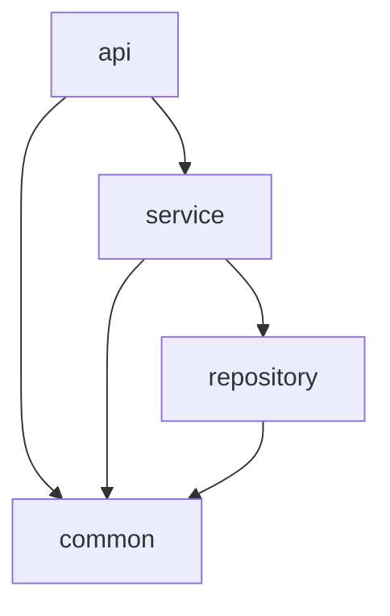

# How to Build Multi-Module Maven Projects

Author: [nawazdhandala](https://github.com/nawazdhandala)

Tags: Java, Maven, Build Tools, Project Structure

Description: Learn how to structure multi-module Maven projects with proper dependency management, build configuration, and best practices for large Java applications.

---

If you've worked on a Java project that grew beyond a few thousand lines, you've probably felt the pain of managing everything in a single `pom.xml`. Dependencies pile up, build times slow down, and different parts of your application start stepping on each other's toes.

Multi-module Maven projects solve this by letting you split your codebase into logical components while keeping a unified build. Each module gets its own `pom.xml` but shares common configuration through a parent POM. This means your API layer, business logic, and data access code can live in separate modules with clear boundaries.

## Project Structure Overview

Here's what a typical multi-module project looks like on disk:

```
my-application/
├── pom.xml                    # Parent POM - coordinates everything
├── api/
│   ├── pom.xml               # REST controllers, DTOs
│   └── src/
├── service/
│   ├── pom.xml               # Business logic
│   └── src/
├── repository/
│   ├── pom.xml               # Data access layer
│   └── src/
└── common/
    ├── pom.xml               # Shared utilities
    └── src/
```

The parent POM ties everything together. Child modules reference it and inherit configuration.

## Setting Up the Parent POM

The parent POM is the heart of your multi-module setup. It uses `<packaging>pom</packaging>` because it doesn't produce a JAR - it just coordinates child modules.

```xml
<?xml version="1.0" encoding="UTF-8"?>
<project xmlns="http://maven.apache.org/POM/4.0.0"
         xmlns:xsi="http://www.w3.org/2001/XMLSchema-instance"
         xsi:schemaLocation="http://maven.apache.org/POM/4.0.0
         http://maven.apache.org/xsd/maven-4.0.0.xsd">
    <modelVersion>4.0.0</modelVersion>

    <!-- Parent coordinates - child modules reference these -->
    <groupId>com.example</groupId>
    <artifactId>my-application</artifactId>
    <version>1.0.0-SNAPSHOT</version>
    <packaging>pom</packaging>

    <!-- List all child modules here -->
    <modules>
        <module>common</module>
        <module>repository</module>
        <module>service</module>
        <module>api</module>
    </modules>

    <!-- Properties centralize version numbers -->
    <properties>
        <java.version>17</java.version>
        <spring-boot.version>3.2.0</spring-boot.version>
        <project.build.sourceEncoding>UTF-8</project.build.sourceEncoding>
    </properties>

    <!-- dependencyManagement controls versions without forcing inclusion -->
    <dependencyManagement>
        <dependencies>
            <!-- Spring Boot BOM - manages all Spring dependency versions -->
            <dependency>
                <groupId>org.springframework.boot</groupId>
                <artifactId>spring-boot-dependencies</artifactId>
                <version>${spring-boot.version}</version>
                <type>pom</type>
                <scope>import</scope>
            </dependency>

            <!-- Inter-module dependencies - keeps versions in sync -->
            <dependency>
                <groupId>com.example</groupId>
                <artifactId>common</artifactId>
                <version>${project.version}</version>
            </dependency>
            <dependency>
                <groupId>com.example</groupId>
                <artifactId>repository</artifactId>
                <version>${project.version}</version>
            </dependency>
            <dependency>
                <groupId>com.example</groupId>
                <artifactId>service</artifactId>
                <version>${project.version}</version>
            </dependency>
        </dependencies>
    </dependencyManagement>

    <!-- Build plugins that apply to all modules -->
    <build>
        <pluginManagement>
            <plugins>
                <plugin>
                    <groupId>org.apache.maven.plugins</groupId>
                    <artifactId>maven-compiler-plugin</artifactId>
                    <version>3.11.0</version>
                    <configuration>
                        <source>${java.version}</source>
                        <target>${java.version}</target>
                    </configuration>
                </plugin>
            </plugins>
        </pluginManagement>
    </build>
</project>
```

## Creating Child Modules

Each child module has its own `pom.xml` that references the parent. Notice how the child doesn't need to redeclare versions - it inherits them.

Here's the `service` module that depends on `repository` and `common`:

```xml
<?xml version="1.0" encoding="UTF-8"?>
<project xmlns="http://maven.apache.org/POM/4.0.0"
         xmlns:xsi="http://www.w3.org/2001/XMLSchema-instance"
         xsi:schemaLocation="http://maven.apache.org/POM/4.0.0
         http://maven.apache.org/xsd/maven-4.0.0.xsd">
    <modelVersion>4.0.0</modelVersion>

    <!-- Link to parent - inherits groupId and version -->
    <parent>
        <groupId>com.example</groupId>
        <artifactId>my-application</artifactId>
        <version>1.0.0-SNAPSHOT</version>
    </parent>

    <!-- Only artifactId needed - groupId and version come from parent -->
    <artifactId>service</artifactId>

    <dependencies>
        <!-- Inter-module dependency - version managed by parent -->
        <dependency>
            <groupId>com.example</groupId>
            <artifactId>repository</artifactId>
        </dependency>
        <dependency>
            <groupId>com.example</groupId>
            <artifactId>common</artifactId>
        </dependency>

        <!-- External dependency - version managed by Spring BOM -->
        <dependency>
            <groupId>org.springframework</groupId>
            <artifactId>spring-context</artifactId>
        </dependency>
    </dependencies>
</project>
```

## Understanding dependencyManagement vs dependencies

This trips up a lot of developers. Here's the difference:

| Aspect | `<dependencyManagement>` | `<dependencies>` |
|--------|--------------------------|------------------|
| Purpose | Declares versions and scope | Actually includes dependencies |
| Inheritance | Child modules can use, but don't have to | All child modules get these |
| Use case | Centralizing version control | Common deps every module needs |

Put test frameworks like JUnit in `<dependencies>` at the parent level if every module needs tests. Put libraries like Jackson in `<dependencyManagement>` so modules can opt-in.

## Build Profiles for Different Environments

Profiles let you customize builds for development, testing, and production. Define them in the parent POM so they're available everywhere.

```xml
<profiles>
    <!-- Active by default for local development -->
    <profile>
        <id>dev</id>
        <activation>
            <activeByDefault>true</activeByDefault>
        </activation>
        <properties>
            <skip.tests>false</skip.tests>
            <log.level>DEBUG</log.level>
        </properties>
    </profile>

    <!-- CI profile - runs full test suite -->
    <profile>
        <id>ci</id>
        <properties>
            <skip.tests>false</skip.tests>
            <log.level>INFO</log.level>
        </properties>
        <build>
            <plugins>
                <plugin>
                    <groupId>org.jacoco</groupId>
                    <artifactId>jacoco-maven-plugin</artifactId>
                    <version>0.8.11</version>
                    <executions>
                        <execution>
                            <goals>
                                <goal>prepare-agent</goal>
                                <goal>report</goal>
                            </goals>
                        </execution>
                    </executions>
                </plugin>
            </plugins>
        </build>
    </profile>

    <!-- Production build - skip tests, enable optimizations -->
    <profile>
        <id>prod</id>
        <properties>
            <skip.tests>true</skip.tests>
            <log.level>WARN</log.level>
        </properties>
    </profile>
</profiles>
```

Activate profiles with `mvn clean install -P ci` or through IDE settings.

## Module Dependency Flow

Here's how dependencies typically flow in a layered architecture:



The `api` module depends on `service`, which depends on `repository`. All three can use `common`. Maven builds modules in the right order automatically - you don't need to worry about build sequencing.

## Common Build Commands

Here are the commands you'll use most often:

```bash
# Build everything from the parent directory
mvn clean install

# Build only the service module and its dependencies
mvn clean install -pl service -am

# Skip tests during development
mvn clean install -DskipTests

# Build specific modules without dependencies
mvn clean install -pl api,service

# Run with a specific profile
mvn clean install -P prod
```

The `-pl` flag (project list) specifies modules. The `-am` flag (also make) includes dependencies of those modules.

## Best Practices

**Keep modules focused.** Each module should have a single responsibility. If you're not sure whether something belongs in `service` or `repository`, it probably deserves its own module.

**Version lock external dependencies.** Always use `<dependencyManagement>` for external libraries. Having different modules use different versions of the same library causes class conflicts.

**Use BOMs when available.** Spring Boot, Jackson, and other major frameworks publish Bill of Materials (BOM) POMs. Import these to get tested-together version sets.

**Don't create circular dependencies.** If module A depends on B and B depends on A, refactor. Extract the shared code into a third module.

**Run builds from the parent.** Running `mvn install` from a child module won't pick up changes in sibling modules. Always build from the root unless you know what you're doing.

## Wrapping Up

Multi-module Maven projects take some upfront investment, but they pay off quickly on larger codebases. You get faster incremental builds, cleaner separation of concerns, and the ability to version and release modules independently if needed.

Start with a simple structure - maybe just `api`, `service`, and `common`. You can always split modules further as the project grows. The parent POM keeps everything in sync, so refactoring later isn't as painful as you might think.
