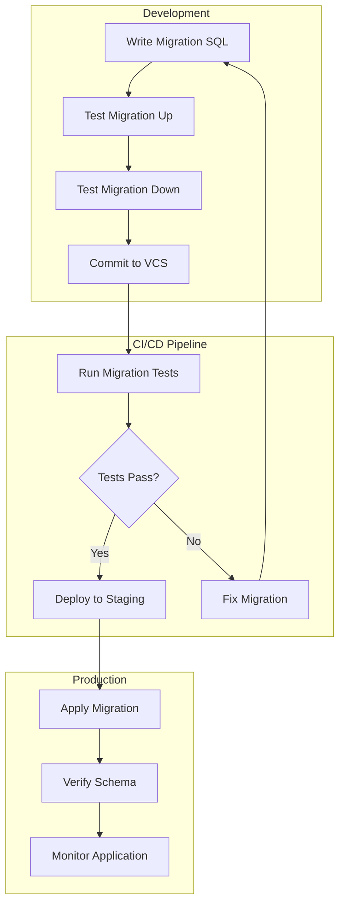

# How to Handle Database Migrations in MySQL

Author: [nawazdhandala](https://github.com/nawazdhandala)

Tags: MySQL, Database, Migrations, Schema Management, DevOps, CI/CD

Description: Learn how to handle database migrations in MySQL using tools like Flyway, Liquibase, and native SQL scripts. This comprehensive guide covers migration strategies, version control, rollback procedures, and best practices for production deployments.

---

Database migrations are essential for managing schema changes in MySQL applications. As your application evolves, you need a systematic way to version your database schema, apply changes consistently across environments, and handle rollbacks when issues arise. This guide covers multiple approaches to MySQL migrations, from native SQL scripts to dedicated migration tools.

## Table of Contents

1. [Understanding MySQL Migrations](#understanding-mysql-migrations)
2. [Migration Workflow Overview](#migration-workflow-overview)
3. [Native SQL Migration Scripts](#native-sql-migration-scripts)
4. [Using Flyway for Migrations](#using-flyway-for-migrations)
5. [Using Liquibase for Migrations](#using-liquibase-for-migrations)
6. [Migration Best Practices](#migration-best-practices)
7. [Handling Large Table Migrations](#handling-large-table-migrations)
8. [CI/CD Integration](#cicd-integration)
9. [Rollback Strategies](#rollback-strategies)
10. [Troubleshooting Common Issues](#troubleshooting-common-issues)
11. [Conclusion](#conclusion)

---

## Understanding MySQL Migrations

Database migrations are version-controlled changes to your database schema. They allow you to track, apply, and reverse schema modifications in a controlled manner.

Key concepts include:

- **Version Control**: Each migration has a unique version identifier
- **Forward Migrations**: Scripts that apply changes (create tables, add columns)
- **Rollback Migrations**: Scripts that reverse changes when needed
- **Migration History**: A record of which migrations have been applied
- **Idempotency**: Migrations should be safe to run multiple times


---

## Migration Workflow Overview

A typical migration workflow involves creating migration files, testing them locally, and deploying through your environments.



---

## Native SQL Migration Scripts

For simple projects or when you need maximum control, you can manage migrations using plain SQL scripts with a custom versioning system.

### Project Structure

Organize your migration files with a clear naming convention that ensures proper ordering.

```
project/
├── migrations/
│   ├── V001__create_users_table.sql
│   ├── V001__create_users_table.rollback.sql
│   ├── V002__add_email_index.sql
│   ├── V002__add_email_index.rollback.sql
│   ├── V003__create_posts_table.sql
│   └── V003__create_posts_table.rollback.sql
├── scripts/
│   ├── migrate.sh
│   └── rollback.sh
└── schema_versions.sql
```

### Creating the Schema Versions Table

This table tracks which migrations have been applied to the database.

```sql
-- schema_versions.sql
-- Create a table to track applied migrations
-- This table stores the version number, description, and execution timestamp

CREATE TABLE IF NOT EXISTS schema_versions (
    id INT AUTO_INCREMENT PRIMARY KEY,
    version VARCHAR(50) NOT NULL UNIQUE,
    description VARCHAR(255) NOT NULL,
    applied_at TIMESTAMP DEFAULT CURRENT_TIMESTAMP,
    execution_time_ms INT,
    checksum VARCHAR(64),
    applied_by VARCHAR(100),
    INDEX idx_version (version),
    INDEX idx_applied_at (applied_at)
) ENGINE=InnoDB DEFAULT CHARSET=utf8mb4 COLLATE=utf8mb4_unicode_ci;
```

### Example Migration: Creating Users Table

The forward migration creates the table with proper constraints and indexes.

```sql
-- V001__create_users_table.sql
-- Create the users table with essential fields for authentication
-- Uses InnoDB for transaction support and foreign key constraints

CREATE TABLE IF NOT EXISTS users (
    id BIGINT UNSIGNED AUTO_INCREMENT PRIMARY KEY,
    username VARCHAR(50) NOT NULL,
    email VARCHAR(255) NOT NULL,
    password_hash VARCHAR(255) NOT NULL,
    first_name VARCHAR(100),
    last_name VARCHAR(100),
    is_active TINYINT(1) DEFAULT 1,
    created_at TIMESTAMP DEFAULT CURRENT_TIMESTAMP,
    updated_at TIMESTAMP DEFAULT CURRENT_TIMESTAMP ON UPDATE CURRENT_TIMESTAMP,

    -- Unique constraints for authentication lookups
    UNIQUE KEY uk_users_username (username),
    UNIQUE KEY uk_users_email (email),

    -- Index for active user queries
    INDEX idx_users_active (is_active, created_at)
) ENGINE=InnoDB DEFAULT CHARSET=utf8mb4 COLLATE=utf8mb4_unicode_ci;

-- Record this migration in the schema versions table
INSERT INTO schema_versions (version, description, applied_by)
VALUES ('V001', 'Create users table', CURRENT_USER());
```

The rollback migration reverses all changes made by the forward migration.

```sql
-- V001__create_users_table.rollback.sql
-- Rollback: Remove the users table
-- Warning: This will delete all user data

DROP TABLE IF EXISTS users;

-- Remove the version record
DELETE FROM schema_versions WHERE version = 'V001';
```

### Example Migration: Adding Indexes

This migration adds a composite index for optimizing common queries.

```sql
-- V002__add_email_index.sql
-- Add a covering index for email-based authentication queries
-- This improves login performance by including commonly accessed columns

-- Check if index exists before creating to make migration idempotent
SET @index_exists = (
    SELECT COUNT(*)
    FROM information_schema.statistics
    WHERE table_schema = DATABASE()
    AND table_name = 'users'
    AND index_name = 'idx_users_email_auth'
);

SET @sql = IF(@index_exists = 0,
    'CREATE INDEX idx_users_email_auth ON users(email, password_hash, is_active)',
    'SELECT "Index already exists"'
);

PREPARE stmt FROM @sql;
EXECUTE stmt;
DEALLOCATE PREPARE stmt;

-- Record migration
INSERT INTO schema_versions (version, description, applied_by)
VALUES ('V002', 'Add email authentication index', CURRENT_USER());
```

```sql
-- V002__add_email_index.rollback.sql
-- Remove the email authentication index

DROP INDEX idx_users_email_auth ON users;

DELETE FROM schema_versions WHERE version = 'V002';
```

### Example Migration: Creating Related Tables

This migration creates a posts table with a foreign key relationship to users.

```sql
-- V003__create_posts_table.sql
-- Create posts table with foreign key to users
-- Includes soft delete support for data retention compliance

CREATE TABLE IF NOT EXISTS posts (
    id BIGINT UNSIGNED AUTO_INCREMENT PRIMARY KEY,
    user_id BIGINT UNSIGNED NOT NULL,
    title VARCHAR(255) NOT NULL,
    slug VARCHAR(255) NOT NULL,
    content LONGTEXT,
    status ENUM('draft', 'published', 'archived') DEFAULT 'draft',
    published_at TIMESTAMP NULL,
    created_at TIMESTAMP DEFAULT CURRENT_TIMESTAMP,
    updated_at TIMESTAMP DEFAULT CURRENT_TIMESTAMP ON UPDATE CURRENT_TIMESTAMP,
    deleted_at TIMESTAMP NULL,

    -- Unique constraint for URL slugs
    UNIQUE KEY uk_posts_slug (slug),

    -- Foreign key to users table with cascade delete
    CONSTRAINT fk_posts_user_id
        FOREIGN KEY (user_id) REFERENCES users(id)
        ON DELETE CASCADE
        ON UPDATE CASCADE,

    -- Indexes for common query patterns
    INDEX idx_posts_user_id (user_id),
    INDEX idx_posts_status (status, published_at),
    INDEX idx_posts_deleted (deleted_at)
) ENGINE=InnoDB DEFAULT CHARSET=utf8mb4 COLLATE=utf8mb4_unicode_ci;

INSERT INTO schema_versions (version, description, applied_by)
VALUES ('V003', 'Create posts table', CURRENT_USER());
```

```sql
-- V003__create_posts_table.rollback.sql
-- Remove posts table and foreign key constraints

DROP TABLE IF EXISTS posts;

DELETE FROM schema_versions WHERE version = 'V003';
```

### Migration Shell Script

This script automates running migrations in order.

```bash
#!/bin/bash
# scripts/migrate.sh
# Run pending database migrations in order
# Usage: ./migrate.sh [database_name]

set -e

DB_NAME="${1:-myapp}"
DB_USER="${DB_USER:-root}"
DB_HOST="${DB_HOST:-localhost}"
DB_PORT="${DB_PORT:-3306}"
MIGRATIONS_DIR="./migrations"

echo "Running migrations for database: $DB_NAME"

# Ensure schema_versions table exists
mysql -h "$DB_HOST" -P "$DB_PORT" -u "$DB_USER" -p "$DB_NAME" < schema_versions.sql 2>/dev/null || true

# Get list of applied migrations
APPLIED=$(mysql -h "$DB_HOST" -P "$DB_PORT" -u "$DB_USER" -p -N -e \
    "SELECT version FROM schema_versions ORDER BY version" "$DB_NAME" 2>/dev/null || echo "")

# Find and run pending migrations
for migration in $(ls -1 "$MIGRATIONS_DIR"/V*__*.sql 2>/dev/null | grep -v '.rollback.sql' | sort); do
    VERSION=$(basename "$migration" | cut -d'_' -f1)

    if echo "$APPLIED" | grep -q "^$VERSION$"; then
        echo "Skipping $VERSION (already applied)"
        continue
    fi

    echo "Applying migration: $migration"
    START_TIME=$(date +%s%3N)

    if mysql -h "$DB_HOST" -P "$DB_PORT" -u "$DB_USER" -p "$DB_NAME" < "$migration"; then
        END_TIME=$(date +%s%3N)
        DURATION=$((END_TIME - START_TIME))
        echo "Migration $VERSION applied successfully (${DURATION}ms)"
    else
        echo "ERROR: Migration $VERSION failed!"
        exit 1
    fi
done

echo "All migrations completed successfully"
```

---

## Using Flyway for Migrations

Flyway is a popular database migration tool that provides a robust framework for versioned migrations with support for MySQL.

### Installing Flyway

Download and install Flyway using your preferred method.

```bash
# Using Homebrew on macOS
brew install flyway

# Using Docker
docker pull flyway/flyway

# Download directly for Linux
wget -qO- https://repo1.maven.org/maven2/org/flywaydb/flyway-commandline/10.0.0/flyway-commandline-10.0.0-linux-x64.tar.gz | tar xvz
sudo ln -s $(pwd)/flyway-10.0.0/flyway /usr/local/bin/flyway
```

### Flyway Configuration

Create a configuration file for your MySQL database connection.

```properties
# flyway.conf
# Flyway configuration for MySQL database
# Store this file in your project root or conf directory

# Database connection settings
flyway.url=jdbc:mysql://localhost:3306/myapp?useSSL=false&allowPublicKeyRetrieval=true&serverTimezone=UTC
flyway.user=myapp_user
flyway.password=${FLYWAY_PASSWORD}

# Migration settings
flyway.locations=filesystem:./migrations
flyway.sqlMigrationPrefix=V
flyway.sqlMigrationSeparator=__
flyway.sqlMigrationSuffixes=.sql

# Schema settings
flyway.schemas=myapp
flyway.defaultSchema=myapp

# Baseline settings for existing databases
flyway.baselineOnMigrate=true
flyway.baselineVersion=0

# Validation settings
flyway.validateOnMigrate=true
flyway.cleanDisabled=true

# Encoding
flyway.encoding=UTF-8
```

### Flyway Migration Files

Flyway uses a specific naming convention for migration files.

```sql
-- migrations/V1__create_users_table.sql
-- Flyway migration: Create users table
-- Version 1: Initial schema setup

CREATE TABLE users (
    id BIGINT UNSIGNED AUTO_INCREMENT PRIMARY KEY,
    username VARCHAR(50) NOT NULL,
    email VARCHAR(255) NOT NULL,
    password_hash VARCHAR(255) NOT NULL,
    is_active TINYINT(1) DEFAULT 1,
    created_at TIMESTAMP DEFAULT CURRENT_TIMESTAMP,
    updated_at TIMESTAMP DEFAULT CURRENT_TIMESTAMP ON UPDATE CURRENT_TIMESTAMP,
    UNIQUE KEY uk_username (username),
    UNIQUE KEY uk_email (email)
) ENGINE=InnoDB DEFAULT CHARSET=utf8mb4 COLLATE=utf8mb4_unicode_ci;
```

```sql
-- migrations/V2__add_user_profile_fields.sql
-- Flyway migration: Add profile fields to users
-- Version 2: Extend user model with profile information

ALTER TABLE users
    ADD COLUMN first_name VARCHAR(100) AFTER password_hash,
    ADD COLUMN last_name VARCHAR(100) AFTER first_name,
    ADD COLUMN avatar_url VARCHAR(500) AFTER last_name,
    ADD COLUMN bio TEXT AFTER avatar_url;

-- Add index for name searches
CREATE INDEX idx_users_name ON users(first_name, last_name);
```

```sql
-- migrations/V3__create_posts_table.sql
-- Flyway migration: Create posts table
-- Version 3: Add blog posts functionality

CREATE TABLE posts (
    id BIGINT UNSIGNED AUTO_INCREMENT PRIMARY KEY,
    user_id BIGINT UNSIGNED NOT NULL,
    title VARCHAR(255) NOT NULL,
    slug VARCHAR(255) NOT NULL UNIQUE,
    content LONGTEXT,
    status ENUM('draft', 'published', 'archived') DEFAULT 'draft',
    view_count INT UNSIGNED DEFAULT 0,
    published_at TIMESTAMP NULL,
    created_at TIMESTAMP DEFAULT CURRENT_TIMESTAMP,
    updated_at TIMESTAMP DEFAULT CURRENT_TIMESTAMP ON UPDATE CURRENT_TIMESTAMP,
    CONSTRAINT fk_posts_user FOREIGN KEY (user_id) REFERENCES users(id) ON DELETE CASCADE,
    INDEX idx_posts_user (user_id),
    INDEX idx_posts_status (status, published_at DESC)
) ENGINE=InnoDB DEFAULT CHARSET=utf8mb4 COLLATE=utf8mb4_unicode_ci;
```

### Flyway Commands

Use these commands to manage your migrations.

```bash
# Check migration status
flyway info

# Run pending migrations
flyway migrate

# Validate applied migrations against available ones
flyway validate

# Repair the schema history table
flyway repair

# Clean the database (removes all objects) - dangerous!
# flyway clean

# Baseline an existing database
flyway baseline -baselineVersion=1 -baselineDescription="Initial baseline"
```

### Flyway with Docker

Run Flyway migrations using Docker for consistent environments.

```bash
# Run migrations with Docker
docker run --rm \
    -v $(pwd)/migrations:/flyway/sql \
    -v $(pwd)/flyway.conf:/flyway/conf/flyway.conf \
    --network host \
    flyway/flyway migrate

# Check migration status
docker run --rm \
    -v $(pwd)/migrations:/flyway/sql \
    -v $(pwd)/flyway.conf:/flyway/conf/flyway.conf \
    --network host \
    flyway/flyway info
```

---

## Using Liquibase for Migrations

Liquibase offers database-agnostic migrations using XML, YAML, JSON, or SQL formats. It provides powerful change tracking and rollback capabilities.

### Installing Liquibase

Install Liquibase using your preferred package manager.

```bash
# Using Homebrew on macOS
brew install liquibase

# Using Docker
docker pull liquibase/liquibase

# Download directly
wget https://github.com/liquibase/liquibase/releases/download/v4.25.0/liquibase-4.25.0.tar.gz
tar -xzf liquibase-4.25.0.tar.gz
sudo mv liquibase-4.25.0/liquibase /usr/local/bin/
```

### Liquibase Configuration

Create a properties file for database connection settings.

```properties
# liquibase.properties
# Liquibase configuration for MySQL

# Database connection
driver=com.mysql.cj.jdbc.Driver
url=jdbc:mysql://localhost:3306/myapp?useSSL=false&allowPublicKeyRetrieval=true&serverTimezone=UTC
username=myapp_user
password=${LIQUIBASE_PASSWORD}

# Changelog settings
changeLogFile=changelog/db.changelog-master.yaml

# Contexts and labels
contexts=development,staging,production

# Logging
logLevel=info
```

### Liquibase Changelog Files

Liquibase uses changelogs to define database changes. Here is an example using YAML format.

```yaml
# changelog/db.changelog-master.yaml
# Master changelog file that includes all migration files
# Liquibase processes changesets in the order they appear

databaseChangeLog:
  - include:
      file: changelog/001-create-users-table.yaml
  - include:
      file: changelog/002-add-user-profile.yaml
  - include:
      file: changelog/003-create-posts-table.yaml
```

```yaml
# changelog/001-create-users-table.yaml
# Changeset: Create the users table with authentication fields

databaseChangeLog:
  - changeSet:
      id: 1
      author: devteam
      comment: "Create users table for authentication"
      changes:
        - createTable:
            tableName: users
            columns:
              - column:
                  name: id
                  type: BIGINT UNSIGNED
                  autoIncrement: true
                  constraints:
                    primaryKey: true
                    nullable: false
              - column:
                  name: username
                  type: VARCHAR(50)
                  constraints:
                    nullable: false
                    unique: true
              - column:
                  name: email
                  type: VARCHAR(255)
                  constraints:
                    nullable: false
                    unique: true
              - column:
                  name: password_hash
                  type: VARCHAR(255)
                  constraints:
                    nullable: false
              - column:
                  name: is_active
                  type: TINYINT(1)
                  defaultValueNumeric: 1
              - column:
                  name: created_at
                  type: TIMESTAMP
                  defaultValueComputed: CURRENT_TIMESTAMP
              - column:
                  name: updated_at
                  type: TIMESTAMP
                  defaultValueComputed: CURRENT_TIMESTAMP
        - createIndex:
            tableName: users
            indexName: idx_users_active
            columns:
              - column:
                  name: is_active
              - column:
                  name: created_at
      rollback:
        - dropTable:
            tableName: users
```

```yaml
# changelog/002-add-user-profile.yaml
# Changeset: Add profile fields to users table

databaseChangeLog:
  - changeSet:
      id: 2
      author: devteam
      comment: "Add profile fields to users"
      changes:
        - addColumn:
            tableName: users
            columns:
              - column:
                  name: first_name
                  type: VARCHAR(100)
                  afterColumn: password_hash
              - column:
                  name: last_name
                  type: VARCHAR(100)
                  afterColumn: first_name
              - column:
                  name: avatar_url
                  type: VARCHAR(500)
                  afterColumn: last_name
              - column:
                  name: bio
                  type: TEXT
                  afterColumn: avatar_url
      rollback:
        - dropColumn:
            tableName: users
            columnName: bio
        - dropColumn:
            tableName: users
            columnName: avatar_url
        - dropColumn:
            tableName: users
            columnName: last_name
        - dropColumn:
            tableName: users
            columnName: first_name
```

```yaml
# changelog/003-create-posts-table.yaml
# Changeset: Create posts table with foreign key to users

databaseChangeLog:
  - changeSet:
      id: 3
      author: devteam
      comment: "Create posts table"
      changes:
        - createTable:
            tableName: posts
            columns:
              - column:
                  name: id
                  type: BIGINT UNSIGNED
                  autoIncrement: true
                  constraints:
                    primaryKey: true
              - column:
                  name: user_id
                  type: BIGINT UNSIGNED
                  constraints:
                    nullable: false
              - column:
                  name: title
                  type: VARCHAR(255)
                  constraints:
                    nullable: false
              - column:
                  name: slug
                  type: VARCHAR(255)
                  constraints:
                    nullable: false
                    unique: true
              - column:
                  name: content
                  type: LONGTEXT
              - column:
                  name: status
                  type: VARCHAR(20)
                  defaultValue: draft
              - column:
                  name: published_at
                  type: TIMESTAMP
              - column:
                  name: created_at
                  type: TIMESTAMP
                  defaultValueComputed: CURRENT_TIMESTAMP
              - column:
                  name: updated_at
                  type: TIMESTAMP
                  defaultValueComputed: CURRENT_TIMESTAMP
        - addForeignKeyConstraint:
            baseTableName: posts
            baseColumnNames: user_id
            referencedTableName: users
            referencedColumnNames: id
            constraintName: fk_posts_user
            onDelete: CASCADE
            onUpdate: CASCADE
        - createIndex:
            tableName: posts
            indexName: idx_posts_user
            columns:
              - column:
                  name: user_id
        - createIndex:
            tableName: posts
            indexName: idx_posts_status
            columns:
              - column:
                  name: status
              - column:
                  name: published_at
                  descending: true
      rollback:
        - dropTable:
            tableName: posts
```

### Liquibase Commands

Common commands for managing Liquibase migrations.

```bash
# Check pending changes
liquibase status

# Apply pending changes
liquibase update

# Rollback last changeset
liquibase rollbackCount 1

# Rollback to a specific tag
liquibase rollback release-1.0

# Generate SQL without applying
liquibase updateSQL > migration.sql

# Validate changelog syntax
liquibase validate

# Generate changelog from existing database
liquibase generateChangeLog --changeLogFile=existing-schema.yaml

# Tag current database state
liquibase tag release-1.0
```

---

## Migration Best Practices

Following these practices ensures reliable migrations across all environments.

### 1. One Change Per Migration

Keep migrations focused on a single logical change.

```sql
-- GOOD: Single focused migration
-- V004__add_posts_view_count.sql
ALTER TABLE posts ADD COLUMN view_count INT UNSIGNED DEFAULT 0 AFTER content;


-- BAD: Multiple unrelated changes
-- V004__multiple_changes.sql
-- ALTER TABLE posts ADD COLUMN view_count INT UNSIGNED DEFAULT 0;
-- ALTER TABLE users ADD COLUMN phone VARCHAR(20);
-- CREATE TABLE categories (...);
```

### 2. Make Migrations Idempotent

Use conditional statements to make migrations safe to run multiple times.

```sql
-- V005__add_categories_table.sql
-- Idempotent migration that can be safely re-run

-- Create table only if it does not exist
CREATE TABLE IF NOT EXISTS categories (
    id INT UNSIGNED AUTO_INCREMENT PRIMARY KEY,
    name VARCHAR(100) NOT NULL,
    slug VARCHAR(100) NOT NULL,
    created_at TIMESTAMP DEFAULT CURRENT_TIMESTAMP,
    UNIQUE KEY uk_categories_slug (slug)
) ENGINE=InnoDB DEFAULT CHARSET=utf8mb4;

-- Add column only if it does not exist
-- MySQL does not have IF NOT EXISTS for columns, so we use a procedure
DELIMITER //
CREATE PROCEDURE add_category_id_to_posts()
BEGIN
    IF NOT EXISTS (
        SELECT * FROM information_schema.columns
        WHERE table_schema = DATABASE()
        AND table_name = 'posts'
        AND column_name = 'category_id'
    ) THEN
        ALTER TABLE posts ADD COLUMN category_id INT UNSIGNED AFTER user_id;
        ALTER TABLE posts ADD CONSTRAINT fk_posts_category
            FOREIGN KEY (category_id) REFERENCES categories(id) ON DELETE SET NULL;
    END IF;
END //
DELIMITER ;

CALL add_category_id_to_posts();
DROP PROCEDURE IF EXISTS add_category_id_to_posts;
```

### 3. Use Explicit Character Sets

Always specify character set and collation for MySQL tables.

```sql
-- V006__create_comments_table.sql
-- Always specify character set for consistent behavior across environments

CREATE TABLE comments (
    id BIGINT UNSIGNED AUTO_INCREMENT PRIMARY KEY,
    post_id BIGINT UNSIGNED NOT NULL,
    user_id BIGINT UNSIGNED NOT NULL,
    content TEXT NOT NULL,
    created_at TIMESTAMP DEFAULT CURRENT_TIMESTAMP,
    CONSTRAINT fk_comments_post FOREIGN KEY (post_id) REFERENCES posts(id) ON DELETE CASCADE,
    CONSTRAINT fk_comments_user FOREIGN KEY (user_id) REFERENCES users(id) ON DELETE CASCADE
) ENGINE=InnoDB
  DEFAULT CHARSET=utf8mb4
  COLLATE=utf8mb4_unicode_ci;
```

### 4. Avoid Destructive Changes in Production

Use a multi-step approach for potentially destructive changes.


```sql
-- Step 1: V007__add_new_email_column.sql
-- Add new column without removing old one
ALTER TABLE users ADD COLUMN email_new VARCHAR(255) AFTER email;


-- Step 2: V008__migrate_email_data.sql
-- Copy data to new column
UPDATE users SET email_new = email WHERE email_new IS NULL;


-- Step 3: Deploy application changes to use email_new


-- Step 4: V009__remove_old_email_column.sql (after verification)
-- Only run after confirming application works with new column
-- ALTER TABLE users DROP COLUMN email;
-- ALTER TABLE users CHANGE COLUMN email_new email VARCHAR(255) NOT NULL;
```

### 5. Always Include Rollback Scripts

Every forward migration should have a corresponding rollback.

```sql
-- V010__add_user_preferences.sql
CREATE TABLE user_preferences (
    user_id BIGINT UNSIGNED PRIMARY KEY,
    theme VARCHAR(20) DEFAULT 'light',
    language VARCHAR(10) DEFAULT 'en',
    notifications_enabled TINYINT(1) DEFAULT 1,
    created_at TIMESTAMP DEFAULT CURRENT_TIMESTAMP,
    updated_at TIMESTAMP DEFAULT CURRENT_TIMESTAMP ON UPDATE CURRENT_TIMESTAMP,
    CONSTRAINT fk_prefs_user FOREIGN KEY (user_id) REFERENCES users(id) ON DELETE CASCADE
) ENGINE=InnoDB DEFAULT CHARSET=utf8mb4;
```

```sql
-- V010__add_user_preferences.rollback.sql
-- Rollback: Remove user preferences table
-- Warning: This will delete all preference data

DROP TABLE IF EXISTS user_preferences;
```

---

## Handling Large Table Migrations

Migrating tables with millions of rows requires special techniques to avoid locking and downtime.

### Online Schema Changes with pt-online-schema-change

Percona Toolkit provides tools for online schema modifications.

```bash
#!/bin/bash
# scripts/online_alter.sh
# Use pt-online-schema-change for large table modifications

# Install Percona Toolkit first:
# apt-get install percona-toolkit

DB_HOST="localhost"
DB_USER="root"
DB_NAME="myapp"
TABLE="users"

# Add a new column to a large table without blocking
pt-online-schema-change \
    --alter "ADD COLUMN phone VARCHAR(20)" \
    --host="$DB_HOST" \
    --user="$DB_USER" \
    --ask-pass \
    --execute \
    --progress=time,30 \
    --max-load="Threads_running=50" \
    --critical-load="Threads_running=100" \
    --chunk-size=1000 \
    --no-drop-old-table \
    D="$DB_NAME",t="$TABLE"
```

### Batch Processing for Data Migrations

Process data in chunks to avoid overwhelming the server.

```sql
-- V011__backfill_user_slugs.sql
-- Batch update for large tables
-- Process 1000 rows at a time with a small delay

DELIMITER //
CREATE PROCEDURE backfill_user_slugs()
BEGIN
    DECLARE done INT DEFAULT 0;
    DECLARE batch_size INT DEFAULT 1000;
    DECLARE processed INT DEFAULT 0;

    -- Add slug column if not exists
    IF NOT EXISTS (
        SELECT * FROM information_schema.columns
        WHERE table_schema = DATABASE()
        AND table_name = 'users'
        AND column_name = 'slug'
    ) THEN
        ALTER TABLE users ADD COLUMN slug VARCHAR(100) AFTER username;
        CREATE UNIQUE INDEX uk_users_slug ON users(slug);
    END IF;

    -- Process in batches
    WHILE done = 0 DO
        UPDATE users
        SET slug = LOWER(CONCAT(username, '-', id))
        WHERE slug IS NULL
        LIMIT batch_size;

        SET processed = processed + ROW_COUNT();

        IF ROW_COUNT() < batch_size THEN
            SET done = 1;
        ELSE
            -- Small delay to reduce server load
            DO SLEEP(0.1);
        END IF;
    END WHILE;

    SELECT CONCAT('Processed ', processed, ' rows') AS result;
END //
DELIMITER ;

CALL backfill_user_slugs();
DROP PROCEDURE IF EXISTS backfill_user_slugs;
```

### Creating Indexes Without Blocking (MySQL 8.0+)

MySQL 8.0 supports instant DDL for certain operations.

```sql
-- V012__add_instant_column.sql
-- MySQL 8.0+ supports ALGORITHM=INSTANT for adding columns
-- This operation is nearly instantaneous regardless of table size

ALTER TABLE posts
    ADD COLUMN meta_description VARCHAR(255),
    ALGORITHM=INSTANT;

-- For operations that don't support INSTANT, use INPLACE
ALTER TABLE posts
    ADD INDEX idx_posts_meta (meta_description),
    ALGORITHM=INPLACE,
    LOCK=NONE;
```

---

## CI/CD Integration

Integrate migrations into your deployment pipeline for consistent database changes.

### GitHub Actions Workflow

This workflow tests migrations and deploys them automatically.

```yaml
# .github/workflows/database-migrations.yml
name: Database Migrations

on:
  push:
    branches: [main]
    paths:
      - 'migrations/**'
  pull_request:
    branches: [main]
    paths:
      - 'migrations/**'

env:
  MYSQL_VERSION: '8.0'
  FLYWAY_VERSION: '10.0.0'

jobs:
  test-migrations:
    runs-on: ubuntu-latest

    services:
      mysql:
        image: mysql:8.0
        env:
          MYSQL_ROOT_PASSWORD: testpass
          MYSQL_DATABASE: testdb
        ports:
          - 3306:3306
        options: >-
          --health-cmd="mysqladmin ping"
          --health-interval=10s
          --health-timeout=5s
          --health-retries=5

    steps:
      - name: Checkout code
        uses: actions/checkout@v4

      - name: Install Flyway
        run: |
          wget -qO- https://repo1.maven.org/maven2/org/flywaydb/flyway-commandline/${{ env.FLYWAY_VERSION }}/flyway-commandline-${{ env.FLYWAY_VERSION }}-linux-x64.tar.gz | tar xvz
          sudo ln -s $(pwd)/flyway-${{ env.FLYWAY_VERSION }}/flyway /usr/local/bin/flyway

      - name: Wait for MySQL
        run: |
          while ! mysqladmin ping -h127.0.0.1 -uroot -ptestpass --silent; do
            sleep 1
          done

      - name: Run migrations
        env:
          FLYWAY_URL: jdbc:mysql://127.0.0.1:3306/testdb?useSSL=false&allowPublicKeyRetrieval=true
          FLYWAY_USER: root
          FLYWAY_PASSWORD: testpass
        run: |
          flyway -locations=filesystem:./migrations migrate
          flyway info

      - name: Validate schema
        run: |
          mysql -h127.0.0.1 -uroot -ptestpass testdb -e "SHOW TABLES;"
          mysql -h127.0.0.1 -uroot -ptestpass testdb -e "DESCRIBE users;" || true

  deploy-staging:
    needs: test-migrations
    runs-on: ubuntu-latest
    if: github.ref == 'refs/heads/main'
    environment: staging

    steps:
      - name: Checkout code
        uses: actions/checkout@v4

      - name: Install Flyway
        run: |
          wget -qO- https://repo1.maven.org/maven2/org/flywaydb/flyway-commandline/10.0.0/flyway-commandline-10.0.0-linux-x64.tar.gz | tar xvz
          sudo ln -s $(pwd)/flyway-10.0.0/flyway /usr/local/bin/flyway

      - name: Run migrations on staging
        env:
          FLYWAY_URL: ${{ secrets.STAGING_DB_URL }}
          FLYWAY_USER: ${{ secrets.STAGING_DB_USER }}
          FLYWAY_PASSWORD: ${{ secrets.STAGING_DB_PASSWORD }}
        run: |
          flyway -locations=filesystem:./migrations migrate
          flyway info

  deploy-production:
    needs: deploy-staging
    runs-on: ubuntu-latest
    if: github.ref == 'refs/heads/main'
    environment: production

    steps:
      - name: Checkout code
        uses: actions/checkout@v4

      - name: Install Flyway
        run: |
          wget -qO- https://repo1.maven.org/maven2/org/flywaydb/flyway-commandline/10.0.0/flyway-commandline-10.0.0-linux-x64.tar.gz | tar xvz
          sudo ln -s $(pwd)/flyway-10.0.0/flyway /usr/local/bin/flyway

      - name: Backup database
        env:
          DB_HOST: ${{ secrets.PROD_DB_HOST }}
          DB_USER: ${{ secrets.PROD_DB_USER }}
          DB_PASSWORD: ${{ secrets.PROD_DB_PASSWORD }}
          DB_NAME: ${{ secrets.PROD_DB_NAME }}
        run: |
          mysqldump -h"$DB_HOST" -u"$DB_USER" -p"$DB_PASSWORD" "$DB_NAME" > backup-$(date +%Y%m%d-%H%M%S).sql

      - name: Run migrations on production
        env:
          FLYWAY_URL: ${{ secrets.PROD_DB_URL }}
          FLYWAY_USER: ${{ secrets.PROD_DB_USER }}
          FLYWAY_PASSWORD: ${{ secrets.PROD_DB_PASSWORD }}
        run: |
          flyway -locations=filesystem:./migrations migrate
          flyway info
```

### Docker Compose for Local Development

Set up a consistent local development environment with migrations.

```yaml
# docker-compose.yml
version: '3.8'

services:
  mysql:
    image: mysql:8.0
    container_name: myapp-mysql
    environment:
      MYSQL_ROOT_PASSWORD: rootpassword
      MYSQL_DATABASE: myapp
      MYSQL_USER: myapp_user
      MYSQL_PASSWORD: myapp_password
    ports:
      - "3306:3306"
    volumes:
      - mysql_data:/var/lib/mysql
      - ./init:/docker-entrypoint-initdb.d
    healthcheck:
      test: ["CMD", "mysqladmin", "ping", "-h", "localhost"]
      interval: 10s
      timeout: 5s
      retries: 5

  flyway:
    image: flyway/flyway
    container_name: myapp-flyway
    depends_on:
      mysql:
        condition: service_healthy
    volumes:
      - ./migrations:/flyway/sql
      - ./flyway.conf:/flyway/conf/flyway.conf
    command: migrate
    environment:
      FLYWAY_URL: jdbc:mysql://mysql:3306/myapp?useSSL=false&allowPublicKeyRetrieval=true
      FLYWAY_USER: myapp_user
      FLYWAY_PASSWORD: myapp_password

volumes:
  mysql_data:
```

---

## Rollback Strategies

Having reliable rollback procedures is crucial for production safety.

### Manual Rollback Process

Follow this checklist for manual rollbacks.

```bash
#!/bin/bash
# scripts/rollback.sh
# Manual rollback script with safety checks

set -e

VERSION_TO_ROLLBACK="${1:?Version to rollback is required}"
DB_HOST="${DB_HOST:-localhost}"
DB_USER="${DB_USER:-root}"
DB_NAME="${DB_NAME:-myapp}"

echo "Preparing to rollback version: $VERSION_TO_ROLLBACK"
echo "Database: $DB_NAME on $DB_HOST"
echo ""

# Confirm rollback
read -p "Are you sure you want to proceed? (yes/no): " confirm
if [ "$confirm" != "yes" ]; then
    echo "Rollback cancelled"
    exit 0
fi

# Check if rollback script exists
ROLLBACK_FILE="migrations/${VERSION_TO_ROLLBACK}*.rollback.sql"
if ! ls $ROLLBACK_FILE 1>/dev/null 2>&1; then
    echo "ERROR: Rollback script not found for version $VERSION_TO_ROLLBACK"
    exit 1
fi

# Create backup before rollback
echo "Creating backup..."
BACKUP_FILE="backup_before_rollback_$(date +%Y%m%d_%H%M%S).sql"
mysqldump -h"$DB_HOST" -u"$DB_USER" -p "$DB_NAME" > "$BACKUP_FILE"
echo "Backup created: $BACKUP_FILE"

# Execute rollback
echo "Executing rollback..."
for rollback in $(ls -1 $ROLLBACK_FILE | sort -r); do
    echo "Running: $rollback"
    mysql -h"$DB_HOST" -u"$DB_USER" -p "$DB_NAME" < "$rollback"
done

echo "Rollback completed successfully"
```

### Flyway Rollback

Flyway Community Edition does not support automatic rollback. Use undo migrations in Flyway Teams or implement manual rollbacks.

```sql
-- For Flyway Teams: migrations/U3__undo_create_posts_table.sql
-- Undo migration for V3

DROP TABLE IF EXISTS posts;
```

### Liquibase Rollback

Liquibase provides built-in rollback capabilities.

```bash
# Rollback last changeset
liquibase rollbackCount 1

# Rollback to a specific tag
liquibase rollback release-1.0

# Generate rollback SQL without executing
liquibase rollbackCountSQL 1 > rollback.sql

# Rollback to a specific date
liquibase rollbackToDate 2026-01-01
```

### Point-in-Time Recovery

For critical failures, use MySQL binary logs for point-in-time recovery.

```bash
#!/bin/bash
# scripts/point_in_time_recovery.sh
# Restore database to a specific point in time

BACKUP_FILE="${1:?Backup file required}"
TARGET_TIME="${2:?Target time required (YYYY-MM-DD HH:MM:SS)}"
DB_NAME="${3:?Database name required}"

echo "Restoring $DB_NAME to $TARGET_TIME"

# Restore from full backup
mysql -u root -p "$DB_NAME" < "$BACKUP_FILE"

# Apply binary logs up to target time
mysqlbinlog \
    --stop-datetime="$TARGET_TIME" \
    /var/lib/mysql/binlog.* | mysql -u root -p "$DB_NAME"

echo "Recovery completed to $TARGET_TIME"
```

---

## Troubleshooting Common Issues

### Lock Wait Timeout

This error occurs when a migration cannot acquire a lock on a table.

```sql
-- Check for blocking queries
SELECT
    r.trx_id AS waiting_trx_id,
    r.trx_mysql_thread_id AS waiting_thread,
    r.trx_query AS waiting_query,
    b.trx_id AS blocking_trx_id,
    b.trx_mysql_thread_id AS blocking_thread,
    b.trx_query AS blocking_query
FROM information_schema.innodb_lock_waits w
JOIN information_schema.innodb_trx b ON b.trx_id = w.blocking_trx_id
JOIN information_schema.innodb_trx r ON r.trx_id = w.requesting_trx_id;

-- Increase lock wait timeout for long migrations
SET SESSION innodb_lock_wait_timeout = 300;
```

### Foreign Key Constraint Failures

Debug foreign key issues with detailed error messages.

```sql
-- Get detailed foreign key error information
SHOW ENGINE INNODB STATUS;

-- Check foreign key constraints
SELECT
    TABLE_NAME,
    COLUMN_NAME,
    CONSTRAINT_NAME,
    REFERENCED_TABLE_NAME,
    REFERENCED_COLUMN_NAME
FROM information_schema.KEY_COLUMN_USAGE
WHERE REFERENCED_TABLE_NAME IS NOT NULL
AND TABLE_SCHEMA = DATABASE();

-- Temporarily disable foreign key checks for data migrations
SET FOREIGN_KEY_CHECKS = 0;
-- Run your migration
SET FOREIGN_KEY_CHECKS = 1;
```

### Migration Checksum Mismatch

Fix checksum errors when migration files have been modified.

```bash
# For Flyway: Repair the schema history
flyway repair

# For Liquibase: Clear checksums
liquibase clearCheckSums
```

### Dirty Migration State

Recover from a failed migration that left the database in a dirty state.

```sql
-- Check current migration state
SELECT * FROM flyway_schema_history ORDER BY installed_rank DESC LIMIT 5;

-- Mark failed migration as successful (use with caution)
UPDATE flyway_schema_history
SET success = 1
WHERE version = '10' AND success = 0;

-- Or delete the failed migration record and retry
DELETE FROM flyway_schema_history WHERE version = '10' AND success = 0;
```

---

## Conclusion

Database migrations are essential for maintaining MySQL applications in production. Key takeaways from this guide:

1. **Choose the right tool**: Use Flyway or Liquibase for structured migration management, or native SQL scripts for simple projects.

2. **Version everything**: Keep migrations in version control alongside application code.

3. **Test thoroughly**: Run migrations in staging environments before production.

4. **Plan for rollbacks**: Always write reversible migrations and test rollback procedures.

5. **Handle large tables carefully**: Use online schema change tools for tables with millions of rows.

6. **Automate deployments**: Integrate migrations into your CI/CD pipeline for consistency.

7. **Monitor migrations**: Track execution time and watch for blocking queries during deployment.

By following these practices, you will have a reliable migration process that supports safe, consistent database changes across all environments.

---

**Monitoring your database migrations and application health is crucial for production systems. [OneUptime](https://oneuptime.com) provides comprehensive monitoring, alerting, and incident management to help you track migration deployments and catch issues before they affect users. Set up database health checks, monitor query performance, and receive instant alerts when migrations cause unexpected behavior.**
