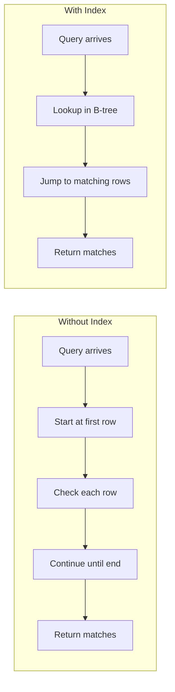
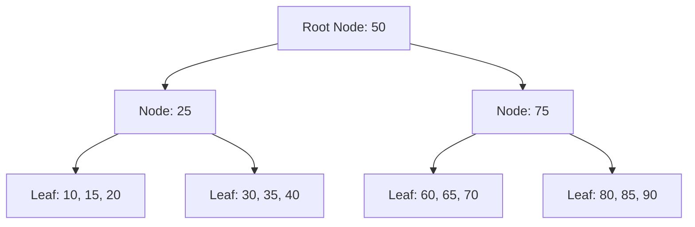
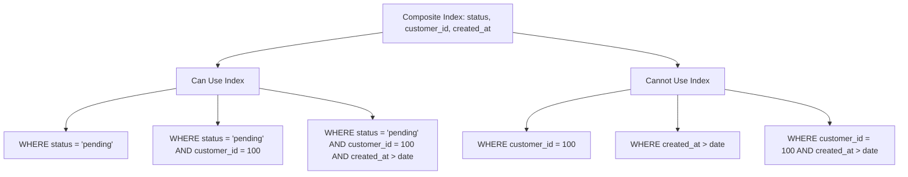
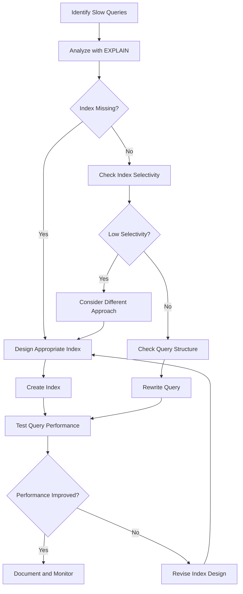

# How to Create Effective Indexes in MySQL

Author: [nawazdhandala](https://www.github.com/nawazdhandala)

Tags: MySQL, Indexing, Performance, Database

Description: A comprehensive guide to creating effective indexes in MySQL, covering B-tree indexes, composite indexes, covering indexes, and practical strategies for optimal query performance.

---

Indexes are the backbone of database performance. A well-designed index can turn a query that takes minutes into one that completes in milliseconds. However, creating effective indexes requires understanding how MySQL uses them, when they help, and when they actually hurt performance. This guide walks through the fundamentals of MySQL indexing and provides practical strategies for designing indexes that make your queries fast.

## What Are Indexes and Why Do They Matter

An index in MySQL is a data structure that allows the database engine to find rows quickly without scanning the entire table. Think of it like a book index that tells you which page contains a specific topic, instead of reading every page to find what you need.

Without an index, MySQL performs a full table scan, examining every row in the table to find matches. On a table with millions of rows, this can take seconds or even minutes. With a proper index, MySQL can locate the matching rows directly, often in milliseconds.

Here is a visual representation of how indexes change query execution:



The difference in performance can be dramatic. A query that scans 10 million rows might take 30 seconds, while the same query using an index might take 5 milliseconds.

## Understanding B-Tree Indexes

MySQL's default storage engine, InnoDB, uses B-tree (balanced tree) indexes. Understanding how B-trees work helps you design better indexes.

A B-tree index stores data in a sorted, hierarchical structure. The tree has a root node at the top, internal nodes in the middle, and leaf nodes at the bottom. Each level narrows down the search space, allowing MySQL to find values quickly.



When MySQL searches for a value, it starts at the root and follows the appropriate branches down to the leaf node containing the data. This logarithmic search means that even with millions of rows, MySQL only needs to examine a handful of nodes.

### B-Tree Index Characteristics

B-tree indexes work well for several types of queries:

- Exact matches: `WHERE id = 100`
- Range queries: `WHERE price BETWEEN 10 AND 50`
- Prefix searches: `WHERE name LIKE 'John%'`
- Sorting: `ORDER BY created_at`

However, B-tree indexes do not help with:

- Suffix searches: `WHERE name LIKE '%son'`
- Full-text searches on large text fields
- Queries that cannot use the leftmost prefix of a composite index

## Creating Your First Index

Let us start with a practical example. Consider an e-commerce database with an orders table:

```sql
-- Create a sample orders table
-- This table stores customer orders with common fields
CREATE TABLE orders (
    id INT AUTO_INCREMENT PRIMARY KEY,
    customer_id INT NOT NULL,
    status ENUM('pending', 'processing', 'shipped', 'delivered', 'cancelled') NOT NULL,
    total_amount DECIMAL(10, 2) NOT NULL,
    created_at TIMESTAMP DEFAULT CURRENT_TIMESTAMP,
    updated_at TIMESTAMP DEFAULT CURRENT_TIMESTAMP ON UPDATE CURRENT_TIMESTAMP
);
```

Now suppose you frequently query orders by customer ID:

```sql
-- This query runs frequently in your application
SELECT * FROM orders WHERE customer_id = 12345;
```

Without an index, MySQL scans every row in the table. Let us check the execution plan:

```sql
-- EXPLAIN shows how MySQL will execute the query
-- Look for type=ALL which indicates a full table scan
EXPLAIN SELECT * FROM orders WHERE customer_id = 12345;
```

The output might show `type: ALL` and a high number in the `rows` column, indicating a full table scan. Now let us add an index:

```sql
-- Create an index on the customer_id column
-- This enables fast lookups by customer ID
CREATE INDEX idx_customer_id ON orders(customer_id);
```

After creating the index, run EXPLAIN again:

```sql
-- Verify the index is being used
-- Now type should be 'ref' and rows should be much lower
EXPLAIN SELECT * FROM orders WHERE customer_id = 12345;
```

Now you should see `type: ref` (or `eq_ref` for unique indexes) and a much smaller number in the `rows` column. The `key` column should show `idx_customer_id`, confirming the index is being used.

## Composite Indexes: Indexing Multiple Columns

Real-world queries often filter on multiple columns. For these scenarios, composite indexes (also called multi-column indexes) are more effective than multiple single-column indexes.

### The Leftmost Prefix Rule

The most important concept in composite indexes is the leftmost prefix rule. MySQL can only use a composite index if the query includes conditions on the leftmost columns of the index, in order.

```sql
-- Create a composite index on three columns
-- Column order matters significantly here
CREATE INDEX idx_status_customer_date ON orders(status, customer_id, created_at);
```

This index can be used for the following queries:

```sql
-- Uses the full index (all three columns)
SELECT * FROM orders
WHERE status = 'pending'
AND customer_id = 100
AND created_at > '2025-01-01';

-- Uses the first two columns of the index
SELECT * FROM orders
WHERE status = 'pending'
AND customer_id = 100;

-- Uses only the first column of the index
SELECT * FROM orders
WHERE status = 'pending';
```

However, these queries cannot use the index effectively:

```sql
-- Cannot use the index (skips 'status', the leftmost column)
SELECT * FROM orders
WHERE customer_id = 100;

-- Cannot use the index (skips 'status')
SELECT * FROM orders
WHERE created_at > '2025-01-01';

-- Cannot use the index for customer_id (status is missing)
SELECT * FROM orders
WHERE customer_id = 100
AND created_at > '2025-01-01';
```

Here is a diagram showing which queries can use the composite index:



### Choosing Column Order in Composite Indexes

The order of columns in a composite index affects which queries it can support. Follow these guidelines:

1. Place columns used in equality conditions first
2. Place columns used in range conditions last
3. Consider query frequency when choosing between multiple valid orders

Here is a practical example:

```sql
-- Query pattern: Find pending orders for a customer in a date range
SELECT * FROM orders
WHERE customer_id = 100
AND status = 'pending'
AND created_at BETWEEN '2025-01-01' AND '2025-01-31';
```

For this query, the optimal index order is:

```sql
-- Optimal index: equality columns first, range column last
-- Both customer_id and status use equality, so either can come first
-- created_at uses a range, so it should be last
CREATE INDEX idx_optimal ON orders(customer_id, status, created_at);
```

The range condition on `created_at` stops the index from being used for any columns that would come after it. By placing it last, we maximize the index's effectiveness.

## Covering Indexes: Avoiding Table Lookups

A covering index contains all the columns needed to satisfy a query, eliminating the need to read from the actual table. This can significantly improve performance because MySQL only needs to read the index.

Consider this query that retrieves specific columns:

```sql
-- This query only needs three columns
SELECT customer_id, status, total_amount
FROM orders
WHERE customer_id = 100;
```

With a standard index on `customer_id`, MySQL finds the matching rows in the index, then performs a "table lookup" to retrieve the `status` and `total_amount` columns from the table. This extra step adds overhead.

A covering index includes all needed columns:

```sql
-- Create a covering index that includes all columns in the query
-- Now MySQL can satisfy the entire query from the index alone
CREATE INDEX idx_covering ON orders(customer_id, status, total_amount);
```

When you run EXPLAIN on the query now, look for "Using index" in the Extra column. This indicates MySQL is using a covering index and does not need to access the table.

```sql
-- Check if the covering index is being used
-- Look for 'Using index' in the Extra column
EXPLAIN SELECT customer_id, status, total_amount
FROM orders
WHERE customer_id = 100;
```

### When to Use Covering Indexes

Covering indexes work best for:

- Queries that retrieve a small, fixed set of columns
- Frequently executed queries where performance is critical
- Queries on large tables where table lookups are expensive

However, covering indexes have trade-offs:

- Larger indexes consume more disk space and memory
- More columns mean slower write operations
- Changes to the query might require index modifications

## Index Types for Specific Use Cases

Beyond standard B-tree indexes, MySQL offers specialized index types for specific scenarios.

### Unique Indexes

Unique indexes enforce that all values in the indexed column(s) are distinct. They also provide fast lookups, combining data integrity with performance.

```sql
-- Create a unique index on email to prevent duplicates
-- This also creates an efficient lookup path
CREATE UNIQUE INDEX idx_unique_email ON users(email);

-- Composite unique index (combination must be unique)
CREATE UNIQUE INDEX idx_unique_tenant_username
ON users(tenant_id, username);
```

### Full-Text Indexes

For searching within text content, full-text indexes outperform LIKE queries with leading wildcards.

```sql
-- Create a table with text content
CREATE TABLE articles (
    id INT AUTO_INCREMENT PRIMARY KEY,
    title VARCHAR(255) NOT NULL,
    content TEXT NOT NULL
);

-- Create a full-text index on title and content
CREATE FULLTEXT INDEX idx_fulltext ON articles(title, content);

-- Search using MATCH AGAINST syntax
-- Natural language mode finds relevant results automatically
SELECT * FROM articles
WHERE MATCH(title, content) AGAINST('database performance' IN NATURAL LANGUAGE MODE);

-- Boolean mode allows operators like + (required) and - (excluded)
SELECT * FROM articles
WHERE MATCH(title, content) AGAINST('+mysql -oracle' IN BOOLEAN MODE);
```

### Spatial Indexes

For geographic data, spatial indexes enable efficient location-based queries.

```sql
-- Create a table with a spatial column
CREATE TABLE stores (
    id INT AUTO_INCREMENT PRIMARY KEY,
    name VARCHAR(100) NOT NULL,
    location POINT NOT NULL SRID 4326
);

-- Create a spatial index
CREATE SPATIAL INDEX idx_location ON stores(location);

-- Find stores within a bounding box
SELECT name FROM stores
WHERE MBRContains(
    ST_GeomFromText('POLYGON((...))', 4326),
    location
);
```

### Prefix Indexes

For long string columns, you can index just the first N characters to save space while still improving query performance.

```sql
-- Index the first 20 characters of a URL column
-- This saves space compared to indexing the entire URL
CREATE INDEX idx_url_prefix ON pages(url(20));
```

Choose the prefix length carefully. Too short and the index loses selectivity. Too long and you lose the space savings. Analyze your data to find the optimal length:

```sql
-- Find the optimal prefix length by checking selectivity
-- Higher selectivity means fewer duplicate values
SELECT
    COUNT(DISTINCT LEFT(url, 10)) / COUNT(*) AS sel_10,
    COUNT(DISTINCT LEFT(url, 20)) / COUNT(*) AS sel_20,
    COUNT(DISTINCT LEFT(url, 30)) / COUNT(*) AS sel_30,
    COUNT(DISTINCT url) / COUNT(*) AS sel_full
FROM pages;
```

## Analyzing Index Effectiveness

Creating indexes is only half the work. You must verify they are being used and improving performance.

### Using EXPLAIN and EXPLAIN ANALYZE

The EXPLAIN command shows the query execution plan without running the query:

```sql
-- Basic EXPLAIN shows the planned execution
EXPLAIN SELECT * FROM orders WHERE customer_id = 100;
```

Key columns to examine:

| Column | What It Shows | Good Values |
|--------|---------------|-------------|
| type | Access method | const, eq_ref, ref (avoid ALL) |
| possible_keys | Indexes that could be used | Your expected index |
| key | Index actually used | Your expected index |
| rows | Estimated rows to examine | Low number relative to table size |
| Extra | Additional information | "Using index" for covering indexes |

For actual performance data, use EXPLAIN ANALYZE (MySQL 8.0+):

```sql
-- EXPLAIN ANALYZE runs the query and shows actual times
-- This shows real execution time, not estimates
EXPLAIN ANALYZE
SELECT * FROM orders
WHERE customer_id = 100
AND status = 'pending';
```

### Identifying Missing Indexes

The MySQL Performance Schema can help identify queries that would benefit from indexes:

```sql
-- Find queries with full table scans
-- These are candidates for new indexes
SELECT
    DIGEST_TEXT,
    COUNT_STAR AS exec_count,
    SUM_ROWS_EXAMINED AS total_rows_examined,
    SUM_ROWS_EXAMINED / COUNT_STAR AS avg_rows_examined
FROM performance_schema.events_statements_summary_by_digest
WHERE SUM_ROWS_EXAMINED > 1000
ORDER BY SUM_ROWS_EXAMINED DESC
LIMIT 20;
```

### Detecting Unused Indexes

Unused indexes waste space and slow down writes. Identify them with:

```sql
-- Find indexes that have never been used
-- Consider removing these to improve write performance
SELECT
    object_schema,
    object_name,
    index_name
FROM performance_schema.table_io_waits_summary_by_index_usage
WHERE index_name IS NOT NULL
AND count_star = 0
AND object_schema NOT IN ('mysql', 'performance_schema', 'sys')
ORDER BY object_schema, object_name;
```

## Best Practices for Index Design

### Design Indexes for Your Queries

Start by listing your most frequent and most important queries. Design indexes that support these specific patterns rather than trying to anticipate every possible query.

```sql
-- Example: An e-commerce application has these common queries
-- 1. Get orders by customer
-- 2. Get pending orders older than N days
-- 3. Get orders by status and date range

-- Design indexes for each pattern
CREATE INDEX idx_customer ON orders(customer_id);
CREATE INDEX idx_pending_date ON orders(status, created_at)
    WHERE status = 'pending';  -- Partial index in some databases
CREATE INDEX idx_status_date ON orders(status, created_at);
```

### Balance Read and Write Performance

Every index you add slows down INSERT, UPDATE, and DELETE operations. The index must be updated whenever the indexed columns change.


For write-heavy tables, limit the number of indexes. For read-heavy tables with few writes, more indexes are acceptable.

### Avoid Common Mistakes

Several common mistakes reduce index effectiveness:

```sql
-- Mistake 1: Using functions on indexed columns
-- This prevents index usage
SELECT * FROM orders WHERE YEAR(created_at) = 2025;

-- Better: Use a range query
SELECT * FROM orders
WHERE created_at >= '2025-01-01'
AND created_at < '2026-01-01';

-- Mistake 2: Implicit type conversion
-- If customer_id is INT, this query may not use the index
SELECT * FROM orders WHERE customer_id = '100';

-- Better: Use the correct type
SELECT * FROM orders WHERE customer_id = 100;

-- Mistake 3: Using OR across different columns
-- This often cannot use a single index efficiently
SELECT * FROM orders
WHERE customer_id = 100 OR status = 'pending';

-- Better: Use UNION if performance is critical
SELECT * FROM orders WHERE customer_id = 100
UNION
SELECT * FROM orders WHERE status = 'pending';
```

### Index Maintenance

Indexes can become fragmented over time, especially with frequent updates and deletes. Monitor and maintain your indexes:

```sql
-- Check index fragmentation
-- High fragmentation can slow down queries
SELECT
    table_name,
    index_name,
    stat_value AS pages,
    stat_description
FROM mysql.innodb_index_stats
WHERE stat_name = 'size'
AND database_name = 'your_database'
ORDER BY stat_value DESC;

-- Rebuild indexes to reduce fragmentation
ALTER TABLE orders ENGINE = InnoDB;

-- Or optimize a specific table
OPTIMIZE TABLE orders;
```

### Document Your Indexes

Maintain documentation of why each index exists and which queries it supports. This helps when reviewing indexes later:

```sql
-- Good practice: Comment your index creation scripts
-- This index supports the customer order history page
-- Used by: OrderRepository.findByCustomerId()
-- Query: SELECT * FROM orders WHERE customer_id = ? ORDER BY created_at DESC
CREATE INDEX idx_customer_orders ON orders(customer_id, created_at DESC);
```

## Practical Index Design Workflow

Follow this workflow when designing indexes for a new feature or optimizing existing queries:



### Step-by-Step Example

Let us walk through optimizing a real query:

```sql
-- Original slow query: Find recent high-value orders by status
SELECT id, customer_id, total_amount, created_at
FROM orders
WHERE status = 'shipped'
AND total_amount > 500
AND created_at > DATE_SUB(NOW(), INTERVAL 30 DAY)
ORDER BY created_at DESC
LIMIT 100;
```

Step 1: Analyze with EXPLAIN

```sql
EXPLAIN SELECT id, customer_id, total_amount, created_at
FROM orders
WHERE status = 'shipped'
AND total_amount > 500
AND created_at > DATE_SUB(NOW(), INTERVAL 30 DAY)
ORDER BY created_at DESC
LIMIT 100;
```

Step 2: Design the index based on query patterns

```sql
-- Analysis:
-- - status = 'shipped' is an equality condition
-- - total_amount > 500 is a range condition
-- - created_at > ... is a range condition
-- - ORDER BY created_at DESC needs sorting support

-- Optimal index: equality first, then the column used for sorting
-- Range on total_amount is applied after index filtering
CREATE INDEX idx_status_date ON orders(status, created_at DESC);
```

Step 3: Consider a covering index for additional performance

```sql
-- Covering index includes all columns in SELECT
CREATE INDEX idx_status_date_covering
ON orders(status, created_at DESC, id, customer_id, total_amount);
```

Step 4: Verify improvement

```sql
-- Check that the new index is used
EXPLAIN SELECT id, customer_id, total_amount, created_at
FROM orders
WHERE status = 'shipped'
AND total_amount > 500
AND created_at > DATE_SUB(NOW(), INTERVAL 30 DAY)
ORDER BY created_at DESC
LIMIT 100;
```

## Summary

Creating effective indexes in MySQL requires understanding how the database uses them and designing for your specific query patterns. Remember these key principles:

- Use EXPLAIN to understand query execution before and after adding indexes
- Follow the leftmost prefix rule for composite indexes
- Place equality conditions before range conditions in composite indexes
- Consider covering indexes for frequently executed queries
- Balance read performance against write overhead
- Regularly audit and remove unused indexes
- Document why each index exists

Indexes are powerful but not free. Each index consumes storage, uses memory, and slows down writes. The goal is not to have the most indexes, but to have the right indexes for your workload.

---

*Database performance is just one aspect of application reliability. If you are looking to monitor your MySQL databases alongside your application metrics, check out [OneUptime](https://oneuptime.com). It provides observability features that help you track database performance, so you can identify and resolve issues before they impact your users.*
