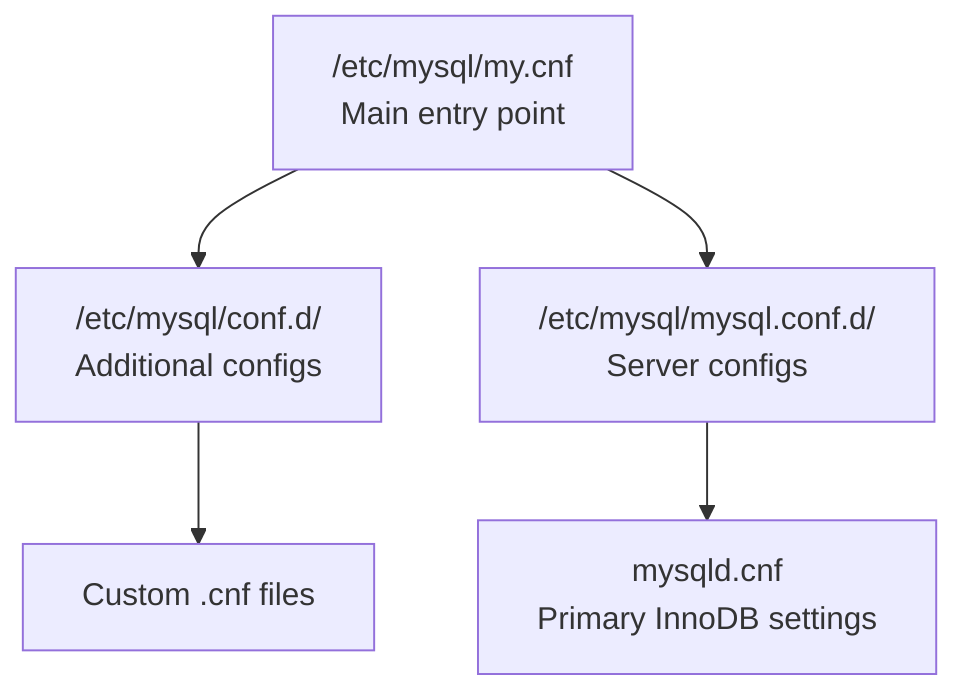
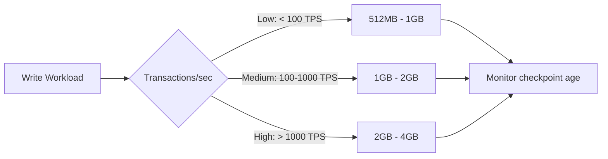
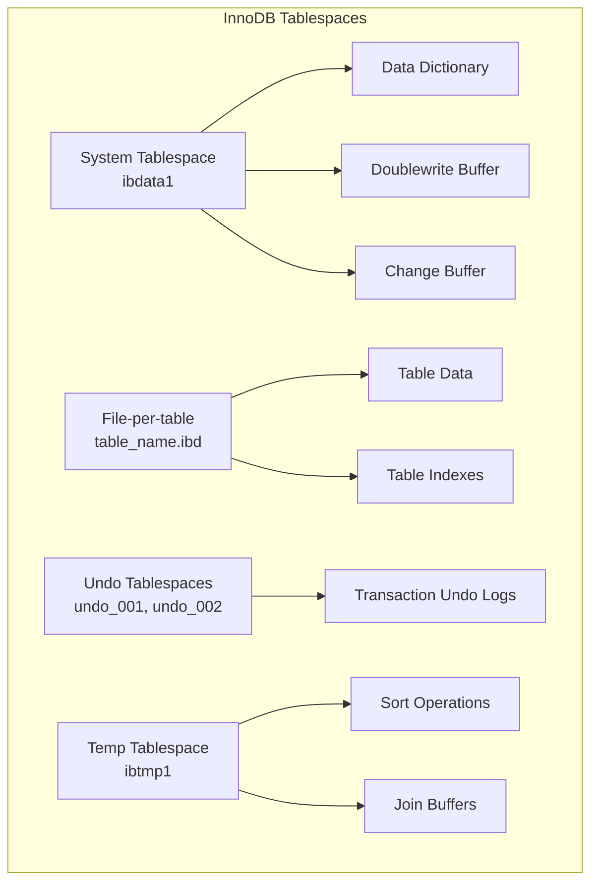
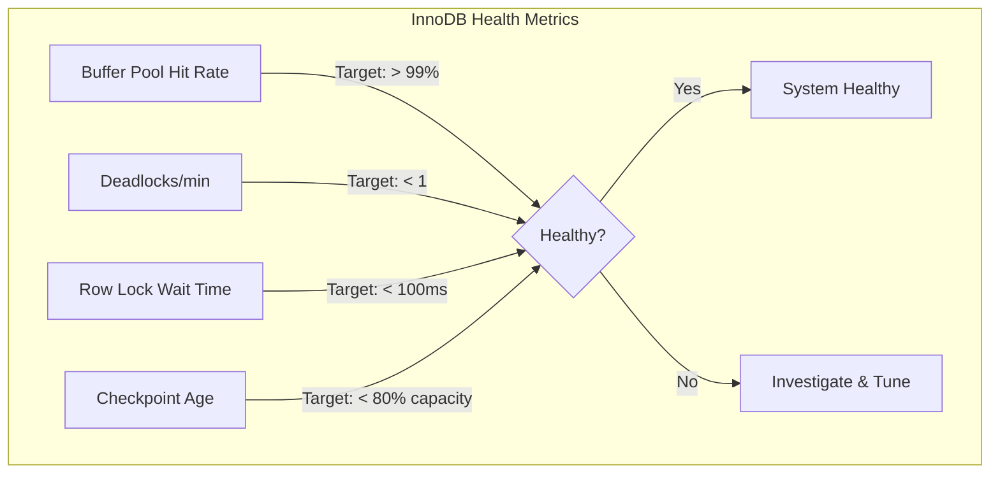

# How to Configure MySQL InnoDB Settings on Ubuntu

Author: [nawazdhandala](https://www.github.com/nawazdhandala)

Tags: MySQL, InnoDB, Ubuntu, Database Configuration, Performance Tuning, Linux

Description: Learn how to configure MySQL InnoDB settings on Ubuntu for optimal performance. This guide covers buffer pool sizing, redo log configuration, I/O settings, memory allocation, and production-ready configurations with step-by-step instructions.

---

> Proper InnoDB configuration is the difference between a database that crawls under load and one that handles thousands of transactions per second. Take the time to tune it right from the start.

MySQL InnoDB is the default and most widely used storage engine for transactional workloads. On Ubuntu servers, getting the InnoDB configuration right is essential for performance, reliability, and scalability. This guide walks through the complete process of configuring InnoDB settings on Ubuntu, from initial installation to production-ready optimization.

## Prerequisites

Before configuring InnoDB settings, ensure you have:

- Ubuntu 20.04 LTS or newer (22.04 or 24.04 recommended)
- MySQL 8.0 or newer installed
- Root or sudo access to the server
- Basic familiarity with MySQL and Linux administration

If MySQL is not installed, you can install it with:

This command installs the MySQL server package on Ubuntu using apt.

```bash
sudo apt update && sudo apt install mysql-server -y
```

## Understanding the MySQL Configuration File

On Ubuntu, the primary MySQL configuration file is located at `/etc/mysql/mysql.conf.d/mysqld.cnf`. Additional configuration can be placed in `/etc/mysql/conf.d/` directory.

This command shows the location and structure of MySQL configuration files on Ubuntu.

```bash
# View the main configuration file location
ls -la /etc/mysql/mysql.conf.d/

# Check all included configuration directories
cat /etc/mysql/my.cnf
```

The configuration hierarchy on Ubuntu:



## 1. Buffer Pool Configuration

The InnoDB buffer pool is the most critical setting for performance. It caches data pages, index pages, and other internal structures in memory.

### Determining Optimal Buffer Pool Size

First, check your server's available memory.

This command displays total and available memory on your Ubuntu server.

```bash
# Check total system memory
free -h

# Get detailed memory info
cat /proc/meminfo | grep -E "MemTotal|MemAvailable|MemFree"
```

**Sizing Guidelines:**

| Server Type | Buffer Pool Size | Example |
|-------------|------------------|---------|
| Dedicated MySQL | 70-80% of RAM | 12GB on 16GB server |
| Shared server | 50-60% of RAM | 4GB on 8GB server |
| Development | 25-50% of RAM | 512MB on 2GB server |

### Configuring Buffer Pool Settings

Create or edit the InnoDB configuration file.

This command opens the MySQL configuration file for editing InnoDB buffer pool settings.

```bash
sudo nano /etc/mysql/mysql.conf.d/mysqld.cnf
```

Add the following buffer pool configuration under the `[mysqld]` section.

These settings configure the InnoDB buffer pool size, instances for parallel access, and chunk size for memory allocation.

```ini
[mysqld]
# Buffer pool size - set to 70-80% of available RAM on dedicated servers
# This example sets 12GB for a server with 16GB RAM
innodb_buffer_pool_size = 12G

# Number of buffer pool instances for improved concurrency
# Use 1 instance per GB of buffer pool, maximum 64
innodb_buffer_pool_instances = 12

# Chunk size for buffer pool resizing (default 128M)
# Buffer pool size must be multiple of chunk_size * instances
innodb_buffer_pool_chunk_size = 128M

# Dump and restore buffer pool state on restart for faster warmup
innodb_buffer_pool_dump_at_shutdown = ON
innodb_buffer_pool_load_at_startup = ON

# Percentage of most recently used pages to dump
innodb_buffer_pool_dump_pct = 40
```

### Verifying Buffer Pool Configuration

After restarting MySQL, verify the settings.

This SQL query checks the current buffer pool configuration and status.

```sql
-- Check buffer pool size configuration
SHOW VARIABLES LIKE 'innodb_buffer_pool%';

-- Monitor buffer pool usage
SELECT
    FORMAT(@@innodb_buffer_pool_size / 1024 / 1024 / 1024, 2) AS buffer_pool_size_gb,
    FORMAT(
        (SELECT VARIABLE_VALUE FROM performance_schema.global_status
         WHERE VARIABLE_NAME = 'Innodb_buffer_pool_pages_data') * 16 / 1024, 2
    ) AS data_pages_mb,
    FORMAT(
        (SELECT VARIABLE_VALUE FROM performance_schema.global_status
         WHERE VARIABLE_NAME = 'Innodb_buffer_pool_pages_free') * 16 / 1024, 2
    ) AS free_pages_mb;
```

## 2. Redo Log Configuration

The redo log (transaction log) ensures durability and affects write performance significantly.

### MySQL 8.0.30+ Configuration

MySQL 8.0.30 introduced a simplified redo log configuration.

These settings configure the redo log capacity and flushing behavior for durability.

```ini
[mysqld]
# Total redo log capacity (MySQL 8.0.30+)
# Size based on write workload - larger for write-heavy systems
innodb_redo_log_capacity = 2G

# Flush behavior - controls durability vs performance trade-off
# 1 = Full ACID compliance (safest, recommended for production)
# 2 = Flush per second (good performance, slight risk)
# 0 = Flush per second without sync (fastest, risk of data loss)
innodb_flush_log_at_trx_commit = 1

# Group commit settings for better throughput
binlog_group_commit_sync_delay = 0
binlog_group_commit_sync_no_delay_count = 0
```

### MySQL 8.0.29 and Earlier

For older MySQL versions, use the legacy configuration.

These settings configure redo log file size and count for MySQL versions before 8.0.30.

```ini
[mysqld]
# Redo log file size (each file)
innodb_log_file_size = 1G

# Number of redo log files in the group
innodb_log_files_in_group = 2

# Flush behavior
innodb_flush_log_at_trx_commit = 1
```

### Redo Log Sizing Guidelines



## 3. I/O Configuration

Proper I/O settings prevent bottlenecks and ensure efficient disk operations.

### Configure I/O Threads and Capacity

These settings control the number of I/O threads and the overall I/O capacity for InnoDB.

```ini
[mysqld]
# Read and write I/O threads
# Default is 4 each, increase for SSD or high-performance storage
innodb_read_io_threads = 8
innodb_write_io_threads = 8

# I/O capacity settings
# Set based on your storage capabilities
# HDD: 200-400, SSD: 2000-10000, NVMe: 10000-40000
innodb_io_capacity = 2000
innodb_io_capacity_max = 4000

# Flush method - O_DIRECT bypasses OS cache (recommended for dedicated servers)
innodb_flush_method = O_DIRECT

# Enable native AIO on Linux for better performance
innodb_use_native_aio = ON
```

### Storage-Specific Recommendations

| Storage Type | io_capacity | io_capacity_max | read/write threads |
|--------------|-------------|-----------------|-------------------|
| HDD (7200 RPM) | 200 | 400 | 4/4 |
| SSD (SATA) | 2000 | 4000 | 8/8 |
| SSD (NVMe) | 10000 | 20000 | 16/16 |
| Cloud SSD | 1000-5000 | 2000-10000 | 8/8 |

### Verify I/O Configuration

This SQL query displays the current I/O configuration settings.

```sql
-- Check I/O settings
SHOW VARIABLES WHERE Variable_name IN (
    'innodb_read_io_threads',
    'innodb_write_io_threads',
    'innodb_io_capacity',
    'innodb_io_capacity_max',
    'innodb_flush_method',
    'innodb_use_native_aio'
);
```

## 4. Memory and Thread Configuration

Beyond the buffer pool, InnoDB uses additional memory structures that need tuning.

### Memory Settings

These settings configure additional memory allocations for InnoDB operations.

```ini
[mysqld]
# Log buffer size - larger values reduce disk I/O for transactions
innodb_log_buffer_size = 64M

# Sort buffer for building indexes
innodb_sort_buffer_size = 4M

# Online DDL buffer size
innodb_online_alter_log_max_size = 256M

# Change buffer - caches changes to secondary indexes
# Values: none, inserts, deletes, changes, purges, all
innodb_change_buffering = all
innodb_change_buffer_max_size = 25

# Adaptive hash index - automatic hash index for frequently accessed pages
innodb_adaptive_hash_index = ON
innodb_adaptive_hash_index_parts = 8
```

### Thread and Concurrency Settings

These settings control thread concurrency and purge operations.

```ini
[mysqld]
# Thread concurrency (0 = unlimited, let InnoDB manage)
innodb_thread_concurrency = 0

# Purge threads for cleaning up deleted rows and undo logs
innodb_purge_threads = 4

# Page cleaner threads for flushing dirty pages
innodb_page_cleaners = 4

# Spin wait settings for lock acquisition
innodb_spin_wait_delay = 6
innodb_sync_spin_loops = 30
```

## 5. Data File and Tablespace Configuration

Configure how InnoDB manages data files and tablespaces.

### System Tablespace Settings

These settings configure the InnoDB system tablespace and data directory.

```ini
[mysqld]
# Data directory location
datadir = /var/lib/mysql

# System tablespace configuration
# innodb_data_home_dir is relative to datadir if not absolute
innodb_data_file_path = ibdata1:12M:autoextend

# Enable file-per-table (recommended - each table has its own .ibd file)
innodb_file_per_table = ON

# Undo tablespace configuration
innodb_undo_directory = /var/lib/mysql
innodb_undo_tablespaces = 2
innodb_max_undo_log_size = 1G
innodb_undo_log_truncate = ON
```

### Temp Tablespace Settings

These settings configure temporary tablespace for sorting and internal operations.

```ini
[mysqld]
# Temporary tablespace settings
innodb_temp_data_file_path = ibtmp1:12M:autoextend:max:5G

# Session temporary tablespaces (MySQL 8.0+)
innodb_temp_tablespaces_dir = /var/lib/mysql/#innodb_temp/
```

### Tablespace Architecture



## 6. Durability and Recovery Settings

Configure settings that affect crash recovery and data durability.

### Durability Settings

These settings control data durability and the doublewrite buffer for crash safety.

```ini
[mysqld]
# Doublewrite buffer - protects against partial page writes
# Essential for data integrity, slight performance cost
innodb_doublewrite = ON

# Doublewrite buffer location (MySQL 8.0.20+)
innodb_doublewrite_dir = /var/lib/mysql

# Checksums for data integrity verification
innodb_checksum_algorithm = crc32

# Force recovery mode (only use for recovery, not production)
# 0 = normal, 1-6 = increasingly aggressive recovery
# innodb_force_recovery = 0

# Crash recovery behavior
innodb_fast_shutdown = 1
```

### Binary Logging for Point-in-Time Recovery

These settings enable binary logging for replication and point-in-time recovery.

```ini
[mysqld]
# Enable binary logging
log_bin = /var/lib/mysql/mysql-bin
binlog_format = ROW
binlog_row_image = FULL

# Sync binary log to disk
sync_binlog = 1

# Binary log expiration (MySQL 8.0+)
binlog_expire_logs_seconds = 604800
```

## 7. Lock and Transaction Settings

Configure locking behavior and transaction handling.

### Lock Configuration

These settings control lock wait timeouts and deadlock detection.

```ini
[mysqld]
# Lock wait timeout in seconds
innodb_lock_wait_timeout = 50

# Enable deadlock detection
innodb_deadlock_detect = ON

# Print all deadlocks to error log for troubleshooting
innodb_print_all_deadlocks = ON

# Default transaction isolation level
transaction_isolation = REPEATABLE-READ

# Rollback on timeout (default OFF - only rolls back current statement)
innodb_rollback_on_timeout = OFF
```

### Monitor Lock Contention

This SQL query shows current lock waits and blocking transactions.

```sql
-- View current lock waits
SELECT
    r.trx_id AS waiting_trx_id,
    r.trx_mysql_thread_id AS waiting_thread,
    r.trx_query AS waiting_query,
    b.trx_id AS blocking_trx_id,
    b.trx_mysql_thread_id AS blocking_thread,
    b.trx_query AS blocking_query
FROM information_schema.innodb_lock_waits w
JOIN information_schema.innodb_trx b ON b.trx_id = w.blocking_trx_id
JOIN information_schema.innodb_trx r ON r.trx_id = w.requesting_trx_id;

-- Check for long-running transactions
SELECT
    trx_id,
    trx_state,
    trx_started,
    TIMESTAMPDIFF(SECOND, trx_started, NOW()) AS duration_seconds,
    trx_rows_locked,
    trx_rows_modified,
    trx_query
FROM information_schema.innodb_trx
ORDER BY trx_started;
```

## 8. Complete Production Configuration

Here is a complete production-ready InnoDB configuration for a dedicated MySQL server with 16GB RAM.

This comprehensive configuration includes all major InnoDB settings tuned for production use.

```ini
[mysqld]
# ============================================
# InnoDB Production Configuration for Ubuntu
# Server: 16GB RAM, SSD Storage
# ============================================

# === Buffer Pool ===
innodb_buffer_pool_size = 12G
innodb_buffer_pool_instances = 12
innodb_buffer_pool_chunk_size = 128M
innodb_buffer_pool_dump_at_shutdown = ON
innodb_buffer_pool_load_at_startup = ON
innodb_buffer_pool_dump_pct = 40

# === Redo Log (MySQL 8.0.30+) ===
innodb_redo_log_capacity = 2G
innodb_flush_log_at_trx_commit = 1
innodb_log_buffer_size = 64M

# === I/O Settings ===
innodb_read_io_threads = 8
innodb_write_io_threads = 8
innodb_io_capacity = 2000
innodb_io_capacity_max = 4000
innodb_flush_method = O_DIRECT
innodb_use_native_aio = ON

# === Tablespaces ===
innodb_file_per_table = ON
innodb_data_file_path = ibdata1:12M:autoextend
innodb_undo_tablespaces = 2
innodb_max_undo_log_size = 1G
innodb_undo_log_truncate = ON
innodb_temp_data_file_path = ibtmp1:12M:autoextend:max:5G

# === Thread and Concurrency ===
innodb_thread_concurrency = 0
innodb_purge_threads = 4
innodb_page_cleaners = 4

# === Memory ===
innodb_sort_buffer_size = 4M
innodb_online_alter_log_max_size = 256M
innodb_change_buffering = all
innodb_change_buffer_max_size = 25
innodb_adaptive_hash_index = ON
innodb_adaptive_hash_index_parts = 8

# === Durability ===
innodb_doublewrite = ON
innodb_checksum_algorithm = crc32
innodb_fast_shutdown = 1

# === Locking ===
innodb_lock_wait_timeout = 50
innodb_deadlock_detect = ON
innodb_print_all_deadlocks = ON
transaction_isolation = REPEATABLE-READ

# === Binary Logging ===
log_bin = /var/lib/mysql/mysql-bin
binlog_format = ROW
sync_binlog = 1
binlog_expire_logs_seconds = 604800
```

## 9. Applying Configuration Changes

### Restart MySQL to Apply Changes

This command restarts MySQL to apply the new configuration.

```bash
# Check configuration syntax before restart
sudo mysqld --validate-config

# Restart MySQL service
sudo systemctl restart mysql

# Verify MySQL started successfully
sudo systemctl status mysql

# Check error log for any issues
sudo tail -100 /var/log/mysql/error.log
```

### Dynamic Configuration Changes

Some settings can be changed without restart.

These SQL commands show how to change buffer pool size dynamically without restarting MySQL.

```sql
-- Change buffer pool size online (MySQL 5.7+)
SET GLOBAL innodb_buffer_pool_size = 14 * 1024 * 1024 * 1024;

-- Monitor resize progress
SHOW STATUS LIKE 'Innodb_buffer_pool_resize_status';

-- Change I/O capacity dynamically
SET GLOBAL innodb_io_capacity = 3000;
SET GLOBAL innodb_io_capacity_max = 6000;

-- Note: Most settings require restart - check documentation
SHOW VARIABLES LIKE 'innodb%' WHERE Variable_name LIKE '%dynamic%';
```

## 10. Monitoring InnoDB Performance

Set up monitoring to validate your configuration and catch issues early.

### Essential Monitoring Queries

This SQL script creates a view for monitoring key InnoDB metrics.

```sql
-- Buffer pool hit rate (should be > 99% for OLTP)
SELECT
    ROUND(
        (1 - (
            (SELECT VARIABLE_VALUE FROM performance_schema.global_status
             WHERE VARIABLE_NAME = 'Innodb_buffer_pool_reads') /
            (SELECT VARIABLE_VALUE FROM performance_schema.global_status
             WHERE VARIABLE_NAME = 'Innodb_buffer_pool_read_requests')
        )) * 100, 2
    ) AS buffer_pool_hit_rate_pct;

-- InnoDB row operations
SELECT
    VARIABLE_NAME,
    VARIABLE_VALUE
FROM performance_schema.global_status
WHERE VARIABLE_NAME IN (
    'Innodb_rows_read',
    'Innodb_rows_inserted',
    'Innodb_rows_updated',
    'Innodb_rows_deleted',
    'Innodb_deadlocks',
    'Innodb_row_lock_waits',
    'Innodb_row_lock_time_avg'
);

-- Check redo log checkpoint lag
SHOW ENGINE INNODB STATUS\G
```

### Automated Monitoring Script

This bash script monitors InnoDB metrics and logs them for analysis.

```bash
#!/bin/bash
# Save as /usr/local/bin/innodb-monitor.sh

MYSQL_USER="monitor"
MYSQL_PASS="your_password"

mysql -u"$MYSQL_USER" -p"$MYSQL_PASS" -e "
SELECT
    NOW() as timestamp,
    (SELECT VARIABLE_VALUE FROM performance_schema.global_status
     WHERE VARIABLE_NAME = 'Innodb_buffer_pool_read_requests') as read_requests,
    (SELECT VARIABLE_VALUE FROM performance_schema.global_status
     WHERE VARIABLE_NAME = 'Innodb_buffer_pool_reads') as disk_reads,
    (SELECT VARIABLE_VALUE FROM performance_schema.global_status
     WHERE VARIABLE_NAME = 'Innodb_deadlocks') as deadlocks,
    (SELECT VARIABLE_VALUE FROM performance_schema.global_status
     WHERE VARIABLE_NAME = 'Innodb_row_lock_waits') as lock_waits
" >> /var/log/mysql/innodb-metrics.log
```

### Key Metrics Dashboard



## Troubleshooting Common Issues

### Buffer Pool Too Small

Symptoms: Low hit rate, high disk reads

This SQL query helps identify if buffer pool is undersized.

```sql
-- Check if buffer pool is undersized
SELECT
    FORMAT(@@innodb_buffer_pool_size / 1024 / 1024 / 1024, 2) AS current_size_gb,
    (SELECT VARIABLE_VALUE FROM performance_schema.global_status
     WHERE VARIABLE_NAME = 'Innodb_buffer_pool_pages_free') AS free_pages,
    ROUND(
        (1 - (
            (SELECT VARIABLE_VALUE FROM performance_schema.global_status
             WHERE VARIABLE_NAME = 'Innodb_buffer_pool_reads') /
            NULLIF((SELECT VARIABLE_VALUE FROM performance_schema.global_status
             WHERE VARIABLE_NAME = 'Innodb_buffer_pool_read_requests'), 0)
        )) * 100, 2
    ) AS hit_rate_pct;
```

### Redo Log Too Small

Symptoms: Frequent checkpoints, high checkpoint age warnings

This command checks for redo log warnings in the MySQL error log.

```bash
# Check for checkpoint warnings
sudo grep -i "checkpoint" /var/log/mysql/error.log | tail -20
```

### I/O Bottleneck

Symptoms: High I/O wait, slow queries

This command monitors disk I/O performance on the MySQL data directory.

```bash
# Monitor disk I/O
iostat -xz 1 5

# Check I/O wait in MySQL
mysql -e "SHOW ENGINE INNODB STATUS\G" | grep -A 20 "FILE I/O"
```

## Summary

Configuring MySQL InnoDB settings on Ubuntu requires understanding your workload and server resources. The key configuration areas are:

1. **Buffer Pool**: Size to 70-80% of RAM on dedicated servers
2. **Redo Log**: Size based on write workload intensity
3. **I/O Settings**: Match to your storage capabilities
4. **Durability**: Use `innodb_flush_log_at_trx_commit = 1` for production
5. **Monitoring**: Track hit rates, deadlocks, and lock waits continuously

Start with conservative settings, monitor performance metrics, and adjust based on actual workload patterns. Every environment is different, so testing and iteration are essential.

---

For comprehensive MySQL monitoring that alerts you to InnoDB performance issues before they impact users, check out [OneUptime](https://oneuptime.com). OneUptime provides real-time database metrics, intelligent alerting, and seamless integration with your existing observability stack to keep your MySQL servers running at peak performance.
