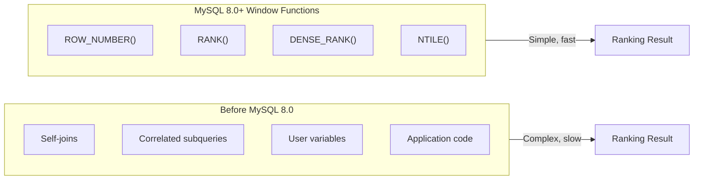

# How to Implement Ranking with MySQL Window Functions

Author: [nawazdhandala](https://github.com/nawazdhandala)

Tags: MySQL, Window Functions, SQL, Analytics

Description: Master MySQL ranking functions including ROW_NUMBER, RANK, DENSE_RANK, and NTILE with practical examples for leaderboards, pagination, top-N queries, and performance optimization.

---

Ranking data is one of the most common requirements in application development. Whether you are building leaderboards, implementing pagination, finding top performers, or calculating percentiles, MySQL window functions provide elegant and efficient solutions. This guide covers all ranking functions with practical examples you can use in production.

## Why Use Window Functions for Ranking?

Before MySQL 8.0, developers had to use complex self-joins, correlated subqueries, or user-defined variables to rank data. These approaches were error-prone and often performed poorly.



Window functions are declarative, readable, and optimized by the query engine. Let me show you how each ranking function works.

## Understanding the Four Ranking Functions

MySQL provides four functions specifically for ranking data. Each behaves differently when handling ties (rows with equal values).

### Sample Data Setup

Before diving into examples, let us create a sample table that we will use throughout this guide.

```sql
-- Create a table for storing player scores in a gaming application
-- This represents a typical leaderboard scenario
CREATE TABLE player_scores (
    id INT AUTO_INCREMENT PRIMARY KEY,
    player_name VARCHAR(100) NOT NULL,
    game_id INT NOT NULL,
    score INT NOT NULL,
    played_at DATETIME DEFAULT CURRENT_TIMESTAMP,
    INDEX idx_game_score (game_id, score DESC)
);

-- Insert sample data with some tied scores to demonstrate ranking behavior
INSERT INTO player_scores (player_name, game_id, score, played_at) VALUES
('Alice', 1, 1500, '2026-02-01 10:00:00'),
('Bob', 1, 1200, '2026-02-01 10:05:00'),
('Carol', 1, 1500, '2026-02-01 10:10:00'),
('Dave', 1, 1100, '2026-02-01 10:15:00'),
('Eve', 1, 1000, '2026-02-01 10:20:00'),
('Frank', 1, 1200, '2026-02-01 10:25:00'),
('Grace', 1, 900, '2026-02-01 10:30:00'),
('Henry', 1, 1500, '2026-02-01 10:35:00'),
('Ivy', 2, 2000, '2026-02-01 11:00:00'),
('Jack', 2, 1800, '2026-02-01 11:05:00'),
('Kate', 2, 1800, '2026-02-01 11:10:00'),
('Leo', 2, 1600, '2026-02-01 11:15:00');
```

### ROW_NUMBER(): Unique Sequential Numbers

ROW_NUMBER assigns a unique integer to each row within the partition, even when values are tied. The assignment is deterministic only if the ORDER BY clause produces a unique ordering.

```sql
-- Assign unique row numbers to each player based on their score
-- When scores are tied, the order depends on which row MySQL processes first
-- Adding a secondary sort column (played_at) ensures consistent results
SELECT
    player_name,
    score,
    ROW_NUMBER() OVER (
        ORDER BY score DESC, played_at ASC
    ) AS row_num
FROM player_scores
WHERE game_id = 1;
```

Result:

| player_name | score | row_num |
|-------------|-------|---------|
| Alice       | 1500  | 1       |
| Carol       | 1500  | 2       |
| Henry       | 1500  | 3       |
| Bob         | 1200  | 4       |
| Frank       | 1200  | 5       |
| Dave        | 1100  | 6       |
| Eve         | 1000  | 7       |
| Grace       | 900   | 8       |

**When to use ROW_NUMBER:**
- Pagination (LIMIT/OFFSET alternative)
- Deduplication (keeping one row from duplicates)
- Generating sequential identifiers
- Any scenario requiring unique numbers

### RANK(): Standard Competition Ranking

RANK assigns the same number to tied rows but leaves gaps in the sequence. This matches traditional competition rankings where two gold medalists mean no silver medal is awarded.

```sql
-- Rank players using competition-style ranking
-- Tied players get the same rank, but the next rank skips numbers
SELECT
    player_name,
    score,
    RANK() OVER (
        ORDER BY score DESC
    ) AS rank_position
FROM player_scores
WHERE game_id = 1;
```

Result:

| player_name | score | rank_position |
|-------------|-------|---------------|
| Alice       | 1500  | 1             |
| Carol       | 1500  | 1             |
| Henry       | 1500  | 1             |
| Bob         | 1200  | 4             |
| Frank       | 1200  | 4             |
| Dave        | 1100  | 6             |
| Eve         | 1000  | 7             |
| Grace       | 900   | 8             |

Notice that ranks 2 and 3 are skipped because three players tied for rank 1, and rank 5 is skipped because two players tied for rank 4.

**When to use RANK:**
- Competition leaderboards
- Academic rankings
- Any scenario where gaps after ties are expected

### DENSE_RANK(): Ranking Without Gaps

DENSE_RANK assigns the same number to tied rows without leaving gaps. The next distinct value always gets the next consecutive rank.

```sql
-- Rank players without leaving gaps after ties
-- Useful when you need to know how many distinct score levels exist
SELECT
    player_name,
    score,
    DENSE_RANK() OVER (
        ORDER BY score DESC
    ) AS dense_rank_position
FROM player_scores
WHERE game_id = 1;
```

Result:

| player_name | score | dense_rank_position |
|-------------|-------|---------------------|
| Alice       | 1500  | 1                   |
| Carol       | 1500  | 1                   |
| Henry       | 1500  | 1                   |
| Bob         | 1200  | 2                   |
| Frank       | 1200  | 2                   |
| Dave        | 1100  | 3                   |
| Eve         | 1000  | 4                   |
| Grace       | 900   | 5                   |

**When to use DENSE_RANK:**
- Tiered pricing (find the 3rd price tier)
- Category rankings where you need consecutive tiers
- Finding the Nth distinct value

### NTILE(): Dividing Data into Buckets

NTILE divides the ordered data into a specified number of approximately equal groups. This is ideal for percentile calculations.

```sql
-- Divide players into quartiles based on score
-- NTILE handles uneven distribution by adding extra rows to earlier groups
SELECT
    player_name,
    score,
    NTILE(4) OVER (
        ORDER BY score DESC
    ) AS quartile
FROM player_scores
WHERE game_id = 1;
```

Result:

| player_name | score | quartile |
|-------------|-------|----------|
| Alice       | 1500  | 1        |
| Carol       | 1500  | 1        |
| Henry       | 1500  | 2        |
| Bob         | 1200  | 2        |
| Frank       | 1200  | 3        |
| Dave        | 1100  | 3        |
| Eve         | 1000  | 4        |
| Grace       | 900   | 4        |

**When to use NTILE:**
- Percentile calculations (top 10%, top 25%)
- Customer segmentation by spending
- Performance tier assignments

## Visual Comparison of Ranking Functions

Understanding how these functions differ is crucial for choosing the right one.

```mermaid
flowchart TB
    subgraph Data["Scores: 100, 90, 90, 80, 70"]
        D1["Player A: 100"]
        D2["Player B: 90"]
        D3["Player C: 90"]
        D4["Player D: 80"]
        D5["Player E: 70"]
    end

    subgraph ROW_NUMBER["ROW_NUMBER()"]
        R1["1"]
        R2["2"]
        R3["3"]
        R4["4"]
        R5["5"]
    end

    subgraph RANK["RANK()"]
        K1["1"]
        K2["2"]
        K3["2"]
        K4["4"]
        K5["5"]
    end

    subgraph DENSE_RANK["DENSE_RANK()"]
        DR1["1"]
        DR2["2"]
        DR3["2"]
        DR4["3"]
        DR5["4"]
    end

    subgraph NTILE2["NTILE(2)"]
        N1["1"]
        N2["1"]
        N3["1"]
        N4["2"]
        N5["2"]
    end

    D1 --> R1
    D2 --> R2
    D3 --> R3
    D4 --> R4
    D5 --> R5

    D1 --> K1
    D2 --> K2
    D3 --> K3
    D4 --> K4
    D5 --> K5

    D1 --> DR1
    D2 --> DR2
    D3 --> DR3
    D4 --> DR4
    D5 --> DR5

    D1 --> N1
    D2 --> N2
    D3 --> N3
    D4 --> N4
    D5 --> N5
```



## Using PARTITION BY for Grouped Rankings

The real power of ranking functions comes when combined with PARTITION BY. This allows you to create rankings within groups.

### Rank Players Within Each Game

```sql
-- Rank players separately for each game
-- Each game has its own ranking starting from 1
SELECT
    game_id,
    player_name,
    score,
    RANK() OVER (
        PARTITION BY game_id
        ORDER BY score DESC
    ) AS game_rank
FROM player_scores
ORDER BY game_id, game_rank;
```

Result:

| game_id | player_name | score | game_rank |
|---------|-------------|-------|-----------|
| 1       | Alice       | 1500  | 1         |
| 1       | Carol       | 1500  | 1         |
| 1       | Henry       | 1500  | 1         |
| 1       | Bob         | 1200  | 4         |
| 1       | Frank       | 1200  | 4         |
| 1       | Dave        | 1100  | 6         |
| 1       | Eve         | 1000  | 7         |
| 1       | Grace       | 900   | 8         |
| 2       | Ivy         | 2000  | 1         |
| 2       | Jack        | 1800  | 2         |
| 2       | Kate        | 1800  | 2         |
| 2       | Leo         | 1600  | 4         |

## Practical Use Cases

Let me show you real-world scenarios where ranking functions solve common problems.

### Use Case 1: Building a Leaderboard

Create a comprehensive leaderboard with multiple ranking perspectives.

```sql
-- Build a complete leaderboard with multiple ranking metrics
-- Includes global rank, percentile, and tier information
SELECT
    player_name,
    score,
    -- Competition ranking (with gaps for ties)
    RANK() OVER w AS competition_rank,
    -- Dense ranking (for tier assignment)
    DENSE_RANK() OVER w AS tier,
    -- Percentile (1 = top 10%, 10 = bottom 10%)
    NTILE(10) OVER w AS percentile_bucket,
    -- Calculate percentage from top
    ROUND(
        (ROW_NUMBER() OVER w - 1) * 100.0 /
        (COUNT(*) OVER () - 1),
        1
    ) AS percentile_from_top
FROM player_scores
WHERE game_id = 1
WINDOW w AS (ORDER BY score DESC);
```

### Use Case 2: Pagination with Stable Ordering

Replace LIMIT/OFFSET with window functions for more predictable pagination.

```sql
-- Efficient pagination using ROW_NUMBER
-- Unlike LIMIT/OFFSET, this guarantees stable page assignments
-- even when new data is inserted between page requests
WITH ranked_players AS (
    SELECT
        player_name,
        score,
        played_at,
        ROW_NUMBER() OVER (
            ORDER BY score DESC, played_at ASC
        ) AS row_num
    FROM player_scores
    WHERE game_id = 1
)
SELECT
    player_name,
    score,
    played_at
FROM ranked_players
WHERE row_num BETWEEN 4 AND 6;  -- Page 2 with 3 items per page
```

### Use Case 3: Top N Per Group

Find the top performers in each category without using correlated subqueries.

```sql
-- Get top 2 players for each game
-- This pattern replaces the old GROUP BY with HAVING approach
WITH ranked_by_game AS (
    SELECT
        game_id,
        player_name,
        score,
        ROW_NUMBER() OVER (
            PARTITION BY game_id
            ORDER BY score DESC, played_at ASC
        ) AS rank_in_game
    FROM player_scores
)
SELECT
    game_id,
    player_name,
    score
FROM ranked_by_game
WHERE rank_in_game <= 2
ORDER BY game_id, rank_in_game;
```

### Use Case 4: Deduplication

Keep only the most recent record when duplicates exist.

```sql
-- Create a table with potential duplicates
CREATE TABLE user_events (
    id INT AUTO_INCREMENT PRIMARY KEY,
    user_id INT NOT NULL,
    event_type VARCHAR(50) NOT NULL,
    event_data JSON,
    created_at DATETIME DEFAULT CURRENT_TIMESTAMP
);

-- Insert sample data with duplicates
INSERT INTO user_events (user_id, event_type, event_data, created_at) VALUES
(1, 'login', '{"device": "mobile"}', '2026-02-01 08:00:00'),
(1, 'login', '{"device": "desktop"}', '2026-02-01 09:00:00'),
(1, 'purchase', '{"amount": 50}', '2026-02-01 10:00:00'),
(2, 'login', '{"device": "tablet"}', '2026-02-01 08:30:00'),
(2, 'login', '{"device": "mobile"}', '2026-02-01 11:00:00');

-- Get only the most recent event of each type per user
-- This deduplication pattern is efficient and readable
WITH ranked_events AS (
    SELECT
        user_id,
        event_type,
        event_data,
        created_at,
        ROW_NUMBER() OVER (
            PARTITION BY user_id, event_type
            ORDER BY created_at DESC
        ) AS recency_rank
    FROM user_events
)
SELECT
    user_id,
    event_type,
    event_data,
    created_at
FROM ranked_events
WHERE recency_rank = 1
ORDER BY user_id, event_type;
```

### Use Case 5: Finding the Nth Highest Value

Find specific positions in a ranking without complex subqueries.

```sql
-- Find the 3rd highest score in each game
-- Using DENSE_RANK ensures we get the 3rd distinct score value
WITH ranked_scores AS (
    SELECT
        game_id,
        player_name,
        score,
        DENSE_RANK() OVER (
            PARTITION BY game_id
            ORDER BY score DESC
        ) AS score_rank
    FROM player_scores
)
SELECT
    game_id,
    score AS third_highest_score,
    GROUP_CONCAT(player_name) AS players_with_score
FROM ranked_scores
WHERE score_rank = 3
GROUP BY game_id, score;
```

### Use Case 6: Salary Analysis by Department

Analyze employee compensation relative to their peers.

```sql
-- Create sample employee data
CREATE TABLE employees (
    id INT AUTO_INCREMENT PRIMARY KEY,
    name VARCHAR(100) NOT NULL,
    department VARCHAR(50) NOT NULL,
    salary DECIMAL(10, 2) NOT NULL,
    hire_date DATE NOT NULL
);

INSERT INTO employees (name, department, salary, hire_date) VALUES
('Alice', 'Engineering', 120000, '2020-01-15'),
('Bob', 'Engineering', 110000, '2021-03-20'),
('Carol', 'Engineering', 120000, '2019-06-10'),
('Dave', 'Engineering', 95000, '2023-01-05'),
('Eve', 'Sales', 90000, '2021-02-14'),
('Frank', 'Sales', 85000, '2022-07-01'),
('Grace', 'Sales', 95000, '2020-11-30'),
('Henry', 'Marketing', 80000, '2022-04-15'),
('Ivy', 'Marketing', 75000, '2023-06-01');

-- Comprehensive salary analysis by department
-- Shows how each employee ranks and compares to department metrics
SELECT
    name,
    department,
    salary,
    -- Rank within department
    RANK() OVER (
        PARTITION BY department
        ORDER BY salary DESC
    ) AS dept_salary_rank,
    -- Quartile within department
    NTILE(4) OVER (
        PARTITION BY department
        ORDER BY salary DESC
    ) AS salary_quartile,
    -- Global rank across all departments
    RANK() OVER (
        ORDER BY salary DESC
    ) AS global_salary_rank,
    -- Compare to department average
    ROUND(
        salary - AVG(salary) OVER (PARTITION BY department),
        2
    ) AS diff_from_dept_avg,
    -- Percentage of department max salary
    ROUND(
        salary * 100.0 / MAX(salary) OVER (PARTITION BY department),
        1
    ) AS pct_of_dept_max
FROM employees
ORDER BY department, salary DESC;
```

### Use Case 7: Customer Segmentation

Segment customers into tiers based on their purchasing behavior.

```sql
-- Create sample customer purchase data
CREATE TABLE customer_purchases (
    customer_id INT NOT NULL,
    purchase_amount DECIMAL(10, 2) NOT NULL,
    purchase_date DATE NOT NULL
);

-- Aggregate customer data and segment into tiers
WITH customer_totals AS (
    SELECT
        customer_id,
        SUM(purchase_amount) AS total_spent,
        COUNT(*) AS purchase_count,
        MAX(purchase_date) AS last_purchase
    FROM customer_purchases
    GROUP BY customer_id
),
customer_segments AS (
    SELECT
        customer_id,
        total_spent,
        purchase_count,
        last_purchase,
        -- Divide customers into 5 tiers by spending
        NTILE(5) OVER (ORDER BY total_spent DESC) AS spending_tier,
        -- Rank by purchase frequency
        DENSE_RANK() OVER (ORDER BY purchase_count DESC) AS frequency_rank
    FROM customer_totals
)
SELECT
    customer_id,
    total_spent,
    purchase_count,
    -- Assign meaningful tier labels
    CASE spending_tier
        WHEN 1 THEN 'Platinum'
        WHEN 2 THEN 'Gold'
        WHEN 3 THEN 'Silver'
        WHEN 4 THEN 'Bronze'
        ELSE 'Standard'
    END AS customer_tier,
    spending_tier,
    frequency_rank
FROM customer_segments
ORDER BY spending_tier, total_spent DESC;
```

## Combining Ranking Functions with Other Window Functions

Ranking becomes even more powerful when combined with aggregate and value window functions.

```sql
-- Advanced leaderboard with comprehensive metrics
SELECT
    player_name,
    score,
    played_at,
    -- Ranking
    RANK() OVER w AS rank_position,
    -- Running total of scores
    SUM(score) OVER (
        ORDER BY played_at
        ROWS BETWEEN UNBOUNDED PRECEDING AND CURRENT ROW
    ) AS running_total,
    -- Gap from leader
    MAX(score) OVER () - score AS gap_from_leader,
    -- Gap from previous rank
    score - LAG(score, 1, score) OVER w AS gap_from_previous,
    -- Percentage of top score
    ROUND(score * 100.0 / MAX(score) OVER (), 1) AS pct_of_leader,
    -- Moving average of last 3 scores (by time)
    ROUND(
        AVG(score) OVER (
            ORDER BY played_at
            ROWS BETWEEN 2 PRECEDING AND CURRENT ROW
        ),
        0
    ) AS moving_avg_3
FROM player_scores
WHERE game_id = 1
WINDOW w AS (ORDER BY score DESC)
ORDER BY rank_position;
```

## Performance Optimization

Ranking queries can be expensive on large datasets. Here are strategies to optimize them.

### Index Strategy

Create indexes that match your PARTITION BY and ORDER BY clauses.

```sql
-- For queries partitioned by game_id and ordered by score
-- Create a composite index matching the window specification
CREATE INDEX idx_ranking_game_score
ON player_scores (game_id, score DESC);

-- For time-based queries with player partitioning
CREATE INDEX idx_ranking_player_time
ON player_scores (player_name, played_at DESC);

-- Covering index for frequently accessed columns
-- Includes all columns needed to avoid table lookups
CREATE INDEX idx_ranking_covering
ON player_scores (game_id, score DESC, player_name, played_at);
```

### Use Named Windows for Reusability

When multiple columns use the same window specification, define it once.

```sql
-- Define the window once and reuse it
-- This improves readability and may help the optimizer
SELECT
    player_name,
    score,
    RANK() OVER ranking_window AS rank_position,
    DENSE_RANK() OVER ranking_window AS dense_rank_position,
    NTILE(4) OVER ranking_window AS quartile,
    ROW_NUMBER() OVER ranking_window AS row_num
FROM player_scores
WHERE game_id = 1
WINDOW ranking_window AS (ORDER BY score DESC)
ORDER BY rank_position;
```

### Materialize Results for Repeated Access

For frequently accessed rankings, consider materializing results.

```sql
-- Create a materialized view or summary table for rankings
-- Refresh periodically rather than computing on every request
CREATE TABLE player_rankings AS
SELECT
    game_id,
    player_name,
    score,
    RANK() OVER (
        PARTITION BY game_id
        ORDER BY score DESC
    ) AS rank_position,
    NOW() AS computed_at
FROM player_scores;

-- Add index for fast lookups
CREATE INDEX idx_rankings_game_rank
ON player_rankings (game_id, rank_position);

-- Query the pre-computed rankings
SELECT * FROM player_rankings
WHERE game_id = 1 AND rank_position <= 10;
```

### Limit Data Before Ranking

When you only need top N results, consider limiting data early.

```sql
-- Less efficient: ranks all rows then filters
SELECT * FROM (
    SELECT
        player_name,
        score,
        RANK() OVER (ORDER BY score DESC) AS rank_position
    FROM player_scores
    WHERE game_id = 1
) ranked
WHERE rank_position <= 10;

-- More efficient for simple top-N: use LIMIT
-- Note: this does not handle ties the same way
SELECT player_name, score
FROM player_scores
WHERE game_id = 1
ORDER BY score DESC
LIMIT 10;

-- Best approach when you need proper ranking with ties
-- First filter to candidates, then rank
WITH top_candidates AS (
    SELECT player_name, score
    FROM player_scores
    WHERE game_id = 1
    ORDER BY score DESC
    LIMIT 20  -- Get more than needed to account for ties
)
SELECT
    player_name,
    score,
    RANK() OVER (ORDER BY score DESC) AS rank_position
FROM top_candidates
ORDER BY rank_position
LIMIT 10;
```

## Execution Plan Analysis

Use EXPLAIN to understand how MySQL executes ranking queries.

```sql
-- Analyze the execution plan for a ranking query
EXPLAIN ANALYZE
SELECT
    player_name,
    score,
    RANK() OVER (
        PARTITION BY game_id
        ORDER BY score DESC
    ) AS rank_position
FROM player_scores
WHERE game_id = 1;
```

Look for these indicators in the output:
- **Using index**: Good, the query uses an index
- **Using filesort**: Additional sorting required
- **Using temporary**: Temporary table created for window function

## Common Mistakes and How to Avoid Them

### Mistake 1: Non-deterministic ROW_NUMBER

When using ROW_NUMBER with ties, results can vary between executions.

```sql
-- Problem: order is not deterministic when scores are tied
SELECT
    player_name,
    score,
    ROW_NUMBER() OVER (ORDER BY score DESC) AS row_num
FROM player_scores;

-- Solution: add a tiebreaker column
SELECT
    player_name,
    score,
    ROW_NUMBER() OVER (
        ORDER BY score DESC, id ASC  -- id provides stable ordering
    ) AS row_num
FROM player_scores;
```

### Mistake 2: Confusing RANK and DENSE_RANK

Choosing the wrong function leads to incorrect filtering.

```sql
-- Problem: using RANK to find "top 3 tiers" may return fewer rows than expected
-- With scores 100, 100, 90, 80: ranks are 1, 1, 3, 4
-- WHERE rank <= 3 returns only 3 rows, missing the 80 score

-- Solution: use DENSE_RANK for tier-based filtering
SELECT * FROM (
    SELECT
        player_name,
        score,
        DENSE_RANK() OVER (ORDER BY score DESC) AS tier
    FROM player_scores
) ranked
WHERE tier <= 3;  -- Gets top 3 distinct score values
```

### Mistake 3: Ignoring NULL Handling

Window functions include NULL values by default, which can affect rankings.

```sql
-- NULLs are included in the ranking and typically sort last
SELECT
    player_name,
    score,
    RANK() OVER (ORDER BY score DESC) AS rank_position
FROM player_scores;

-- To exclude NULLs from ranking, filter them out
SELECT
    player_name,
    score,
    RANK() OVER (ORDER BY score DESC) AS rank_position
FROM player_scores
WHERE score IS NOT NULL;

-- Or handle NULLs explicitly with COALESCE
SELECT
    player_name,
    COALESCE(score, 0) AS score,
    RANK() OVER (ORDER BY COALESCE(score, 0) DESC) AS rank_position
FROM player_scores;
```

### Mistake 4: Inefficient Top-N Per Group Queries

Avoid ranking all data when you only need top N per group.

```sql
-- Inefficient: processes all rows before filtering
WITH all_ranked AS (
    SELECT
        game_id,
        player_name,
        score,
        ROW_NUMBER() OVER (
            PARTITION BY game_id
            ORDER BY score DESC
        ) AS rn
    FROM player_scores  -- millions of rows
)
SELECT * FROM all_ranked WHERE rn = 1;

-- Better: use lateral join for large datasets
-- (This approach varies by MySQL version and data characteristics)
SELECT DISTINCT game_id,
    FIRST_VALUE(player_name) OVER (
        PARTITION BY game_id
        ORDER BY score DESC
    ) AS top_player,
    MAX(score) OVER (PARTITION BY game_id) AS top_score
FROM player_scores;
```

## Summary Table: Choosing the Right Ranking Function

| Scenario | Function | Why |
|----------|----------|-----|
| Pagination | ROW_NUMBER | Need unique, sequential numbers |
| Competition leaderboard | RANK | Standard ranking with gaps for ties |
| Tier assignment | DENSE_RANK | Consecutive tiers without gaps |
| Percentile calculation | NTILE | Divides into equal groups |
| Deduplication | ROW_NUMBER | Pick exactly one row per group |
| Top N per group | ROW_NUMBER or RANK | Depends on tie handling needs |
| Customer segmentation | NTILE | Equal-sized segments |
| Finding Nth value | DENSE_RANK | Gets Nth distinct value |

## Best Practices Summary

1. **Always add a tiebreaker** to ROW_NUMBER ORDER BY clauses for deterministic results

2. **Create appropriate indexes** matching your PARTITION BY and ORDER BY columns

3. **Use named windows** when the same window specification appears multiple times

4. **Choose the right function** based on how you want to handle ties

5. **Filter early** when possible to reduce the data set before ranking

6. **Test with EXPLAIN ANALYZE** to verify query performance

7. **Consider materialization** for frequently accessed rankings on large datasets

8. **Handle NULLs explicitly** to avoid unexpected ranking behavior

Ranking with MySQL window functions transforms complex data analysis into simple, readable queries. Master these functions and you will build efficient leaderboards, pagination systems, and analytical reports with confidence.

---

**Related Reading:**

- [MySQL 8.0 Window Functions Documentation](https://dev.mysql.com/doc/refman/8.0/en/window-functions.html)
- [SQL Performance Best Practices](https://use-the-index-luke.com/)
