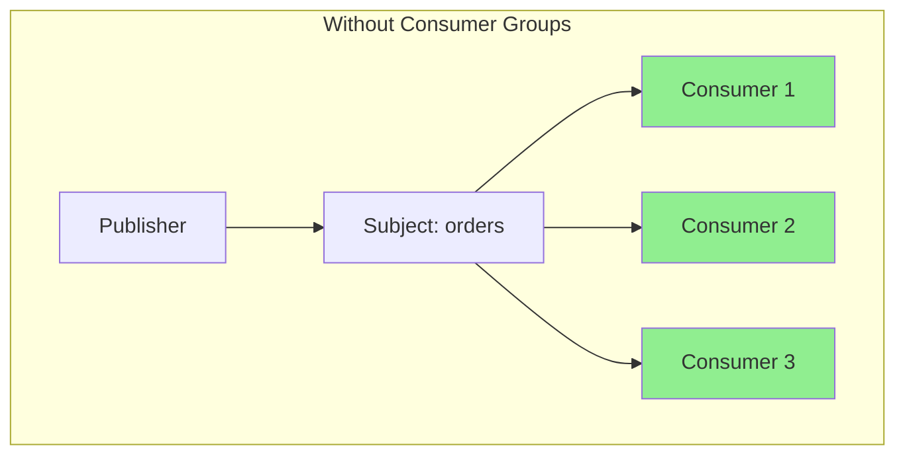
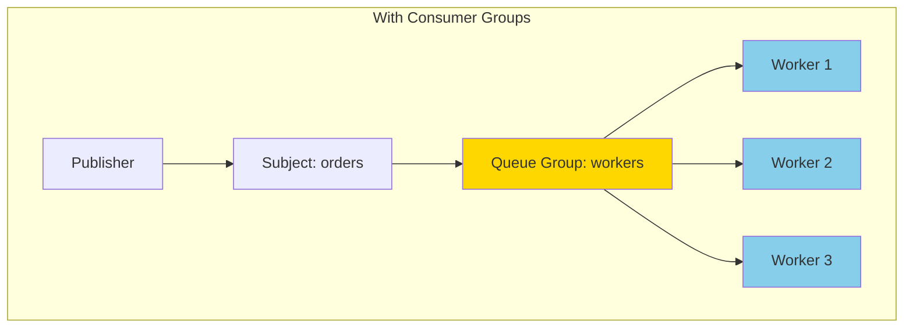
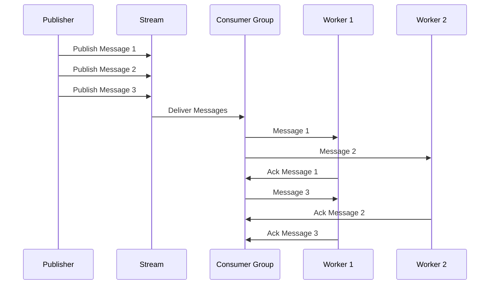
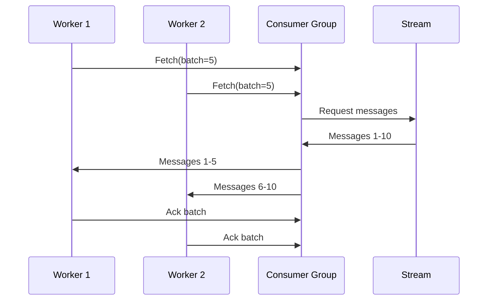
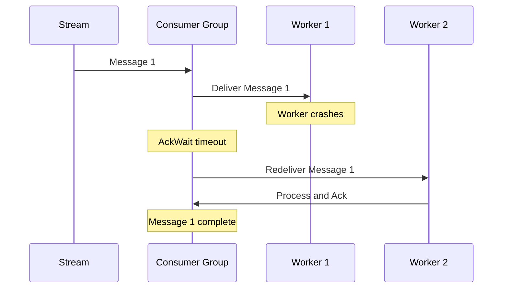
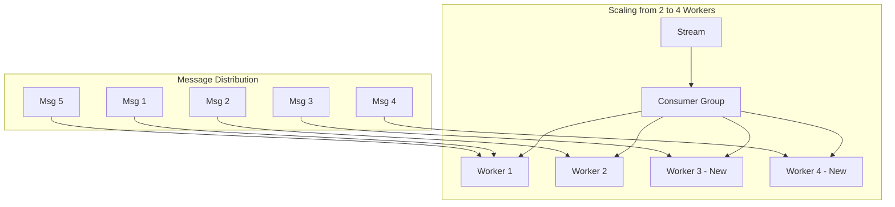

# How to Handle Consumer Groups in NATS

Author: [nawazdhandala](https://www.github.com/nawazdhandala)

Tags: NATS, Consumer Groups, Message Queue, Distributed Systems, Scalability

Description: Learn how to implement and manage consumer groups in NATS for distributed message processing, load balancing, and horizontal scaling of your messaging workloads.

---

> When building distributed systems, processing messages across multiple workers becomes essential for scalability. NATS provides consumer groups (also called queue groups) to distribute workload evenly across multiple subscribers. Each message gets delivered to exactly one member of the group, enabling horizontal scaling without duplicate processing.

Consumer groups solve a fundamental problem: how do you process high message volumes when a single consumer cannot keep up? By adding more workers to the same group, you scale processing capacity linearly while NATS handles the load balancing automatically.

---

## Understanding Consumer Groups

Before implementing consumer groups, let's understand how they work in NATS.



Without consumer groups, every subscriber receives every message. All three consumers process the same message, leading to duplicate work.



With consumer groups, NATS delivers each message to exactly one worker in the group. The load is distributed automatically using a round-robin algorithm.

---

## Basic Consumer Group Implementation

### Core NATS Queue Groups

For core NATS (without JetStream), queue groups provide the simplest form of consumer groups. Multiple subscribers join the same queue group, and NATS distributes messages among them.

```go
package main

import (
    "log"
    "os"
    "os/signal"
    "syscall"
    "time"

    "github.com/nats-io/nats.go"
)

func main() {
    // Connect to NATS server with reconnection options for resilience
    nc, err := nats.Connect(
        nats.DefaultURL,
        nats.RetryOnFailedConnect(true),
        nats.MaxReconnects(-1),
        nats.ReconnectWait(time.Second),
    )
    if err != nil {
        log.Fatal(err)
    }
    defer nc.Close()

    // Get worker ID from environment or use default
    workerID := os.Getenv("WORKER_ID")
    if workerID == "" {
        workerID = "worker-1"
    }

    // QueueSubscribe joins a consumer group
    // Multiple workers with the same queue group name share messages
    // Each message goes to exactly one worker in the group
    sub, err := nc.QueueSubscribe(
        "orders.*",    // Subject pattern to subscribe to
        "order-workers", // Queue group name - all workers share this
        func(msg *nats.Msg) {
            log.Printf("[%s] Received: %s on %s",
                workerID, string(msg.Data), msg.Subject)

            // Simulate processing time
            time.Sleep(100 * time.Millisecond)

            log.Printf("[%s] Processed message", workerID)
        },
    )
    if err != nil {
        log.Fatal(err)
    }
    defer sub.Unsubscribe()

    log.Printf("[%s] Joined queue group 'order-workers' on subject 'orders.*'", workerID)

    // Wait for shutdown signal
    sigChan := make(chan os.Signal, 1)
    signal.Notify(sigChan, syscall.SIGINT, syscall.SIGTERM)
    <-sigChan

    log.Printf("[%s] Shutting down", workerID)
}
```

### Running Multiple Workers

Start multiple instances to see load balancing in action. Each worker receives different messages from the same subject.

```bash
# Terminal 1 - Start first worker
WORKER_ID=worker-1 go run main.go

# Terminal 2 - Start second worker
WORKER_ID=worker-2 go run main.go

# Terminal 3 - Start third worker
WORKER_ID=worker-3 go run main.go

# Terminal 4 - Publish test messages
nats pub orders.created "Order 1" && \
nats pub orders.created "Order 2" && \
nats pub orders.created "Order 3" && \
nats pub orders.updated "Order 4" && \
nats pub orders.shipped "Order 5"
```

Each message appears in only one worker's output, demonstrating the load distribution.

---

## JetStream Consumer Groups

JetStream extends consumer groups with persistence, acknowledgments, and exactly-once delivery. For production workloads, JetStream consumer groups provide the reliability guarantees you need.



### Setting Up JetStream Consumer Groups

First, create a stream to store messages, then create a consumer that workers will use.

```go
package main

import (
    "log"
    "time"

    "github.com/nats-io/nats.go"
)

func setupJetStream(nc *nats.Conn) (nats.JetStreamContext, error) {
    // Get JetStream context from the connection
    js, err := nc.JetStream()
    if err != nil {
        return nil, err
    }

    // Create or update stream configuration
    // Streams store messages persistently
    streamConfig := &nats.StreamConfig{
        Name:     "ORDERS",
        Subjects: []string{"orders.>"},
        Storage:  nats.FileStorage,
        Retention: nats.WorkQueuePolicy, // Delete after acknowledgment
        MaxAge:   24 * time.Hour,
    }

    // AddStream creates the stream if it does not exist
    // UpdateStream modifies existing stream configuration
    _, err = js.AddStream(streamConfig)
    if err != nil {
        // Stream might already exist, try to update
        _, err = js.UpdateStream(streamConfig)
        if err != nil {
            return nil, err
        }
    }

    log.Println("Stream ORDERS ready")
    return js, nil
}

func createConsumerGroup(js nats.JetStreamContext) error {
    // Consumer configuration defines how messages are delivered
    // Durable consumers survive restarts and track their position
    consumerConfig := &nats.ConsumerConfig{
        Durable:       "order-processors",        // Durable name for persistence
        DeliverGroup:  "order-processors",        // Queue group for load balancing
        AckPolicy:     nats.AckExplicitPolicy,    // Require explicit acknowledgment
        AckWait:       30 * time.Second,          // Time before redelivery
        MaxDeliver:    5,                         // Maximum delivery attempts
        FilterSubject: "orders.>",                // Subject filter
        DeliverPolicy: nats.DeliverAllPolicy,     // Start from first message
    }

    _, err := js.AddConsumer("ORDERS", consumerConfig)
    if err != nil {
        return err
    }

    log.Println("Consumer group 'order-processors' created")
    return nil
}
```

### Implementing Workers with JetStream

Each worker joins the same consumer group and processes messages with explicit acknowledgments.

```go
package main

import (
    "encoding/json"
    "log"
    "os"
    "os/signal"
    "syscall"
    "time"

    "github.com/nats-io/nats.go"
)

// Order represents the message payload structure
type Order struct {
    ID        string    `json:"id"`
    Customer  string    `json:"customer"`
    Amount    float64   `json:"amount"`
    Status    string    `json:"status"`
    CreatedAt time.Time `json:"created_at"`
}

func startWorker(js nats.JetStreamContext, workerID string) (*nats.Subscription, error) {
    // QueueSubscribe with JetStream joins a durable consumer group
    // The consumer group name must match the DeliverGroup in consumer config
    sub, err := js.QueueSubscribe(
        "orders.>",           // Subject filter
        "order-processors",   // Queue group name
        func(msg *nats.Msg) {
            // Get message metadata for logging and tracking
            meta, err := msg.Metadata()
            if err != nil {
                log.Printf("[%s] Error getting metadata: %v", workerID, err)
                msg.Nak()
                return
            }

            log.Printf("[%s] Processing message seq=%d, delivered=%d times",
                workerID, meta.Sequence.Stream, meta.NumDelivered)

            // Parse the order from message data
            var order Order
            if err := json.Unmarshal(msg.Data, &order); err != nil {
                log.Printf("[%s] Invalid message format: %v", workerID, err)
                // Acknowledge invalid messages to prevent infinite redelivery
                msg.Ack()
                return
            }

            // Process the order
            if err := processOrder(workerID, order); err != nil {
                log.Printf("[%s] Processing failed: %v", workerID, err)
                // Negative acknowledgment triggers redelivery
                msg.Nak()
                return
            }

            // Successful processing - acknowledge the message
            if err := msg.Ack(); err != nil {
                log.Printf("[%s] Error acknowledging: %v", workerID, err)
            }

            log.Printf("[%s] Order %s processed successfully", workerID, order.ID)
        },
        // Bind to the existing durable consumer
        nats.Bind("ORDERS", "order-processors"),
        nats.ManualAck(),
    )

    if err != nil {
        return nil, err
    }

    log.Printf("[%s] Joined consumer group", workerID)
    return sub, nil
}

func processOrder(workerID string, order Order) error {
    // Simulate order processing with variable duration
    processingTime := time.Duration(100+len(order.ID)*10) * time.Millisecond
    time.Sleep(processingTime)

    log.Printf("[%s] Processed order %s for customer %s, amount: $%.2f",
        workerID, order.ID, order.Customer, order.Amount)

    return nil
}

func main() {
    nc, err := nats.Connect(nats.DefaultURL)
    if err != nil {
        log.Fatal(err)
    }
    defer nc.Close()

    js, err := setupJetStream(nc)
    if err != nil {
        log.Fatal(err)
    }

    if err := createConsumerGroup(js); err != nil {
        log.Printf("Consumer might already exist: %v", err)
    }

    workerID := os.Getenv("WORKER_ID")
    if workerID == "" {
        workerID = "worker-1"
    }

    sub, err := startWorker(js, workerID)
    if err != nil {
        log.Fatal(err)
    }

    // Wait for shutdown signal
    sigChan := make(chan os.Signal, 1)
    signal.Notify(sigChan, syscall.SIGINT, syscall.SIGTERM)
    <-sigChan

    // Graceful shutdown - drain remaining messages
    sub.Drain()
    nc.Drain()

    log.Printf("[%s] Shutdown complete", workerID)
}
```

---

## Pull-Based Consumer Groups

Pull consumers give you more control over message fetching. Workers request batches of messages when ready, rather than receiving a continuous push.



### Implementing Pull Consumer Groups

Pull consumers are ideal for batch processing scenarios where you want precise control over throughput.

```go
package main

import (
    "context"
    "encoding/json"
    "log"
    "os"
    "os/signal"
    "sync"
    "syscall"
    "time"

    "github.com/nats-io/nats.go"
)

func createPullConsumer(js nats.JetStreamContext) error {
    // Pull consumers require explicit fetch calls from workers
    // DeliverGroup enables multiple workers to share the consumer
    consumerConfig := &nats.ConsumerConfig{
        Durable:       "order-batch-processor",
        DeliverGroup:  "order-batch-processor",
        AckPolicy:     nats.AckExplicitPolicy,
        AckWait:       60 * time.Second,
        MaxDeliver:    3,
        FilterSubject: "orders.>",

        // Max outstanding unacknowledged messages per worker
        MaxAckPending: 100,

        // Backoff strategy for redeliveries
        BackOff: []time.Duration{
            5 * time.Second,
            30 * time.Second,
            2 * time.Minute,
        },
    }

    _, err := js.AddConsumer("ORDERS", consumerConfig)
    return err
}

func runPullWorker(ctx context.Context, js nats.JetStreamContext, workerID string, wg *sync.WaitGroup) {
    defer wg.Done()

    // Create pull subscription bound to the consumer
    sub, err := js.PullSubscribe(
        "orders.>",
        "order-batch-processor",
        nats.Bind("ORDERS", "order-batch-processor"),
    )
    if err != nil {
        log.Printf("[%s] Failed to create subscription: %v", workerID, err)
        return
    }

    log.Printf("[%s] Pull worker started", workerID)

    for {
        select {
        case <-ctx.Done():
            log.Printf("[%s] Context cancelled, stopping", workerID)
            return
        default:
            // Fetch a batch of messages
            // MaxWait prevents blocking indefinitely
            msgs, err := sub.Fetch(10, nats.MaxWait(5*time.Second))
            if err != nil {
                if err == nats.ErrTimeout {
                    // No messages available, continue polling
                    continue
                }
                log.Printf("[%s] Fetch error: %v", workerID, err)
                continue
            }

            // Process the batch
            processBatch(workerID, msgs)
        }
    }
}

func processBatch(workerID string, msgs []*nats.Msg) {
    log.Printf("[%s] Processing batch of %d messages", workerID, len(msgs))

    for _, msg := range msgs {
        var order Order
        if err := json.Unmarshal(msg.Data, &order); err != nil {
            log.Printf("[%s] Invalid message: %v", workerID, err)
            msg.Ack() // Acknowledge to prevent redelivery of invalid messages
            continue
        }

        if err := processOrder(workerID, order); err != nil {
            log.Printf("[%s] Processing failed for %s: %v", workerID, order.ID, err)
            msg.Nak()
            continue
        }

        msg.Ack()
    }

    log.Printf("[%s] Batch complete", workerID)
}

func main() {
    nc, err := nats.Connect(nats.DefaultURL)
    if err != nil {
        log.Fatal(err)
    }
    defer nc.Close()

    js, err := nc.JetStream()
    if err != nil {
        log.Fatal(err)
    }

    // Setup stream and consumer
    createPullConsumer(js)

    ctx, cancel := context.WithCancel(context.Background())
    var wg sync.WaitGroup

    // Start multiple pull workers in the same process
    numWorkers := 3
    for i := 1; i <= numWorkers; i++ {
        wg.Add(1)
        go runPullWorker(ctx, js, fmt.Sprintf("worker-%d", i), &wg)
    }

    // Wait for shutdown signal
    sigChan := make(chan os.Signal, 1)
    signal.Notify(sigChan, syscall.SIGINT, syscall.SIGTERM)
    <-sigChan

    log.Println("Shutting down workers...")
    cancel()
    wg.Wait()

    nc.Drain()
    log.Println("Shutdown complete")
}
```

---

## Node.js Implementation

Consumer groups work similarly in Node.js. Here is a complete implementation using the official NATS client.

```javascript
// worker.js
const { connect, StringCodec, AckPolicy, DeliverPolicy } = require('nats');

const sc = StringCodec();

async function setupStream(js) {
    // Create or update the stream for order messages
    const streamConfig = {
        name: 'ORDERS',
        subjects: ['orders.>'],
        retention: 'workqueue', // Delete after acknowledgment
        max_age: 24 * 60 * 60 * 1000000000, // 24 hours in nanoseconds
    };

    try {
        await js.streams.add(streamConfig);
        console.log('Stream ORDERS created');
    } catch (err) {
        if (err.code !== '400') { // Stream already exists
            throw err;
        }
        console.log('Stream ORDERS already exists');
    }
}

async function createConsumer(js) {
    // Consumer configuration with queue group for load balancing
    const consumerConfig = {
        durable_name: 'order-processors',
        deliver_group: 'order-processors', // Queue group name
        ack_policy: AckPolicy.Explicit,
        ack_wait: 30 * 1000000000, // 30 seconds in nanoseconds
        max_deliver: 5,
        filter_subject: 'orders.>',
    };

    try {
        await js.consumers.add('ORDERS', consumerConfig);
        console.log('Consumer group created');
    } catch (err) {
        console.log('Consumer might already exist:', err.message);
    }
}

async function processOrder(workerID, order) {
    // Simulate processing time
    await new Promise(resolve => setTimeout(resolve, 100));
    console.log(`[${workerID}] Processed order ${order.id} for ${order.customer}`);
}

async function startWorker(nc, workerID) {
    const js = nc.jetstream();

    await setupStream(js);
    await createConsumer(js);

    // Get consumer for pull-based consumption
    const consumer = await js.consumers.get('ORDERS', 'order-processors');

    console.log(`[${workerID}] Worker started, waiting for messages...`);

    // Consume messages in a loop
    const messages = await consumer.consume();

    for await (const msg of messages) {
        try {
            const order = JSON.parse(sc.decode(msg.data));
            console.log(`[${workerID}] Received order ${order.id}`);

            await processOrder(workerID, order);

            // Acknowledge successful processing
            msg.ack();
        } catch (err) {
            console.error(`[${workerID}] Error processing message:`, err);
            // Negative acknowledgment for redelivery
            msg.nak();
        }
    }
}

async function main() {
    const nc = await connect({ servers: 'localhost:4222' });
    console.log('Connected to NATS');

    const workerID = process.env.WORKER_ID || 'worker-1';

    // Handle graceful shutdown
    process.on('SIGINT', async () => {
        console.log(`[${workerID}] Shutting down...`);
        await nc.drain();
        process.exit(0);
    });

    await startWorker(nc, workerID);
}

main().catch(console.error);
```

Run multiple Node.js workers to distribute the load.

```bash
# Terminal 1
WORKER_ID=node-worker-1 node worker.js

# Terminal 2
WORKER_ID=node-worker-2 node worker.js

# Terminal 3
WORKER_ID=node-worker-3 node worker.js
```

---

## Python Implementation

Python applications can also leverage NATS consumer groups using the nats-py library.

```python
# worker.py
import asyncio
import json
import os
import signal
from nats.aio.client import Client as NATS
from nats.js.api import ConsumerConfig, AckPolicy, DeliverPolicy, StreamConfig

async def setup_stream(js):
    """Create or update the orders stream."""
    stream_config = StreamConfig(
        name="ORDERS",
        subjects=["orders.>"],
        retention="workqueue",
    )

    try:
        await js.add_stream(stream_config)
        print("Stream ORDERS created")
    except Exception as e:
        print(f"Stream might exist: {e}")

async def create_consumer(js):
    """Create consumer group for distributed processing."""
    consumer_config = ConsumerConfig(
        durable_name="order-processors",
        deliver_group="order-processors",  # Queue group for load balancing
        ack_policy=AckPolicy.EXPLICIT,
        ack_wait=30,  # seconds
        max_deliver=5,
        filter_subject="orders.>",
    )

    try:
        await js.add_consumer("ORDERS", consumer_config)
        print("Consumer group created")
    except Exception as e:
        print(f"Consumer might exist: {e}")

async def process_order(worker_id: str, order: dict):
    """Process an individual order."""
    # Simulate processing time
    await asyncio.sleep(0.1)
    print(f"[{worker_id}] Processed order {order['id']} for {order['customer']}")

async def start_worker(nc: NATS, worker_id: str):
    """Start a worker that consumes from the consumer group."""
    js = nc.jetstream()

    await setup_stream(js)
    await create_consumer(js)

    # Subscribe to the consumer group
    # Multiple workers with the same queue name share messages
    psub = await js.pull_subscribe(
        "orders.>",
        durable="order-processors",
        stream="ORDERS",
    )

    print(f"[{worker_id}] Worker started, waiting for messages...")

    while True:
        try:
            # Fetch batch of messages
            msgs = await psub.fetch(batch=10, timeout=5)

            for msg in msgs:
                try:
                    order = json.loads(msg.data.decode())
                    print(f"[{worker_id}] Received order {order['id']}")

                    await process_order(worker_id, order)

                    # Acknowledge successful processing
                    await msg.ack()

                except json.JSONDecodeError:
                    print(f"[{worker_id}] Invalid message format")
                    await msg.ack()  # Prevent redelivery of invalid messages

                except Exception as e:
                    print(f"[{worker_id}] Processing error: {e}")
                    await msg.nak()  # Trigger redelivery

        except asyncio.TimeoutError:
            # No messages available, continue polling
            continue
        except Exception as e:
            print(f"[{worker_id}] Fetch error: {e}")
            await asyncio.sleep(1)

async def main():
    nc = NATS()
    await nc.connect("nats://localhost:4222")
    print("Connected to NATS")

    worker_id = os.environ.get("WORKER_ID", "worker-1")

    # Handle graceful shutdown
    loop = asyncio.get_event_loop()

    async def shutdown():
        print(f"[{worker_id}] Shutting down...")
        await nc.drain()

    for sig in (signal.SIGINT, signal.SIGTERM):
        loop.add_signal_handler(sig, lambda: asyncio.create_task(shutdown()))

    await start_worker(nc, worker_id)

if __name__ == "__main__":
    asyncio.run(main())
```

---

## Handling Failures and Redelivery

Consumer groups must handle failures gracefully. When a worker crashes or fails to acknowledge a message, NATS redelivers it to another worker in the group.



### Implementing Retry Logic with Backoff

Configure exponential backoff for failed message processing to prevent overwhelming downstream services.

```go
package main

import (
    "encoding/json"
    "errors"
    "log"
    "time"

    "github.com/nats-io/nats.go"
)

// ErrRetryable indicates the error is temporary and retryable
var ErrRetryable = errors.New("retryable error")

// ErrPermanent indicates the error is permanent and should not retry
var ErrPermanent = errors.New("permanent error")

func createConsumerWithBackoff(js nats.JetStreamContext) error {
    // Configure backoff strategy for redeliveries
    // Each delivery attempt waits progressively longer
    consumerConfig := &nats.ConsumerConfig{
        Durable:       "order-processor-resilient",
        DeliverGroup:  "order-processor-resilient",
        AckPolicy:     nats.AckExplicitPolicy,
        AckWait:       30 * time.Second,
        MaxDeliver:    5,
        FilterSubject: "orders.>",

        // Exponential backoff between redeliveries
        BackOff: []time.Duration{
            1 * time.Second,   // First retry after 1 second
            5 * time.Second,   // Second retry after 5 seconds
            30 * time.Second,  // Third retry after 30 seconds
            2 * time.Minute,   // Fourth retry after 2 minutes
        },
    }

    _, err := js.AddConsumer("ORDERS", consumerConfig)
    return err
}

func processWithRetry(msg *nats.Msg, workerID string) {
    meta, _ := msg.Metadata()

    log.Printf("[%s] Processing attempt %d of %d",
        workerID, meta.NumDelivered, 5)

    var order Order
    if err := json.Unmarshal(msg.Data, &order); err != nil {
        // Invalid JSON is a permanent error
        log.Printf("[%s] Invalid message, acknowledging to prevent retry", workerID)
        msg.Ack()
        return
    }

    err := processOrderWithErrors(order)

    if err == nil {
        log.Printf("[%s] Order %s processed successfully", workerID, order.ID)
        msg.Ack()
        return
    }

    if errors.Is(err, ErrPermanent) {
        // Permanent errors should not retry
        log.Printf("[%s] Permanent error for order %s: %v", workerID, order.ID, err)
        // Send to dead letter queue before acknowledging
        sendToDeadLetterQueue(msg, err.Error())
        msg.Ack()
        return
    }

    // Retryable error
    if meta.NumDelivered >= 5 {
        log.Printf("[%s] Max retries exceeded for order %s", workerID, order.ID)
        sendToDeadLetterQueue(msg, "max retries exceeded")
        msg.Ack()
        return
    }

    log.Printf("[%s] Retryable error, will retry: %v", workerID, err)
    msg.Nak() // Trigger redelivery with backoff
}

func processOrderWithErrors(order Order) error {
    // Simulate different error scenarios based on order ID
    switch {
    case order.Amount < 0:
        return fmt.Errorf("%w: negative amount", ErrPermanent)
    case order.Customer == "":
        return fmt.Errorf("%w: missing customer", ErrPermanent)
    case order.Amount > 10000:
        // High value orders might fail temporarily due to fraud check
        return fmt.Errorf("%w: fraud check timeout", ErrRetryable)
    default:
        return nil
    }
}

func sendToDeadLetterQueue(msg *nats.Msg, reason string) {
    // Implementation would publish to a DLQ stream
    log.Printf("Sending message to DLQ: %s", reason)
}
```

---

## Scaling Consumer Groups

### Horizontal Scaling

Add more workers to increase throughput. NATS automatically distributes work among all group members.



### Auto-Scaling with Kubernetes

Deploy workers as a Kubernetes Deployment and scale based on consumer lag.

```yaml
# deployment.yaml
apiVersion: apps/v1
kind: Deployment
metadata:
  name: order-processor
  labels:
    app: order-processor
spec:
  replicas: 3
  selector:
    matchLabels:
      app: order-processor
  template:
    metadata:
      labels:
        app: order-processor
    spec:
      containers:
        - name: worker
          image: myregistry/order-processor:latest
          env:
            - name: WORKER_ID
              valueFrom:
                fieldRef:
                  fieldPath: metadata.name
            - name: NATS_URL
              value: "nats://nats:4222"
          resources:
            requests:
              cpu: "100m"
              memory: "128Mi"
            limits:
              cpu: "500m"
              memory: "256Mi"
---
# Horizontal Pod Autoscaler based on custom metrics
apiVersion: autoscaling/v2
kind: HorizontalPodAutoscaler
metadata:
  name: order-processor-hpa
spec:
  scaleTargetRef:
    apiVersion: apps/v1
    kind: Deployment
    name: order-processor
  minReplicas: 2
  maxReplicas: 10
  metrics:
    # Scale based on consumer pending messages
    - type: External
      external:
        metric:
          name: nats_consumer_pending_messages
          selector:
            matchLabels:
              consumer: order-processors
              stream: ORDERS
        target:
          type: AverageValue
          averageValue: "100"
```

---

## Monitoring Consumer Groups

Track consumer group health with these key metrics.

```go
package main

import (
    "log"
    "time"

    "github.com/nats-io/nats.go"
    "github.com/prometheus/client_golang/prometheus"
)

var (
    // Gauge for pending messages across all consumers
    consumerPending = prometheus.NewGaugeVec(
        prometheus.GaugeOpts{
            Name: "nats_consumer_pending_messages",
            Help: "Number of pending messages for consumer",
        },
        []string{"stream", "consumer"},
    )

    // Gauge for messages waiting to be acknowledged
    consumerAckPending = prometheus.NewGaugeVec(
        prometheus.GaugeOpts{
            Name: "nats_consumer_ack_pending",
            Help: "Messages delivered but not yet acknowledged",
        },
        []string{"stream", "consumer"},
    )

    // Counter for redelivered messages
    consumerRedelivered = prometheus.NewCounterVec(
        prometheus.CounterOpts{
            Name: "nats_consumer_redelivered_total",
            Help: "Total redelivered messages",
        },
        []string{"stream", "consumer"},
    )
)

func init() {
    prometheus.MustRegister(consumerPending, consumerAckPending, consumerRedelivered)
}

func monitorConsumerGroup(js nats.JetStreamContext, stream, consumer string) {
    ticker := time.NewTicker(10 * time.Second)
    defer ticker.Stop()

    var lastRedelivered uint64

    for range ticker.C {
        info, err := js.ConsumerInfo(stream, consumer)
        if err != nil {
            log.Printf("Error getting consumer info: %v", err)
            continue
        }

        // Update metrics
        consumerPending.WithLabelValues(stream, consumer).
            Set(float64(info.NumPending))

        consumerAckPending.WithLabelValues(stream, consumer).
            Set(float64(info.NumAckPending))

        // Track redelivered delta
        if info.NumRedelivered > lastRedelivered {
            delta := info.NumRedelivered - lastRedelivered
            consumerRedelivered.WithLabelValues(stream, consumer).
                Add(float64(delta))
            lastRedelivered = info.NumRedelivered
        }

        log.Printf("Consumer %s: pending=%d, ackPending=%d, redelivered=%d",
            consumer, info.NumPending, info.NumAckPending, info.NumRedelivered)
    }
}
```

### Key Metrics to Monitor

| Metric | Description | Alert Threshold |
|--------|-------------|-----------------|
| `pending_messages` | Messages waiting to be delivered | > 1000 for 5 minutes |
| `ack_pending` | Delivered but unacknowledged messages | > 500 for 5 minutes |
| `redelivered` | Messages that required redelivery | > 10% of total |
| `consumer_count` | Active workers in the group | < minimum workers |

---

## Best Practices

### 1. Use Meaningful Consumer Names

Choose descriptive names that indicate the purpose and environment.

```go
// Good - descriptive and includes environment
consumerConfig := &nats.ConsumerConfig{
    Durable:      "prod-order-payment-processor",
    DeliverGroup: "prod-order-payment-processor",
}

// Bad - generic and unclear
consumerConfig := &nats.ConsumerConfig{
    Durable:      "consumer1",
    DeliverGroup: "consumer1",
}
```

### 2. Set Appropriate AckWait Times

Configure AckWait based on your processing time with buffer for variability.

```go
// Measure p99 processing time and add buffer
// If p99 is 5 seconds, set AckWait to 15-30 seconds
consumerConfig := &nats.ConsumerConfig{
    AckWait: 30 * time.Second, // 6x the expected processing time
}
```

### 3. Implement Idempotent Processing

Design message handlers to safely process the same message multiple times.

```go
func processIdempotent(db *sql.DB, order Order) error {
    // Use database transaction with unique constraint
    tx, err := db.Begin()
    if err != nil {
        return err
    }
    defer tx.Rollback()

    // Check if already processed using message ID
    var exists bool
    err = tx.QueryRow(
        "SELECT EXISTS(SELECT 1 FROM processed_orders WHERE id = $1)",
        order.ID,
    ).Scan(&exists)
    if err != nil {
        return err
    }

    if exists {
        // Already processed - safe to acknowledge
        return nil
    }

    // Process the order
    _, err = tx.Exec(
        "INSERT INTO orders (id, customer, amount) VALUES ($1, $2, $3)",
        order.ID, order.Customer, order.Amount,
    )
    if err != nil {
        return err
    }

    // Mark as processed
    _, err = tx.Exec(
        "INSERT INTO processed_orders (id, processed_at) VALUES ($1, NOW())",
        order.ID,
    )
    if err != nil {
        return err
    }

    return tx.Commit()
}
```

### 4. Handle Graceful Shutdown

Drain connections before shutdown to process in-flight messages.

```go
func gracefulShutdown(nc *nats.Conn, sub *nats.Subscription) {
    sigChan := make(chan os.Signal, 1)
    signal.Notify(sigChan, syscall.SIGINT, syscall.SIGTERM)
    <-sigChan

    log.Println("Initiating graceful shutdown...")

    // Stop receiving new messages but process existing ones
    if err := sub.Drain(); err != nil {
        log.Printf("Error draining subscription: %v", err)
    }

    // Wait for in-flight messages to complete
    if err := nc.Drain(); err != nil {
        log.Printf("Error draining connection: %v", err)
    }

    log.Println("Shutdown complete")
}
```

---

## Conclusion

Consumer groups in NATS provide a powerful mechanism for distributing message processing across multiple workers. Key takeaways include:

- **Queue groups** in core NATS offer simple load balancing without persistence
- **JetStream consumer groups** add durability, acknowledgments, and exactly-once delivery
- **Pull consumers** give precise control over message fetching and batch processing
- **Backoff strategies** prevent cascading failures during transient errors
- **Monitoring** consumer lag and redelivery rates helps maintain system health

Start with simple queue groups for basic use cases, and graduate to JetStream consumer groups when you need persistence and delivery guarantees. The patterns shown here scale from handling hundreds to millions of messages per second.

---

*Need to monitor your NATS consumer groups? [OneUptime](https://oneuptime.com) provides comprehensive monitoring for message queues with consumer lag tracking, alerting on processing delays, and visualization of message throughput across your distributed systems.*
