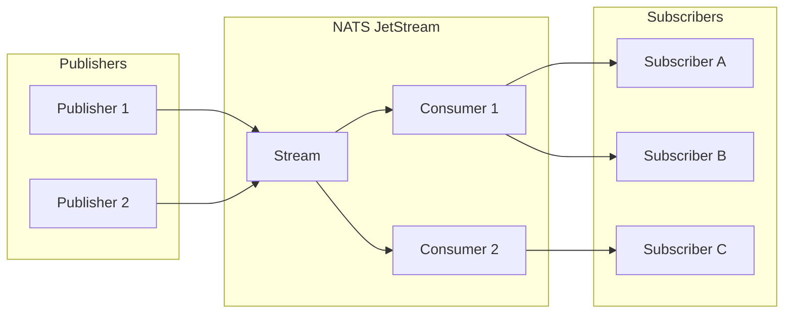
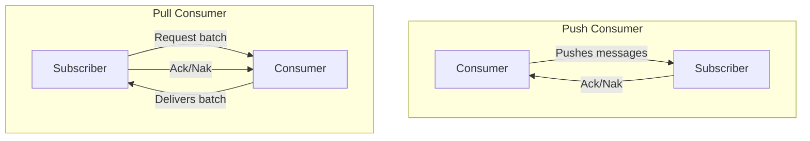
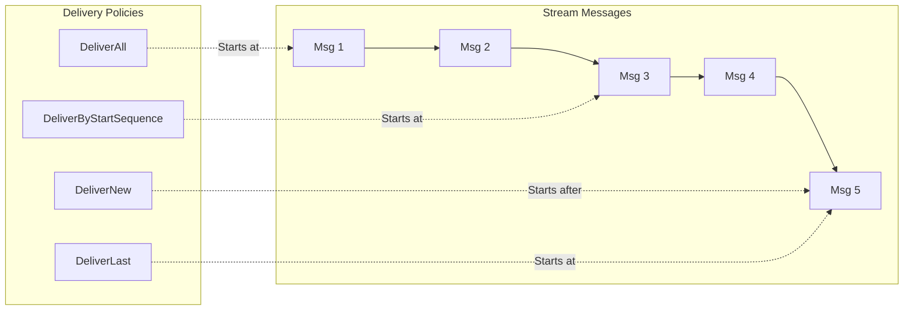
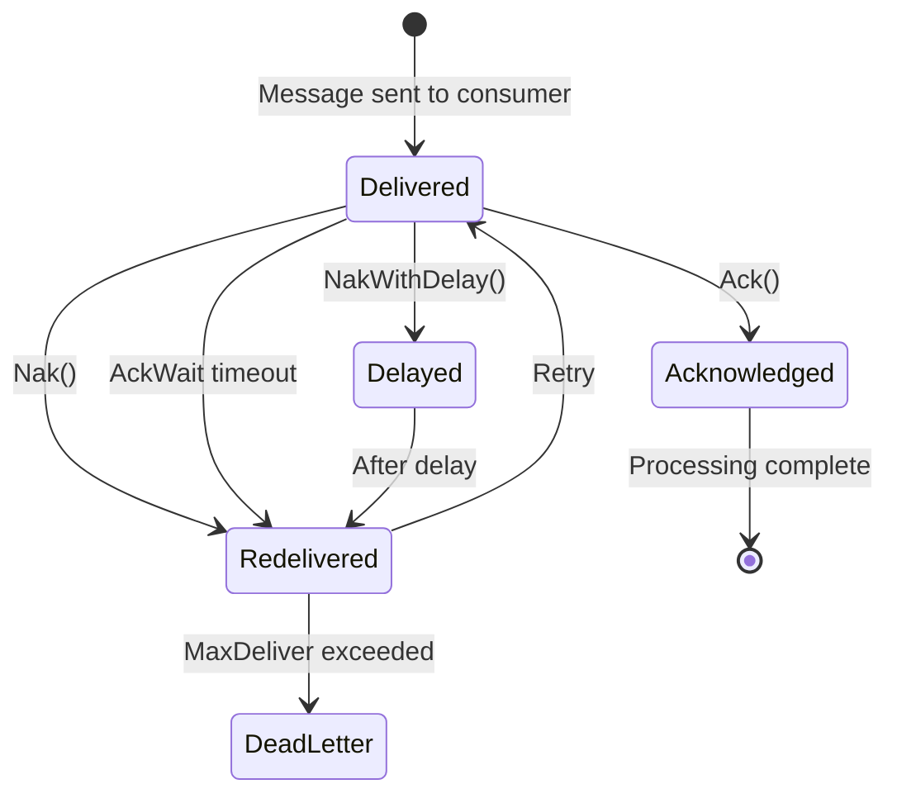
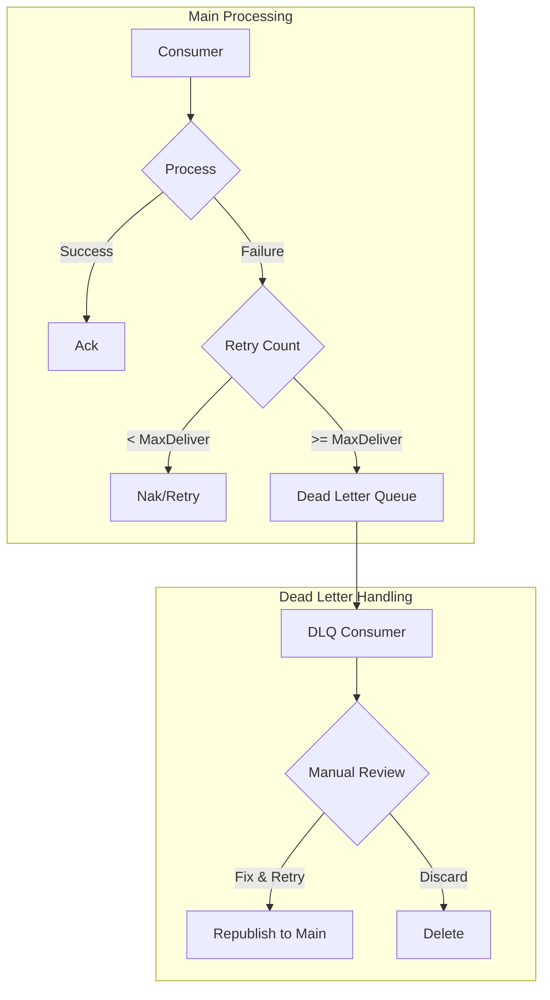
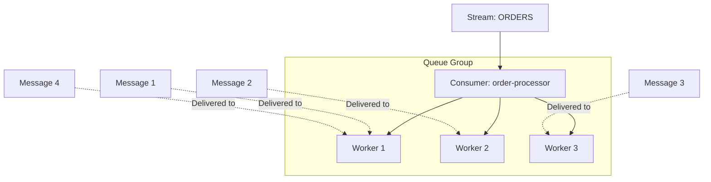

# How to Build NATS Consumers

Author: [nawazdhandala](https://www.github.com/nawazdhandala)

Tags: NATS, Messaging, JetStream, Consumers, Go, Node.js, Distributed Systems

Description: Learn how to build robust NATS consumers using JetStream. Covers push and pull consumers, delivery policies, acknowledgment strategies, error handling, and production best practices.

---

NATS JetStream provides persistent messaging with at-least-once or exactly-once delivery semantics. Consumers are the mechanism through which applications receive messages from streams. Building reliable consumers requires understanding delivery policies, acknowledgment patterns, and failure recovery strategies.

## Understanding NATS Consumer Architecture

Before diving into code, let's visualize how consumers fit into the NATS JetStream architecture.



Streams store messages persistently, while consumers track delivery state for subscriber groups. A single stream can have multiple consumers, each maintaining independent delivery positions.

## Consumer Types: Push vs Pull

NATS JetStream offers two consumer types with different delivery mechanisms.



**Push consumers** actively deliver messages to subscribers as they arrive. They work well for real-time processing where subscribers are always available.

**Pull consumers** wait for subscribers to request messages. They excel in scenarios requiring backpressure control, batch processing, or when subscribers have varying processing speeds.

## Setting Up the Stream

Before creating consumers, you need a stream to consume from. Here's how to create one programmatically.

The following code connects to NATS and creates a stream for order events with file-based storage and a 7-day retention period.

```go
package main

import (
    "context"
    "log"
    "time"

    "github.com/nats-io/nats.go"
    "github.com/nats-io/nats.go/jetstream"
)

func main() {
    // Connect to NATS server
    nc, err := nats.Connect("nats://localhost:4222")
    if err != nil {
        log.Fatal(err)
    }
    defer nc.Close()

    // Create JetStream context
    js, err := jetstream.New(nc)
    if err != nil {
        log.Fatal(err)
    }

    ctx := context.Background()

    // Create or update the stream
    // Streams store messages and allow multiple consumers
    stream, err := js.CreateOrUpdateStream(ctx, jetstream.StreamConfig{
        Name:        "ORDERS",            // Stream name for reference
        Subjects:    []string{"orders.>"}, // Subject filter pattern
        Storage:     jetstream.FileStorage, // Persist to disk
        Retention:   jetstream.LimitsPolicy, // Keep messages until limits hit
        MaxAge:      7 * 24 * time.Hour,    // Auto-delete after 7 days
        Replicas:    3,                     // Replicate across 3 servers
        Discard:     jetstream.DiscardOld,  // Remove oldest when full
    })
    if err != nil {
        log.Fatal(err)
    }

    log.Printf("Stream %s created with %d replicas", stream.CachedInfo().Config.Name, stream.CachedInfo().Config.Replicas)
}
```

## Building a Push Consumer

Push consumers deliver messages automatically to subscribers. They're ideal for real-time event processing where low latency matters.

The following example creates a durable push consumer that delivers messages to a specific subject, with automatic redelivery after 30 seconds if not acknowledged.

```go
package main

import (
    "context"
    "log"
    "time"

    "github.com/nats-io/nats.go"
    "github.com/nats-io/nats.go/jetstream"
)

func main() {
    nc, err := nats.Connect("nats://localhost:4222")
    if err != nil {
        log.Fatal(err)
    }
    defer nc.Close()

    js, err := jetstream.New(nc)
    if err != nil {
        log.Fatal(err)
    }

    ctx := context.Background()

    // Create a durable push consumer
    // Durable consumers survive restarts and remember their position
    consumer, err := js.CreateOrUpdateConsumer(ctx, "ORDERS", jetstream.ConsumerConfig{
        Name:           "order-processor",       // Consumer name (durable)
        Durable:        "order-processor",       // Must match Name for durable
        DeliverSubject: "deliver.orders",        // Where to push messages
        DeliverGroup:   "order-workers",         // Queue group for load balancing
        AckPolicy:      jetstream.AckExplicitPolicy, // Require explicit acks
        AckWait:        30 * time.Second,        // Redeliver if no ack in 30s
        MaxDeliver:     5,                       // Max redelivery attempts
        FilterSubject:  "orders.created",        // Only consume matching subjects
    })
    if err != nil {
        log.Fatal(err)
    }

    // Subscribe to receive pushed messages
    // Messages arrive automatically on the deliver subject
    sub, err := nc.QueueSubscribe("deliver.orders", "order-workers", func(msg *nats.Msg) {
        log.Printf("Received order: %s", string(msg.Data))

        // Process the message here
        // Always acknowledge after successful processing
        if err := msg.Ack(); err != nil {
            log.Printf("Failed to ack: %v", err)
        }
    })
    if err != nil {
        log.Fatal(err)
    }
    defer sub.Unsubscribe()

    log.Printf("Push consumer %s listening on %s", consumer.CachedInfo().Name, "deliver.orders")

    // Keep the program running
    select {}
}
```

## Building a Pull Consumer

Pull consumers give you precise control over message flow. Subscribers explicitly request batches, making them perfect for rate-limited processing or batch operations.

The following code creates a pull consumer and demonstrates how to fetch messages in batches with proper acknowledgment handling.

```go
package main

import (
    "context"
    "log"
    "time"

    "github.com/nats-io/nats.go"
    "github.com/nats-io/nats.go/jetstream"
)

func main() {
    nc, err := nats.Connect("nats://localhost:4222")
    if err != nil {
        log.Fatal(err)
    }
    defer nc.Close()

    js, err := jetstream.New(nc)
    if err != nil {
        log.Fatal(err)
    }

    ctx := context.Background()

    // Create a durable pull consumer
    // Pull consumers don't need a deliver subject
    consumer, err := js.CreateOrUpdateConsumer(ctx, "ORDERS", jetstream.ConsumerConfig{
        Name:          "batch-processor",
        Durable:       "batch-processor",
        AckPolicy:     jetstream.AckExplicitPolicy,
        AckWait:       60 * time.Second,  // Longer wait for batch processing
        MaxDeliver:    3,
        MaxAckPending: 1000,              // Max unacknowledged messages
        FilterSubject: "orders.>",        // Consume all order subjects
    })
    if err != nil {
        log.Fatal(err)
    }

    // Fetch messages in batches
    // Batch size of 100 with 5 second timeout
    for {
        msgs, err := consumer.Fetch(100, jetstream.FetchMaxWait(5*time.Second))
        if err != nil {
            log.Printf("Fetch error: %v", err)
            continue
        }

        // Process each message in the batch
        for msg := range msgs.Messages() {
            log.Printf("Processing: %s", string(msg.Data()))

            // Simulate processing
            time.Sleep(10 * time.Millisecond)

            // Acknowledge successful processing
            if err := msg.Ack(); err != nil {
                log.Printf("Ack failed: %v", err)
            }
        }

        // Check for fetch errors
        if msgs.Error() != nil {
            log.Printf("Batch error: %v", msgs.Error())
        }
    }
}
```

## Delivery Policies

Delivery policies determine where a consumer starts reading from the stream. Choose the right policy based on your use case.



Here's how to configure different delivery policies when creating consumers.

```go
// DeliverAll - Start from the very first message in the stream
// Best for: New consumers that need complete history
consumerAll := jetstream.ConsumerConfig{
    Name:          "process-all",
    Durable:       "process-all",
    DeliverPolicy: jetstream.DeliverAllPolicy,
    AckPolicy:     jetstream.AckExplicitPolicy,
}

// DeliverNew - Only receive messages published after consumer creation
// Best for: Real-time processing where history doesn't matter
consumerNew := jetstream.ConsumerConfig{
    Name:          "process-new",
    Durable:       "process-new",
    DeliverPolicy: jetstream.DeliverNewPolicy,
    AckPolicy:     jetstream.AckExplicitPolicy,
}

// DeliverLast - Start from the last message in the stream
// Best for: Getting the most recent state
consumerLast := jetstream.ConsumerConfig{
    Name:          "process-last",
    Durable:       "process-last",
    DeliverPolicy: jetstream.DeliverLastPolicy,
    AckPolicy:     jetstream.AckExplicitPolicy,
}

// DeliverByStartSequence - Start from a specific sequence number
// Best for: Resuming from a known position or replaying from a point
consumerSeq := jetstream.ConsumerConfig{
    Name:             "process-from-seq",
    Durable:          "process-from-seq",
    DeliverPolicy:    jetstream.DeliverByStartSequencePolicy,
    OptStartSeq:      1000,  // Start from sequence 1000
    AckPolicy:        jetstream.AckExplicitPolicy,
}

// DeliverByStartTime - Start from messages after a specific timestamp
// Best for: Time-based replay or recovery from a known point in time
startTime := time.Now().Add(-24 * time.Hour)  // 24 hours ago
consumerTime := jetstream.ConsumerConfig{
    Name:          "process-from-time",
    Durable:       "process-from-time",
    DeliverPolicy: jetstream.DeliverByStartTimePolicy,
    OptStartTime:  &startTime,
    AckPolicy:     jetstream.AckExplicitPolicy,
}
```

## Acknowledgment Strategies

Proper acknowledgment handling ensures reliable message processing. NATS provides multiple ack types for different scenarios.



The following code demonstrates all acknowledgment types and when to use each one.

```go
package main

import (
    "context"
    "errors"
    "log"
    "time"

    "github.com/nats-io/nats.go"
    "github.com/nats-io/nats.go/jetstream"
)

func processMessage(msg jetstream.Msg) error {
    data := msg.Data()

    // Simulate different processing outcomes
    switch string(data) {
    case "success":
        return nil
    case "temporary_failure":
        return errors.New("temporary error, retry later")
    case "permanent_failure":
        return errors.New("permanent error, skip this message")
    default:
        return nil
    }
}

func main() {
    nc, _ := nats.Connect("nats://localhost:4222")
    defer nc.Close()

    js, _ := jetstream.New(nc)
    ctx := context.Background()

    consumer, _ := js.Consumer(ctx, "ORDERS", "order-processor")

    // Consume messages with proper ack handling
    _, err := consumer.Consume(func(msg jetstream.Msg) {
        log.Printf("Processing message: %s", string(msg.Data()))

        err := processMessage(msg)

        if err == nil {
            // Ack - Message processed successfully
            // Removes the message from pending for this consumer
            if err := msg.Ack(); err != nil {
                log.Printf("Ack failed: %v", err)
            }
            return
        }

        // Check if error is retryable
        if isTemporaryError(err) {
            // NakWithDelay - Retry after a delay
            // Useful for rate limiting or waiting for external services
            delay := 5 * time.Second
            if err := msg.NakWithDelay(delay); err != nil {
                log.Printf("NakWithDelay failed: %v", err)
            }
            log.Printf("Will retry in %v", delay)
            return
        }

        // Check delivery count before giving up
        metadata, _ := msg.Metadata()
        if metadata.NumDelivered >= 3 {
            // Term - Terminate redelivery attempts
            // Use when message should never be redelivered
            if err := msg.Term(); err != nil {
                log.Printf("Term failed: %v", err)
            }
            log.Printf("Message terminated after %d attempts", metadata.NumDelivered)
            // Consider sending to dead letter queue here
            return
        }

        // Nak - Request immediate redelivery
        // The message will be redelivered after AckWait expires
        if err := msg.Nak(); err != nil {
            log.Printf("Nak failed: %v", err)
        }
        log.Printf("Message will be redelivered")

    }, jetstream.ConsumeErrHandler(func(consumeCtx jetstream.ConsumeContext, err error) {
        log.Printf("Consumer error: %v", err)
    }))

    if err != nil {
        log.Fatal(err)
    }

    select {}
}

func isTemporaryError(err error) bool {
    // Implement logic to determine if error is temporary
    return err.Error() == "temporary error, retry later"
}
```

## Building Consumers in Node.js

NATS provides excellent Node.js support through the nats.js library. Here's a complete example of building both push and pull consumers.

The following code demonstrates a pull consumer in Node.js with batch processing and proper error handling.

```javascript
const { connect, AckPolicy, DeliverPolicy } = require('nats');

async function main() {
    // Connect to NATS server
    const nc = await connect({ servers: 'nats://localhost:4222' });
    console.log('Connected to NATS');

    // Get JetStream manager for administrative operations
    const jsm = await nc.jetstreamManager();

    // Create or update stream
    await jsm.streams.add({
        name: 'ORDERS',
        subjects: ['orders.>'],
        storage: 'file',
        retention: 'limits',
        max_age: 7 * 24 * 60 * 60 * 1000000000, // 7 days in nanoseconds
    });

    // Create durable pull consumer
    await jsm.consumers.add('ORDERS', {
        name: 'node-processor',
        durable_name: 'node-processor',
        ack_policy: AckPolicy.Explicit,
        ack_wait: 30 * 1000000000,  // 30 seconds in nanoseconds
        max_deliver: 5,
        filter_subject: 'orders.>',
    });

    // Get JetStream context for consuming
    const js = nc.jetstream();

    // Get the consumer
    const consumer = await js.consumers.get('ORDERS', 'node-processor');

    console.log('Starting to consume messages...');

    // Fetch and process messages in batches
    while (true) {
        try {
            // Fetch batch of messages
            // expires: how long to wait for messages (5 seconds)
            // max_messages: maximum messages to fetch (100)
            const messages = await consumer.fetch({
                expires: 5000,
                max_messages: 100,
            });

            // Process each message
            for await (const msg of messages) {
                try {
                    console.log(`Processing: ${msg.subject} - ${msg.string()}`);

                    // Simulate processing
                    await processOrder(msg.json());

                    // Acknowledge successful processing
                    msg.ack();

                } catch (processingError) {
                    console.error(`Processing failed: ${processingError.message}`);

                    // Get message metadata for delivery count
                    const info = msg.info;

                    if (info.redeliveryCount >= 3) {
                        // Too many retries, terminate
                        msg.term();
                        console.log('Message terminated after max retries');
                        // Send to dead letter queue
                        await sendToDeadLetter(msg);
                    } else {
                        // Retry with delay
                        msg.nak(5000); // Retry after 5 seconds
                    }
                }
            }
        } catch (fetchError) {
            console.error(`Fetch error: ${fetchError.message}`);
            // Wait before retrying
            await sleep(1000);
        }
    }
}

async function processOrder(order) {
    // Implement order processing logic
    console.log(`Order processed: ${JSON.stringify(order)}`);
}

async function sendToDeadLetter(msg) {
    // Implement dead letter queue logic
    console.log(`Sending to DLQ: ${msg.subject}`);
}

function sleep(ms) {
    return new Promise(resolve => setTimeout(resolve, ms));
}

main().catch(console.error);
```

## Implementing a Dead Letter Queue

When messages fail repeatedly, you need a strategy to handle them without blocking other messages. A dead letter queue (DLQ) captures failed messages for later analysis or manual intervention.



The following implementation shows how to set up a dead letter queue stream and automatically route failed messages to it.

```go
package main

import (
    "context"
    "encoding/json"
    "log"
    "time"

    "github.com/nats-io/nats.go"
    "github.com/nats-io/nats.go/jetstream"
)

type DeadLetterMessage struct {
    OriginalSubject string          `json:"original_subject"`
    OriginalData    json.RawMessage `json:"original_data"`
    Error           string          `json:"error"`
    FailedAt        time.Time       `json:"failed_at"`
    RetryCount      uint64          `json:"retry_count"`
    ConsumerName    string          `json:"consumer_name"`
}

func main() {
    nc, _ := nats.Connect("nats://localhost:4222")
    defer nc.Close()

    js, _ := jetstream.New(nc)
    ctx := context.Background()

    // Create the dead letter queue stream
    // Separate stream for failed messages with longer retention
    _, err := js.CreateOrUpdateStream(ctx, jetstream.StreamConfig{
        Name:      "ORDERS_DLQ",
        Subjects:  []string{"dlq.orders.>"},
        Storage:   jetstream.FileStorage,
        Retention: jetstream.LimitsPolicy,
        MaxAge:    30 * 24 * time.Hour,  // Keep for 30 days
    })
    if err != nil {
        log.Fatal(err)
    }

    // Create main consumer with dead letter handling
    consumer, _ := js.CreateOrUpdateConsumer(ctx, "ORDERS", jetstream.ConsumerConfig{
        Name:       "order-processor-dlq",
        Durable:    "order-processor-dlq",
        AckPolicy:  jetstream.AckExplicitPolicy,
        AckWait:    30 * time.Second,
        MaxDeliver: 3,  // Max 3 attempts before DLQ
    })

    // Consume with dead letter queue support
    _, err = consumer.Consume(func(msg jetstream.Msg) {
        metadata, _ := msg.Metadata()

        // Process the message
        err := processOrder(msg.Data())

        if err == nil {
            msg.Ack()
            return
        }

        log.Printf("Processing failed: %v (attempt %d/%d)",
            err, metadata.NumDelivered, 3)

        // Check if max retries reached
        if metadata.NumDelivered >= 3 {
            // Send to dead letter queue before terminating
            sendToDLQ(nc, msg, err.Error(), metadata)
            msg.Term()
            return
        }

        // Retry with exponential backoff
        delay := time.Duration(metadata.NumDelivered) * 5 * time.Second
        msg.NakWithDelay(delay)
    })

    if err != nil {
        log.Fatal(err)
    }

    log.Println("Consumer with DLQ support running...")
    select {}
}

func sendToDLQ(nc *nats.Conn, msg jetstream.Msg, errMsg string, metadata *jetstream.MsgMetadata) {
    dlqMsg := DeadLetterMessage{
        OriginalSubject: msg.Subject(),
        OriginalData:    msg.Data(),
        Error:           errMsg,
        FailedAt:        time.Now(),
        RetryCount:      metadata.NumDelivered,
        ConsumerName:    metadata.Consumer,
    }

    data, _ := json.Marshal(dlqMsg)

    // Publish to DLQ stream
    // Subject maps to dlq.orders.{original-subject-suffix}
    dlqSubject := "dlq." + msg.Subject()
    if err := nc.Publish(dlqSubject, data); err != nil {
        log.Printf("Failed to send to DLQ: %v", err)
    } else {
        log.Printf("Message sent to DLQ: %s", dlqSubject)
    }
}

func processOrder(data []byte) error {
    // Implement order processing
    return nil
}
```

## Consumer Groups and Load Balancing

NATS JetStream supports consumer groups, allowing multiple instances to share the processing load. Each message goes to only one member of the group.



For push consumers, use the DeliverGroup option to enable queue group semantics.

```go
// Push consumer with queue group
// Multiple subscribers share the load
consumer, err := js.CreateOrUpdateConsumer(ctx, "ORDERS", jetstream.ConsumerConfig{
    Name:           "order-processor",
    Durable:        "order-processor",
    DeliverSubject: "deliver.orders",
    DeliverGroup:   "order-workers",  // Queue group name
    AckPolicy:      jetstream.AckExplicitPolicy,
    AckWait:        30 * time.Second,
})
```

For pull consumers, multiple instances can fetch from the same consumer, and NATS automatically distributes messages.

```go
// Multiple pull consumer instances sharing the same durable consumer
// Each instance calls Fetch independently
// NATS ensures each message goes to only one instance
func startWorker(id int, consumer jetstream.Consumer) {
    for {
        msgs, err := consumer.Fetch(10, jetstream.FetchMaxWait(5*time.Second))
        if err != nil {
            log.Printf("Worker %d fetch error: %v", id, err)
            continue
        }

        for msg := range msgs.Messages() {
            log.Printf("Worker %d processing: %s", id, string(msg.Data()))
            msg.Ack()
        }
    }
}

// Start multiple workers against the same consumer
for i := 1; i <= 5; i++ {
    go startWorker(i, consumer)
}
```

## Monitoring Consumer Health

Production consumers need monitoring to detect issues before they impact your system. NATS provides rich consumer metadata for health checks.

The following code implements a health check endpoint that monitors consumer lag, pending messages, and redelivery rates.

```go
package main

import (
    "context"
    "encoding/json"
    "log"
    "net/http"

    "github.com/nats-io/nats.go"
    "github.com/nats-io/nats.go/jetstream"
)

type ConsumerHealth struct {
    Name              string `json:"name"`
    Stream            string `json:"stream"`
    NumPending        uint64 `json:"num_pending"`
    NumWaiting        int    `json:"num_waiting"`
    NumAckPending     int    `json:"num_ack_pending"`
    NumRedelivered    uint64 `json:"num_redelivered"`
    Healthy           bool   `json:"healthy"`
    HealthMessage     string `json:"health_message,omitempty"`
}

var js jetstream.JetStream

func healthHandler(w http.ResponseWriter, r *http.Request) {
    ctx := r.Context()

    // Get consumer info
    consumer, err := js.Consumer(ctx, "ORDERS", "order-processor")
    if err != nil {
        http.Error(w, err.Error(), http.StatusInternalServerError)
        return
    }

    info, err := consumer.Info(ctx)
    if err != nil {
        http.Error(w, err.Error(), http.StatusInternalServerError)
        return
    }

    health := ConsumerHealth{
        Name:           info.Name,
        Stream:         info.Stream,
        NumPending:     info.NumPending,
        NumWaiting:     info.NumWaiting,
        NumAckPending:  info.NumAckPending,
        NumRedelivered: info.NumRedelivered,
    }

    // Determine health status based on metrics
    // High pending count indicates consumer is falling behind
    if info.NumPending > 10000 {
        health.Healthy = false
        health.HealthMessage = "Consumer lag too high"
    } else if info.NumAckPending > 500 {
        // High ack pending indicates slow processing or stuck messages
        health.Healthy = false
        health.HealthMessage = "Too many unacknowledged messages"
    } else if float64(info.NumRedelivered)/float64(info.Delivered.Consumer) > 0.1 {
        // High redelivery rate indicates processing issues
        health.Healthy = false
        health.HealthMessage = "High redelivery rate detected"
    } else {
        health.Healthy = true
    }

    w.Header().Set("Content-Type", "application/json")
    if !health.Healthy {
        w.WriteHeader(http.StatusServiceUnavailable)
    }
    json.NewEncoder(w).Encode(health)
}

func main() {
    nc, _ := nats.Connect("nats://localhost:4222")
    defer nc.Close()

    js, _ = jetstream.New(nc)

    http.HandleFunc("/health", healthHandler)
    log.Println("Health endpoint running on :8080")
    http.ListenAndServe(":8080", nil)
}
```

## Production Best Practices

When deploying NATS consumers to production, follow these guidelines for reliability and performance.

### 1. Set Appropriate AckWait Times

Configure AckWait based on your actual processing time, plus a safety margin. Too short leads to duplicate processing, while too long delays failure detection.

```go
// Calculate AckWait based on 95th percentile processing time + buffer
// If p95 is 5 seconds, set AckWait to 15-30 seconds
consumerConfig := jetstream.ConsumerConfig{
    AckWait: 30 * time.Second,
}
```

### 2. Use Appropriate MaxAckPending

Limit concurrent processing to prevent memory exhaustion while maintaining throughput.

```go
// MaxAckPending controls how many messages can be in-flight
// Higher values increase throughput but use more memory
consumerConfig := jetstream.ConsumerConfig{
    MaxAckPending: 1000,  // Tune based on worker capacity
}
```

### 3. Implement Graceful Shutdown

Drain in-flight messages before shutting down to prevent message loss.

```go
func gracefulShutdown(nc *nats.Conn, consumeCtx jetstream.ConsumeContext) {
    // Stop accepting new messages
    consumeCtx.Stop()

    // Wait for in-flight messages to complete (with timeout)
    ctx, cancel := context.WithTimeout(context.Background(), 30*time.Second)
    defer cancel()

    // Drain the connection
    nc.Drain()

    <-ctx.Done()
    log.Println("Graceful shutdown complete")
}
```

### 4. Handle Consumer Recreation

Consumers may need recreation after configuration changes. Plan for this in your deployment process.

```go
// Delete and recreate consumer when configuration changes significantly
// Note: This resets the consumer position if you change the name
func recreateConsumer(ctx context.Context, js jetstream.JetStream, stream string, config jetstream.ConsumerConfig) error {
    // Delete existing consumer
    _ = js.DeleteConsumer(ctx, stream, config.Name)

    // Create with new configuration
    _, err := js.CreateConsumer(ctx, stream, config)
    return err
}
```

## Summary

Building reliable NATS consumers requires understanding the trade-offs between push and pull models, choosing appropriate delivery policies, and implementing robust acknowledgment handling. Key takeaways include:

- **Push consumers** work best for real-time, low-latency scenarios
- **Pull consumers** excel when you need backpressure control or batch processing
- **Always use explicit acknowledgments** in production for reliability
- **Implement dead letter queues** to handle poison messages
- **Monitor consumer lag and redelivery rates** to detect issues early
- **Configure appropriate timeouts** based on actual processing characteristics

NATS JetStream provides the building blocks for reliable message processing. Combine these patterns with your application's specific requirements to build consumers that handle failures gracefully and scale with your workload.
