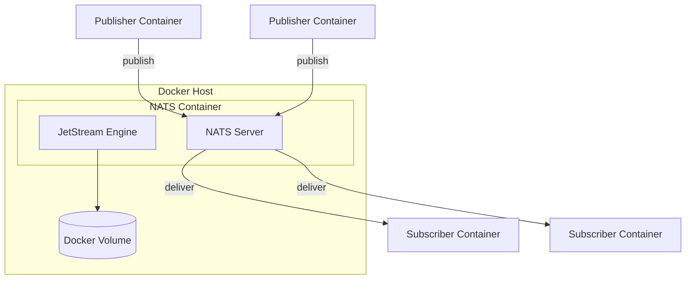
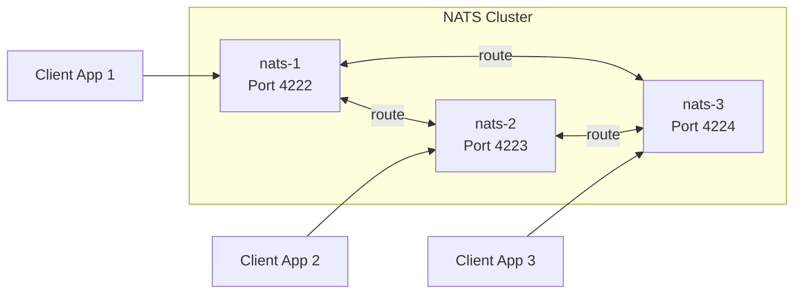
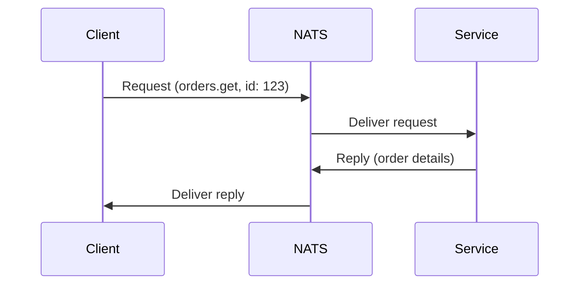
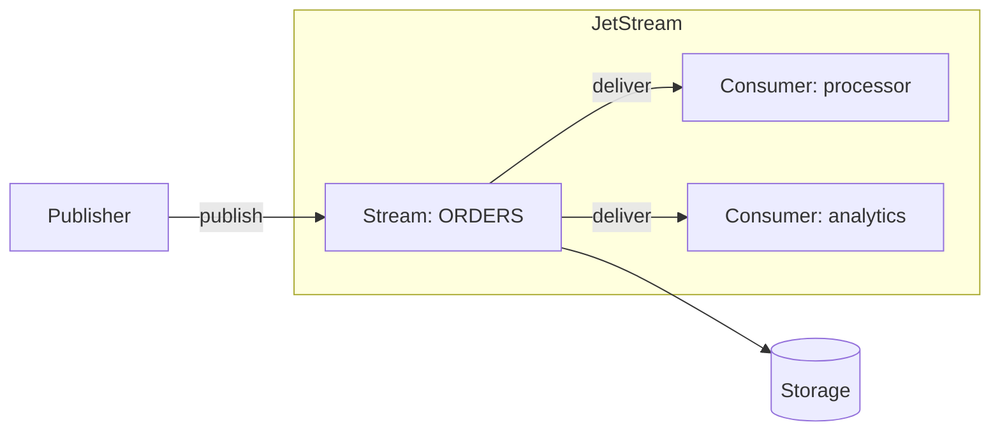

# How to Use NATS with Docker

Author: [nawazdhandala](https://www.github.com/nawazdhandala)

Tags: NATS, Docker, Messaging, Microservices, Containers, Pub-Sub

Description: Learn how to deploy and configure NATS messaging system with Docker, including single-node setup, clustering, JetStream persistence, and production-ready configurations with practical examples.

NATS is a lightweight, high-performance messaging system designed for cloud-native applications. When combined with Docker, NATS becomes incredibly easy to deploy, scale, and manage. In this guide, you will learn how to run NATS in containers, configure clustering, enable JetStream for persistence, and implement common messaging patterns.

## Why NATS with Docker?

NATS and Docker make a natural pairing for several reasons:

- NATS images are tiny (under 20MB), making container startup nearly instant
- Zero external dependencies means no complex orchestration
- Built-in clustering works seamlessly with container networking
- JetStream persistence can be mounted to Docker volumes



## Running NATS in a Single Container

The quickest way to get NATS running is with a simple `docker run` command.

The following command starts a NATS server and exposes the client port (4222) and monitoring port (8222) to the host machine.

```bash
# Run NATS server with client and monitoring ports exposed
# -d: Run in background (detached mode)
# --name nats: Container name for easy reference
# -p 4222:4222: Client connections (applications connect here)
# -p 8222:8222: HTTP monitoring endpoint
docker run -d \
  --name nats \
  -p 4222:4222 \
  -p 8222:8222 \
  nats:latest
```

Verify the server is running by checking the monitoring endpoint. The /varz endpoint returns server variables and statistics.

```bash
# Check NATS server health and version info
curl http://localhost:8222/varz
```

## Configuring NATS with a Custom Configuration File

For production deployments, you need a proper configuration file. Create a NATS configuration with custom settings.

The configuration below enables JetStream, sets memory and storage limits, and configures logging.

```conf
# nats.conf - Production NATS configuration

# Server identification
server_name: nats-docker-1

# Client connection settings
port: 4222
max_connections: 1000
max_payload: 1MB

# HTTP monitoring endpoint
http_port: 8222

# Enable JetStream for message persistence
jetstream {
    # Storage directory inside container (will be mounted)
    store_dir: /data/jetstream

    # Memory limit for JetStream
    max_memory_store: 256MB

    # Disk storage limit
    max_file_store: 1GB
}

# Logging configuration
debug: false
trace: false
logtime: true
log_file: "/var/log/nats/nats.log"
```

Mount the configuration file and a volume for JetStream storage when starting the container.

```bash
# Run NATS with custom config and persistent storage
# -v nats.conf:/etc/nats/nats.conf: Mount local config into container
# -v nats-data:/data: Named volume for JetStream persistence
# -c /etc/nats/nats.conf: Tell NATS to use the config file
docker run -d \
  --name nats \
  -p 4222:4222 \
  -p 8222:8222 \
  -v $(pwd)/nats.conf:/etc/nats/nats.conf:ro \
  -v nats-data:/data \
  nats:latest \
  -c /etc/nats/nats.conf
```

## Using Docker Compose for NATS

Docker Compose simplifies multi-container deployments and makes configuration reproducible.

The following Compose file sets up a NATS server with JetStream enabled and a dedicated network for service communication.

```yaml
# docker-compose.yml
version: '3.8'

services:
  nats:
    image: nats:latest
    container_name: nats
    ports:
      - "4222:4222"   # Client connections
      - "8222:8222"   # HTTP monitoring
      - "6222:6222"   # Cluster routing (for multi-node setups)
    volumes:
      # Mount configuration file as read-only
      - ./nats.conf:/etc/nats/nats.conf:ro
      # Named volume for JetStream data persistence
      - nats-data:/data
    command: ["-c", "/etc/nats/nats.conf"]
    # Health check to verify NATS is responding
    healthcheck:
      test: ["CMD", "wget", "-qO-", "http://localhost:8222/healthz"]
      interval: 10s
      timeout: 5s
      retries: 3
    networks:
      - nats-network
    restart: unless-stopped

volumes:
  nats-data:
    driver: local

networks:
  nats-network:
    driver: bridge
```

Start the stack with Docker Compose.

```bash
# Start NATS in the background
docker compose up -d

# View logs to confirm JetStream is enabled
docker compose logs nats | grep -i jetstream
```

## Setting Up a NATS Cluster

For high availability, NATS supports clustering where multiple servers form a mesh. Each server maintains connections to all other servers.



Create configuration files for each cluster node. The first node acts as the seed server.

```conf
# nats-1.conf - Seed node configuration
server_name: nats-1
port: 4222
http_port: 8222

# Cluster configuration
cluster {
    name: nats-cluster
    port: 6222

    # Routes to other cluster members
    routes: [
        nats-route://nats-2:6222
        nats-route://nats-3:6222
    ]
}

jetstream {
    store_dir: /data/jetstream
    max_memory_store: 256MB
    max_file_store: 1GB
}
```

The Docker Compose file for a three-node cluster requires proper networking and depends_on configuration.

```yaml
# docker-compose-cluster.yml
version: '3.8'

services:
  nats-1:
    image: nats:latest
    container_name: nats-1
    ports:
      - "4222:4222"
      - "8222:8222"
    volumes:
      - ./nats-1.conf:/etc/nats/nats.conf:ro
      - nats-1-data:/data
    command: ["-c", "/etc/nats/nats.conf"]
    networks:
      - nats-cluster
    healthcheck:
      test: ["CMD", "wget", "-qO-", "http://localhost:8222/healthz"]
      interval: 10s
      timeout: 5s
      retries: 3

  nats-2:
    image: nats:latest
    container_name: nats-2
    ports:
      - "4223:4222"
      - "8223:8222"
    volumes:
      - ./nats-2.conf:/etc/nats/nats.conf:ro
      - nats-2-data:/data
    command: ["-c", "/etc/nats/nats.conf"]
    networks:
      - nats-cluster
    depends_on:
      nats-1:
        condition: service_healthy

  nats-3:
    image: nats:latest
    container_name: nats-3
    ports:
      - "4224:4222"
      - "8224:8222"
    volumes:
      - ./nats-3.conf:/etc/nats/nats.conf:ro
      - nats-3-data:/data
    command: ["-c", "/etc/nats/nats.conf"]
    networks:
      - nats-cluster
    depends_on:
      nats-2:
        condition: service_healthy

volumes:
  nats-1-data:
  nats-2-data:
  nats-3-data:

networks:
  nats-cluster:
    driver: bridge
```

## Connecting Applications to NATS

Once NATS is running, your applications can connect using the official client libraries. Here is an example using Node.js.

The following code demonstrates the publish-subscribe pattern, where messages are broadcast to all subscribers on a subject.

```javascript
// publisher.js - Publishes messages to a NATS subject
const { connect, StringCodec } = require('nats');

async function main() {
    // Connect to NATS server (uses localhost:4222 by default)
    // For Docker networking, use the container name: nats://nats:4222
    const nc = await connect({
        servers: process.env.NATS_URL || 'nats://localhost:4222',
        name: 'publisher-service',  // Client name for monitoring
    });

    console.log(`Connected to ${nc.getServer()}`);

    // StringCodec handles encoding/decoding string payloads
    const sc = StringCodec();

    // Publish messages to the 'orders.created' subject
    // Any subscriber listening to this subject will receive the message
    const order = { id: 123, item: 'Widget', quantity: 5 };
    nc.publish('orders.created', sc.encode(JSON.stringify(order)));
    console.log('Published order:', order);

    // Gracefully close the connection
    await nc.drain();
}

main().catch(console.error);
```

The subscriber listens for messages on a subject and processes them as they arrive.

```javascript
// subscriber.js - Subscribes to a NATS subject
const { connect, StringCodec } = require('nats');

async function main() {
    const nc = await connect({
        servers: process.env.NATS_URL || 'nats://localhost:4222',
        name: 'subscriber-service',
    });

    console.log(`Connected to ${nc.getServer()}`);
    const sc = StringCodec();

    // Subscribe to 'orders.created' subject
    // The callback fires for each message received
    const sub = nc.subscribe('orders.created');
    console.log('Listening for orders...');

    // Async iterator pattern for processing messages
    for await (const msg of sub) {
        const order = JSON.parse(sc.decode(msg.data));
        console.log('Received order:', order);
        // Process the order here
    }
}

main().catch(console.error);
```

## Request-Reply Pattern

NATS supports request-reply for synchronous-style communication over async messaging.



The service responds to requests on a specific subject.

```javascript
// order-service.js - Responds to order requests
const { connect, StringCodec } = require('nats');

async function main() {
    const nc = await connect({
        servers: process.env.NATS_URL || 'nats://localhost:4222',
    });

    const sc = StringCodec();

    // Subscribe to handle incoming requests
    // msg.respond() sends a reply back to the requester
    const sub = nc.subscribe('orders.get');

    for await (const msg of sub) {
        const request = JSON.parse(sc.decode(msg.data));
        console.log('Request for order:', request.id);

        // Simulate fetching order from database
        const order = {
            id: request.id,
            item: 'Widget',
            status: 'shipped',
        };

        // Send the response back to the requester
        msg.respond(sc.encode(JSON.stringify(order)));
    }
}

main().catch(console.error);
```

The client sends a request and waits for a response.

```javascript
// client.js - Makes a request and waits for reply
const { connect, StringCodec } = require('nats');

async function main() {
    const nc = await connect({
        servers: process.env.NATS_URL || 'nats://localhost:4222',
    });

    const sc = StringCodec();

    // request() sends a message and waits for a reply
    // timeout: Maximum time to wait for a response (in ms)
    const response = await nc.request(
        'orders.get',
        sc.encode(JSON.stringify({ id: 123 })),
        { timeout: 5000 }
    );

    const order = JSON.parse(sc.decode(response.data));
    console.log('Received order:', order);

    await nc.close();
}

main().catch(console.error);
```

## Using JetStream for Persistent Messaging

JetStream adds persistence, exactly-once delivery, and stream processing capabilities to NATS.



Create a stream and consumer using the NATS CLI or programmatically.

```javascript
// jetstream-producer.js - Publish to a JetStream stream
const { connect, StringCodec } = require('nats');

async function main() {
    const nc = await connect({
        servers: process.env.NATS_URL || 'nats://localhost:4222',
    });

    // Get the JetStream context
    const js = nc.jetstream();
    const sc = StringCodec();

    // Create or access a stream
    // Streams persist messages based on configuration
    const jsm = await nc.jetstreamManager();

    // Add a stream if it does not exist
    try {
        await jsm.streams.add({
            name: 'ORDERS',
            subjects: ['orders.*'],  // Capture all orders.* subjects
            retention: 'limits',      // Keep messages until limits reached
            max_msgs: 100000,         // Maximum messages to retain
            max_age: 24 * 60 * 60 * 1e9,  // 24 hours in nanoseconds
            storage: 'file',          // Use file storage for persistence
        });
        console.log('Stream ORDERS created');
    } catch (err) {
        if (err.code !== '10058') throw err;  // Ignore "stream exists" error
        console.log('Stream ORDERS already exists');
    }

    // Publish a message with acknowledgment
    // js.publish() waits for the server to confirm storage
    const ack = await js.publish(
        'orders.new',
        sc.encode(JSON.stringify({ id: 456, item: 'Gadget' }))
    );

    console.log(`Message stored in stream: ${ack.stream}, seq: ${ack.seq}`);
    await nc.close();
}

main().catch(console.error);
```

Consumers provide durable subscriptions with delivery guarantees.

```javascript
// jetstream-consumer.js - Consume from a JetStream stream
const { connect, StringCodec, AckPolicy } = require('nats');

async function main() {
    const nc = await connect({
        servers: process.env.NATS_URL || 'nats://localhost:4222',
    });

    const js = nc.jetstream();
    const sc = StringCodec();
    const jsm = await nc.jetstreamManager();

    // Create a durable consumer
    // Durable consumers track delivery state across restarts
    await jsm.consumers.add('ORDERS', {
        durable_name: 'order-processor',
        ack_policy: AckPolicy.Explicit,  // Require manual acknowledgment
        filter_subject: 'orders.new',
    });

    // Get the consumer and start consuming
    const consumer = await js.consumers.get('ORDERS', 'order-processor');
    const messages = await consumer.consume();

    console.log('Processing orders...');

    for await (const msg of messages) {
        const order = JSON.parse(sc.decode(msg.data));
        console.log('Processing order:', order);

        // Simulate processing
        await processOrder(order);

        // Acknowledge successful processing
        // If not acknowledged, the message will be redelivered
        msg.ack();
    }
}

async function processOrder(order) {
    // Your business logic here
    console.log(`Order ${order.id} processed successfully`);
}

main().catch(console.error);
```

## Adding NATS to Your Application Stack

A complete application stack with NATS, your services, and a web frontend might look like this.

```yaml
# docker-compose-app.yml
version: '3.8'

services:
  nats:
    image: nats:latest
    ports:
      - "4222:4222"
      - "8222:8222"
    volumes:
      - ./nats.conf:/etc/nats/nats.conf:ro
      - nats-data:/data
    command: ["-c", "/etc/nats/nats.conf"]
    healthcheck:
      test: ["CMD", "wget", "-qO-", "http://localhost:8222/healthz"]
      interval: 10s
      timeout: 5s
      retries: 3
    networks:
      - app-network

  order-service:
    build: ./order-service
    environment:
      - NATS_URL=nats://nats:4222
    depends_on:
      nats:
        condition: service_healthy
    networks:
      - app-network
    restart: unless-stopped

  notification-service:
    build: ./notification-service
    environment:
      - NATS_URL=nats://nats:4222
    depends_on:
      nats:
        condition: service_healthy
    networks:
      - app-network
    restart: unless-stopped

  api-gateway:
    build: ./api-gateway
    ports:
      - "3000:3000"
    environment:
      - NATS_URL=nats://nats:4222
    depends_on:
      nats:
        condition: service_healthy
      order-service:
        condition: service_started
    networks:
      - app-network
    restart: unless-stopped

volumes:
  nats-data:

networks:
  app-network:
    driver: bridge
```

## Monitoring NATS in Docker

NATS provides multiple monitoring endpoints that you can use for health checks and observability.

```bash
# Check server info and connections
curl http://localhost:8222/varz | jq

# View current subscriptions
curl http://localhost:8222/subsz | jq

# Monitor connections
curl http://localhost:8222/connz | jq

# JetStream account info (when JetStream is enabled)
curl http://localhost:8222/jsz | jq
```

For production monitoring, consider using the NATS Prometheus exporter.

```yaml
# Add to your docker-compose.yml
  nats-exporter:
    image: natsio/prometheus-nats-exporter:latest
    ports:
      - "7777:7777"
    command:
      - "-varz"
      - "-jsz=all"
      - "http://nats:8222"
    depends_on:
      - nats
    networks:
      - app-network
```

## Security Configuration

For production deployments, enable authentication and TLS encryption.

```conf
# nats-secure.conf - Production security configuration

port: 4222
http_port: 8222

# TLS configuration
tls {
    cert_file: "/etc/nats/certs/server.crt"
    key_file: "/etc/nats/certs/server.key"
    ca_file: "/etc/nats/certs/ca.crt"
    verify: true
}

# User authentication
authorization {
    users: [
        { user: "publisher", password: "$2a$11$..." },
        { user: "subscriber", password: "$2a$11$..." }
    ]
}

# Or use token-based auth
# authorization {
#     token: "s3cr3t-t0k3n"
# }

jetstream {
    store_dir: /data/jetstream
    max_memory_store: 512MB
    max_file_store: 10GB
}
```

Mount certificates when running the container.

```bash
# Run NATS with TLS certificates mounted
docker run -d \
  --name nats-secure \
  -p 4222:4222 \
  -p 8222:8222 \
  -v $(pwd)/nats-secure.conf:/etc/nats/nats.conf:ro \
  -v $(pwd)/certs:/etc/nats/certs:ro \
  -v nats-data:/data \
  nats:latest \
  -c /etc/nats/nats.conf
```

## Best Practices for Running NATS in Docker

Follow these guidelines for production NATS deployments:

1. **Always use named volumes** for JetStream data to survive container restarts
2. **Set resource limits** in Docker to prevent NATS from consuming all host memory
3. **Use health checks** to ensure proper container orchestration
4. **Enable monitoring** to catch issues before they impact your applications
5. **Run clusters** for high availability in production environments
6. **Secure connections** with TLS and authentication for any non-development deployment

```yaml
# Resource limits example
services:
  nats:
    image: nats:latest
    deploy:
      resources:
        limits:
          memory: 512M
          cpus: '1.0'
        reservations:
          memory: 256M
          cpus: '0.5'
```

---

NATS and Docker combine to create a powerful, lightweight messaging infrastructure for microservices. Starting with a single container for development and scaling to a clustered deployment for production requires minimal configuration changes. JetStream adds the persistence and delivery guarantees needed for critical workloads, while the small footprint and fast startup make NATS ideal for containerized environments.
