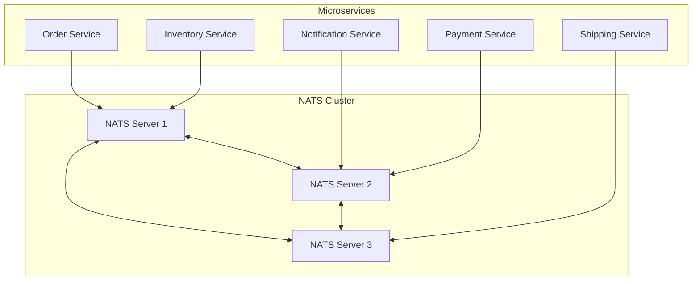
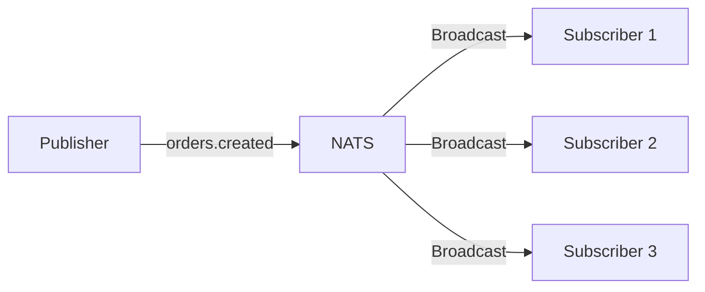
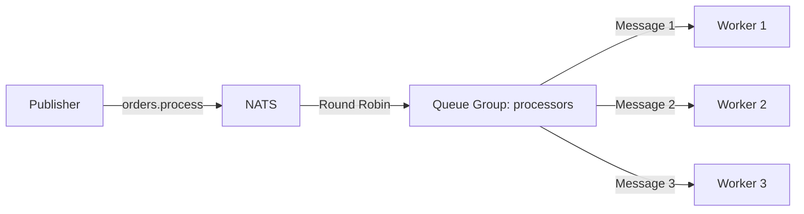
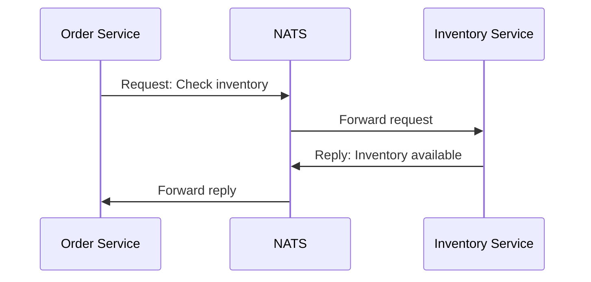
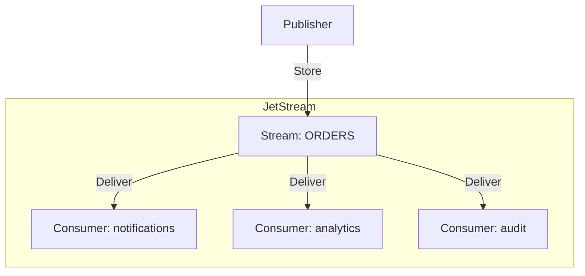
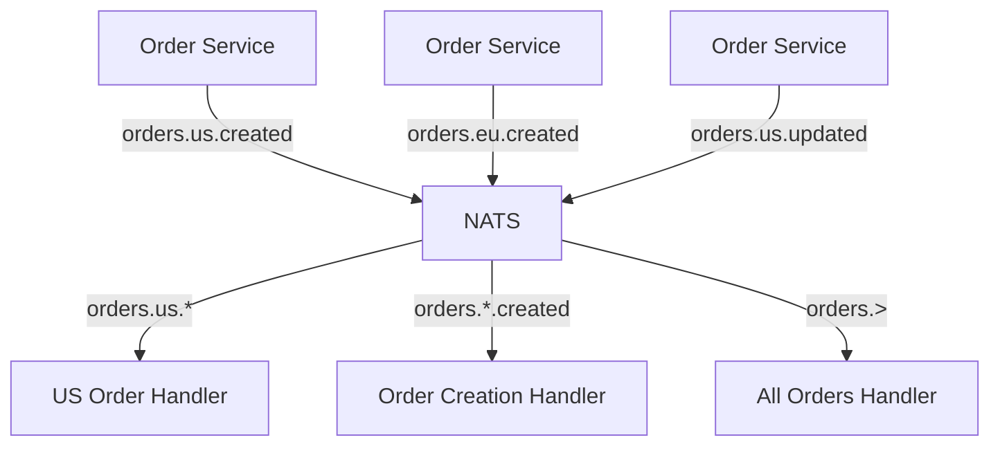
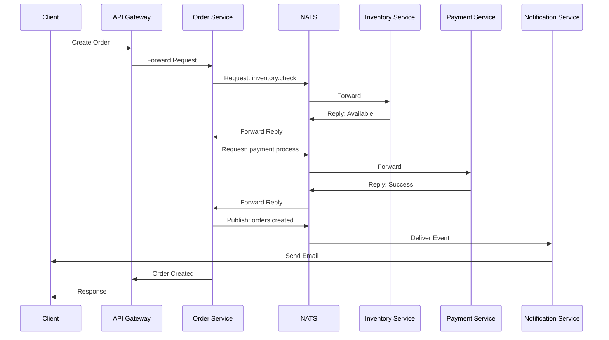

# How to Use NATS for Microservices

Author: [nawazdhandala](https://github.com/nawazdhandala)

Tags: NATS, Microservices, Messaging, Distributed Systems, Go, Node.js

Description: Learn how to use NATS messaging system for microservices communication, covering publish-subscribe, request-reply patterns, JetStream for persistence, and production best practices.

---

Modern microservices architectures require efficient, reliable communication between services. NATS provides a lightweight, high-performance messaging system designed for cloud-native applications. Unlike traditional message brokers, NATS offers simplicity without sacrificing power, making it ideal for service-to-service communication.

## What is NATS?

NATS is an open-source messaging system built for cloud computing, IoT, and microservices architectures. Key features include:

- **Simplicity**: Minimal configuration with sensible defaults
- **Performance**: Millions of messages per second
- **Cloud Native**: Designed for Kubernetes and containerized environments
- **Multiple Patterns**: Publish-subscribe, request-reply, and queue groups
- **JetStream**: Built-in persistence and streaming capabilities

## NATS Architecture Overview

The following diagram shows how NATS connects microservices in a typical architecture.



## Setting Up NATS

### Running NATS with Docker

Start a NATS server with JetStream enabled for message persistence.

```bash
# Run NATS with JetStream enabled for persistence
docker run -d \
  --name nats \
  -p 4222:4222 \
  -p 8222:8222 \
  nats:latest \
  -js \
  -m 8222

# Verify NATS is running by checking the monitoring endpoint
curl http://localhost:8222/varz
```

### Running NATS on Kubernetes

Deploy a NATS cluster using Helm for production environments.

```bash
# Add the NATS Helm repository
helm repo add nats https://nats-io.github.io/k8s/helm/charts/
helm repo update

# Install NATS with JetStream enabled
helm install nats nats/nats \
  --set jetstream.enabled=true \
  --set jetstream.memStorage.enabled=true \
  --set jetstream.memStorage.size=1Gi \
  --set jetstream.fileStorage.enabled=true \
  --set jetstream.fileStorage.size=10Gi \
  --set cluster.enabled=true \
  --set cluster.replicas=3
```

## Core Messaging Patterns

### Publish-Subscribe Pattern

Publishers send messages to subjects, and all subscribers receive a copy. Use this pattern for broadcasting events like user registrations or order completions.



The following Node.js example demonstrates publishing an event when an order is created.

```javascript
// publisher.js - Order Service publishing order events
const { connect } = require('nats');

async function main() {
    // Connect to NATS server
    // Default port is 4222 if not specified
    const nc = await connect({ servers: 'localhost:4222' });
    console.log('Connected to NATS');

    // Create a JSON codec for encoding/decoding messages
    const { JSONCodec } = require('nats');
    const jc = JSONCodec();

    // Order data to publish
    const order = {
        id: 'order-123',
        customerId: 'cust-456',
        items: [
            { productId: 'prod-001', quantity: 2, price: 29.99 },
            { productId: 'prod-002', quantity: 1, price: 49.99 }
        ],
        total: 109.97,
        createdAt: new Date().toISOString()
    };

    // Publish to the 'orders.created' subject
    // All subscribers listening to this subject will receive the message
    nc.publish('orders.created', jc.encode(order));
    console.log('Published order:', order.id);

    // Drain and close the connection gracefully
    await nc.drain();
}

main().catch(console.error);
```

Subscribers listen for messages on specific subjects. Multiple subscribers can process the same message independently.

```javascript
// subscriber.js - Notification Service listening for order events
const { connect, JSONCodec } = require('nats');

async function main() {
    const nc = await connect({ servers: 'localhost:4222' });
    const jc = JSONCodec();
    console.log('Connected to NATS');

    // Subscribe to the 'orders.created' subject
    // The subscription returns an async iterator
    const sub = nc.subscribe('orders.created');
    console.log('Listening for order events...');

    // Process messages as they arrive
    for await (const msg of sub) {
        const order = jc.decode(msg.data);
        console.log('Received order:', order.id);

        // Send notification to customer
        await sendEmailNotification(order.customerId, {
            subject: 'Order Confirmation',
            body: `Your order ${order.id} has been placed. Total: $${order.total}`
        });
    }
}

async function sendEmailNotification(customerId, email) {
    console.log(`Sending email to ${customerId}: ${email.subject}`);
    // Email sending logic here
}

main().catch(console.error);
```

### Queue Groups for Load Balancing

Queue groups distribute messages among subscribers, ensuring only one subscriber in the group processes each message. Use queue groups when you need to scale out message processing.



The following example shows how workers join a queue group to share the load of processing orders.

```javascript
// worker.js - Order Processing Worker with Queue Group
const { connect, JSONCodec } = require('nats');

async function main() {
    const nc = await connect({ servers: 'localhost:4222' });
    const jc = JSONCodec();

    const workerId = process.env.WORKER_ID || Math.random().toString(36).slice(2);
    console.log(`Worker ${workerId} connected`);

    // Subscribe with a queue group name
    // NATS will distribute messages among all workers in the 'order-processors' group
    // Only ONE worker receives each message
    const sub = nc.subscribe('orders.process', {
        queue: 'order-processors'
    });

    console.log(`Worker ${workerId} joined queue group 'order-processors'`);

    for await (const msg of sub) {
        const order = jc.decode(msg.data);
        console.log(`Worker ${workerId} processing order: ${order.id}`);

        try {
            // Simulate order processing
            await processOrder(order);
            console.log(`Worker ${workerId} completed order: ${order.id}`);
        } catch (error) {
            console.error(`Worker ${workerId} failed to process order: ${order.id}`, error);
        }
    }
}

async function processOrder(order) {
    // Order processing logic
    // Validate inventory, charge payment, update database
    await new Promise(resolve => setTimeout(resolve, 1000));
}

main().catch(console.error);
```

### Request-Reply Pattern

Request-reply enables synchronous-style communication between services. A service sends a request and waits for a response, similar to HTTP but using NATS.



Implement the request side by sending a message and awaiting the response.

```javascript
// requester.js - Order Service checking inventory
const { connect, JSONCodec } = require('nats');

async function main() {
    const nc = await connect({ servers: 'localhost:4222' });
    const jc = JSONCodec();

    // Check inventory before creating an order
    const inventoryRequest = {
        productId: 'prod-001',
        quantity: 5
    };

    try {
        // Send request and wait for reply
        // The second argument is the encoded message
        // The third argument specifies request options including timeout
        const response = await nc.request(
            'inventory.check',           // Subject to send request to
            jc.encode(inventoryRequest), // Request payload
            { timeout: 5000 }            // Wait up to 5 seconds for reply
        );

        const result = jc.decode(response.data);
        console.log('Inventory check result:', result);

        if (result.available) {
            console.log(`${result.availableQuantity} units available`);
            // Proceed with order creation
        } else {
            console.log('Insufficient inventory');
        }
    } catch (error) {
        if (error.code === 'TIMEOUT') {
            console.error('Inventory service did not respond in time');
        } else {
            console.error('Error checking inventory:', error);
        }
    }

    await nc.drain();
}

main().catch(console.error);
```

Implement the responder side by subscribing and replying to requests.

```javascript
// responder.js - Inventory Service handling inventory checks
const { connect, JSONCodec } = require('nats');

// Simulated inventory database
const inventory = {
    'prod-001': { name: 'Widget A', quantity: 100 },
    'prod-002': { name: 'Widget B', quantity: 50 },
    'prod-003': { name: 'Widget C', quantity: 0 }
};

async function main() {
    const nc = await connect({ servers: 'localhost:4222' });
    const jc = JSONCodec();

    // Subscribe to inventory check requests
    // Use a queue group so multiple inventory service instances share the load
    const sub = nc.subscribe('inventory.check', {
        queue: 'inventory-service'
    });

    console.log('Inventory service ready');

    for await (const msg of sub) {
        const request = jc.decode(msg.data);
        console.log('Received inventory check:', request);

        // Look up the product in inventory
        const product = inventory[request.productId];

        let response;
        if (!product) {
            response = {
                available: false,
                error: 'Product not found'
            };
        } else {
            response = {
                productId: request.productId,
                productName: product.name,
                available: product.quantity >= request.quantity,
                availableQuantity: product.quantity,
                requestedQuantity: request.quantity
            };
        }

        // Send the reply back to the requester
        // msg.respond() sends the reply to the unique inbox created for this request
        if (msg.reply) {
            msg.respond(jc.encode(response));
        }
    }
}

main().catch(console.error);
```

## JetStream for Persistence

Core NATS is fire-and-forget, meaning messages are lost if no subscriber is listening. JetStream adds persistence, replay, and exactly-once delivery for use cases requiring message durability.



### Creating Streams and Consumers

Streams store messages, and consumers define how messages are delivered to subscribers.

```javascript
// jetstream-setup.js - Setting up JetStream streams and consumers
const { connect, AckPolicy, DeliverPolicy, RetentionPolicy } = require('nats');

async function setupJetStream() {
    const nc = await connect({ servers: 'localhost:4222' });

    // Get JetStream management interface
    const jsm = await nc.jetstreamManager();

    // Create a stream to store order events
    // Streams persist messages to disk and allow replay
    await jsm.streams.add({
        name: 'ORDERS',                           // Stream name (uppercase by convention)
        subjects: ['orders.>'],                   // Capture all subjects starting with 'orders.'
        retention: RetentionPolicy.Limits,        // Keep messages until limits are reached
        max_msgs: 1000000,                        // Maximum number of messages to retain
        max_bytes: 1024 * 1024 * 1024,           // Maximum storage size (1GB)
        max_age: 7 * 24 * 60 * 60 * 1000000000,  // Maximum message age (7 days in nanoseconds)
        storage: 'file',                          // Store on disk (vs 'memory')
        num_replicas: 3,                          // Replicate across 3 servers for HA
        duplicate_window: 120000000000            // Detect duplicates within 2 minutes
    });

    console.log('Created ORDERS stream');

    // Create a durable consumer for the notification service
    // Durable consumers track which messages have been processed
    await jsm.consumers.add('ORDERS', {
        durable_name: 'notifications',           // Consumer name (survives restarts)
        deliver_policy: DeliverPolicy.All,       // Start from the first message
        ack_policy: AckPolicy.Explicit,          // Require explicit acknowledgment
        ack_wait: 30000000000,                   // Wait 30 seconds for ack before redelivery
        max_deliver: 5,                          // Maximum redelivery attempts
        filter_subject: 'orders.created'         // Only receive orders.created messages
    });

    console.log('Created notifications consumer');

    // Create a consumer for analytics that processes all order events
    await jsm.consumers.add('ORDERS', {
        durable_name: 'analytics',
        deliver_policy: DeliverPolicy.All,
        ack_policy: AckPolicy.Explicit,
        filter_subject: 'orders.>'               // Receive all order events
    });

    console.log('Created analytics consumer');

    await nc.close();
}

setupJetStream().catch(console.error);
```

### Publishing to JetStream

Publishing to JetStream returns an acknowledgment confirming the message was stored.

```javascript
// jetstream-publisher.js - Publishing durable messages to JetStream
const { connect, JSONCodec } = require('nats');

async function publishOrder() {
    const nc = await connect({ servers: 'localhost:4222' });
    const jc = JSONCodec();

    // Get JetStream context for publishing
    const js = nc.jetstream();

    const order = {
        id: `order-${Date.now()}`,
        customerId: 'cust-789',
        items: [{ productId: 'prod-001', quantity: 1 }],
        total: 29.99,
        createdAt: new Date().toISOString()
    };

    // Publish and wait for acknowledgment from JetStream
    // The ack confirms the message was persisted to the stream
    const ack = await js.publish('orders.created', jc.encode(order), {
        // Message ID for deduplication
        // If the same msgID is published twice within the duplicate window,
        // JetStream will only store one copy
        msgID: order.id
    });

    console.log('Message published to JetStream');
    console.log('Stream:', ack.stream);           // Name of the stream
    console.log('Sequence:', ack.seq);            // Sequence number in the stream
    console.log('Duplicate:', ack.duplicate);     // True if this was a duplicate

    await nc.drain();
}

publishOrder().catch(console.error);
```

### Consuming from JetStream

Consumers pull or receive messages from streams with guaranteed delivery.

```javascript
// jetstream-consumer.js - Consuming messages with acknowledgments
const { connect, JSONCodec, AckPolicy } = require('nats');

async function consumeOrders() {
    const nc = await connect({ servers: 'localhost:4222' });
    const jc = JSONCodec();
    const js = nc.jetstream();

    // Get the consumer we created earlier
    const consumer = await js.consumers.get('ORDERS', 'notifications');

    console.log('Starting to consume messages...');

    // Consume messages with automatic fetch batching
    const messages = await consumer.consume({
        max_messages: 100,        // Process up to 100 messages at a time
        expires: 30000            // Wait up to 30 seconds for messages
    });

    for await (const msg of messages) {
        const order = jc.decode(msg.data);
        console.log(`Processing order ${order.id}`);
        console.log(`Stream sequence: ${msg.seq}`);
        console.log(`Delivery count: ${msg.info.redeliveryCount}`);

        try {
            // Process the message
            await sendNotification(order);

            // Acknowledge successful processing
            // NATS will not redeliver this message to this consumer
            msg.ack();
            console.log(`Acknowledged order ${order.id}`);
        } catch (error) {
            console.error(`Failed to process order ${order.id}:`, error);

            // Negative acknowledgment - request redelivery
            // The message will be redelivered after ack_wait expires
            // Or use msg.nak() for immediate redelivery
            msg.nak();
        }
    }
}

async function sendNotification(order) {
    // Notification logic
    console.log(`Sending notification for order ${order.id}`);
}

consumeOrders().catch(console.error);
```

## Subject Hierarchies and Wildcards

NATS subjects support hierarchies and wildcards for flexible message routing.



The following example demonstrates using wildcards to subscribe to multiple related subjects.

```javascript
// wildcard-subscriber.js - Using wildcards for flexible subscriptions
const { connect, JSONCodec } = require('nats');

async function main() {
    const nc = await connect({ servers: 'localhost:4222' });
    const jc = JSONCodec();

    // Single token wildcard (*) matches exactly one token
    // Matches: orders.us.created, orders.eu.created
    // Does NOT match: orders.created, orders.us.region1.created
    const regionalSub = nc.subscribe('orders.*.created');
    (async () => {
        for await (const msg of regionalSub) {
            console.log(`Regional order created: ${msg.subject}`);
        }
    })();

    // Multi-token wildcard (>) matches one or more tokens
    // Matches: orders.created, orders.us.created, orders.us.east.created
    const allOrdersSub = nc.subscribe('orders.>');
    (async () => {
        for await (const msg of allOrdersSub) {
            const order = jc.decode(msg.data);
            console.log(`Order event on ${msg.subject}:`, order.id);
        }
    })();

    // Specific region subscription
    const usSub = nc.subscribe('orders.us.*');
    (async () => {
        for await (const msg of usSub) {
            console.log(`US order event: ${msg.subject}`);
        }
    })();

    console.log('Subscribed to order events with wildcards');

    // Keep the process running
    await nc.closed();
}

main().catch(console.error);
```

## Microservices Communication Example

The following diagram shows a complete order processing flow using NATS.



Implement the Order Service that coordinates the order creation process.

```javascript
// order-service.js - Coordinating order creation with multiple services
const { connect, JSONCodec } = require('nats');

class OrderService {
    constructor(nc) {
        this.nc = nc;
        this.jc = JSONCodec();
        this.js = nc.jetstream();
    }

    async createOrder(orderData) {
        const orderId = `order-${Date.now()}`;

        // Step 1: Check inventory for all items
        for (const item of orderData.items) {
            const inventoryResult = await this.checkInventory(item);
            if (!inventoryResult.available) {
                throw new Error(`Insufficient inventory for ${item.productId}`);
            }
        }

        // Step 2: Process payment
        const paymentResult = await this.processPayment({
            orderId,
            customerId: orderData.customerId,
            amount: orderData.total
        });

        if (!paymentResult.success) {
            throw new Error(`Payment failed: ${paymentResult.error}`);
        }

        // Step 3: Create the order
        const order = {
            id: orderId,
            ...orderData,
            paymentId: paymentResult.paymentId,
            status: 'confirmed',
            createdAt: new Date().toISOString()
        };

        // Step 4: Publish order created event to JetStream
        // Multiple services will receive this event
        await this.js.publish('orders.created', this.jc.encode(order), {
            msgID: orderId
        });

        return order;
    }

    async checkInventory(item) {
        // Send request to inventory service and wait for reply
        const response = await this.nc.request(
            'inventory.check',
            this.jc.encode({
                productId: item.productId,
                quantity: item.quantity
            }),
            { timeout: 5000 }
        );
        return this.jc.decode(response.data);
    }

    async processPayment(paymentData) {
        // Send request to payment service and wait for reply
        const response = await this.nc.request(
            'payment.process',
            this.jc.encode(paymentData),
            { timeout: 10000 }
        );
        return this.jc.decode(response.data);
    }
}

async function main() {
    const nc = await connect({ servers: 'localhost:4222' });
    const orderService = new OrderService(nc);

    // Handle incoming order requests from API gateway
    const jc = JSONCodec();
    const sub = nc.subscribe('orders.create', { queue: 'order-service' });

    console.log('Order service ready');

    for await (const msg of sub) {
        const orderData = jc.decode(msg.data);

        try {
            const order = await orderService.createOrder(orderData);

            if (msg.reply) {
                msg.respond(jc.encode({
                    success: true,
                    order
                }));
            }
        } catch (error) {
            console.error('Order creation failed:', error.message);

            if (msg.reply) {
                msg.respond(jc.encode({
                    success: false,
                    error: error.message
                }));
            }
        }
    }
}

main().catch(console.error);
```

## Error Handling and Resilience

### Connection Management

Implement robust connection handling with automatic reconnection.

```javascript
// resilient-connection.js - Production-ready NATS connection
const { connect, Events, JSONCodec } = require('nats');

async function createResilientConnection() {
    // Configure connection with retry settings
    const nc = await connect({
        servers: [
            'nats://nats-1:4222',
            'nats://nats-2:4222',
            'nats://nats-3:4222'
        ],
        // Reconnection settings
        reconnect: true,              // Enable automatic reconnection
        maxReconnectAttempts: -1,     // Unlimited reconnection attempts
        reconnectTimeWait: 1000,      // Wait 1 second between attempts
        reconnectJitter: 500,         // Add random jitter to prevent thundering herd
        reconnectJitterTLS: 1000,     // Additional jitter for TLS connections

        // Connection timeout
        timeout: 10000,               // 10 second connection timeout

        // Ping/pong for connection health
        pingInterval: 30000,          // Send ping every 30 seconds
        maxPingOut: 3,                // Disconnect if 3 pings go unanswered

        // Authentication (if required)
        // user: 'myuser',
        // pass: 'mypassword',
        // token: 'mytoken',

        // TLS configuration (for production)
        // tls: {
        //     caFile: '/path/to/ca.pem',
        //     keyFile: '/path/to/key.pem',
        //     certFile: '/path/to/cert.pem'
        // }
    });

    // Monitor connection status
    (async () => {
        for await (const status of nc.status()) {
            switch (status.type) {
                case Events.Reconnect:
                    console.log(`Reconnected to ${status.data}`);
                    break;
                case Events.Disconnect:
                    console.log(`Disconnected from ${status.data}`);
                    break;
                case Events.Error:
                    console.error('Connection error:', status.data);
                    break;
                case Events.LDM:
                    console.log('Lame duck mode - server shutting down');
                    break;
            }
        }
    })();

    return nc;
}

// Graceful shutdown handler
async function gracefulShutdown(nc) {
    console.log('Initiating graceful shutdown...');

    // Drain will:
    // 1. Stop accepting new subscriptions
    // 2. Process remaining messages
    // 3. Flush pending publishes
    // 4. Close the connection
    await nc.drain();

    console.log('Graceful shutdown complete');
    process.exit(0);
}

async function main() {
    const nc = await createResilientConnection();
    console.log('Connected to NATS');

    // Register shutdown handlers
    process.on('SIGTERM', () => gracefulShutdown(nc));
    process.on('SIGINT', () => gracefulShutdown(nc));

    // Your application logic here
}

main().catch(console.error);
```

### Dead Letter Queue Pattern

Handle messages that repeatedly fail processing by moving them to a dead letter queue.

```javascript
// dead-letter-queue.js - Handling poison messages
const { connect, JSONCodec, AckPolicy } = require('nats');

async function setupDeadLetterQueue() {
    const nc = await connect({ servers: 'localhost:4222' });
    const jc = JSONCodec();
    const jsm = await nc.jetstreamManager();

    // Create a dead letter stream for failed messages
    await jsm.streams.add({
        name: 'DEAD_LETTERS',
        subjects: ['dlq.>'],
        retention: 'limits',
        max_age: 30 * 24 * 60 * 60 * 1000000000  // 30 days
    });

    return nc;
}

async function consumeWithDLQ() {
    const nc = await connect({ servers: 'localhost:4222' });
    const jc = JSONCodec();
    const js = nc.jetstream();

    const consumer = await js.consumers.get('ORDERS', 'processor');
    const messages = await consumer.consume();

    for await (const msg of messages) {
        const order = jc.decode(msg.data);
        const deliveryCount = msg.info.redeliveryCount;

        console.log(`Processing order ${order.id}, attempt ${deliveryCount + 1}`);

        try {
            await processOrder(order);
            msg.ack();
        } catch (error) {
            console.error(`Failed to process order ${order.id}:`, error.message);

            // Check if max retries exceeded
            if (deliveryCount >= 4) {
                // Move to dead letter queue
                console.log(`Moving order ${order.id} to DLQ after ${deliveryCount + 1} attempts`);

                await js.publish('dlq.orders', jc.encode({
                    originalSubject: msg.subject,
                    originalMessage: order,
                    error: error.message,
                    attempts: deliveryCount + 1,
                    failedAt: new Date().toISOString()
                }));

                // Acknowledge to stop redelivery
                msg.ack();
            } else {
                // Request redelivery with delay
                msg.nak(5000);  // Redeliver after 5 seconds
            }
        }
    }
}

async function processOrder(order) {
    // Order processing logic that might fail
    if (Math.random() < 0.3) {
        throw new Error('Random processing failure');
    }
    console.log(`Successfully processed order ${order.id}`);
}

setupDeadLetterQueue()
    .then(() => consumeWithDLQ())
    .catch(console.error);
```

## Monitoring and Observability

### NATS Monitoring Endpoints

NATS exposes HTTP endpoints for monitoring server health and statistics.

```bash
# Server information
curl http://localhost:8222/varz

# Connection information
curl http://localhost:8222/connz

# Subscription information
curl http://localhost:8222/subsz

# Route information (cluster)
curl http://localhost:8222/routez

# JetStream information
curl http://localhost:8222/jsz
```

### Prometheus Metrics

Export NATS metrics to Prometheus for monitoring dashboards.

```javascript
// metrics.js - Exposing NATS metrics to Prometheus
const { connect } = require('nats');
const express = require('express');
const prometheus = require('prom-client');

// Create Prometheus metrics
const messagesPublished = new prometheus.Counter({
    name: 'nats_messages_published_total',
    help: 'Total messages published',
    labelNames: ['subject']
});

const messagesReceived = new prometheus.Counter({
    name: 'nats_messages_received_total',
    help: 'Total messages received',
    labelNames: ['subject']
});

const messageProcessingDuration = new prometheus.Histogram({
    name: 'nats_message_processing_duration_seconds',
    help: 'Message processing duration',
    labelNames: ['subject'],
    buckets: [0.001, 0.005, 0.01, 0.05, 0.1, 0.5, 1, 5]
});

const connectionStatus = new prometheus.Gauge({
    name: 'nats_connection_status',
    help: 'NATS connection status (1=connected, 0=disconnected)'
});

// Metrics endpoint
const app = express();
app.get('/metrics', async (req, res) => {
    res.set('Content-Type', prometheus.register.contentType);
    res.end(await prometheus.register.metrics());
});
app.listen(9090);

// Instrumented NATS wrapper
class InstrumentedNATS {
    constructor(nc, jc) {
        this.nc = nc;
        this.jc = jc;
        connectionStatus.set(1);
    }

    async publish(subject, data) {
        await this.nc.publish(subject, this.jc.encode(data));
        messagesPublished.inc({ subject });
    }

    subscribe(subject, options = {}) {
        const sub = this.nc.subscribe(subject, options);
        const jc = this.jc;

        // Return an async iterator that tracks metrics
        return {
            async *[Symbol.asyncIterator]() {
                for await (const msg of sub) {
                    messagesReceived.inc({ subject: msg.subject });
                    const timer = messageProcessingDuration.startTimer({ subject: msg.subject });

                    // Wrap message with metrics tracking
                    yield {
                        ...msg,
                        data: jc.decode(msg.data),
                        complete: () => timer()
                    };
                }
            }
        };
    }
}

async function main() {
    const { JSONCodec } = require('nats');
    const nc = await connect({ servers: 'localhost:4222' });
    const jc = JSONCodec();
    const nats = new InstrumentedNATS(nc, jc);

    // Track connection status changes
    (async () => {
        for await (const status of nc.status()) {
            if (status.type === 'disconnect') {
                connectionStatus.set(0);
            } else if (status.type === 'reconnect') {
                connectionStatus.set(1);
            }
        }
    })();

    console.log('Metrics available at http://localhost:9090/metrics');
}

main().catch(console.error);
```

## Production Best Practices

### Security Configuration

Secure your NATS deployment with authentication and TLS.

```javascript
// secure-connection.js - Production security configuration
const { connect } = require('nats');
const fs = require('fs');

async function createSecureConnection() {
    const nc = await connect({
        servers: ['nats://nats.example.com:4222'],

        // NKey authentication (recommended for production)
        // authenticator: nkeyAuthenticator(seed),

        // Or JWT authentication for multi-tenant setups
        // authenticator: jwtAuthenticator(jwt, seed),

        // TLS configuration
        tls: {
            // Certificate authority to verify server
            ca: fs.readFileSync('/etc/nats/ca.pem'),
            // Client certificate for mutual TLS
            cert: fs.readFileSync('/etc/nats/client-cert.pem'),
            key: fs.readFileSync('/etc/nats/client-key.pem'),
            // Verify server hostname matches certificate
            rejectUnauthorized: true
        }
    });

    return nc;
}
```

### High Availability Cluster

Deploy NATS in a cluster configuration for high availability.

```yaml
# nats-cluster.yaml - Kubernetes deployment for HA NATS cluster
apiVersion: v1
kind: ConfigMap
metadata:
  name: nats-config
data:
  nats.conf: |
    port: 4222
    http_port: 8222

    jetstream {
      store_dir: /data
      max_mem: 1Gi
      max_file: 10Gi
    }

    cluster {
      name: nats-cluster
      port: 6222
      routes: [
        nats://nats-0.nats:6222
        nats://nats-1.nats:6222
        nats://nats-2.nats:6222
      ]
    }
---
apiVersion: apps/v1
kind: StatefulSet
metadata:
  name: nats
spec:
  serviceName: nats
  replicas: 3
  selector:
    matchLabels:
      app: nats
  template:
    metadata:
      labels:
        app: nats
    spec:
      containers:
        - name: nats
          image: nats:latest
          ports:
            - containerPort: 4222
              name: client
            - containerPort: 6222
              name: cluster
            - containerPort: 8222
              name: monitor
          args:
            - "-c"
            - "/etc/nats/nats.conf"
          volumeMounts:
            - name: config
              mountPath: /etc/nats
            - name: data
              mountPath: /data
          resources:
            requests:
              cpu: 500m
              memory: 1Gi
            limits:
              cpu: 2
              memory: 4Gi
          livenessProbe:
            httpGet:
              path: /healthz
              port: 8222
            initialDelaySeconds: 10
            periodSeconds: 10
          readinessProbe:
            httpGet:
              path: /healthz
              port: 8222
            initialDelaySeconds: 5
            periodSeconds: 5
      volumes:
        - name: config
          configMap:
            name: nats-config
  volumeClaimTemplates:
    - metadata:
        name: data
      spec:
        accessModes: ["ReadWriteOnce"]
        resources:
          requests:
            storage: 10Gi
```

## Summary

| Pattern | Use Case | Delivery |
|---------|----------|----------|
| **Publish-Subscribe** | Event broadcasting | At-most-once |
| **Queue Groups** | Load-balanced processing | At-most-once |
| **Request-Reply** | Synchronous calls | At-most-once |
| **JetStream** | Durable messaging | At-least-once / Exactly-once |

NATS provides a powerful foundation for microservices communication. With its simple API, high performance, and JetStream persistence, you can build reliable distributed systems that scale horizontally. Start with core NATS for simple pub-sub, add queue groups for load balancing, and use JetStream when you need message durability and replay capabilities.
