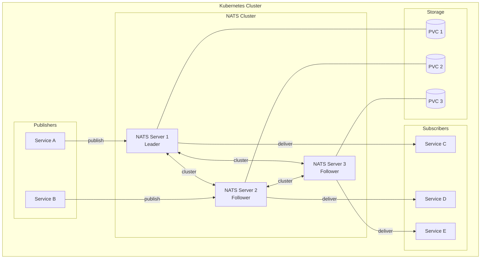
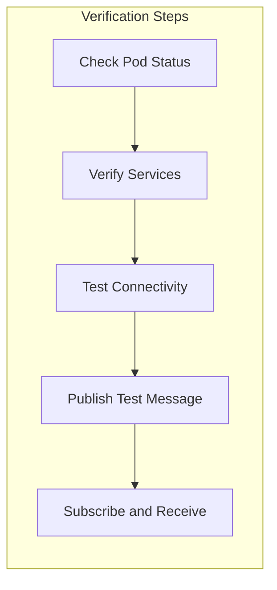
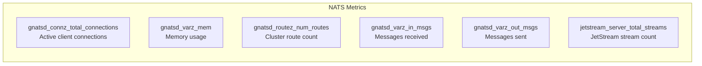

# How to Deploy NATS on Kubernetes

Author: [nawazdhandala](https://www.github.com/nawazdhandala)

Tags: NATS, Kubernetes, Messaging, DevOps, Cloud Native, Microservices

Description: Learn how to deploy NATS messaging system on Kubernetes using Helm charts, StatefulSets, and JetStream for persistent messaging with production-ready configurations.

---

NATS is a high-performance, lightweight messaging system designed for cloud-native applications. Deploying NATS on Kubernetes provides automatic scaling, self-healing, and seamless integration with your microservices architecture. In this guide, you will learn multiple deployment strategies, from simple single-node setups to production-grade clustered configurations with JetStream persistence.

## Architecture Overview

Before diving into deployment, understanding the NATS architecture helps you make better configuration decisions. The following diagram shows how NATS fits into a typical Kubernetes environment.



## Prerequisites

Ensure you have the following tools installed and configured before proceeding with the deployment.

```bash
# Verify kubectl is installed and connected to your cluster
kubectl version --client

# Check cluster connectivity
kubectl cluster-info

# Install Helm if not already present
curl https://raw.githubusercontent.com/helm/helm/main/scripts/get-helm-3 | bash

# Verify Helm installation
helm version
```

## Method 1: Deploy NATS Using Helm (Recommended)

Helm simplifies NATS deployment by managing all the necessary Kubernetes resources. The official NATS Helm chart provides sensible defaults and extensive customization options.

### Step 1: Add the NATS Helm Repository

Add the official NATS Helm repository to access the charts.

```bash
# Add the NATS Helm repository
helm repo add nats https://nats-io.github.io/k8s/helm/charts/

# Update local Helm repository cache
helm repo update

# Search for available NATS charts and versions
helm search repo nats
```

### Step 2: Create a Namespace for NATS

Isolating NATS in its own namespace improves organization and allows for namespace-level resource quotas and network policies.

```bash
# Create a dedicated namespace for NATS
kubectl create namespace nats

# Verify the namespace was created
kubectl get namespace nats
```

### Step 3: Install NATS with Default Configuration

For development or testing environments, the default configuration works well. The following command deploys a single NATS server.

```bash
# Install NATS with default settings
helm install nats nats/nats --namespace nats

# Check the deployment status
kubectl get pods -n nats -w
```

### Step 4: Configure Production-Ready NATS

Production environments require clustering, persistence, and proper resource allocation. Create a values file that defines these settings.

The following configuration enables a 3-node NATS cluster with JetStream for message persistence. Resource limits prevent runaway memory usage, and anti-affinity rules distribute pods across different nodes.

`nats-values.yaml`:

```yaml
# NATS cluster configuration for production deployment
cluster:
  enabled: true        # Enable clustering for high availability
  replicas: 3          # Run 3 NATS servers for fault tolerance

# JetStream provides persistent messaging and streaming capabilities
jetstream:
  enabled: true        # Enable JetStream for persistence
  memStorage:
    enabled: true
    size: 2Gi          # In-memory storage for fast access
  fileStorage:
    enabled: true
    size: 10Gi         # Persistent disk storage
    storageClassName: standard  # Adjust based on your cluster

# Resource limits prevent resource exhaustion
resources:
  requests:
    cpu: 100m          # Minimum CPU guaranteed
    memory: 256Mi      # Minimum memory guaranteed
  limits:
    cpu: 500m          # Maximum CPU allowed
    memory: 1Gi        # Maximum memory allowed

# Pod anti-affinity spreads replicas across nodes
podTemplate:
  topologySpreadConstraints:
    - maxSkew: 1
      topologyKey: kubernetes.io/hostname
      whenUnsatisfiable: DoNotSchedule
      labelSelector:
        matchLabels:
          app.kubernetes.io/name: nats

# Monitor NATS with Prometheus metrics
promExporter:
  enabled: true        # Expose metrics endpoint
  port: 7777           # Metrics port for scraping
```

Apply the production configuration using Helm.

```bash
# Deploy NATS with production settings
helm install nats nats/nats \
  --namespace nats \
  --values nats-values.yaml

# Watch pods come up (expect 3 replicas)
kubectl get pods -n nats -w

# Verify all pods are running and ready
kubectl get pods -n nats -o wide
```

## Method 2: Deploy NATS Using Raw Kubernetes Manifests

For environments where Helm is unavailable or when you need complete control over resources, deploy NATS using native Kubernetes manifests.

### Step 1: Create the ConfigMap

The ConfigMap holds the NATS server configuration. Separating configuration from the deployment makes updates easier and follows the twelve-factor app methodology.

`nats-configmap.yaml`:

```yaml
# ConfigMap containing NATS server configuration
apiVersion: v1
kind: ConfigMap
metadata:
  name: nats-config
  namespace: nats
data:
  nats.conf: |
    # Server identification
    server_name: $HOSTNAME

    # Client connections listen on port 4222
    port: 4222

    # HTTP monitoring endpoint for health checks
    http_port: 8222

    # Cluster configuration for server-to-server communication
    cluster {
      name: nats-cluster
      port: 6222

      # Routes define how servers discover each other
      routes: [
        nats-route://nats-0.nats-headless.nats.svc.cluster.local:6222
        nats-route://nats-1.nats-headless.nats.svc.cluster.local:6222
        nats-route://nats-2.nats-headless.nats.svc.cluster.local:6222
      ]

      # Connect timeout for route establishment
      connect_retries: 120
    }

    # JetStream persistence configuration
    jetstream {
      store_dir: /data/jetstream
      max_memory_store: 1Gi
      max_file_store: 10Gi
    }

    # Logging configuration
    debug: false
    trace: false
    logtime: true
```

Apply the ConfigMap to your cluster.

```bash
# Create the namespace first if it does not exist
kubectl create namespace nats --dry-run=client -o yaml | kubectl apply -f -

# Apply the ConfigMap
kubectl apply -f nats-configmap.yaml

# Verify the ConfigMap was created
kubectl get configmap nats-config -n nats
```

### Step 2: Create the Headless Service

A headless Service provides stable network identities for StatefulSet pods. Each NATS server gets a predictable DNS name like `nats-0.nats-headless.nats.svc.cluster.local`.

`nats-headless-service.yaml`:

```yaml
# Headless Service for StatefulSet DNS resolution
apiVersion: v1
kind: Service
metadata:
  name: nats-headless
  namespace: nats
  labels:
    app: nats
spec:
  clusterIP: None      # Headless service - no cluster IP
  publishNotReadyAddresses: true  # DNS records before pods are ready
  selector:
    app: nats
  ports:
    - name: client
      port: 4222       # Client connection port
      targetPort: 4222
    - name: cluster
      port: 6222       # Cluster routing port
      targetPort: 6222
    - name: monitor
      port: 8222       # Monitoring HTTP port
      targetPort: 8222
```

### Step 3: Create the Client Service

A regular ClusterIP Service provides load-balanced access for client applications. Clients connect to a single endpoint instead of tracking individual server addresses.

`nats-client-service.yaml`:

```yaml
# Client-facing Service with load balancing
apiVersion: v1
kind: Service
metadata:
  name: nats
  namespace: nats
  labels:
    app: nats
spec:
  type: ClusterIP      # Internal cluster access only
  selector:
    app: nats
  ports:
    - name: client
      port: 4222       # Standard NATS client port
      targetPort: 4222
    - name: monitor
      port: 8222       # Monitoring endpoint
      targetPort: 8222
```

Apply both Services.

```bash
# Apply the headless Service
kubectl apply -f nats-headless-service.yaml

# Apply the client Service
kubectl apply -f nats-client-service.yaml

# Verify both Services exist
kubectl get services -n nats
```

### Step 4: Create the StatefulSet

StatefulSets provide stable identities and persistent storage for each NATS server. Unlike Deployments, StatefulSets maintain ordering guarantees and persistent volume claims.

`nats-statefulset.yaml`:

```yaml
# StatefulSet for NATS cluster deployment
apiVersion: apps/v1
kind: StatefulSet
metadata:
  name: nats
  namespace: nats
  labels:
    app: nats
spec:
  serviceName: nats-headless  # Reference to headless Service
  replicas: 3                  # 3-node cluster for high availability
  podManagementPolicy: Parallel  # Start all pods simultaneously
  selector:
    matchLabels:
      app: nats
  template:
    metadata:
      labels:
        app: nats
    spec:
      # Spread pods across different nodes
      affinity:
        podAntiAffinity:
          preferredDuringSchedulingIgnoredDuringExecution:
            - weight: 100
              podAffinityTerm:
                labelSelector:
                  matchLabels:
                    app: nats
                topologyKey: kubernetes.io/hostname

      # Graceful termination allows connections to drain
      terminationGracePeriodSeconds: 60

      containers:
        - name: nats
          image: nats:2.10-alpine  # Official NATS image

          ports:
            - containerPort: 4222
              name: client
            - containerPort: 6222
              name: cluster
            - containerPort: 8222
              name: monitor

          # Resource allocation
          resources:
            requests:
              cpu: 100m
              memory: 256Mi
            limits:
              cpu: 500m
              memory: 1Gi

          # Mount configuration and data volumes
          volumeMounts:
            - name: config
              mountPath: /etc/nats
            - name: data
              mountPath: /data

          # Start NATS with the configuration file
          command:
            - nats-server
            - --config=/etc/nats/nats.conf

          # Liveness probe restarts unhealthy pods
          livenessProbe:
            httpGet:
              path: /healthz
              port: 8222
            initialDelaySeconds: 10
            periodSeconds: 30
            timeoutSeconds: 5
            failureThreshold: 3

          # Readiness probe controls traffic routing
          readinessProbe:
            httpGet:
              path: /healthz
              port: 8222
            initialDelaySeconds: 5
            periodSeconds: 10
            timeoutSeconds: 5
            failureThreshold: 3

      volumes:
        - name: config
          configMap:
            name: nats-config

  # Persistent volume claim template for each pod
  volumeClaimTemplates:
    - metadata:
        name: data
      spec:
        accessModes:
          - ReadWriteOnce
        storageClassName: standard  # Adjust for your cluster
        resources:
          requests:
            storage: 10Gi
```

Deploy the StatefulSet and verify the cluster forms correctly.

```bash
# Apply the StatefulSet
kubectl apply -f nats-statefulset.yaml

# Watch pods start up (should see nats-0, nats-1, nats-2)
kubectl get pods -n nats -w

# Check persistent volume claims were created
kubectl get pvc -n nats

# View logs from the first pod to verify cluster formation
kubectl logs nats-0 -n nats | head -50
```

## Verify NATS Deployment

After deployment, verify the cluster is healthy and accepting connections.



### Check Cluster Health

Use the NATS CLI or kubectl to verify cluster status.

```bash
# Verify all pods are Running and Ready
kubectl get pods -n nats

# Check pod details for any issues
kubectl describe pods -n nats

# View NATS server information via monitoring endpoint
kubectl exec -n nats nats-0 -- wget -qO- http://localhost:8222/varz | head -20

# Check cluster routes are established
kubectl exec -n nats nats-0 -- wget -qO- http://localhost:8222/routez
```

### Test with NATS Box

The NATS Box container provides CLI tools for testing NATS functionality. Deploy it as a temporary pod to verify messaging works.

```bash
# Run NATS Box as an interactive pod
kubectl run nats-box --rm -it \
  --namespace nats \
  --image=natsio/nats-box:latest \
  --restart=Never \
  -- /bin/sh

# Inside the container, test basic connectivity
nats server ping -s nats://nats:4222

# Check server information
nats server info -s nats://nats:4222

# Create a test stream (JetStream)
nats stream add TEST \
  --subjects="test.*" \
  --storage=file \
  --replicas=3 \
  --retention=limits \
  --max-msgs=-1 \
  --max-bytes=-1 \
  --max-age=1h \
  -s nats://nats:4222

# Publish a test message
nats pub test.hello "Hello from Kubernetes" -s nats://nats:4222

# Subscribe to messages (run in another terminal)
nats sub "test.*" -s nats://nats:4222

# Exit the container
exit
```

## Configure Applications to Connect

Applications running in the same Kubernetes cluster can connect using the internal Service DNS name. The following examples show connection patterns for common languages.

### Node.js Connection Example

The NATS client library handles reconnection automatically. Configure your application to use the Kubernetes Service endpoint.

```javascript
// Node.js NATS client configuration
const { connect, StringCodec } = require('nats');

async function connectToNATS() {
  // Connect using Kubernetes Service DNS name
  const nc = await connect({
    servers: ['nats://nats.nats.svc.cluster.local:4222'],

    // Reconnection settings for resilience
    reconnect: true,
    maxReconnectAttempts: -1,  // Unlimited reconnection attempts
    reconnectTimeWait: 1000,   // Wait 1 second between attempts

    // Connection timeout
    timeout: 10000,  // 10 seconds
  });

  console.log(`Connected to ${nc.getServer()}`);

  const sc = StringCodec();

  // Subscribe to messages
  const sub = nc.subscribe('orders.*');
  (async () => {
    for await (const msg of sub) {
      console.log(`Received: ${sc.decode(msg.data)}`);
    }
  })();

  // Publish a message
  nc.publish('orders.new', sc.encode(JSON.stringify({
    id: 'order-123',
    item: 'Widget',
    quantity: 5
  })));

  return nc;
}

connectToNATS().catch(console.error);
```

### Python Connection Example

The nats-py library provides async support for Python applications.

```python
# Python NATS client configuration
import asyncio
import nats
from nats.errors import ConnectionClosedError, TimeoutError

async def connect_to_nats():
    # Connect using Kubernetes Service DNS name
    nc = await nats.connect(
        servers=["nats://nats.nats.svc.cluster.local:4222"],
        reconnect_time_wait=1,        # Wait 1 second between attempts
        max_reconnect_attempts=-1,    # Unlimited reconnection attempts
        connect_timeout=10,           # 10 second connection timeout
    )

    print(f"Connected to {nc.connected_url.netloc}")

    # Define message handler
    async def message_handler(msg):
        subject = msg.subject
        data = msg.data.decode()
        print(f"Received on '{subject}': {data}")

    # Subscribe to subject pattern
    await nc.subscribe("orders.*", cb=message_handler)

    # Publish a test message
    await nc.publish("orders.new", b'{"id": "order-456", "item": "Gadget"}')

    return nc

# Run the async function
asyncio.run(connect_to_nats())
```

### Go Connection Example

The official NATS Go client provides high performance for demanding applications.

```go
// Go NATS client configuration
package main

import (
    "fmt"
    "log"
    "time"

    "github.com/nats-io/nats.go"
)

func main() {
    // Configure connection options
    opts := []nats.Option{
        nats.Name("my-service"),
        nats.ReconnectWait(time.Second),     // Wait between reconnects
        nats.MaxReconnects(-1),               // Unlimited reconnection
        nats.Timeout(10 * time.Second),       // Connection timeout
        nats.DisconnectErrHandler(func(nc *nats.Conn, err error) {
            log.Printf("Disconnected: %v", err)
        }),
        nats.ReconnectHandler(func(nc *nats.Conn) {
            log.Printf("Reconnected to %s", nc.ConnectedUrl())
        }),
    }

    // Connect using Kubernetes Service DNS name
    nc, err := nats.Connect(
        "nats://nats.nats.svc.cluster.local:4222",
        opts...,
    )
    if err != nil {
        log.Fatal(err)
    }
    defer nc.Close()

    fmt.Printf("Connected to %s\n", nc.ConnectedUrl())

    // Subscribe to messages
    _, err = nc.Subscribe("orders.*", func(msg *nats.Msg) {
        fmt.Printf("Received on %s: %s\n", msg.Subject, string(msg.Data))
    })
    if err != nil {
        log.Fatal(err)
    }

    // Publish a message
    err = nc.Publish("orders.new", []byte(`{"id": "order-789"}`))
    if err != nil {
        log.Fatal(err)
    }

    // Keep the connection alive
    select {}
}
```

## Secure NATS with TLS

Production deployments should encrypt traffic using TLS. The following configuration enables TLS for both client and cluster connections.

### Step 1: Create TLS Certificates

Use cert-manager or generate certificates manually. The following example uses self-signed certificates for demonstration.

```bash
# Create a directory for certificates
mkdir -p nats-certs && cd nats-certs

# Generate CA private key
openssl genrsa -out ca.key 4096

# Generate CA certificate
openssl req -x509 -new -nodes -key ca.key -sha256 -days 365 \
  -out ca.crt -subj "/CN=NATS CA"

# Generate server private key
openssl genrsa -out server.key 2048

# Create server certificate signing request
openssl req -new -key server.key -out server.csr \
  -subj "/CN=nats.nats.svc.cluster.local"

# Create server certificate with SANs for all cluster members
cat > server-ext.cnf << EOF
authorityKeyIdentifier=keyid,issuer
basicConstraints=CA:FALSE
keyUsage = digitalSignature, nonRepudiation, keyEncipherment, dataEncipherment
subjectAltName = @alt_names

[alt_names]
DNS.1 = nats
DNS.2 = nats.nats.svc.cluster.local
DNS.3 = nats-0.nats-headless.nats.svc.cluster.local
DNS.4 = nats-1.nats-headless.nats.svc.cluster.local
DNS.5 = nats-2.nats-headless.nats.svc.cluster.local
DNS.6 = *.nats-headless.nats.svc.cluster.local
EOF

openssl x509 -req -in server.csr -CA ca.crt -CAkey ca.key \
  -CAcreateserial -out server.crt -days 365 -sha256 -extfile server-ext.cnf

# Create Kubernetes Secret from certificates
kubectl create secret generic nats-tls \
  --namespace nats \
  --from-file=ca.crt=ca.crt \
  --from-file=tls.crt=server.crt \
  --from-file=tls.key=server.key
```

### Step 2: Update NATS Configuration for TLS

Modify the ConfigMap to enable TLS encryption.

`nats-config-tls.yaml`:

```yaml
# ConfigMap with TLS configuration
apiVersion: v1
kind: ConfigMap
metadata:
  name: nats-config
  namespace: nats
data:
  nats.conf: |
    server_name: $HOSTNAME

    # TLS configuration for client connections
    tls {
      cert_file: /etc/nats-certs/tls.crt
      key_file: /etc/nats-certs/tls.key
      ca_file: /etc/nats-certs/ca.crt
      verify: true           # Require client certificates
      timeout: 2             # TLS handshake timeout in seconds
    }

    # Client connections on secure port
    port: 4222

    # Monitoring endpoint (consider securing in production)
    http_port: 8222

    # Cluster configuration with TLS
    cluster {
      name: nats-cluster
      port: 6222

      tls {
        cert_file: /etc/nats-certs/tls.crt
        key_file: /etc/nats-certs/tls.key
        ca_file: /etc/nats-certs/ca.crt
        verify: true
        timeout: 2
      }

      routes: [
        nats-route://nats-0.nats-headless.nats.svc.cluster.local:6222
        nats-route://nats-1.nats-headless.nats.svc.cluster.local:6222
        nats-route://nats-2.nats-headless.nats.svc.cluster.local:6222
      ]

      connect_retries: 120
    }

    jetstream {
      store_dir: /data/jetstream
      max_memory_store: 1Gi
      max_file_store: 10Gi
    }
```

### Step 3: Update StatefulSet for TLS

Add the TLS secret volume mount to the StatefulSet.

```yaml
# Add to StatefulSet spec.template.spec.containers[0].volumeMounts
- name: tls
  mountPath: /etc/nats-certs
  readOnly: true

# Add to StatefulSet spec.template.spec.volumes
- name: tls
  secret:
    secretName: nats-tls
```

## Monitor NATS with Prometheus

Observability is essential for production systems. NATS exposes Prometheus metrics that integrate with your existing monitoring stack.

### Prometheus ServiceMonitor

If using the Prometheus Operator, create a ServiceMonitor to scrape NATS metrics.

`nats-servicemonitor.yaml`:

```yaml
# ServiceMonitor for Prometheus Operator
apiVersion: monitoring.coreos.com/v1
kind: ServiceMonitor
metadata:
  name: nats
  namespace: nats
  labels:
    app: nats
spec:
  selector:
    matchLabels:
      app: nats
  endpoints:
    - port: monitor        # Scrape the monitoring port
      interval: 30s        # Scrape every 30 seconds
      path: /metrics       # Prometheus metrics endpoint
  namespaceSelector:
    matchNames:
      - nats
```

### Key Metrics to Monitor

The following metrics provide visibility into NATS cluster health.



Create alerts for critical conditions.

```yaml
# PrometheusRule for NATS alerts
apiVersion: monitoring.coreos.com/v1
kind: PrometheusRule
metadata:
  name: nats-alerts
  namespace: nats
spec:
  groups:
    - name: nats
      rules:
        # Alert when a cluster member is down
        - alert: NATSClusterMemberDown
          expr: up{job="nats"} == 0
          for: 1m
          labels:
            severity: critical
          annotations:
            summary: "NATS cluster member is down"
            description: "NATS server {{ $labels.pod }} has been down for more than 1 minute."

        # Alert on high memory usage
        - alert: NATSHighMemoryUsage
          expr: gnatsd_varz_mem > 800000000
          for: 5m
          labels:
            severity: warning
          annotations:
            summary: "NATS memory usage is high"
            description: "NATS server {{ $labels.pod }} is using more than 800MB of memory."

        # Alert when cluster routes are missing
        - alert: NATSClusterRoutesUnhealthy
          expr: gnatsd_routez_num_routes < 2
          for: 2m
          labels:
            severity: critical
          annotations:
            summary: "NATS cluster routes are unhealthy"
            description: "NATS server {{ $labels.pod }} has fewer than 2 cluster routes."
```

## Production Best Practices

Follow these recommendations for reliable NATS deployments in production.

### Resource Planning

Calculate resource requirements based on your message throughput and retention needs. JetStream storage should account for message size, retention period, and replication factor.

```yaml
# Example resource calculation for 1000 msg/sec, 1KB average, 24h retention
# Storage needed: 1000 * 1024 * 86400 * 3 replicas = ~265 GB per stream
# Memory for consumers: ~256MB per active consumer

resources:
  requests:
    cpu: 500m
    memory: 1Gi
  limits:
    cpu: 2000m
    memory: 4Gi
```

### Backup and Recovery

JetStream stores data on persistent volumes. Implement regular backup procedures using volume snapshots or NATS stream replication.

```bash
# Create a backup of stream data using NATS CLI
nats stream backup ORDERS /backup/orders-$(date +%Y%m%d) \
  -s nats://nats.nats.svc.cluster.local:4222

# Restore a stream from backup
nats stream restore ORDERS /backup/orders-20260202 \
  -s nats://nats.nats.svc.cluster.local:4222
```

### Network Policies

Restrict traffic to NATS servers using Kubernetes NetworkPolicies.

`nats-networkpolicy.yaml`:

```yaml
# NetworkPolicy restricting NATS access
apiVersion: networking.k8s.io/v1
kind: NetworkPolicy
metadata:
  name: nats-network-policy
  namespace: nats
spec:
  podSelector:
    matchLabels:
      app: nats
  policyTypes:
    - Ingress
  ingress:
    # Allow cluster-internal traffic between NATS servers
    - from:
        - podSelector:
            matchLabels:
              app: nats
      ports:
        - port: 6222    # Cluster routing

    # Allow client connections from specific namespaces
    - from:
        - namespaceSelector:
            matchLabels:
              nats-client: "true"
      ports:
        - port: 4222    # Client connections

    # Allow monitoring from prometheus namespace
    - from:
        - namespaceSelector:
            matchLabels:
              name: monitoring
      ports:
        - port: 8222    # Monitoring endpoint
```

## Troubleshooting Common Issues

When problems arise, use these techniques to diagnose and resolve issues.

### Cluster Not Forming

Check pod logs for route connection errors and verify DNS resolution.

```bash
# Check logs for connection errors
kubectl logs -n nats nats-0 | grep -i "route\|cluster\|error"

# Verify DNS resolution between pods
kubectl exec -n nats nats-0 -- nslookup nats-1.nats-headless.nats.svc.cluster.local

# Check if cluster routes are established
kubectl exec -n nats nats-0 -- wget -qO- http://localhost:8222/routez
```

### JetStream Storage Issues

Verify persistent volume claims are bound and have sufficient space.

```bash
# Check PVC status
kubectl get pvc -n nats

# Describe PVC for detailed information
kubectl describe pvc data-nats-0 -n nats

# Check storage usage inside the container
kubectl exec -n nats nats-0 -- df -h /data
```

### Connection Timeouts

Verify the Service is routing traffic correctly and pods are ready.

```bash
# Check Service endpoints
kubectl get endpoints nats -n nats

# Test connectivity from within the cluster
kubectl run test-connection --rm -it --image=busybox --restart=Never -- \
  nc -zv nats.nats.svc.cluster.local 4222

# Check pod readiness
kubectl get pods -n nats -o custom-columns=NAME:.metadata.name,READY:.status.conditions[?(@.type=="Ready")].status
```

## Cleanup

Remove all NATS resources when no longer needed.

```bash
# If installed with Helm
helm uninstall nats --namespace nats

# Delete the namespace (removes all resources)
kubectl delete namespace nats

# If using manual manifests, delete in reverse order
kubectl delete -f nats-statefulset.yaml
kubectl delete -f nats-client-service.yaml
kubectl delete -f nats-headless-service.yaml
kubectl delete -f nats-configmap.yaml

# Delete persistent volume claims manually if needed
kubectl delete pvc -n nats -l app=nats
```

---

Deploying NATS on Kubernetes provides a solid foundation for event-driven microservices architectures. Starting with Helm for simplicity and moving to customized manifests as requirements evolve gives you the flexibility to match your operational needs. Remember to implement proper monitoring, security, and backup procedures before running production workloads.
