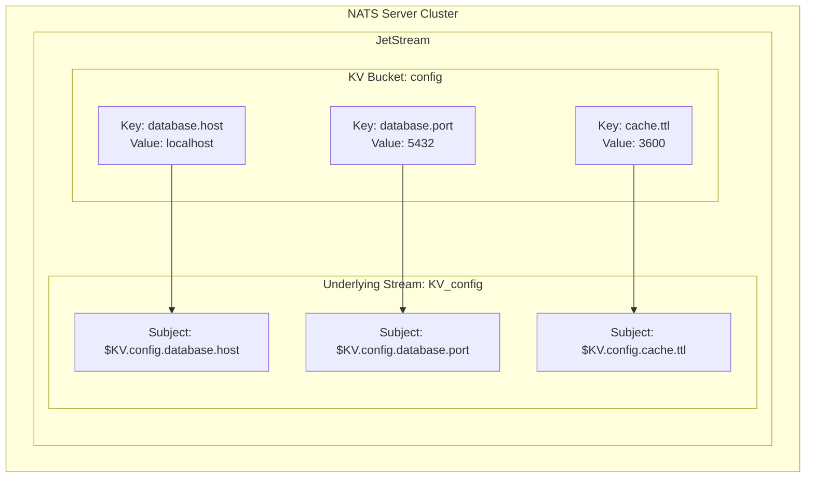
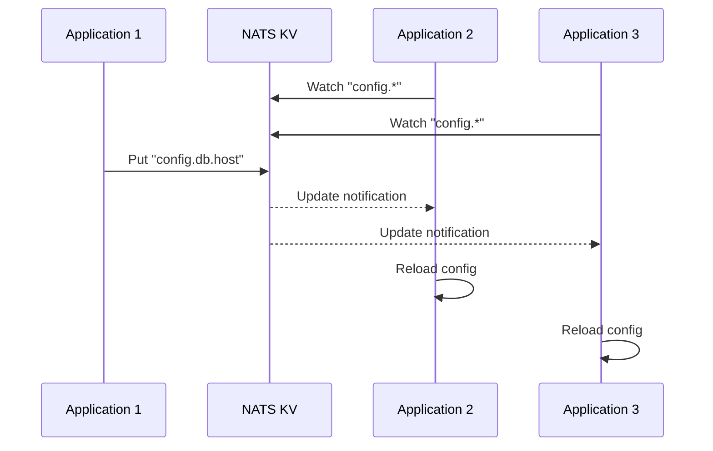
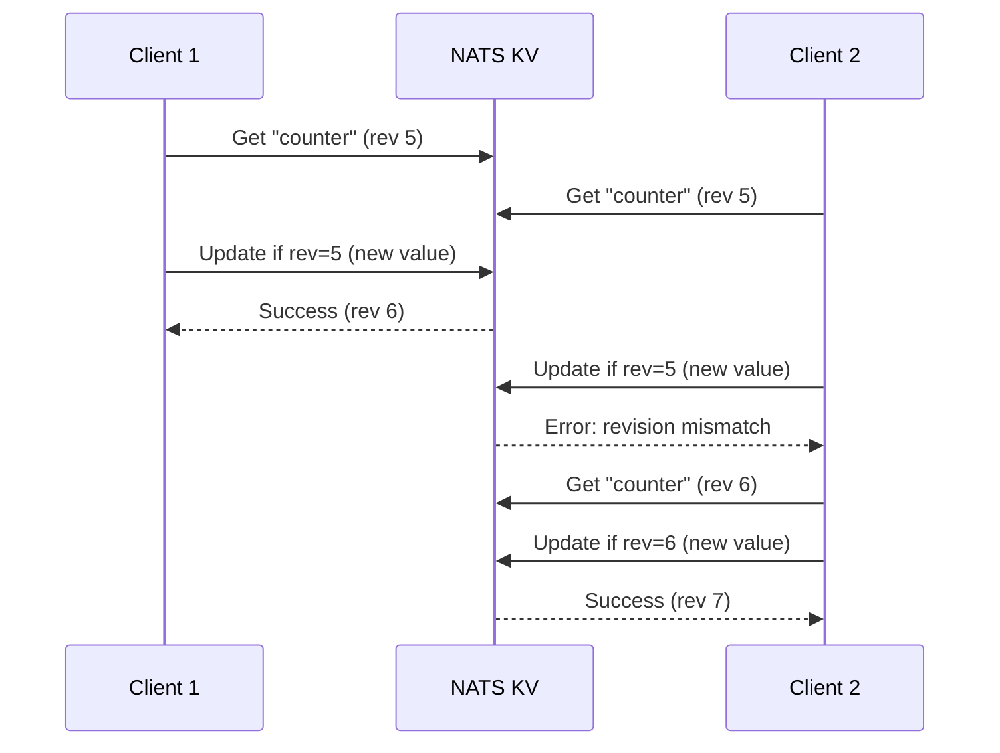
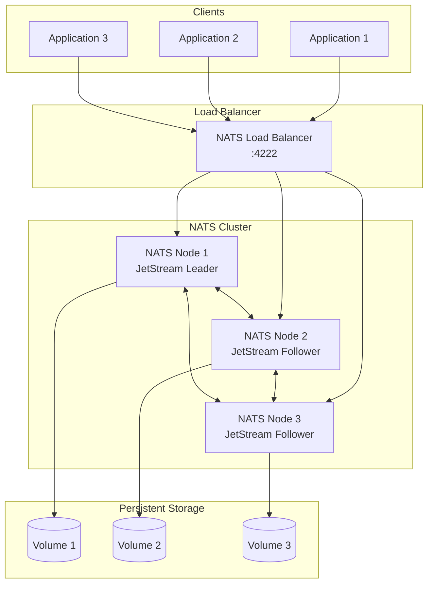

# How to Implement Key-Value Store with NATS

Author: [nawazdhandala](https://www.github.com/nawazdhandala)

Tags: NATS, Key-Value Store, Distributed Systems, Messaging, Go, Node.js, DevOps

Description: A practical guide to implementing key-value storage with NATS JetStream, covering bucket operations, watchers, TTL configuration, and production deployment patterns.

---

NATS JetStream provides a distributed key-value store that combines the simplicity of Redis with the reliability of a distributed messaging system. Unlike traditional KV stores, NATS KV is built on top of JetStream streams, giving you persistence, replication, and real-time change notifications out of the box.

## Understanding NATS Key-Value Store

NATS KV is not a standalone database. Instead, it uses JetStream streams under the hood to store key-value pairs. Each KV bucket maps to a dedicated stream, and each key becomes a subject within that stream.



### Why Use NATS KV Over Redis?

- **Built-in clustering** - Replication happens automatically across NATS nodes
- **Change notifications** - Watch keys for real-time updates
- **History tracking** - Keep multiple versions of values
- **Message-based architecture** - Integrates naturally with NATS messaging
- **No additional infrastructure** - If you already use NATS, KV is included

## Setting Up NATS with JetStream

Before using KV, you need NATS running with JetStream enabled.

### Docker Compose Setup

The following configuration spins up a NATS server with JetStream and persistent storage enabled.

```yaml
version: '3.8'
services:
  nats:
    image: nats:2.10-alpine
    command: >
      -js
      -sd /data
      -m 8222
    ports:
      - "4222:4222"   # Client connections
      - "8222:8222"   # HTTP monitoring
    volumes:
      - nats-data:/data

volumes:
  nats-data:
```

### Production Configuration

For production environments, use a configuration file that defines memory limits, storage paths, and cluster settings.

```conf
# nats-server.conf
server_name: nats-1

jetstream {
  store_dir: /data/jetstream
  max_memory_store: 1GB
  max_file_store: 10GB
}

# Enable monitoring
http_port: 8222

# Cluster configuration for HA
cluster {
  name: nats-cluster
  listen: 0.0.0.0:6222
  routes: [
    nats-route://nats-2:6222
    nats-route://nats-3:6222
  ]
}
```

## Basic KV Operations in Go

Go provides excellent NATS support through the official nats.go library. Let me walk through the essential operations.

### Creating a KV Bucket

Buckets are containers for related key-value pairs. Always configure replication and history based on your durability requirements.

```go
package main

import (
    "context"
    "log"
    "time"

    "github.com/nats-io/nats.go"
    "github.com/nats-io/nats.go/jetstream"
)

func main() {
    // Connect to NATS server
    nc, err := nats.Connect("nats://localhost:4222")
    if err != nil {
        log.Fatal(err)
    }
    defer nc.Close()

    // Create JetStream context
    js, err := jetstream.New(nc)
    if err != nil {
        log.Fatal(err)
    }

    ctx := context.Background()

    // Create a KV bucket with configuration options
    // Replicas: 3 ensures data survives node failures
    // History: 5 keeps last 5 versions of each key
    // TTL: automatically expires keys after 1 hour
    kv, err := js.CreateKeyValue(ctx, jetstream.KeyValueConfig{
        Bucket:      "app-config",
        Description: "Application configuration store",
        Replicas:    3,
        History:     5,
        TTL:         time.Hour,
        Storage:     jetstream.FileStorage,
    })
    if err != nil {
        log.Fatal(err)
    }

    log.Printf("Created bucket: %s", kv.Bucket())
}
```

### Put and Get Operations

The Put operation stores a value, while Get retrieves the latest version along with metadata like revision number and timestamp.

```go
func basicOperations(kv jetstream.KeyValue) {
    ctx := context.Background()

    // Put a value - returns revision number for optimistic locking
    revision, err := kv.Put(ctx, "database.host", []byte("postgres.internal"))
    if err != nil {
        log.Fatal(err)
    }
    log.Printf("Stored with revision: %d", revision)

    // Get a value - returns entry with metadata
    entry, err := kv.Get(ctx, "database.host")
    if err != nil {
        if err == jetstream.ErrKeyNotFound {
            log.Println("Key does not exist")
            return
        }
        log.Fatal(err)
    }

    log.Printf("Key: %s", entry.Key())
    log.Printf("Value: %s", string(entry.Value()))
    log.Printf("Revision: %d", entry.Revision())
    log.Printf("Created: %v", entry.Created())
}
```

### Delete and Purge Operations

Delete marks a key as deleted but preserves history. Purge removes all history for a key, freeing storage immediately.

```go
func deleteOperations(kv jetstream.KeyValue) {
    ctx := context.Background()

    // Delete a key - marks as deleted, keeps in history
    err := kv.Delete(ctx, "temporary.key")
    if err != nil {
        log.Fatal(err)
    }

    // Purge a key - removes all history for the key
    // Use when you need to free storage immediately
    err = kv.Purge(ctx, "sensitive.data")
    if err != nil {
        log.Fatal(err)
    }

    // Purge entire bucket - removes all keys and history
    err = kv.PurgeDeletes(ctx)
    if err != nil {
        log.Fatal(err)
    }
}
```

## Key-Value Operations in Node.js

Node.js applications can use the nats.js library for KV operations. The async/await API makes operations clean and readable.

### Setting Up the Client

The connection factory pattern ensures proper cleanup and reconnection handling.

```javascript
const { connect, StringCodec } = require('nats');

async function createKVStore() {
    // Connect to NATS with reconnection settings
    const nc = await connect({
        servers: ['nats://localhost:4222'],
        reconnect: true,
        maxReconnectAttempts: -1, // Unlimited reconnection attempts
        reconnectTimeWait: 1000,
    });

    // Access JetStream manager
    const js = nc.jetstream();
    const jsm = await nc.jetstreamManager();

    // Create KV bucket with persistence and replication
    const kv = await js.views.kv('sessions', {
        history: 1,           // Keep only latest value
        ttl: 30 * 60 * 1000,  // 30 minute TTL for sessions
        replicas: 3,
        storage: 'file',
    });

    return { nc, kv };
}
```

### CRUD Operations

The string codec converts between bytes and strings automatically, simplifying value handling.

```javascript
const { StringCodec } = require('nats');
const sc = StringCodec();

async function sessionOperations(kv) {
    // Store a session with JSON payload
    const sessionData = {
        userId: 'user-123',
        email: 'user@example.com',
        roles: ['admin', 'editor'],
        createdAt: new Date().toISOString(),
    };

    // Put encodes and stores the value
    await kv.put('session:abc123', sc.encode(JSON.stringify(sessionData)));

    // Retrieve and decode the session
    const entry = await kv.get('session:abc123');
    if (entry) {
        const session = JSON.parse(sc.decode(entry.value));
        console.log('Session:', session);
        console.log('Revision:', entry.revision);
    }

    // Check if key exists without retrieving value
    const exists = await kv.get('session:nonexistent');
    if (!exists) {
        console.log('Session not found');
    }

    // Delete session on logout
    await kv.delete('session:abc123');
}
```

## Watching Keys for Changes

One of NATS KV's most powerful features is the ability to watch keys for real-time updates. Watchers receive notifications when values change, making them perfect for configuration management and cache invalidation.



### Implementing a Watcher in Go

Watchers can filter by key patterns and process updates as they arrive.

```go
func watchKeys(kv jetstream.KeyValue) {
    ctx := context.Background()

    // Watch all keys starting with "config."
    // The watcher receives a channel of key-value entries
    watcher, err := kv.Watch(ctx, "config.*")
    if err != nil {
        log.Fatal(err)
    }
    defer watcher.Stop()

    // Process updates as they arrive
    for entry := range watcher.Updates() {
        if entry == nil {
            // Initial load complete, now receiving live updates
            log.Println("Initial sync complete, watching for changes...")
            continue
        }

        // Check operation type based on entry state
        switch entry.Operation() {
        case jetstream.KeyValuePut:
            log.Printf("Updated: %s = %s (rev %d)",
                entry.Key(), string(entry.Value()), entry.Revision())
        case jetstream.KeyValueDelete:
            log.Printf("Deleted: %s (rev %d)",
                entry.Key(), entry.Revision())
        case jetstream.KeyValuePurge:
            log.Printf("Purged: %s", entry.Key())
        }
    }
}
```

### Configuration Reloader Pattern

A practical example combines watching with configuration management, allowing applications to reload settings without restarts.

```go
type Config struct {
    mu       sync.RWMutex
    values   map[string]string
    onChange func(key, value string)
}

func NewConfigWatcher(kv jetstream.KeyValue, onChange func(key, value string)) *Config {
    cfg := &Config{
        values:   make(map[string]string),
        onChange: onChange,
    }

    go cfg.watchLoop(kv)
    return cfg
}

func (c *Config) watchLoop(kv jetstream.KeyValue) {
    ctx := context.Background()

    watcher, err := kv.WatchAll(ctx)
    if err != nil {
        log.Printf("Watch error: %v", err)
        return
    }

    for entry := range watcher.Updates() {
        if entry == nil {
            continue
        }

        c.mu.Lock()
        if entry.Operation() == jetstream.KeyValuePut {
            c.values[entry.Key()] = string(entry.Value())
            if c.onChange != nil {
                c.onChange(entry.Key(), string(entry.Value()))
            }
        } else {
            delete(c.values, entry.Key())
        }
        c.mu.Unlock()
    }
}

func (c *Config) Get(key string) (string, bool) {
    c.mu.RLock()
    defer c.mu.RUnlock()
    val, ok := c.values[key]
    return val, ok
}
```

## Optimistic Locking with Revisions

NATS KV supports optimistic locking through revision numbers. When updating a key, you can require that the current revision matches an expected value, preventing lost updates in concurrent scenarios.



### Implementing Compare-and-Swap

The Update method performs an atomic compare-and-swap, only succeeding if the revision matches.

```go
func compareAndSwap(kv jetstream.KeyValue) error {
    ctx := context.Background()

    // Read current value and revision
    entry, err := kv.Get(ctx, "counter")
    if err != nil {
        return err
    }

    currentValue, _ := strconv.Atoi(string(entry.Value()))
    newValue := currentValue + 1

    // Update only if revision hasn't changed
    // If another client updated the key, this fails
    _, err = kv.Update(ctx, "counter",
        []byte(strconv.Itoa(newValue)),
        entry.Revision())

    if err != nil {
        if err == jetstream.ErrKeyExists {
            // Revision mismatch - retry with fresh value
            return fmt.Errorf("concurrent modification detected")
        }
        return err
    }

    return nil
}

// Retry loop for atomic increment
func atomicIncrement(kv jetstream.KeyValue, key string, maxRetries int) error {
    ctx := context.Background()

    for i := 0; i < maxRetries; i++ {
        entry, err := kv.Get(ctx, key)
        if err != nil {
            return err
        }

        current, _ := strconv.Atoi(string(entry.Value()))
        _, err = kv.Update(ctx, key,
            []byte(strconv.Itoa(current+1)),
            entry.Revision())

        if err == nil {
            return nil
        }

        if err != jetstream.ErrKeyExists {
            return err
        }

        // Back off before retry
        time.Sleep(time.Millisecond * time.Duration(10*(i+1)))
    }

    return fmt.Errorf("max retries exceeded")
}
```

## History and Versioning

NATS KV can maintain a history of values for each key, enabling audit trails and rollback capabilities.

### Retrieving Historical Values

The History method returns all stored versions of a key, ordered from oldest to newest.

```go
func getHistory(kv jetstream.KeyValue) {
    ctx := context.Background()

    // Get all historical values for a key
    history, err := kv.History(ctx, "app.version")
    if err != nil {
        log.Fatal(err)
    }

    fmt.Println("Version history:")
    for _, entry := range history {
        fmt.Printf("  Rev %d: %s (at %v)\n",
            entry.Revision(),
            string(entry.Value()),
            entry.Created())
    }
}

// Get a specific revision
func getRevision(kv jetstream.KeyValue, key string, revision uint64) {
    ctx := context.Background()

    entry, err := kv.GetRevision(ctx, key, revision)
    if err != nil {
        log.Fatal(err)
    }

    fmt.Printf("Value at revision %d: %s\n", revision, string(entry.Value()))
}
```

### Implementing Rollback

Rolling back to a previous version requires fetching the old value and storing it as a new revision.

```go
func rollback(kv jetstream.KeyValue, key string, toRevision uint64) error {
    ctx := context.Background()

    // Get the historical value
    oldEntry, err := kv.GetRevision(ctx, key, toRevision)
    if err != nil {
        return fmt.Errorf("revision %d not found: %w", toRevision, err)
    }

    // Store it as a new value (creates new revision)
    _, err = kv.Put(ctx, key, oldEntry.Value())
    if err != nil {
        return fmt.Errorf("rollback failed: %w", err)
    }

    log.Printf("Rolled back %s to revision %d", key, toRevision)
    return nil
}
```

## TTL and Expiration

Keys can be configured to expire automatically, which is useful for sessions, caches, and temporary data.

### Bucket-Level TTL

Setting TTL at the bucket level applies the expiration to all keys within that bucket.

```go
func createCacheBucket(js jetstream.JetStream) (jetstream.KeyValue, error) {
    ctx := context.Background()

    // All keys in this bucket expire after 5 minutes
    return js.CreateKeyValue(ctx, jetstream.KeyValueConfig{
        Bucket:  "cache",
        TTL:     5 * time.Minute,
        History: 1, // No history needed for cache
        Storage: jetstream.MemoryStorage, // Faster for cache workloads
    })
}
```

### Refreshing TTL

To extend a key's lifetime, simply put the same value again. Each put resets the TTL timer.

```go
func refreshSession(kv jetstream.KeyValue, sessionID string) error {
    ctx := context.Background()

    // Get current session
    entry, err := kv.Get(ctx, sessionID)
    if err != nil {
        return err
    }

    // Re-put with same value to refresh TTL
    _, err = kv.Put(ctx, sessionID, entry.Value())
    return err
}
```

## Listing and Iterating Keys

NATS KV provides methods to list all keys or those matching a pattern.

```go
func listAllKeys(kv jetstream.KeyValue) {
    ctx := context.Background()

    // List all keys in the bucket
    keys, err := kv.Keys(ctx)
    if err != nil {
        log.Fatal(err)
    }

    fmt.Println("All keys in bucket:")
    for _, key := range keys {
        fmt.Printf("  - %s\n", key)
    }
}

func listKeysByPattern(kv jetstream.KeyValue, pattern string) {
    ctx := context.Background()

    // Use watch with include history to get all matching keys
    watcher, err := kv.Watch(ctx, pattern, jetstream.IncludeHistory())
    if err != nil {
        log.Fatal(err)
    }
    defer watcher.Stop()

    fmt.Printf("Keys matching %s:\n", pattern)
    for entry := range watcher.Updates() {
        if entry == nil {
            break // Initial load complete
        }
        if entry.Operation() == jetstream.KeyValuePut {
            fmt.Printf("  %s = %s\n", entry.Key(), string(entry.Value()))
        }
    }
}
```

## Production Deployment

### High Availability Architecture

Deploy NATS in a cluster for production workloads. The following diagram shows a typical setup with three nodes.



### Kubernetes Deployment

Use the official NATS Helm chart for Kubernetes deployments with JetStream enabled.

```yaml
# values.yaml for NATS Helm chart
nats:
  jetstream:
    enabled: true
    memStorage:
      enabled: true
      size: 2Gi
    fileStorage:
      enabled: true
      size: 10Gi
      storageClassName: fast-ssd

cluster:
  enabled: true
  replicas: 3

natsBox:
  enabled: true  # Useful for debugging
```

Deploy with Helm using the following command.

```bash
helm repo add nats https://nats-io.github.io/k8s/helm/charts/
helm install nats nats/nats -f values.yaml
```

### Monitoring KV Buckets

NATS exposes metrics that can be scraped by Prometheus for monitoring.

```go
func getBucketStatus(js jetstream.JetStream, bucketName string) {
    ctx := context.Background()

    kv, err := js.KeyValue(ctx, bucketName)
    if err != nil {
        log.Fatal(err)
    }

    status, err := kv.Status(ctx)
    if err != nil {
        log.Fatal(err)
    }

    fmt.Printf("Bucket: %s\n", status.Bucket())
    fmt.Printf("Values: %d\n", status.Values())
    fmt.Printf("History: %d\n", status.History())
    fmt.Printf("TTL: %v\n", status.TTL())
    fmt.Printf("Replicas: %d\n", status.Replicas())
    fmt.Printf("Bytes: %d\n", status.Bytes())
}
```

### Error Handling Best Practices

Robust error handling ensures your application degrades gracefully when NATS is unavailable.

```go
func resilientGet(kv jetstream.KeyValue, key string) ([]byte, error) {
    ctx, cancel := context.WithTimeout(context.Background(), 5*time.Second)
    defer cancel()

    entry, err := kv.Get(ctx, key)
    if err != nil {
        switch {
        case err == jetstream.ErrKeyNotFound:
            return nil, fmt.Errorf("key %s not found", key)
        case err == context.DeadlineExceeded:
            return nil, fmt.Errorf("timeout reading key %s", key)
        case err == nats.ErrConnectionClosed:
            return nil, fmt.Errorf("NATS connection lost")
        default:
            return nil, fmt.Errorf("error reading %s: %w", key, err)
        }
    }

    return entry.Value(), nil
}
```

## Use Cases and Patterns

### Feature Flags

Store feature flags that update in real-time across all application instances.

```go
type FeatureFlags struct {
    kv      jetstream.KeyValue
    flags   map[string]bool
    mu      sync.RWMutex
}

func NewFeatureFlags(kv jetstream.KeyValue) *FeatureFlags {
    ff := &FeatureFlags{
        kv:    kv,
        flags: make(map[string]bool),
    }
    go ff.watch()
    return ff
}

func (ff *FeatureFlags) IsEnabled(flag string) bool {
    ff.mu.RLock()
    defer ff.mu.RUnlock()
    return ff.flags[flag]
}

func (ff *FeatureFlags) watch() {
    ctx := context.Background()
    watcher, _ := ff.kv.Watch(ctx, "feature.*")

    for entry := range watcher.Updates() {
        if entry == nil {
            continue
        }

        ff.mu.Lock()
        if entry.Operation() == jetstream.KeyValuePut {
            ff.flags[entry.Key()] = string(entry.Value()) == "true"
        } else {
            delete(ff.flags, entry.Key())
        }
        ff.mu.Unlock()
    }
}
```

### Distributed Locks

Implement distributed locks using create-only semantics.

```go
func acquireLock(kv jetstream.KeyValue, lockName string, ttl time.Duration) (bool, uint64, error) {
    ctx := context.Background()

    // Create only succeeds if key doesn't exist
    revision, err := kv.Create(ctx, lockName, []byte(time.Now().String()))
    if err != nil {
        if err == jetstream.ErrKeyExists {
            return false, 0, nil // Lock held by another process
        }
        return false, 0, err
    }

    return true, revision, nil
}

func releaseLock(kv jetstream.KeyValue, lockName string, revision uint64) error {
    ctx := context.Background()

    // Only delete if we still hold the lock (same revision)
    return kv.Delete(ctx, lockName, jetstream.LastRevision(revision))
}
```

### Service Discovery

Use KV for lightweight service registration and discovery.

```go
func registerService(kv jetstream.KeyValue, serviceName, instanceID, address string) error {
    ctx := context.Background()

    registration := map[string]string{
        "address":   address,
        "timestamp": time.Now().Format(time.RFC3339),
    }

    data, _ := json.Marshal(registration)
    key := fmt.Sprintf("services.%s.%s", serviceName, instanceID)

    _, err := kv.Put(ctx, key, data)
    return err
}

func discoverServices(kv jetstream.KeyValue, serviceName string) ([]string, error) {
    ctx := context.Background()

    pattern := fmt.Sprintf("services.%s.*", serviceName)
    watcher, err := kv.Watch(ctx, pattern, jetstream.IncludeHistory())
    if err != nil {
        return nil, err
    }
    defer watcher.Stop()

    var addresses []string
    for entry := range watcher.Updates() {
        if entry == nil {
            break
        }
        if entry.Operation() == jetstream.KeyValuePut {
            var reg map[string]string
            json.Unmarshal(entry.Value(), &reg)
            addresses = append(addresses, reg["address"])
        }
    }

    return addresses, nil
}
```

## Summary

NATS Key-Value Store provides a powerful, distributed storage solution that integrates seamlessly with the NATS messaging ecosystem. Key takeaways include:

- **Buckets** organize related keys and define storage policies
- **Revisions** enable optimistic locking and prevent lost updates
- **Watchers** provide real-time change notifications
- **History** allows auditing and rollback capabilities
- **TTL** automatically expires temporary data

For applications already using NATS for messaging, adding KV storage requires no additional infrastructure. The combination of simplicity, reliability, and real-time capabilities makes NATS KV an excellent choice for configuration management, feature flags, session storage, and distributed coordination.

---

Start with a single NATS node for development, then scale to a three-node cluster for production. Monitor bucket metrics and set appropriate retention policies to balance durability with storage costs.
