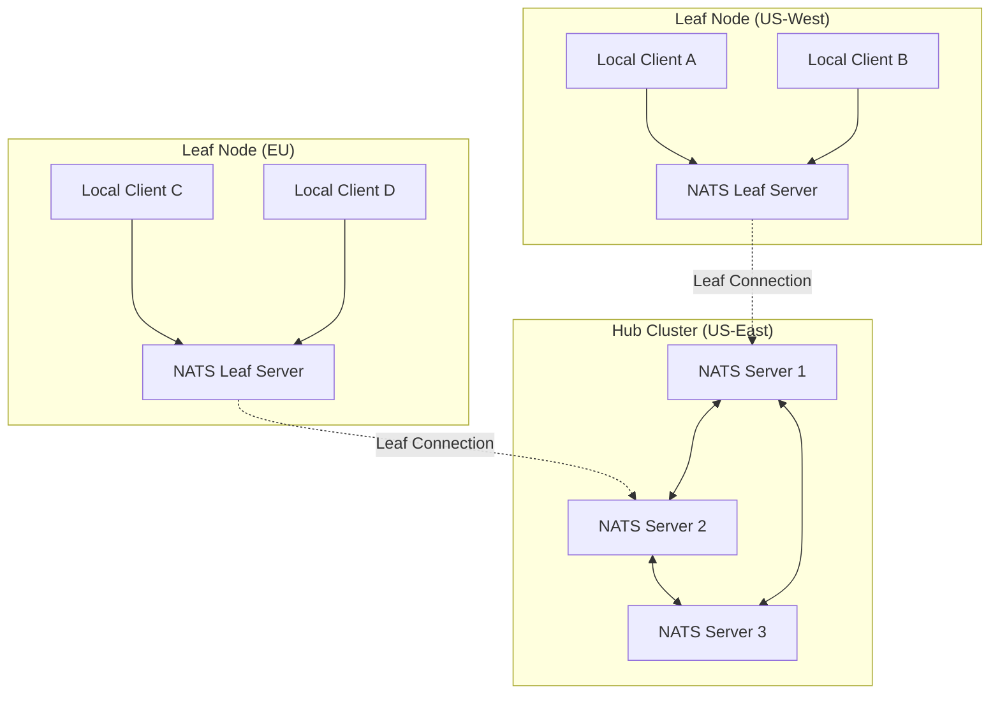
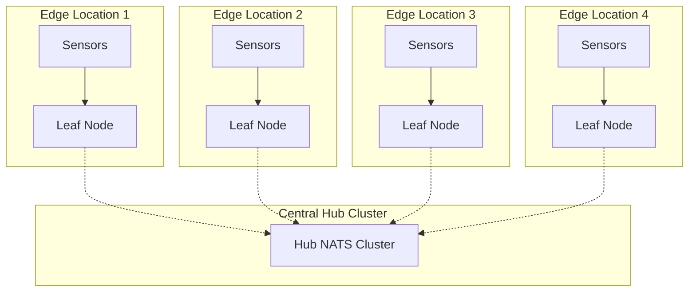
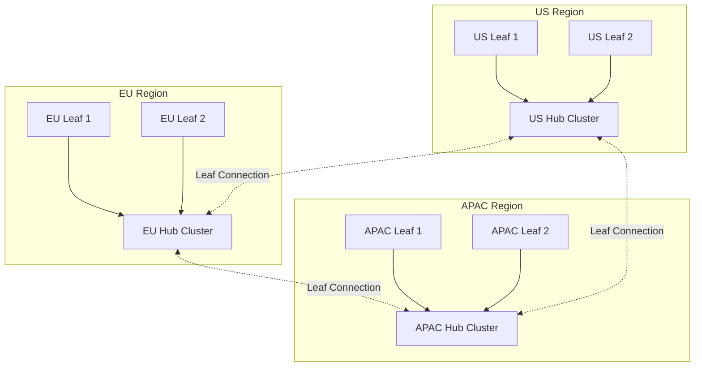
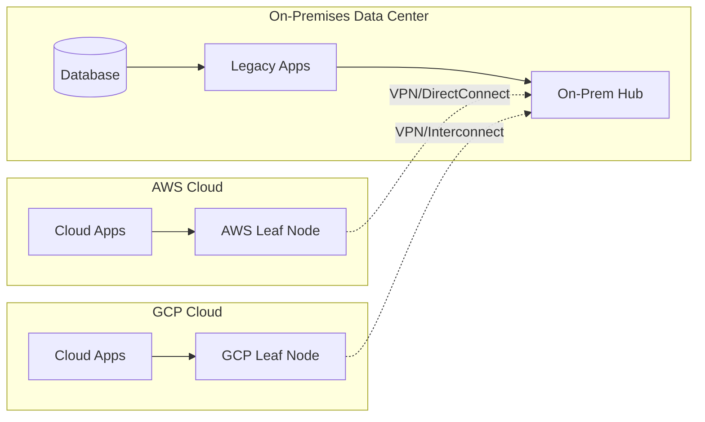

# How to Implement NATS Leaf Node Topologies

Author: [nawazdhandala](https://www.github.com/nawazdhandala)

Tags: NATS, Messaging, Distributed Systems, Microservices, Event-Driven Architecture, DevOps

Description: Learn how to implement NATS Leaf Node topologies for extending your messaging infrastructure across regions, clouds, and edge locations with practical configurations and deployment patterns.

---

NATS Leaf Nodes provide a powerful way to extend your messaging infrastructure without the complexity of full cluster membership. A leaf node connects to a hub cluster and transparently routes messages between local clients and the larger NATS ecosystem. Edge computing, multi-region deployments, and hybrid cloud architectures all benefit from leaf node topologies.

## Understanding Leaf Nodes

Leaf nodes establish a connection to one or more hub servers, creating a transparent bridge for message routing. Unlike cluster nodes, leaf nodes maintain their own local state and can operate independently if the connection to the hub is lost.



### Key Benefits of Leaf Nodes

- **Reduced Latency**: Local clients communicate through the local leaf node
- **Network Isolation**: Leaf nodes can span different networks and security zones
- **Scalability**: Add leaf nodes without reconfiguring the hub cluster
- **Resilience**: Leaf nodes continue operating during hub disconnections
- **Security**: Fine-grained access control between leaf and hub

## Basic Leaf Node Configuration

### Hub Cluster Configuration

The hub cluster needs to accept leaf node connections on a dedicated port. Here is a basic hub configuration that enables leaf node connections.

```hcl
# hub-server.conf
# Main NATS server configuration for the hub cluster

# Standard client port
port: 4222

# HTTP monitoring port for health checks and metrics
http_port: 8222

# Server identification
server_name: hub-server-1

# Cluster configuration for hub-to-hub communication
cluster {
    name: main-cluster
    port: 6222

    routes: [
        nats-route://hub-server-2:6222
        nats-route://hub-server-3:6222
    ]
}

# Leaf node configuration - this enables leaf connections
leafnodes {
    port: 7422

    # Optional: Require TLS for leaf connections
    # tls {
    #     cert_file: "/etc/nats/certs/server-cert.pem"
    #     key_file: "/etc/nats/certs/server-key.pem"
    #     ca_file: "/etc/nats/certs/ca.pem"
    # }
}

# Logging configuration
debug: false
trace: false
logtime: true
```

### Leaf Node Configuration

The leaf node connects to the hub cluster using the remotes configuration block. Below is a leaf node configuration that connects to the hub.

```hcl
# leaf-server.conf
# NATS Leaf Node configuration

# Local client port for applications in this region
port: 4222

# HTTP monitoring
http_port: 8222

# Server identification
server_name: leaf-us-west-1

# Leaf node remote connections
leafnodes {
    remotes: [
        {
            # Primary hub connection
            urls: [
                "nats-leaf://hub-server-1:7422"
                "nats-leaf://hub-server-2:7422"
                "nats-leaf://hub-server-3:7422"
            ]
        }
    ]
}

# Logging
debug: false
trace: false
logtime: true
```

### Verifying Leaf Node Connections

After starting both servers, verify the connection using the NATS CLI tool.

```bash
# Check hub server for connected leaf nodes
nats server info --server nats://hub-server-1:4222

# Check leaf node connection status
nats server info --server nats://leaf-server:4222

# List all leaf node connections on the hub
nats server report jetstream --server nats://hub-server-1:4222
```

## Secure Leaf Node Topologies

Production deployments require authentication and encryption. Here are configurations for secure leaf node connections.

### Hub with Authentication

Configure the hub to require credentials for leaf node connections. Accounts provide isolation between different leaf nodes.

```hcl
# hub-secure.conf
# Secure hub configuration with accounts

port: 4222
http_port: 8222
server_name: hub-secure-1

# Define accounts for isolation
accounts {
    # System account for server management
    SYS: {
        users: [
            { user: admin, password: $2a$11$secrethash }
        ]
    }

    # Account for US-West region leaf nodes
    US_WEST: {
        users: [
            { user: us_west_leaf, password: $2a$11$uswestsecret }
        ]

        # Export subjects that leaf nodes can subscribe to
        exports: [
            { stream: "events.>" }
            { service: "api.>" }
        ]

        # Import subjects from other accounts
        imports: [
            { stream: { account: EU, subject: "eu.events.>" } }
        ]
    }

    # Account for EU region leaf nodes
    EU: {
        users: [
            { user: eu_leaf, password: $2a$11$eusecret }
        ]

        exports: [
            { stream: "eu.events.>" }
        ]

        imports: [
            { stream: { account: US_WEST, subject: "events.>" } }
        ]
    }
}

# System account for monitoring
system_account: SYS

# Cluster configuration
cluster {
    name: secure-cluster
    port: 6222

    routes: [
        nats-route://hub-secure-2:6222
        nats-route://hub-secure-3:6222
    ]

    # Cluster authentication
    authorization {
        user: cluster_user
        password: cluster_secret
    }
}

# Leaf node configuration with TLS
leafnodes {
    port: 7422

    tls {
        cert_file: "/etc/nats/certs/server-cert.pem"
        key_file: "/etc/nats/certs/server-key.pem"
        ca_file: "/etc/nats/certs/ca.pem"
        verify: true
    }

    # Account-specific authorization
    authorization {
        users: [
            { user: us_west_leaf, password: leaf_secret_west, account: US_WEST }
            { user: eu_leaf, password: leaf_secret_eu, account: EU }
        ]
    }
}
```

### Leaf Node with Credentials

Configure the leaf node to authenticate with the hub using credentials.

```hcl
# leaf-secure.conf
# Secure leaf node configuration

port: 4222
http_port: 8222
server_name: leaf-us-west-secure

# Local account configuration
accounts {
    LOCAL: {
        users: [
            { user: app_user, password: app_secret }
        ]
    }
}

# Leaf node connections with authentication
leafnodes {
    remotes: [
        {
            urls: [
                "nats-leaf://hub-secure-1:7422"
                "nats-leaf://hub-secure-2:7422"
            ]

            # Credentials for connecting to hub
            credentials: "/etc/nats/creds/us-west-leaf.creds"

            # TLS configuration
            tls {
                cert_file: "/etc/nats/certs/leaf-cert.pem"
                key_file: "/etc/nats/certs/leaf-key.pem"
                ca_file: "/etc/nats/certs/ca.pem"
            }

            # Map local account to hub account
            account: LOCAL
        }
    ]
}
```

## Advanced Topology Patterns

### Hub-and-Spoke Topology

A hub-and-spoke topology works well for centralized data collection from multiple edge locations.



Configure each edge leaf node to connect to the central hub.

```hcl
# edge-leaf.conf
# Edge location leaf node

port: 4222
http_port: 8222
server_name: edge-location-1

leafnodes {
    remotes: [
        {
            urls: [
                "nats-leaf://hub-1.central.example.com:7422"
                "nats-leaf://hub-2.central.example.com:7422"
            ]
            credentials: "/etc/nats/creds/edge-1.creds"

            # Reconnect settings for unreliable connections
            reconnect_interval: "5s"
        }
    ]
}

# JetStream for local message persistence during hub disconnection
jetstream {
    store_dir: "/data/nats/jetstream"
    max_memory_store: 256MB
    max_file_store: 1GB
}
```

### Multi-Region Mesh Topology

For global deployments, create regional hubs that connect as leaf nodes to each other, forming a mesh.



Configure each regional hub to accept local leaf connections and connect to other regional hubs.

```hcl
# us-regional-hub.conf
# US Regional Hub - acts as both hub and leaf

port: 4222
http_port: 8222
server_name: us-hub-1

# Cluster for local US hub redundancy
cluster {
    name: us-cluster
    port: 6222
    routes: [
        nats-route://us-hub-2:6222
        nats-route://us-hub-3:6222
    ]
}

# Accept leaf connections from local US nodes
leafnodes {
    port: 7422

    # Connect to other regional hubs as a leaf
    remotes: [
        {
            urls: ["nats-leaf://eu-hub-1.example.com:7422"]
            credentials: "/etc/nats/creds/us-to-eu.creds"

            # Only route specific subjects between regions
            deny_imports: ["local.>"]
            deny_exports: ["local.>"]
        }
        {
            urls: ["nats-leaf://apac-hub-1.example.com:7422"]
            credentials: "/etc/nats/creds/us-to-apac.creds"

            deny_imports: ["local.>"]
            deny_exports: ["local.>"]
        }
    ]
}

# JetStream for the regional hub
jetstream {
    store_dir: "/data/nats/jetstream"
    max_memory_store: 4GB
    max_file_store: 100GB

    domain: us
}
```

### Hybrid Cloud Topology

Connect on-premises infrastructure with cloud deployments using leaf nodes.



Configure cloud leaf nodes to connect back to on-premises hub through secure network tunnels.

```hcl
# aws-leaf.conf
# AWS Cloud Leaf Node

port: 4222
http_port: 8222
server_name: aws-leaf-1

leafnodes {
    remotes: [
        {
            # Connect through VPN/DirectConnect to on-prem
            urls: [
                "nats-leaf://onprem-hub-1.internal:7422"
                "nats-leaf://onprem-hub-2.internal:7422"
            ]
            credentials: "/etc/nats/creds/aws-leaf.creds"

            tls {
                cert_file: "/etc/nats/certs/aws-leaf.pem"
                key_file: "/etc/nats/certs/aws-leaf-key.pem"
                ca_file: "/etc/nats/certs/ca.pem"
            }
        }
    ]
}

# Local JetStream for AWS applications
jetstream {
    store_dir: "/data/nats/jetstream"
    max_memory_store: 1GB
    max_file_store: 50GB

    domain: aws
}
```

## Subject Mapping and Filtering

Control which subjects flow between leaf nodes and hubs using imports and exports.

### Subject Filtering Configuration

Restrict which subjects a leaf node can access on the hub.

```hcl
# hub-with-filtering.conf
# Hub configuration with subject filtering per leaf

port: 4222
http_port: 8222

accounts {
    # Edge devices only get sensor data
    EDGE_SENSORS: {
        users: [{ user: edge_leaf, password: secret }]

        exports: [
            { stream: "sensors.>" }
            { stream: "commands.edge.>" }
        ]

        imports: [
            { stream: { account: CORE, subject: "alerts.critical.>" } }
        ]
    }

    # Backend services get full access
    CORE: {
        users: [{ user: core_leaf, password: secret }]

        exports: [
            { stream: ">" }
        ]
    }
}

leafnodes {
    port: 7422

    authorization {
        users: [
            { user: edge_leaf, password: edge_secret, account: EDGE_SENSORS }
            { user: core_leaf, password: core_secret, account: CORE }
        ]
    }
}
```

### Leaf Node Subject Remapping

Remap subjects at the leaf node level for namespace isolation.

```hcl
# leaf-with-remapping.conf
# Leaf node with subject remapping

port: 4222
http_port: 8222
server_name: leaf-site-a

leafnodes {
    remotes: [
        {
            urls: ["nats-leaf://hub:7422"]
            credentials: "/etc/nats/creds/site-a.creds"

            # Remap local subjects to include site prefix
            # Local "events.>" becomes "site-a.events.>" on hub
            account_mappings: {
                events: {
                    to: "site-a.events"
                }
                metrics: {
                    to: "site-a.metrics"
                }
            }
        }
    ]
}
```

## Kubernetes Deployment

Deploy NATS leaf nodes in Kubernetes using Helm charts.

### Hub Cluster Deployment

Deploy the hub cluster using the official NATS Helm chart.

```yaml
# hub-values.yaml
# Helm values for NATS Hub cluster

nats:
  image:
    repository: nats
    tag: 2.10-alpine

  jetstream:
    enabled: true
    memStorage:
      enabled: true
      size: 2Gi
    fileStorage:
      enabled: true
      size: 10Gi
      storageClassName: fast-ssd

cluster:
  enabled: true
  replicas: 3
  name: hub-cluster

leafnodes:
  enabled: true
  port: 7422

  # Expose leaf node port via LoadBalancer
  service:
    type: LoadBalancer
    annotations:
      service.beta.kubernetes.io/aws-load-balancer-internal: "true"

# Authentication using NATS accounts
auth:
  enabled: true
  resolver:
    type: full
    configMap:
      name: nats-accounts

# Monitoring
prometheus:
  enabled: true
  port: 7777
```

Deploy the hub cluster with Helm.

```bash
# Add NATS Helm repository
helm repo add nats https://nats-io.github.io/k8s/helm/charts/
helm repo update

# Create namespace
kubectl create namespace nats-hub

# Deploy hub cluster
helm install nats-hub nats/nats -n nats-hub -f hub-values.yaml

# Verify deployment
kubectl get pods -n nats-hub
kubectl get svc -n nats-hub
```

### Leaf Node Deployment

Deploy leaf nodes in separate Kubernetes clusters or namespaces.

```yaml
# leaf-values.yaml
# Helm values for NATS Leaf Node

nats:
  image:
    repository: nats
    tag: 2.10-alpine

  jetstream:
    enabled: true
    memStorage:
      enabled: true
      size: 512Mi
    fileStorage:
      enabled: true
      size: 5Gi
      storageClassName: standard

# No local cluster needed for single leaf
cluster:
  enabled: false

# Leaf node configuration
leafnodes:
  enabled: true

  remotes:
    - url: "nats-leaf://nats-hub-leafnodes.nats-hub.svc.cluster.local:7422"
      credentials:
        secret:
          name: nats-leaf-creds
          key: creds

# Local client service
service:
  type: ClusterIP
  port: 4222
```

Deploy the leaf node.

```bash
# Create namespace
kubectl create namespace nats-leaf

# Create credentials secret
kubectl create secret generic nats-leaf-creds \
  --from-file=creds=/path/to/leaf.creds \
  -n nats-leaf

# Deploy leaf node
helm install nats-leaf nats/nats -n nats-leaf -f leaf-values.yaml

# Verify connection
kubectl logs -n nats-leaf deployment/nats-leaf-nats
```

## Monitoring and Troubleshooting

### Health Check Endpoints

NATS provides HTTP endpoints for monitoring leaf node health.

```bash
# Check leaf node health
curl http://leaf-server:8222/healthz

# Get detailed server info
curl http://leaf-server:8222/varz

# Check leaf node connections
curl http://hub-server:8222/leafz

# Pretty print leaf connection details
curl -s http://hub-server:8222/leafz | jq '.leafs[] | {name: .name, account: .account, ip: .ip, rtt: .rtt}'
```

### Prometheus Metrics

Configure Prometheus to scrape NATS metrics for monitoring.

```yaml
# prometheus-scrape-config.yaml
# Prometheus scrape configuration for NATS

scrape_configs:
  - job_name: 'nats-hub'
    static_configs:
      - targets: ['nats-hub-1:7777', 'nats-hub-2:7777', 'nats-hub-3:7777']
    metrics_path: /metrics

  - job_name: 'nats-leafs'
    static_configs:
      - targets: ['nats-leaf-us-west:7777', 'nats-leaf-eu:7777']
    metrics_path: /metrics
```

Key metrics to monitor for leaf nodes are shown below.

```promql
# Number of connected leaf nodes
nats_leafnodes_connections

# Messages routed through leaf connections
rate(nats_leafnodes_sent_msgs[5m])
rate(nats_leafnodes_recv_msgs[5m])

# Leaf node connection latency (RTT)
nats_leafnodes_rtt_seconds

# Leaf node reconnection events
increase(nats_leafnodes_reconnects[1h])
```

### Common Issues and Solutions

**Issue: Leaf node cannot connect to hub**

Check network connectivity and credentials.

```bash
# Test network connectivity
nc -zv hub-server 7422

# Check leaf node logs for connection errors
journalctl -u nats-leaf -f

# Verify credentials file format
nats account info --creds /path/to/leaf.creds
```

**Issue: Messages not flowing between leaf and hub**

Verify subject permissions and account configuration.

```bash
# Check subscription routing on hub
curl -s http://hub:8222/routez | jq '.routes[].subscriptions'

# Check leaf subscriptions
curl -s http://hub:8222/leafz | jq '.leafs[].subscriptions'

# Test message flow with NATS CLI
nats sub "test.>" --server nats://hub:4222 &
nats pub "test.hello" "world" --server nats://leaf:4222
```

**Issue: High latency on leaf connections**

Latency between leaf and hub affects message delivery. Optimize with connection pooling and batching.

```hcl
# Optimize leaf connection settings
leafnodes {
    remotes: [
        {
            urls: ["nats-leaf://hub:7422"]

            # Increase connection buffer
            no_randomize: false

            # Enable compression for high-latency links
            compression: s2_auto
        }
    ]
}
```

## Best Practices

### Connection Resilience

Configure leaf nodes to handle network failures gracefully.

```hcl
# resilient-leaf.conf
# Leaf node with resilience settings

port: 4222
server_name: resilient-leaf

leafnodes {
    remotes: [
        {
            # Multiple hub URLs for failover
            urls: [
                "nats-leaf://hub-1:7422"
                "nats-leaf://hub-2:7422"
                "nats-leaf://hub-3:7422"
            ]

            credentials: "/etc/nats/creds/leaf.creds"

            # Reconnection settings
            reconnect: true

            # Connection timeout
            connect_timeout: "10s"
        }
    ]

    # Reconnect buffer for offline message queueing
    reconnect_buffer_size: 64MB
}

# Enable JetStream for message persistence during disconnection
jetstream {
    store_dir: "/data/nats/jetstream"
    max_memory_store: 256MB
    max_file_store: 2GB
}
```

### Security Checklist

- [ ] Enable TLS for all leaf node connections
- [ ] Use credential files instead of inline passwords
- [ ] Configure account-based isolation between leaf nodes
- [ ] Restrict subject access using exports/imports
- [ ] Rotate credentials periodically
- [ ] Monitor for unauthorized connection attempts
- [ ] Use network policies to restrict leaf node access

### Performance Tuning

Optimize leaf node performance for high-throughput scenarios.

```hcl
# high-performance-leaf.conf
# Optimized leaf node configuration

port: 4222
server_name: hp-leaf

# Increase connection limits
max_connections: 10000
max_payload: 8MB

# Write deadline for slow consumers
write_deadline: "10s"

leafnodes {
    remotes: [
        {
            urls: ["nats-leaf://hub:7422"]
            credentials: "/etc/nats/creds/leaf.creds"

            # Enable compression
            compression: s2_auto
        }
    ]
}

# JetStream with optimized storage
jetstream {
    store_dir: "/data/nats/jetstream"
    max_memory_store: 4GB
    max_file_store: 100GB

    # Sync interval for durability vs performance trade-off
    sync_interval: "60s"
}
```

---

NATS Leaf Nodes unlock powerful distributed messaging patterns without the operational complexity of full mesh clusters. Start with a simple hub-and-spoke topology, add security with accounts and TLS, then expand to multi-region or hybrid cloud deployments as your needs grow. The transparent message routing makes your applications location-agnostic while giving operators fine-grained control over data flow.
