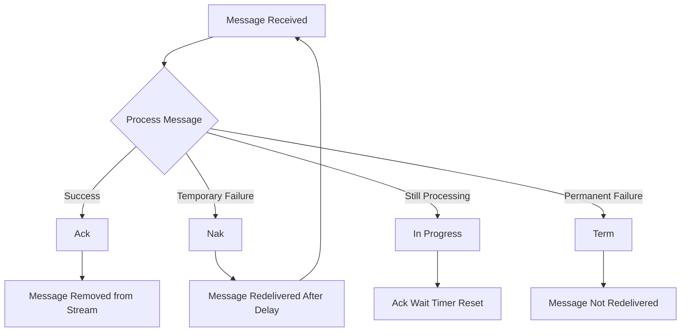
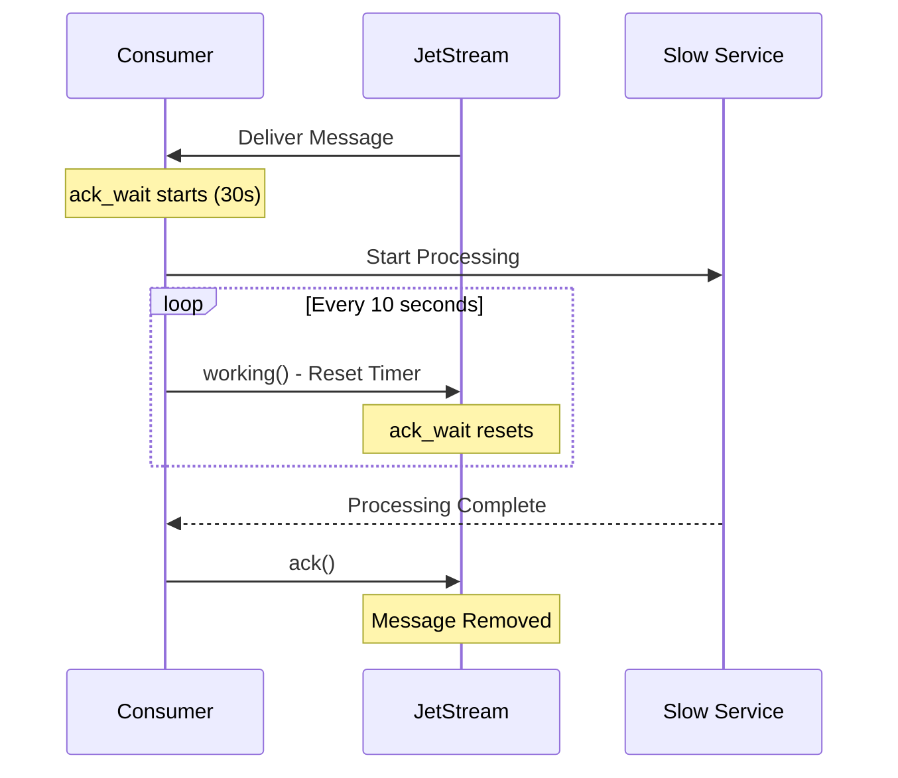
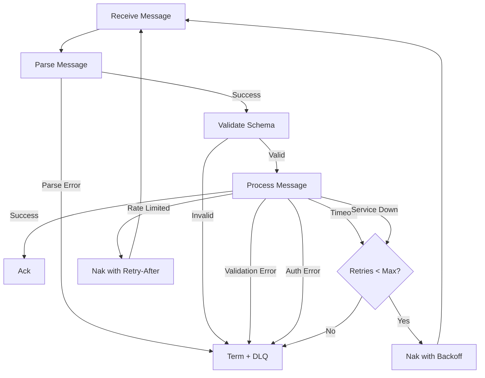

# How to Implement Message Acknowledgment in NATS

Author: [nawazdhandala](https://github.com/nawazdhandala)

Tags: NATS, Messaging, JetStream, Distributed Systems, Node.js, Go, Reliability

Description: Learn how to implement message acknowledgment in NATS using JetStream for reliable, at-least-once message delivery. Covers ack, nak, in-progress, and term acknowledgment types with practical examples.

---

Message acknowledgment ensures reliable message delivery in distributed systems. NATS JetStream provides multiple acknowledgment types to handle different scenarios, from successful processing to permanent failures. Understanding these patterns helps you build resilient applications that never lose messages.

## Why Message Acknowledgment Matters

| Scenario | Without Ack | With Ack |
|----------|-------------|----------|
| **Consumer crashes** | Message lost forever | Message redelivered |
| **Processing fails** | Silent data loss | Retry or dead letter |
| **Slow processing** | Duplicate delivery | In-progress keeps lease |
| **Poison message** | Infinite retry loop | Term stops redelivery |

## NATS JetStream Acknowledgment Types

NATS JetStream supports four acknowledgment types, each serving a specific purpose in message processing workflows.



## Setting Up NATS JetStream

Before implementing acknowledgments, you need a JetStream-enabled NATS server with a stream and consumer. Streams store messages persistently, and consumers track delivery state for each subscriber.

The following example creates a stream called ORDERS that captures all messages on subjects starting with "orders." and configures a durable consumer named order-processor.

```javascript
// NATS JetStream setup with stream and consumer configuration
// Streams persist messages, consumers track acknowledgment state
const { connect, AckPolicy, DeliverPolicy } = require('nats');

async function setupJetStream() {
  // Connect to NATS server
  const nc = await connect({ servers: 'localhost:4222' });

  // Get JetStream manager for administrative operations
  const jsm = await nc.jetstreamManager();

  // Create or update stream configuration
  // Streams capture and store messages from specified subjects
  await jsm.streams.add({
    name: 'ORDERS',
    subjects: ['orders.>'],
    retention: 'limits',      // Keep messages until limits hit
    max_msgs: 100000,         // Maximum messages to retain
    max_bytes: 1024 * 1024 * 100, // 100MB storage limit
    max_age: 24 * 60 * 60 * 1e9,  // 24 hours in nanoseconds
    storage: 'file',          // Persist to disk
    replicas: 3,              // Replicate across 3 servers
    duplicate_window: 60 * 1e9,   // Dedupe window of 60 seconds
  });

  // Create durable consumer with explicit acknowledgment
  // Durable consumers survive restarts and track delivery state
  await jsm.consumers.add('ORDERS', {
    durable_name: 'order-processor',
    ack_policy: AckPolicy.Explicit,    // Require manual ack
    ack_wait: 30 * 1e9,                // 30 second ack timeout
    max_deliver: 5,                     // Max redelivery attempts
    deliver_policy: DeliverPolicy.All,  // Start from first message
    max_ack_pending: 1000,              // Max unacked messages
  });

  console.log('JetStream configured successfully');
  return nc;
}
```

## Basic Message Acknowledgment

The simplest acknowledgment pattern calls ack() after successful message processing. Once acknowledged, JetStream removes the message from pending delivery and advances the consumer position.

```javascript
// Basic pull consumer with explicit acknowledgment
// Messages are fetched in batches and acked individually after processing
const { connect } = require('nats');

async function basicAckConsumer() {
  const nc = await connect({ servers: 'localhost:4222' });
  const js = nc.jetstream();

  // Get pull-based consumer for batch processing
  const consumer = await js.consumers.get('ORDERS', 'order-processor');

  // Process messages in a loop
  while (true) {
    // Fetch up to 10 messages, wait 5 seconds for messages
    const messages = await consumer.fetch({
      max_messages: 10,
      expires: 5000,
    });

    for await (const msg of messages) {
      try {
        // Decode and process the message
        const order = JSON.parse(msg.string());
        console.log(`Processing order: ${order.id}`);

        await processOrder(order);

        // Acknowledge successful processing
        // JetStream removes message from pending delivery
        msg.ack();
        console.log(`Order ${order.id} acknowledged`);

      } catch (error) {
        console.error(`Failed to process message: ${error.message}`);
        // Handle failure - covered in next sections
      }
    }
  }
}

async function processOrder(order) {
  // Simulate order processing
  await new Promise(resolve => setTimeout(resolve, 100));
  console.log(`Order ${order.id} processed successfully`);
}
```

## Negative Acknowledgment (Nak)

Negative acknowledgment signals temporary failure and requests redelivery. Use nak() when processing fails due to transient issues like network timeouts or temporary service unavailability. JetStream will redeliver the message after a configurable delay.

```javascript
// Consumer with nak for temporary failures
// Nak tells JetStream to redeliver the message after a delay
async function nakConsumer() {
  const nc = await connect({ servers: 'localhost:4222' });
  const js = nc.jetstream();
  const consumer = await js.consumers.get('ORDERS', 'order-processor');

  while (true) {
    const messages = await consumer.fetch({
      max_messages: 10,
      expires: 5000,
    });

    for await (const msg of messages) {
      const order = JSON.parse(msg.string());

      try {
        await processOrderWithExternalService(order);
        msg.ack();

      } catch (error) {
        // Check if error is temporary and retryable
        if (isTemporaryError(error)) {
          console.log(`Temporary failure for order ${order.id}, requesting redelivery`);

          // Nak with delay - message redelivered after 5 seconds
          // Without delay, redelivery happens immediately
          msg.nak(5000);

        } else {
          // Permanent failure - handle differently
          console.error(`Permanent failure for order ${order.id}: ${error.message}`);
          msg.term();
        }
      }
    }
  }
}

function isTemporaryError(error) {
  // Network timeouts and service unavailable are temporary
  const temporaryCodes = ['ETIMEDOUT', 'ECONNRESET', 'ECONNREFUSED'];
  const temporaryStatuses = [408, 429, 500, 502, 503, 504];

  return temporaryCodes.includes(error.code) ||
         temporaryStatuses.includes(error.status);
}

async function processOrderWithExternalService(order) {
  // Call external payment service
  const response = await fetch('https://payments.example.com/charge', {
    method: 'POST',
    body: JSON.stringify(order),
    headers: { 'Content-Type': 'application/json' },
  });

  if (!response.ok) {
    const error = new Error(`Payment failed: ${response.status}`);
    error.status = response.status;
    throw error;
  }

  return response.json();
}
```

## In-Progress Acknowledgment

For long-running tasks, the default ack wait timeout might expire before processing completes. Calling working() (also known as in-progress ack) resets the timeout, preventing unwanted redelivery while legitimate processing continues.



The following example demonstrates a heartbeat mechanism that keeps the message lease active during slow database migrations.

```javascript
// Long-running task with in-progress acknowledgment
// working() resets the ack timeout to prevent redelivery during processing
async function longRunningConsumer() {
  const nc = await connect({ servers: 'localhost:4222' });
  const js = nc.jetstream();
  const consumer = await js.consumers.get('ORDERS', 'order-processor');

  while (true) {
    const messages = await consumer.fetch({
      max_messages: 1,  // Process one at a time for long tasks
      expires: 5000,
    });

    for await (const msg of messages) {
      const order = JSON.parse(msg.string());
      console.log(`Starting long-running task for order ${order.id}`);

      // Set up heartbeat to keep message lease active
      // Consumer ack_wait is 30 seconds, so heartbeat every 10 seconds
      const heartbeatInterval = setInterval(() => {
        console.log(`Heartbeat for order ${order.id}`);
        msg.working();  // Reset ack timeout
      }, 10000);

      try {
        // Long-running processing that may take minutes
        await performLongRunningTask(order);

        clearInterval(heartbeatInterval);
        msg.ack();
        console.log(`Order ${order.id} completed and acknowledged`);

      } catch (error) {
        clearInterval(heartbeatInterval);
        console.error(`Task failed for order ${order.id}: ${error.message}`);
        msg.nak(10000);  // Retry after 10 seconds
      }
    }
  }
}

async function performLongRunningTask(order) {
  // Simulate task that takes 2 minutes
  const steps = ['validate', 'transform', 'enrich', 'store'];

  for (const step of steps) {
    console.log(`Order ${order.id}: executing ${step}`);
    await new Promise(resolve => setTimeout(resolve, 30000));
  }

  console.log(`Order ${order.id}: all steps completed`);
}
```

## Terminal Acknowledgment

Terminal acknowledgment (term) signals permanent failure. JetStream stops redelivering the message, preventing infinite retry loops for messages that can never succeed. Combine term() with dead letter queue publishing to preserve failed messages for later analysis.

```javascript
// Consumer with terminal ack and dead letter queue
// Term stops redelivery for messages that will never succeed
async function termConsumer() {
  const nc = await connect({ servers: 'localhost:4222' });
  const js = nc.jetstream();
  const consumer = await js.consumers.get('ORDERS', 'order-processor');

  while (true) {
    const messages = await consumer.fetch({
      max_messages: 10,
      expires: 5000,
    });

    for await (const msg of messages) {
      const order = JSON.parse(msg.string());

      // Check redelivery count from message metadata
      const redeliveries = msg.info.redeliveryCount;
      console.log(`Processing order ${order.id}, delivery attempt ${redeliveries + 1}`);

      try {
        await processOrder(order);
        msg.ack();

      } catch (error) {
        // If max retries reached or permanent error, terminate
        if (redeliveries >= 4 || isPermanentError(error)) {
          console.log(`Terminating order ${order.id} after ${redeliveries + 1} attempts`);

          // Send to dead letter queue before terminating
          await publishToDeadLetter(js, order, error, msg.info);

          // Term stops all future redelivery attempts
          msg.term();

        } else {
          // Temporary failure, request redelivery with backoff
          const delay = Math.min(1000 * Math.pow(2, redeliveries), 30000);
          console.log(`Nak order ${order.id}, retry in ${delay}ms`);
          msg.nak(delay);
        }
      }
    }
  }
}

function isPermanentError(error) {
  // Validation errors, auth failures, not found - won't succeed on retry
  const permanentStatuses = [400, 401, 403, 404, 422];
  return permanentStatuses.includes(error.status) ||
         error.message.includes('validation failed') ||
         error.message.includes('invalid');
}

async function publishToDeadLetter(js, order, error, messageInfo) {
  // Publish failed message to dead letter subject for later analysis
  const deadLetter = {
    originalOrder: order,
    error: {
      message: error.message,
      stack: error.stack,
    },
    metadata: {
      stream: messageInfo.stream,
      consumer: messageInfo.consumer,
      deliveryCount: messageInfo.redeliveryCount + 1,
      timestamp: new Date().toISOString(),
    },
  };

  await js.publish('orders.deadletter', JSON.stringify(deadLetter));
  console.log(`Order ${order.id} sent to dead letter queue`);
}
```

## Acknowledgment Flow with Error Handling

A production consumer needs comprehensive error handling that distinguishes between error types and responds appropriately. The following diagram shows the complete decision flow.



The comprehensive consumer implementation demonstrates all acknowledgment types working together with proper error classification.

```javascript
// Production-ready consumer with comprehensive ack handling
// Handles all error types with appropriate acknowledgment responses
const { connect, StringCodec, AckPolicy } = require('nats');

class OrderConsumer {
  constructor(options = {}) {
    this.maxRetries = options.maxRetries || 5;
    this.baseDelay = options.baseDelay || 1000;
    this.maxDelay = options.maxDelay || 30000;
    this.ackWait = options.ackWait || 30000;
    this.heartbeatInterval = options.heartbeatInterval || 10000;
  }

  async start() {
    this.nc = await connect({ servers: 'localhost:4222' });
    this.js = this.nc.jetstream();
    this.consumer = await this.js.consumers.get('ORDERS', 'order-processor');

    console.log('Order consumer started');
    await this.processMessages();
  }

  async processMessages() {
    while (true) {
      const messages = await this.consumer.fetch({
        max_messages: 10,
        expires: 5000,
      });

      for await (const msg of messages) {
        await this.handleMessage(msg);
      }
    }
  }

  async handleMessage(msg) {
    let order;
    let heartbeat;

    try {
      // Parse message - failure is permanent
      order = this.parseMessage(msg);

      // Validate message schema - failure is permanent
      this.validateOrder(order);

      // Start heartbeat for long-running processing
      heartbeat = this.startHeartbeat(msg, order.id);

      // Process the order
      await this.processOrder(order);

      // Success - acknowledge and remove from stream
      this.stopHeartbeat(heartbeat);
      msg.ack();
      this.logAck(order.id, 'ack', 'Processing completed successfully');

    } catch (error) {
      this.stopHeartbeat(heartbeat);
      await this.handleError(msg, order, error);
    }
  }

  parseMessage(msg) {
    try {
      return JSON.parse(msg.string());
    } catch (error) {
      throw new PermanentError(`Failed to parse message: ${error.message}`);
    }
  }

  validateOrder(order) {
    if (!order.id) {
      throw new PermanentError('Order missing required field: id');
    }
    if (!order.items || !Array.isArray(order.items)) {
      throw new PermanentError('Order missing required field: items');
    }
    if (!order.customer) {
      throw new PermanentError('Order missing required field: customer');
    }
  }

  startHeartbeat(msg, orderId) {
    return setInterval(() => {
      console.log(`Heartbeat: order ${orderId}`);
      msg.working();
    }, this.heartbeatInterval);
  }

  stopHeartbeat(heartbeat) {
    if (heartbeat) {
      clearInterval(heartbeat);
    }
  }

  async processOrder(order) {
    // Inventory check
    await this.checkInventory(order);

    // Payment processing
    await this.processPayment(order);

    // Order fulfillment
    await this.fulfillOrder(order);
  }

  async handleError(msg, order, error) {
    const redeliveries = msg.info.redeliveryCount;
    const orderId = order?.id || 'unknown';

    // Permanent errors - terminate immediately
    if (error instanceof PermanentError) {
      await this.handlePermanentError(msg, order, error);
      return;
    }

    // Rate limiting - use Retry-After header if available
    if (error instanceof RateLimitError) {
      const delay = error.retryAfter || 60000;
      msg.nak(delay);
      this.logAck(orderId, 'nak', `Rate limited, retry in ${delay}ms`);
      return;
    }

    // Temporary errors - retry with backoff until max retries
    if (redeliveries >= this.maxRetries - 1) {
      await this.handlePermanentError(msg, order, error);
      return;
    }

    // Calculate exponential backoff delay
    const delay = Math.min(
      this.baseDelay * Math.pow(2, redeliveries),
      this.maxDelay
    );

    msg.nak(delay);
    this.logAck(orderId, 'nak', `Attempt ${redeliveries + 1} failed, retry in ${delay}ms`);
  }

  async handlePermanentError(msg, order, error) {
    const orderId = order?.id || 'unknown';

    // Send to dead letter queue
    if (order) {
      await this.publishToDeadLetter(order, error, msg.info);
    }

    // Terminate - no more redeliveries
    msg.term();
    this.logAck(orderId, 'term', `Permanent failure: ${error.message}`);
  }

  async publishToDeadLetter(order, error, msgInfo) {
    const deadLetter = {
      order,
      error: {
        type: error.constructor.name,
        message: error.message,
      },
      metadata: {
        stream: msgInfo.stream,
        deliveryCount: msgInfo.redeliveryCount + 1,
        failedAt: new Date().toISOString(),
      },
    };

    await this.js.publish('orders.deadletter', JSON.stringify(deadLetter));
  }

  logAck(orderId, ackType, reason) {
    console.log(JSON.stringify({
      event: 'message_ack',
      orderId,
      ackType,
      reason,
      timestamp: new Date().toISOString(),
    }));
  }

  // Simulated processing methods
  async checkInventory(order) {
    await new Promise(resolve => setTimeout(resolve, 100));
  }

  async processPayment(order) {
    await new Promise(resolve => setTimeout(resolve, 200));
  }

  async fulfillOrder(order) {
    await new Promise(resolve => setTimeout(resolve, 100));
  }
}

// Custom error types for classification
class PermanentError extends Error {
  constructor(message) {
    super(message);
    this.name = 'PermanentError';
  }
}

class RateLimitError extends Error {
  constructor(message, retryAfter) {
    super(message);
    this.name = 'RateLimitError';
    this.retryAfter = retryAfter;
  }
}

// Start consumer
const consumer = new OrderConsumer({
  maxRetries: 5,
  baseDelay: 1000,
  maxDelay: 30000,
});

consumer.start().catch(console.error);
```

## Go Implementation

NATS has excellent Go support. The following example shows the same acknowledgment patterns in Go, using the nats.go library with JetStream.

```go
// NATS JetStream consumer with acknowledgment handling in Go
// Demonstrates ack, nak, in-progress, and term patterns
package main

import (
	"context"
	"encoding/json"
	"errors"
	"fmt"
	"log"
	"time"

	"github.com/nats-io/nats.go"
	"github.com/nats-io/nats.go/jetstream"
)

// Order represents an incoming order message
type Order struct {
	ID       string      `json:"id"`
	Customer string      `json:"customer"`
	Items    []OrderItem `json:"items"`
	Total    float64     `json:"total"`
}

// OrderItem represents a line item in an order
type OrderItem struct {
	ProductID string  `json:"product_id"`
	Quantity  int     `json:"quantity"`
	Price     float64 `json:"price"`
}

// PermanentError indicates an error that should not be retried
type PermanentError struct {
	Message string
}

func (e PermanentError) Error() string {
	return e.Message
}

func main() {
	// Connect to NATS
	nc, err := nats.Connect("localhost:4222")
	if err != nil {
		log.Fatal(err)
	}
	defer nc.Close()

	// Create JetStream context
	js, err := jetstream.New(nc)
	if err != nil {
		log.Fatal(err)
	}

	// Get or create stream
	ctx := context.Background()
	stream, err := js.CreateOrUpdateStream(ctx, jetstream.StreamConfig{
		Name:       "ORDERS",
		Subjects:   []string{"orders.>"},
		Retention:  jetstream.LimitsPolicy,
		MaxMsgs:    100000,
		MaxBytes:   100 * 1024 * 1024,
		MaxAge:     24 * time.Hour,
		Storage:    jetstream.FileStorage,
		Replicas:   1,
		Duplicates: time.Minute,
	})
	if err != nil {
		log.Fatal(err)
	}

	// Create or get consumer
	consumer, err := stream.CreateOrUpdateConsumer(ctx, jetstream.ConsumerConfig{
		Durable:       "order-processor",
		AckPolicy:     jetstream.AckExplicitPolicy,
		AckWait:       30 * time.Second,
		MaxDeliver:    5,
		DeliverPolicy: jetstream.DeliverAllPolicy,
		MaxAckPending: 1000,
	})
	if err != nil {
		log.Fatal(err)
	}

	log.Println("Starting order consumer...")

	// Process messages
	for {
		// Fetch batch of messages
		msgs, err := consumer.Fetch(10, jetstream.FetchMaxWait(5*time.Second))
		if err != nil {
			if errors.Is(err, context.DeadlineExceeded) {
				continue
			}
			log.Printf("Fetch error: %v", err)
			continue
		}

		for msg := range msgs.Messages() {
			processMessage(ctx, js, msg)
		}
	}
}

func processMessage(ctx context.Context, js jetstream.JetStream, msg jetstream.Msg) {
	// Parse message
	var order Order
	if err := json.Unmarshal(msg.Data(), &order); err != nil {
		log.Printf("Failed to parse message: %v", err)
		// Permanent error - terminate without retry
		msg.Term()
		return
	}

	metadata, _ := msg.Metadata()
	deliveryCount := metadata.NumDelivered
	log.Printf("Processing order %s (delivery %d)", order.ID, deliveryCount)

	// Start heartbeat for long-running processing
	heartbeatCtx, cancelHeartbeat := context.WithCancel(ctx)
	go func() {
		ticker := time.NewTicker(10 * time.Second)
		defer ticker.Stop()
		for {
			select {
			case <-heartbeatCtx.Done():
				return
			case <-ticker.C:
				log.Printf("Heartbeat for order %s", order.ID)
				// InProgress resets the ack wait timer
				msg.InProgress()
			}
		}
	}()

	// Process order
	err := processOrder(order)
	cancelHeartbeat()

	if err != nil {
		handleError(ctx, js, msg, order, err, deliveryCount)
		return
	}

	// Success - acknowledge message
	if err := msg.Ack(); err != nil {
		log.Printf("Failed to ack message: %v", err)
	} else {
		log.Printf("Order %s acknowledged successfully", order.ID)
	}
}

func processOrder(order Order) error {
	// Simulate processing steps
	time.Sleep(100 * time.Millisecond)

	// Example validation that causes permanent error
	if order.Total <= 0 {
		return PermanentError{Message: "invalid order total"}
	}

	// Example temporary error
	// Uncomment to test retry behavior:
	// return errors.New("service temporarily unavailable")

	return nil
}

func handleError(
	ctx context.Context,
	js jetstream.JetStream,
	msg jetstream.Msg,
	order Order,
	err error,
	deliveryCount uint64,
) {
	// Check for permanent errors
	var permErr PermanentError
	if errors.As(err, &permErr) {
		log.Printf("Permanent error for order %s: %v", order.ID, err)
		publishToDeadLetter(ctx, js, order, err)
		msg.Term()
		return
	}

	// Max retries reached
	if deliveryCount >= 5 {
		log.Printf("Max retries reached for order %s", order.ID)
		publishToDeadLetter(ctx, js, order, err)
		msg.Term()
		return
	}

	// Temporary error - nak with exponential backoff
	delay := time.Duration(1<<(deliveryCount-1)) * time.Second
	if delay > 30*time.Second {
		delay = 30 * time.Second
	}

	log.Printf("Temporary error for order %s, retry in %v: %v", order.ID, delay, err)
	msg.NakWithDelay(delay)
}

func publishToDeadLetter(ctx context.Context, js jetstream.JetStream, order Order, err error) {
	deadLetter := map[string]interface{}{
		"order": order,
		"error": err.Error(),
		"timestamp": time.Now().UTC().Format(time.RFC3339),
	}

	data, _ := json.Marshal(deadLetter)
	if _, pubErr := js.Publish(ctx, "orders.deadletter", data); pubErr != nil {
		log.Printf("Failed to publish to dead letter: %v", pubErr)
	}
}
```

## Consumer Configuration Options

Proper consumer configuration affects acknowledgment behavior. Key settings control timeouts, redelivery limits, and backpressure.

| Option | Description | Recommended Value |
|--------|-------------|-------------------|
| `ack_wait` | Time to wait for ack before redelivery | 30-60 seconds |
| `max_deliver` | Maximum redelivery attempts | 3-5 attempts |
| `max_ack_pending` | Unacked messages before backpressure | 1000-10000 |
| `ack_policy` | Ack requirement (explicit/none/all) | explicit |

```javascript
// Consumer configuration for different workload patterns
const consumerConfigs = {
  // Fast processing, quick failures
  lowLatency: {
    ack_wait: 10 * 1e9,      // 10 seconds
    max_deliver: 3,
    max_ack_pending: 10000,
  },

  // Long-running tasks with heartbeats
  longRunning: {
    ack_wait: 60 * 1e9,      // 60 seconds
    max_deliver: 3,
    max_ack_pending: 100,    // Process fewer concurrently
  },

  // Critical messages, many retries
  highReliability: {
    ack_wait: 30 * 1e9,      // 30 seconds
    max_deliver: 10,         // More retry attempts
    max_ack_pending: 1000,
  },

  // Batch processing
  batch: {
    ack_wait: 120 * 1e9,     // 2 minutes
    max_deliver: 5,
    max_ack_pending: 100,
  },
};
```

## Monitoring Acknowledgments

Track acknowledgment patterns to identify processing issues. High nak rates indicate upstream problems, while frequent terms suggest message quality issues.

```javascript
// Metrics collection for acknowledgment monitoring
// Track ack types to identify processing health
const prometheus = require('prom-client');

const ackCounter = new prometheus.Counter({
  name: 'nats_message_acks_total',
  help: 'Total message acknowledgments by type',
  labelNames: ['stream', 'consumer', 'ack_type'],
});

const processingDuration = new prometheus.Histogram({
  name: 'nats_message_processing_seconds',
  help: 'Message processing duration',
  labelNames: ['stream', 'consumer', 'result'],
  buckets: [0.1, 0.5, 1, 2, 5, 10, 30, 60],
});

const redeliveryCounter = new prometheus.Counter({
  name: 'nats_message_redeliveries_total',
  help: 'Total message redeliveries',
  labelNames: ['stream', 'consumer'],
});

class InstrumentedConsumer {
  constructor(stream, consumerName) {
    this.stream = stream;
    this.consumerName = consumerName;
  }

  recordAck(ackType) {
    ackCounter.inc({
      stream: this.stream,
      consumer: this.consumerName,
      ack_type: ackType,
    });
  }

  recordProcessing(durationMs, result) {
    processingDuration.observe(
      {
        stream: this.stream,
        consumer: this.consumerName,
        result,
      },
      durationMs / 1000
    );
  }

  recordRedelivery(count) {
    if (count > 1) {
      redeliveryCounter.inc({
        stream: this.stream,
        consumer: this.consumerName,
      });
    }
  }

  async processWithMetrics(msg, handler) {
    const startTime = Date.now();
    const metadata = msg.info;

    this.recordRedelivery(metadata.redeliveryCount + 1);

    try {
      await handler(msg);

      this.recordAck('ack');
      this.recordProcessing(Date.now() - startTime, 'success');
      msg.ack();

    } catch (error) {
      const duration = Date.now() - startTime;

      if (error.permanent) {
        this.recordAck('term');
        this.recordProcessing(duration, 'term');
        msg.term();
      } else {
        this.recordAck('nak');
        this.recordProcessing(duration, 'nak');
        msg.nak(5000);
      }
    }
  }
}
```

## Summary

| Ack Type | When to Use | Effect |
|----------|-------------|--------|
| **ack()** | Processing succeeded | Removes message from pending |
| **nak(delay)** | Temporary failure | Redelivers after delay |
| **working()** | Long processing | Resets ack timeout |
| **term()** | Permanent failure | Stops all redelivery |

Message acknowledgment in NATS JetStream provides fine-grained control over message delivery guarantees. Combining explicit acknowledgment with proper error classification, dead letter queues, and monitoring creates resilient message processing systems that handle failures gracefully without losing data.
