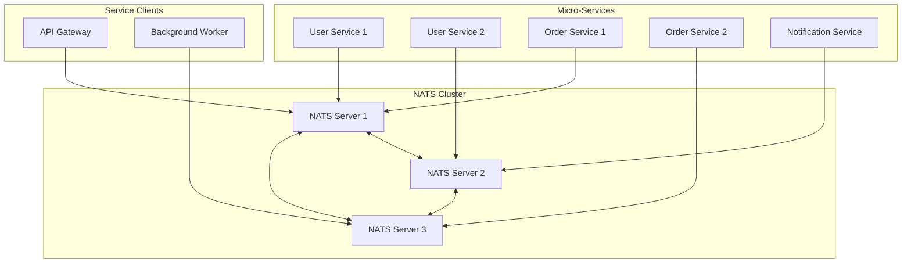
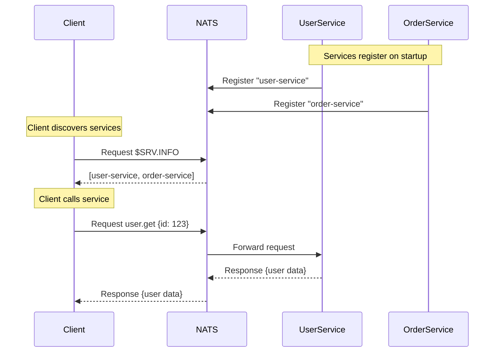
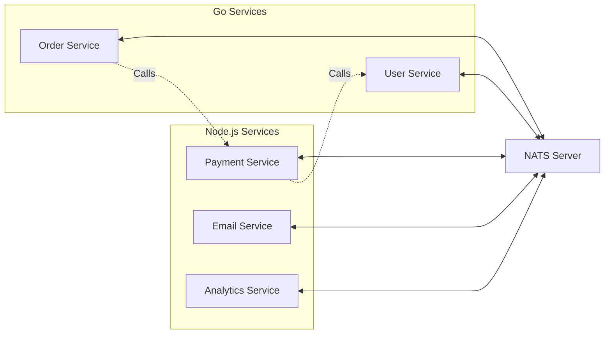
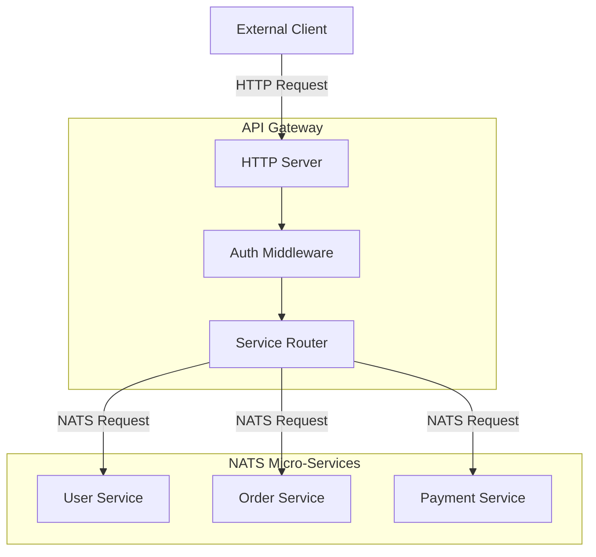

# How to Build NATS Micro-Services with Service Discovery

Author: [nawazdhandala](https://www.github.com/nawazdhandala)

Tags: NATS, Microservices, Service Discovery, Go, Node.js, Messaging, Distributed Systems

Description: Learn how to build scalable microservices using NATS messaging with built-in service discovery. Covers NATS micro framework, service registration, health monitoring, and production deployment patterns.

---

> Building microservices requires robust communication between services and a reliable way to discover them at runtime. NATS provides both, offering a lightweight messaging system with built-in service discovery that eliminates the need for external service registries like Consul or etcd.

NATS is a high-performance messaging system designed for cloud-native applications. The NATS micro framework extends core NATS functionality by providing automatic service registration, discovery, health monitoring, and load balancing out of the box.

---

## Architecture Overview

NATS micro-services communicate through subjects (topics) while automatically registering themselves for discovery. Clients can find services dynamically without hardcoding endpoints.



---

## Setting Up NATS Server

Before building services, you need a running NATS server. NATS can run as a single node for development or as a cluster for production.

Running NATS with Docker provides the simplest setup for local development.

```bash
# Run NATS server with JetStream enabled for persistence
docker run -d --name nats-server \
  -p 4222:4222 \
  -p 8222:8222 \
  nats:latest \
  -js -m 8222

# Verify the server is running
curl http://localhost:8222/healthz
```

For production deployments, use a three-node cluster configuration.

```yaml
# nats-cluster.yaml - Kubernetes deployment
apiVersion: v1
kind: ConfigMap
metadata:
  name: nats-config
data:
  nats.conf: |
    # Server identification
    server_name: nats-1

    # Client connections
    port: 4222

    # HTTP monitoring
    http_port: 8222

    # Enable JetStream for persistence
    jetstream {
      store_dir: /data/jetstream
      max_memory_store: 1GB
      max_file_store: 10GB
    }

    # Cluster configuration
    cluster {
      name: nats-cluster
      port: 6222
      routes: [
        nats-route://nats-0.nats-headless:6222
        nats-route://nats-1.nats-headless:6222
        nats-route://nats-2.nats-headless:6222
      ]
    }

    # Service discovery settings
    accounts {
      SYS {
        users: [{user: sys, password: sys}]
      }
    }
    system_account: SYS
```

---

## Building a NATS Micro-Service in Go

The NATS micro framework in Go provides a clean API for building discoverable services. Each service automatically registers itself and responds to discovery queries.



Creating a user service with automatic registration demonstrates the micro framework capabilities.

```go
// user-service/main.go
package main

import (
	"context"
	"encoding/json"
	"fmt"
	"log"
	"os"
	"os/signal"
	"syscall"
	"time"

	"github.com/nats-io/nats.go"
	"github.com/nats-io/nats.go/micro"
)

// User represents a user entity in our system
type User struct {
	ID        string    `json:"id"`
	Email     string    `json:"email"`
	Name      string    `json:"name"`
	CreatedAt time.Time `json:"created_at"`
}

// GetUserRequest contains the request parameters for fetching a user
type GetUserRequest struct {
	UserID string `json:"user_id"`
}

// UserService handles all user-related operations
type UserService struct {
	// In production, this would be a database connection
	users map[string]*User
}

// NewUserService creates a new user service instance with sample data
func NewUserService() *UserService {
	return &UserService{
		users: map[string]*User{
			"user-001": {
				ID:        "user-001",
				Email:     "alice@example.com",
				Name:      "Alice Johnson",
				CreatedAt: time.Now().Add(-30 * 24 * time.Hour),
			},
			"user-002": {
				ID:        "user-002",
				Email:     "bob@example.com",
				Name:      "Bob Smith",
				CreatedAt: time.Now().Add(-15 * 24 * time.Hour),
			},
		},
	}
}

// GetUser retrieves a user by ID
func (s *UserService) GetUser(req micro.Request) {
	var getReq GetUserRequest

	// Parse the incoming JSON request
	if err := json.Unmarshal(req.Data(), &getReq); err != nil {
		req.Error("400", "Invalid request format", nil)
		return
	}

	// Look up the user in our data store
	user, exists := s.users[getReq.UserID]
	if !exists {
		req.Error("404", "User not found", nil)
		return
	}

	// Marshal and send the response
	response, _ := json.Marshal(user)
	req.Respond(response)
}

// ListUsers returns all users in the system
func (s *UserService) ListUsers(req micro.Request) {
	users := make([]*User, 0, len(s.users))
	for _, user := range s.users {
		users = append(users, user)
	}

	response, _ := json.Marshal(users)
	req.Respond(response)
}

// CreateUser adds a new user to the system
func (s *UserService) CreateUser(req micro.Request) {
	var user User

	if err := json.Unmarshal(req.Data(), &user); err != nil {
		req.Error("400", "Invalid user data", nil)
		return
	}

	// Generate ID and set creation time
	user.ID = fmt.Sprintf("user-%d", time.Now().UnixNano())
	user.CreatedAt = time.Now()

	// Store the user
	s.users[user.ID] = &user

	response, _ := json.Marshal(user)
	req.Respond(response)
}

func main() {
	// Connect to NATS server with reconnection handling
	nc, err := nats.Connect(
		os.Getenv("NATS_URL"),
		nats.Name("user-service"),
		nats.ReconnectWait(2*time.Second),
		nats.MaxReconnects(-1),
		nats.DisconnectErrHandler(func(nc *nats.Conn, err error) {
			log.Printf("Disconnected from NATS: %v", err)
		}),
		nats.ReconnectHandler(func(nc *nats.Conn) {
			log.Printf("Reconnected to NATS at %s", nc.ConnectedUrl())
		}),
	)
	if err != nil {
		log.Fatalf("Failed to connect to NATS: %v", err)
	}
	defer nc.Close()

	userService := NewUserService()

	// Create a micro service with metadata for discovery
	// The service automatically registers with NATS for discovery
	svc, err := micro.AddService(nc, micro.Config{
		Name:        "user-service",
		Version:     "1.0.0",
		Description: "Handles user management operations",

		// Metadata helps clients understand service capabilities
		Metadata: map[string]string{
			"team":        "platform",
			"environment": os.Getenv("ENVIRONMENT"),
		},

		// QueueGroup ensures only one instance handles each request
		// This provides automatic load balancing across instances
		QueueGroup: "user-service-workers",
	})
	if err != nil {
		log.Fatalf("Failed to create service: %v", err)
	}

	// Add endpoint groups for organized routing
	// Each endpoint becomes discoverable via the NATS micro protocol
	userGroup := svc.AddGroup("user")

	// Register individual endpoints with their handlers
	userGroup.AddEndpoint("get", micro.HandlerFunc(userService.GetUser),
		micro.WithEndpointMetadata(map[string]string{
			"description": "Get user by ID",
			"request":     "GetUserRequest",
			"response":    "User",
		}),
	)

	userGroup.AddEndpoint("list", micro.HandlerFunc(userService.ListUsers),
		micro.WithEndpointMetadata(map[string]string{
			"description": "List all users",
			"response":    "[]User",
		}),
	)

	userGroup.AddEndpoint("create", micro.HandlerFunc(userService.CreateUser),
		micro.WithEndpointMetadata(map[string]string{
			"description": "Create a new user",
			"request":     "User",
			"response":    "User",
		}),
	)

	log.Printf("User service started: %s", svc.Info())

	// Wait for shutdown signal
	sigChan := make(chan os.Signal, 1)
	signal.Notify(sigChan, syscall.SIGINT, syscall.SIGTERM)
	<-sigChan

	log.Println("Shutting down user service...")
}
```

---

## Implementing Service Discovery

NATS micro provides built-in service discovery through special subjects. Clients can query for available services, their endpoints, and health status without any external registry.

Querying for available services reveals all registered micro-services.

```go
// discovery/client.go
package discovery

import (
	"context"
	"encoding/json"
	"fmt"
	"time"

	"github.com/nats-io/nats.go"
	"github.com/nats-io/nats.go/micro"
)

// ServiceInfo contains discovered service details
type ServiceInfo struct {
	Name        string            `json:"name"`
	ID          string            `json:"id"`
	Version     string            `json:"version"`
	Description string            `json:"description"`
	Metadata    map[string]string `json:"metadata"`
	Endpoints   []EndpointInfo    `json:"endpoints"`
}

// EndpointInfo describes a service endpoint
type EndpointInfo struct {
	Name     string            `json:"name"`
	Subject  string            `json:"subject"`
	Metadata map[string]string `json:"metadata"`
}

// ServiceDiscovery provides methods to discover NATS micro-services
type ServiceDiscovery struct {
	nc *nats.Conn
}

// NewServiceDiscovery creates a new discovery client
func NewServiceDiscovery(nc *nats.Conn) *ServiceDiscovery {
	return &ServiceDiscovery{nc: nc}
}

// DiscoverAll finds all registered micro-services
// The micro framework responds to $SRV.INFO requests automatically
func (sd *ServiceDiscovery) DiscoverAll(ctx context.Context) ([]ServiceInfo, error) {
	// Request service info from all services
	// Using a timeout context ensures we don't wait forever
	inbox := nats.NewInbox()
	sub, err := sd.nc.SubscribeSync(inbox)
	if err != nil {
		return nil, fmt.Errorf("failed to subscribe: %w", err)
	}
	defer sub.Unsubscribe()

	// Publish discovery request to the micro info subject
	if err := sd.nc.PublishRequest("$SRV.INFO", inbox, nil); err != nil {
		return nil, fmt.Errorf("failed to publish discovery request: %w", err)
	}

	var services []ServiceInfo
	deadline := time.Now().Add(2 * time.Second)

	// Collect responses until timeout
	for time.Now().Before(deadline) {
		msg, err := sub.NextMsg(100 * time.Millisecond)
		if err != nil {
			continue
		}

		var info micro.Info
		if err := json.Unmarshal(msg.Data, &info); err != nil {
			continue
		}

		svcInfo := ServiceInfo{
			Name:        info.Name,
			ID:          info.ID,
			Version:     info.Version,
			Description: info.Description,
			Metadata:    info.Metadata,
		}

		for _, ep := range info.Endpoints {
			svcInfo.Endpoints = append(svcInfo.Endpoints, EndpointInfo{
				Name:     ep.Name,
				Subject:  ep.Subject,
				Metadata: ep.Metadata,
			})
		}

		services = append(services, svcInfo)
	}

	return services, nil
}

// DiscoverByName finds services matching a specific name
func (sd *ServiceDiscovery) DiscoverByName(ctx context.Context, name string) ([]ServiceInfo, error) {
	// Use the service-specific info subject
	subject := fmt.Sprintf("$SRV.INFO.%s", name)

	inbox := nats.NewInbox()
	sub, err := sd.nc.SubscribeSync(inbox)
	if err != nil {
		return nil, fmt.Errorf("failed to subscribe: %w", err)
	}
	defer sub.Unsubscribe()

	if err := sd.nc.PublishRequest(subject, inbox, nil); err != nil {
		return nil, fmt.Errorf("failed to publish discovery request: %w", err)
	}

	var services []ServiceInfo
	deadline := time.Now().Add(2 * time.Second)

	for time.Now().Before(deadline) {
		msg, err := sub.NextMsg(100 * time.Millisecond)
		if err != nil {
			continue
		}

		var info micro.Info
		if err := json.Unmarshal(msg.Data, &info); err != nil {
			continue
		}

		services = append(services, ServiceInfo{
			Name:        info.Name,
			ID:          info.ID,
			Version:     info.Version,
			Description: info.Description,
			Metadata:    info.Metadata,
		})
	}

	return services, nil
}

// GetServiceStats retrieves statistics for a specific service
func (sd *ServiceDiscovery) GetServiceStats(ctx context.Context, name string) ([]micro.Stats, error) {
	subject := fmt.Sprintf("$SRV.STATS.%s", name)

	inbox := nats.NewInbox()
	sub, err := sd.nc.SubscribeSync(inbox)
	if err != nil {
		return nil, fmt.Errorf("failed to subscribe: %w", err)
	}
	defer sub.Unsubscribe()

	if err := sd.nc.PublishRequest(subject, inbox, nil); err != nil {
		return nil, fmt.Errorf("failed to publish stats request: %w", err)
	}

	var allStats []micro.Stats
	deadline := time.Now().Add(2 * time.Second)

	for time.Now().Before(deadline) {
		msg, err := sub.NextMsg(100 * time.Millisecond)
		if err != nil {
			continue
		}

		var stats micro.Stats
		if err := json.Unmarshal(msg.Data, &stats); err != nil {
			continue
		}

		allStats = append(allStats, stats)
	}

	return allStats, nil
}

// WatchServices monitors service registration and deregistration
func (sd *ServiceDiscovery) WatchServices(ctx context.Context, callback func(ServiceInfo, bool)) error {
	// Subscribe to service lifecycle events
	sub, err := sd.nc.Subscribe("$SRV.>", func(msg *nats.Msg) {
		var info micro.Info
		if err := json.Unmarshal(msg.Data, &info); err != nil {
			return
		}

		svcInfo := ServiceInfo{
			Name:        info.Name,
			ID:          info.ID,
			Version:     info.Version,
			Description: info.Description,
		}

		// Determine if service is registering or deregistering
		isRegistering := msg.Subject != "$SRV.PING"
		callback(svcInfo, isRegistering)
	})
	if err != nil {
		return fmt.Errorf("failed to subscribe to service events: %w", err)
	}

	<-ctx.Done()
	sub.Unsubscribe()
	return nil
}
```

---

## Building a Service Client with Load Balancing

Clients can call services without knowing their specific locations. NATS handles request routing and load balancing automatically through queue groups.

```go
// client/service_client.go
package client

import (
	"context"
	"encoding/json"
	"fmt"
	"time"

	"github.com/nats-io/nats.go"
)

// ServiceClient provides methods to call NATS micro-services
type ServiceClient struct {
	nc      *nats.Conn
	timeout time.Duration
}

// NewServiceClient creates a new service client with default timeout
func NewServiceClient(nc *nats.Conn) *ServiceClient {
	return &ServiceClient{
		nc:      nc,
		timeout: 5 * time.Second,
	}
}

// WithTimeout sets a custom timeout for requests
func (c *ServiceClient) WithTimeout(timeout time.Duration) *ServiceClient {
	return &ServiceClient{
		nc:      c.nc,
		timeout: timeout,
	}
}

// Request sends a request to a service endpoint and waits for response
func (c *ServiceClient) Request(ctx context.Context, subject string, data interface{}) ([]byte, error) {
	// Marshal the request data to JSON
	payload, err := json.Marshal(data)
	if err != nil {
		return nil, fmt.Errorf("failed to marshal request: %w", err)
	}

	// Create a timeout context if not already set
	if _, hasDeadline := ctx.Deadline(); !hasDeadline {
		var cancel context.CancelFunc
		ctx, cancel = context.WithTimeout(ctx, c.timeout)
		defer cancel()
	}

	// Send request and wait for response
	msg, err := c.nc.RequestWithContext(ctx, subject, payload)
	if err != nil {
		return nil, fmt.Errorf("request failed: %w", err)
	}

	// Check for error response from service
	if msg.Header.Get("Nats-Service-Error-Code") != "" {
		errCode := msg.Header.Get("Nats-Service-Error-Code")
		errMsg := msg.Header.Get("Nats-Service-Error")
		return nil, fmt.Errorf("service error %s: %s", errCode, errMsg)
	}

	return msg.Data, nil
}

// RequestTyped sends a request and unmarshals the response
func (c *ServiceClient) RequestTyped(ctx context.Context, subject string, request interface{}, response interface{}) error {
	data, err := c.Request(ctx, subject, request)
	if err != nil {
		return err
	}

	if err := json.Unmarshal(data, response); err != nil {
		return fmt.Errorf("failed to unmarshal response: %w", err)
	}

	return nil
}

// UserClient provides typed methods for the user service
type UserClient struct {
	client *ServiceClient
}

// NewUserClient creates a new user service client
func NewUserClient(nc *nats.Conn) *UserClient {
	return &UserClient{
		client: NewServiceClient(nc),
	}
}

// User represents a user entity
type User struct {
	ID        string    `json:"id"`
	Email     string    `json:"email"`
	Name      string    `json:"name"`
	CreatedAt time.Time `json:"created_at"`
}

// GetUser retrieves a user by ID
func (uc *UserClient) GetUser(ctx context.Context, userID string) (*User, error) {
	var user User
	err := uc.client.RequestTyped(ctx, "user.get", map[string]string{
		"user_id": userID,
	}, &user)
	if err != nil {
		return nil, err
	}
	return &user, nil
}

// ListUsers retrieves all users
func (uc *UserClient) ListUsers(ctx context.Context) ([]User, error) {
	var users []User
	err := uc.client.RequestTyped(ctx, "user.list", nil, &users)
	if err != nil {
		return nil, err
	}
	return users, nil
}

// CreateUser creates a new user
func (uc *UserClient) CreateUser(ctx context.Context, email, name string) (*User, error) {
	var user User
	err := uc.client.RequestTyped(ctx, "user.create", map[string]string{
		"email": email,
		"name":  name,
	}, &user)
	if err != nil {
		return nil, err
	}
	return &user, nil
}
```

---

## Building Services in Node.js

NATS provides excellent Node.js support through the nats.js library. Building micro-services in JavaScript follows similar patterns to Go.



Creating a payment service in Node.js demonstrates cross-language compatibility.

```javascript
// payment-service/index.js
const { connect, ServiceError } = require('nats');

// PaymentService handles payment processing operations
class PaymentService {
  constructor() {
    // In production, integrate with a real payment processor
    this.payments = new Map();
  }

  // Process a new payment request
  async processPayment(data) {
    const { orderId, amount, currency, customerId } = data;

    // Validate required fields
    if (!orderId || !amount || !customerId) {
      throw new ServiceError(400, 'Missing required fields: orderId, amount, customerId');
    }

    // Simulate payment processing
    const paymentId = `pay_${Date.now()}_${Math.random().toString(36).substr(2, 9)}`;

    const payment = {
      id: paymentId,
      orderId,
      amount,
      currency: currency || 'USD',
      customerId,
      status: 'completed',
      processedAt: new Date().toISOString(),
    };

    this.payments.set(paymentId, payment);

    return payment;
  }

  // Retrieve payment status by ID
  async getPayment(data) {
    const { paymentId } = data;

    if (!paymentId) {
      throw new ServiceError(400, 'Missing required field: paymentId');
    }

    const payment = this.payments.get(paymentId);

    if (!payment) {
      throw new ServiceError(404, 'Payment not found');
    }

    return payment;
  }

  // Refund a payment
  async refundPayment(data) {
    const { paymentId, amount, reason } = data;

    const payment = this.payments.get(paymentId);

    if (!payment) {
      throw new ServiceError(404, 'Payment not found');
    }

    if (payment.status === 'refunded') {
      throw new ServiceError(400, 'Payment already refunded');
    }

    const refund = {
      id: `ref_${Date.now()}`,
      paymentId,
      amount: amount || payment.amount,
      reason: reason || 'Customer request',
      status: 'completed',
      processedAt: new Date().toISOString(),
    };

    payment.status = 'refunded';
    payment.refund = refund;

    return refund;
  }
}

async function main() {
  // Connect to NATS with reconnection handling
  const nc = await connect({
    servers: process.env.NATS_URL || 'nats://localhost:4222',
    name: 'payment-service',
    reconnect: true,
    maxReconnectAttempts: -1,
    reconnectTimeWait: 2000,
  });

  console.log(`Connected to NATS: ${nc.getServer()}`);

  const paymentService = new PaymentService();

  // Add the micro service with automatic registration
  // NATS micro in Node.js uses the services API
  const svc = await nc.services.add({
    name: 'payment-service',
    version: '1.0.0',
    description: 'Handles payment processing and refunds',
    metadata: {
      team: 'payments',
      environment: process.env.ENVIRONMENT || 'development',
    },
    // Queue group for load balancing across instances
    queue: 'payment-workers',
  });

  // Add endpoint group for payment operations
  const paymentGroup = svc.addGroup('payment');

  // Register the process endpoint
  // Handles: payment.process
  paymentGroup.addEndpoint('process', {
    metadata: {
      description: 'Process a new payment',
      request: 'ProcessPaymentRequest',
      response: 'Payment',
    },
    handler: async (err, msg) => {
      if (err) {
        console.error('Endpoint error:', err);
        return;
      }

      try {
        const data = JSON.parse(msg.string());
        const result = await paymentService.processPayment(data);
        msg.respond(JSON.stringify(result));
      } catch (e) {
        if (e instanceof ServiceError) {
          msg.respondError(e.code, e.message);
        } else {
          msg.respondError(500, 'Internal server error');
        }
      }
    },
  });

  // Register the get endpoint
  // Handles: payment.get
  paymentGroup.addEndpoint('get', {
    metadata: {
      description: 'Get payment by ID',
      request: 'GetPaymentRequest',
      response: 'Payment',
    },
    handler: async (err, msg) => {
      if (err) {
        console.error('Endpoint error:', err);
        return;
      }

      try {
        const data = JSON.parse(msg.string());
        const result = await paymentService.getPayment(data);
        msg.respond(JSON.stringify(result));
      } catch (e) {
        if (e instanceof ServiceError) {
          msg.respondError(e.code, e.message);
        } else {
          msg.respondError(500, 'Internal server error');
        }
      }
    },
  });

  // Register the refund endpoint
  // Handles: payment.refund
  paymentGroup.addEndpoint('refund', {
    metadata: {
      description: 'Refund a payment',
      request: 'RefundPaymentRequest',
      response: 'Refund',
    },
    handler: async (err, msg) => {
      if (err) {
        console.error('Endpoint error:', err);
        return;
      }

      try {
        const data = JSON.parse(msg.string());
        const result = await paymentService.refundPayment(data);
        msg.respond(JSON.stringify(result));
      } catch (e) {
        if (e instanceof ServiceError) {
          msg.respondError(e.code, e.message);
        } else {
          msg.respondError(500, 'Internal server error');
        }
      }
    },
  });

  console.log('Payment service started:', svc.info());

  // Handle graceful shutdown
  process.on('SIGINT', async () => {
    console.log('Shutting down payment service...');
    await svc.stop();
    await nc.drain();
    process.exit(0);
  });
}

main().catch(console.error);
```

---

## Health Monitoring and Observability

NATS micro-services include built-in health checking through the ping and stats subjects. Building a health dashboard aggregates this information.

```go
// monitoring/health.go
package monitoring

import (
	"context"
	"encoding/json"
	"fmt"
	"sync"
	"time"

	"github.com/nats-io/nats.go"
	"github.com/nats-io/nats.go/micro"
)

// ServiceHealth represents the health status of a service
type ServiceHealth struct {
	Name        string        `json:"name"`
	ID          string        `json:"id"`
	Version     string        `json:"version"`
	Status      string        `json:"status"`
	Uptime      time.Duration `json:"uptime"`
	RequestRate float64       `json:"request_rate"`
	ErrorRate   float64       `json:"error_rate"`
	AvgLatency  time.Duration `json:"avg_latency"`
	LastSeen    time.Time     `json:"last_seen"`
}

// HealthMonitor watches service health across the system
type HealthMonitor struct {
	nc       *nats.Conn
	services map[string]*ServiceHealth
	mu       sync.RWMutex
}

// NewHealthMonitor creates a new health monitoring instance
func NewHealthMonitor(nc *nats.Conn) *HealthMonitor {
	return &HealthMonitor{
		nc:       nc,
		services: make(map[string]*ServiceHealth),
	}
}

// Start begins monitoring all services
func (hm *HealthMonitor) Start(ctx context.Context) error {
	// Poll services periodically
	ticker := time.NewTicker(10 * time.Second)
	defer ticker.Stop()

	// Initial check
	hm.checkAllServices()

	for {
		select {
		case <-ctx.Done():
			return ctx.Err()
		case <-ticker.C:
			hm.checkAllServices()
		}
	}
}

// checkAllServices queries all services for their current status
func (hm *HealthMonitor) checkAllServices() {
	inbox := nats.NewInbox()
	sub, err := hm.nc.SubscribeSync(inbox)
	if err != nil {
		return
	}
	defer sub.Unsubscribe()

	// Request stats from all services
	hm.nc.PublishRequest("$SRV.STATS", inbox, nil)

	deadline := time.Now().Add(2 * time.Second)
	for time.Now().Before(deadline) {
		msg, err := sub.NextMsg(100 * time.Millisecond)
		if err != nil {
			continue
		}

		var stats micro.Stats
		if err := json.Unmarshal(msg.Data, &stats); err != nil {
			continue
		}

		hm.updateServiceHealth(stats)
	}

	// Mark services as unhealthy if not seen recently
	hm.markStaleServices()
}

// updateServiceHealth updates the health status for a service
func (hm *HealthMonitor) updateServiceHealth(stats micro.Stats) {
	hm.mu.Lock()
	defer hm.mu.Unlock()

	health := &ServiceHealth{
		Name:     stats.Name,
		ID:       stats.ID,
		Version:  stats.Version,
		Status:   "healthy",
		LastSeen: time.Now(),
	}

	// Calculate uptime from started timestamp
	if !stats.Started.IsZero() {
		health.Uptime = time.Since(stats.Started)
	}

	// Calculate request and error rates from endpoint stats
	var totalRequests, totalErrors int64
	var totalLatency time.Duration

	for _, ep := range stats.Endpoints {
		totalRequests += int64(ep.NumRequests)
		totalErrors += int64(ep.NumErrors)
		totalLatency += ep.ProcessingTime
	}

	if totalRequests > 0 {
		health.ErrorRate = float64(totalErrors) / float64(totalRequests) * 100
		health.AvgLatency = totalLatency / time.Duration(totalRequests)
	}

	// Calculate request rate (requests per second since start)
	if health.Uptime > 0 {
		health.RequestRate = float64(totalRequests) / health.Uptime.Seconds()
	}

	// Determine health status based on error rate
	if health.ErrorRate > 10 {
		health.Status = "degraded"
	}
	if health.ErrorRate > 50 {
		health.Status = "unhealthy"
	}

	hm.services[stats.ID] = health
}

// markStaleServices marks services as unhealthy if not seen recently
func (hm *HealthMonitor) markStaleServices() {
	hm.mu.Lock()
	defer hm.mu.Unlock()

	staleThreshold := time.Now().Add(-30 * time.Second)

	for id, health := range hm.services {
		if health.LastSeen.Before(staleThreshold) {
			health.Status = "unreachable"
			hm.services[id] = health
		}
	}
}

// GetAllHealth returns health status for all monitored services
func (hm *HealthMonitor) GetAllHealth() []ServiceHealth {
	hm.mu.RLock()
	defer hm.mu.RUnlock()

	result := make([]ServiceHealth, 0, len(hm.services))
	for _, health := range hm.services {
		result = append(result, *health)
	}

	return result
}

// GetServiceHealth returns health status for a specific service
func (hm *HealthMonitor) GetServiceHealth(name string) []ServiceHealth {
	hm.mu.RLock()
	defer hm.mu.RUnlock()

	var result []ServiceHealth
	for _, health := range hm.services {
		if health.Name == name {
			result = append(result, *health)
		}
	}

	return result
}

// HealthSummary provides an aggregated view of system health
type HealthSummary struct {
	TotalServices   int     `json:"total_services"`
	HealthyServices int     `json:"healthy_services"`
	DegradedServices int    `json:"degraded_services"`
	UnhealthyServices int   `json:"unhealthy_services"`
	OverallStatus   string  `json:"overall_status"`
	SystemErrorRate float64 `json:"system_error_rate"`
}

// GetSummary returns an aggregated health summary
func (hm *HealthMonitor) GetSummary() HealthSummary {
	services := hm.GetAllHealth()

	summary := HealthSummary{
		TotalServices:   len(services),
		OverallStatus:   "healthy",
	}

	var totalErrorRate float64

	for _, svc := range services {
		switch svc.Status {
		case "healthy":
			summary.HealthyServices++
		case "degraded":
			summary.DegradedServices++
		case "unhealthy", "unreachable":
			summary.UnhealthyServices++
		}
		totalErrorRate += svc.ErrorRate
	}

	if summary.TotalServices > 0 {
		summary.SystemErrorRate = totalErrorRate / float64(summary.TotalServices)
	}

	if summary.DegradedServices > 0 {
		summary.OverallStatus = "degraded"
	}
	if summary.UnhealthyServices > 0 {
		summary.OverallStatus = "unhealthy"
	}

	return summary
}
```

---

## API Gateway Pattern

An API gateway can route HTTP requests to NATS micro-services, providing a bridge between external clients and internal services.



Building an HTTP gateway that routes to NATS services creates a seamless interface for external clients.

```go
// gateway/main.go
package main

import (
	"context"
	"encoding/json"
	"fmt"
	"io"
	"log"
	"net/http"
	"os"
	"strings"
	"time"

	"github.com/nats-io/nats.go"
)

// Gateway routes HTTP requests to NATS micro-services
type Gateway struct {
	nc      *nats.Conn
	timeout time.Duration
}

// NewGateway creates a new API gateway
func NewGateway(nc *nats.Conn) *Gateway {
	return &Gateway{
		nc:      nc,
		timeout: 10 * time.Second,
	}
}

// ServeHTTP handles incoming HTTP requests and routes to NATS services
func (g *Gateway) ServeHTTP(w http.ResponseWriter, r *http.Request) {
	// Convert HTTP path to NATS subject
	// /api/user/get -> user.get
	// /api/payment/process -> payment.process
	path := strings.TrimPrefix(r.URL.Path, "/api/")
	subject := strings.ReplaceAll(path, "/", ".")

	if subject == "" {
		http.Error(w, "Invalid endpoint", http.StatusBadRequest)
		return
	}

	// Read request body
	var payload []byte
	if r.Body != nil {
		defer r.Body.Close()
		body, err := io.ReadAll(r.Body)
		if err != nil {
			http.Error(w, "Failed to read request body", http.StatusBadRequest)
			return
		}
		payload = body
	}

	// For GET requests without body, use query parameters
	if r.Method == http.MethodGet && len(payload) == 0 {
		params := make(map[string]string)
		for key, values := range r.URL.Query() {
			if len(values) > 0 {
				params[key] = values[0]
			}
		}
		payload, _ = json.Marshal(params)
	}

	// Create request context with timeout
	ctx, cancel := context.WithTimeout(r.Context(), g.timeout)
	defer cancel()

	// Forward request to NATS service
	msg, err := g.nc.RequestWithContext(ctx, subject, payload)
	if err != nil {
		if err == context.DeadlineExceeded {
			http.Error(w, "Service timeout", http.StatusGatewayTimeout)
			return
		}
		http.Error(w, fmt.Sprintf("Service error: %v", err), http.StatusBadGateway)
		return
	}

	// Check for service error
	if errCode := msg.Header.Get("Nats-Service-Error-Code"); errCode != "" {
		errMsg := msg.Header.Get("Nats-Service-Error")

		statusCode := http.StatusInternalServerError
		switch errCode {
		case "400":
			statusCode = http.StatusBadRequest
		case "404":
			statusCode = http.StatusNotFound
		case "401":
			statusCode = http.StatusUnauthorized
		case "403":
			statusCode = http.StatusForbidden
		}

		w.Header().Set("Content-Type", "application/json")
		w.WriteHeader(statusCode)
		json.NewEncoder(w).Encode(map[string]string{
			"error": errMsg,
			"code":  errCode,
		})
		return
	}

	// Return successful response
	w.Header().Set("Content-Type", "application/json")
	w.Write(msg.Data)
}

// DiscoveryHandler returns information about available services
func (g *Gateway) DiscoveryHandler(w http.ResponseWriter, r *http.Request) {
	inbox := nats.NewInbox()
	sub, err := g.nc.SubscribeSync(inbox)
	if err != nil {
		http.Error(w, "Discovery failed", http.StatusInternalServerError)
		return
	}
	defer sub.Unsubscribe()

	g.nc.PublishRequest("$SRV.INFO", inbox, nil)

	var services []map[string]interface{}
	deadline := time.Now().Add(2 * time.Second)

	for time.Now().Before(deadline) {
		msg, err := sub.NextMsg(100 * time.Millisecond)
		if err != nil {
			continue
		}

		var info map[string]interface{}
		if err := json.Unmarshal(msg.Data, &info); err != nil {
			continue
		}
		services = append(services, info)
	}

	w.Header().Set("Content-Type", "application/json")
	json.NewEncoder(w).Encode(map[string]interface{}{
		"services": services,
		"count":    len(services),
	})
}

// HealthHandler returns gateway and system health
func (g *Gateway) HealthHandler(w http.ResponseWriter, r *http.Request) {
	// Check NATS connection
	natsStatus := "connected"
	if !g.nc.IsConnected() {
		natsStatus = "disconnected"
	}

	health := map[string]interface{}{
		"status": "healthy",
		"nats":   natsStatus,
		"time":   time.Now().UTC().Format(time.RFC3339),
	}

	if natsStatus == "disconnected" {
		health["status"] = "unhealthy"
		w.WriteHeader(http.StatusServiceUnavailable)
	}

	w.Header().Set("Content-Type", "application/json")
	json.NewEncoder(w).Encode(health)
}

func main() {
	// Connect to NATS
	nc, err := nats.Connect(
		os.Getenv("NATS_URL"),
		nats.Name("api-gateway"),
		nats.ReconnectWait(2*time.Second),
		nats.MaxReconnects(-1),
	)
	if err != nil {
		log.Fatalf("Failed to connect to NATS: %v", err)
	}
	defer nc.Close()

	gateway := NewGateway(nc)

	// Set up HTTP routes
	mux := http.NewServeMux()
	mux.HandleFunc("/health", gateway.HealthHandler)
	mux.HandleFunc("/discovery", gateway.DiscoveryHandler)
	mux.HandleFunc("/api/", gateway.ServeHTTP)

	port := os.Getenv("PORT")
	if port == "" {
		port = "8080"
	}

	log.Printf("API Gateway starting on port %s", port)
	if err := http.ListenAndServe(":"+port, mux); err != nil {
		log.Fatalf("Server failed: %v", err)
	}
}
```

---

## Production Deployment

Deploying NATS micro-services in production requires proper configuration for reliability, scaling, and monitoring.

```yaml
# kubernetes/deployment.yaml
apiVersion: apps/v1
kind: Deployment
metadata:
  name: user-service
  labels:
    app: user-service
spec:
  replicas: 3
  selector:
    matchLabels:
      app: user-service
  template:
    metadata:
      labels:
        app: user-service
    spec:
      containers:
      - name: user-service
        image: myregistry/user-service:1.0.0
        ports:
        - containerPort: 8080
          name: metrics
        env:
        - name: NATS_URL
          value: "nats://nats-cluster:4222"
        - name: ENVIRONMENT
          value: "production"
        - name: SERVICE_VERSION
          valueFrom:
            fieldRef:
              fieldPath: metadata.labels['version']
        resources:
          requests:
            memory: "128Mi"
            cpu: "100m"
          limits:
            memory: "256Mi"
            cpu: "500m"
        livenessProbe:
          httpGet:
            path: /health
            port: metrics
          initialDelaySeconds: 10
          periodSeconds: 10
        readinessProbe:
          httpGet:
            path: /ready
            port: metrics
          initialDelaySeconds: 5
          periodSeconds: 5
---
apiVersion: v1
kind: Service
metadata:
  name: user-service-metrics
spec:
  selector:
    app: user-service
  ports:
  - port: 8080
    targetPort: metrics
    name: metrics
```

Configuring NATS for high availability ensures resilience during node failures.

```yaml
# kubernetes/nats-statefulset.yaml
apiVersion: apps/v1
kind: StatefulSet
metadata:
  name: nats
  labels:
    app: nats
spec:
  serviceName: nats-headless
  replicas: 3
  selector:
    matchLabels:
      app: nats
  template:
    metadata:
      labels:
        app: nats
    spec:
      containers:
      - name: nats
        image: nats:2.10-alpine
        ports:
        - containerPort: 4222
          name: client
        - containerPort: 6222
          name: cluster
        - containerPort: 8222
          name: monitor
        args:
        - "--config=/etc/nats/nats.conf"
        - "--name=$(POD_NAME)"
        env:
        - name: POD_NAME
          valueFrom:
            fieldRef:
              fieldPath: metadata.name
        volumeMounts:
        - name: config
          mountPath: /etc/nats
        - name: data
          mountPath: /data
        resources:
          requests:
            memory: "256Mi"
            cpu: "200m"
          limits:
            memory: "1Gi"
            cpu: "1000m"
        livenessProbe:
          httpGet:
            path: /healthz
            port: monitor
          initialDelaySeconds: 10
          periodSeconds: 30
        readinessProbe:
          httpGet:
            path: /healthz?js-enabled-only=true
            port: monitor
          initialDelaySeconds: 10
          periodSeconds: 10
      volumes:
      - name: config
        configMap:
          name: nats-config
  volumeClaimTemplates:
  - metadata:
      name: data
    spec:
      accessModes: ["ReadWriteOnce"]
      resources:
        requests:
          storage: 10Gi
---
apiVersion: v1
kind: Service
metadata:
  name: nats-cluster
spec:
  selector:
    app: nats
  ports:
  - port: 4222
    name: client
---
apiVersion: v1
kind: Service
metadata:
  name: nats-headless
spec:
  clusterIP: None
  selector:
    app: nats
  ports:
  - port: 6222
    name: cluster
```

---

## Best Practices

Following established patterns ensures reliable NATS micro-service deployments.

### Use Queue Groups for Load Balancing

Queue groups distribute requests across service instances automatically.

```go
// All instances of user-service share the same queue group
// NATS delivers each request to only one instance
svc, _ := micro.AddService(nc, micro.Config{
    Name:       "user-service",
    QueueGroup: "user-service-workers",
})
```

### Implement Graceful Shutdown

Proper shutdown handling prevents request loss during deployments.

```go
// Handle shutdown signals
sigChan := make(chan os.Signal, 1)
signal.Notify(sigChan, syscall.SIGINT, syscall.SIGTERM)

<-sigChan

// Stop accepting new requests
svc.Stop()

// Allow in-flight requests to complete
time.Sleep(5 * time.Second)

// Close NATS connection
nc.Drain()
```

### Add Request Timeouts

Timeouts prevent cascading failures when services are slow.

```go
ctx, cancel := context.WithTimeout(context.Background(), 5*time.Second)
defer cancel()

msg, err := nc.RequestWithContext(ctx, "user.get", payload)
if err == context.DeadlineExceeded {
    // Handle timeout - perhaps use cached data or return error
}
```

### Monitor Service Metrics

Expose metrics for monitoring and alerting.

```go
// Export Prometheus metrics from service stats
func exportMetrics(svc micro.Service) http.HandlerFunc {
    return func(w http.ResponseWriter, r *http.Request) {
        stats := svc.Stats()

        for _, ep := range stats.Endpoints {
            fmt.Fprintf(w, "nats_service_requests_total{service=\"%s\",endpoint=\"%s\"} %d\n",
                stats.Name, ep.Name, ep.NumRequests)
            fmt.Fprintf(w, "nats_service_errors_total{service=\"%s\",endpoint=\"%s\"} %d\n",
                stats.Name, ep.Name, ep.NumErrors)
            fmt.Fprintf(w, "nats_service_latency_seconds{service=\"%s\",endpoint=\"%s\"} %f\n",
                stats.Name, ep.Name, ep.ProcessingTime.Seconds())
        }
    }
}
```

---

## Conclusion

NATS micro-services provide a powerful approach to building distributed systems with built-in service discovery. Key advantages include automatic service registration, zero-configuration load balancing, and cross-language support. The micro framework eliminates the need for external service registries while providing health monitoring and observability out of the box.

Start with simple services and gradually add complexity as your system grows. NATS scales from a single node development setup to large production clusters without changing your application code.

---

*Building microservices with NATS? [OneUptime](https://oneuptime.com) provides comprehensive monitoring for distributed systems, including service health tracking, latency monitoring, and alerting when services degrade or become unavailable.*

**Related Reading:**
- [How to Implement Distributed Tracing in Python Microservices](https://oneuptime.com/blog/post/2025-01-06-python-distributed-tracing-microservices/view)
- [Mastering APM: Tracing User Journeys in Distributed Systems](https://oneuptime.com/blog/post/2025-10-01-mastering-apm-tracing-user-journeys-in-distributed-systems/view)
