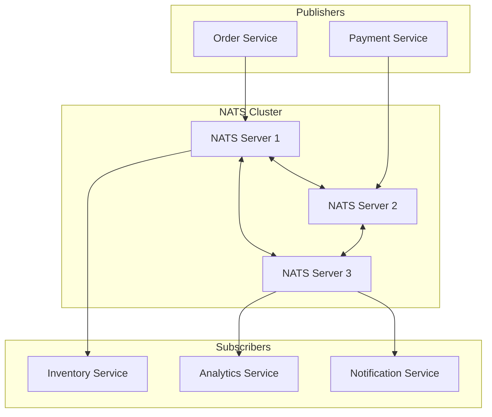
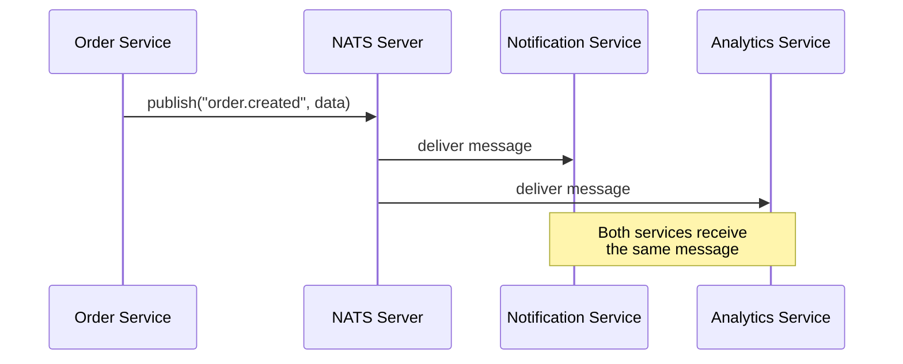
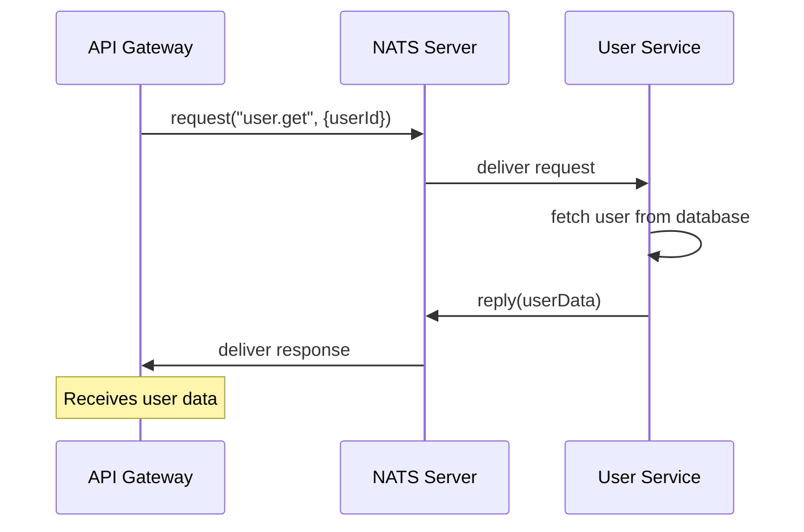
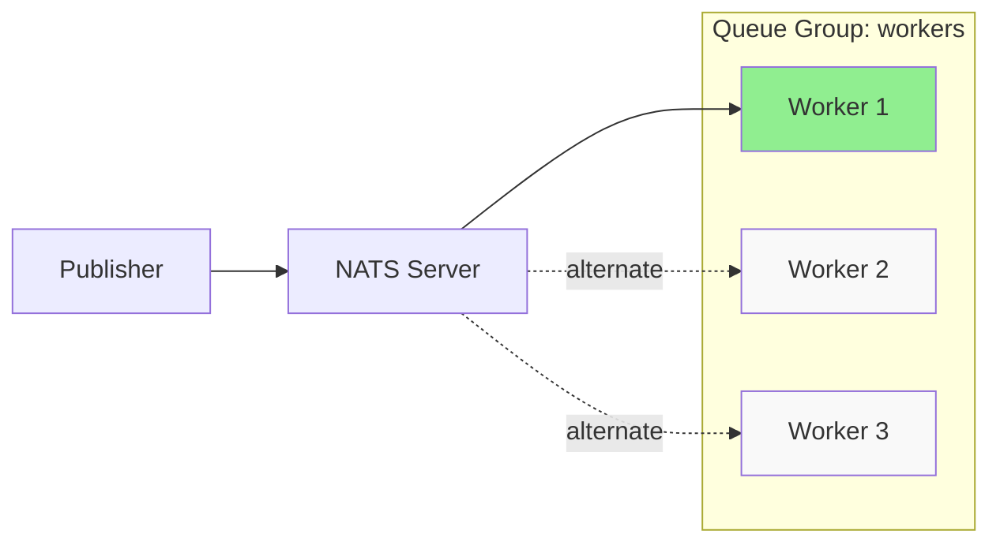
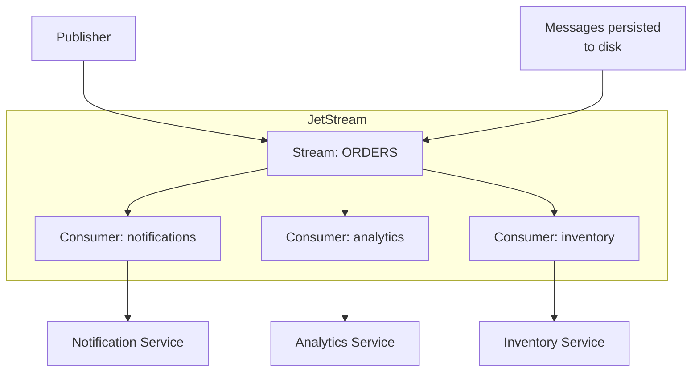

# How to Use NATS with Node.js

Author: [nawazdhandala](https://github.com/nawazdhandala)

Tags: NodeJS, NATS, Messaging, Microservices, Pub/Sub, Event-Driven

Description: Learn how to use NATS messaging system with Node.js for building scalable microservices. Covers publish-subscribe patterns, request-reply, JetStream for persistence, and production best practices.

---

NATS is a lightweight, high-performance messaging system designed for cloud-native applications. Unlike heavier message brokers, NATS focuses on simplicity and speed, making it ideal for microservices communication, IoT, and real-time data streaming. Building distributed systems requires reliable messaging between services, and NATS delivers exactly that with minimal operational overhead.

## Understanding NATS Architecture

Before diving into code, let's understand how NATS works at a high level.



NATS supports three main messaging patterns: Publish-Subscribe, Request-Reply, and Queue Groups. Each pattern serves different use cases in distributed systems.

## Installing NATS Server

Run NATS locally using Docker for development and testing purposes.

```bash
# Run NATS server with JetStream enabled for persistence
docker run -d --name nats-server \
  -p 4222:4222 \
  -p 8222:8222 \
  nats:latest \
  --jetstream \
  --http_port 8222

# Verify the server is running
curl http://localhost:8222/varz
```

## Setting Up the Node.js Client

Install the official NATS client library for Node.js.

```bash
npm install nats
```

## Basic Connection

Establishing a connection to NATS is straightforward. The client automatically handles reconnection if the server becomes unavailable.

```javascript
// connection.js
const { connect } = require('nats');

async function createNatsConnection() {
  // Connect to NATS server with configuration options
  const nc = await connect({
    servers: process.env.NATS_URL || 'nats://localhost:4222',

    // Connection name helps identify clients in monitoring
    name: 'order-service',

    // Reconnection settings for resilience
    reconnect: true,
    maxReconnectAttempts: -1,  // -1 means unlimited attempts
    reconnectTimeWait: 2000,    // Wait 2 seconds between attempts

    // Ping interval to detect broken connections
    pingInterval: 30000,        // Ping every 30 seconds
    maxPingOut: 3,              // Disconnect after 3 missed pings
  });

  console.log(`Connected to NATS at ${nc.getServer()}`);

  // Handle connection events for monitoring and logging
  (async () => {
    for await (const status of nc.status()) {
      switch (status.type) {
        case 'disconnect':
          console.log(`Disconnected from NATS: ${status.data}`);
          break;
        case 'reconnect':
          console.log(`Reconnected to NATS at ${status.data}`);
          break;
        case 'error':
          console.error(`NATS error: ${status.data}`);
          break;
      }
    }
  })();

  return nc;
}

module.exports = { createNatsConnection };
```

## Publish-Subscribe Pattern

Pub-Sub is the simplest messaging pattern. Publishers send messages to subjects, and all subscribers receive a copy. Messages are fire-and-forget with no persistence in core NATS.



### Publisher

Create a service that publishes events when orders are created.

```javascript
// publisher.js
const { connect, StringCodec } = require('nats');

// StringCodec handles encoding/decoding of message payloads
const sc = StringCodec();

async function publishOrderEvent() {
  const nc = await connect({ servers: 'nats://localhost:4222' });

  // Create an order event payload
  const orderEvent = {
    eventType: 'order.created',
    orderId: 'ORD-12345',
    customerId: 'CUST-789',
    items: [
      { productId: 'PROD-001', quantity: 2, price: 29.99 },
      { productId: 'PROD-002', quantity: 1, price: 49.99 },
    ],
    total: 109.97,
    timestamp: new Date().toISOString(),
  };

  // Publish to the 'order.created' subject
  // All subscribers listening to this subject will receive the message
  nc.publish('order.created', sc.encode(JSON.stringify(orderEvent)));
  console.log('Published order event:', orderEvent.orderId);

  // Ensure the message is flushed to the server before closing
  await nc.flush();
  await nc.close();
}

publishOrderEvent().catch(console.error);
```

### Subscriber

Create a service that subscribes to order events and processes them.

```javascript
// subscriber.js
const { connect, StringCodec } = require('nats');

const sc = StringCodec();

async function subscribeToOrders() {
  const nc = await connect({ servers: 'nats://localhost:4222' });

  // Subscribe to order.created subject
  // The subscription returns an async iterator for incoming messages
  const subscription = nc.subscribe('order.created');
  console.log(`Subscribed to ${subscription.getSubject()}`);

  // Process incoming messages asynchronously
  for await (const msg of subscription) {
    try {
      // Decode and parse the message payload
      const order = JSON.parse(sc.decode(msg.data));

      console.log('Received order event:', {
        orderId: order.orderId,
        total: order.total,
        itemCount: order.items.length,
      });

      // Process the order, for example, send notification
      await sendNotification(order);
    } catch (error) {
      console.error('Error processing message:', error.message);
    }
  }
}

async function sendNotification(order) {
  // Simulate sending notification
  console.log(`Notification sent for order ${order.orderId}`);
}

subscribeToOrders().catch(console.error);
```

## Wildcard Subscriptions

NATS supports wildcards for flexible subscription patterns. Use `*` to match a single token and `>` to match multiple tokens.

```javascript
// wildcard-subscriber.js
const { connect, StringCodec } = require('nats');

const sc = StringCodec();

async function wildcardSubscriptions() {
  const nc = await connect({ servers: 'nats://localhost:4222' });

  // Single token wildcard: matches order.created, order.updated, order.cancelled
  // Does NOT match order.item.added (multiple tokens)
  const orderSub = nc.subscribe('order.*');

  // Multi-token wildcard: matches events.us.east.server1, events.eu.west.server2
  // Matches any number of tokens after 'events.'
  const eventsSub = nc.subscribe('events.>');

  // Process order events
  (async () => {
    for await (const msg of orderSub) {
      const subject = msg.subject;  // Full subject like 'order.created'
      const data = JSON.parse(sc.decode(msg.data));
      console.log(`[${subject}] Order event:`, data.orderId);
    }
  })();

  // Process all events
  (async () => {
    for await (const msg of eventsSub) {
      const subject = msg.subject;
      const data = JSON.parse(sc.decode(msg.data));
      console.log(`[${subject}] Event received:`, data);
    }
  })();

  console.log('Listening for wildcard subscriptions...');
}

wildcardSubscriptions().catch(console.error);
```

## Request-Reply Pattern

Request-Reply enables synchronous-style communication over NATS. A client sends a request and waits for a response, similar to HTTP but over the message bus.



### Service (Responder)

Create a service that responds to user lookup requests.

```javascript
// user-service.js
const { connect, StringCodec } = require('nats');

const sc = StringCodec();

// Simulated user database
const users = new Map([
  ['user-001', { id: 'user-001', name: 'Alice Johnson', email: 'alice@example.com' }],
  ['user-002', { id: 'user-002', name: 'Bob Smith', email: 'bob@example.com' }],
]);

async function startUserService() {
  const nc = await connect({ servers: 'nats://localhost:4222' });

  // Subscribe to user.get requests
  const subscription = nc.subscribe('user.get');
  console.log('User service started, listening for requests...');

  for await (const msg of subscription) {
    try {
      const request = JSON.parse(sc.decode(msg.data));
      console.log('Received request for user:', request.userId);

      // Look up user in database
      const user = users.get(request.userId);

      // Prepare response
      const response = user
        ? { success: true, data: user }
        : { success: false, error: 'User not found' };

      // Reply to the request using the reply subject
      // The reply subject is automatically set by the requesting client
      if (msg.reply) {
        msg.respond(sc.encode(JSON.stringify(response)));
      }
    } catch (error) {
      if (msg.reply) {
        msg.respond(sc.encode(JSON.stringify({
          success: false,
          error: error.message
        })));
      }
    }
  }
}

startUserService().catch(console.error);
```

### Client (Requester)

Create a client that sends requests and waits for responses.

```javascript
// user-client.js
const { connect, StringCodec } = require('nats');

const sc = StringCodec();

async function getUser(userId) {
  const nc = await connect({ servers: 'nats://localhost:4222' });

  try {
    // Send request and wait for response with timeout
    const response = await nc.request(
      'user.get',                                    // Subject
      sc.encode(JSON.stringify({ userId })),        // Payload
      { timeout: 5000 }                              // 5 second timeout
    );

    const result = JSON.parse(sc.decode(response.data));

    if (result.success) {
      console.log('User found:', result.data);
      return result.data;
    } else {
      console.error('Error:', result.error);
      return null;
    }
  } catch (error) {
    // Handle timeout or other errors
    if (error.code === 'TIMEOUT') {
      console.error('Request timed out - service may be unavailable');
    } else {
      console.error('Request failed:', error.message);
    }
    return null;
  } finally {
    await nc.close();
  }
}

// Usage
getUser('user-001');
getUser('user-999');  // Will return 'User not found'
```

## Queue Groups for Load Balancing

Queue groups distribute messages among multiple subscribers for load balancing. Only one subscriber in a queue group receives each message, enabling horizontal scaling.



### Queue Group Worker

Create workers that belong to the same queue group for distributed processing.

```javascript
// queue-worker.js
const { connect, StringCodec } = require('nats');

const sc = StringCodec();

async function startWorker(workerId) {
  const nc = await connect({ servers: 'nats://localhost:4222' });

  // Subscribe with a queue group name
  // All workers with the same queue group share the workload
  const subscription = nc.subscribe('tasks.process', {
    queue: 'task-workers',  // Queue group name
  });

  console.log(`Worker ${workerId} started, queue group: task-workers`);

  let tasksProcessed = 0;

  for await (const msg of subscription) {
    tasksProcessed++;
    const task = JSON.parse(sc.decode(msg.data));

    console.log(`Worker ${workerId} processing task:`, {
      taskId: task.taskId,
      totalProcessed: tasksProcessed,
    });

    // Simulate task processing
    await processTask(task);

    // Reply if requested
    if (msg.reply) {
      msg.respond(sc.encode(JSON.stringify({
        success: true,
        workerId,
        taskId: task.taskId,
      })));
    }
  }
}

async function processTask(task) {
  // Simulate work with random duration
  const duration = Math.random() * 1000 + 500;
  await new Promise(resolve => setTimeout(resolve, duration));
  console.log(`Task ${task.taskId} completed`);
}

// Start worker with ID from command line or generate one
const workerId = process.argv[2] || `worker-${process.pid}`;
startWorker(workerId).catch(console.error);
```

### Task Publisher

Create a publisher that sends tasks to be processed by workers.

```javascript
// task-publisher.js
const { connect, StringCodec } = require('nats');

const sc = StringCodec();

async function publishTasks(count = 10) {
  const nc = await connect({ servers: 'nats://localhost:4222' });

  console.log(`Publishing ${count} tasks...`);

  for (let i = 1; i <= count; i++) {
    const task = {
      taskId: `TASK-${i.toString().padStart(4, '0')}`,
      type: 'email',
      payload: {
        to: `user${i}@example.com`,
        subject: 'Welcome',
        template: 'welcome-email',
      },
      createdAt: new Date().toISOString(),
    };

    nc.publish('tasks.process', sc.encode(JSON.stringify(task)));
    console.log(`Published task: ${task.taskId}`);

    // Small delay between publishes
    await new Promise(resolve => setTimeout(resolve, 100));
  }

  await nc.flush();
  await nc.close();
  console.log('All tasks published');
}

publishTasks(20).catch(console.error);
```

## JetStream for Persistent Messaging

Core NATS is fire-and-forget with no persistence. JetStream adds persistence, message acknowledgment, and replay capabilities essential for reliable messaging.



### Creating a Stream

Streams store messages and define retention policies.

```javascript
// jetstream-setup.js
const { connect } = require('nats');

async function setupJetStream() {
  const nc = await connect({ servers: 'nats://localhost:4222' });

  // Get JetStream manager for administrative operations
  const jsm = await nc.jetstreamManager();

  // Create or update a stream for order events
  const streamConfig = {
    name: 'ORDERS',
    subjects: ['orders.>'],  // Capture all subjects starting with 'orders.'

    // Retention policy: 'limits' keeps messages until limits are reached
    // Other options: 'interest' (while consumers exist), 'workqueue' (delete on ack)
    retention: 'limits',

    // Storage type: 'file' for persistence, 'memory' for speed
    storage: 'file',

    // Maximum messages to retain
    max_msgs: 1000000,

    // Maximum total bytes to retain
    max_bytes: 1024 * 1024 * 1024,  // 1 GB

    // Maximum age of messages
    max_age: 7 * 24 * 60 * 60 * 1000000000,  // 7 days in nanoseconds

    // Number of replicas for high availability
    num_replicas: 1,

    // Duplicate detection window
    duplicate_window: 120000000000,  // 2 minutes in nanoseconds
  };

  try {
    // Try to add the stream (fails if it already exists)
    await jsm.streams.add(streamConfig);
    console.log('Stream ORDERS created');
  } catch (error) {
    if (error.message.includes('already in use')) {
      // Update existing stream
      await jsm.streams.update('ORDERS', streamConfig);
      console.log('Stream ORDERS updated');
    } else {
      throw error;
    }
  }

  // Display stream info
  const info = await jsm.streams.info('ORDERS');
  console.log('Stream info:', {
    messages: info.state.messages,
    bytes: info.state.bytes,
    firstSeq: info.state.first_seq,
    lastSeq: info.state.last_seq,
  });

  await nc.close();
}

setupJetStream().catch(console.error);
```

### Publishing to JetStream

Publishing to JetStream provides acknowledgment that the message was persisted.

```javascript
// jetstream-publisher.js
const { connect, StringCodec } = require('nats');

const sc = StringCodec();

async function publishToJetStream() {
  const nc = await connect({ servers: 'nats://localhost:4222' });

  // Get JetStream context for publishing
  const js = nc.jetstream();

  const order = {
    orderId: `ORD-${Date.now()}`,
    customerId: 'CUST-001',
    status: 'created',
    items: [
      { productId: 'PROD-001', quantity: 2 },
    ],
    total: 99.99,
    createdAt: new Date().toISOString(),
  };

  try {
    // Publish with acknowledgment
    // The publish returns only after the message is persisted
    const pubAck = await js.publish(
      'orders.created',
      sc.encode(JSON.stringify(order)),
      {
        // Message ID for deduplication
        msgID: order.orderId,

        // Expect the stream to be ORDERS
        expect: { streamName: 'ORDERS' },
      }
    );

    console.log('Message published:', {
      stream: pubAck.stream,
      seq: pubAck.seq,
      duplicate: pubAck.duplicate,
    });
  } catch (error) {
    console.error('Publish failed:', error.message);
  }

  await nc.close();
}

publishToJetStream().catch(console.error);
```

### Consuming from JetStream

Create durable consumers that track message delivery and support acknowledgments.

```javascript
// jetstream-consumer.js
const { connect, StringCodec, AckPolicy, DeliverPolicy } = require('nats');

const sc = StringCodec();

async function consumeFromJetStream() {
  const nc = await connect({ servers: 'nats://localhost:4222' });
  const js = nc.jetstream();

  // Create or bind to a durable consumer
  // Durable consumers remember their position across restarts
  const consumer = await js.consumers.get('ORDERS', 'order-processor');

  // If consumer does not exist, create it
  // In production, create consumers during deployment/setup
  if (!consumer) {
    const jsm = await nc.jetstreamManager();
    await jsm.consumers.add('ORDERS', {
      durable_name: 'order-processor',

      // Acknowledgment policy: 'explicit' requires manual ack
      ack_policy: AckPolicy.Explicit,

      // Where to start consuming
      deliver_policy: DeliverPolicy.All,  // Start from beginning

      // Maximum number of unacknowledged messages
      max_ack_pending: 100,

      // Time to wait for acknowledgment before redelivery
      ack_wait: 30000000000,  // 30 seconds in nanoseconds

      // Maximum delivery attempts before moving to dead letter
      max_deliver: 5,

      // Filter to specific subjects
      filter_subject: 'orders.created',
    });
  }

  console.log('Starting to consume messages...');

  // Consume messages with pull-based fetching
  const messages = await consumer.consume();

  for await (const msg of messages) {
    try {
      const order = JSON.parse(sc.decode(msg.data));

      console.log('Processing order:', {
        orderId: order.orderId,
        seq: msg.seq,
        deliveryCount: msg.info.redeliveryCount,
      });

      // Process the order
      await processOrder(order);

      // Acknowledge successful processing
      // Message will not be redelivered
      msg.ack();

    } catch (error) {
      console.error('Processing failed:', error.message);

      // Negative acknowledgment - request redelivery
      // Use nak() for temporary failures (retry later)
      // Use term() for permanent failures (no retry)
      if (error.retryable) {
        msg.nak(5000);  // Retry after 5 seconds
      } else {
        msg.term();     // Do not retry
      }
    }
  }
}

async function processOrder(order) {
  // Simulate order processing
  console.log(`Order ${order.orderId} processed successfully`);
}

consumeFromJetStream().catch(console.error);
```

## Error Handling and Resilience

Build resilient applications with proper error handling and connection management.

```javascript
// resilient-client.js
const { connect, StringCodec, Events } = require('nats');

const sc = StringCodec();

class NatsClient {
  constructor(config) {
    this.config = {
      servers: config.servers || 'nats://localhost:4222',
      name: config.name || 'app-client',
      maxReconnectAttempts: config.maxReconnectAttempts || -1,
      reconnectTimeWait: config.reconnectTimeWait || 2000,
    };
    this.nc = null;
    this.subscriptions = new Map();
  }

  async connect() {
    try {
      this.nc = await connect({
        servers: this.config.servers,
        name: this.config.name,
        maxReconnectAttempts: this.config.maxReconnectAttempts,
        reconnectTimeWait: this.config.reconnectTimeWait,
      });

      console.log(`Connected to NATS: ${this.nc.getServer()}`);

      // Monitor connection status
      this.monitorConnection();

      return this;
    } catch (error) {
      console.error('Failed to connect to NATS:', error.message);
      throw error;
    }
  }

  monitorConnection() {
    // Handle connection events
    (async () => {
      for await (const status of this.nc.status()) {
        switch (status.type) {
          case 'disconnect':
            console.warn('NATS disconnected:', status.data);
            this.onDisconnect();
            break;
          case 'reconnect':
            console.log('NATS reconnected:', status.data);
            this.onReconnect();
            break;
          case 'error':
            console.error('NATS error:', status.data);
            break;
          case 'ldm':
            console.warn('NATS server is in lame duck mode');
            break;
        }
      }
    })();

    // Handle connection close
    this.nc.closed().then((err) => {
      if (err) {
        console.error('NATS connection closed with error:', err.message);
      } else {
        console.log('NATS connection closed');
      }
    });
  }

  onDisconnect() {
    // Pause processing during disconnect
    // Subscriptions will automatically resume on reconnect
    console.log('Pausing message processing...');
  }

  onReconnect() {
    // Resume processing after reconnect
    console.log('Resuming message processing...');
  }

  async publish(subject, data) {
    if (!this.nc) {
      throw new Error('Not connected to NATS');
    }

    const payload = typeof data === 'string'
      ? data
      : JSON.stringify(data);

    this.nc.publish(subject, sc.encode(payload));
  }

  async request(subject, data, timeout = 5000) {
    if (!this.nc) {
      throw new Error('Not connected to NATS');
    }

    const payload = typeof data === 'string'
      ? data
      : JSON.stringify(data);

    try {
      const response = await this.nc.request(
        subject,
        sc.encode(payload),
        { timeout }
      );
      return JSON.parse(sc.decode(response.data));
    } catch (error) {
      if (error.code === 'TIMEOUT') {
        throw new Error(`Request to ${subject} timed out after ${timeout}ms`);
      }
      throw error;
    }
  }

  subscribe(subject, handler, options = {}) {
    if (!this.nc) {
      throw new Error('Not connected to NATS');
    }

    const subscription = this.nc.subscribe(subject, options);

    // Store subscription for cleanup
    this.subscriptions.set(subject, subscription);

    // Process messages
    (async () => {
      for await (const msg of subscription) {
        try {
          const data = JSON.parse(sc.decode(msg.data));
          await handler(data, msg);
        } catch (error) {
          console.error(`Error processing message on ${subject}:`, error.message);
        }
      }
    })();

    return subscription;
  }

  async close() {
    if (this.nc) {
      // Drain ensures all pending messages are processed
      await this.nc.drain();
      console.log('NATS connection drained and closed');
    }
  }
}

// Usage example
async function main() {
  const client = new NatsClient({
    servers: 'nats://localhost:4222',
    name: 'my-service',
  });

  await client.connect();

  // Subscribe to events
  client.subscribe('events.>',  async (data, msg) => {
    console.log(`Received event on ${msg.subject}:`, data);
  });

  // Publish an event
  await client.publish('events.user.created', {
    userId: 'user-123',
    email: 'user@example.com',
  });

  // Make a request
  try {
    const response = await client.request('user.get', { userId: 'user-001' });
    console.log('Response:', response);
  } catch (error) {
    console.error('Request failed:', error.message);
  }

  // Graceful shutdown
  process.on('SIGINT', async () => {
    console.log('Shutting down...');
    await client.close();
    process.exit(0);
  });
}

main().catch(console.error);
```

## Monitoring and Health Checks

Implement health checks for Kubernetes and monitoring systems.

```javascript
// health-check.js
const { connect } = require('nats');
const express = require('express');

const app = express();
let natsConnection = null;
let isHealthy = false;

async function initializeNats() {
  natsConnection = await connect({
    servers: process.env.NATS_URL || 'nats://localhost:4222',
    name: 'health-check-service',
  });

  isHealthy = true;

  // Monitor connection health
  (async () => {
    for await (const status of natsConnection.status()) {
      if (status.type === 'disconnect') {
        isHealthy = false;
      } else if (status.type === 'reconnect') {
        isHealthy = true;
      }
    }
  })();

  natsConnection.closed().then(() => {
    isHealthy = false;
  });
}

// Liveness probe - is the process running?
app.get('/health/live', (req, res) => {
  res.status(200).json({ status: 'alive' });
});

// Readiness probe - is the service ready to accept traffic?
app.get('/health/ready', async (req, res) => {
  if (!natsConnection || !isHealthy) {
    return res.status(503).json({
      status: 'not ready',
      nats: 'disconnected',
    });
  }

  try {
    // Verify connection with a ping
    await natsConnection.flush();
    res.status(200).json({
      status: 'ready',
      nats: 'connected',
      server: natsConnection.getServer(),
    });
  } catch (error) {
    res.status(503).json({
      status: 'not ready',
      nats: 'error',
      error: error.message,
    });
  }
});

// Metrics endpoint
app.get('/metrics', async (req, res) => {
  if (!natsConnection) {
    return res.status(503).send('NATS not connected');
  }

  const stats = natsConnection.stats();

  // Prometheus format metrics
  const metrics = `
# HELP nats_client_in_messages Total inbound messages
# TYPE nats_client_in_messages counter
nats_client_in_messages ${stats.inMsgs}

# HELP nats_client_out_messages Total outbound messages
# TYPE nats_client_out_messages counter
nats_client_out_messages ${stats.outMsgs}

# HELP nats_client_in_bytes Total inbound bytes
# TYPE nats_client_in_bytes counter
nats_client_in_bytes ${stats.inBytes}

# HELP nats_client_out_bytes Total outbound bytes
# TYPE nats_client_out_bytes counter
nats_client_out_bytes ${stats.outBytes}

# HELP nats_client_reconnects Total reconnection attempts
# TYPE nats_client_reconnects counter
nats_client_reconnects ${stats.reconnects}
`.trim();

  res.set('Content-Type', 'text/plain');
  res.send(metrics);
});

// Start server
initializeNats()
  .then(() => {
    app.listen(3000, () => {
      console.log('Health check server running on port 3000');
    });
  })
  .catch((error) => {
    console.error('Failed to initialize NATS:', error.message);
    process.exit(1);
  });
```

## Production Best Practices

Follow these practices when deploying NATS-based applications to production.

### Environment Configuration

```javascript
// config.js
module.exports = {
  nats: {
    // Use multiple servers for high availability
    servers: process.env.NATS_SERVERS?.split(',') || ['nats://localhost:4222'],

    // Unique name per service instance
    name: `${process.env.SERVICE_NAME}-${process.env.HOSTNAME || 'local'}`,

    // Authentication
    user: process.env.NATS_USER,
    pass: process.env.NATS_PASS,

    // TLS configuration
    tls: process.env.NATS_TLS === 'true' ? {
      caFile: process.env.NATS_CA_FILE,
      certFile: process.env.NATS_CERT_FILE,
      keyFile: process.env.NATS_KEY_FILE,
    } : undefined,

    // Connection settings
    maxReconnectAttempts: -1,
    reconnectTimeWait: 2000,
    pingInterval: 30000,
    maxPingOut: 3,
  },

  jetstream: {
    // Stream and consumer names
    streamName: process.env.NATS_STREAM || 'EVENTS',
    consumerName: `${process.env.SERVICE_NAME}-consumer`,

    // Processing settings
    maxAckPending: parseInt(process.env.NATS_MAX_ACK_PENDING) || 100,
    ackWait: parseInt(process.env.NATS_ACK_WAIT) || 30000,
  },
};
```

### Graceful Shutdown

```javascript
// graceful-shutdown.js
const { connect } = require('nats');

let nc = null;
let isShuttingDown = false;

async function main() {
  nc = await connect({ servers: 'nats://localhost:4222' });

  // Set up subscriptions
  const subscription = nc.subscribe('events.>', { queue: 'workers' });

  // Process messages
  (async () => {
    for await (const msg of subscription) {
      // Check shutdown flag before processing
      if (isShuttingDown) {
        // Requeue message for other workers
        msg.nak();
        continue;
      }

      // Process message
      await processMessage(msg);
      msg.ack();
    }
  })();
}

async function shutdown(signal) {
  console.log(`Received ${signal}, starting graceful shutdown...`);
  isShuttingDown = true;

  if (nc) {
    // Drain completes in-flight messages and closes connection
    // New messages are not accepted during drain
    console.log('Draining NATS connection...');
    await nc.drain();
    console.log('NATS connection drained');
  }

  console.log('Shutdown complete');
  process.exit(0);
}

// Handle termination signals
process.on('SIGTERM', () => shutdown('SIGTERM'));
process.on('SIGINT', () => shutdown('SIGINT'));

// Handle uncaught errors
process.on('uncaughtException', async (error) => {
  console.error('Uncaught exception:', error);
  await shutdown('uncaughtException');
});

process.on('unhandledRejection', async (reason) => {
  console.error('Unhandled rejection:', reason);
  await shutdown('unhandledRejection');
});

main().catch(console.error);
```

## Summary

| Feature | Description |
|---------|-------------|
| **Pub-Sub** | Fire-and-forget messaging to multiple subscribers |
| **Request-Reply** | Synchronous-style RPC over message bus |
| **Queue Groups** | Load balancing across worker instances |
| **JetStream** | Persistent messaging with acknowledgments |
| **Wildcards** | Flexible subscription patterns with * and > |
| **Health Checks** | Kubernetes-ready liveness and readiness probes |

NATS provides a powerful foundation for building distributed systems in Node.js. Starting with simple pub-sub and progressing to JetStream for persistent messaging, you can build reliable, scalable microservices that communicate efficiently. The lightweight nature of NATS, combined with its rich feature set, makes it an excellent choice for cloud-native applications requiring high-performance messaging.
