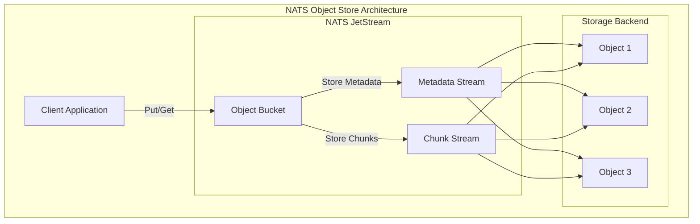
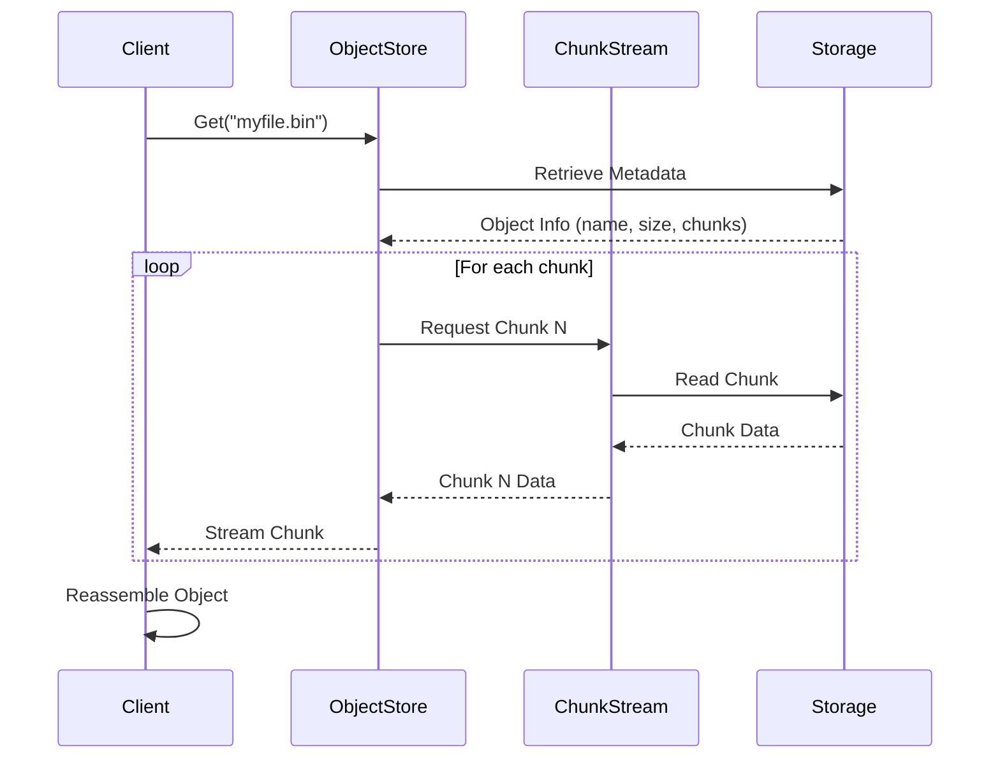
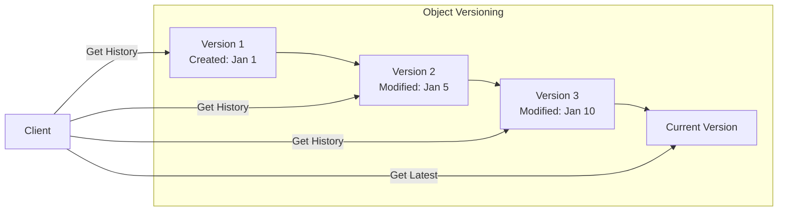

# How to Implement Object Store with NATS

Author: [nawazdhandala](https://github.com/nawazdhandala)

Tags: NATS, Object Store, Messaging, JetStream, Distributed Systems, Go, Node.js

Description: Learn how to implement object storage using NATS JetStream Object Store for storing and retrieving large binary objects with versioning, compression, and chunking capabilities.

---

NATS JetStream Object Store provides a simple yet powerful way to store and retrieve large binary objects in a distributed system. Unlike traditional blob storage services, NATS Object Store integrates seamlessly with your existing NATS infrastructure, enabling you to store files, configurations, machine learning models, and other binary data alongside your messaging system.

## Understanding NATS Object Store Architecture

NATS Object Store is built on top of JetStream, the persistence layer for NATS. It automatically handles chunking large objects, supports versioning, and provides efficient retrieval through streaming.



## Prerequisites and Installation

Before implementing Object Store, you need a NATS server with JetStream enabled.

Start a NATS server with JetStream using Docker with the following command. JetStream provides the persistence layer required for Object Store functionality.

```bash
docker run -d --name nats-server \
  -p 4222:4222 \
  -p 8222:8222 \
  nats:latest \
  -js \
  -m 8222
```

Install the NATS client libraries for your preferred language.

```bash
# Go
go get github.com/nats-io/nats.go

# Node.js
npm install nats
```

## Creating an Object Store Bucket

Object Store uses buckets to organize objects, similar to S3 buckets. Each bucket can have its own configuration for storage limits, TTL, and replication.

### Go Implementation

Create a connection to NATS and initialize an Object Store bucket. The bucket configuration defines storage limits and replication settings for all objects stored within it.

```go
package main

import (
    "context"
    "fmt"
    "log"
    "time"

    "github.com/nats-io/nats.go"
    "github.com/nats-io/nats.go/jetstream"
)

func main() {
    // Connect to NATS server
    // The connection handles automatic reconnection and error recovery
    nc, err := nats.Connect(
        nats.DefaultURL,
        nats.Name("object-store-client"),
        nats.ReconnectWait(2*time.Second),
        nats.MaxReconnects(10),
    )
    if err != nil {
        log.Fatalf("Failed to connect to NATS: %v", err)
    }
    defer nc.Close()

    // Create JetStream context
    // JetStream is required for Object Store functionality
    js, err := jetstream.New(nc)
    if err != nil {
        log.Fatalf("Failed to create JetStream context: %v", err)
    }

    ctx := context.Background()

    // Create an Object Store bucket with configuration
    // Buckets organize objects and define storage policies
    objStore, err := js.CreateObjectStore(ctx, jetstream.ObjectStoreConfig{
        Bucket:      "my-files",           // Unique bucket name
        Description: "Application file storage",
        TTL:         24 * time.Hour,       // Objects expire after 24 hours (0 for no expiry)
        MaxBytes:    1024 * 1024 * 1024,   // 1GB max storage for bucket
        Storage:     jetstream.FileStorage, // Use file storage for durability
        Replicas:    3,                    // Replicate across 3 nodes for HA
    })
    if err != nil {
        log.Fatalf("Failed to create Object Store bucket: %v", err)
    }

    fmt.Printf("Created bucket: %s\n", objStore.Bucket())
}
```

### Node.js Implementation

Connect to NATS and create an Object Store bucket using the JavaScript client. The async/await pattern makes working with JetStream straightforward.

```javascript
const { connect, StorageType } = require('nats');

async function createObjectStore() {
    // Connect to NATS server
    // The connection automatically handles reconnection
    const nc = await connect({
        servers: 'localhost:4222',
        name: 'object-store-client',
        reconnect: true,
        maxReconnectAttempts: 10,
        reconnectTimeWait: 2000,
    });

    console.log('Connected to NATS');

    // Get JetStream manager for creating buckets
    const jsm = await nc.jetstreamManager();

    // Create Object Store bucket
    // Configuration determines storage limits and replication
    const objStore = await jsm.objects.create('my-files', {
        description: 'Application file storage',
        ttl: 24 * 60 * 60 * 1000, // 24 hours in milliseconds
        max_bytes: 1024 * 1024 * 1024, // 1GB
        storage: StorageType.File,
        num_replicas: 3,
    });

    console.log(`Created bucket: my-files`);

    // Get the object store handle for operations
    const js = nc.jetstream();
    const os = await js.views.os('my-files');

    return { nc, os };
}

createObjectStore().catch(console.error);
```

## Storing Objects

NATS Object Store automatically chunks large objects and streams them efficiently. You can store objects from byte arrays, files, or streams.

### Storing from Bytes (Go)

Store a byte array as an object. Object Store handles chunking and compression automatically based on the configuration.

```go
func storeBytes(objStore jetstream.ObjectStore) error {
    ctx := context.Background()

    // Create object data
    data := []byte("Hello, NATS Object Store!")

    // Store the object with metadata
    // The Put operation chunks large data automatically
    info, err := objStore.PutBytes(ctx, "greeting.txt", data)
    if err != nil {
        return fmt.Errorf("failed to store object: %w", err)
    }

    fmt.Printf("Stored object: %s\n", info.Name)
    fmt.Printf("Size: %d bytes\n", info.Size)
    fmt.Printf("Chunks: %d\n", info.Chunks)
    fmt.Printf("Digest: %s\n", info.Digest)

    return nil
}
```

### Storing from File (Go)

Store a file directly using a reader. Large files are automatically chunked into manageable pieces for efficient storage and transfer.

```go
func storeFile(objStore jetstream.ObjectStore, filePath string) error {
    ctx := context.Background()

    // Open the file for reading
    file, err := os.Open(filePath)
    if err != nil {
        return fmt.Errorf("failed to open file: %w", err)
    }
    defer file.Close()

    // Get file info for the object name
    fileInfo, err := file.Stat()
    if err != nil {
        return fmt.Errorf("failed to stat file: %w", err)
    }

    // Create object metadata
    // Metadata provides additional context about the object
    meta := jetstream.ObjectMeta{
        Name:        fileInfo.Name(),
        Description: "Uploaded file",
        Headers: nats.Header{
            "Content-Type": []string{"application/octet-stream"},
            "Uploaded-By":  []string{"my-application"},
        },
    }

    // Store the object from reader
    // Large files are automatically chunked
    info, err := objStore.Put(ctx, meta, file)
    if err != nil {
        return fmt.Errorf("failed to store file: %w", err)
    }

    fmt.Printf("Stored file: %s (%d bytes in %d chunks)\n",
        info.Name, info.Size, info.Chunks)

    return nil
}
```

### Node.js Object Storage

Store objects using the JavaScript client. The put operation accepts buffers, strings, or readable streams.

```javascript
async function storeObjects(os) {
    // Store a simple string as bytes
    const textData = Buffer.from('Hello, NATS Object Store!');
    const textInfo = await os.put(
        { name: 'greeting.txt' },
        textData
    );
    console.log(`Stored: ${textInfo.name}, Size: ${textInfo.size}`);

    // Store with custom headers and metadata
    // Headers provide additional context for the object
    const jsonData = JSON.stringify({ key: 'value', timestamp: Date.now() });
    const jsonInfo = await os.put(
        {
            name: 'config.json',
            description: 'Application configuration',
            headers: {
                'Content-Type': 'application/json',
                'Version': '1.0.0',
            },
        },
        Buffer.from(jsonData)
    );
    console.log(`Stored: ${jsonInfo.name}, Digest: ${jsonInfo.digest}`);
}
```

## Retrieving Objects

Object Store provides multiple ways to retrieve objects - as bytes, to files, or as streams for large objects.



### Retrieving as Bytes (Go)

Retrieve an entire object as a byte array. Suitable for smaller objects that fit comfortably in memory.

```go
func retrieveBytes(objStore jetstream.ObjectStore, objectName string) ([]byte, error) {
    ctx := context.Background()

    // GetBytes loads the entire object into memory
    // Use this for smaller objects only
    data, err := objStore.GetBytes(ctx, objectName)
    if err != nil {
        if errors.Is(err, jetstream.ErrObjectNotFound) {
            return nil, fmt.Errorf("object not found: %s", objectName)
        }
        return nil, fmt.Errorf("failed to retrieve object: %w", err)
    }

    return data, nil
}
```

### Streaming Large Objects (Go)

For large objects, use streaming to avoid loading everything into memory. The reader provides efficient chunk-by-chunk access.

```go
func streamObject(objStore jetstream.ObjectStore, objectName string, writer io.Writer) error {
    ctx := context.Background()

    // Get returns a reader for streaming large objects
    // Chunks are fetched on demand as you read
    result, err := objStore.Get(ctx, objectName)
    if err != nil {
        return fmt.Errorf("failed to get object: %w", err)
    }
    defer result.Close()

    // Get object info before streaming
    info, err := result.Info()
    if err != nil {
        return fmt.Errorf("failed to get object info: %w", err)
    }

    fmt.Printf("Streaming object: %s (%d bytes)\n", info.Name, info.Size)

    // Copy data in chunks to the writer
    // Memory usage stays constant regardless of object size
    buffer := make([]byte, 32*1024) // 32KB buffer
    totalRead := int64(0)

    for {
        n, err := result.Read(buffer)
        if n > 0 {
            if _, writeErr := writer.Write(buffer[:n]); writeErr != nil {
                return fmt.Errorf("failed to write: %w", writeErr)
            }
            totalRead += int64(n)
        }
        if err == io.EOF {
            break
        }
        if err != nil {
            return fmt.Errorf("failed to read: %w", err)
        }
    }

    fmt.Printf("Successfully streamed %d bytes\n", totalRead)
    return nil
}
```

### Node.js Object Retrieval

Retrieve objects in Node.js with support for both small objects and large streaming reads.

```javascript
async function retrieveObjects(os) {
    // Get object info without downloading data
    const info = await os.info('greeting.txt');
    console.log(`Object: ${info.name}`);
    console.log(`Size: ${info.size} bytes`);
    console.log(`Chunks: ${info.chunks}`);
    console.log(`Modified: ${new Date(info.mtime)}`);

    // Retrieve entire object as buffer
    // Suitable for smaller objects
    const result = await os.get('greeting.txt');
    const data = await result.data;
    console.log(`Content: ${data.toString()}`);

    // Stream large objects to avoid memory issues
    const largeResult = await os.get('large-file.bin');
    const writeStream = require('fs').createWriteStream('/tmp/downloaded.bin');

    for await (const chunk of largeResult.data) {
        writeStream.write(chunk);
    }
    writeStream.end();
    console.log('Large file downloaded');
}
```

## Object Versioning and History

NATS Object Store maintains version history by default. You can access previous versions and track changes over time.



### Working with Versions (Go)

Access object history and retrieve specific versions. Version tracking helps with auditing and rollback scenarios.

```go
func workWithVersions(objStore jetstream.ObjectStore, objectName string) error {
    ctx := context.Background()

    // Store multiple versions of the same object
    for i := 1; i <= 3; i++ {
        data := []byte(fmt.Sprintf("Version %d content", i))
        _, err := objStore.PutBytes(ctx, objectName, data)
        if err != nil {
            return fmt.Errorf("failed to store version %d: %w", i, err)
        }
        time.Sleep(100 * time.Millisecond) // Small delay between versions
    }

    // Get current object info
    info, err := objStore.GetInfo(ctx, objectName)
    if err != nil {
        return fmt.Errorf("failed to get info: %w", err)
    }

    fmt.Printf("Current version - Name: %s, Size: %d, Modified: %s\n",
        info.Name, info.Size, info.ModTime)

    // List all objects in the bucket
    // Each entry shows the latest version of each object
    lister, err := objStore.List(ctx)
    if err != nil {
        return fmt.Errorf("failed to list objects: %w", err)
    }

    for info := range lister {
        fmt.Printf("Object: %s, Size: %d, Digest: %s\n",
            info.Name, info.Size, info.Digest)
    }

    return nil
}
```

### Watching for Changes

Subscribe to object changes in real-time. Watch notifications enable reactive patterns when objects are created, updated, or deleted.

```go
func watchObjects(objStore jetstream.ObjectStore) error {
    ctx, cancel := context.WithTimeout(context.Background(), 5*time.Minute)
    defer cancel()

    // Watch for all object changes in the bucket
    // Useful for cache invalidation and event-driven architectures
    watcher, err := objStore.Watch(ctx)
    if err != nil {
        return fmt.Errorf("failed to create watcher: %w", err)
    }
    defer watcher.Stop()

    fmt.Println("Watching for object changes...")

    // Process change notifications
    for {
        select {
        case info, ok := <-watcher.Updates():
            if !ok {
                return nil // Watcher closed
            }
            if info == nil {
                continue // Initial state complete
            }

            if info.Deleted {
                fmt.Printf("Object deleted: %s\n", info.Name)
            } else {
                fmt.Printf("Object changed: %s (size: %d)\n", info.Name, info.Size)
            }

        case <-ctx.Done():
            return ctx.Err()
        }
    }
}
```

## Deleting Objects

Remove objects from the store. Deletion can be immediate or soft-delete depending on your needs.

```go
func deleteObject(objStore jetstream.ObjectStore, objectName string) error {
    ctx := context.Background()

    // Delete removes the object from the bucket
    // The operation is idempotent - deleting non-existent objects does not error
    err := objStore.Delete(ctx, objectName)
    if err != nil {
        return fmt.Errorf("failed to delete object: %w", err)
    }

    fmt.Printf("Deleted object: %s\n", objectName)
    return nil
}
```

## Advanced: Object Links

NATS Object Store supports symbolic links between objects. Links allow you to create references without duplicating data.

```go
func createObjectLink(objStore jetstream.ObjectStore) error {
    ctx := context.Background()

    // Store the original object
    _, err := objStore.PutBytes(ctx, "original.txt", []byte("Original content"))
    if err != nil {
        return fmt.Errorf("failed to store original: %w", err)
    }

    // Create a link to the original object
    // Links point to other objects without copying data
    linkInfo, err := objStore.AddLink(ctx, "link-to-original.txt", &jetstream.ObjectInfo{
        Name:   "original.txt",
        Bucket: objStore.Bucket(),
    })
    if err != nil {
        return fmt.Errorf("failed to create link: %w", err)
    }

    fmt.Printf("Created link: %s -> %s\n", linkInfo.Name, "original.txt")

    // Access through the link works like a regular object
    data, err := objStore.GetBytes(ctx, "link-to-original.txt")
    if err != nil {
        return fmt.Errorf("failed to get linked object: %w", err)
    }

    fmt.Printf("Content via link: %s\n", string(data))
    return nil
}
```

## Cross-Bucket Links

Link objects across different buckets for organizing related data.

```go
func crossBucketLink(js jetstream.JetStream) error {
    ctx := context.Background()

    // Create two buckets
    bucket1, err := js.CreateObjectStore(ctx, jetstream.ObjectStoreConfig{
        Bucket: "bucket-1",
    })
    if err != nil {
        return err
    }

    bucket2, err := js.CreateObjectStore(ctx, jetstream.ObjectStoreConfig{
        Bucket: "bucket-2",
    })
    if err != nil {
        return err
    }

    // Store object in bucket-1
    _, err = bucket1.PutBytes(ctx, "shared-config.json", []byte(`{"shared": true}`))
    if err != nil {
        return err
    }

    // Create link in bucket-2 pointing to bucket-1
    _, err = bucket2.AddBucketLink(ctx, "config-link", bucket1)
    if err != nil {
        return err
    }

    fmt.Println("Created cross-bucket link")
    return nil
}
```

## Error Handling and Retry Logic

Implement robust error handling with retries for production systems.

```go
func robustObjectOperation(objStore jetstream.ObjectStore, name string, data []byte) error {
    ctx := context.Background()

    maxRetries := 3
    backoff := 100 * time.Millisecond

    var lastErr error

    for attempt := 1; attempt <= maxRetries; attempt++ {
        _, err := objStore.PutBytes(ctx, name, data)
        if err == nil {
            return nil // Success
        }

        lastErr = err

        // Check if error is retryable
        if isRetryableError(err) {
            fmt.Printf("Attempt %d failed, retrying in %v: %v\n",
                attempt, backoff, err)
            time.Sleep(backoff)
            backoff *= 2 // Exponential backoff
            continue
        }

        // Non-retryable error, fail immediately
        return fmt.Errorf("non-retryable error: %w", err)
    }

    return fmt.Errorf("failed after %d attempts: %w", maxRetries, lastErr)
}

func isRetryableError(err error) bool {
    // Network timeouts and temporary failures are retryable
    return errors.Is(err, nats.ErrTimeout) ||
           errors.Is(err, nats.ErrNoResponders) ||
           errors.Is(err, context.DeadlineExceeded)
}
```

## Complete Example: File Upload Service

A production-ready file upload service using NATS Object Store with proper error handling, validation, and metadata management.

```go
package main

import (
    "context"
    "crypto/sha256"
    "encoding/hex"
    "fmt"
    "io"
    "log"
    "mime"
    "path/filepath"
    "time"

    "github.com/nats-io/nats.go"
    "github.com/nats-io/nats.go/jetstream"
)

// FileUploadService handles file storage operations
type FileUploadService struct {
    objStore jetstream.ObjectStore
    maxSize  int64
}

// NewFileUploadService creates a new file upload service
func NewFileUploadService(nc *nats.Conn, bucketName string) (*FileUploadService, error) {
    js, err := jetstream.New(nc)
    if err != nil {
        return nil, fmt.Errorf("failed to create JetStream context: %w", err)
    }

    ctx := context.Background()

    // Create or get existing bucket
    objStore, err := js.CreateOrUpdateObjectStore(ctx, jetstream.ObjectStoreConfig{
        Bucket:      bucketName,
        Description: "File upload storage",
        MaxBytes:    10 * 1024 * 1024 * 1024, // 10GB total
        Storage:     jetstream.FileStorage,
        Replicas:    3,
    })
    if err != nil {
        return nil, fmt.Errorf("failed to create bucket: %w", err)
    }

    return &FileUploadService{
        objStore: objStore,
        maxSize:  100 * 1024 * 1024, // 100MB per file
    }, nil
}

// Upload stores a file with validation and metadata
func (s *FileUploadService) Upload(ctx context.Context, filename string, reader io.Reader, size int64) (*jetstream.ObjectInfo, error) {
    // Validate file size
    if size > s.maxSize {
        return nil, fmt.Errorf("file too large: %d bytes (max: %d)", size, s.maxSize)
    }

    // Detect content type from extension
    ext := filepath.Ext(filename)
    contentType := mime.TypeByExtension(ext)
    if contentType == "" {
        contentType = "application/octet-stream"
    }

    // Generate unique object name with timestamp
    timestamp := time.Now().Format("20060102-150405")
    objectName := fmt.Sprintf("%s-%s", timestamp, filename)

    // Calculate hash while reading (for verification)
    hashReader := newHashingReader(reader)

    // Create object metadata
    meta := jetstream.ObjectMeta{
        Name:        objectName,
        Description: fmt.Sprintf("Uploaded file: %s", filename),
        Headers: nats.Header{
            "Content-Type":     []string{contentType},
            "Original-Name":    []string{filename},
            "Upload-Timestamp": []string{time.Now().UTC().Format(time.RFC3339)},
        },
    }

    // Store the object
    info, err := s.objStore.Put(ctx, meta, hashReader)
    if err != nil {
        return nil, fmt.Errorf("failed to upload: %w", err)
    }

    // Log upload with computed hash
    log.Printf("Uploaded %s: %d bytes, SHA256: %s",
        objectName, info.Size, hashReader.Sum())

    return info, nil
}

// Download retrieves a file by name
func (s *FileUploadService) Download(ctx context.Context, objectName string) (io.ReadCloser, *jetstream.ObjectInfo, error) {
    result, err := s.objStore.Get(ctx, objectName)
    if err != nil {
        return nil, nil, fmt.Errorf("failed to download: %w", err)
    }

    info, err := result.Info()
    if err != nil {
        result.Close()
        return nil, nil, fmt.Errorf("failed to get info: %w", err)
    }

    return result, info, nil
}

// List returns all files in the bucket
func (s *FileUploadService) List(ctx context.Context) ([]*jetstream.ObjectInfo, error) {
    lister, err := s.objStore.List(ctx)
    if err != nil {
        return nil, fmt.Errorf("failed to list: %w", err)
    }

    var files []*jetstream.ObjectInfo
    for info := range lister {
        files = append(files, info)
    }

    return files, nil
}

// Delete removes a file by name
func (s *FileUploadService) Delete(ctx context.Context, objectName string) error {
    return s.objStore.Delete(ctx, objectName)
}

// hashingReader wraps a reader and computes SHA256 hash
type hashingReader struct {
    reader io.Reader
    hasher *sha256.Hash
}

func newHashingReader(r io.Reader) *hashingReader {
    h := sha256.New()
    return &hashingReader{
        reader: io.TeeReader(r, h),
        hasher: &h,
    }
}

func (h *hashingReader) Read(p []byte) (int, error) {
    return h.reader.Read(p)
}

func (h *hashingReader) Sum() string {
    return hex.EncodeToString((*h.hasher).Sum(nil))
}

func main() {
    // Connect to NATS
    nc, err := nats.Connect(nats.DefaultURL)
    if err != nil {
        log.Fatal(err)
    }
    defer nc.Close()

    // Create upload service
    service, err := NewFileUploadService(nc, "uploads")
    if err != nil {
        log.Fatal(err)
    }

    ctx := context.Background()

    // Example: Upload a file
    data := []byte("Example file content for demonstration")
    reader := &bytesReader{data: data}

    info, err := service.Upload(ctx, "example.txt", reader, int64(len(data)))
    if err != nil {
        log.Fatal(err)
    }

    fmt.Printf("Uploaded: %s\n", info.Name)

    // Example: List files
    files, err := service.List(ctx)
    if err != nil {
        log.Fatal(err)
    }

    fmt.Println("\nFiles in bucket:")
    for _, f := range files {
        fmt.Printf("  - %s (%d bytes)\n", f.Name, f.Size)
    }
}

type bytesReader struct {
    data []byte
    pos  int
}

func (b *bytesReader) Read(p []byte) (int, error) {
    if b.pos >= len(b.data) {
        return 0, io.EOF
    }
    n := copy(p, b.data[b.pos:])
    b.pos += n
    return n, nil
}
```

## Monitoring and Observability

Track Object Store metrics for production monitoring.

```go
func monitorObjectStore(js jetstream.JetStream, bucketName string) error {
    ctx := context.Background()

    // Get bucket status and metrics
    objStore, err := js.ObjectStore(ctx, bucketName)
    if err != nil {
        return err
    }

    status, err := objStore.Status(ctx)
    if err != nil {
        return err
    }

    // Extract metrics for monitoring systems
    fmt.Printf("Bucket: %s\n", status.Bucket())
    fmt.Printf("Description: %s\n", status.Description())
    fmt.Printf("TTL: %v\n", status.TTL())
    fmt.Printf("Storage Type: %s\n", status.BackingStore())
    fmt.Printf("Replicas: %d\n", status.Replicas())

    // Get underlying stream info for detailed metrics
    streamInfo := status.StreamInfo()
    if streamInfo != nil {
        fmt.Printf("Messages: %d\n", streamInfo.State.Msgs)
        fmt.Printf("Bytes: %d\n", streamInfo.State.Bytes)
        fmt.Printf("First Seq: %d\n", streamInfo.State.FirstSeq)
        fmt.Printf("Last Seq: %d\n", streamInfo.State.LastSeq)
    }

    return nil
}
```

## Summary

| Feature | Description |
|---------|-------------|
| **Bucket Creation** | Organize objects with storage limits and replication |
| **Put/Get** | Store and retrieve objects as bytes or streams |
| **Chunking** | Automatic splitting of large objects |
| **Versioning** | Track object history and changes |
| **Watch** | Real-time notifications for object changes |
| **Links** | Symbolic references between objects |
| **Cross-Bucket** | Link objects across different buckets |

NATS Object Store provides a lightweight, integrated solution for binary object storage within your NATS infrastructure. By leveraging JetStream's persistence layer, you get automatic replication, efficient chunking, and seamless integration with your existing NATS messaging patterns. For applications already using NATS, Object Store eliminates the need for separate blob storage services while maintaining high performance and reliability.
