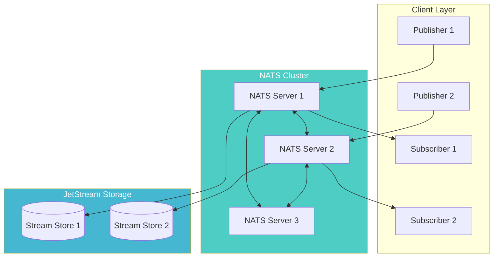
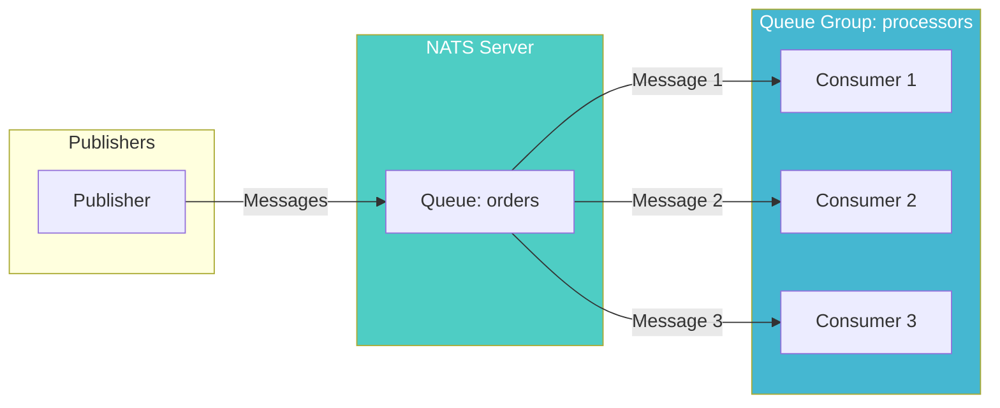
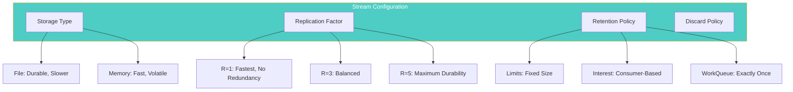
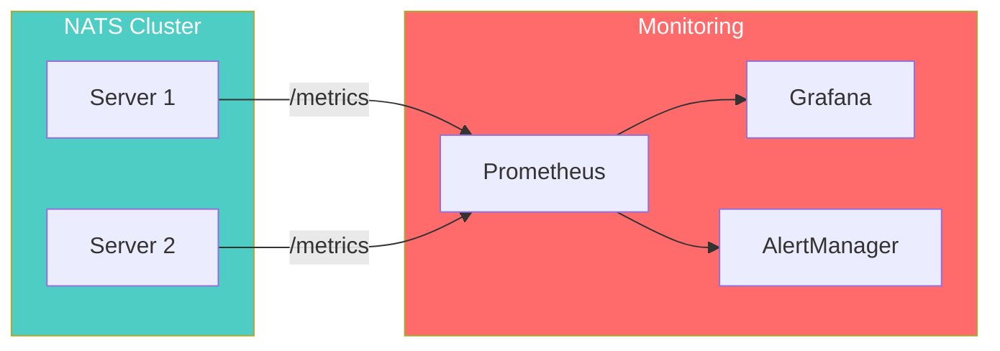
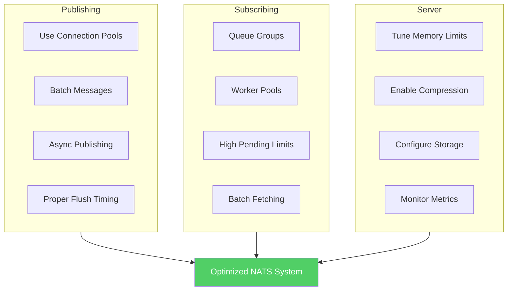

# How to Optimize NATS Performance

Author: [nawazdhandala](https://github.com/nawazdhandala)

Tags: NATS, Messaging, Performance, Microservices, Go, Backend, Distributed Systems

Description: Learn how to optimize NATS performance for high-throughput messaging systems. Covers connection management, message batching, JetStream tuning, cluster configuration, and production best practices for achieving maximum throughput and low latency.

---

NATS is a high-performance messaging system known for its simplicity and speed. While NATS delivers excellent performance out of the box, proper configuration and usage patterns can dramatically improve throughput and reduce latency. Understanding these optimization techniques is essential for building scalable real-time applications.

## NATS Architecture Overview

Before diving into optimizations, understanding the NATS architecture helps identify where bottlenecks can occur and where tuning efforts will have the greatest impact.



## Connection Optimization

Connection management is fundamental to NATS performance. Reusing connections and configuring them properly prevents overhead from repeated handshakes.

### Connection Pooling

Creating a connection pool allows multiple goroutines or threads to share connections efficiently without blocking.

```go
package main

import (
    "log"
    "sync"
    "time"

    "github.com/nats-io/nats.go"
)

// ConnectionPool manages a pool of NATS connections for concurrent use
type ConnectionPool struct {
    connections []*nats.Conn
    mu          sync.RWMutex
    index       uint64
}

// NewConnectionPool creates a pool with the specified number of connections
// Using multiple connections allows parallel message processing
func NewConnectionPool(servers string, poolSize int) (*ConnectionPool, error) {
    pool := &ConnectionPool{
        connections: make([]*nats.Conn, poolSize),
    }

    opts := []nats.Option{
        // Disable verbose logging for better performance
        nats.NoEcho(),
        // Set larger buffer sizes for high throughput
        nats.ReconnectBufSize(64 * 1024 * 1024), // 64MB reconnect buffer
        // Configure reconnect behavior
        nats.MaxReconnects(-1), // Unlimited reconnects
        nats.ReconnectWait(100 * time.Millisecond),
        // Flush pending data more frequently
        nats.FlusherTimeout(10 * time.Millisecond),
        // Error handler for monitoring
        nats.ErrorHandler(func(nc *nats.Conn, sub *nats.Subscription, err error) {
            log.Printf("NATS error: %v", err)
        }),
    }

    // Create connections in parallel for faster initialization
    var wg sync.WaitGroup
    errChan := make(chan error, poolSize)

    for i := 0; i < poolSize; i++ {
        wg.Add(1)
        go func(idx int) {
            defer wg.Done()
            nc, err := nats.Connect(servers, opts...)
            if err != nil {
                errChan <- err
                return
            }
            pool.connections[idx] = nc
        }(i)
    }

    wg.Wait()
    close(errChan)

    // Check for connection errors
    if err := <-errChan; err != nil {
        return nil, err
    }

    return pool, nil
}

// Get returns a connection using round-robin selection
// Distributes load evenly across all pooled connections
func (p *ConnectionPool) Get() *nats.Conn {
    p.mu.RLock()
    defer p.mu.RUnlock()

    idx := p.index % uint64(len(p.connections))
    p.index++
    return p.connections[idx]
}

// Close drains and closes all connections gracefully
func (p *ConnectionPool) Close() {
    p.mu.Lock()
    defer p.mu.Unlock()

    for _, nc := range p.connections {
        if nc != nil {
            // Drain ensures pending messages are processed
            nc.Drain()
        }
    }
}
```

### Optimized Connection Options

Configuring connection options correctly impacts both throughput and resilience.

```go
package main

import (
    "time"

    "github.com/nats-io/nats.go"
)

// CreateOptimizedConnection returns a connection configured for high performance
func CreateOptimizedConnection(servers string) (*nats.Conn, error) {
    return nats.Connect(
        servers,
        // Increase pending message limits for high throughput
        // Default is 65536 messages and 64MB
        nats.PendingLimits(1000000, 256*1024*1024),

        // Larger reconnect buffer prevents message loss during reconnects
        nats.ReconnectBufSize(128 * 1024 * 1024), // 128MB

        // Ping interval for connection health checking
        // Lower values detect failures faster but add overhead
        nats.PingInterval(20 * time.Second),
        nats.MaxPingsOutstanding(3),

        // Connection timeout settings
        nats.Timeout(5 * time.Second),
        nats.DrainTimeout(30 * time.Second),

        // Disable echo to prevent receiving own published messages
        nats.NoEcho(),

        // Use multiple server URLs for high availability
        // NATS will automatically reconnect to available servers
        nats.DontRandomize(), // Connect to servers in order

        // Custom dialer for TCP optimizations
        nats.SetCustomDialer(&nats.DefaultNetDialer{
            DialTimeout: 5 * time.Second,
        }),
    )
}
```

## Message Publishing Optimization

Publishing patterns significantly impact throughput. Batching messages and using asynchronous publishing prevents blocking on network I/O.

### Asynchronous Publishing with Batching

Batching multiple messages before flushing reduces the number of network round trips.

```go
package main

import (
    "log"
    "sync"
    "time"

    "github.com/nats-io/nats.go"
)

// BatchPublisher buffers messages and flushes them in batches
type BatchPublisher struct {
    nc          *nats.Conn
    batchSize   int
    flushPeriod time.Duration
    pending     int
    mu          sync.Mutex
    stopCh      chan struct{}
}

// NewBatchPublisher creates a publisher that batches messages
// batchSize controls how many messages accumulate before auto-flush
// flushPeriod ensures messages are sent even with low volume
func NewBatchPublisher(nc *nats.Conn, batchSize int, flushPeriod time.Duration) *BatchPublisher {
    bp := &BatchPublisher{
        nc:          nc,
        batchSize:   batchSize,
        flushPeriod: flushPeriod,
        stopCh:      make(chan struct{}),
    }

    // Start periodic flush goroutine
    go bp.periodicFlush()

    return bp
}

// Publish adds a message to the batch, flushing when batch is full
func (bp *BatchPublisher) Publish(subject string, data []byte) error {
    bp.mu.Lock()
    defer bp.mu.Unlock()

    // Publish without waiting for server acknowledgment
    if err := bp.nc.Publish(subject, data); err != nil {
        return err
    }

    bp.pending++

    // Flush when batch size is reached
    if bp.pending >= bp.batchSize {
        return bp.flushLocked()
    }

    return nil
}

// PublishAsync publishes without any synchronization for maximum speed
// Use when message ordering and exact delivery guarantees are not critical
func (bp *BatchPublisher) PublishAsync(subject string, data []byte) error {
    return bp.nc.Publish(subject, data)
}

// flushLocked flushes pending messages, must hold lock
func (bp *BatchPublisher) flushLocked() error {
    if bp.pending == 0 {
        return nil
    }

    err := bp.nc.Flush()
    if err == nil {
        bp.pending = 0
    }
    return err
}

// Flush forces an immediate flush of pending messages
func (bp *BatchPublisher) Flush() error {
    bp.mu.Lock()
    defer bp.mu.Unlock()
    return bp.flushLocked()
}

// periodicFlush ensures messages are sent even during low activity
func (bp *BatchPublisher) periodicFlush() {
    ticker := time.NewTicker(bp.flushPeriod)
    defer ticker.Stop()

    for {
        select {
        case <-ticker.C:
            bp.mu.Lock()
            if err := bp.flushLocked(); err != nil {
                log.Printf("Periodic flush error: %v", err)
            }
            bp.mu.Unlock()
        case <-bp.stopCh:
            return
        }
    }
}

// Close stops the publisher and flushes remaining messages
func (bp *BatchPublisher) Close() error {
    close(bp.stopCh)
    return bp.Flush()
}
```

### High-Throughput Publishing Pattern

For maximum throughput, use multiple goroutines publishing in parallel with shared connections.

```go
package main

import (
    "encoding/json"
    "log"
    "runtime"
    "sync"
    "time"

    "github.com/nats-io/nats.go"
)

// Message represents the data being published
type Message struct {
    ID        string    `json:"id"`
    Timestamp time.Time `json:"timestamp"`
    Payload   []byte    `json:"payload"`
}

// HighThroughputPublisher uses worker pools for parallel publishing
type HighThroughputPublisher struct {
    pool     *ConnectionPool
    workers  int
    msgChan  chan *publishJob
    wg       sync.WaitGroup
}

type publishJob struct {
    subject string
    data    []byte
    errCh   chan error
}

// NewHighThroughputPublisher creates a publisher optimized for high message rates
// workers should typically match the number of CPU cores
func NewHighThroughputPublisher(pool *ConnectionPool, workers int) *HighThroughputPublisher {
    if workers <= 0 {
        workers = runtime.NumCPU()
    }

    htp := &HighThroughputPublisher{
        pool:    pool,
        workers: workers,
        msgChan: make(chan *publishJob, workers*1000), // Buffer for burst handling
    }

    // Start worker goroutines
    for i := 0; i < workers; i++ {
        htp.wg.Add(1)
        go htp.worker(i)
    }

    return htp
}

// worker processes publish jobs from the channel
func (htp *HighThroughputPublisher) worker(id int) {
    defer htp.wg.Done()

    // Get a connection for this worker
    nc := htp.pool.Get()
    batchCount := 0
    const flushInterval = 100 // Flush every 100 messages

    for job := range htp.msgChan {
        err := nc.Publish(job.subject, job.data)

        if job.errCh != nil {
            job.errCh <- err
        }

        batchCount++
        // Periodic flush to prevent buffer buildup
        if batchCount >= flushInterval {
            nc.Flush()
            batchCount = 0
        }
    }

    // Final flush on shutdown
    nc.Flush()
}

// Publish sends a message asynchronously through the worker pool
func (htp *HighThroughputPublisher) Publish(subject string, msg *Message) error {
    data, err := json.Marshal(msg)
    if err != nil {
        return err
    }

    htp.msgChan <- &publishJob{
        subject: subject,
        data:    data,
        errCh:   nil, // Fire and forget
    }

    return nil
}

// PublishSync sends a message and waits for confirmation
func (htp *HighThroughputPublisher) PublishSync(subject string, msg *Message) error {
    data, err := json.Marshal(msg)
    if err != nil {
        return err
    }

    errCh := make(chan error, 1)
    htp.msgChan <- &publishJob{
        subject: subject,
        data:    data,
        errCh:   errCh,
    }

    return <-errCh
}

// Close shuts down all workers gracefully
func (htp *HighThroughputPublisher) Close() {
    close(htp.msgChan)
    htp.wg.Wait()
}
```

## Subscription Optimization

Subscriber performance depends on message handling speed and proper use of queue groups for parallel processing.

### Optimized Queue Group Subscriber

Queue groups distribute messages across subscribers, enabling horizontal scaling.



Creating queue group subscriptions with proper error handling and backpressure management ensures reliable message processing.

```go
package main

import (
    "context"
    "log"
    "runtime"
    "sync"
    "time"

    "github.com/nats-io/nats.go"
)

// MessageHandler processes incoming messages
type MessageHandler func(msg *nats.Msg) error

// OptimizedSubscriber handles high-volume message consumption
type OptimizedSubscriber struct {
    nc          *nats.Conn
    sub         *nats.Subscription
    handler     MessageHandler
    workerCount int
    msgChan     chan *nats.Msg
    wg          sync.WaitGroup
    ctx         context.Context
    cancel      context.CancelFunc
}

// NewOptimizedSubscriber creates a subscriber with parallel message processing
// workerCount determines how many goroutines process messages concurrently
func NewOptimizedSubscriber(nc *nats.Conn, subject, queue string, handler MessageHandler, workerCount int) (*OptimizedSubscriber, error) {
    if workerCount <= 0 {
        workerCount = runtime.NumCPU() * 2
    }

    ctx, cancel := context.WithCancel(context.Background())

    os := &OptimizedSubscriber{
        nc:          nc,
        handler:     handler,
        workerCount: workerCount,
        msgChan:     make(chan *nats.Msg, workerCount*100), // Buffer for burst handling
        ctx:         ctx,
        cancel:      cancel,
    }

    // Configure subscription with high pending limits
    // Prevents slow subscribers from blocking the server
    sub, err := nc.QueueSubscribe(subject, queue, func(msg *nats.Msg) {
        select {
        case os.msgChan <- msg:
            // Message queued for processing
        case <-ctx.Done():
            // Subscriber shutting down
        default:
            // Channel full, apply backpressure
            log.Printf("Warning: message channel full, dropping message")
        }
    })

    if err != nil {
        cancel()
        return nil, err
    }

    // Set high pending limits for the subscription
    // Allows buffering more messages during processing spikes
    sub.SetPendingLimits(1000000, 512*1024*1024) // 1M messages, 512MB

    os.sub = sub

    // Start worker goroutines
    for i := 0; i < workerCount; i++ {
        os.wg.Add(1)
        go os.worker(i)
    }

    return os, nil
}

// worker processes messages from the channel
func (os *OptimizedSubscriber) worker(id int) {
    defer os.wg.Done()

    for {
        select {
        case msg := <-os.msgChan:
            if msg == nil {
                return
            }

            // Process message with error handling
            if err := os.handler(msg); err != nil {
                log.Printf("Worker %d: error processing message: %v", id, err)
                // Implement retry logic or dead letter queue here
            }

        case <-os.ctx.Done():
            return
        }
    }
}

// Close gracefully shuts down the subscriber
func (os *OptimizedSubscriber) Close() error {
    // Stop accepting new messages
    os.cancel()

    // Drain the subscription
    if err := os.sub.Drain(); err != nil {
        log.Printf("Error draining subscription: %v", err)
    }

    // Wait for workers to finish
    done := make(chan struct{})
    go func() {
        os.wg.Wait()
        close(done)
    }()

    // Wait with timeout
    select {
    case <-done:
        return nil
    case <-time.After(30 * time.Second):
        return context.DeadlineExceeded
    }
}
```

### Parallel Subscription Processing

For scenarios requiring even higher throughput, use multiple subscriptions across connections.

```go
package main

import (
    "log"
    "sync"

    "github.com/nats-io/nats.go"
)

// ParallelSubscriber creates multiple subscriptions for maximum throughput
type ParallelSubscriber struct {
    pool    *ConnectionPool
    subs    []*nats.Subscription
    handler MessageHandler
    mu      sync.Mutex
}

// NewParallelSubscriber distributes subscriptions across pooled connections
// Each connection gets its own subscription for parallel message delivery
func NewParallelSubscriber(pool *ConnectionPool, subject, queue string, handler MessageHandler) (*ParallelSubscriber, error) {
    ps := &ParallelSubscriber{
        pool:    pool,
        handler: handler,
        subs:    make([]*nats.Subscription, 0),
    }

    // Create a subscription on each connection in the pool
    for i := 0; i < len(pool.connections); i++ {
        nc := pool.connections[i]

        sub, err := nc.QueueSubscribe(subject, queue, func(msg *nats.Msg) {
            if err := handler(msg); err != nil {
                log.Printf("Error handling message: %v", err)
            }
        })

        if err != nil {
            ps.Close()
            return nil, err
        }

        // Configure each subscription for high throughput
        sub.SetPendingLimits(500000, 256*1024*1024)
        ps.subs = append(ps.subs, sub)
    }

    return ps, nil
}

// Close drains all subscriptions
func (ps *ParallelSubscriber) Close() error {
    ps.mu.Lock()
    defer ps.mu.Unlock()

    var lastErr error
    for _, sub := range ps.subs {
        if err := sub.Drain(); err != nil {
            lastErr = err
        }
    }
    return lastErr
}
```

## JetStream Performance Tuning

JetStream adds persistence to NATS. Proper configuration of streams and consumers is critical for performance.

### Stream Configuration for Performance

Stream settings directly impact write throughput and storage efficiency.



Configuring streams with appropriate settings based on your use case.

```go
package main

import (
    "time"

    "github.com/nats-io/nats.go"
)

// CreateHighPerformanceStream creates a stream optimized for throughput
func CreateHighPerformanceStream(js nats.JetStreamContext, name string, subjects []string) (*nats.StreamInfo, error) {
    return js.AddStream(&nats.StreamConfig{
        Name:     name,
        Subjects: subjects,

        // Storage configuration
        Storage:  nats.FileStorage,    // Use MemoryStorage for volatile high-speed
        Replicas: 1,                   // Increase for durability, decrease for speed

        // Retention configuration
        Retention:    nats.LimitsPolicy,       // Remove old messages based on limits
        MaxMsgs:      10000000,                // 10 million messages max
        MaxBytes:     10 * 1024 * 1024 * 1024, // 10GB max
        MaxAge:       24 * time.Hour,          // Keep messages for 24 hours
        MaxMsgSize:   1024 * 1024,             // 1MB max message size
        Discard:      nats.DiscardOld,         // Remove oldest when limits reached

        // Performance settings
        Duplicates:   2 * time.Minute,  // Deduplication window
        NoAck:        false,            // Require acknowledgments

        // Compression for storage efficiency
        Compression: nats.S2Compression, // S2 compression for file storage
    })
}

// CreateMemoryStream creates an in-memory stream for maximum speed
func CreateMemoryStream(js nats.JetStreamContext, name string, subjects []string) (*nats.StreamInfo, error) {
    return js.AddStream(&nats.StreamConfig{
        Name:       name,
        Subjects:   subjects,
        Storage:    nats.MemoryStorage, // Memory for lowest latency
        Replicas:   1,                  // Single replica for speed
        Retention:  nats.LimitsPolicy,
        MaxMsgs:    1000000,            // Limit memory usage
        MaxBytes:   1024 * 1024 * 1024, // 1GB max
        MaxAge:     time.Hour,          // Short retention
        Discard:    nats.DiscardOld,
    })
}

// CreateReplicatedStream creates a durable replicated stream
func CreateReplicatedStream(js nats.JetStreamContext, name string, subjects []string) (*nats.StreamInfo, error) {
    return js.AddStream(&nats.StreamConfig{
        Name:       name,
        Subjects:   subjects,
        Storage:    nats.FileStorage,
        Replicas:   3,                         // Survive 1 node failure
        Retention:  nats.LimitsPolicy,
        MaxMsgs:    -1,                        // Unlimited messages
        MaxBytes:   100 * 1024 * 1024 * 1024,  // 100GB
        MaxAge:     7 * 24 * time.Hour,        // 7 days retention
        Discard:    nats.DiscardOld,
        Compression: nats.S2Compression,
    })
}
```

### Consumer Configuration for Performance

Consumer settings affect message delivery latency and processing throughput.

```go
package main

import (
    "time"

    "github.com/nats-io/nats.go"
)

// CreatePushConsumer creates a push-based consumer for low latency delivery
func CreatePushConsumer(js nats.JetStreamContext, stream, consumer, deliverSubject string) (*nats.ConsumerInfo, error) {
    return js.AddConsumer(stream, &nats.ConsumerConfig{
        Durable:   consumer,
        AckPolicy: nats.AckExplicitPolicy,

        // Push-based delivery for lowest latency
        DeliverSubject: deliverSubject,
        DeliverGroup:   "workers", // Queue group for load balancing

        // Delivery configuration
        DeliverPolicy: nats.DeliverAllPolicy,
        MaxDeliver:    5, // Retry up to 5 times

        // Acknowledgment settings
        AckWait:       30 * time.Second, // Time to acknowledge
        MaxAckPending: 10000,            // High pending for throughput

        // Replay policy for redelivery
        ReplayPolicy: nats.ReplayInstantPolicy, // Instant replay for catch-up

        // Flow control prevents overwhelming slow consumers
        FlowControl: true,
        Heartbeat:   5 * time.Second,
    })
}

// CreatePullConsumer creates a pull-based consumer for controlled processing
func CreatePullConsumer(js nats.JetStreamContext, stream, consumer string) (*nats.ConsumerInfo, error) {
    return js.AddConsumer(stream, &nats.ConsumerConfig{
        Durable:   consumer,
        AckPolicy: nats.AckExplicitPolicy,

        // Pull-based delivery for backpressure control
        // No DeliverSubject means pull-based

        // Delivery configuration
        DeliverPolicy: nats.DeliverAllPolicy,
        MaxDeliver:    3,

        // Batching configuration
        MaxRequestBatch:   500,              // Fetch up to 500 messages at once
        MaxRequestExpires: 30 * time.Second, // Request timeout

        // Acknowledgment settings
        AckWait:       60 * time.Second,
        MaxAckPending: 50000, // High pending for batch processing

        // Replay instantly for maximum throughput
        ReplayPolicy: nats.ReplayInstantPolicy,
    })
}

// CreateEphemeralConsumer creates a temporary consumer for one-time processing
func CreateEphemeralConsumer(js nats.JetStreamContext, stream string) (*nats.ConsumerInfo, error) {
    return js.AddConsumer(stream, &nats.ConsumerConfig{
        // No Durable name makes it ephemeral
        AckPolicy:     nats.AckExplicitPolicy,
        DeliverPolicy: nats.DeliverNewPolicy, // Only new messages
        AckWait:       10 * time.Second,
        MaxAckPending: 1000,
        // Auto-deleted when no subscribers
        InactiveThreshold: 5 * time.Minute,
    })
}
```

### Batch Fetching for Pull Consumers

Pull consumers achieve higher throughput by fetching messages in batches.

```go
package main

import (
    "context"
    "log"
    "sync"
    "time"

    "github.com/nats-io/nats.go"
)

// BatchPullConsumer efficiently fetches and processes messages in batches
type BatchPullConsumer struct {
    js          nats.JetStreamContext
    sub         *nats.Subscription
    batchSize   int
    handler     func([]*nats.Msg) error
    workerCount int
    wg          sync.WaitGroup
    ctx         context.Context
    cancel      context.CancelFunc
}

// NewBatchPullConsumer creates a consumer that processes messages in batches
// Batch processing reduces per-message overhead and improves throughput
func NewBatchPullConsumer(js nats.JetStreamContext, stream, consumer string, batchSize, workerCount int, handler func([]*nats.Msg) error) (*BatchPullConsumer, error) {
    // Create pull subscription
    sub, err := js.PullSubscribe("", consumer, nats.Bind(stream, consumer))
    if err != nil {
        return nil, err
    }

    ctx, cancel := context.WithCancel(context.Background())

    bpc := &BatchPullConsumer{
        js:          js,
        sub:         sub,
        batchSize:   batchSize,
        handler:     handler,
        workerCount: workerCount,
        ctx:         ctx,
        cancel:      cancel,
    }

    // Start worker goroutines
    for i := 0; i < workerCount; i++ {
        bpc.wg.Add(1)
        go bpc.worker(i)
    }

    return bpc, nil
}

// worker continuously fetches and processes message batches
func (bpc *BatchPullConsumer) worker(id int) {
    defer bpc.wg.Done()

    for {
        select {
        case <-bpc.ctx.Done():
            return
        default:
        }

        // Fetch a batch of messages
        // Using FetchBatch for better control over timing
        msgs, err := bpc.sub.Fetch(bpc.batchSize, nats.MaxWait(5*time.Second))

        if err != nil {
            if err == nats.ErrTimeout {
                // No messages available, continue polling
                continue
            }
            log.Printf("Worker %d: fetch error: %v", id, err)
            continue
        }

        if len(msgs) == 0 {
            continue
        }

        // Process the batch
        if err := bpc.handler(msgs); err != nil {
            log.Printf("Worker %d: batch processing error: %v", id, err)
            // NAK messages for redelivery on error
            for _, msg := range msgs {
                msg.Nak()
            }
            continue
        }

        // Acknowledge all messages in the batch
        // Using AckSync for the last message ensures all prior acks are committed
        for i, msg := range msgs {
            if i == len(msgs)-1 {
                msg.AckSync()
            } else {
                msg.Ack()
            }
        }
    }
}

// Close gracefully shuts down the consumer
func (bpc *BatchPullConsumer) Close() error {
    bpc.cancel()
    bpc.wg.Wait()
    return bpc.sub.Drain()
}

// Example batch handler that processes messages in parallel
func processBatch(msgs []*nats.Msg) error {
    var wg sync.WaitGroup

    for _, msg := range msgs {
        wg.Add(1)
        go func(m *nats.Msg) {
            defer wg.Done()
            // Process individual message
            processMessage(m)
        }(msg)
    }

    wg.Wait()
    return nil
}

func processMessage(msg *nats.Msg) {
    // Message processing logic
    log.Printf("Processing message: %s", string(msg.Data))
}
```

## Server Configuration

NATS server configuration significantly impacts cluster performance and resource utilization.

### High-Performance Server Configuration

Server-side settings for production deployments focused on throughput.

```yaml
# nats-server.conf - High performance configuration

# Server identification
server_name: nats-1

# Networking
listen: 0.0.0.0:4222
http_port: 8222

# Client connection settings
max_connections: 100000
max_payload: 8MB
max_pending: 256MB
write_deadline: 10s

# Clustering for high availability
cluster {
  name: production-cluster
  listen: 0.0.0.0:6222

  # Route compression reduces inter-node bandwidth
  compression: s2_auto

  # Pool size for route connections
  pool_size: 3

  routes: [
    nats-route://nats-2:6222
    nats-route://nats-3:6222
  ]
}

# JetStream configuration
jetstream {
  # Storage directory for streams
  store_dir: /data/jetstream

  # Memory and storage limits
  max_memory_store: 4GB
  max_file_store: 100GB

  # Sync interval for file storage
  # Lower values increase durability but reduce throughput
  sync_interval: 1m
}

# Logging
debug: false
trace: false
logtime: true
log_file: /var/log/nats/nats.log

# System account for monitoring
system_account: SYS

# Accounts for multi-tenancy
accounts {
  SYS: {
    users: [
      {user: admin, password: $ADMIN_PASSWORD}
    ]
  }
  APP: {
    jetstream: enabled
    users: [
      {user: app, password: $APP_PASSWORD}
    ]
  }
}
```

### JetStream Cluster Configuration

Configuring JetStream for clustered deployments with high availability.

```yaml
# nats-cluster.conf - JetStream cluster configuration

server_name: nats-1

# Clustering
cluster {
  name: js-cluster
  listen: 0.0.0.0:6222

  routes: [
    nats-route://nats-2:6222
    nats-route://nats-3:6222
  ]

  # Cluster authentication
  authorization {
    user: cluster
    password: $CLUSTER_PASSWORD
    timeout: 2
  }
}

# JetStream with clustering
jetstream {
  store_dir: /data/jetstream
  max_memory_store: 8GB
  max_file_store: 500GB

  # Domain for JetStream clustering
  domain: production
}

# Limits for high throughput
max_connections: 50000
max_payload: 4MB
max_pending: 128MB
max_control_line: 4KB

# Connection timeouts
ping_interval: 2m
ping_max: 2
write_deadline: 30s

# TLS for security
tls {
  cert_file: /etc/nats/certs/server.crt
  key_file: /etc/nats/certs/server.key
  ca_file: /etc/nats/certs/ca.crt
  verify: true
}
```

## Monitoring and Metrics

Monitoring NATS performance helps identify bottlenecks and validate optimization efforts.

### Performance Metrics Collection



Collecting and exposing metrics for monitoring.

```go
package main

import (
    "context"
    "encoding/json"
    "fmt"
    "net/http"
    "time"

    "github.com/nats-io/nats.go"
    "github.com/prometheus/client_golang/prometheus"
    "github.com/prometheus/client_golang/prometheus/promhttp"
)

// NATSMetrics collects and exposes NATS performance metrics
type NATSMetrics struct {
    nc *nats.Conn

    // Prometheus metrics
    messagesPublished prometheus.Counter
    messagesReceived  prometheus.Counter
    bytesPublished    prometheus.Counter
    bytesReceived     prometheus.Counter
    connectionState   prometheus.Gauge
    pendingMessages   prometheus.Gauge
    reconnects        prometheus.Counter
    latencyHistogram  prometheus.Histogram
}

// NewNATSMetrics creates a metrics collector for NATS
func NewNATSMetrics(nc *nats.Conn, namespace string) *NATSMetrics {
    m := &NATSMetrics{
        nc: nc,
        messagesPublished: prometheus.NewCounter(prometheus.CounterOpts{
            Namespace: namespace,
            Name:      "messages_published_total",
            Help:      "Total number of messages published",
        }),
        messagesReceived: prometheus.NewCounter(prometheus.CounterOpts{
            Namespace: namespace,
            Name:      "messages_received_total",
            Help:      "Total number of messages received",
        }),
        bytesPublished: prometheus.NewCounter(prometheus.CounterOpts{
            Namespace: namespace,
            Name:      "bytes_published_total",
            Help:      "Total bytes published",
        }),
        bytesReceived: prometheus.NewCounter(prometheus.CounterOpts{
            Namespace: namespace,
            Name:      "bytes_received_total",
            Help:      "Total bytes received",
        }),
        connectionState: prometheus.NewGauge(prometheus.GaugeOpts{
            Namespace: namespace,
            Name:      "connection_state",
            Help:      "Connection state (1=connected, 0=disconnected)",
        }),
        pendingMessages: prometheus.NewGauge(prometheus.GaugeOpts{
            Namespace: namespace,
            Name:      "pending_messages",
            Help:      "Number of pending messages in buffer",
        }),
        reconnects: prometheus.NewCounter(prometheus.CounterOpts{
            Namespace: namespace,
            Name:      "reconnects_total",
            Help:      "Total number of reconnections",
        }),
        latencyHistogram: prometheus.NewHistogram(prometheus.HistogramOpts{
            Namespace: namespace,
            Name:      "publish_latency_seconds",
            Help:      "Publish latency distribution",
            Buckets:   []float64{.0001, .0005, .001, .005, .01, .05, .1, .5, 1},
        }),
    }

    // Register all metrics
    prometheus.MustRegister(
        m.messagesPublished,
        m.messagesReceived,
        m.bytesPublished,
        m.bytesReceived,
        m.connectionState,
        m.pendingMessages,
        m.reconnects,
        m.latencyHistogram,
    )

    return m
}

// RecordPublish records metrics for a publish operation
func (m *NATSMetrics) RecordPublish(bytes int, latency time.Duration) {
    m.messagesPublished.Inc()
    m.bytesPublished.Add(float64(bytes))
    m.latencyHistogram.Observe(latency.Seconds())
}

// RecordReceive records metrics for a received message
func (m *NATSMetrics) RecordReceive(bytes int) {
    m.messagesReceived.Inc()
    m.bytesReceived.Add(float64(bytes))
}

// UpdateConnectionState updates the connection state metric
func (m *NATSMetrics) UpdateConnectionState() {
    if m.nc.IsConnected() {
        m.connectionState.Set(1)
    } else {
        m.connectionState.Set(0)
    }
}

// StartCollector starts periodic metrics collection
func (m *NATSMetrics) StartCollector(ctx context.Context, interval time.Duration) {
    ticker := time.NewTicker(interval)
    defer ticker.Stop()

    for {
        select {
        case <-ticker.C:
            m.UpdateConnectionState()
            stats := m.nc.Stats()
            m.pendingMessages.Set(float64(stats.OutMsgs - stats.InMsgs))
        case <-ctx.Done():
            return
        }
    }
}

// FetchServerStats retrieves server statistics via monitoring endpoint
func FetchServerStats(monitoringURL string) (map[string]interface{}, error) {
    resp, err := http.Get(monitoringURL + "/varz")
    if err != nil {
        return nil, err
    }
    defer resp.Body.Close()

    var stats map[string]interface{}
    if err := json.NewDecoder(resp.Body).Decode(&stats); err != nil {
        return nil, err
    }

    return stats, nil
}

// StartMetricsServer starts a Prometheus metrics endpoint
func StartMetricsServer(port int) {
    http.Handle("/metrics", promhttp.Handler())
    addr := fmt.Sprintf(":%d", port)
    http.ListenAndServe(addr, nil)
}
```

## Benchmarking

Running benchmarks helps validate optimization changes and establish performance baselines.

```go
package main

import (
    "fmt"
    "sync"
    "sync/atomic"
    "time"

    "github.com/nats-io/nats.go"
)

// BenchmarkConfig holds benchmark parameters
type BenchmarkConfig struct {
    Servers       string
    Subject       string
    MessageSize   int
    MessageCount  int
    Publishers    int
    Subscribers   int
    UseJetStream  bool
}

// BenchmarkResult contains benchmark metrics
type BenchmarkResult struct {
    Duration       time.Duration
    MessagesPerSec float64
    BytesPerSec    float64
    LatencyAvg     time.Duration
    LatencyP99     time.Duration
}

// RunPublishBenchmark measures publishing throughput
func RunPublishBenchmark(config BenchmarkConfig) (*BenchmarkResult, error) {
    nc, err := nats.Connect(config.Servers)
    if err != nil {
        return nil, err
    }
    defer nc.Close()

    // Create message payload
    payload := make([]byte, config.MessageSize)
    for i := range payload {
        payload[i] = byte(i % 256)
    }

    var count int64
    var totalLatency int64
    var wg sync.WaitGroup

    messagesPerPublisher := config.MessageCount / config.Publishers

    start := time.Now()

    // Start publishers
    for p := 0; p < config.Publishers; p++ {
        wg.Add(1)
        go func() {
            defer wg.Done()

            for i := 0; i < messagesPerPublisher; i++ {
                pubStart := time.Now()
                if err := nc.Publish(config.Subject, payload); err != nil {
                    continue
                }
                latency := time.Since(pubStart).Nanoseconds()
                atomic.AddInt64(&totalLatency, latency)
                atomic.AddInt64(&count, 1)
            }
            nc.Flush()
        }()
    }

    wg.Wait()
    duration := time.Since(start)

    totalMessages := atomic.LoadInt64(&count)
    avgLatency := time.Duration(atomic.LoadInt64(&totalLatency) / totalMessages)

    return &BenchmarkResult{
        Duration:       duration,
        MessagesPerSec: float64(totalMessages) / duration.Seconds(),
        BytesPerSec:    float64(totalMessages*int64(config.MessageSize)) / duration.Seconds(),
        LatencyAvg:     avgLatency,
    }, nil
}

// RunRoundTripBenchmark measures end-to-end latency
func RunRoundTripBenchmark(config BenchmarkConfig) (*BenchmarkResult, error) {
    nc, err := nats.Connect(config.Servers)
    if err != nil {
        return nil, err
    }
    defer nc.Close()

    payload := make([]byte, config.MessageSize)
    latencies := make([]time.Duration, config.MessageCount)

    // Create reply subject
    replySubject := nats.NewInbox()

    // Subscribe to replies
    replyCh := make(chan *nats.Msg, config.MessageCount)
    sub, err := nc.ChanSubscribe(replySubject, replyCh)
    if err != nil {
        return nil, err
    }
    defer sub.Unsubscribe()

    // Echo subscriber
    echoSub, err := nc.Subscribe(config.Subject, func(msg *nats.Msg) {
        nc.Publish(msg.Reply, msg.Data)
    })
    if err != nil {
        return nil, err
    }
    defer echoSub.Unsubscribe()

    start := time.Now()

    // Send messages and measure round-trip time
    for i := 0; i < config.MessageCount; i++ {
        sendTime := time.Now()
        if err := nc.PublishRequest(config.Subject, replySubject, payload); err != nil {
            continue
        }

        select {
        case <-replyCh:
            latencies[i] = time.Since(sendTime)
        case <-time.After(5 * time.Second):
            // Timeout
        }
    }

    duration := time.Since(start)

    // Calculate statistics
    var totalLatency time.Duration
    for _, l := range latencies {
        totalLatency += l
    }

    return &BenchmarkResult{
        Duration:       duration,
        MessagesPerSec: float64(config.MessageCount) / duration.Seconds(),
        LatencyAvg:     totalLatency / time.Duration(config.MessageCount),
    }, nil
}

// PrintResults displays benchmark results
func PrintResults(name string, result *BenchmarkResult) {
    fmt.Printf("\n=== %s ===\n", name)
    fmt.Printf("Duration:        %v\n", result.Duration)
    fmt.Printf("Messages/sec:    %.2f\n", result.MessagesPerSec)
    fmt.Printf("Throughput:      %.2f MB/s\n", result.BytesPerSec/1024/1024)
    fmt.Printf("Avg Latency:     %v\n", result.LatencyAvg)
}
```

## Performance Best Practices Summary

Following these guidelines helps achieve optimal NATS performance across different use cases.



| Category | Optimization | Impact |
|----------|--------------|--------|
| Connections | Connection pooling | Reduces handshake overhead |
| Connections | Larger buffers | Handles burst traffic |
| Publishing | Async with batching | Higher throughput |
| Publishing | Worker pools | Parallel processing |
| Subscribing | Queue groups | Horizontal scaling |
| Subscribing | High pending limits | Prevents slow subscriber issues |
| JetStream | Memory storage | Lowest latency |
| JetStream | Batch fetching | Reduced round trips |
| Server | Compression | Lower bandwidth usage |
| Server | Proper replication | Balance durability and speed |

## Conclusion

NATS performance optimization involves multiple layers, from client configuration to server tuning. Connection pooling and batch publishing reduce overhead on the publish side, while queue groups and worker pools enable efficient message consumption. JetStream configuration choices between memory and file storage, replication factors, and consumer types directly impact throughput and latency characteristics. Regular benchmarking and monitoring help identify bottlenecks and validate optimization efforts. Starting with the default configuration and incrementally applying these optimizations based on measured performance ensures a well-tuned NATS deployment for your specific workload requirements.
