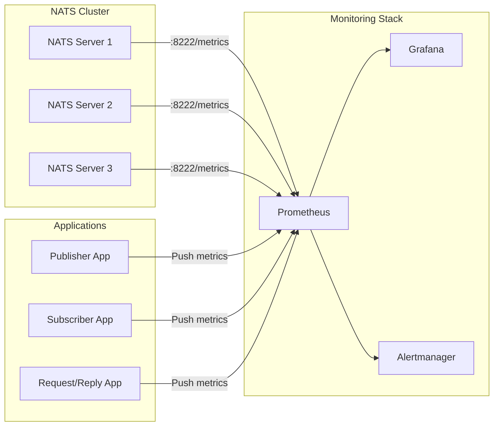
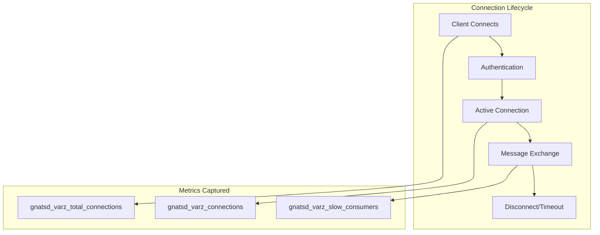
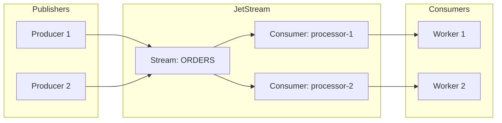
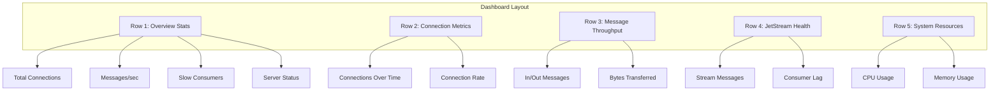

# How to Monitor NATS with Prometheus

Author: [nawazdhandala](https://www.github.com/nawazdhandala)

Tags: NATS, Prometheus, Monitoring, Messaging, Observability, Metrics, JetStream

Description: Learn how to monitor NATS messaging systems with Prometheus. Covers NATS server metrics, JetStream monitoring, client-side instrumentation, alerting rules, and Grafana dashboards for complete observability.

---

> NATS is a high-performance messaging system that powers real-time applications across industries. Monitoring NATS with Prometheus gives you visibility into message throughput, connection health, JetStream streams, and system performance, enabling you to catch issues before they impact your users.

Modern distributed systems rely on messaging infrastructure to communicate reliably. When NATS serves as your messaging backbone, understanding its health and performance becomes critical. Prometheus provides the perfect monitoring solution with its pull-based architecture and powerful query language.

---

## Architecture Overview

Before diving into configuration, understanding how NATS metrics flow to Prometheus helps you design an effective monitoring strategy.



NATS servers expose metrics on a dedicated HTTP monitoring port. Prometheus scrapes these endpoints at regular intervals, storing time-series data that you can query and visualize in Grafana.

---

## Enabling NATS Metrics

NATS servers include a built-in HTTP monitoring endpoint that exposes metrics in Prometheus format. Enable monitoring in your NATS server configuration.

The following configuration enables the HTTP monitoring port on 8222, which serves both the general monitoring API and Prometheus metrics endpoint.

```hcl
# nats-server.conf
# Server identification for metrics labeling
server_name: nats-1

# Enable HTTP monitoring on port 8222
# The /metrics endpoint provides Prometheus-formatted metrics
http_port: 8222

# Enable JetStream for persistent messaging
# JetStream metrics are automatically included when enabled
jetstream {
    store_dir: /data/jetstream
    max_memory_store: 1G
    max_file_store: 10G
}

# Cluster configuration for high availability
cluster {
    name: nats-cluster
    listen: 0.0.0.0:6222
    routes: [
        nats-route://nats-2:6222
        nats-route://nats-3:6222
    ]
}

# Enable detailed connection events for debugging
# Useful for tracking connection lifecycle
debug: false
trace: false
logtime: true
```

After starting NATS with monitoring enabled, verify the metrics endpoint is accessible.

```bash
# Test the Prometheus metrics endpoint
# You should see metrics in Prometheus text format
curl http://localhost:8222/metrics

# Sample output shows NATS-specific metrics
# HELP gnatsd_varz_connections Current number of connections
# TYPE gnatsd_varz_connections gauge
# gnatsd_varz_connections{server_id="NCXXX"} 42
```

---

## Configuring Prometheus

Add NATS servers as scrape targets in your Prometheus configuration. The following setup handles a three-node NATS cluster with appropriate labels.

The scrape configuration uses service discovery or static targets to find NATS servers. Adding meaningful labels helps you filter and aggregate metrics across your cluster.

```yaml
# prometheus.yml
global:
  scrape_interval: 15s
  evaluation_interval: 15s

# Scrape configuration for NATS servers
scrape_configs:
  # NATS server metrics from the built-in monitoring endpoint
  - job_name: 'nats'
    # Scrape every 10 seconds for near real-time visibility
    scrape_interval: 10s
    # Increase timeout for high-load servers
    scrape_timeout: 5s
    # The metrics path for Prometheus format
    metrics_path: /metrics

    # Static configuration for known NATS servers
    static_configs:
      - targets:
          - 'nats-1:8222'
          - 'nats-2:8222'
          - 'nats-3:8222'
        labels:
          cluster: 'production'
          environment: 'prod'

    # Relabel to extract server name from target
    relabel_configs:
      - source_labels: [__address__]
        regex: '([^:]+):\d+'
        target_label: 'nats_server'
        replacement: '${1}'

  # NATS application metrics (if using client instrumentation)
  - job_name: 'nats-applications'
    static_configs:
      - targets:
          - 'publisher-app:9090'
          - 'subscriber-app:9090'
        labels:
          service_type: 'messaging'
```

For Kubernetes deployments, use service discovery to automatically find NATS pods.

```yaml
# prometheus.yml - Kubernetes service discovery
scrape_configs:
  - job_name: 'nats-kubernetes'
    kubernetes_sd_configs:
      - role: pod

    # Only scrape pods with specific annotations
    relabel_configs:
      # Keep only NATS pods based on label
      - source_labels: [__meta_kubernetes_pod_label_app]
        regex: nats
        action: keep

      # Use the monitoring port annotation
      - source_labels: [__meta_kubernetes_pod_annotation_prometheus_io_port]
        action: replace
        target_label: __address__
        regex: (.+)
        replacement: ${1}:8222

      # Add namespace label
      - source_labels: [__meta_kubernetes_namespace]
        target_label: kubernetes_namespace

      # Add pod name label
      - source_labels: [__meta_kubernetes_pod_name]
        target_label: kubernetes_pod_name
```

---

## Key NATS Metrics to Monitor

Understanding which metrics matter most helps you build effective dashboards and alerts. NATS exposes several categories of metrics.

### Connection Metrics

Connection metrics reveal client connectivity patterns and potential connection storms.



The following PromQL queries help you monitor connection health.

```promql
# Current active connections per server
# Alert if connections drop suddenly or spike unexpectedly
gnatsd_varz_connections{cluster="production"}

# Connection rate over time
# Useful for detecting connection storms
rate(gnatsd_varz_total_connections[5m])

# Slow consumers indicate backpressure issues
# Any value above 0 warrants investigation
gnatsd_varz_slow_consumers{cluster="production"}

# Connection distribution across cluster
# Imbalanced connections may indicate DNS or load balancer issues
sum by (nats_server) (gnatsd_varz_connections)
```

### Message Throughput Metrics

Message metrics help you understand your messaging patterns and detect anomalies.

```promql
# Messages received per second per server
# Baseline helps you understand normal traffic patterns
rate(gnatsd_varz_in_msgs[1m])

# Messages sent per second per server
rate(gnatsd_varz_out_msgs[1m])

# Total cluster throughput
# Sum across all servers for cluster-wide view
sum(rate(gnatsd_varz_in_msgs[1m]))

# Bytes received per second
# Helps identify large message producers
rate(gnatsd_varz_in_bytes[1m])

# Bytes sent per second
rate(gnatsd_varz_out_bytes[1m])

# Message size average (bytes per message)
# Sudden changes may indicate new message types
rate(gnatsd_varz_in_bytes[5m]) / rate(gnatsd_varz_in_msgs[5m])
```

### JetStream Metrics

JetStream provides persistent messaging with streams and consumers. Monitoring JetStream ensures message durability and consumer health.



JetStream exposes detailed metrics for streams and consumers.

```promql
# Total messages stored in streams
# Monitor growth to prevent storage exhaustion
gnatsd_jetstream_total_messages

# Total bytes stored
gnatsd_jetstream_total_bytes

# Number of streams
gnatsd_jetstream_streams

# Number of consumers
gnatsd_jetstream_consumers

# Memory usage for JetStream
gnatsd_jetstream_memory_used

# File storage usage
gnatsd_jetstream_storage_used

# Consumer pending messages (lag)
# High values indicate consumers falling behind
gnatsd_jetstream_consumer_num_pending

# Consumer acknowledgment pending
# Messages delivered but not yet acknowledged
gnatsd_jetstream_consumer_num_ack_pending

# Redelivery count
# High redeliveries may indicate processing failures
gnatsd_jetstream_consumer_num_redelivered
```

---

## Client-Side Instrumentation

While server metrics provide infrastructure visibility, client-side instrumentation gives you application-level insights. Instrument your NATS clients to track publish latency, subscription patterns, and error rates.

### Go Client Instrumentation

The Go NATS client supports custom event handlers that you can use to export metrics.

```go
package main

import (
    "github.com/nats-io/nats.go"
    "github.com/prometheus/client_golang/prometheus"
    "github.com/prometheus/client_golang/prometheus/promauto"
    "github.com/prometheus/client_golang/prometheus/promhttp"
    "net/http"
    "time"
)

// Define Prometheus metrics for NATS client operations
// These metrics provide application-level visibility
var (
    // Counter for published messages with subject label
    messagesPublished = promauto.NewCounterVec(
        prometheus.CounterOpts{
            Name: "nats_client_messages_published_total",
            Help: "Total number of messages published to NATS",
        },
        []string{"subject"},
    )

    // Counter for received messages with subject label
    messagesReceived = promauto.NewCounterVec(
        prometheus.CounterOpts{
            Name: "nats_client_messages_received_total",
            Help: "Total number of messages received from NATS",
        },
        []string{"subject"},
    )

    // Histogram for publish latency
    // Buckets optimized for typical NATS latencies
    publishLatency = promauto.NewHistogramVec(
        prometheus.HistogramOpts{
            Name:    "nats_client_publish_latency_seconds",
            Help:    "Latency of NATS publish operations",
            Buckets: []float64{0.0001, 0.0005, 0.001, 0.005, 0.01, 0.05, 0.1},
        },
        []string{"subject"},
    )

    // Gauge for active subscriptions
    activeSubscriptions = promauto.NewGauge(
        prometheus.GaugeOpts{
            Name: "nats_client_active_subscriptions",
            Help: "Number of active NATS subscriptions",
        },
    )

    // Counter for connection events
    connectionEvents = promauto.NewCounterVec(
        prometheus.CounterOpts{
            Name: "nats_client_connection_events_total",
            Help: "NATS connection lifecycle events",
        },
        []string{"event_type"},
    )

    // Counter for errors by type
    clientErrors = promauto.NewCounterVec(
        prometheus.CounterOpts{
            Name: "nats_client_errors_total",
            Help: "NATS client errors",
        },
        []string{"error_type"},
    )
)

// InstrumentedNATSClient wraps the NATS connection with metrics
type InstrumentedNATSClient struct {
    nc *nats.Conn
}

// NewInstrumentedClient creates a NATS connection with Prometheus instrumentation
func NewInstrumentedClient(url string) (*InstrumentedNATSClient, error) {
    // Configure connection options with event handlers
    opts := []nats.Option{
        // Track successful connections
        nats.ConnectHandler(func(nc *nats.Conn) {
            connectionEvents.WithLabelValues("connected").Inc()
        }),
        // Track disconnections
        nats.DisconnectErrHandler(func(nc *nats.Conn, err error) {
            connectionEvents.WithLabelValues("disconnected").Inc()
            if err != nil {
                clientErrors.WithLabelValues("disconnect").Inc()
            }
        }),
        // Track reconnections
        nats.ReconnectHandler(func(nc *nats.Conn) {
            connectionEvents.WithLabelValues("reconnected").Inc()
        }),
        // Track connection closure
        nats.ClosedHandler(func(nc *nats.Conn) {
            connectionEvents.WithLabelValues("closed").Inc()
        }),
        // Track errors
        nats.ErrorHandler(func(nc *nats.Conn, sub *nats.Subscription, err error) {
            clientErrors.WithLabelValues("async_error").Inc()
        }),
    }

    nc, err := nats.Connect(url, opts...)
    if err != nil {
        return nil, err
    }

    return &InstrumentedNATSClient{nc: nc}, nil
}

// Publish sends a message with latency tracking
func (c *InstrumentedNATSClient) Publish(subject string, data []byte) error {
    start := time.Now()

    err := c.nc.Publish(subject, data)

    // Record latency regardless of success
    duration := time.Since(start).Seconds()
    publishLatency.WithLabelValues(subject).Observe(duration)

    if err != nil {
        clientErrors.WithLabelValues("publish").Inc()
        return err
    }

    messagesPublished.WithLabelValues(subject).Inc()
    return nil
}

// Subscribe creates a subscription with metric tracking
func (c *InstrumentedNATSClient) Subscribe(subject string, handler nats.MsgHandler) (*nats.Subscription, error) {
    // Wrap the handler to track received messages
    wrappedHandler := func(msg *nats.Msg) {
        messagesReceived.WithLabelValues(msg.Subject).Inc()
        handler(msg)
    }

    sub, err := c.nc.Subscribe(subject, wrappedHandler)
    if err != nil {
        clientErrors.WithLabelValues("subscribe").Inc()
        return nil, err
    }

    activeSubscriptions.Inc()
    return sub, nil
}

// QueueSubscribe creates a queue subscription with metric tracking
func (c *InstrumentedNATSClient) QueueSubscribe(subject, queue string, handler nats.MsgHandler) (*nats.Subscription, error) {
    wrappedHandler := func(msg *nats.Msg) {
        messagesReceived.WithLabelValues(msg.Subject).Inc()
        handler(msg)
    }

    sub, err := c.nc.QueueSubscribe(subject, queue, wrappedHandler)
    if err != nil {
        clientErrors.WithLabelValues("queue_subscribe").Inc()
        return nil, err
    }

    activeSubscriptions.Inc()
    return sub, nil
}

// Close cleanly shuts down the connection
func (c *InstrumentedNATSClient) Close() {
    c.nc.Close()
}

func main() {
    // Create instrumented NATS client
    client, err := NewInstrumentedClient("nats://localhost:4222")
    if err != nil {
        panic(err)
    }
    defer client.Close()

    // Expose Prometheus metrics endpoint
    http.Handle("/metrics", promhttp.Handler())
    go http.ListenAndServe(":9090", nil)

    // Example: Subscribe to orders
    client.Subscribe("orders.*", func(msg *nats.Msg) {
        // Process order
        processOrder(msg.Data)
    })

    // Example: Publish messages
    for {
        client.Publish("orders.new", []byte(`{"id": "123"}`))
        time.Sleep(time.Second)
    }
}

func processOrder(data []byte) {
    // Order processing logic
}
```

### Python Client Instrumentation

For Python applications using the nats-py client, wrap operations with prometheus_client metrics.

```python
import asyncio
import time
from nats.aio.client import Client as NATS
from prometheus_client import Counter, Histogram, Gauge, start_http_server

# Define Prometheus metrics for the Python NATS client
# Using descriptive names following Prometheus naming conventions
messages_published = Counter(
    'nats_client_messages_published_total',
    'Total messages published to NATS',
    ['subject']
)

messages_received = Counter(
    'nats_client_messages_received_total',
    'Total messages received from NATS',
    ['subject']
)

publish_latency = Histogram(
    'nats_client_publish_latency_seconds',
    'NATS publish operation latency',
    ['subject'],
    # Buckets tuned for typical NATS latencies (sub-millisecond to 100ms)
    buckets=[0.0001, 0.0005, 0.001, 0.005, 0.01, 0.05, 0.1]
)

active_subscriptions = Gauge(
    'nats_client_active_subscriptions',
    'Number of active NATS subscriptions'
)

connection_state = Gauge(
    'nats_client_connected',
    'NATS connection state (1=connected, 0=disconnected)'
)

client_errors = Counter(
    'nats_client_errors_total',
    'NATS client errors',
    ['error_type']
)


class InstrumentedNATSClient:
    """NATS client wrapper with Prometheus instrumentation."""

    def __init__(self):
        self.nc = NATS()
        self._subscriptions = []

    async def connect(self, servers: list):
        """Connect to NATS with connection event callbacks."""

        async def disconnected_cb():
            """Called when client disconnects from NATS."""
            connection_state.set(0)
            client_errors.labels(error_type='disconnected').inc()

        async def reconnected_cb():
            """Called when client successfully reconnects."""
            connection_state.set(1)

        async def error_cb(e):
            """Called when an async error occurs."""
            client_errors.labels(error_type=type(e).__name__).inc()

        async def closed_cb():
            """Called when the connection is closed."""
            connection_state.set(0)

        # Connect with all callbacks configured
        await self.nc.connect(
            servers=servers,
            disconnected_cb=disconnected_cb,
            reconnected_cb=reconnected_cb,
            error_cb=error_cb,
            closed_cb=closed_cb,
            max_reconnect_attempts=-1  # Unlimited reconnection attempts
        )

        connection_state.set(1)

    async def publish(self, subject: str, payload: bytes):
        """Publish a message with latency tracking."""
        start_time = time.perf_counter()

        try:
            await self.nc.publish(subject, payload)

            # Record successful publish metrics
            duration = time.perf_counter() - start_time
            publish_latency.labels(subject=subject).observe(duration)
            messages_published.labels(subject=subject).inc()

        except Exception as e:
            client_errors.labels(error_type='publish').inc()
            raise

    async def subscribe(self, subject: str, cb=None, queue: str = ""):
        """Subscribe to a subject with message counting."""

        async def wrapped_callback(msg):
            """Wrapper that counts messages before calling user callback."""
            messages_received.labels(subject=msg.subject).inc()
            if cb:
                await cb(msg)

        # Create subscription with wrapped callback
        sub = await self.nc.subscribe(
            subject,
            cb=wrapped_callback,
            queue=queue
        )

        self._subscriptions.append(sub)
        active_subscriptions.set(len(self._subscriptions))

        return sub

    async def request(self, subject: str, payload: bytes, timeout: float = 1.0):
        """Make a request-reply call with latency tracking."""
        start_time = time.perf_counter()

        try:
            response = await self.nc.request(subject, payload, timeout=timeout)

            # Track both publish and receive for request-reply
            duration = time.perf_counter() - start_time
            publish_latency.labels(subject=subject).observe(duration)
            messages_published.labels(subject=subject).inc()
            messages_received.labels(subject=subject).inc()

            return response

        except asyncio.TimeoutError:
            client_errors.labels(error_type='request_timeout').inc()
            raise
        except Exception as e:
            client_errors.labels(error_type='request').inc()
            raise

    async def close(self):
        """Close the NATS connection cleanly."""
        await self.nc.close()
        active_subscriptions.set(0)
        connection_state.set(0)


async def main():
    # Start Prometheus metrics server on port 9090
    start_http_server(9090)

    # Create and connect instrumented client
    client = InstrumentedNATSClient()
    await client.connect(servers=["nats://localhost:4222"])

    # Subscribe to messages
    async def message_handler(msg):
        print(f"Received: {msg.data.decode()}")

    await client.subscribe("orders.*", cb=message_handler)

    # Publish messages in a loop
    while True:
        await client.publish("orders.new", b'{"order_id": "12345"}')
        await asyncio.sleep(1)


if __name__ == "__main__":
    asyncio.run(main())
```

---

## Building Alerting Rules

Effective alerting catches problems before they impact users. Configure Prometheus alerting rules for common NATS failure scenarios.

```yaml
# nats-alerts.yml
groups:
  - name: nats-server-alerts
    rules:
      # Alert when a NATS server is down
      # Fires after 1 minute of scrape failures
      - alert: NATSServerDown
        expr: up{job="nats"} == 0
        for: 1m
        labels:
          severity: critical
        annotations:
          summary: "NATS server {{ $labels.instance }} is down"
          description: "NATS server has been unreachable for more than 1 minute."

      # Alert on high connection count
      # Adjust threshold based on your capacity planning
      - alert: NATSHighConnectionCount
        expr: gnatsd_varz_connections > 10000
        for: 5m
        labels:
          severity: warning
        annotations:
          summary: "High connection count on {{ $labels.instance }}"
          description: "NATS server has {{ $value }} connections, which exceeds threshold."

      # Alert on slow consumers
      # Any slow consumer indicates potential message loss
      - alert: NATSSlowConsumers
        expr: gnatsd_varz_slow_consumers > 0
        for: 2m
        labels:
          severity: warning
        annotations:
          summary: "Slow consumers detected on {{ $labels.instance }}"
          description: "{{ $value }} slow consumers detected. Messages may be dropped."

      # Alert on high CPU usage
      - alert: NATSHighCPU
        expr: gnatsd_varz_cpu > 80
        for: 5m
        labels:
          severity: warning
        annotations:
          summary: "High CPU usage on NATS server {{ $labels.instance }}"
          description: "CPU usage is {{ $value }}% for more than 5 minutes."

      # Alert on memory pressure
      - alert: NATSHighMemory
        expr: gnatsd_varz_mem / 1024 / 1024 / 1024 > 4
        for: 5m
        labels:
          severity: warning
        annotations:
          summary: "High memory usage on NATS server {{ $labels.instance }}"
          description: "Memory usage is {{ $value }}GB."

  - name: nats-jetstream-alerts
    rules:
      # Alert when JetStream storage is running low
      # Fires when less than 20% storage remains
      - alert: JetStreamStorageLow
        expr: |
          (gnatsd_jetstream_storage_used / gnatsd_jetstream_max_storage) > 0.8
        for: 10m
        labels:
          severity: warning
        annotations:
          summary: "JetStream storage low on {{ $labels.instance }}"
          description: "JetStream storage is {{ $value | humanizePercentage }} full."

      # Alert when JetStream memory is running low
      - alert: JetStreamMemoryLow
        expr: |
          (gnatsd_jetstream_memory_used / gnatsd_jetstream_max_memory) > 0.8
        for: 10m
        labels:
          severity: warning
        annotations:
          summary: "JetStream memory low on {{ $labels.instance }}"
          description: "JetStream memory is {{ $value | humanizePercentage }} full."

      # Alert on consumer lag
      # High pending count means consumers are falling behind
      - alert: JetStreamConsumerLag
        expr: gnatsd_jetstream_consumer_num_pending > 10000
        for: 5m
        labels:
          severity: warning
        annotations:
          summary: "JetStream consumer lag detected"
          description: "Consumer has {{ $value }} pending messages."

      # Alert on high redelivery rate
      # Frequent redeliveries indicate processing failures
      - alert: JetStreamHighRedeliveries
        expr: |
          rate(gnatsd_jetstream_consumer_num_redelivered[5m]) > 10
        for: 5m
        labels:
          severity: warning
        annotations:
          summary: "High JetStream redelivery rate"
          description: "Consumer is experiencing {{ $value }} redeliveries per second."

  - name: nats-cluster-alerts
    rules:
      # Alert when cluster routes are down
      - alert: NATSClusterRoutesDown
        expr: gnatsd_varz_routes < 2
        for: 2m
        labels:
          severity: critical
        annotations:
          summary: "NATS cluster routes degraded on {{ $labels.instance }}"
          description: "Only {{ $value }} cluster routes active. Expected 2."

      # Alert on message throughput drop
      # Compares current throughput to historical baseline
      - alert: NATSThroughputDrop
        expr: |
          (
            rate(gnatsd_varz_in_msgs[5m])
            /
            rate(gnatsd_varz_in_msgs[1h] offset 1d)
          ) < 0.5
        for: 10m
        labels:
          severity: warning
        annotations:
          summary: "NATS throughput significantly decreased"
          description: "Message throughput dropped to {{ $value | humanizePercentage }} of yesterday's rate."
```

---

## Grafana Dashboard

Create a comprehensive Grafana dashboard to visualize your NATS metrics. The following JSON can be imported into Grafana.



The following PromQL queries power key dashboard panels.

```promql
# Panel: Total Active Connections (Stat)
sum(gnatsd_varz_connections{cluster="production"})

# Panel: Messages Per Second (Stat)
sum(rate(gnatsd_varz_in_msgs{cluster="production"}[1m]))

# Panel: Connection History (Time Series)
gnatsd_varz_connections{cluster="production"}

# Panel: Message Throughput (Time Series)
# Shows both inbound and outbound message rates
rate(gnatsd_varz_in_msgs{cluster="production"}[1m])
rate(gnatsd_varz_out_msgs{cluster="production"}[1m])

# Panel: Bytes Transferred (Time Series)
rate(gnatsd_varz_in_bytes{cluster="production"}[1m])
rate(gnatsd_varz_out_bytes{cluster="production"}[1m])

# Panel: JetStream Storage Usage (Gauge)
(gnatsd_jetstream_storage_used / gnatsd_jetstream_max_storage) * 100

# Panel: Consumer Pending Messages (Time Series)
gnatsd_jetstream_consumer_num_pending

# Panel: Server CPU Usage (Time Series)
gnatsd_varz_cpu{cluster="production"}

# Panel: Server Memory Usage (Time Series)
gnatsd_varz_mem{cluster="production"} / 1024 / 1024

# Panel: Cluster Route Health (Stat)
min(gnatsd_varz_routes{cluster="production"})

# Panel: Subscription Count (Time Series)
gnatsd_varz_subscriptions{cluster="production"}
```

---

## Docker Compose Setup

Deploy a complete monitoring stack for NATS using Docker Compose.

```yaml
# docker-compose.yml
version: '3.8'

services:
  # NATS Server with JetStream enabled
  nats:
    image: nats:latest
    ports:
      - "4222:4222"   # Client connections
      - "8222:8222"   # HTTP monitoring
      - "6222:6222"   # Cluster routing
    volumes:
      - ./nats-server.conf:/nats-server.conf
      - nats-data:/data/jetstream
    command: ["-c", "/nats-server.conf"]
    healthcheck:
      test: ["CMD", "wget", "--spider", "http://localhost:8222/healthz"]
      interval: 10s
      timeout: 5s
      retries: 3

  # Prometheus for metrics collection
  prometheus:
    image: prom/prometheus:latest
    ports:
      - "9090:9090"
    volumes:
      - ./prometheus.yml:/etc/prometheus/prometheus.yml
      - ./nats-alerts.yml:/etc/prometheus/nats-alerts.yml
      - prometheus-data:/prometheus
    command:
      - '--config.file=/etc/prometheus/prometheus.yml'
      - '--storage.tsdb.path=/prometheus'
      - '--web.enable-lifecycle'
      - '--storage.tsdb.retention.time=15d'
    depends_on:
      - nats

  # Grafana for visualization
  grafana:
    image: grafana/grafana:latest
    ports:
      - "3000:3000"
    environment:
      - GF_SECURITY_ADMIN_PASSWORD=admin
      - GF_USERS_ALLOW_SIGN_UP=false
    volumes:
      - grafana-data:/var/lib/grafana
      - ./grafana/provisioning:/etc/grafana/provisioning
    depends_on:
      - prometheus

  # Alertmanager for alert routing
  alertmanager:
    image: prom/alertmanager:latest
    ports:
      - "9093:9093"
    volumes:
      - ./alertmanager.yml:/etc/alertmanager/alertmanager.yml
    command:
      - '--config.file=/etc/alertmanager/alertmanager.yml'
      - '--storage.path=/alertmanager'

volumes:
  nats-data:
  prometheus-data:
  grafana-data:
```

---

## Performance Tuning Tips

Optimize your NATS monitoring setup for production workloads.

### Reduce Metric Cardinality

High cardinality metrics can overwhelm Prometheus. Filter unnecessary labels and subjects.

```yaml
# prometheus.yml - Metric relabeling to reduce cardinality
scrape_configs:
  - job_name: 'nats'
    static_configs:
      - targets: ['nats:8222']

    # Drop high-cardinality internal metrics
    metric_relabel_configs:
      # Keep only metrics you need
      - source_labels: [__name__]
        regex: 'gnatsd_(varz_connections|varz_in_msgs|varz_out_msgs|varz_slow_consumers|jetstream_.*)'
        action: keep
```

### Adjust Scrape Intervals

Balance between granularity and resource usage.

```yaml
# prometheus.yml
scrape_configs:
  # More frequent scraping for critical metrics
  - job_name: 'nats-critical'
    scrape_interval: 5s
    static_configs:
      - targets: ['nats:8222']
    params:
      # Request only specific metrics if supported
      filter: ['connections', 'slow_consumers']

  # Less frequent scraping for capacity planning metrics
  - job_name: 'nats-capacity'
    scrape_interval: 60s
    static_configs:
      - targets: ['nats:8222']
```

### Recording Rules for Expensive Queries

Pre-compute expensive queries to speed up dashboard loading.

```yaml
# recording-rules.yml
groups:
  - name: nats-recording-rules
    rules:
      # Pre-compute cluster-wide message rate
      - record: nats:cluster_messages_per_second
        expr: sum(rate(gnatsd_varz_in_msgs[1m]))

      # Pre-compute average connection count
      - record: nats:cluster_avg_connections
        expr: avg(gnatsd_varz_connections)

      # Pre-compute JetStream storage percentage
      - record: nats:jetstream_storage_percent
        expr: |
          (gnatsd_jetstream_storage_used / gnatsd_jetstream_max_storage) * 100
```

---

## Troubleshooting Common Issues

### Metrics Not Appearing

When Prometheus shows no NATS metrics, verify the monitoring endpoint.

```bash
# Check if NATS monitoring port is accessible
curl -v http://nats:8222/metrics

# Verify Prometheus can reach the target
# Check Prometheus targets page: http://prometheus:9090/targets

# Test from Prometheus container
docker exec prometheus wget -qO- http://nats:8222/metrics
```

### High Memory Usage in Prometheus

NATS clusters with many clients can generate high-cardinality metrics.

```yaml
# prometheus.yml - Limit sample ingestion
global:
  scrape_interval: 15s

# Add limits to prevent memory exhaustion
storage:
  tsdb:
    out_of_order_time_window: 30m

# Use metric relabeling to drop unnecessary labels
metric_relabel_configs:
  - source_labels: [server_id]
    action: labeldrop
```

### JetStream Metrics Missing

JetStream metrics only appear when JetStream is enabled and has active streams.

```bash
# Verify JetStream is enabled
nats server info

# Check if streams exist
nats stream list

# Create a test stream to verify metrics
nats stream add TEST --subjects "test.*" --storage memory --replicas 1
```

---

## Conclusion

Monitoring NATS with Prometheus provides deep visibility into your messaging infrastructure. By combining server-side metrics with client instrumentation, you gain a complete picture of message flow, connection health, and system performance.

Key takeaways for effective NATS monitoring include configuring the HTTP monitoring port on all NATS servers, setting up Prometheus scraping with appropriate intervals, instrumenting client applications for end-to-end visibility, creating alerting rules for connection issues, slow consumers, and JetStream lag, and building dashboards that surface both real-time and historical trends.

With proper monitoring in place, you can confidently operate NATS at scale, catching issues before they impact your applications.

---

*Need unified observability for your NATS infrastructure? [OneUptime](https://oneuptime.com) integrates with Prometheus to provide dashboards, alerting, and incident management, giving you a single pane of glass for all your monitoring needs.*

**Related Reading:**
- [What is Prometheus and How Does it Work](https://oneuptime.com/blog/post/2025-01-16-what-is-prometheus/view)
- [How to Add Custom Metrics to Python Applications with Prometheus](https://oneuptime.com/blog/post/2025-01-06-python-custom-metrics-prometheus/view)
- [How to Monitor RabbitMQ with Prometheus](https://oneuptime.com/blog/post/2025-01-24-rabbitmq-prometheus/view)
