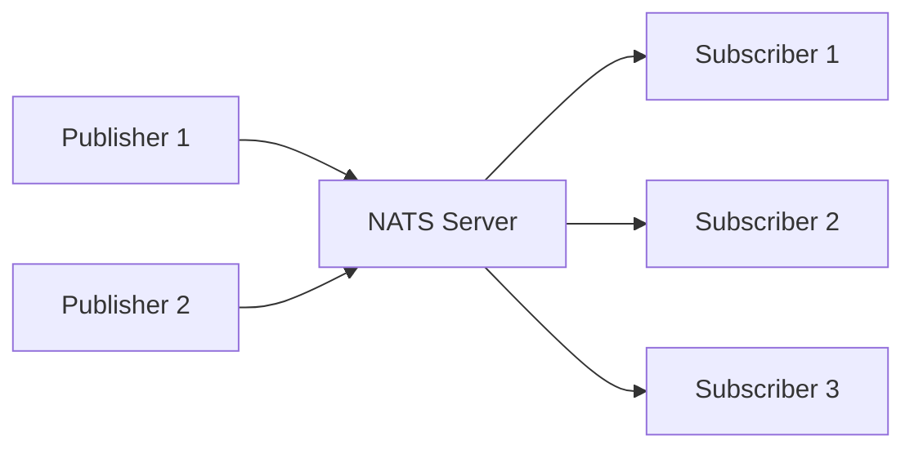
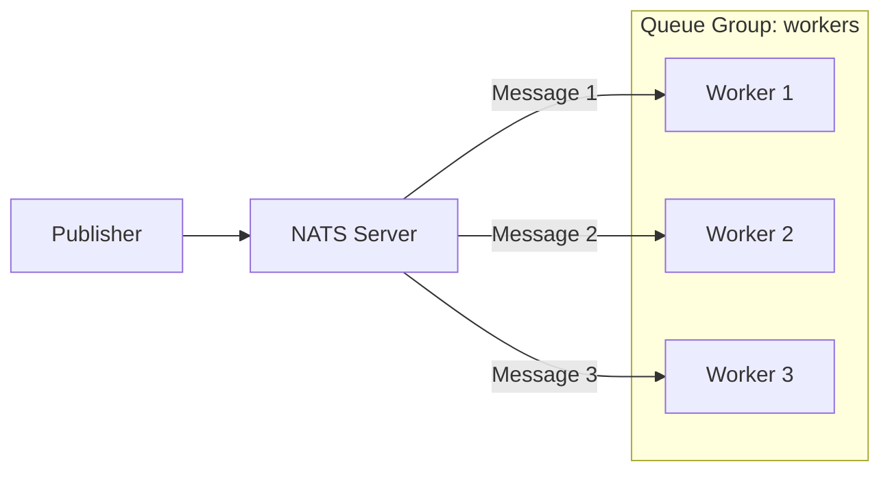

# How to Implement Pub/Sub with NATS

Author: [nawazdhandala](https://www.github.com/nawazdhandala)

Tags: NATS, Pub/Sub, Messaging, Microservices, Go

Description: Learn how to implement the publish-subscribe messaging pattern with NATS for building scalable, loosely coupled microservices.

---

> NATS is a lightweight, high-performance messaging system designed for cloud-native applications. Its simplicity and speed make it an excellent choice for pub/sub messaging in microservices architectures.

Unlike heavier message brokers, NATS focuses on simplicity. There are no complex configurations, no disk persistence by default, and no elaborate routing rules. You publish to a subject, subscribers receive messages on that subject. That's it.

---

## What is Pub/Sub?

Publish-Subscribe (pub/sub) is a messaging pattern where publishers send messages to a topic without knowing who will receive them. Subscribers express interest in topics and receive all messages published to those topics.



This decoupling allows services to communicate without direct dependencies on each other.

---

## Getting Started

### Installing NATS Server

You can run NATS locally using Docker or install it directly.

Using Docker:
```bash
docker run -d --name nats-server -p 4222:4222 -p 8222:8222 nats:latest
```

Using Homebrew on macOS:
```bash
brew install nats-server
nats-server
```

The default client port is 4222 and the monitoring port is 8222.

### Installing the Go Client

NATS has official clients for many languages. We'll use Go in this guide since it's the most common choice for NATS applications.

```bash
go get github.com/nats-io/nats.go
```

---

## Basic Pub/Sub Implementation

### Connecting to NATS

First, establish a connection to the NATS server. The connection handles automatic reconnection if the server becomes temporarily unavailable.

```go
package main

import (
    "log"
    "time"

    "github.com/nats-io/nats.go"
)

func main() {
    // Connect to NATS server with reconnection options
    // MaxReconnects: -1 means unlimited reconnection attempts
    // ReconnectWait: time between reconnection attempts
    nc, err := nats.Connect(
        nats.DefaultURL,
        nats.MaxReconnects(-1),
        nats.ReconnectWait(2*time.Second),
        nats.DisconnectErrHandler(func(nc *nats.Conn, err error) {
            log.Printf("Disconnected: %v", err)
        }),
        nats.ReconnectHandler(func(nc *nats.Conn) {
            log.Printf("Reconnected to %v", nc.ConnectedUrl())
        }),
    )
    if err != nil {
        log.Fatal(err)
    }
    defer nc.Close()

    log.Println("Connected to NATS")
}
```

### Publishing Messages

Publishing is straightforward. You specify a subject (topic) and the message payload. Messages are fire-and-forget by default.

```go
package main

import (
    "encoding/json"
    "log"
    "time"

    "github.com/nats-io/nats.go"
)

// OrderEvent represents an order event in our system
type OrderEvent struct {
    OrderID   string    `json:"order_id"`
    UserID    string    `json:"user_id"`
    Amount    float64   `json:"amount"`
    Status    string    `json:"status"`
    Timestamp time.Time `json:"timestamp"`
}

func main() {
    nc, err := nats.Connect(nats.DefaultURL)
    if err != nil {
        log.Fatal(err)
    }
    defer nc.Close()

    // Create an order event
    event := OrderEvent{
        OrderID:   "ORD-12345",
        UserID:    "USR-789",
        Amount:    99.99,
        Status:    "created",
        Timestamp: time.Now(),
    }

    // Serialize to JSON
    data, err := json.Marshal(event)
    if err != nil {
        log.Fatal(err)
    }

    // Publish to the "orders.created" subject
    // This is non-blocking and returns immediately
    err = nc.Publish("orders.created", data)
    if err != nil {
        log.Fatal(err)
    }

    // Flush ensures messages are sent before we close
    // Important when publishing just a few messages
    nc.Flush()
    log.Println("Published order event")
}
```

### Subscribing to Messages

Subscribers listen on subjects and receive all messages published to those subjects. The callback function runs in a separate goroutine.

```go
package main

import (
    "encoding/json"
    "log"
    "os"
    "os/signal"
    "syscall"

    "github.com/nats-io/nats.go"
)

type OrderEvent struct {
    OrderID   string  `json:"order_id"`
    UserID    string  `json:"user_id"`
    Amount    float64 `json:"amount"`
    Status    string  `json:"status"`
}

func main() {
    nc, err := nats.Connect(nats.DefaultURL)
    if err != nil {
        log.Fatal(err)
    }
    defer nc.Close()

    // Subscribe to orders.created subject
    // The callback runs in a separate goroutine for each message
    sub, err := nc.Subscribe("orders.created", func(msg *nats.Msg) {
        var event OrderEvent
        if err := json.Unmarshal(msg.Data, &event); err != nil {
            log.Printf("Error unmarshaling: %v", err)
            return
        }

        log.Printf("Received order: %s, Amount: $%.2f",
            event.OrderID, event.Amount)

        // Process the order here
        processOrder(event)
    })
    if err != nil {
        log.Fatal(err)
    }
    defer sub.Unsubscribe()

    log.Println("Listening for orders...")

    // Wait for interrupt signal to gracefully shutdown
    sigChan := make(chan os.Signal, 1)
    signal.Notify(sigChan, syscall.SIGINT, syscall.SIGTERM)
    <-sigChan

    log.Println("Shutting down...")
}

func processOrder(event OrderEvent) {
    // Order processing logic
    log.Printf("Processing order %s for user %s",
        event.OrderID, event.UserID)
}
```

---

## Subject Hierarchies and Wildcards

NATS subjects use a dot-separated hierarchy. This lets you organize messages logically and subscribe to patterns.

### Subject Naming Convention

```
orders.created
orders.updated
orders.cancelled
payments.processed
payments.failed
notifications.email
notifications.sms
```

### Wildcard Subscriptions

NATS supports two wildcards:
- `*` matches a single token
- `>` matches one or more tokens

```go
package main

import (
    "log"

    "github.com/nats-io/nats.go"
)

func main() {
    nc, _ := nats.Connect(nats.DefaultURL)
    defer nc.Close()

    // Subscribe to all order events using single-token wildcard
    // Matches: orders.created, orders.updated, orders.cancelled
    // Does not match: orders.us.created
    nc.Subscribe("orders.*", func(msg *nats.Msg) {
        log.Printf("Order event on %s: %s", msg.Subject, string(msg.Data))
    })

    // Subscribe to all events using multi-token wildcard
    // Matches: orders.created, orders.us.created, orders.us.east.created
    nc.Subscribe("orders.>", func(msg *nats.Msg) {
        log.Printf("Any order event on %s", msg.Subject)
    })

    // Subscribe to all regional notifications
    // Matches: notifications.us.email, notifications.eu.sms
    nc.Subscribe("notifications.*.>", func(msg *nats.Msg) {
        log.Printf("Regional notification on %s", msg.Subject)
    })

    select {} // Block forever
}
```

---

## Queue Groups for Load Balancing

By default, all subscribers receive all messages. Queue groups allow you to distribute messages among a group of subscribers, so only one subscriber in the group processes each message.



This is useful for scaling workers horizontally.

```go
package main

import (
    "log"
    "os"
    "time"

    "github.com/nats-io/nats.go"
)

func main() {
    nc, _ := nats.Connect(nats.DefaultURL)
    defer nc.Close()

    workerID := os.Getenv("WORKER_ID")
    if workerID == "" {
        workerID = "worker-1"
    }

    // QueueSubscribe joins a queue group named "order-processors"
    // Only one subscriber in the group receives each message
    // NATS distributes messages round-robin across the group
    nc.QueueSubscribe("orders.process", "order-processors", func(msg *nats.Msg) {
        log.Printf("[%s] Processing: %s", workerID, string(msg.Data))

        // Simulate processing time
        time.Sleep(100 * time.Millisecond)

        log.Printf("[%s] Completed: %s", workerID, string(msg.Data))
    })

    log.Printf("[%s] Worker ready, waiting for orders...", workerID)
    select {}
}
```

Run multiple workers to see load balancing in action:

```bash
WORKER_ID=worker-1 go run worker.go &
WORKER_ID=worker-2 go run worker.go &
WORKER_ID=worker-3 go run worker.go &
```

---

## Request-Reply Pattern

While pub/sub is one-way, NATS also supports request-reply for synchronous communication. The requester sends a message and waits for a response.

```go
package main

import (
    "encoding/json"
    "log"
    "time"

    "github.com/nats-io/nats.go"
)

type UserRequest struct {
    UserID string `json:"user_id"`
}

type UserResponse struct {
    UserID string `json:"user_id"`
    Name   string `json:"name"`
    Email  string `json:"email"`
}

// Service that responds to user lookup requests
func runUserService(nc *nats.Conn) {
    nc.Subscribe("users.get", func(msg *nats.Msg) {
        var req UserRequest
        json.Unmarshal(msg.Data, &req)

        log.Printf("Looking up user: %s", req.UserID)

        // Simulate database lookup
        response := UserResponse{
            UserID: req.UserID,
            Name:   "John Doe",
            Email:  "john@example.com",
        }

        data, _ := json.Marshal(response)

        // Reply to the specific reply subject
        msg.Respond(data)
    })
}

// Client that requests user information
func lookupUser(nc *nats.Conn, userID string) (*UserResponse, error) {
    req := UserRequest{UserID: userID}
    data, _ := json.Marshal(req)

    // Request with 2 second timeout
    // This creates a temporary inbox subject for the reply
    msg, err := nc.Request("users.get", data, 2*time.Second)
    if err != nil {
        return nil, err
    }

    var response UserResponse
    json.Unmarshal(msg.Data, &response)
    return &response, nil
}

func main() {
    nc, _ := nats.Connect(nats.DefaultURL)
    defer nc.Close()

    // Start the user service
    runUserService(nc)

    // Make a request
    user, err := lookupUser(nc, "USR-123")
    if err != nil {
        log.Fatal(err)
    }

    log.Printf("User found: %s <%s>", user.Name, user.Email)
}
```

---

## JetStream for Persistence

Core NATS is ephemeral, meaning messages are not stored. JetStream adds persistence, exactly-once delivery, and stream processing capabilities.

### Enabling JetStream

Start NATS with JetStream enabled:

```bash
nats-server -js
```

Or with Docker:

```bash
docker run -d --name nats-js -p 4222:4222 nats:latest -js
```

### Creating Streams and Publishing

Streams store messages. Consumers read from streams with various delivery options.

```go
package main

import (
    "log"
    "time"

    "github.com/nats-io/nats.go"
)

func main() {
    nc, _ := nats.Connect(nats.DefaultURL)
    defer nc.Close()

    // Get JetStream context
    js, err := nc.JetStream()
    if err != nil {
        log.Fatal(err)
    }

    // Create a stream to store order events
    // Subjects: which subjects this stream captures
    // Retention: how long to keep messages
    // MaxAge: maximum age of messages
    _, err = js.AddStream(&nats.StreamConfig{
        Name:      "ORDERS",
        Subjects:  []string{"orders.>"},
        Retention: nats.LimitsPolicy,
        MaxAge:    24 * time.Hour,
        Storage:   nats.FileStorage,
        Replicas:  1,
    })
    if err != nil && err != nats.ErrStreamNameAlreadyInUse {
        log.Fatal(err)
    }

    // Publish to JetStream with acknowledgment
    // Unlike core NATS, this confirms the message was stored
    ack, err := js.Publish("orders.created", []byte(`{"order_id": "123"}`))
    if err != nil {
        log.Fatal(err)
    }

    log.Printf("Published to stream %s, sequence %d", ack.Stream, ack.Sequence)
}
```

### Consuming from Streams

JetStream consumers can be durable (survive restarts) or ephemeral. They track which messages have been processed.

```go
package main

import (
    "log"
    "time"

    "github.com/nats-io/nats.go"
)

func main() {
    nc, _ := nats.Connect(nats.DefaultURL)
    defer nc.Close()

    js, _ := nc.JetStream()

    // Create a durable consumer
    // Durable consumers remember their position across restarts
    // AckPolicy: how acknowledgments work
    // DeliverPolicy: where to start reading
    _, err := js.AddConsumer("ORDERS", &nats.ConsumerConfig{
        Durable:       "order-processor",
        AckPolicy:     nats.AckExplicitPolicy,
        DeliverPolicy: nats.DeliverAllPolicy,
    })
    if err != nil && err != nats.ErrConsumerNameAlreadyInUse {
        log.Fatal(err)
    }

    // Subscribe using the consumer
    sub, err := js.PullSubscribe(
        "orders.>",
        "order-processor",
    )
    if err != nil {
        log.Fatal(err)
    }

    log.Println("Waiting for messages...")

    for {
        // Fetch up to 10 messages, wait up to 5 seconds
        msgs, err := sub.Fetch(10, nats.MaxWait(5*time.Second))
        if err != nil {
            if err == nats.ErrTimeout {
                continue // No messages available
            }
            log.Printf("Fetch error: %v", err)
            continue
        }

        for _, msg := range msgs {
            log.Printf("Received: %s", string(msg.Data))

            // Process the message
            if err := processMessage(msg.Data); err != nil {
                // Negative ack to requeue
                msg.Nak()
            } else {
                // Acknowledge successful processing
                msg.Ack()
            }
        }
    }
}

func processMessage(data []byte) error {
    log.Printf("Processing: %s", string(data))
    return nil
}
```

---

## Error Handling and Resilience

Production systems need proper error handling. Here's a robust subscriber pattern:

```go
package main

import (
    "context"
    "encoding/json"
    "log"
    "os"
    "os/signal"
    "syscall"
    "time"

    "github.com/nats-io/nats.go"
)

type Event struct {
    ID   string          `json:"id"`
    Type string          `json:"type"`
    Data json.RawMessage `json:"data"`
}

type Subscriber struct {
    nc     *nats.Conn
    subs   []*nats.Subscription
}

func NewSubscriber(url string) (*Subscriber, error) {
    // Connect with comprehensive options
    nc, err := nats.Connect(
        url,
        nats.Name("order-service"),
        nats.MaxReconnects(-1),
        nats.ReconnectWait(2*time.Second),
        nats.ReconnectBufSize(5*1024*1024), // 5MB buffer during reconnect
        nats.ErrorHandler(func(nc *nats.Conn, sub *nats.Subscription, err error) {
            log.Printf("NATS error: %v", err)
        }),
        nats.DisconnectErrHandler(func(nc *nats.Conn, err error) {
            log.Printf("Disconnected: %v", err)
        }),
        nats.ReconnectHandler(func(nc *nats.Conn) {
            log.Printf("Reconnected to %v", nc.ConnectedUrl())
        }),
        nats.ClosedHandler(func(nc *nats.Conn) {
            log.Println("Connection closed")
        }),
    )
    if err != nil {
        return nil, err
    }

    return &Subscriber{nc: nc}, nil
}

func (s *Subscriber) Subscribe(subject string, handler func(*Event) error) error {
    sub, err := s.nc.Subscribe(subject, func(msg *nats.Msg) {
        var event Event
        if err := json.Unmarshal(msg.Data, &event); err != nil {
            log.Printf("Unmarshal error on %s: %v", subject, err)
            return
        }

        if err := handler(&event); err != nil {
            log.Printf("Handler error for event %s: %v", event.ID, err)
            // In production, you might want to publish to a dead letter queue
        }
    })
    if err != nil {
        return err
    }

    s.subs = append(s.subs, sub)
    return nil
}

func (s *Subscriber) Shutdown(ctx context.Context) error {
    for _, sub := range s.subs {
        sub.Drain()
    }

    // Drain waits for pending messages to be processed
    return s.nc.Drain()
}

func main() {
    sub, err := NewSubscriber(nats.DefaultURL)
    if err != nil {
        log.Fatal(err)
    }

    // Register handlers
    sub.Subscribe("orders.>", func(e *Event) error {
        log.Printf("Order event: %s - %s", e.Type, e.ID)
        return nil
    })

    sub.Subscribe("payments.>", func(e *Event) error {
        log.Printf("Payment event: %s - %s", e.Type, e.ID)
        return nil
    })

    log.Println("Subscriber ready")

    // Graceful shutdown
    sigChan := make(chan os.Signal, 1)
    signal.Notify(sigChan, syscall.SIGINT, syscall.SIGTERM)
    <-sigChan

    log.Println("Shutting down...")
    ctx, cancel := context.WithTimeout(context.Background(), 10*time.Second)
    defer cancel()

    if err := sub.Shutdown(ctx); err != nil {
        log.Printf("Shutdown error: %v", err)
    }
}
```

---

## Comparison: Core NATS vs JetStream

| Feature | Core NATS | JetStream |
|---------|-----------|-----------|
| Persistence | No | Yes |
| At-most-once delivery | Yes | Yes |
| At-least-once delivery | No | Yes |
| Exactly-once delivery | No | Yes |
| Message replay | No | Yes |
| Consumer tracking | No | Yes |
| Stream processing | No | Yes |
| Complexity | Low | Medium |
| Throughput | Higher | Slightly lower |

Use Core NATS when you need maximum performance and can tolerate message loss. Use JetStream when you need persistence and delivery guarantees.

---

## Best Practices

1. **Use meaningful subject hierarchies** - Organize by domain, entity, and action (e.g., `orders.us.created`)

2. **Keep messages small** - NATS works best with small messages. For large payloads, store data elsewhere and send references.

3. **Use queue groups for scaling** - Distribute work across multiple instances without duplicating processing.

4. **Handle reconnections gracefully** - Configure reconnection settings and handle disconnect events.

5. **Set appropriate timeouts** - Don't wait forever for responses in request-reply patterns.

6. **Monitor your cluster** - Use the monitoring endpoint on port 8222 to track connections and messages.

7. **Use JetStream for critical data** - When message loss is unacceptable, enable persistence with JetStream.

---

## Conclusion

NATS provides a simple, fast messaging system that scales well for microservices communication. The core pub/sub functionality handles most use cases, while JetStream adds persistence when needed.

Key takeaways:
- Core NATS is fire-and-forget with minimal overhead
- Subject hierarchies and wildcards enable flexible message routing
- Queue groups distribute load across multiple consumers
- JetStream adds persistence and delivery guarantees
- The Go client makes it easy to build robust messaging systems

---

*Need to monitor your NATS messaging infrastructure? [OneUptime](https://oneuptime.com) provides comprehensive monitoring for message queues with queue depth tracking, consumer lag alerts, and performance metrics to keep your pub/sub systems running smoothly.*
