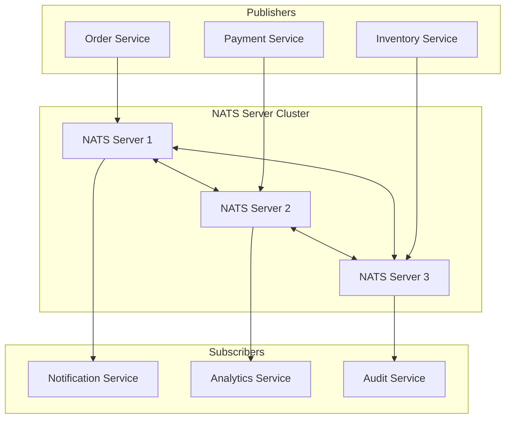
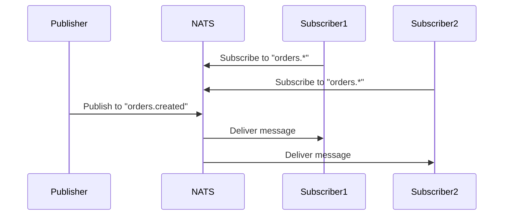
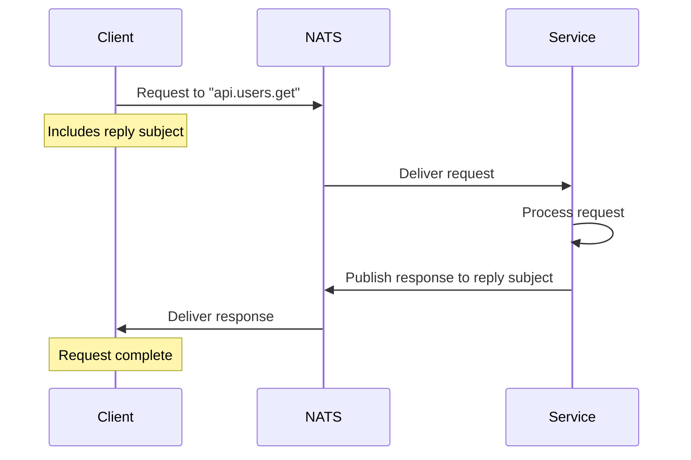
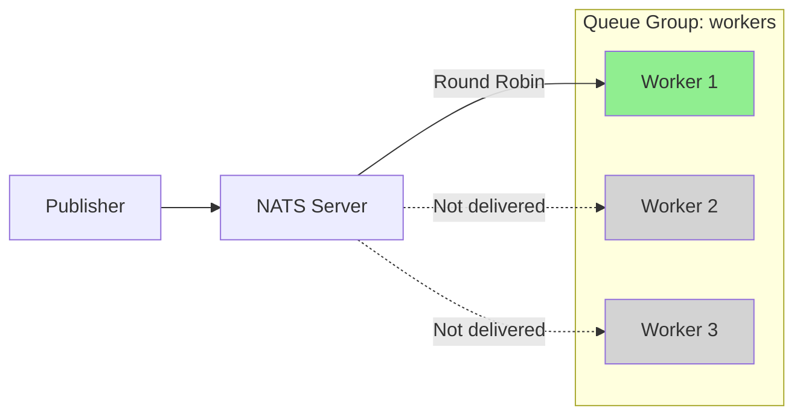
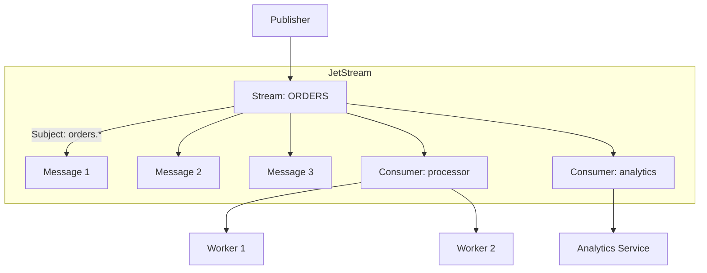
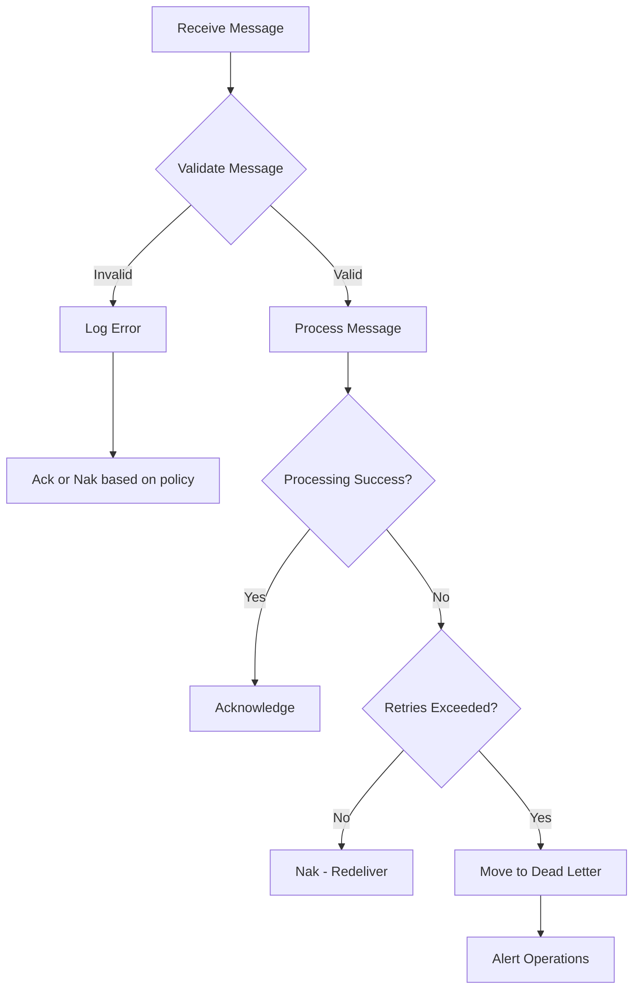

# How to Use NATS with Python

Author: [nawazdhandala](https://www.github.com/nawazdhandala)

Tags: NATS, Python, Messaging, Microservices, Async, Pub/Sub, Queue

Description: Learn how to use NATS messaging system with Python for building scalable, distributed applications. Covers publish-subscribe patterns, request-reply, JetStream persistence, and production best practices.

---

> NATS is a lightweight, high-performance messaging system designed for cloud-native applications. With support for publish-subscribe, request-reply, and persistent streaming through JetStream, NATS provides the communication backbone for modern microservices architectures. Python developers can leverage the nats-py library to integrate NATS seamlessly into their applications.

Building distributed systems requires reliable, fast communication between services. NATS delivers sub-millisecond latency with minimal operational complexity, making it an excellent choice for Python applications.

---

## Architecture Overview

The following diagram illustrates how NATS connects multiple services in a microservices architecture, supporting different messaging patterns.



---

## Installation and Setup

Before writing any code, install the NATS Python client and ensure you have a NATS server running. The nats-py library provides full async support with all NATS features.

```bash
# Install the NATS Python client library
pip install nats-py

# For local development, run NATS server with Docker
docker run -d --name nats-server -p 4222:4222 -p 8222:8222 nats:latest

# Or install NATS server directly (macOS)
brew install nats-server
nats-server
```

---

## Basic Connection

Establishing a connection to NATS is the foundation of all operations. The following example demonstrates connecting to a NATS server with proper error handling and cleanup.

```python
# basic_connection.py
# Demonstrates connecting to a NATS server with proper lifecycle management
import asyncio
import nats

async def main():
    # Connect to NATS server running on localhost
    # The connect function returns a client instance for all NATS operations
    nc = await nats.connect("nats://localhost:4222")

    print(f"Connected to NATS at {nc.connected_url.netloc}")
    print(f"Client ID: {nc.client_id}")

    # Always close the connection when done to release resources
    await nc.close()
    print("Connection closed")

if __name__ == "__main__":
    asyncio.run(main())
```

### Connection with Options

Production applications require more robust connection handling. The following configuration includes reconnection logic, timeouts, and multiple server endpoints for high availability.

```python
# connection_options.py
# Production-ready connection configuration with reconnection and error handling
import asyncio
import nats
from nats.errors import ConnectionClosedError, TimeoutError, NoServersError

async def error_callback(error):
    """Called when an error occurs on the connection"""
    print(f"Connection error: {error}")

async def disconnected_callback():
    """Called when client disconnects from server"""
    print("Disconnected from NATS")

async def reconnected_callback():
    """Called when client reconnects after a disconnect"""
    print("Reconnected to NATS")

async def closed_callback():
    """Called when connection is permanently closed"""
    print("Connection to NATS closed")

async def main():
    # Connect with comprehensive options for production reliability
    nc = await nats.connect(
        servers=[
            "nats://localhost:4222",  # Primary server
            "nats://localhost:4223",  # Backup server 1
            "nats://localhost:4224",  # Backup server 2
        ],
        # Reconnection settings - automatically reconnect on failure
        allow_reconnect=True,
        max_reconnect_attempts=10,  # -1 for unlimited attempts
        reconnect_time_wait=2,  # Seconds between reconnection attempts

        # Connection timeouts
        connect_timeout=5,  # Seconds to wait for initial connection

        # Ping/pong for connection health monitoring
        ping_interval=20,  # Send ping every 20 seconds
        max_outstanding_pings=3,  # Disconnect if 3 pings go unanswered

        # Callbacks for connection lifecycle events
        error_cb=error_callback,
        disconnected_cb=disconnected_callback,
        reconnected_cb=reconnected_callback,
        closed_cb=closed_callback,

        # Optional authentication
        # user="myuser",
        # password="mypassword",
        # token="mytoken",
    )

    print(f"Connected to {nc.connected_url.netloc}")

    # Keep connection alive for demonstration
    await asyncio.sleep(5)
    await nc.drain()  # Graceful shutdown - wait for pending messages

if __name__ == "__main__":
    asyncio.run(main())
```

---

## Publish-Subscribe Pattern

The publish-subscribe pattern allows publishers to send messages to subjects without knowing who will receive them. Subscribers express interest in subjects and receive matching messages.



### Simple Publisher

Publishing messages to NATS is straightforward. Messages are published to subjects, and any subscribers listening to that subject receive the message.

```python
# simple_publisher.py
# Publish messages to NATS subjects
import asyncio
import nats
import json
from datetime import datetime

async def main():
    nc = await nats.connect("nats://localhost:4222")

    # Publish a simple string message
    # Subject names use dot notation for hierarchy: category.subcategory.event
    await nc.publish("events.user.login", b"User logged in")
    print("Published string message")

    # Publish a JSON message with structured data
    order_data = {
        "order_id": "ORD-12345",
        "customer": "john@example.com",
        "total": 99.99,
        "timestamp": datetime.utcnow().isoformat()
    }
    # Encode JSON to bytes - NATS messages are always bytes
    payload = json.dumps(order_data).encode()
    await nc.publish("orders.created", payload)
    print(f"Published order: {order_data['order_id']}")

    # Flush ensures all pending messages are sent before closing
    await nc.flush()
    await nc.close()

if __name__ == "__main__":
    asyncio.run(main())
```

### Simple Subscriber

Subscribers receive messages asynchronously through callback functions. The subscription remains active until explicitly unsubscribed or the connection closes.

```python
# simple_subscriber.py
# Subscribe to NATS subjects and process incoming messages
import asyncio
import nats
import json

async def main():
    nc = await nats.connect("nats://localhost:4222")

    # Message handler callback - called for each received message
    async def message_handler(msg):
        # msg.subject: the subject the message was published to
        # msg.data: the message payload as bytes
        # msg.reply: reply subject if this is a request (None otherwise)
        subject = msg.subject
        data = msg.data.decode()  # Decode bytes to string

        print(f"Received on '{subject}': {data}")

        # Parse JSON if the message contains structured data
        try:
            parsed = json.loads(data)
            print(f"  Order ID: {parsed.get('order_id')}")
        except json.JSONDecodeError:
            pass  # Not JSON, use raw string

    # Subscribe to a specific subject
    await nc.subscribe("orders.created", cb=message_handler)
    print("Subscribed to 'orders.created'")

    # Keep the subscriber running to receive messages
    print("Waiting for messages... (Press Ctrl+C to exit)")
    try:
        while True:
            await asyncio.sleep(1)
    except KeyboardInterrupt:
        pass

    await nc.drain()

if __name__ == "__main__":
    asyncio.run(main())
```

### Wildcard Subscriptions

NATS supports two wildcard tokens for flexible subject matching. The asterisk (*) matches a single token, while the greater-than sign (>) matches one or more tokens.

```python
# wildcard_subscriber.py
# Use wildcards to subscribe to multiple subjects with a single subscription
import asyncio
import nats

async def main():
    nc = await nats.connect("nats://localhost:4222")

    # Single-token wildcard (*) matches exactly one token
    # "orders.*" matches "orders.created", "orders.updated", "orders.deleted"
    # but NOT "orders.item.added" (two tokens after orders)
    async def single_wildcard_handler(msg):
        print(f"[Single wildcard] {msg.subject}: {msg.data.decode()}")

    await nc.subscribe("orders.*", cb=single_wildcard_handler)

    # Multi-token wildcard (>) matches one or more tokens
    # "events.>" matches "events.user", "events.user.login", "events.order.item.added"
    async def multi_wildcard_handler(msg):
        print(f"[Multi wildcard] {msg.subject}: {msg.data.decode()}")

    await nc.subscribe("events.>", cb=multi_wildcard_handler)

    # Full wildcard - receive ALL messages (use with caution)
    async def all_messages_handler(msg):
        print(f"[All messages] {msg.subject}: {msg.data.decode()}")

    # Uncomment to receive everything:
    # await nc.subscribe(">", cb=all_messages_handler)

    print("Subscribed with wildcards. Waiting for messages...")

    # Test by publishing to various subjects
    await nc.publish("orders.created", b"New order")
    await nc.publish("orders.updated", b"Order updated")
    await nc.publish("events.user.login", b"User login event")
    await nc.publish("events.order.shipped", b"Order shipped event")

    await asyncio.sleep(1)  # Allow time for message delivery
    await nc.drain()

if __name__ == "__main__":
    asyncio.run(main())
```

---

## Request-Reply Pattern

Request-reply implements synchronous communication over asynchronous messaging. A requester sends a message and waits for a response, enabling RPC-style interactions between services.



### Request Client

The request method publishes a message and waits for a single response. Use timeouts to prevent indefinite blocking if no responder is available.

```python
# request_client.py
# Send requests and receive responses using NATS request-reply pattern
import asyncio
import nats
import json
from nats.errors import TimeoutError

async def main():
    nc = await nats.connect("nats://localhost:4222")

    # Simple request with timeout
    # The request method automatically creates a unique reply subject
    try:
        # Request user data by ID
        request_data = json.dumps({"user_id": 123}).encode()

        # Send request and wait up to 5 seconds for response
        response = await nc.request(
            "api.users.get",  # Subject to send request to
            request_data,     # Request payload
            timeout=5.0       # Maximum seconds to wait for response
        )

        # Parse the response
        user_data = json.loads(response.data.decode())
        print(f"Received user: {user_data}")

    except TimeoutError:
        print("Request timed out - no responder available")

    # Multiple requests in parallel for better performance
    async def get_user(user_id: int):
        try:
            request = json.dumps({"user_id": user_id}).encode()
            response = await nc.request("api.users.get", request, timeout=5.0)
            return json.loads(response.data.decode())
        except TimeoutError:
            return None

    # Fetch multiple users concurrently
    user_ids = [1, 2, 3, 4, 5]
    tasks = [get_user(uid) for uid in user_ids]
    users = await asyncio.gather(*tasks)

    for user in users:
        if user:
            print(f"User: {user}")

    await nc.close()

if __name__ == "__main__":
    asyncio.run(main())
```

### Reply Service

A reply service subscribes to a subject and responds to incoming requests. Multiple instances can subscribe to the same subject for load balancing.

```python
# reply_service.py
# Service that responds to requests - can run multiple instances for scaling
import asyncio
import nats
import json
import os

# Simulated user database
USERS = {
    1: {"id": 1, "name": "Alice", "email": "alice@example.com"},
    2: {"id": 2, "name": "Bob", "email": "bob@example.com"},
    3: {"id": 3, "name": "Charlie", "email": "charlie@example.com"},
}

async def main():
    nc = await nats.connect("nats://localhost:4222")

    # Unique identifier for this service instance
    instance_id = os.getpid()

    async def handle_user_request(msg):
        """Process user lookup requests and send responses"""
        print(f"[Instance {instance_id}] Received request on {msg.subject}")

        # Parse the request payload
        request = json.loads(msg.data.decode())
        user_id = request.get("user_id")

        # Look up user in our "database"
        user = USERS.get(user_id)

        if user:
            response = {"status": "success", "user": user}
        else:
            response = {"status": "error", "message": "User not found"}

        # Send response back to the requester
        # msg.respond() uses the reply subject from the original request
        await msg.respond(json.dumps(response).encode())
        print(f"[Instance {instance_id}] Sent response for user {user_id}")

    # Subscribe to the service subject
    # Multiple instances subscribing creates automatic load balancing
    await nc.subscribe("api.users.get", cb=handle_user_request)

    print(f"[Instance {instance_id}] User service ready, listening on 'api.users.get'")

    # Keep service running
    try:
        while True:
            await asyncio.sleep(1)
    except KeyboardInterrupt:
        pass

    await nc.drain()

if __name__ == "__main__":
    asyncio.run(main())
```

---

## Queue Groups for Load Balancing

Queue groups distribute messages among subscribers, ensuring each message is processed by only one subscriber in the group. Multiple groups can receive the same message independently.



### Queue Subscriber

Queue groups enable horizontal scaling of message processors. Each message goes to exactly one member of the queue group, preventing duplicate processing.

```python
# queue_worker.py
# Worker that processes messages as part of a queue group
import asyncio
import nats
import json
import os
import random

async def main():
    nc = await nats.connect("nats://localhost:4222")

    # Unique worker identifier
    worker_id = f"worker-{os.getpid()}-{random.randint(1000, 9999)}"

    async def process_job(msg):
        """Process a job from the queue"""
        job = json.loads(msg.data.decode())
        print(f"[{worker_id}] Processing job: {job['job_id']}")

        # Simulate work with random duration
        processing_time = random.uniform(0.5, 2.0)
        await asyncio.sleep(processing_time)

        print(f"[{worker_id}] Completed job: {job['job_id']} in {processing_time:.2f}s")

    # Subscribe with a queue group name
    # All subscribers with the same queue group share the message load
    # "workers" is the queue group name
    sub = await nc.subscribe(
        "jobs.process",    # Subject to subscribe to
        queue="workers",   # Queue group name - messages distributed among group
        cb=process_job
    )

    print(f"[{worker_id}] Joined queue group 'workers', listening on 'jobs.process'")

    # Keep worker running
    try:
        while True:
            await asyncio.sleep(1)
    except KeyboardInterrupt:
        pass

    await sub.unsubscribe()
    await nc.drain()

if __name__ == "__main__":
    asyncio.run(main())
```

### Job Publisher

The publisher sends jobs without knowing how many workers exist or which worker will process each job.

```python
# job_publisher.py
# Publish jobs to be processed by queue group workers
import asyncio
import nats
import json
import uuid

async def main():
    nc = await nats.connect("nats://localhost:4222")

    # Publish multiple jobs
    for i in range(10):
        job = {
            "job_id": str(uuid.uuid4())[:8],
            "task": f"Process item {i}",
            "priority": "normal"
        }

        payload = json.dumps(job).encode()
        await nc.publish("jobs.process", payload)
        print(f"Published job: {job['job_id']}")

        # Small delay between jobs
        await asyncio.sleep(0.1)

    await nc.flush()
    await nc.close()
    print("All jobs published")

if __name__ == "__main__":
    asyncio.run(main())
```

---

## JetStream for Persistence

JetStream adds persistence, exactly-once delivery, and stream processing to NATS. Messages are stored in streams and can be replayed, acknowledged, and processed reliably.



### Creating Streams and Consumers

Streams store messages matching specific subjects. Consumers define how messages are delivered to subscribers.

```python
# jetstream_setup.py
# Create and configure JetStream streams and consumers
import asyncio
import nats
from nats.js.api import StreamConfig, ConsumerConfig, AckPolicy, DeliverPolicy, RetentionPolicy

async def main():
    nc = await nats.connect("nats://localhost:4222")

    # Get JetStream context for stream operations
    js = nc.jetstream()

    # Create a stream to store order events
    # Streams persist messages matching the specified subjects
    stream_config = StreamConfig(
        name="ORDERS",                    # Unique stream name
        subjects=["orders.*"],            # Subjects to capture (orders.created, orders.updated, etc.)
        retention=RetentionPolicy.LIMITS, # Keep messages based on limits
        max_msgs=100000,                  # Maximum messages to retain
        max_bytes=1024 * 1024 * 100,      # Maximum storage: 100MB
        max_age=86400 * 7,                # Keep messages for 7 days (seconds)
        duplicate_window=120,             # Deduplicate within 2 minutes
    )

    try:
        # Add the stream - creates if not exists
        await js.add_stream(stream_config)
        print("Stream 'ORDERS' created successfully")
    except Exception as e:
        # Stream might already exist
        print(f"Stream setup: {e}")

    # Create a durable consumer for reliable message processing
    consumer_config = ConsumerConfig(
        durable_name="order-processor",       # Unique consumer name (survives restarts)
        ack_policy=AckPolicy.EXPLICIT,        # Require explicit acknowledgment
        deliver_policy=DeliverPolicy.ALL,     # Start from first message
        max_deliver=3,                        # Retry up to 3 times on failure
        ack_wait=30,                          # Wait 30 seconds for ack before redelivery
    )

    try:
        await js.add_consumer("ORDERS", consumer_config)
        print("Consumer 'order-processor' created successfully")
    except Exception as e:
        print(f"Consumer setup: {e}")

    # Query stream info
    stream_info = await js.stream_info("ORDERS")
    print(f"Stream state: {stream_info.state.messages} messages, {stream_info.state.bytes} bytes")

    await nc.close()

if __name__ == "__main__":
    asyncio.run(main())
```

### Publishing to JetStream

Publishing to JetStream provides acknowledgment that messages are stored, ensuring durability.

```python
# jetstream_publisher.py
# Publish messages to JetStream with delivery guarantees
import asyncio
import nats
import json
from datetime import datetime

async def main():
    nc = await nats.connect("nats://localhost:4222")
    js = nc.jetstream()

    # Publish a message to JetStream
    # The publish returns an acknowledgment confirming storage
    order = {
        "order_id": "ORD-001",
        "customer_id": "CUST-123",
        "items": [
            {"product": "Widget", "quantity": 2, "price": 29.99},
            {"product": "Gadget", "quantity": 1, "price": 49.99}
        ],
        "total": 109.97,
        "created_at": datetime.utcnow().isoformat()
    }

    payload = json.dumps(order).encode()

    # Publish with acknowledgment - guarantees message is stored
    ack = await js.publish(
        "orders.created",          # Subject (must match stream subjects)
        payload,
        headers={                   # Optional headers for metadata
            "Nats-Msg-Id": order["order_id"]  # For deduplication
        }
    )

    print(f"Published to stream: {ack.stream}")
    print(f"Sequence number: {ack.seq}")
    print(f"Duplicate: {ack.duplicate}")  # True if message was deduplicated

    # Publish multiple orders
    for i in range(5):
        order = {
            "order_id": f"ORD-{100 + i}",
            "customer_id": f"CUST-{i}",
            "total": 50.0 + i * 10,
            "created_at": datetime.utcnow().isoformat()
        }

        ack = await js.publish(
            "orders.created",
            json.dumps(order).encode(),
            headers={"Nats-Msg-Id": order["order_id"]}
        )
        print(f"Order {order['order_id']} stored at sequence {ack.seq}")

    await nc.close()

if __name__ == "__main__":
    asyncio.run(main())
```

### Consuming from JetStream

JetStream consumers support different delivery modes. Push consumers deliver messages automatically, while pull consumers request messages on demand.

```python
# jetstream_consumer.py
# Consume messages from JetStream with acknowledgment handling
import asyncio
import nats
import json

async def main():
    nc = await nats.connect("nats://localhost:4222")
    js = nc.jetstream()

    # Pull-based consumer - fetch messages on demand
    # Good for batch processing and controlled consumption

    async def process_orders():
        # Create a pull subscription using the durable consumer
        psub = await js.pull_subscribe(
            "orders.*",                    # Subject filter
            durable="order-processor"      # Use existing durable consumer
        )

        print("Pull consumer ready. Fetching messages...")

        while True:
            try:
                # Fetch up to 10 messages, wait up to 5 seconds
                messages = await psub.fetch(batch=10, timeout=5)

                for msg in messages:
                    # Parse the order data
                    order = json.loads(msg.data.decode())
                    print(f"Processing order: {order['order_id']}")

                    # Process the order (simulate work)
                    await asyncio.sleep(0.5)

                    # Acknowledge successful processing
                    # Without ack, message will be redelivered after ack_wait
                    await msg.ack()
                    print(f"Order {order['order_id']} completed and acknowledged")

            except asyncio.TimeoutError:
                # No messages available within timeout
                print("No messages, waiting...")
            except Exception as e:
                print(f"Error: {e}")
                break

    await process_orders()
    await nc.close()

if __name__ == "__main__":
    asyncio.run(main())
```

### Push Consumer with Automatic Delivery

Push consumers deliver messages as they arrive, suitable for real-time processing.

```python
# jetstream_push_consumer.py
# Push-based JetStream consumer for real-time processing
import asyncio
import nats
import json

async def main():
    nc = await nats.connect("nats://localhost:4222")
    js = nc.jetstream()

    async def order_handler(msg):
        """Handle incoming order messages"""
        # Access message metadata
        print(f"Subject: {msg.subject}")
        print(f"Sequence: {msg.metadata.sequence.stream}")
        print(f"Delivered: {msg.metadata.num_delivered} time(s)")

        order = json.loads(msg.data.decode())
        print(f"Processing order: {order['order_id']}")

        try:
            # Simulate processing
            await asyncio.sleep(0.5)

            # Acknowledge on success
            await msg.ack()
            print(f"Order {order['order_id']} acknowledged")

        except Exception as e:
            # Negative acknowledgment - will be redelivered
            await msg.nak()
            print(f"Order {order['order_id']} failed, will retry: {e}")

    # Push subscription - messages delivered automatically
    sub = await js.subscribe(
        "orders.*",
        cb=order_handler,
        durable="order-processor",   # Use durable consumer
        manual_ack=True              # We will ack manually in handler
    )

    print("Push consumer active. Receiving messages...")

    try:
        while True:
            await asyncio.sleep(1)
    except KeyboardInterrupt:
        pass

    await sub.unsubscribe()
    await nc.drain()

if __name__ == "__main__":
    asyncio.run(main())
```

---

## Key-Value Store

JetStream includes a built-in key-value store for configuration, state management, and caching. Changes can be watched in real-time.

```python
# kv_store.py
# Use JetStream Key-Value store for configuration and state
import asyncio
import nats
import json

async def main():
    nc = await nats.connect("nats://localhost:4222")
    js = nc.jetstream()

    # Create or get a key-value bucket
    # Buckets are like databases/namespaces for keys
    kv = await js.create_key_value(bucket="CONFIG")

    # Store configuration values
    await kv.put("database.host", b"localhost")
    await kv.put("database.port", b"5432")
    await kv.put("database.name", b"myapp")

    # Store JSON configuration
    cache_config = {
        "enabled": True,
        "ttl": 3600,
        "max_size": 1000
    }
    await kv.put("cache.settings", json.dumps(cache_config).encode())

    print("Configuration stored")

    # Retrieve values
    entry = await kv.get("database.host")
    if entry:
        print(f"Database host: {entry.value.decode()}")
        print(f"Revision: {entry.revision}")  # Version number

    # Get JSON configuration
    cache_entry = await kv.get("cache.settings")
    if cache_entry:
        config = json.loads(cache_entry.value.decode())
        print(f"Cache config: {config}")

    # Update with revision check (optimistic locking)
    # Ensures no concurrent modification since we read
    try:
        await kv.update("database.host", b"db.example.com", last=entry.revision)
        print("Database host updated")
    except Exception as e:
        print(f"Update conflict: {e}")

    # Delete a key
    await kv.delete("database.name")

    # List all keys in the bucket
    keys = await kv.keys()
    print(f"All keys: {keys}")

    # Watch for changes (real-time updates)
    watcher = await kv.watch("database.*")

    # Update a value to trigger the watcher
    await kv.put("database.port", b"5433")

    # Receive the update notification
    async for update in watcher:
        if update is None:
            break  # Initial values delivered
        print(f"Key changed: {update.key} = {update.value.decode()}")
        break  # Exit after first update for demo

    await nc.close()

if __name__ == "__main__":
    asyncio.run(main())
```

---

## Object Store

JetStream Object Store handles large binary objects that exceed the normal message size limit. Perfect for files, images, and artifacts.

```python
# object_store.py
# Store and retrieve large files with JetStream Object Store
import asyncio
import nats
import hashlib

async def main():
    nc = await nats.connect("nats://localhost:4222")
    js = nc.jetstream()

    # Create or get an object store bucket
    obj = await js.create_object_store(bucket="FILES")

    # Store a file from bytes
    file_content = b"Hello, this is the content of a large file!" * 1000

    # Put object with metadata
    info = await obj.put(
        "documents/report.txt",  # Object name (path-like)
        file_content,
        meta=nats.js.api.ObjectMeta(
            description="Monthly report",
            headers={"content-type": "text/plain"}
        )
    )

    print(f"Stored object: {info.name}")
    print(f"Size: {info.size} bytes")
    print(f"Chunks: {info.chunks}")  # Large files split into chunks
    print(f"Digest: {info.digest}")  # SHA-256 hash for verification

    # Retrieve the object
    result = await obj.get("documents/report.txt")

    # Read all data
    data = await result.read()
    print(f"Retrieved {len(data)} bytes")

    # Verify integrity
    digest = hashlib.sha256(data).hexdigest()
    print(f"Verified: SHA256={digest[:16]}...")

    # Stream large files to disk
    result = await obj.get("documents/report.txt")
    with open("/tmp/downloaded_report.txt", "wb") as f:
        async for chunk in result:
            f.write(chunk)
    print("File downloaded to /tmp/downloaded_report.txt")

    # List all objects
    objects = await obj.list()
    for o in objects:
        print(f"  {o.name}: {o.size} bytes")

    # Delete object
    await obj.delete("documents/report.txt")
    print("Object deleted")

    await nc.close()

if __name__ == "__main__":
    asyncio.run(main())
```

---

## Error Handling and Resilience

Production applications need robust error handling for connection issues, message processing failures, and timeouts.

```python
# resilient_client.py
# Production-ready NATS client with comprehensive error handling
import asyncio
import nats
from nats.errors import ConnectionClosedError, TimeoutError, NoServersError
import logging

logging.basicConfig(level=logging.INFO)
logger = logging.getLogger(__name__)

class ResilientNATSClient:
    """NATS client with automatic reconnection and error handling"""

    def __init__(self, servers: list):
        self.servers = servers
        self.nc = None
        self.js = None
        self._connected = False
        self._shutdown = False

    async def connect(self):
        """Establish connection with retry logic"""
        while not self._shutdown:
            try:
                self.nc = await nats.connect(
                    servers=self.servers,
                    allow_reconnect=True,
                    max_reconnect_attempts=-1,  # Unlimited retries
                    reconnect_time_wait=2,
                    error_cb=self._error_handler,
                    disconnected_cb=self._disconnected_handler,
                    reconnected_cb=self._reconnected_handler,
                    closed_cb=self._closed_handler,
                )
                self.js = self.nc.jetstream()
                self._connected = True
                logger.info("Connected to NATS")
                return
            except NoServersError:
                logger.error("No NATS servers available, retrying in 5s...")
                await asyncio.sleep(5)
            except Exception as e:
                logger.error(f"Connection failed: {e}, retrying in 5s...")
                await asyncio.sleep(5)

    async def _error_handler(self, error):
        logger.error(f"NATS error: {error}")

    async def _disconnected_handler(self):
        logger.warning("Disconnected from NATS")
        self._connected = False

    async def _reconnected_handler(self):
        logger.info(f"Reconnected to NATS at {self.nc.connected_url.netloc}")
        self._connected = True

    async def _closed_handler(self):
        logger.info("NATS connection closed")
        self._connected = False

    async def publish_with_retry(self, subject: str, data: bytes, max_retries: int = 3):
        """Publish with automatic retry on failure"""
        for attempt in range(max_retries):
            try:
                if not self._connected:
                    await asyncio.sleep(1)
                    continue

                await self.nc.publish(subject, data)
                await self.nc.flush(timeout=5)
                return True
            except TimeoutError:
                logger.warning(f"Publish timeout, attempt {attempt + 1}/{max_retries}")
            except ConnectionClosedError:
                logger.warning(f"Connection closed, attempt {attempt + 1}/{max_retries}")
                await asyncio.sleep(1)
            except Exception as e:
                logger.error(f"Publish error: {e}")

        return False

    async def request_with_retry(self, subject: str, data: bytes, timeout: float = 5.0, max_retries: int = 3):
        """Request with automatic retry on timeout"""
        last_error = None

        for attempt in range(max_retries):
            try:
                if not self._connected:
                    await asyncio.sleep(1)
                    continue

                response = await self.nc.request(subject, data, timeout=timeout)
                return response
            except TimeoutError:
                last_error = TimeoutError(f"Request timed out after {timeout}s")
                logger.warning(f"Request timeout, attempt {attempt + 1}/{max_retries}")
            except ConnectionClosedError:
                last_error = ConnectionClosedError()
                logger.warning(f"Connection closed, attempt {attempt + 1}/{max_retries}")
                await asyncio.sleep(1)
            except Exception as e:
                last_error = e
                logger.error(f"Request error: {e}")

        raise last_error

    async def close(self):
        """Graceful shutdown"""
        self._shutdown = True
        if self.nc:
            await self.nc.drain()

async def main():
    client = ResilientNATSClient(["nats://localhost:4222"])
    await client.connect()

    # Use the resilient client
    success = await client.publish_with_retry("test.subject", b"Hello!")
    print(f"Publish success: {success}")

    await client.close()

if __name__ == "__main__":
    asyncio.run(main())
```

---

## Production Best Practices

Following these guidelines ensures reliable NATS integration in production environments.

### Message Processing Flow



### Configuration Recommendations

Use environment variables and structured configuration for NATS settings.

```python
# config.py
# Production NATS configuration using environment variables
import os
from dataclasses import dataclass
from typing import List

@dataclass
class NATSConfig:
    """NATS configuration from environment variables"""

    # Server connection
    servers: List[str]
    connect_timeout: int

    # Reconnection settings
    allow_reconnect: bool
    max_reconnect_attempts: int
    reconnect_time_wait: float

    # Health check
    ping_interval: int
    max_outstanding_pings: int

    # Authentication
    user: str = None
    password: str = None
    token: str = None

    @classmethod
    def from_env(cls) -> "NATSConfig":
        """Load configuration from environment variables"""
        servers_str = os.getenv("NATS_SERVERS", "nats://localhost:4222")

        return cls(
            servers=servers_str.split(","),
            connect_timeout=int(os.getenv("NATS_CONNECT_TIMEOUT", "10")),
            allow_reconnect=os.getenv("NATS_ALLOW_RECONNECT", "true").lower() == "true",
            max_reconnect_attempts=int(os.getenv("NATS_MAX_RECONNECT", "-1")),
            reconnect_time_wait=float(os.getenv("NATS_RECONNECT_WAIT", "2.0")),
            ping_interval=int(os.getenv("NATS_PING_INTERVAL", "20")),
            max_outstanding_pings=int(os.getenv("NATS_MAX_PINGS", "3")),
            user=os.getenv("NATS_USER"),
            password=os.getenv("NATS_PASSWORD"),
            token=os.getenv("NATS_TOKEN"),
        )

# Usage
config = NATSConfig.from_env()

async def create_connection(config: NATSConfig):
    """Create NATS connection from configuration"""
    connect_opts = {
        "servers": config.servers,
        "connect_timeout": config.connect_timeout,
        "allow_reconnect": config.allow_reconnect,
        "max_reconnect_attempts": config.max_reconnect_attempts,
        "reconnect_time_wait": config.reconnect_time_wait,
        "ping_interval": config.ping_interval,
        "max_outstanding_pings": config.max_outstanding_pings,
    }

    # Add authentication if configured
    if config.token:
        connect_opts["token"] = config.token
    elif config.user and config.password:
        connect_opts["user"] = config.user
        connect_opts["password"] = config.password

    return await nats.connect(**connect_opts)
```

---

## Monitoring and Observability

Integrate NATS metrics with your observability stack for production visibility.

```python
# monitoring.py
# NATS metrics collection for Prometheus or other monitoring systems
import asyncio
import nats
from prometheus_client import Counter, Gauge, Histogram, start_http_server

# Define Prometheus metrics
MESSAGES_PUBLISHED = Counter(
    "nats_messages_published_total",
    "Total messages published",
    ["subject"]
)

MESSAGES_RECEIVED = Counter(
    "nats_messages_received_total",
    "Total messages received",
    ["subject"]
)

PROCESSING_TIME = Histogram(
    "nats_message_processing_seconds",
    "Message processing time",
    ["subject"]
)

ACTIVE_SUBSCRIPTIONS = Gauge(
    "nats_active_subscriptions",
    "Number of active subscriptions"
)

CONNECTION_STATUS = Gauge(
    "nats_connection_status",
    "NATS connection status (1=connected, 0=disconnected)"
)

class MonitoredNATSClient:
    """NATS client with built-in metrics collection"""

    def __init__(self):
        self.nc = None

    async def connect(self, servers: list):
        self.nc = await nats.connect(
            servers=servers,
            disconnected_cb=self._on_disconnect,
            reconnected_cb=self._on_reconnect,
        )
        CONNECTION_STATUS.set(1)

    async def _on_disconnect(self):
        CONNECTION_STATUS.set(0)

    async def _on_reconnect(self):
        CONNECTION_STATUS.set(1)

    async def publish(self, subject: str, data: bytes):
        await self.nc.publish(subject, data)
        MESSAGES_PUBLISHED.labels(subject=subject).inc()

    async def subscribe(self, subject: str, cb):
        async def wrapped_cb(msg):
            MESSAGES_RECEIVED.labels(subject=msg.subject).inc()
            with PROCESSING_TIME.labels(subject=msg.subject).time():
                await cb(msg)

        sub = await self.nc.subscribe(subject, cb=wrapped_cb)
        ACTIVE_SUBSCRIPTIONS.inc()
        return sub

async def main():
    # Start Prometheus metrics server on port 9090
    start_http_server(9090)

    client = MonitoredNATSClient()
    await client.connect(["nats://localhost:4222"])

    # Your application logic here
    await client.publish("metrics.test", b"Hello with metrics!")

    print("Metrics available at http://localhost:9090/metrics")

    # Keep running
    while True:
        await asyncio.sleep(1)

if __name__ == "__main__":
    asyncio.run(main())
```

---

## Summary

NATS with Python provides a powerful foundation for building distributed systems:

- **Core NATS** delivers lightweight pub/sub and request-reply patterns
- **Queue groups** enable horizontal scaling of message processors
- **JetStream** adds persistence, exactly-once delivery, and stream processing
- **Key-Value and Object stores** provide built-in storage solutions
- **Resilient clients** handle connection failures gracefully

Key takeaways for production deployments:

1. Always configure reconnection settings for high availability
2. Use JetStream when message persistence is required
3. Implement proper acknowledgment handling to prevent message loss
4. Monitor connection status and message throughput
5. Use queue groups for load balancing across service instances

---

*Need to monitor your NATS messaging infrastructure? [OneUptime](https://oneuptime.com) provides comprehensive observability for distributed systems including message queue monitoring.*
