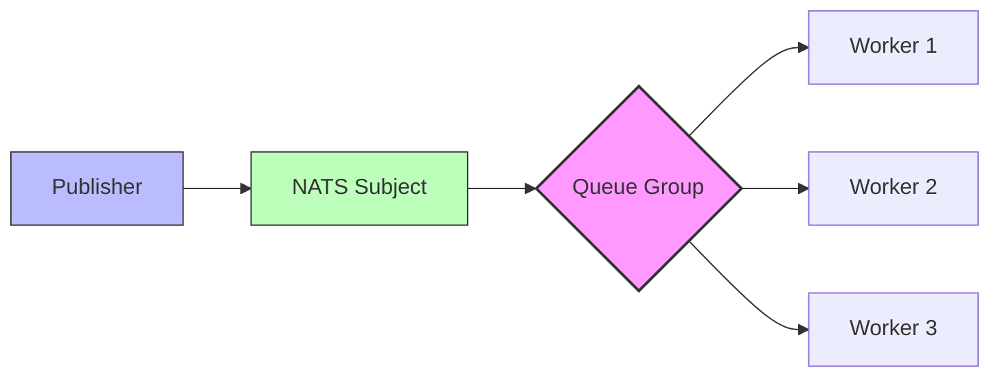
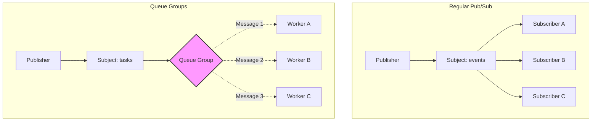
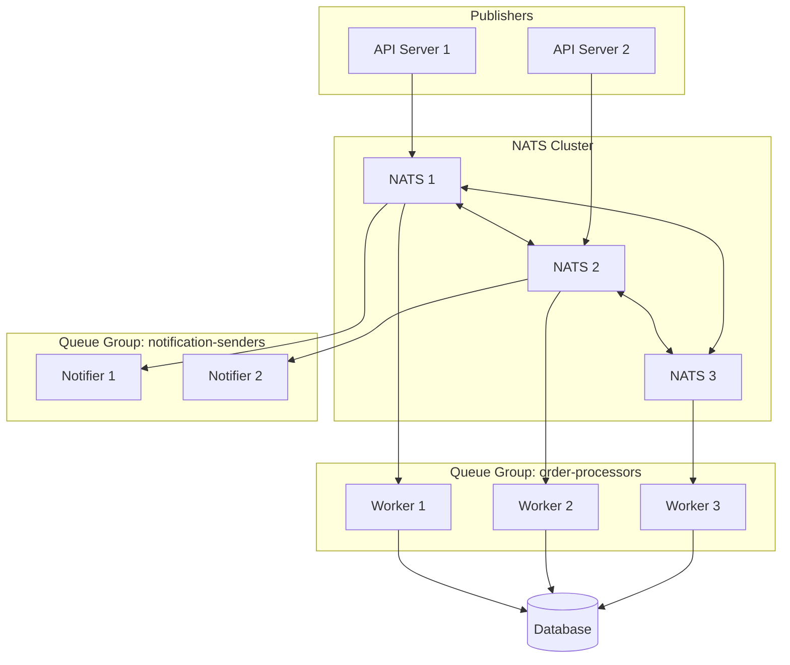

# How to Implement Queue Groups in NATS

Author: [nawazdhandala](https://github.com/nawazdhandala)

Tags: NATS, Messaging, Queue Groups, Distributed Systems, Microservices, Node.js, Go

Description: Learn how to implement queue groups in NATS for load balancing message processing across multiple subscribers. Covers setup, implementation patterns, error handling, and production best practices.

---

NATS provides a lightweight, high-performance messaging system for cloud-native applications. Queue groups allow you to distribute messages among multiple subscribers, ensuring each message is processed by exactly one member of the group. Load balancing happens automatically, making it ideal for scaling microservices horizontally.

## Understanding Queue Groups

Traditional pub/sub messaging delivers every message to every subscriber. Queue groups change this behavior by treating multiple subscribers as a single logical consumer group. NATS routes each message to only one subscriber within the group.



The diagram shows how a single publisher sends messages that NATS distributes across workers in a queue group. Each message reaches exactly one worker.

## Basic Setup

Install the NATS client for your language of choice.

```bash
# Node.js
npm install nats

# Go
go get github.com/nats-io/nats.go

# Python
pip install nats-py
```

## Node.js Implementation

### Publisher

Publishers send messages to a subject without knowing about queue groups. The routing to queue group members is handled entirely by NATS.

```javascript
const { connect } = require('nats');

async function createPublisher() {
  // Connect to NATS server - defaults to localhost:4222
  const nc = await connect({
    servers: process.env.NATS_URL || 'nats://localhost:4222',
  });

  console.log('Publisher connected to NATS');

  // Publish messages to a subject
  // Queue group routing happens on the subscriber side
  async function publishTask(task) {
    // Encode the message as JSON
    const data = JSON.stringify(task);

    // Publish to the 'tasks' subject
    // Any queue group subscribed to 'tasks' will receive this
    nc.publish('tasks', Buffer.from(data));

    console.log(`Published task: ${task.id}`);
  }

  // Example: publish multiple tasks
  for (let i = 1; i <= 10; i++) {
    await publishTask({
      id: `task-${i}`,
      type: 'process-order',
      payload: { orderId: i, amount: Math.random() * 100 },
      timestamp: new Date().toISOString(),
    });
  }

  // Graceful shutdown
  await nc.drain();
  console.log('Publisher disconnected');
}

createPublisher().catch(console.error);
```

### Queue Group Subscriber

Subscribers join a queue group by specifying a group name. NATS automatically load balances messages across all members of the same queue group.

```javascript
const { connect, StringCodec } = require('nats');

async function createWorker(workerId) {
  const nc = await connect({
    servers: process.env.NATS_URL || 'nats://localhost:4222',
  });

  console.log(`Worker ${workerId} connected to NATS`);

  // Create a string codec for message encoding/decoding
  const sc = StringCodec();

  // Subscribe to 'tasks' subject with queue group 'workers'
  // All subscribers with the same queue group name share the messages
  // Each message goes to exactly one member of the group
  const subscription = nc.subscribe('tasks', {
    queue: 'workers',  // Queue group name - this is the key!
  });

  console.log(`Worker ${workerId} subscribed to 'tasks' in queue group 'workers'`);

  // Process messages as they arrive
  for await (const msg of subscription) {
    try {
      // Decode the message
      const task = JSON.parse(sc.decode(msg.data));

      console.log(`Worker ${workerId} processing task: ${task.id}`);

      // Simulate task processing
      await processTask(task);

      console.log(`Worker ${workerId} completed task: ${task.id}`);
    } catch (error) {
      console.error(`Worker ${workerId} failed to process message:`, error);
    }
  }
}

async function processTask(task) {
  // Simulate work with random processing time
  const processingTime = Math.random() * 1000 + 500;
  await new Promise(resolve => setTimeout(resolve, processingTime));
  return task;
}

// Start multiple workers to demonstrate load balancing
const workerId = process.argv[2] || '1';
createWorker(workerId).catch(console.error);
```

Run multiple workers to see load balancing in action:

```bash
# Terminal 1
node worker.js 1

# Terminal 2
node worker.js 2

# Terminal 3
node worker.js 3

# Terminal 4 - Publisher
node publisher.js
```

## Go Implementation

### Publisher

The Go implementation follows the same pattern. Publishers remain unaware of queue groups.

```go
package main

import (
    "encoding/json"
    "fmt"
    "log"
    "os"
    "time"

    "github.com/nats-io/nats.go"
)

// Task represents a work item to be processed
type Task struct {
    ID        string    `json:"id"`
    Type      string    `json:"type"`
    Payload   Payload   `json:"payload"`
    Timestamp time.Time `json:"timestamp"`
}

type Payload struct {
    OrderID int     `json:"orderId"`
    Amount  float64 `json:"amount"`
}

func main() {
    // Get NATS URL from environment or use default
    natsURL := os.Getenv("NATS_URL")
    if natsURL == "" {
        natsURL = nats.DefaultURL
    }

    // Connect to NATS server
    nc, err := nats.Connect(natsURL)
    if err != nil {
        log.Fatal(err)
    }
    defer nc.Close()

    fmt.Println("Publisher connected to NATS")

    // Publish 10 tasks
    for i := 1; i <= 10; i++ {
        task := Task{
            ID:   fmt.Sprintf("task-%d", i),
            Type: "process-order",
            Payload: Payload{
                OrderID: i,
                Amount:  float64(i) * 10.5,
            },
            Timestamp: time.Now(),
        }

        // Serialize task to JSON
        data, err := json.Marshal(task)
        if err != nil {
            log.Printf("Failed to marshal task: %v", err)
            continue
        }

        // Publish to 'tasks' subject
        if err := nc.Publish("tasks", data); err != nil {
            log.Printf("Failed to publish task: %v", err)
            continue
        }

        fmt.Printf("Published task: %s\n", task.ID)
    }

    // Flush to ensure all messages are sent
    if err := nc.Flush(); err != nil {
        log.Fatal(err)
    }

    fmt.Println("All tasks published")
}
```

### Queue Group Subscriber

Workers join a queue group using the QueueSubscribe method. NATS handles load balancing automatically.

```go
package main

import (
    "encoding/json"
    "fmt"
    "log"
    "math/rand"
    "os"
    "os/signal"
    "syscall"
    "time"

    "github.com/nats-io/nats.go"
)

type Task struct {
    ID        string    `json:"id"`
    Type      string    `json:"type"`
    Payload   Payload   `json:"payload"`
    Timestamp time.Time `json:"timestamp"`
}

type Payload struct {
    OrderID int     `json:"orderId"`
    Amount  float64 `json:"amount"`
}

func main() {
    // Get worker ID from command line
    workerID := "1"
    if len(os.Args) > 1 {
        workerID = os.Args[1]
    }

    natsURL := os.Getenv("NATS_URL")
    if natsURL == "" {
        natsURL = nats.DefaultURL
    }

    // Connect to NATS
    nc, err := nats.Connect(natsURL)
    if err != nil {
        log.Fatal(err)
    }
    defer nc.Close()

    fmt.Printf("Worker %s connected to NATS\n", workerID)

    // Subscribe to 'tasks' subject with queue group 'workers'
    // The second argument is the queue group name
    // All subscribers with the same queue group share messages
    _, err = nc.QueueSubscribe("tasks", "workers", func(msg *nats.Msg) {
        var task Task
        if err := json.Unmarshal(msg.Data, &task); err != nil {
            log.Printf("Worker %s failed to unmarshal: %v", workerID, err)
            return
        }

        fmt.Printf("Worker %s processing task: %s\n", workerID, task.ID)

        // Simulate work
        processingTime := time.Duration(rand.Intn(1000)+500) * time.Millisecond
        time.Sleep(processingTime)

        fmt.Printf("Worker %s completed task: %s\n", workerID, task.ID)
    })
    if err != nil {
        log.Fatal(err)
    }

    fmt.Printf("Worker %s subscribed to 'tasks' in queue group 'workers'\n", workerID)

    // Wait for interrupt signal
    sigChan := make(chan os.Signal, 1)
    signal.Notify(sigChan, syscall.SIGINT, syscall.SIGTERM)
    <-sigChan

    fmt.Printf("Worker %s shutting down\n", workerID)
}
```

## Request-Reply with Queue Groups

Queue groups work with request-reply patterns too. Send a request to a subject, and one member of the queue group handles it and sends a reply.

```javascript
const { connect, StringCodec } = require('nats');

// Request-reply server with queue group for load balancing
async function createServer(serverId) {
  const nc = await connect({
    servers: process.env.NATS_URL || 'nats://localhost:4222',
  });

  const sc = StringCodec();

  // Subscribe to 'api.calculate' with queue group 'calculators'
  // Requests are distributed among all servers in the group
  const subscription = nc.subscribe('api.calculate', {
    queue: 'calculators',
  });

  console.log(`Server ${serverId} ready to handle calculations`);

  for await (const msg of subscription) {
    const request = JSON.parse(sc.decode(msg.data));

    console.log(`Server ${serverId} handling: ${JSON.stringify(request)}`);

    // Process the request
    let result;
    switch (request.operation) {
      case 'add':
        result = request.a + request.b;
        break;
      case 'multiply':
        result = request.a * request.b;
        break;
      default:
        result = 'Unknown operation';
    }

    // Send reply back to the requester
    // msg.respond() sends the reply to the inbox specified in the request
    if (msg.reply) {
      msg.respond(Buffer.from(JSON.stringify({
        serverId,
        result,
        processedAt: new Date().toISOString(),
      })));
    }
  }
}

// Client making requests
async function createClient() {
  const nc = await connect({
    servers: process.env.NATS_URL || 'nats://localhost:4222',
  });

  const sc = StringCodec();

  // Make 5 requests - they will be load balanced across servers
  for (let i = 0; i < 5; i++) {
    const request = {
      operation: 'add',
      a: i,
      b: i * 2,
    };

    try {
      // Request with 5 second timeout
      // NATS routes to one server in the 'calculators' queue group
      const response = await nc.request(
        'api.calculate',
        Buffer.from(JSON.stringify(request)),
        { timeout: 5000 }
      );

      const result = JSON.parse(sc.decode(response.data));
      console.log(`Request ${i}: ${request.a} + ${request.b} = ${result.result} (handled by ${result.serverId})`);
    } catch (error) {
      console.error(`Request ${i} failed:`, error.message);
    }
  }

  await nc.drain();
}

// Run as server or client based on command line argument
const mode = process.argv[2];
if (mode === 'server') {
  createServer(process.argv[3] || '1').catch(console.error);
} else {
  createClient().catch(console.error);
}
```

## Message Flow Visualization

Here is how messages flow through NATS with queue groups compared to regular pub/sub:



In regular pub/sub, all three subscribers receive every message. With queue groups, each message goes to exactly one worker.

## Combining Queue Groups with Regular Subscribers

You can have both queue group subscribers and regular subscribers on the same subject. Regular subscribers receive all messages while queue group members share them.

```javascript
const { connect, StringCodec } = require('nats');

async function setup() {
  const nc = await connect({
    servers: process.env.NATS_URL || 'nats://localhost:4222',
  });

  const sc = StringCodec();

  // Regular subscriber - receives ALL messages (for logging/monitoring)
  const auditSub = nc.subscribe('orders');
  (async () => {
    for await (const msg of auditSub) {
      const order = JSON.parse(sc.decode(msg.data));
      console.log(`[AUDIT] Order received: ${order.id}`);
      // Log to audit system, send to analytics, etc.
    }
  })();

  // Queue group subscriber 1 - processes orders (load balanced)
  const worker1Sub = nc.subscribe('orders', { queue: 'processors' });
  (async () => {
    for await (const msg of worker1Sub) {
      const order = JSON.parse(sc.decode(msg.data));
      console.log(`[WORKER-1] Processing order: ${order.id}`);
      await processOrder(order);
    }
  })();

  // Queue group subscriber 2 - also processes orders (load balanced with worker 1)
  const worker2Sub = nc.subscribe('orders', { queue: 'processors' });
  (async () => {
    for await (const msg of worker2Sub) {
      const order = JSON.parse(sc.decode(msg.data));
      console.log(`[WORKER-2] Processing order: ${order.id}`);
      await processOrder(order);
    }
  })();

  // Publish test orders
  for (let i = 1; i <= 4; i++) {
    nc.publish('orders', Buffer.from(JSON.stringify({
      id: `order-${i}`,
      items: ['item-a', 'item-b'],
      total: i * 25.50,
    })));
  }

  // Wait for messages to be processed
  await new Promise(resolve => setTimeout(resolve, 2000));
  await nc.drain();
}

async function processOrder(order) {
  await new Promise(resolve => setTimeout(resolve, 100));
  return order;
}

setup().catch(console.error);
```

Expected output shows the audit subscriber receiving all 4 messages while workers share them:

```
[AUDIT] Order received: order-1
[AUDIT] Order received: order-2
[AUDIT] Order received: order-3
[AUDIT] Order received: order-4
[WORKER-1] Processing order: order-1
[WORKER-2] Processing order: order-2
[WORKER-1] Processing order: order-3
[WORKER-2] Processing order: order-4
```

## Error Handling and Retries

Implement robust error handling for production workloads. Since NATS core does not have built-in message acknowledgment, you need to handle failures at the application level.

```javascript
const { connect, StringCodec } = require('nats');

class WorkerWithRetry {
  constructor(workerId, maxRetries = 3) {
    this.workerId = workerId;
    this.maxRetries = maxRetries;
    this.retryDelay = 1000;  // Start with 1 second
  }

  async start() {
    this.nc = await connect({
      servers: process.env.NATS_URL || 'nats://localhost:4222',
      // Reconnection settings for resilience
      reconnect: true,
      maxReconnectAttempts: -1,  // Unlimited reconnect attempts
      reconnectTimeWait: 2000,   // Wait 2 seconds between attempts
    });

    this.sc = StringCodec();

    // Subscribe to main task queue
    const subscription = this.nc.subscribe('tasks', {
      queue: 'workers',
    });

    console.log(`Worker ${this.workerId} started`);

    for await (const msg of subscription) {
      await this.handleMessage(msg);
    }
  }

  async handleMessage(msg) {
    let task;
    try {
      task = JSON.parse(this.sc.decode(msg.data));
    } catch (error) {
      console.error(`Worker ${this.workerId}: Invalid message format, skipping`);
      // Publish to dead letter queue for investigation
      this.nc.publish('tasks.dlq', msg.data);
      return;
    }

    let attempt = 0;
    let success = false;

    while (attempt < this.maxRetries && !success) {
      attempt++;
      try {
        console.log(`Worker ${this.workerId}: Processing ${task.id} (attempt ${attempt})`);
        await this.processTask(task);
        success = true;
        console.log(`Worker ${this.workerId}: Completed ${task.id}`);
      } catch (error) {
        console.error(`Worker ${this.workerId}: Failed ${task.id} - ${error.message}`);

        if (attempt < this.maxRetries) {
          // Exponential backoff
          const delay = this.retryDelay * Math.pow(2, attempt - 1);
          console.log(`Worker ${this.workerId}: Retrying in ${delay}ms`);
          await new Promise(resolve => setTimeout(resolve, delay));
        }
      }
    }

    if (!success) {
      console.error(`Worker ${this.workerId}: ${task.id} failed after ${this.maxRetries} attempts`);
      // Send to dead letter queue for manual processing
      this.nc.publish('tasks.dlq', Buffer.from(JSON.stringify({
        task,
        error: 'Max retries exceeded',
        failedAt: new Date().toISOString(),
        workerId: this.workerId,
      })));
    }
  }

  async processTask(task) {
    // Simulate occasional failures
    if (Math.random() < 0.3) {
      throw new Error('Random processing failure');
    }
    await new Promise(resolve => setTimeout(resolve, 500));
    return task;
  }

  async stop() {
    if (this.nc) {
      await this.nc.drain();
      console.log(`Worker ${this.workerId} stopped`);
    }
  }
}

// Start worker
const worker = new WorkerWithRetry(process.argv[2] || '1');
worker.start().catch(console.error);

// Graceful shutdown
process.on('SIGTERM', () => worker.stop());
process.on('SIGINT', () => worker.stop());
```

## JetStream for Persistent Queue Groups

NATS JetStream provides persistence, acknowledgments, and replay capabilities. For production workloads requiring guaranteed delivery, use JetStream with durable consumers.

```javascript
const { connect, AckPolicy, DeliverPolicy, StringCodec } = require('nats');

async function setupJetStream() {
  const nc = await connect({
    servers: process.env.NATS_URL || 'nats://localhost:4222',
  });

  const js = nc.jetstream();
  const jsm = await nc.jetstreamManager();
  const sc = StringCodec();

  // Create or update stream for tasks
  // Streams persist messages to disk
  try {
    await jsm.streams.add({
      name: 'TASKS',
      subjects: ['tasks.>'],  // Capture all subjects starting with 'tasks.'
      retention: 'workqueue',  // Messages deleted after acknowledgment
      max_msgs: 100000,        // Maximum messages to retain
      max_age: 24 * 60 * 60 * 1e9,  // 24 hours in nanoseconds
    });
    console.log('Stream TASKS created');
  } catch (error) {
    if (error.message.includes('already exists')) {
      console.log('Stream TASKS already exists');
    } else {
      throw error;
    }
  }

  return { nc, js, jsm, sc };
}

// Publisher with JetStream
async function publishTasks() {
  const { nc, js, sc } = await setupJetStream();

  for (let i = 1; i <= 10; i++) {
    const task = {
      id: `task-${i}`,
      type: 'process',
      data: { value: i * 10 },
    };

    // Publish to JetStream - returns ack with sequence number
    const ack = await js.publish(
      'tasks.process',
      Buffer.from(JSON.stringify(task))
    );

    console.log(`Published task ${task.id}, sequence: ${ack.seq}`);
  }

  await nc.drain();
}

// Consumer with JetStream queue group
async function consumeTasks(consumerId) {
  const { nc, js, sc } = await setupJetStream();

  // Create a durable pull consumer
  // Multiple consumers with the same durable name form a queue group
  const consumer = await js.consumers.get('TASKS', 'task-processors');

  console.log(`Consumer ${consumerId} ready`);

  // Fetch messages in batches
  while (true) {
    try {
      // Pull up to 10 messages with 5 second timeout
      const messages = await consumer.fetch({
        max_messages: 10,
        expires: 5000,
      });

      for await (const msg of messages) {
        const task = JSON.parse(sc.decode(msg.data));
        console.log(`Consumer ${consumerId} processing: ${task.id}`);

        try {
          // Process the task
          await processTask(task);

          // Acknowledge successful processing
          // Message is removed from the stream
          msg.ack();
          console.log(`Consumer ${consumerId} completed: ${task.id}`);
        } catch (error) {
          console.error(`Consumer ${consumerId} failed: ${task.id}`);
          // Negative acknowledgment - message will be redelivered
          msg.nak();
        }
      }
    } catch (error) {
      if (error.message !== 'no messages') {
        console.error('Fetch error:', error);
      }
    }
  }
}

async function processTask(task) {
  await new Promise(resolve => setTimeout(resolve, 500));
  return task;
}

// Run as publisher or consumer
const mode = process.argv[2];
if (mode === 'publish') {
  publishTasks().catch(console.error);
} else {
  consumeTasks(process.argv[3] || '1').catch(console.error);
}
```

## Monitoring Queue Groups

Track queue group health and performance with NATS monitoring endpoints.

```javascript
const http = require('http');

// NATS monitoring endpoint helper
async function getNatsStats(natsMonitoringUrl = 'http://localhost:8222') {
  return new Promise((resolve, reject) => {
    http.get(`${natsMonitoringUrl}/subsz?subs=1`, (res) => {
      let data = '';
      res.on('data', chunk => data += chunk);
      res.on('end', () => {
        try {
          resolve(JSON.parse(data));
        } catch (e) {
          reject(e);
        }
      });
    }).on('error', reject);
  });
}

async function monitorQueueGroups() {
  try {
    const stats = await getNatsStats();

    console.log('=== NATS Subscription Stats ===');
    console.log(`Total subscriptions: ${stats.num_subscriptions}`);
    console.log(`Total queue groups: ${stats.num_cache}`);

    // Parse subscriptions to find queue groups
    const queueGroups = {};

    if (stats.subscriptions_list) {
      for (const sub of stats.subscriptions_list) {
        if (sub.queue) {
          const key = `${sub.subject}:${sub.queue}`;
          if (!queueGroups[key]) {
            queueGroups[key] = {
              subject: sub.subject,
              queue: sub.queue,
              members: 0,
              pending: 0,
            };
          }
          queueGroups[key].members++;
          queueGroups[key].pending += sub.pending_msgs || 0;
        }
      }
    }

    console.log('\n=== Queue Groups ===');
    for (const [key, group] of Object.entries(queueGroups)) {
      console.log(`${group.subject} [${group.queue}]: ${group.members} members, ${group.pending} pending`);
    }
  } catch (error) {
    console.error('Failed to get NATS stats:', error.message);
  }
}

// Run monitoring every 5 seconds
setInterval(monitorQueueGroups, 5000);
monitorQueueGroups();
```

## Production Architecture

A typical production setup with queue groups looks like this:



## Best Practices

Follow these guidelines for production queue group implementations:

**1. Use Descriptive Queue Group Names**

Name queue groups based on their function, not technical details.

```javascript
// Good - describes the purpose
nc.subscribe('orders', { queue: 'order-fulfillment' });
nc.subscribe('notifications', { queue: 'email-senders' });

// Avoid - too generic
nc.subscribe('orders', { queue: 'workers' });
nc.subscribe('notifications', { queue: 'group1' });
```

**2. Implement Health Checks**

Workers should report their health status for orchestration systems.

```javascript
const http = require('http');

class HealthyWorker {
  constructor() {
    this.isHealthy = true;
    this.messageCount = 0;
    this.lastProcessed = null;
  }

  startHealthServer(port = 8080) {
    http.createServer((req, res) => {
      if (req.url === '/health') {
        if (this.isHealthy) {
          res.writeHead(200);
          res.end(JSON.stringify({
            status: 'healthy',
            messageCount: this.messageCount,
            lastProcessed: this.lastProcessed,
          }));
        } else {
          res.writeHead(503);
          res.end(JSON.stringify({ status: 'unhealthy' }));
        }
      } else {
        res.writeHead(404);
        res.end();
      }
    }).listen(port);
  }
}
```

**3. Handle Slow Consumers**

Configure slow consumer handling to prevent message buildup.

```javascript
const nc = await connect({
  servers: 'nats://localhost:4222',
  // Pending message limits
  maxPingOut: 3,              // Disconnect after 3 missed pings
  pingInterval: 30000,        // Ping every 30 seconds
});

// Monitor for slow consumer warnings
nc.on('status', (status) => {
  if (status.type === 'slowConsumer') {
    console.warn('Slow consumer detected, consider scaling workers');
  }
});
```

**4. Use Wildcard Subjects for Flexibility**

Structure subjects hierarchically to allow flexible routing.

```javascript
// Subscribe to all order events in a queue group
nc.subscribe('orders.>', { queue: 'order-handlers' });

// Publish specific events - all go to the same queue group
nc.publish('orders.created', orderData);
nc.publish('orders.updated', orderData);
nc.publish('orders.shipped', orderData);
```

## Summary

| Feature | Description |
|---------|-------------|
| **Queue Groups** | Load balance messages across subscribers |
| **Automatic Routing** | NATS handles distribution, no configuration needed |
| **Request-Reply** | Works with queue groups for load-balanced RPC |
| **Mixed Subscribers** | Combine queue groups with regular pub/sub |
| **JetStream** | Add persistence and acknowledgments |
| **Scaling** | Add/remove workers dynamically |

Queue groups in NATS provide a simple yet powerful way to distribute work across multiple consumers. Combined with JetStream for persistence, they form a robust foundation for building scalable microservices architectures. Start with basic queue groups for stateless workloads, and upgrade to JetStream when you need guaranteed delivery and replay capabilities.
