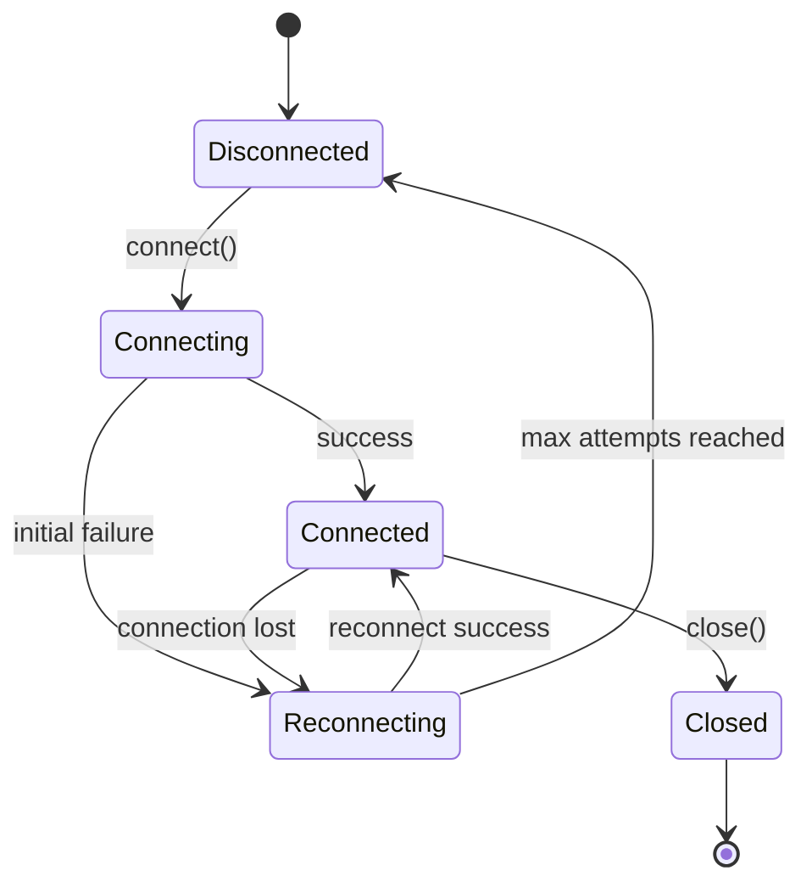
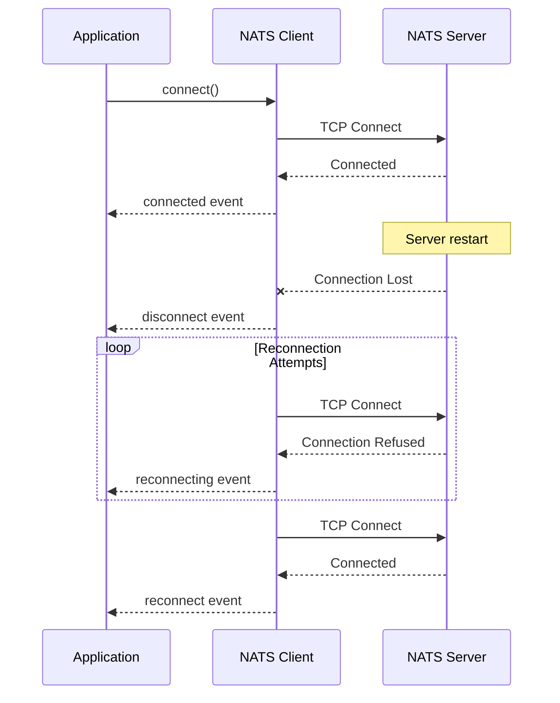
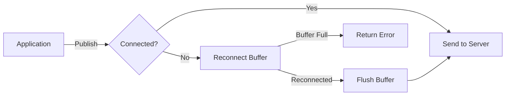
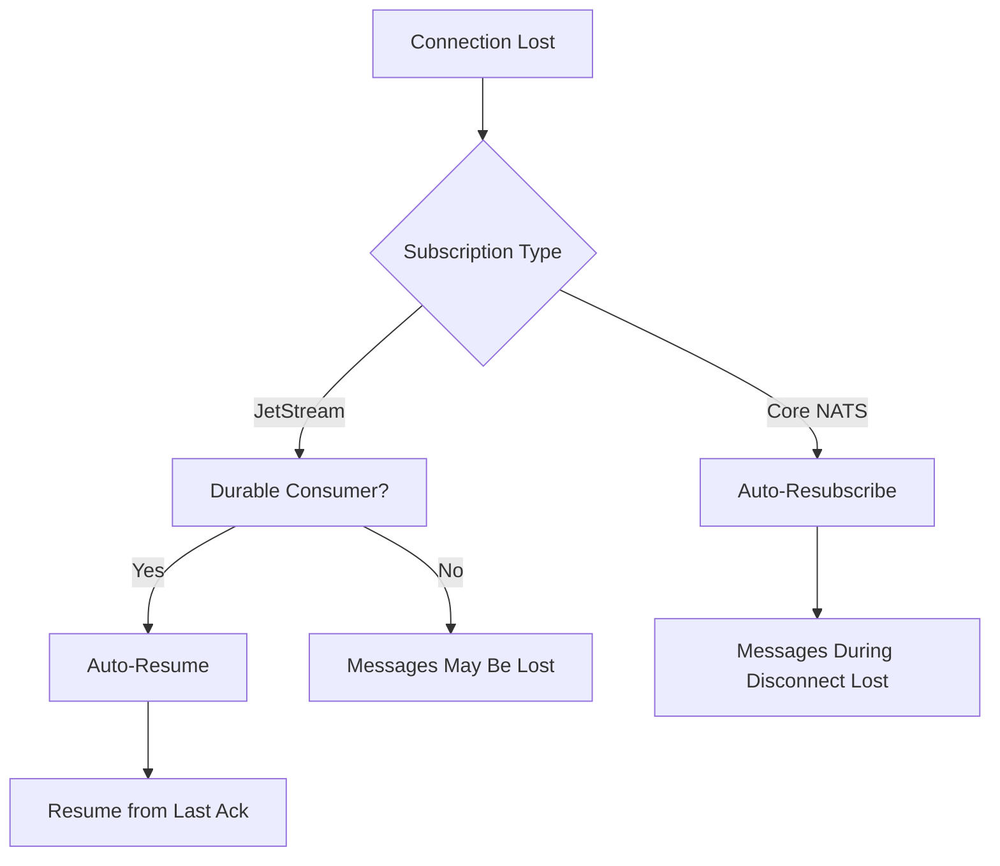
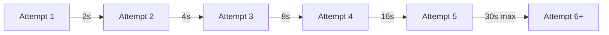

# How to Handle Connection Reconnection in NATS

Author: [nawazdhandala](https://github.com/nawazdhandala)

Tags: NATS, Messaging, Distributed Systems, Node.js, Go, Resilience

Description: Learn how to implement robust connection reconnection strategies in NATS messaging system. Covers automatic reconnection, event handling, buffering during disconnects, and best practices for building resilient applications.

---

NATS is a lightweight, high-performance messaging system designed for cloud-native applications. Network connections can fail for many reasons, including server restarts, network partitions, and load balancer timeouts. Building resilient NATS clients requires proper reconnection handling to ensure your application recovers gracefully from these failures.

## Understanding NATS Connection States

Before diving into reconnection strategies, let's understand the different connection states a NATS client can be in.



The client transitions through these states during its lifecycle. Your application should handle each transition appropriately to maintain reliability.

## Basic Reconnection Configuration

NATS clients have built-in reconnection support. Configure these options when establishing a connection to control reconnection behavior.

### Node.js Configuration

The following example shows how to configure reconnection options in a Node.js application using the official NATS client.

```javascript
const { connect } = require('nats');

async function createNatsConnection() {
  // Configure connection with reconnection options
  const nc = await connect({
    // Multiple servers for failover - client will try each in order
    servers: [
      'nats://server1:4222',
      'nats://server2:4222',
      'nats://server3:4222',
    ],

    // Maximum number of reconnection attempts (-1 for unlimited)
    maxReconnectAttempts: -1,

    // Time to wait between reconnection attempts (milliseconds)
    reconnectTimeWait: 2000,

    // Randomize server order to distribute load after reconnection
    noRandomize: false,

    // Maximum time to wait for initial connection (milliseconds)
    timeout: 10000,

    // Jitter added to reconnect delay to prevent thundering herd
    reconnectJitter: 500,
    reconnectJitterTLS: 1000,

    // Name helps identify this client in server logs
    name: 'my-service',
  });

  return nc;
}
```

### Go Configuration

Go applications use the official nats.go client with similar configuration options. The following example demonstrates comprehensive reconnection settings.

```go
package main

import (
    "log"
    "time"

    "github.com/nats-io/nats.go"
)

func createNatsConnection() (*nats.Conn, error) {
    // Configure connection options
    opts := []nats.Option{
        // Multiple servers for failover
        nats.Servers([]string{
            "nats://server1:4222",
            "nats://server2:4222",
            "nats://server3:4222",
        }),

        // Reconnect forever (-1 means unlimited attempts)
        nats.MaxReconnects(-1),

        // Wait 2 seconds between reconnection attempts
        nats.ReconnectWait(2 * time.Second),

        // Add jitter to prevent all clients reconnecting simultaneously
        nats.ReconnectJitter(500*time.Millisecond, 1*time.Second),

        // Initial connection timeout
        nats.Timeout(10 * time.Second),

        // Client name for server-side identification
        nats.Name("my-service"),

        // Don't close the connection on first error
        nats.DontRandomize(),
    }

    nc, err := nats.Connect(nats.DefaultURL, opts...)
    if err != nil {
        return nil, err
    }

    return nc, nil
}
```

## Handling Connection Events

Responding to connection state changes allows your application to take appropriate actions during reconnection scenarios.



### Node.js Event Handling

Subscribe to connection status events to monitor and react to connection state changes. The status iterator provides real-time updates about connection health.

```javascript
const { connect, Events } = require('nats');

async function setupNatsWithEvents() {
  const nc = await connect({
    servers: ['nats://localhost:4222'],
    maxReconnectAttempts: -1,
    reconnectTimeWait: 2000,
  });

  // Monitor connection status using async iterator
  (async () => {
    for await (const status of nc.status()) {
      switch (status.type) {
        case Events.Disconnect:
          // Connection lost - stop accepting new work
          console.log(`Disconnected from ${status.data}`);
          pauseNewWorkAcceptance();
          break;

        case Events.Reconnect:
          // Connection restored - resume normal operations
          console.log(`Reconnected to ${status.data}`);
          resumeNormalOperations();
          resubscribeIfNeeded();
          break;

        case Events.LDM:
          // Server entered lame duck mode - prepare for disconnect
          console.log('Server entering lame duck mode');
          prepareForDisconnect();
          break;

        case Events.Update:
          // Cluster topology changed - new servers available
          console.log('Cluster update:', status.data);
          break;

        case Events.Error:
          // Connection error occurred
          console.error('Connection error:', status.data);
          notifyOperationsTeam(status.data);
          break;
      }
    }
  })();

  return nc;
}

function pauseNewWorkAcceptance() {
  // Implement logic to stop accepting new tasks
  console.log('Pausing new work acceptance during reconnection');
}

function resumeNormalOperations() {
  // Implement logic to resume accepting tasks
  console.log('Resuming normal operations');
}

function resubscribeIfNeeded() {
  // Resubscribe to subjects if subscriptions were lost
  console.log('Checking subscriptions');
}

function prepareForDisconnect() {
  // Finish current work before server shutdown
  console.log('Preparing for graceful disconnect');
}

function notifyOperationsTeam(error) {
  // Send alert to monitoring system
  console.log('Alerting operations team:', error);
}
```

### Go Event Handling

Go clients use callback functions for connection events. Register these callbacks before connecting to ensure no events are missed.

```go
package main

import (
    "log"
    "sync/atomic"

    "github.com/nats-io/nats.go"
)

// Track connection state for application logic
var isConnected int32 = 0

func createNatsWithCallbacks() (*nats.Conn, error) {
    opts := []nats.Option{
        nats.MaxReconnects(-1),
        nats.ReconnectWait(2 * time.Second),

        // Called when initial connection is established
        nats.ConnectHandler(func(nc *nats.Conn) {
            atomic.StoreInt32(&isConnected, 1)
            log.Printf("Connected to %s", nc.ConnectedUrl())
        }),

        // Called when connection is lost
        nats.DisconnectErrHandler(func(nc *nats.Conn, err error) {
            atomic.StoreInt32(&isConnected, 0)
            if err != nil {
                log.Printf("Disconnected due to error: %v", err)
            } else {
                log.Println("Disconnected from NATS")
            }
            pauseWorkAcceptance()
        }),

        // Called when reconnection succeeds
        nats.ReconnectHandler(func(nc *nats.Conn) {
            atomic.StoreInt32(&isConnected, 1)
            log.Printf("Reconnected to %s", nc.ConnectedUrl())
            resumeWorkAcceptance()
        }),

        // Called when connection is permanently closed
        nats.ClosedHandler(func(nc *nats.Conn) {
            atomic.StoreInt32(&isConnected, 0)
            log.Println("Connection closed permanently")
        }),

        // Called when discovered servers change
        nats.DiscoveredServersHandler(func(nc *nats.Conn) {
            log.Printf("Discovered servers: %v", nc.DiscoveredServers())
        }),

        // Called when server enters lame duck mode
        nats.LameDuckModeHandler(func(nc *nats.Conn) {
            log.Println("Server entering lame duck mode, preparing to disconnect")
            prepareForMigration()
        }),
    }

    return nats.Connect(nats.DefaultURL, opts...)
}

// Check if currently connected before sending messages
func IsConnected() bool {
    return atomic.LoadInt32(&isConnected) == 1
}
```

## Message Buffering During Disconnections

When the connection drops, messages published during the disconnection period could be lost. NATS clients provide a reconnect buffer to temporarily store messages until the connection is restored.



### Configuring the Reconnect Buffer

The reconnect buffer stores published messages during temporary disconnections. Configure the buffer size based on your message volume and acceptable memory usage.

```javascript
const { connect } = require('nats');

async function createBufferedConnection() {
  const nc = await connect({
    servers: ['nats://localhost:4222'],
    maxReconnectAttempts: -1,
    reconnectTimeWait: 2000,

    // Buffer size for messages during reconnection (bytes)
    // Default is 8MB, adjust based on your needs
    reconnectBufSize: 16 * 1024 * 1024, // 16MB buffer

    // Ping interval to detect connection issues faster
    pingInterval: 10000, // 10 seconds

    // Max outstanding pings before considering connection dead
    maxPingOut: 3,
  });

  return nc;
}

// Publish with awareness of connection state
async function safePublish(nc, subject, data) {
  try {
    // Publish returns immediately if connected or buffers if disconnected
    nc.publish(subject, data);

    // For critical messages, wait for confirmation
    await nc.flush();

    return { success: true };
  } catch (error) {
    // Buffer might be full or connection permanently lost
    console.error('Publish failed:', error.message);
    return { success: false, error: error.message };
  }
}
```

### Go Buffering Configuration

Go clients have similar buffering capabilities with additional control over flush behavior.

```go
package main

import (
    "errors"
    "time"

    "github.com/nats-io/nats.go"
)

func createBufferedConnection() (*nats.Conn, error) {
    opts := []nats.Option{
        nats.MaxReconnects(-1),
        nats.ReconnectWait(2 * time.Second),

        // Buffer size for pending messages during reconnection
        // Messages exceeding this will return an error
        nats.ReconnectBufSize(16 * 1024 * 1024), // 16MB

        // Ping configuration for faster failure detection
        nats.PingInterval(10 * time.Second),
        nats.MaxPingsOutstanding(3),

        // Flusher timeout for write operations
        nats.FlusherTimeout(5 * time.Second),
    }

    return nats.Connect(nats.DefaultURL, opts...)
}

// SafePublish publishes with proper error handling
func SafePublish(nc *nats.Conn, subject string, data []byte) error {
    // Check if connection is valid
    if nc == nil || nc.IsClosed() {
        return errors.New("connection is closed")
    }

    // Publish to the subject
    err := nc.Publish(subject, data)
    if err != nil {
        // Could be buffer full or connection error
        return err
    }

    // For critical messages, ensure delivery to server
    return nc.FlushTimeout(5 * time.Second)
}

// PublishAsync publishes without waiting for flush
// Use for high-throughput, non-critical messages
func PublishAsync(nc *nats.Conn, subject string, data []byte) error {
    return nc.Publish(subject, data)
}
```

## Handling Subscription Recovery

Subscriptions automatically reconnect in most cases, but some scenarios require manual intervention. Understanding when to resubscribe ensures your application processes all messages.



### Core NATS Subscription Recovery

Core NATS subscriptions automatically resubscribe after reconnection. However, messages published during the disconnection period are lost.

```javascript
const { connect, StringCodec } = require('nats');

const sc = StringCodec();

async function setupReliableSubscription() {
  const nc = await connect({
    servers: ['nats://localhost:4222'],
    maxReconnectAttempts: -1,
    reconnectTimeWait: 2000,
  });

  // Create subscription with queue group for load balancing
  const sub = nc.subscribe('orders.*', {
    queue: 'order-processors', // Only one in group receives each message
    callback: (err, msg) => {
      if (err) {
        console.error('Subscription error:', err);
        return;
      }

      // Process the message
      const data = sc.decode(msg.data);
      console.log(`Received on ${msg.subject}:`, data);

      // Reply if request-reply pattern
      if (msg.reply) {
        msg.respond(sc.encode(JSON.stringify({ status: 'processed' })));
      }
    },
  });

  // Monitor subscription status
  (async () => {
    for await (const status of nc.status()) {
      if (status.type === 'reconnect') {
        // Subscription is automatically restored
        // But verify it is active
        console.log(`Subscription active: ${!sub.isClosed()}`);
        console.log(`Processed ${sub.getProcessed()} messages`);
      }
    }
  })();

  return { nc, sub };
}
```

### JetStream Durable Consumer Recovery

JetStream consumers with durable names automatically resume from the last acknowledged message after reconnection. Configure consumers properly to avoid message loss.

```javascript
const { connect, AckPolicy, DeliverPolicy } = require('nats');

async function setupJetStreamConsumer() {
  const nc = await connect({
    servers: ['nats://localhost:4222'],
    maxReconnectAttempts: -1,
    reconnectTimeWait: 2000,
  });

  const js = nc.jetstream();
  const jsm = await nc.jetstreamManager();

  // Create a stream if it does not exist
  try {
    await jsm.streams.add({
      name: 'ORDERS',
      subjects: ['orders.*'],
      retention: 'limits',
      max_msgs: 100000,
      max_bytes: 100 * 1024 * 1024, // 100MB
    });
  } catch (e) {
    // Stream might already exist
    if (!e.message.includes('already exists')) {
      throw e;
    }
  }

  // Create a durable consumer
  // Durable consumers survive reconnections and even client restarts
  const consumer = await js.consumers.get('ORDERS', 'order-processor');

  // Or create if it does not exist
  // await jsm.consumers.add('ORDERS', {
  //   durable_name: 'order-processor',
  //   ack_policy: AckPolicy.Explicit,
  //   deliver_policy: DeliverPolicy.All,
  //   max_deliver: 3, // Retry failed messages up to 3 times
  //   ack_wait: 30000, // 30 seconds to acknowledge
  // });

  // Consume messages with automatic reconnection handling
  const messages = await consumer.consume({
    max_messages: 100,
    expires: 30000, // Batch expires after 30 seconds
  });

  (async () => {
    for await (const msg of messages) {
      try {
        // Process the message
        console.log(`Processing order: ${msg.subject}`);

        // Acknowledge successful processing
        msg.ack();
      } catch (error) {
        // Negative acknowledge - message will be redelivered
        msg.nak();
        console.error('Processing failed:', error);
      }
    }
  })();

  return { nc, consumer };
}
```

## Implementing Exponential Backoff

The default reconnection strategy uses fixed delays. Implement exponential backoff for more sophisticated reconnection behavior that reduces load on recovering servers.



### Custom Reconnection Strategy in Go

Go clients support custom reconnection delay functions for implementing exponential backoff.

```go
package main

import (
    "math"
    "math/rand"
    "time"

    "github.com/nats-io/nats.go"
)

func createConnectionWithBackoff() (*nats.Conn, error) {
    // Track reconnection attempts
    attemptCount := 0

    opts := []nats.Option{
        nats.MaxReconnects(-1),

        // Custom reconnect delay with exponential backoff
        nats.CustomReconnectDelay(func(attempts int) time.Duration {
            attemptCount = attempts

            // Base delay of 1 second
            baseDelay := 1 * time.Second

            // Calculate exponential delay: 1s, 2s, 4s, 8s, 16s...
            delay := time.Duration(math.Pow(2, float64(attempts-1))) * baseDelay

            // Cap at 30 seconds maximum
            maxDelay := 30 * time.Second
            if delay > maxDelay {
                delay = maxDelay
            }

            // Add jitter (0-25% of delay) to prevent thundering herd
            jitter := time.Duration(rand.Float64() * 0.25 * float64(delay))
            finalDelay := delay + jitter

            log.Printf("Reconnection attempt %d, waiting %v", attempts, finalDelay)
            return finalDelay
        }),

        // Reset attempt counter on successful reconnect
        nats.ReconnectHandler(func(nc *nats.Conn) {
            log.Printf("Reconnected after %d attempts", attemptCount)
            attemptCount = 0
        }),
    }

    return nats.Connect(nats.DefaultURL, opts...)
}
```

### Node.js Custom Backoff Implementation

Node.js clients can implement backoff logic in the status handler since direct delay customization is not available.

```javascript
const { connect } = require('nats');

class NatsConnectionManager {
  constructor(config) {
    this.config = config;
    this.nc = null;
    this.attemptCount = 0;
    this.baseDelay = 1000; // 1 second
    this.maxDelay = 30000; // 30 seconds
  }

  async connect() {
    try {
      this.nc = await connect({
        servers: this.config.servers,
        maxReconnectAttempts: 1, // We handle retries manually
        reconnectTimeWait: 1000,
      });

      this.attemptCount = 0;
      this.setupEventHandlers();
      return this.nc;
    } catch (error) {
      return this.handleConnectionFailure(error);
    }
  }

  setupEventHandlers() {
    (async () => {
      for await (const status of this.nc.status()) {
        if (status.type === 'disconnect') {
          this.handleDisconnect();
        } else if (status.type === 'reconnect') {
          this.attemptCount = 0;
          console.log('Reconnected successfully');
        }
      }
    })();
  }

  async handleDisconnect() {
    console.log('Disconnected, starting reconnection with backoff');
    await this.reconnectWithBackoff();
  }

  async handleConnectionFailure(error) {
    console.error('Connection failed:', error.message);
    await this.reconnectWithBackoff();
  }

  async reconnectWithBackoff() {
    while (true) {
      this.attemptCount++;

      // Calculate exponential delay with jitter
      const exponentialDelay = Math.min(
        this.baseDelay * Math.pow(2, this.attemptCount - 1),
        this.maxDelay
      );
      const jitter = Math.random() * 0.25 * exponentialDelay;
      const delay = exponentialDelay + jitter;

      console.log(`Attempt ${this.attemptCount}, waiting ${Math.round(delay)}ms`);

      await this.sleep(delay);

      try {
        this.nc = await connect({
          servers: this.config.servers,
          maxReconnectAttempts: 1,
        });

        this.attemptCount = 0;
        this.setupEventHandlers();
        console.log('Reconnected successfully');
        return this.nc;
      } catch (error) {
        console.error(`Reconnection attempt ${this.attemptCount} failed:`, error.message);
      }
    }
  }

  sleep(ms) {
    return new Promise(resolve => setTimeout(resolve, ms));
  }

  async close() {
    if (this.nc) {
      await this.nc.drain();
    }
  }
}

// Usage
const manager = new NatsConnectionManager({
  servers: ['nats://localhost:4222'],
});

await manager.connect();
```

## Health Checks and Connection Monitoring

Implement health checks to monitor connection status and expose metrics for observability systems.

```javascript
const { connect } = require('nats');

class NatsHealthMonitor {
  constructor(nc) {
    this.nc = nc;
    this.metrics = {
      connected: false,
      lastConnectedAt: null,
      lastDisconnectedAt: null,
      reconnectCount: 0,
      messagesPublished: 0,
      messagesFailed: 0,
    };

    this.startMonitoring();
  }

  startMonitoring() {
    (async () => {
      for await (const status of this.nc.status()) {
        switch (status.type) {
          case 'connect':
            this.metrics.connected = true;
            this.metrics.lastConnectedAt = new Date();
            break;
          case 'disconnect':
            this.metrics.connected = false;
            this.metrics.lastDisconnectedAt = new Date();
            break;
          case 'reconnect':
            this.metrics.connected = true;
            this.metrics.lastConnectedAt = new Date();
            this.metrics.reconnectCount++;
            break;
        }
      }
    })();
  }

  // Health check endpoint for Kubernetes probes
  getHealth() {
    const stats = this.nc.stats();

    return {
      status: this.metrics.connected ? 'healthy' : 'unhealthy',
      connected: this.metrics.connected,
      server: this.nc.getServer(),
      lastConnectedAt: this.metrics.lastConnectedAt,
      lastDisconnectedAt: this.metrics.lastDisconnectedAt,
      reconnectCount: this.metrics.reconnectCount,
      stats: {
        inMsgs: stats.inMsgs,
        outMsgs: stats.outMsgs,
        inBytes: stats.inBytes,
        outBytes: stats.outBytes,
      },
    };
  }

  // Liveness check - is the client running
  isAlive() {
    return !this.nc.isClosed();
  }

  // Readiness check - can the client handle requests
  isReady() {
    return this.metrics.connected && !this.nc.isDraining();
  }

  // Prometheus-style metrics
  getPrometheusMetrics() {
    const stats = this.nc.stats();

    return `
# HELP nats_client_connected Connection status (1 = connected, 0 = disconnected)
# TYPE nats_client_connected gauge
nats_client_connected ${this.metrics.connected ? 1 : 0}

# HELP nats_client_reconnect_total Total number of reconnections
# TYPE nats_client_reconnect_total counter
nats_client_reconnect_total ${this.metrics.reconnectCount}

# HELP nats_client_messages_in_total Total messages received
# TYPE nats_client_messages_in_total counter
nats_client_messages_in_total ${stats.inMsgs}

# HELP nats_client_messages_out_total Total messages sent
# TYPE nats_client_messages_out_total counter
nats_client_messages_out_total ${stats.outMsgs}

# HELP nats_client_bytes_in_total Total bytes received
# TYPE nats_client_bytes_in_total counter
nats_client_bytes_in_total ${stats.inBytes}

# HELP nats_client_bytes_out_total Total bytes sent
# TYPE nats_client_bytes_out_total counter
nats_client_bytes_out_total ${stats.outBytes}
    `.trim();
  }
}

// Express health endpoints example
const express = require('express');
const app = express();

let healthMonitor;

app.get('/health', (req, res) => {
  const health = healthMonitor.getHealth();
  const statusCode = health.status === 'healthy' ? 200 : 503;
  res.status(statusCode).json(health);
});

app.get('/health/live', (req, res) => {
  if (healthMonitor.isAlive()) {
    res.status(200).send('OK');
  } else {
    res.status(503).send('Not Alive');
  }
});

app.get('/health/ready', (req, res) => {
  if (healthMonitor.isReady()) {
    res.status(200).send('OK');
  } else {
    res.status(503).send('Not Ready');
  }
});

app.get('/metrics', (req, res) => {
  res.set('Content-Type', 'text/plain');
  res.send(healthMonitor.getPrometheusMetrics());
});
```

## Best Practices Summary

Following these best practices ensures your NATS applications handle reconnection scenarios gracefully.

| Practice | Description |
|----------|-------------|
| **Multiple Servers** | Configure multiple NATS servers for automatic failover |
| **Unlimited Retries** | Set maxReconnectAttempts to -1 for persistent reconnection |
| **Exponential Backoff** | Implement backoff to avoid overwhelming recovering servers |
| **Add Jitter** | Randomize reconnection delays to prevent thundering herd |
| **Buffer Configuration** | Size reconnect buffer based on expected message volume |
| **Event Handlers** | Implement handlers for all connection events |
| **Durable Consumers** | Use JetStream durable consumers for guaranteed delivery |
| **Health Monitoring** | Expose health endpoints for Kubernetes probes |
| **Graceful Shutdown** | Drain connections before shutting down to process pending messages |

## Graceful Shutdown Implementation

Always drain connections before shutting down to ensure pending messages are processed and subscriptions are cleanly closed.

```javascript
const { connect } = require('nats');

let nc;

async function shutdown(signal) {
  console.log(`Received ${signal}, starting graceful shutdown`);

  if (nc) {
    // Drain ensures all pending messages are processed
    // and subscriptions are properly closed
    console.log('Draining NATS connection...');
    await nc.drain();
    console.log('NATS connection drained');
  }

  process.exit(0);
}

// Handle termination signals
process.on('SIGTERM', () => shutdown('SIGTERM'));
process.on('SIGINT', () => shutdown('SIGINT'));

async function main() {
  nc = await connect({
    servers: ['nats://localhost:4222'],
    maxReconnectAttempts: -1,
  });

  // Your application logic here
  console.log('Application running, press Ctrl+C to exit');
}

main().catch(console.error);
```

Building resilient NATS applications requires proper connection handling, event monitoring, and graceful degradation during outages. By implementing the patterns shown in this guide, your applications will maintain reliability even when facing network issues or server restarts.
